# vLLM PD分离方案浅析

**Author:** kaiyuan

**Date:** 2025-05-06

**Link:** https://zhuanlan.zhihu.com/p/1889243870430201414

在LLM推理计算中Prefill和[Decode](https://zhida.zhihu.com/search?content_id=255722900&content_type=Article&match_order=1&q=Decode&zhida_source=entity)两个阶段的计算/显存/带宽需求不一样，通常Prefill是算力密集，Decode是访存密集。一些场景中P和D两者分开计算可提升性能。[vLLM](https://zhida.zhihu.com/search?content_id=255722900&content_type=Article&match_order=1&q=vLLM&zhida_source=entity)是一种主流的推理框架，本文主要围绕其PD分离场景做讨论。

PD分离方法出现的简单推演:

先是有整体部署的方案:一个推理服务实例里面起一个模型，适合数据长度固定场景，推理服务可通过增加batch size提升吞吐/性能。但这种方式对于[Transformer架构](https://zhida.zhihu.com/search?content_id=255722900&content_type=Article&match_order=1&q=Transformer%E6%9E%B6%E6%9E%84&zhida_source=entity)（里面包含自回归计算过程）效率却并不高。为了提升资源效率，在大语言模型中设计出了[KV cache](https://zhida.zhihu.com/search?content_id=255722900&content_type=Article&match_order=1&q=KV+cache&zhida_source=entity)减少重复计算，模型计算过程能拆成两步:prefill（一次运算，算力消耗大）、decode（自回归多次迭代，存储密集）；这两个过程如果放一个实例（硬件资源固定）中会出现P阶段显存利用率低、D阶段算力使用不高的问题，为了进一步提升系统效率又衍生出了P和D分开计算的解决方法。

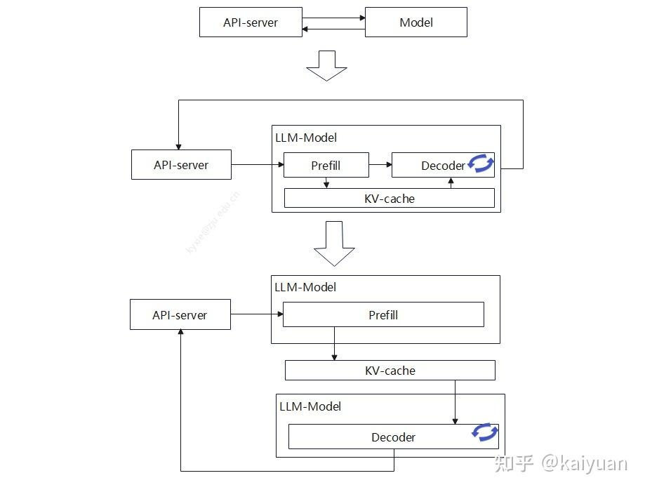

## 1 vLLM PD分离方案现状

开源的vLLM0.8.x版本的PD分离功能依靠KV transfer来完成（代码[PR](https://link.zhihu.com/?target=https%3A//github.com/vllm-project/vllm/pull/10502)），能够支持1P1D场景的运行。其工作关键:顺序执行P和D计算；用一个[kv transfer](https://zhida.zhihu.com/search?content_id=255722900&content_type=Article&match_order=1&q=kv+transfer&zhida_source=entity)线程交换kv cache信息;通过proxy控制交互过程。软件流程图如下所示。

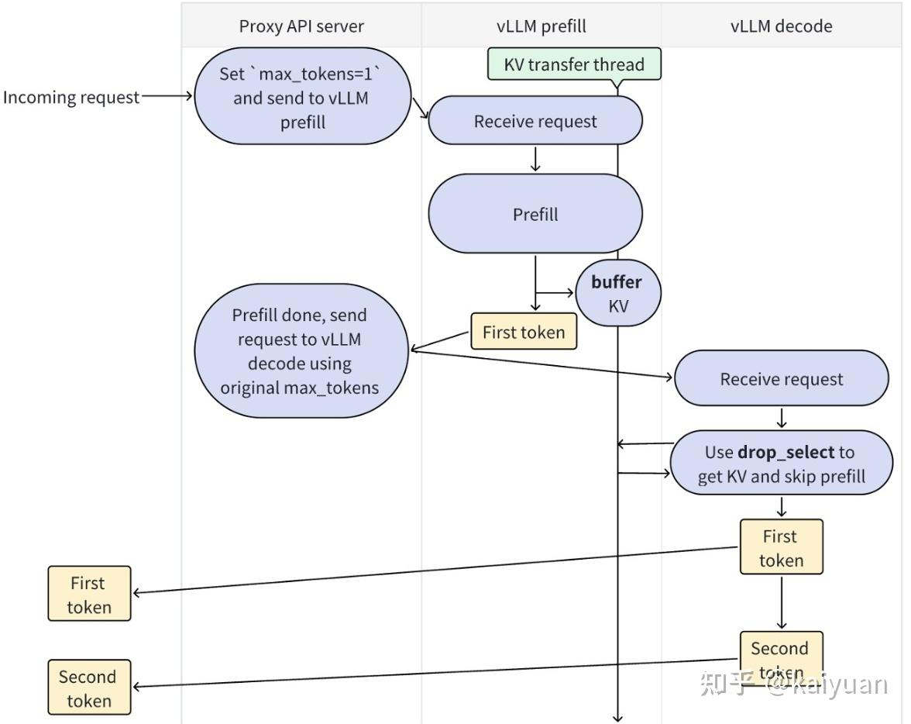

这种方式是一种生产者（producer）和消费者（consumer）模式，P将运算完成的kv值以非阻塞的方式插入buffer中，D通过阻塞模式去获取buffer中的kv值。buffer是双端队列（LookupBuffer），buffer之间的数据传递需要通过pipe完成，主要是解决远端数据传递（[Remote transfer](https://zhida.zhihu.com/search?content_id=255722900&content_type=Article&match_order=1&q=Remote+transfer&zhida_source=entity) ），pipe可选择pynccl或者mooncacke store。

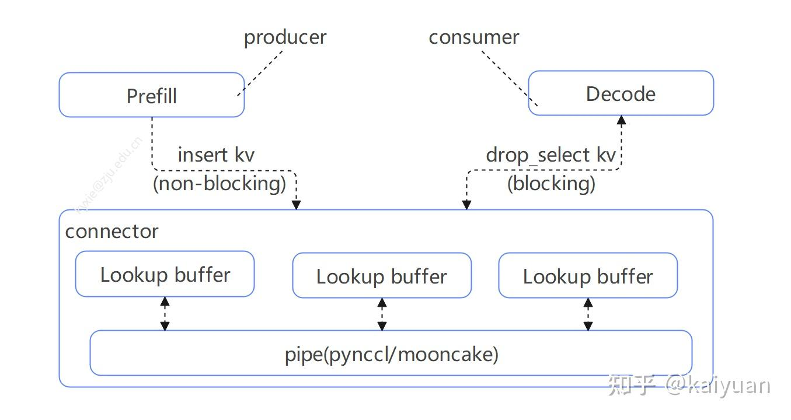

方案当前比较简洁，所以操作（部署）比较简单。代码实现上只需要把transfer配置传递给LLM，P与D基本相同，区别在于rank信息不一样，参考（vllm/examples/offline\_inference/disaggregated\_prefill.py）：

```python
# 相同的输入
   prompts = [
        "Hello, my name is",
        "Hi, your name is",
        "Tell me a very long story",
    ]
    sampling_params = SamplingParams(temperature=0, top_p=0.95)

# prefill 运算
    ktc = KVTransferConfig.from_cli(
        '{"kv_connector":"PyNcclConnector","kv_role":"kv_producer","kv_rank":0,"kv_parallel_size":2}'
    )

    llm = LLM(model="meta-llama/Meta-Llama-3.1-8B-Instruct",
              kv_transfer_config=ktc,
              max_model_len=2000,
              gpu_memory_utilization=0.8)

    llm.generate(prompts, sampling_params)
    print("Prefill node is finished.")
    prefill_done.set()

#  decoder 运算：
    ktc = KVTransferConfig.from_cli(
        '{"kv_connector":"PyNcclConnector","kv_role":"kv_consumer","kv_rank":1,"kv_parallel_size":2}'
    )
    llm = LLM(model="meta-llama/Meta-Llama-3.1-8B-Instruct",
              kv_transfer_config=ktc,
              max_model_len=2000,
              gpu_memory_utilization=0.8)
    prefill_done.wait()
    outputs = llm.generate(prompts, sampling_params)
```

总体来看功能处于探索阶段，所以支持功能比较少，比如xPyD、TP/PP、Chunk Prefill等，其调度未考虑负载均衡、集群性能等问题（V1版本上适配讨论中）。

## 2 设计需要考虑的问题

PD分离设计时需要考虑一些问题：

| 关键点 | 内容 | 说明 |
| --- | --- | --- |
| a) PD配比与数量 | a1) PD分离与融合的选择？ | 根据场景开启PD分离，P与D分离不一定是最优解，如调用频次低，短序列请求，需要考虑PD融合部署。 |
|   | a2) PD分离时的配比？ | 由于场景的不一样，P或者D的需求量会变化，如何选择初始场景？ |
|   | a3) 实例是否支持扩容/缩容？ | 集群管理时提升整体收益 |
|   | a4) P与D之间是否可以角色互换? | 如当P实例闲置、D实例资源紧张时，考虑降P转换成D，反之亦然。 |
| b) 请求分配/调度 | b1) 调度的亲和性 | 如何减小计算相关的P和D之间的通信链路？ |
|   | b2) 负载均衡 | 多P多D的情况下，不同实例之间负载不一样，需要让实例间负载尽量均衡 |
|   | b3) 网络均衡 | 如P计算完成后其KV-cache往那边同步，是否会造成网络阻塞？如何平衡计算与网络的负载均衡？ |
|   | b4) batch批分配策略 | 一般：P单/小batch，D多batch； |
| c) kv-store的结构设计 | c1) 存储介质 | HBM（显存）、内存、本地（SSD）、远端存储（OBS/S3） |
|   | c2) 传输方式（H2D/D2H/D2D） | 用RDMA（NCCL/HCCL/GLOO）、还是采用TCP/RPC？ |
| d) Reuse cache | d1) 存储位置？ | cache选择什么存储介质？比如选择显存，速度快但空间小； |
|   | d2) save/load模式选择，PD开启的策略？ | KV-Cache 往存储上面写遵循什么原则？P与D同时写？还是只有P保存？考虑P阶段: 减少KV-cache的生成；D阶段减少KV-cache的传输； |
|   | d3) 构建范围 | 是否支持跨节点全局共享？ |
|   | d4）淘汰策略 | 当cache超出存储上限时，如何处理？ LRU算法？ |
| e) 可靠性 | e1) PD实例故障 | 当部分P/D实例出现故障时，如何恢复或者保证整体稳定？ |
|   | e2) 调度请求设计 | PD分离增加了网络出错的概率，如何加强控制链路的健壮性？ |
| 其它 | First Token的处理 | prefill是否需要完成LM-head的计算？ |
|   | 超长序列 | 系统架构是否能够处理超长序列，还是考虑采用多种应对模式？ |
| <未完待补充> |   |   |

## 3 现有/可行方案的分析讨论

### 3.1 [Connector-Base 方案](https://zhida.zhihu.com/search?content_id=255722900&content_type=Article&match_order=1&q=Connector-Base+%E6%96%B9%E6%A1%88&zhida_source=entity)

<该方案是社区讨论方案，更新时间（2025/3/25） [在线文档](https://link.zhihu.com/?target=https%3A//docs.google.com/document/d/1uPGdbEXksKXeN4Q9nUm9hzotqEjQhYmnpAhidLuAsjk/edit%3Ftab%3Dt.0%23heading%3Dh.z11h6wpmv17d)\>

每个vLLM进程都创建一个connector链接器，然后创建两类connector分别配置到scheduler、worker上面。

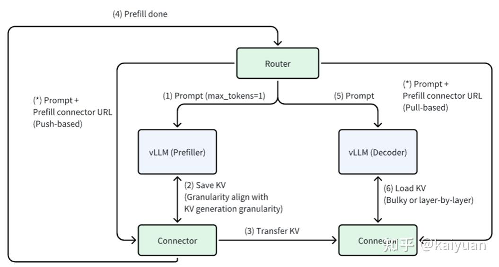

-   Scheduler connector: 它负责调度KV缓存传输操作，决定哪些标记（tokens）需要从连接器加载KV缓存，或者将KV缓存保存到连接器。与调度器同进程；
-   Worker connector: 负责kv cache传输操作，与worker同进程。

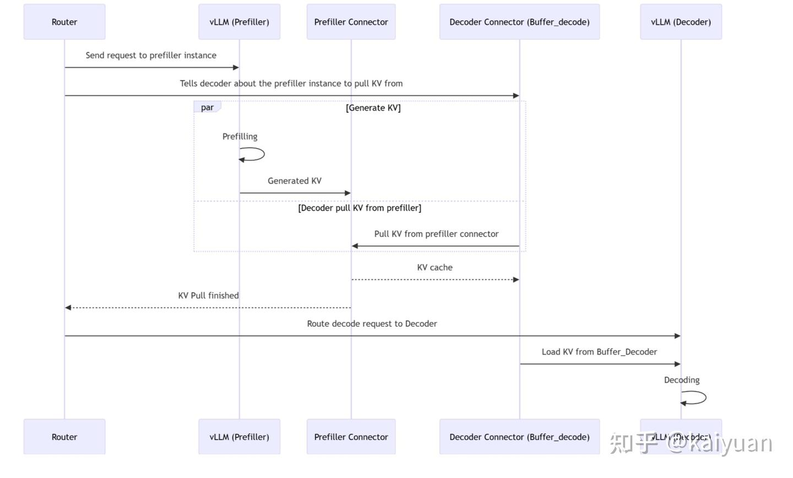

异步传输执行步骤：

■ Step 1: router发送prefill请求到prefiller实例

■ Step 2: router 通知prefiller\_connector给哪个decoder发送数据；

-   Step 3: Prefiller运行P运算，并且把结果存到P connector的buffer里面
-   Step 4: Prefiller发送(pushes) KV cache到D\_connector

step3和step4并行执行:

■ Step 5: D connector通知P connector已获得KV cache值

■ Step 6: P connector通知router，KV完成了push操作

■ Step 7: router发送decode请求到decoder实例

■ Step 8: decoder实例从D connector的buffer加载KV cache

■ Step 9: 运行decode计算。

**Scheduler相关侧的代码修改：**

-   connector携带状态（stateful）；
-   connector可以调用allocate\_slots和freee；

将 `allocate_slots` 和 `free` 函数传递给连接器，以便其能够为键值对（KV）缓存传输预留 GPU 缓冲区。这使得连接器能够透明地将外部键值对缓存注入到 GPU 中，并将其作为前缀缓存块，从而使调度器可以将它们视为普通的前缀缓存块进行处理。

改动点：get\_computed\_blocks

```text
# In get_computed_blocks, we call the connector at the scheduler side (we call it scheduler 
# connector) to determine the KV cache of what tokens need to be loaded from the connector:
 def get_computed_blocks(
            self, request: Request) -> tuple[list[KVCacheBlock], int]

        # After querying the GPU prefix cache
        computed_blocks, num_computed_tokens = self.connector.get_external_prefix_cache_blocks(
            request,
            computed_blocks,
            num_computed_tokens,
        )

        return computed_blocks, num_computed_tokens
```

-   改动点：scheduler\_output

```text
"""
	Before returning the scheduler output, we call the scheduler connector to:
	calculate the KV cache of which tokens need to be saved to the connector
	and prepare the metadata to tell the worker connector the KV cache of what tokens need to be saved / loaded.
"""
        scheduler_output = SchedulerOutput(
            scheduled_new_reqs=new_reqs_data,
            scheduled_cached_reqs=resumed_reqs_data + running_reqs_data,
            num_scheduled_tokens=num_scheduled_tokens,
            total_num_scheduled_tokens=total_num_scheduled_tokens,
            scheduled_spec_decode_tokens=scheduled_spec_decode_tokens,
            scheduled_encoder_inputs=scheduled_encoder_inputs,
```

**Worker侧相关侧的代码修改：**

-   在模型运行之前异步加载所有层的键值对（KV），在模型运行之后等待所有层的键值对保存完成。
-   在attention操作中，在执行attention之前检查该层的键值对是否加载完成，并在注意力操作之后发起键值对缓存的保存
-   改动点：gpu\_model\_runner.py

```text
# In gpu_model_runner.py, prepare the worker connector’s input in _prepare_inputs()
    def _prepare_inputs(
        self,
        scheduler_output: "SchedulerOutput",
    ) -> tuple[FlashAttentionMetadata, torch.Tensor,
               Optional[SpecDecodeMetadata]]:
        # This will reset the state of connector
        self.connector.parse_connector_meta(scheduler_output.connector_meta)

        ......

        # Run the decoder.
        # Use persistent buffers for CUDA graphs.
        with set_forward_context(attn_metadata, self.vllm_config, self.connector):
            hidden_states = self.model(
                input_ids=input_ids,
                positions=positions,
                intermediate_tensors=intermediate_tensors,
                inputs_embeds=inputs_embeds,)
```

-   改动点：forward\_context.py/set\_forward\_context()

```text
"""
In forward_context.py/set_forward_context(), asynchronously fire KV cache load operation layer-by-layer 
before model execution, and blocking wait for the KV cache save operation after model execution:
"""
    connector.start_load_kv_async(static_forward_context)

    try:
        yield
    finally:

        connector.wait_for_save_kv()
```

-   改动点：vllm/attention/layer.py

```text
# In vllm/attention/layer.py: check for load before attn and async save after attn:
                forward_context: ForwardContext = get_forward_context()
                attn_metadata = forward_context.attn_metadata
                self_kv_cache = self.kv_cache[forward_context.virtual_engine]
                forward_context.connector.wait_for_load_kv(self)
                self.impl.forward(self,
                                  query,
                                  key,
                                  value,
                                  self_kv_cache,
                                  attn_metadata,
                                  output=output)
                forward_context.connector.start_save_kv_async(self)
```

**V1版本的适配考虑**

解决方案（Woosuk）：

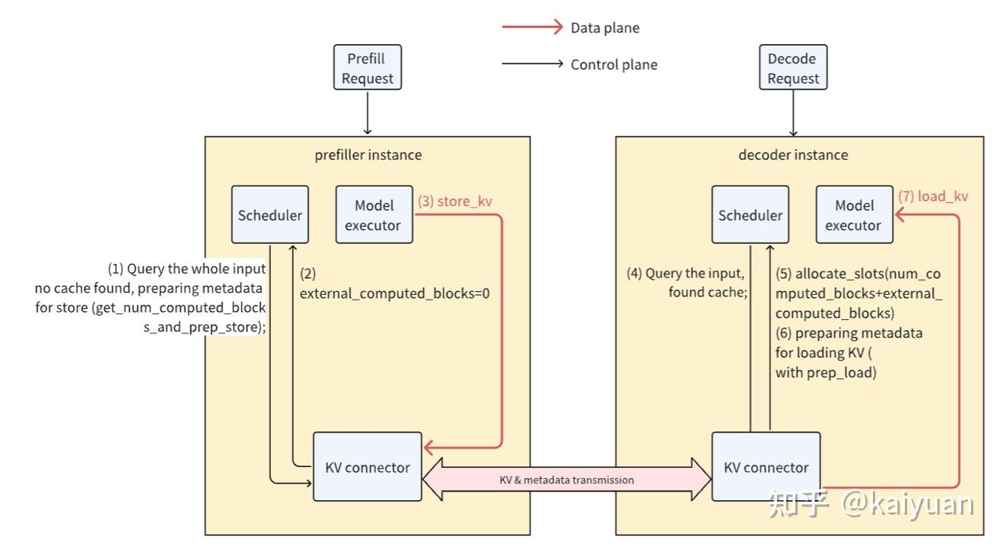

这个方案是在P和D上各创建一个scheduler。优势：更好适配Chunked prefill + disaggregated prefill。不足：需要维护两类scheduler。

### 3.2 英伟达Dynamo方案

Dynamo架构分为内外两层：外层根据全局资源的情况完成请求的分发，内层以PD分离为基础构造实例。Dynamo通过KV Cache为核心链接内、外层，系统架构图如下：

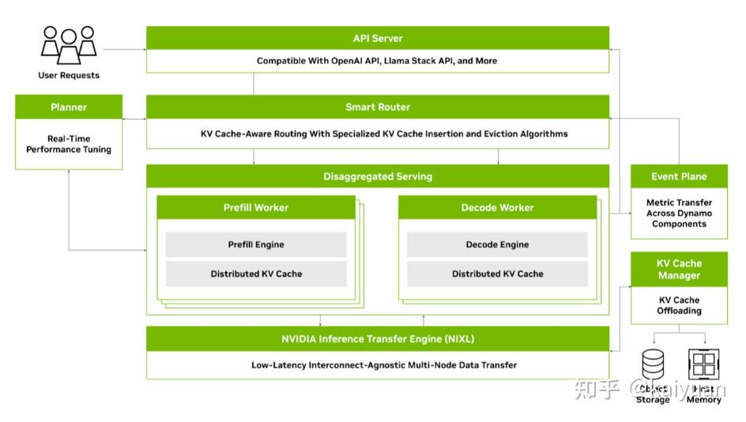

**运行逻辑**

外层运行逻辑：http请求接受、分发请求、P/D计算、请求返回，外层需要处理全局计算资源。关键要素：

-   **前端(Frontend)**：采用OpenAI类似http请求服务，响应用户请求；
-   **路由(Router)**：根据一定的策略，把前端请求分配到不同worker。
-   **处理单元(Workers)**: 有prefill/decode两种worker处理LLM计算逻辑

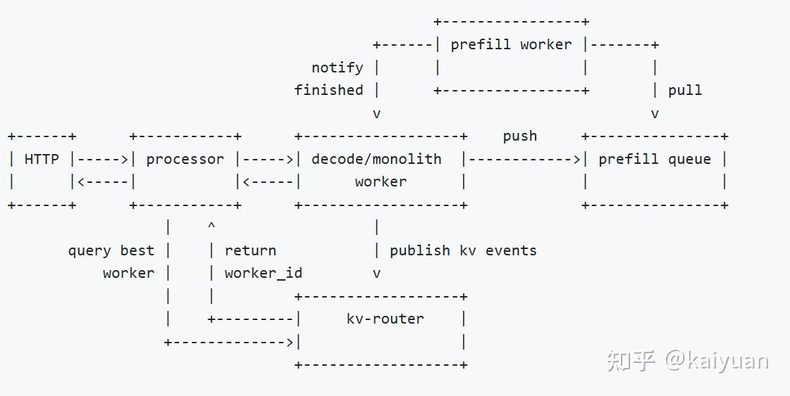

部署示意图

请求分配到woker id后到进入分离式服务（disaggregation server），decode和prefill在不同worker中，他们之间通过KV block完成信息交互，两种work之间交互处理流程如下图所示。

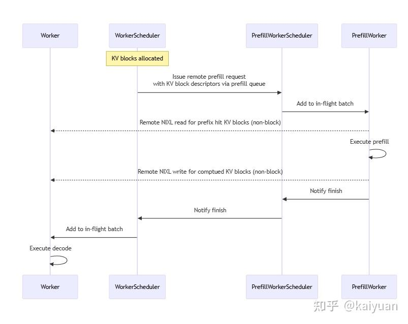

Dynamo运行高效的一个关键是借助了NIXL来提速。

> The key to high-performance disaggregation is efficient KV transfer. Dynamo leverage NIXL to transfer KV cache directly from the VRAM of prefill engine to the VRAM of decode engine. In addition, the KV transfer is non-blocking, allowing GPU forward pass to serve other requests in addition to the KV transfer.

在P与D之间有个队列（Queue）主要用于负载均衡（当存在远端交互时），流程图如下所示，

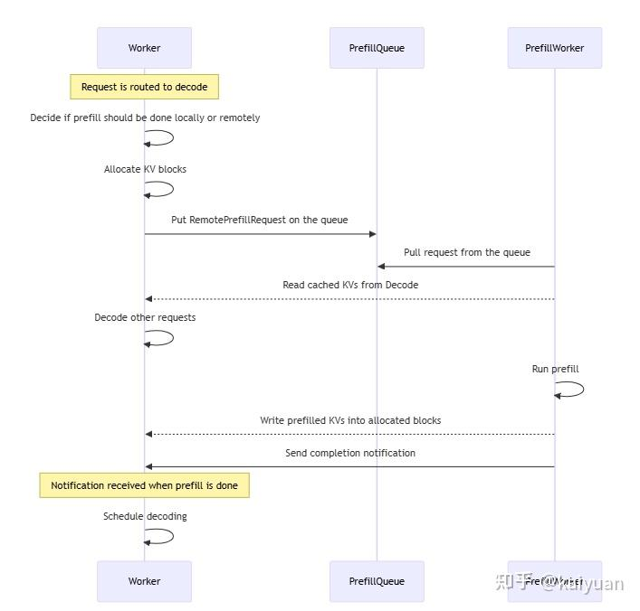

-   步骤1：当worker收到一个请求时，它首先决定是否在本地还是远程进行prefill处理，并分配KV block。如果是在远程进行计算，它会将一个远程prefill请求推送到预填充队列（prefillQueue）中。
-   步骤2：P worker然后从prefillQueue拉取请求，读取KV block，并计算prefill内容，并将计算后的block值写回。
-   步骤3：Decode worker完成剩余的解码工作。

### 3.3 Mooncake集成方案

mooncake是PD分离应用比较早也是规模比较大的成功例子，关键核心是构建了一个KVCache为中心的解决方案。**Transfer Engine** 支持 TCP、RDMA（InfiniBand/RoCEv2/eRDMA/NVIDIA GPUDirect）和 NVMe - over - Fabric（NVMe - of）协议，提供从 DRAM、VRAM 或 NVMe 转移数据的统一接口，隐藏与硬件相关的技术细节。

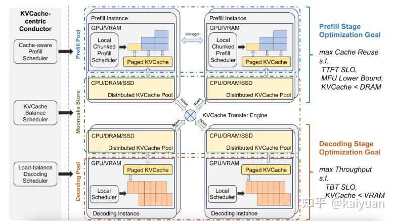

Mooncake Store（Mooncake 存储）：基于 Transfer Engine，为 LLM 推理提供分布式 KVCache 存储引擎，提供对象级 API（`Put`、`Get` 和 `Remove`）。方案中的put()和get()操作，具体如下：put()操作涉及将KV缓存从GPU分页缓存传输到推理机的本地DRAM中。get()操作包括两个步骤。在第一步中，当vLLM前端接收到请求时，它会向Mooncake Store发送一个拉取请求，以异步方式将KV缓存拉取到其本地DRAM中。在第二步中，在将请求添加到运行队列之前，KV缓存会从本地DRAM传输到GPU分页缓存。整体工作流程如下：

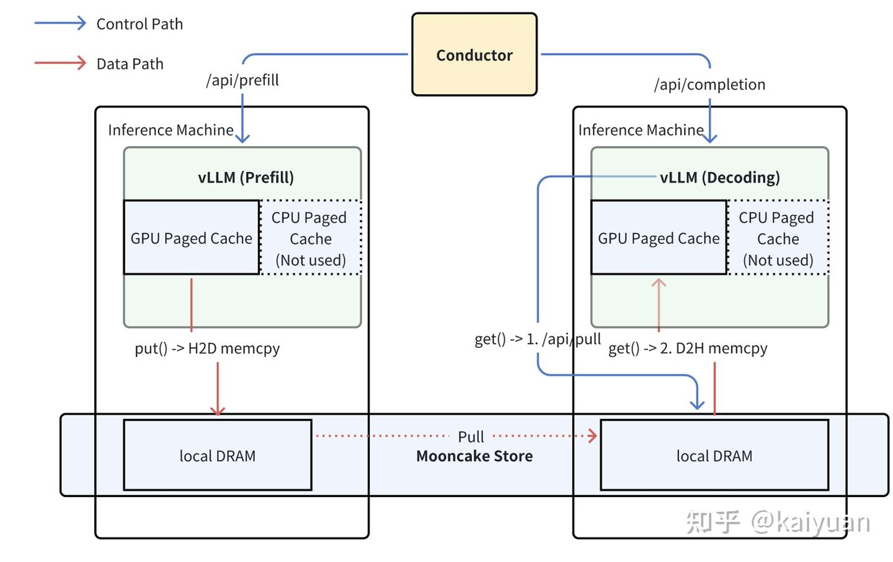

**vLLM与Mooncake的整合方案**（[设计文档](https://link.zhihu.com/?target=https%3A//docs.google.com/document/d/1Ab6TMW1E2CdHJJyCrpJnLhgmE2b_6leH5MVP9k72sjw/edit%3Ftab%3Dt.0)）

调度层设计**：**proxy系统结构可以采用如下形式，控制流与数据流分离。通过独立的KVCache存储来分离预填充（prefill）节点和解码（decode）节点。这种解耦确保了预填充节点无需等待解码节点来获取KVCache。

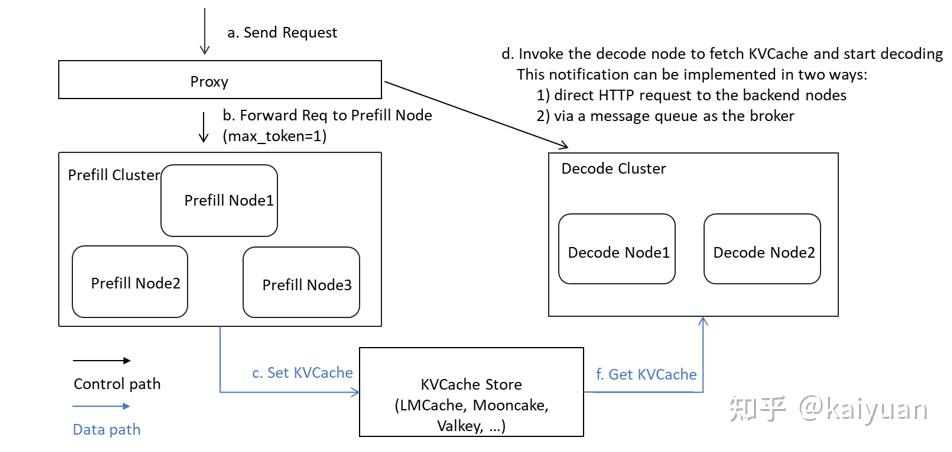

控制路径可以通过直接的HTTP调用或消息队列来实现。设置完成后，解码实例（Decode instances）会从消息队列或直接从API调用中接收请求，然后从KVCache存储中获取KVCache，跳过预填充阶段，直接进行解码阶段。

考虑实现功能：

1.  零拷贝的方式直接读取并传输KV缓存到其目标位置：

目前KV缓存是从vLLM的内部页面缓存中复制到一个临时缓冲区，然后再发送到Decode node或KV缓存存储中。这一过程涉及多轮数据复制，在高性能场景下可能会出现问题。

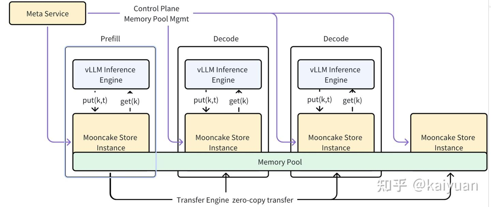

2\. 全局KVCache重复使用：在DisaggLLMEngine里面维护一个全局prefix，提升系统效率。

<未完待续>

### 3.4 SGLang方案

SGLang的PD分离方案（社区版）是在原有的调度事件循环(**scheduling event loop**)的基础上，增加一个非阻塞式的发送者/接受者模式完成PD分离的实现。当前合入的PR来看已完成相应接口设计。虽然内容还比较简单，但可以参考其框架实现的思路。

具体的实施：在原有的P/D实例中增加相应的服务（Server）来处理请求，同一个请求创建两个信息跟踪角色：在Prefill里面创建**“sender”**、在Decode创建**“reveiver”。**根据Prefill和Decode实例不同创建不同处理队列，并把**处理流程分为了多个阶段**，每个阶段有一个队列负责。这两个角色在各自的队列里面流转。

Prefill创建三个队列：

-   引导队列（BootstrapQueue）：为请求创建sender实例并与decode进行握手，等待decode的资源准备（kv）；
-   等待队列（Waiting Queue）：等待资源进行P前向运算，完成P的前向运算后事件进入下一个队列；
-   非阻塞查询队列（Infight Queue）: 查询KV是否传输完成，完成后返回请求；

Decode创建三个队列：

-   资源分配队列（PreallocQueue）：为请求创建reveiver实例，与Prefill握手，并创建KV存储；
-   KV传输队列（TransferQueue）：队列中请求需要获取Prefill计算完成后的KV值，单个请求实例获得KV值后传递到等待队列；
-   等待队列（WaitingQueue）：等待凑批后进行D运算。把队列中的请求（获得了KV值）构建一个批次实例（PrebuiltExtendBatch），对批次进行融合后在进行D的前向计算。

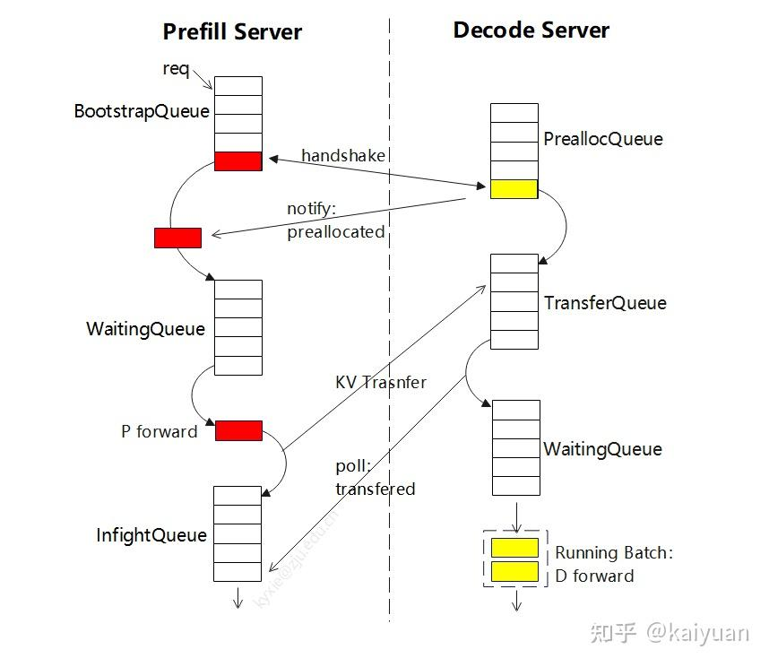

P与D的互动机制：

1.  创建request时，P与D会进行一次握手确认；
2.  D创建完成KV好后会通知P，让其sender requset进入等待队列；
3.  当P计算完前向触发KV传输；
4.  P非阻塞的轮巡检查KV是否传输完成（不直接与D互动）；

目前KV值的传递采用**非阻塞式的后端进程方式**进行处理，P和D中分别用KVSender、KVReceiver进行数据的收发，当前列出的传递方式：逐层传递、按照chunk为单位传递。用非阻塞的传递不会影响主进程继续处理新的请求，但可能存在网络流量冲突的问题，目前未考虑/解决。

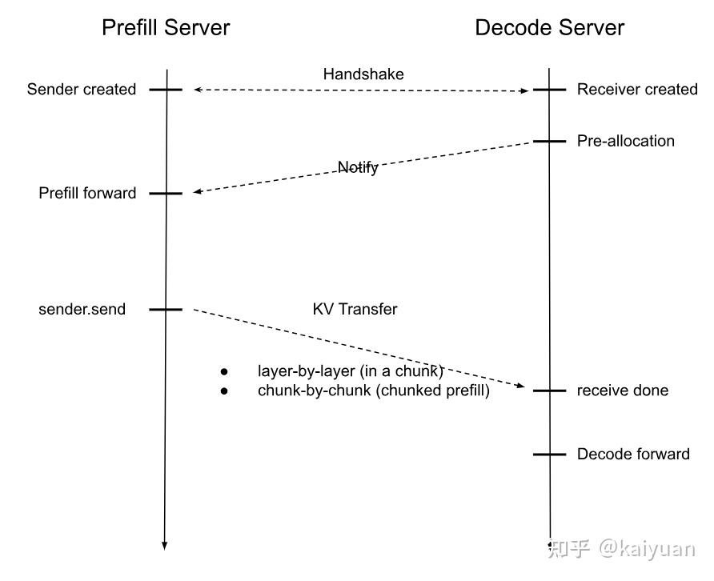

整个P/D分离信息的处理流程是在scheduler里面，所以需要增加event loop处理逻辑。（python/sglang/srt/managers/scheduler.py）[<参考>](https://link.zhihu.com/?target=https%3A//github.com/sgl-project/sglang/pull/4654/files%23diff-c3b8cc39d10c245933a25aa9c2fd6397f6b31ed8d85c0ecbb926c1f42afdd178)

```text
def event_loop_normal_disagg_prefill(self):
    pass

def event_loop_normal_disagg_decode(self):
    pass
```

使用方式：server启动新增了两个入参，通过入参来选择P和D实例，调度总入口应该是会通过Bootstrap server port来构建。

```text
        # Disaggregation
        parser.add_argument(
            "--disaggregation-mode",
            type=str,
            default="null",
            choices=["null", "prefill", "decode"],
            help='Only used for PD disaggregation. "prefill" for prefill-only server, and "decode" for decode-only server. If not specified, it is not PD disaggregated',
        )
        parser.add_argument(
            "--disaggregation-bootstrap-port",
            type=int,
            default=ServerArgs.disaggregation_bootstrap_port,
            help="Bootstrap server port on the prefill server. Default is 8998.",
        )
```

目前SGLang的PD官方版本还有许多工作待展开，参考其PD分离的路标计划（[2025/3/31](https://link.zhihu.com/?target=https%3A//github.com/sgl-project/sglang/issues/4655)）：

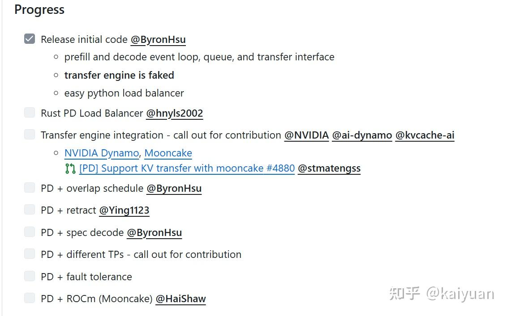

方案参考<[SGLang社区讨论方案在线文档](https://link.zhihu.com/?target=https%3A//docs.google.com/document/d/1rQXJwKd5b9b1aOzLh98mnyMhBMhlxXA5ATZTHoQrwvc/edit%3Ftab%3Dt.0%23heading%3Dh.i3s2t1j0e1ik)，更新时间（2025/4/9）>

<未完待续>

* * *

参考内容：

-   [GitHub - vllm-project/vllm: A high-throughput and memory-efficient inference and serving engine for LLMs](https://link.zhihu.com/?target=https%3A//github.com/vllm-project/vllm)
-   [(65 条消息) 如何评价Nvidia发布的大模型推理PD分离架构Dynamo？ - 知乎](https://www.zhihu.com/question/15465759171/answer/129570965681)
-   [https://github.com/kvcache-ai/Mooncake](https://link.zhihu.com/?target=https%3A//github.com/kvcache-ai/Mooncake)
-   [大模型推理新突破：分布式推理技术探索与实践](https://link.zhihu.com/?target=https%3A//mp.weixin.qq.com/s/Zs61CDerMwI7JKbFyD001Q)

**欢迎点赞、关注、讨论、不足之处请批评指正**