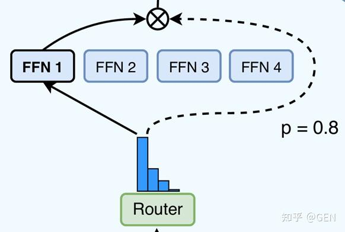
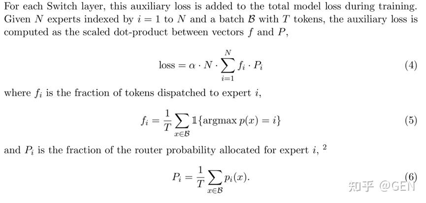

# Qwen3中的MoE是如何平衡专家负载的？

**Author:** GEN

**Date:** 2025-05-07

**Link:** https://zhuanlan.zhihu.com/p/1903789599664350106

近年来，[混合专家](https://zhida.zhihu.com/search?content_id=257474847&content_type=Article&match_order=1&q=%E6%B7%B7%E5%90%88%E4%B8%93%E5%AE%B6&zhida_source=entity)（Mixture of Experts, MoE）架构因其在扩展模型容量的同时保持计算效率的潜力，在大型语言模型领域受到了广泛关注。[Qwen3](https://zhida.zhihu.com/search?content_id=257474847&content_type=Article&match_order=1&q=Qwen3&zhida_source=entity)系列模型也采用了MoE架构，通过稀疏激活特定的“专家”网络来处理不同的输入。然而，MoE模型的一个核心挑战在于如何确保各个专家之间的负载均衡，避免某些专家过载而另一些专家空闲。本文将基于Qwen3的开源代码，深入分析其[负载均衡损失函数](https://zhida.zhihu.com/search?content_id=257474847&content_type=Article&match_order=1&q=%E8%B4%9F%E8%BD%BD%E5%9D%87%E8%A1%A1%E6%8D%9F%E5%A4%B1%E5%87%BD%E6%95%B0&zhida_source=entity)（load\_balancing\_loss\_func）的设计与实现。


## MoE与负载均衡的重要性

在MoE模型中，一个[门控网络](https://zhida.zhihu.com/search?content_id=257474847&content_type=Article&match_order=1&q=%E9%97%A8%E6%8E%A7%E7%BD%91%E7%BB%9C&zhida_source=entity)（Gating Network）决定将每个输入token路由到哪些专家进行处理。理想情况下，我们希望所有专家都能得到充分利用，并且每个专家都能学到独特的知识。如果路由机制出现偏差，导致大部分token被路由到少数几个专家，就会出现以下问题：

1.专家过载与资源浪费：少数专家计算压力过大，而其他专家则处于空闲状态，导致计算资源利用不均。

2.训练不稳定：不均衡的负载可能导致训练过程不稳定，模型难以收敛。

3.模型性能下降：专家未能充分特化，模型整体性能可能受损。



因此，引入一个辅助的负载均衡损失函数至关重要，它能够惩罚不均衡的路由行为，鼓励token在专家间均匀分布。

Qwen3中的负载均衡机制借鉴了[Switch Transformer](https://zhida.zhihu.com/search?content_id=257474847&content_type=Article&match_order=1&q=Switch+Transformer&zhida_source=entity)论文\[1\]中的公式（4）至（6）：



辅助损失函数的目标是使每个专家的token分配比例和路由概率尽可能均匀。

让我们一起剖析load\_balancing\_loss\_func函数的具体实现：

```text
def load_balancing_loss_func(
    gate_logits: Union[torch.Tensor, Tuple[torch.Tensor], None],
    num_experts: Optional[int] = None,
    top_k=2,
    attention_mask: Optional[torch.Tensor] = None,
) -> Union[torch.Tensor, int]:
    r"""
    Computes auxiliary load balancing loss as in Switch Transformer - implemented in Pytorch.

    See Switch Transformer (https://arxiv.org/abs/2101.03961) for more details. This function implements the loss
    function presented in equations (4) - (6) of the paper. It aims at penalizing cases where the routing between
    experts is too unbalanced.

    Args:
        gate_logits:
            Logits from the `gate`, should be a tuple of model.config.num_hidden_layers tensors of
            shape [batch_size X sequence_length, num_experts].
        num_experts:
            Number of experts
        top_k:
            The number of experts to route per-token, can be also interpreted as the `top-k` routing
            parameter.
        attention_mask (`torch.Tensor`, *optional*):
            The attention_mask used in forward function
            shape [batch_size X sequence_length] if not None.

    Returns:
        The auxiliary loss.
    """
    if gate_logits is None or not isinstance(gate_logits, tuple):
        return 0

    if isinstance(gate_logits, tuple):
        compute_device = gate_logits[0].device
        concatenated_gate_logits = torch.cat([layer_gate.to(compute_device) for layer_gate in gate_logits], dim=0)

    routing_weights = torch.nn.functional.softmax(concatenated_gate_logits, dim=-1)

    _, selected_experts = torch.topk(routing_weights, top_k, dim=-1)

    expert_mask = torch.nn.functional.one_hot(selected_experts, num_experts)

    if attention_mask is None:
        # Compute the percentage of tokens routed to each experts
        tokens_per_expert = torch.mean(expert_mask.float(), dim=0)

        # Compute the average probability of routing to these experts
        router_prob_per_expert = torch.mean(routing_weights, dim=0)
    else:
        batch_size, sequence_length = attention_mask.shape
        num_hidden_layers = concatenated_gate_logits.shape[0] // (batch_size * sequence_length)

        # Compute the mask that masks all padding tokens as 0 with the same shape of expert_mask
        expert_attention_mask = (
            attention_mask[None, :, :, None, None]
            .expand((num_hidden_layers, batch_size, sequence_length, top_k, num_experts))
            .reshape(-1, top_k, num_experts)
            .to(compute_device)
        )

        # Compute the percentage of tokens routed to each experts
        tokens_per_expert = torch.sum(expert_mask.float() * expert_attention_mask, dim=0) / torch.sum(
            expert_attention_mask, dim=0
        )

        # Compute the mask that masks all padding tokens as 0 with the same shape of tokens_per_expert
        router_per_expert_attention_mask = (
            attention_mask[None, :, :, None]
            .expand((num_hidden_layers, batch_size, sequence_length, num_experts))
            .reshape(-1, num_experts)
            .to(compute_device)
        )

        # Compute the average probability of routing to these experts
        router_prob_per_expert = torch.sum(routing_weights * router_per_expert_attention_mask, dim=0) / torch.sum(
            router_per_expert_attention_mask, dim=0
        )

    overall_loss = torch.sum(tokens_per_expert * router_prob_per_expert.unsqueeze(0))
return overall_loss * num_experts
```

该函数接收门控网络输出的gate\_logits、专家总数num\_experts、每个token选择的专家数量top\_k，以及可选的attention\_mask（用于处理padding）。

具体的步骤为：

### 1.门控输出(Gate Logits)

```text
if gate_logits is None or not isinstance(gate_logits, tuple):
        return 0

    if isinstance(gate_logits, tuple):
        compute_device = gate_logits[0].device
        concatenated_gate_logits = torch.cat([layer_gate.to(compute_device) for layer_gate in gate_logits], dim=0)
```

模型中可能有多层MoE模块，gate\_logits是一个元组，包含了每一层MoE的门控输出。这里首先将所有层的gate\_logits在第0维度（通常是token维度）上拼接起来。这意味着负载均衡损失是跨所有MoE层、所有token统一计算的。

### 2.计算路由权重和选择专家

```text
routing_weights = torch.nn.functional.softmax(concatenated_gate_logits, dim=-1)
 _, selected_experts = torch.topk(routing_weights, top_k, dim=-1)
 expert_mask = torch.nn.functional.one_hot(selected_experts, num_experts)
```

使用softmax将gate\_logits转换为路由权重（routing\_weights），表示每个token分配到各专家的概率。

再根据routing\_weights，为每个token选出概率最高的top\_k个专家。最后对selected\_experts进行one-hot编码，生成一个掩码，标记了哪些专家被选中。

### 3.计算核心指标

这是负载均衡损失计算的核心。

```text
         # Compute the percentage of tokens routed to each experts
        tokens_per_expert = torch.sum(expert_mask.float() * expert_attention_mask, dim=0) / torch.sum(
            expert_attention_mask, dim=0
        )

        # Compute the mask that masks all padding tokens as 0 with the same shape of tokens_per_expert
        router_per_expert_attention_mask = (
            attention_mask[None, :, :, None]
            .expand((num_hidden_layers, batch_size, sequence_length, num_experts))
            .reshape(-1, num_experts)
            .to(compute_device)
        )
```

tokens\_per\_expert反映了每个专家在所有top\_k选择中被选中的“密度”或“比例”。如果一个专家被频繁选中（即使不是首选），其对应的值会较高。在Qwen3的实现中，如果attention\_mask存在，会先根据attention\_mask过滤掉padding token的贡献。

router\_prob\_per\_expert表示门控网络分配给每个专家的平均概率值。同样，如果attention\_mask存在，会排除padding token的影响。

### 4.计算最终损失

```text
overall_loss = torch.sum(tokens_per_expert * router_prob_per_expert.unsqueeze(0))
 return overall_loss * num_experts
```

根据公式 $\text{Loss} = N \cdot \sum f_i \cdot P_i$ ，计算tokens\_per\_expert和 router\_prob\_per\_expert的点积，并乘以专家数量num\_experts，得到最终的辅助损失。

这个计算方式旨在同时鼓励：

1.专家被选中的频率(tokens\_per\_expert)应该均衡。

2.门控网络对所选专家的置信度(router\_prob\_per\_expert)应该高。

通过将这两者相乘，如果一个专家被频繁选中但门控概率很低，或者门控概率很高但很少被选中，损失都会相应调整。

该损失值越大，说明专家路由越不均衡，模型会通过优化减少这种不均衡。

## 总结：

Qwen3通过实现Switch Transformer思想的负载均衡损失函数，有效地解决了MoE架构中的专家负载不均问题。该函数通过统计每个专家接收到的token比例以及门控网络分配给各专家的平均概率，构建了一个惩罚项。

这个惩罚项被加到模型的总损失中，在训练过程中引导门控网络学习更均衡的路由策略。这不仅保证了计算资源的有效利用，也促进了各个专家的特化学习，最终有助于提升模型的整体性能和训练稳定性。理解这一机制对于深入掌握和应用MoE大模型至关重要。

\[1\] Fedus W, Zoph B, Shazeer N. Switch transformers: Scaling to trillion parameter models with simple and efficient sparsity\[J\]. Journal of Machine Learning Research, 2022, 23(120): 1-39.