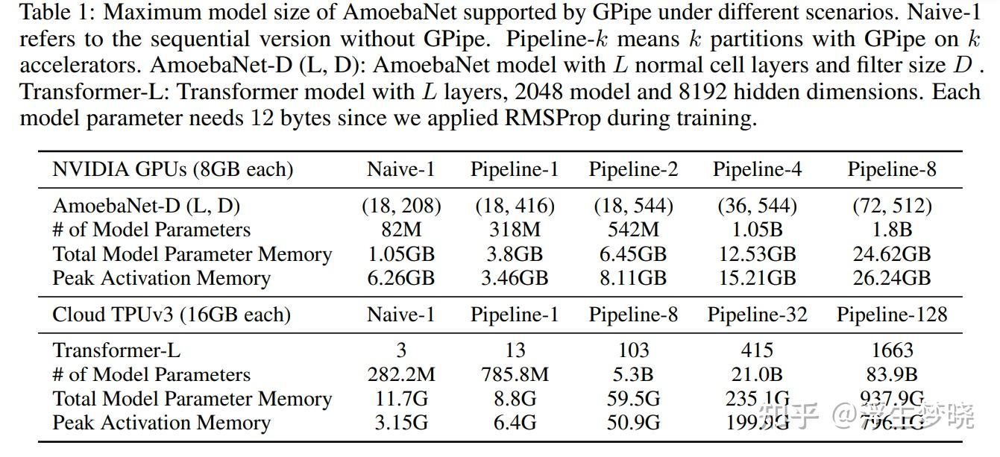
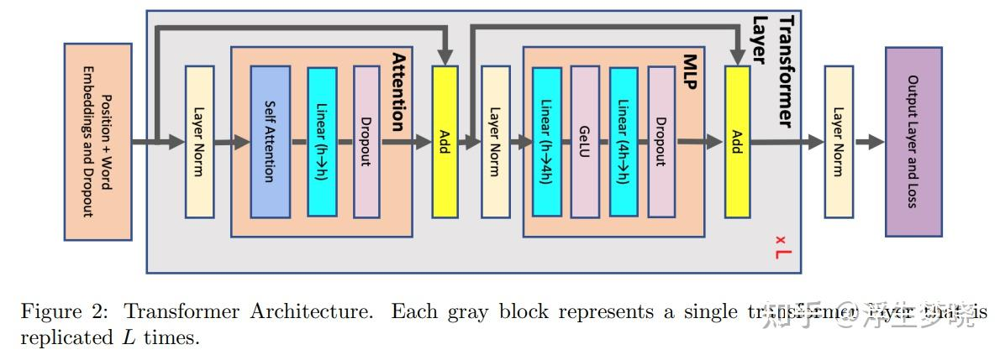
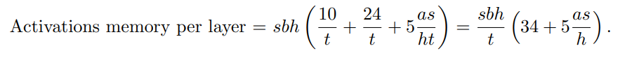
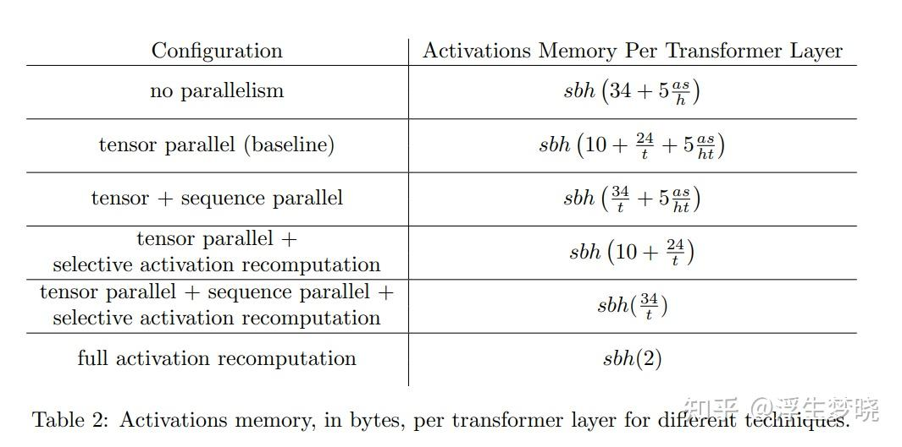

# 万字解析大模型训练推理张量并行、流水线并行、序列并行-MegatronTP/SP/PP

**Author:** 浮生梦晓

**Date:** 2025-05-07

**Link:** https://zhuanlan.zhihu.com/p/1898828998898853670

## [张量并行](https://zhida.zhihu.com/search?content_id=256922632&content_type=Article&match_order=1&q=%E5%BC%A0%E9%87%8F%E5%B9%B6%E8%A1%8C&zhida_source=entity)\-TP

### [Megatron-LM](https://zhida.zhihu.com/search?content_id=256922632&content_type=Article&match_order=1&q=Megatron-LM&zhida_source=entity): Training Multi-Billion Parameter Language Models Using

Model Parallelism

张量并行及[流水线并行](https://zhida.zhihu.com/search?content_id=256922632&content_type=Article&match_order=1&q=%E6%B5%81%E6%B0%B4%E7%BA%BF%E5%B9%B6%E8%A1%8C&zhida_source=entity)都属于[模型并行](https://zhida.zhihu.com/search?content_id=256922632&content_type=Article&match_order=1&q=%E6%A8%A1%E5%9E%8B%E5%B9%B6%E8%A1%8C&zhida_source=entity)的一种情况。

（ps:大家咋一个劲的收藏，帮忙点点赞呗: )）

张量并行可以将矩阵乘法等运算操作按矩阵行或者矩阵列来切分，在不同设备上并行执行计算，最后通过集合通信来合并结果。

张量并行的主要挑战在于如何切分参数和计算任务，以保证计算的一致性和通信的高效性。例如，在进行矩阵乘法时，必须确保各设备上的部分结果在数学上是一致的。此外，通信开销也是一个重要考虑因素，需要在计算和通信之间找到平衡点，以达到最佳性能。

-   矩阵切分计算原理：


MLP实验：

```text
class MLP(nn.Module):
    def __init__(self, hidden_size,intermediate_size,dropout_prob,seed=42):
        super().__init__()
        torch.manual_seed(seed)
        self.gate_proj = nn.Linear(hidden_size,intermediate_size,bias=False)
        self.up_proj = nn.Linear(hidden_size,intermediate_size,bias=False)
        self.down_proj = nn.Linear(intermediate_size,hidden_size,bias=False)
        self.act_fn  = nn.GELU()
        self.dropout = nn.Dropout(dropout_prob)

    def forward(self,hidden_state):
        output =  self.down_proj(self.act_fn(self.gate_proj(hidden_state) * self.up_proj(hidden_state)))
        return output
    
class TP_MLP(nn.Module):
    def __init__(self, hidden_size,intermediate_size,dropout_prob,seed=42):        
        super().__init__()
        torch.manual_seed(seed)
        self.gate_proj = nn.Linear(hidden_size,intermediate_size,bias=False)  
        self.up_proj = nn.Linear(hidden_size,intermediate_size,bias=False)  
        self.down_proj = nn.Linear(intermediate_size,hidden_size,bias=False)
        self.act_fn  = nn.GELU()
        self.dropout = nn.Dropout(dropout_prob)

    def forward(self,hidden_state):
        intermediate_size = self.gate_proj.weight.data.shape[0]
        hidden_size = self.gate_proj.weight.data.shape[1]
        gate_proj1_data = self.gate_proj.weight.data[:intermediate_size//2,:]
        gate_proj2_data = self.gate_proj.weight.data[intermediate_size//2:,:]
        self.gate_proj1 = nn.Linear(hidden_size,intermediate_size//2,bias=False)
        self.gate_proj1.weight.data = gate_proj1_data
        self.gate_proj2 = nn.Linear(hidden_size,intermediate_size//2,bias=False)
        self.gate_proj2.weight.data = gate_proj2_data
        up_proj1_data = self.up_proj.weight.data[:intermediate_size//2,:]
        up_proj2_data = self.up_proj.weight.data[intermediate_size//2:,:]
        self.up_proj1 = nn.Linear(hidden_size,intermediate_size//2,bias=False)
        self.up_proj1.weight.data = up_proj1_data
        self.up_proj2 = nn.Linear(hidden_size,intermediate_size//2,bias=False)
        self.up_proj2.weight.data = up_proj2_data
        self.down_proj1 = nn.Linear(intermediate_size//2,hidden_size,bias=False)
        self.down_proj2 = nn.Linear(intermediate_size//2,hidden_size,bias=False)
        down_proj1_data = self.down_proj.weight.data[:,:intermediate_size//2]
        down_proj2_data = self.down_proj.weight.data[:,intermediate_size//2:]
        self.down_proj1.weight.data = down_proj1_data
        self.down_proj2.weight.data = down_proj2_data

        output1 = self.down_proj1(self.act_fn(self.gate_proj1(hidden_state) * self.up_proj1(hidden_state)))
        #（bsz,seq,inter//2）* (bsz,infer//2, hidden) -> (bsz,seq,hidden)
        output2 = self.down_proj2(self.act_fn(self.gate_proj2(hidden_state) * self.up_proj2(hidden_state)))
        output = output1 + output2

        return output

batch_size = 4
sequence_length = 128
hidden_size = 512
Num_gpus = 8
drop_prob = 0.01
intermediate_size = hidden_size * 4
X = torch.randn((batch_size,sequence_length,hidden_size)) 
mlp = MLP(hidden_size=hidden_size,intermediate_size=intermediate_size,dropout_prob=drop_prob)
mlp_tp = TP_MLP(hidden_size=hidden_size,intermediate_size=intermediate_size,dropout_prob=drop_prob)
mlp.gate_proj.weight = mlp_tp.gate_proj.weight
mlp.up_proj.weight = mlp_tp.up_proj.weight
mlp.down_proj.weight = mlp_tp.down_proj.weight
mlp.act_fn = mlp_tp.act_fn
mlp.dropout = mlp_tp.dropout
X_mlpoutput = mlp(X)
X_mlpoutput_tp = mlp_tp(X)
torch.allclose(X_mlpoutput,X_mlpoutput_tp,atol=1e-5)
```


-   **Embedding拆分，列切分，行切分实现复杂：**

```text
vocab_size = 10000
hidden_size = 512
batch_size = 4
sequence_length = 128
embedding = nn.Embedding(vocab_size, hidden_size)
X = torch.randint(0,vocab_size, (batch_size, sequence_length))
X_embed = embedding(X)
embedding1 = nn.Embedding(vocab_size, hidden_size//2)
embedding1.weight.data = embedding.weight.data[:,:hidden_size//2].clone()
embedding2 = nn.Embedding(vocab_size, hidden_size//2)
embedding2.weight.data = embedding.weight.data[:,hidden_size//2:].clone()
X_embed1 = embedding1(X)
X_embed2 = embedding2(X)
X_embed_v1 = torch.cat([X_embed1,X_embed2],dim=-1)
torch.allclose(X_embed,X_embed_v1)
```


通信分析：

前向传递的分布式操作与反向传播相反，但每次操作是一个完整的[All-Reduce](https://zhida.zhihu.com/search?content_id=256922632&content_type=Article&match_order=1&q=All-Reduce&zhida_source=entity),每一层attention和mlp这前向及反向过程中各存在一个All-Reduce，共计4个AllReduce操作。

## 流水线并行-PP

最好提出流水线模型并行的论文：

### [GPipe](https://zhida.zhihu.com/search?content_id=256922632&content_type=Article&match_order=1&q=GPipe&zhida_source=entity): Easy Scaling with Micro-Batch Pipeline Parallelism

文章中将模型的不同层加载到不同的GPU，输入逐层进行传递来构建计算题，中间激活值保留在各自GPU上用于反向传播使用。


本篇论文内容上较少，存在大量实验结果篇章，考虑到文章较早，不再分析结果。

整体实现方式见上图a，将模型按照层进行切分到不同GPU上，如图b所示，在4个GPU上开展流水线，但流水线会带来一些问题，在时间步上会存在大量气泡，即GPU资源闲置的状态，为了提升GPU利用率，原文在模型分层并行基础上又添加了数据并行，一定程度上减少了时间步上的“气泡”。

[F-then-B策略](https://zhida.zhihu.com/search?content_id=256922632&content_type=Article&match_order=1&q=F-then-B%E7%AD%96%E7%95%A5&zhida_source=entity)：在每次迭代时间步的最后进行统一的参数更新（对同一批数据前向传递后不会马上进行反向传播，会计算另外批次的前向传递计算）。

本文还提到了重计算思想（引用之前文章）：

N:大batchsize ； L：模型层数； K：GPUS ； M：小batchsize

-   如果不使用模型分层及重计算，整体的内存峰值大概在O（N x L）
-   使用模型分层及重计算，整体的内存峰值大概在O（N + (L / K) \*（N / M））
-   作者计算得到单itep气泡率：O((K-1)/ (M + K -1 )))，实验中发现M ≥ 4 × K时气泡可以忽略不计。
-   从下表中每个GPU上的峰值内存可以看出，使用流水线并行时重计算是必要的，但是重计算又会造成最后一个gpu存储和计算压力过大，本文没有提到这个问题。



### [PipeDream](https://zhida.zhihu.com/search?content_id=256922632&content_type=Article&match_order=1&q=PipeDream&zhida_source=entity): Generalized Pipeline Parallelism for DNN Training

微软的针对Gpipe中F-then-B策略模式的缺陷提出的1F1B策略模式。


上图中，左图是模型分层并行示意图（无数据并行），右图为Gpipe示意图，在F-then-B策略模式下，每次迭代完成后，会集中进行梯度更新，会导致GPU资源浪费十分严重。


本文提出了1F1B模式，在完成前向传递后直接进行反向回传更新梯度，不会等待一个batch数据完成。

但这种情况会造成一个问题，数据1前向反向执行完成后，2,3,4还没有完成，即只有1数据梯度更新后对于数据5的前向传递有影响，但5的反向传递结束时2,3,4部分数据对梯度的影响也更新了，会导致数据5做梯度更新时参数状态不一致，论文中提出了weight stashing机制（权重暂存），即每次都用最新的参数（5数据前传时用1数据梯度更新后的参数），为每一个GPU都不同stage（不同数据）创建一个buffer，用来保存同一个stage前传的参数，保证其反向传播时使用。


### Efficient Large-Scale Language Model Training on GPU Clusters Using Megatron-LM

受gpipe流水线并行启发，将其与自家的张量并行相结合。使用1F1B策略模式。


如上图：综合使用Tensor并行与流水线并行（3D并行）


论文中分析了Gpipe的弊端问题，因为是F-Then-B的运行策略，导致模型没完成应该minibatch(非micobach)就会有一个GPU设备空置期（粗黑线部分），同时这种策略带来的气泡也比较严重，同时由于重计算原因，F-Then-B模式会导致最后的GPU激活值占用显存严重。

论文中对于Gpipe中气泡做了估算：

-   m: 一个batch中的microbatch size
-   p: pipline stages ,pipeline 维度上的GPU数量
-   t(id) : 每个iteration的时间
-   tf tb : 每个microbarch 数据在每个stage中的前向和反向的时间
-   因此每个batch数据一个iteration的气泡的总占用时间为：t(pb) = (p-1)(tf + tb) (p-1):前向和反向都要经历p-1个阶段，与m无关。
-   每个batch数据一个iteration总时间：m(tf + tb)
-   因此气泡占用率：


因此，当m远大于p都时候，气泡可以忽略不计，但是m过大会造成数据存储压力太大。（中间值存储），因此论文又分析到PipeDream，PipeDream调度算法中首先是warmup阶段，之后是稳定运行阶段（稳定运行阶段每个GPU会1个froward及1个backward的交替执行），最后进入梯度更新阶段，这种策略不会让m个microbatch的激活值同时进行存储，可以减缓数据存储压力，但是整体的气泡时间是和Gpipe相同的，只是节省了数据存储。


本论文就在PipeDream基础上提出了interleaved 1F1B，每个GPU不再处理一个连续的模型子集层，而是多个层（例如：假设在4个GPU上执行pipeline并行，原来是gpu0上是第1-4层，gpu1上是5-8层….，使用interleaved策略后成了，gpu0上是1,2,9,10层，gpu1上是3,4,11,12层…）使用这种方法使得摸个gpu在pipeline中单次stage时间变短。

如果按照每个gpu上有v个stage来计算(上例中v=2),那么每个microbatch在每个stage中的前向及反向将变为tf/v 和tb/v，所以每个iteration中气泡垫总时间就成了：


再计算每个iteration中气泡的占用率：


气泡率会下降v倍，但是interleaved1F1B会造成额外的通信开销（提升v倍）


上图在之前TP论文中已经展示，实际上megatron这篇Pipeline论文并未只提出interleaved1F1B对于模型训练的改进，也是将PP与TP进行混合使用，所以这文章中再次提出了TP概念，并针对PP和TP并行进行了详细分析，不再展示。

论文中花了很大篇幅关于TP+PP的通讯及计算优化


对于通讯优化，因为同一node内采用NVLink，不同node采用的无线带宽连接，减少不同node直接传输的数据内容，尽量使用使用NVLink操作。

计算优化，编写了多种运算内核。

论文附录中关于模型训练Flops的估算：

```text
前置知识：
 ：transformer layers, 
h:hidden size,
s: sequence length, 
V:vocabulary size , 
B:training batch size.

  ×  ×  ×  matrix multiplication requires 2  ×  ×  FLOPs
(factor of 2 needed to account for multiplies and adds).

注意：若前向传递总Flops为T，则反向传播总Flops为2T（需要计算权重及inputs），
如果需要重计算则需要在backward前重新进行一次前向传递，Flops为T，故总为4T。

```


## [序列并行](https://zhida.zhihu.com/search?content_id=256922632&content_type=Article&match_order=1&q=%E5%BA%8F%E5%88%97%E5%B9%B6%E8%A1%8C&zhida_source=entity)\-SP

序列并行最提出自两篇论文，两篇论文中提及的实际概念不同。

### 国内[Colossal-AI](https://zhida.zhihu.com/search?content_id=256922632&content_type=Article&match_order=1&q=Colossal-AI&zhida_source=entity)：Sequence Parallelism: Long Sequence Training from System Perspective

输入数据按照序列维度切分，也就是一句话切分成多段话，在endocer模块的主要模块中，mlp，归一化层直接可以进行序列并行，但是attention不行（QKV计算依赖），作者提出了Ring-attention。（借鉴了Ring-Allreduce算法）


-   [Ring-Attention](https://zhida.zhihu.com/search?content_id=256922632&content_type=Article&match_order=1&q=Ring-Attention&zhida_source=entity)实现了RingQK和RingAV两种计算方式，因此分布式的Attenion分为两个步骤：

-   计算query和key的乘积
-   计算V

（原谅字体较丑）


### **RMS\_Norm——序列并行代码示意：**

```text
class RMSNorm(nn.Module):
    def __init__(self, hidden_size, eps=1e-6):
        super().__init__()
        self.weight = nn.Parameter(torch.ones(hidden_size))
        self.variance_epsilon = eps

    def forward(self, hidden_states):
        input_dtype = hidden_states.dtype
        hidden_states = hidden_states.to(torch.float32)
        variance = hidden_states.pow(2).mean(-1, keepdim=True)
        hidden_states = hidden_states * torch.rsqrt(variance + self.variance_epsilon)
        return self.weight * hidden_states.to(input_dtype)
    
batch_size = 4
sequence_length = 128
hidden_size = 512
Num_gpus = 8
X = torch.randn((batch_size,sequence_length,hidden_size)) 
X_SP = torch.split(X, sequence_length//Num_gpus, dim=1)
rms_norm = RMSNorm(hidden_size=hidden_size)
X_rmsoutout = rms_norm(X)
X_rmsoutout.shape
X_SP_rmsoutput = []
for i in X_SP:
    i_rmsoutput = rms_norm(i)
    X_SP_rmsoutput.append(i_rmsoutput)
X_SP_rmsoutput = torch.cat(X_SP_rmsoutput, dim=1)
```


### MLP——序列并行

```text
class MLP(nn.Module):
    def __init__(self, hidden_size,intermediate_size,dropout_prob):
        super().__init__()
        self.gate_proj = nn.Linear(hidden_size,intermediate_size,bias=False)
        self.up_proj = nn.Linear(hidden_size,intermediate_size,bias=False)
        self.down_proj = nn.Linear(intermediate_size,hidden_size,bias=False)
        self.act_fn  = nn.GELU()
        self.dropout = nn.Dropout(dropout_prob)

    def forward(self,hidden_state):
        return self.down_proj(self.act_fn(self.gate_proj(hidden_state) * self.up_proj(hidden_state)))
    
batch_size = 4
sequence_length = 128
hidden_size = 512
Num_gpus = 8
drop_prob = 0.01
intermediate_size = 256
X = torch.randn((batch_size,sequence_length,hidden_size)) 
X_SP = torch.split(X, sequence_length//Num_gpus, dim=1)

mlp = MLP(hidden_size=hidden_size,intermediate_size=intermediate_size,dropout_prob=drop_prob)
X_mlpoutput = mlp(X)
X_SP_mlpoutput = []
for i in X_SP:
    i_mlpoutput = mlp(i)
    X_SP_mlpoutput.append(i_mlpoutput)
X_SP_mlpoutput = torch.cat(X_SP_mlpoutput, dim=1)
torch.allclose(X_mlpoutput, X_SP_mlpoutput)
```


## Megatron-SP：REDUCING ACTIVATION RECOMPUTATION IN LARGE TRANSFORMER MODELS

这篇论文主要实现TP与SP的混合使用，目的是为了降低单独TP带来的缓存占用，文章一直在分析使用不同切分策略整体的激活值占用缓存情况。


计算激活值内存前置条件：

-   假设16位存储（2bytes）
-   只计算占用高的存储部分，忽略小的buffers

下图是标准的decoder-only架构组成：




Attention block 中需要存储的激活值:

-   Q，K，Vstates: 只需要存储输入，三者输入相同，都是hidden state:,共：2bsh
-   QK(T) : 存储Q和K ，共：4bsh
-   Softmax输出值: (batch,head\_num,seq,seq) ,，存储供反向传播用，共：2bssa
-   Softmax dropout：mask，softmax的一半，共：bssa
-   dropout后和V：2bssa + 2bsh
-   共计：11sbh + 5assb

MLP中需要存储的激活值：

-   两个线性层的输入值：2bsh + 8bsh （默认mlp intermidiate为4倍）
-   激活层输入：8bsh
-   dropout：存储mask：bsh
-   共计19bsh

层归一化：

-   每层有两个，每个输入为2bsh，共4bsh

故每一层所有需要存储的激活值共：sbh(34 + 5as/h)

以我们训练qwen2的7B为例，训练时中间激活值存储大小为：

-   s = 2048 （假设）
-   b = 8 （假设）
-   h = 3584
-   a = 28
-   layer\_num = 28
-   共约187.4G

### TP（张量并行）：


当仅仅使用Megatron-TP，计算后整体的激活值存储为：

sbh(10+24/t + 5as/ht)

以我们训练qwen2的7B为例，训练时中间激活值存储大小为：

-   s = 2048 （假设）
-   b = 8 （假设）
-   t = 8 (假设) tensor parallel size
-   h = 3584
-   a = 28
-   layer\_num = 28
-   共约37.8G

SP（序列并行）+TP（张量并行）


每层激活值大小：



以我们训练qwen2的7B为例，训练时中间激活值存储大小为：

-   s = 2048 （假设）
-   b = 8 （假设）
-   t = 8 (假设) tensor parallel size
-   h = 3584
-   a = 28
-   layer\_num = 28
-   共约23.43G

### PP（Pipeline 流水线并行）

论文中没有给出示意图，论文以1F1B为例


**汇总：**



  

  

引用论文：

[https://arxiv.org/pdf/2105.13120](https://link.zhihu.com/?target=https%3A//arxiv.org/pdf/2105.13120)

[https://arxiv.org/pdf/2205.05198](https://link.zhihu.com/?target=https%3A//arxiv.org/pdf/2205.05198)

[https://arxiv.org/pdf/1811.06965](https://link.zhihu.com/?target=https%3A//arxiv.org/pdf/1811.06965)

[https://arxiv.org/pdf/1909.08053](https://link.zhihu.com/?target=https%3A//arxiv.org/pdf/1909.08053)

[https://arxiv.org/pdf/2104.04473](https://link.zhihu.com/?target=https%3A//arxiv.org/pdf/2104.04473)

[https://www.pdl.cmu.edu/PDL-FTP/BigLearning/sosp19-final271.pdf](https://link.zhihu.com/?target=https%3A//www.pdl.cmu.edu/PDL-FTP/BigLearning/sosp19-final271.pdf)