# vLLM PD分离KV cache传递机制详解与演进分析

**Author:** kaiyuan

**Date:** 2025-05-19

**Link:** https://zhuanlan.zhihu.com/p/1906741007606878764

KV cache是vLLM的基础，KV值的传递是PD分离实现的关键，目前vLLM中由kv\_transfer模块（包括两个版本V0/V1）完成。在KV cache传递过程中要考虑哪些问题，传输会不会成为系统的瓶颈？本文主要讨论PD分离下KV cache传递机制，对过程中可能遇到的问题、未来演进方向进行探讨。

## 1 KV cache传递常见问题

训练/推理过程中，数据在跨设备之间的传递已较为普遍，KV值在P/D之间传递可以认为是一个子类应用，因此在**实现方式**、**带宽、延时、计算通信重叠**等方面都会遇到与模型分布式训练/推理类似的问题。这里讨论几个KV传递当前常见的问题：

### 1.1 传递的常见方式有哪些？

根据目前一些框架的形式来看，主要有**中心存储**和**离散式**（分布式）两种方式，当然也可以是两者的结合。所谓中心存储就是建立一个跨设备的KV store，由它统一管理KV值，包括KV的增、删、查、传递等工作，推理实例（P/D）连接KV store后只需负责往里面增、查数据。另一种是分布式：P2P的方式进行数据传递，各个实例分别管理自己的存储，比如一个P实例计算完成后，向目标D实例建立通信完成KV值传递，这种方式没有统一的传递中介。

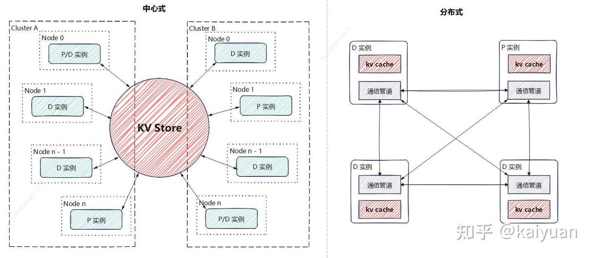

两种方式各有利弊：中心存储能够构建更大的集群管理体系、充分利用各种存储介质、传输通道，计算重用的效能更高，但性能在某些情况下可能会较差（取决于系统设计），维护成本较高；离散式的优势是架构清晰，性能更好，但扩展性、链路稳定性都不理想。

两种方式可以混用，但目前Mooncake、Dynamo等主流推理解决方案更倾向于中心存储的方式，把传递中的复杂度问题内部解决。

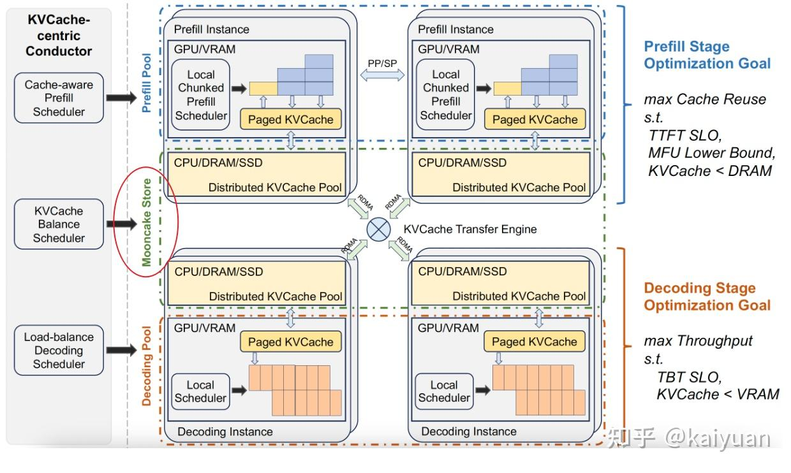

Mooncake的中心存储

这里简单罗列存储介质和传输方式：

| 存储介质 | 传输通道 | 特点 |
| --- | --- | --- |
| 显存（HBM） | 卡间传递（NVLink/HCCS） | 存储空间小，速度最快； |
|   | RDMA(RoCE/IB) | 存储空间小，借助PCIE传递，速度低于卡间传输； |
| 内存 | RDMA(NIC) | 存储空间中等，速度中等 |
|   | PCIe、TCP | 通常需要经过CPU处理，速度低于RDMA |
| 本地磁盘（NVMe/SSD） | PCIe、TCP | 空间大，速度慢。 |
| 远端存储（云存储: OBS/S3） | TCP | 空间最大，速度最慢（跨集群/跨地域） |

### 1.2 配合模型并行传递需要注意的问题？

当加载模型过大时一般需要用到模型并行（TP、PP、EP、SP等）。而这会使得模型计算的KV值分散在各个rank设备中（GPU/NPU），而P模型和D模型的**分布式策略可能还不一样**，比如P实例用TP4、EP1，D实例用TP1、PP2、EP4，这样P和D实例无法直接进行一对一的rank传递。

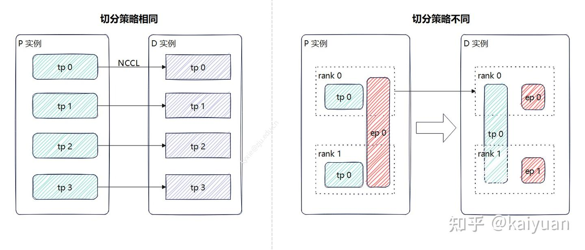

若切分策略相同，可以找副本位置进行传递，这样效率更高，比如直接用NCCL的P2P通信；当切分方式不一样时，就需要考虑先聚合后传递再分发的方式，比如让TP组中rank0进行汇聚后传递，但这样可能不能充分利用传输链路的优势（如NVLink）。

当然KV blocks的尺寸足够细时，不用聚合，但会引发一个新问题，多个rank要从相同rank拉数据，这样是否会因冲突产生阻塞，导致效率降低？是值得考虑的。

### 1.3 KV cache传递一定是只有P端到D端吗？

PD分离多对多模式，P和D之间任意映射都要能完成。在vLLM 有prefix cache功能，可以利用历史计算数据，存在一种情况：D端的block保存的数据，P端是否能够利用？根据prefix cache的block管理来看（如下图）这完全是可能的。所以P可以从D拉取已计算数据。

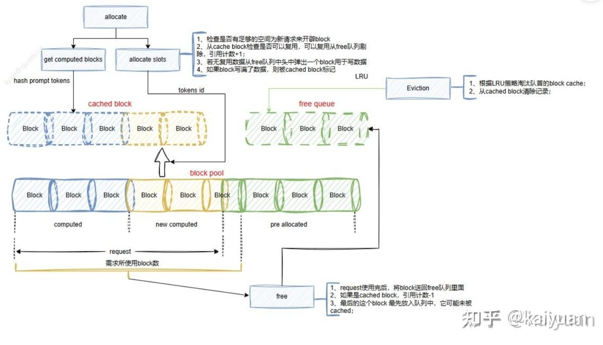

顺便提一下，在vLLM的V1版本中D的调度逻辑可以设计成：KV cache先本地查找匹配，然后再从远端获取。这样当本地已有匹配值时，避免从P实例去拉取重复的KV值。

### 1.4 KV传输与模型计算传输是否会争抢带宽？

这里分两种情况：按**模型整体计算传输**、**按层计算传输**。按模型整体计算传输是指一个请求的P处理全部结束再传输KV值，通常该情景下能够错开通信链路的使用，不会出现带宽争抢，但也存在一些极端情况，模型计算速度快于传输速度。出现上一个请求的KV传递还未结束下一个请求的计算就需要使用通信链路的情况；

另一个是按层计算（或者按block）传递：完成一个单位的KV cache计算时向下一阶段的D实例立刻进行异步传输，这种方式能够避免串行带来的性能下降（可能），但也需要考虑当模型计算的通信带宽使用较满时，两者会出现带宽争抢。

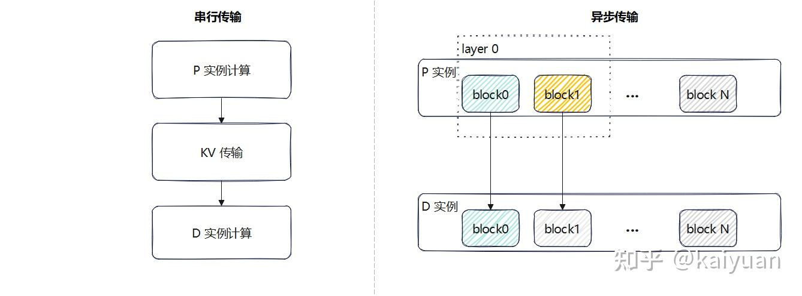

  

## 2 vLLM的现状分析

vLLM的PD分离在前面文章中有过简单方案分析([kaiyuan：vLLM PD分离方案浅析](https://zhuanlan.zhihu.com/p/1889243870430201414))，提到了两个关键点：

1.  目前vLLM架构正在调整，所以许多特性有两套方案；
2.  PD分离方案目前处于原型探索阶段。

目前，KV cache传递机制在kv transfer中实现（vllm/vllm/distributed/kv\_transfer/），存在V0和V1两个版本。V1的版本迭代速度较快，代码可能会出现较大改动，这里以**0.8.5版本**进行现状分析，主要了解目前架构和接口设计。

### 2.1 V0版本

KV cache的传递在PD实例之间通过**连接器（Connector）**完成，目前V0版本的结构如下图所示，是典型的生产者-消费者模式。connector里面包括查询缓冲（Lookup Buffer）、传递管道（pipe），还有生产者（producer，P实例）、消费者（consumer，D实例）。

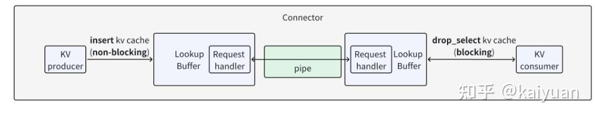

架构上：pipe负责数据传递、buffer负责构建一个FIFO队列缓冲数据、connector在上层负责操作的协调并对外提供接口。它们的一些关键函数如下所示。

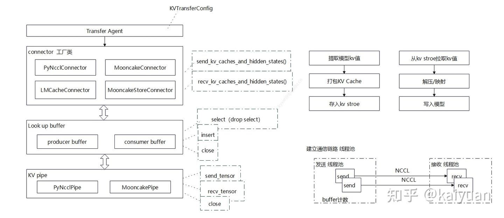

**Connector模块**

在connector的上层有一个transfer agent模块，它主要负责对外暴露调用接口，初始化里面调用工厂类（KVConnectorFactory）根据KVTransferConfig来决定使用什么connector。

```python
class KVTransferAgent:
    def __init__(
        self,
        rank: int,
        local_rank: int,
        config: "VllmConfig",
    ):

        self.config = config
        if config.kv_transfer_config is None:
            raise ValueError("KVTransferConfig is not set in the VllmConfig,"
                             " cannot initialize KVConnector.")
        assert self.config.kv_transfer_config.is_kv_transfer_instance, "KV"\
            "TransferAgent should only be used when kv_connector is set."
        # 工厂类的作用
        self.connector = KVConnectorFactory.create_connector_v0(
            rank, local_rank, config)
```

connector基类的定义参考：vllm/vllm/distributed/kv\_transfer/kv\_connector/base.py，基类函数主要是两个：发送函数（P调用）、接收函数（D调用）。其操作逻辑如下所示。

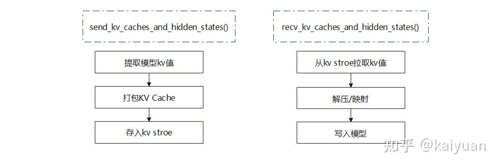

connector的具体实现，可以根据不同的存储库来实现，目前V0版本中当前已注册的工厂类如下：

```python
KVConnectorFactory.register_connector(
    "PyNcclConnector",
    "vllm.distributed.kv_transfer.kv_connector.simple_connector",
    "SimpleConnector")

KVConnectorFactory.register_connector(
    "MooncakeConnector",
    "vllm.distributed.kv_transfer.kv_connector.simple_connector",
    "SimpleConnector")

KVConnectorFactory.register_connector(
    "LMCacheConnector",
    "vllm.distributed.kv_transfer.kv_connector.lmcache_connector",
    "LMCacheConnector")

KVConnectorFactory.register_connector(
    "MooncakeStoreConnector",
    "vllm.distributed.kv_transfer.kv_connector.mooncake_store_connector",
    "MooncakeStoreConnector")
```

**Lookup Buffer模块**

查找缓冲主要用于构建一个FIFO队列的数据缓冲区，它能保证数据传递顺序，控制数据占用的显存量，主要的对外接口是insert（生产者调用）、drop\_select（消费者调用），其大致逻辑如下图所示。生产者侧会创建一个buffer（双端队列），insert函数会在主线程中将KV数据添加到队列，同时创建一个后台子线程drop\_select\_handler，负责从buffer中取出数据并发送给消费者。生产者与消费者之间的通信有两个步骤，首先，消费者会发送input\_tokens和roi，生产者根据这两个信息判断KV cache数据是否已计算完成，若已完成则将key、value、hidden等数据发送给消费者。

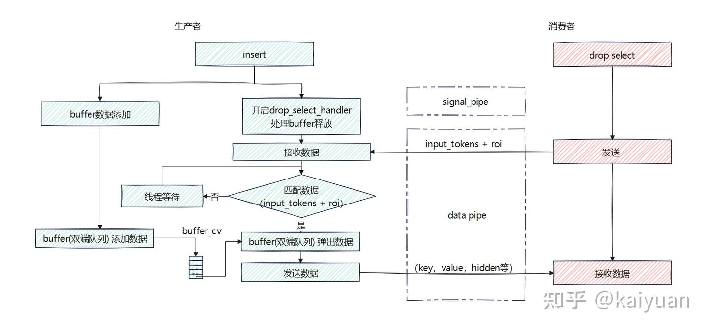

这里用一段代码解释一下roi的作用：

```python
取值操作操作：
input_tokens = torch.tensor([1, 2, 3, 4, 5])
roi = torch.tensor([False, True, False, True, False], dtype=torch.bool)
result = input_tokens[roi]
print(result)  # 输出：tensor([2, 4])

POP操作：
原始 buffer: [10, 20, 30, 40, 50]
input_tokens: tensor([1, 2, 3, 4, 5])
roi: tensor([False,  True, False,  True, False])
buffer.pop(input_tokens, roi)
处理后的 buffer: [10, 30, 50]
```

**Pipe模块**

pipe用来进行具体的数据传递，对外接口：

```python
class KVPipeBase(ABC):
    """
    This class provides an interface for sending and receiving tensors, or
    None, by distributed communications.
    """
    @abstractmethod
    def send_tensor(self, tensor: Optional[torch.Tensor]) -> None:
        """Send a tensor, or None, via the pipe.
        """
        raise NotImplementedError

    @abstractmethod
    def recv_tensor(self) -> Optional[torch.Tensor]:
        """Receive a tensor (can be None) from the pipeline.
        """
        raise NotImplementedError

    @abstractmethod
    def close(self) -> None:
        """Close the pipeline and release resources.
        """
        raise NotImplementedError
```

以PyNcclPipe为例，用于在分布式环境中实现张量及其元数据的发送和接收功能，里面的一些关键步骤：

-   配置与设备选择：保存传入的配置信息 \`KVTransferConfig\`，并根据配置或传入的参数选择设备（CUDA 或 CPU）。
-   分布式连接建立：使用 \`StatelessProcessGroup\` 创建一个分布式进程组，通过 \`barrier\` 方法确保连接正确初始化。
-   发送和接收实现选择：根据设备类型选择合适的发送和接收实现，对于 CUDA 设备使用 \`PyNcclCommunicator\`，对于 CPU 设备使用 \`StatelessProcessGroup\` 的对象发送和接收方法。
-   传输相关变量初始化：初始化传输线程池、缓冲区大小和缓冲区大小阈值。

  

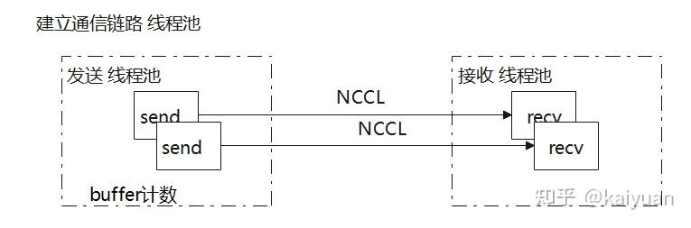

### 2.2 V1版本

V1版本中PD的角色关系已变得比较模糊，P和D既可以是生产者也可以是消费者，而且默认开启prefix KV cache特性后P可以从D实例中获取已计算好的Block（虽然这个功能暂未实现）。

V1的transfer实现主要架构如下图所示，最大特点是connector有**两个执行角色（Role）**：[scheduler\_connector](https://zhida.zhihu.com/search?content_id=257821391&content_type=Article&match_order=1&q=scheduler_connector&zhida_source=entity)和[worker\_connector](https://zhida.zhihu.com/search?content_id=257821391&content_type=Article&match_order=1&q=worker_connector&zhida_source=entity)，分别在scheduler线程和worker线程中执行。scheduler负责指挥worker进行KV数据的传递，两者之间的信息桥梁是**元数据**（KVConnectorMetadata），worker通过metadata知道哪些KV值需要从远端加载。

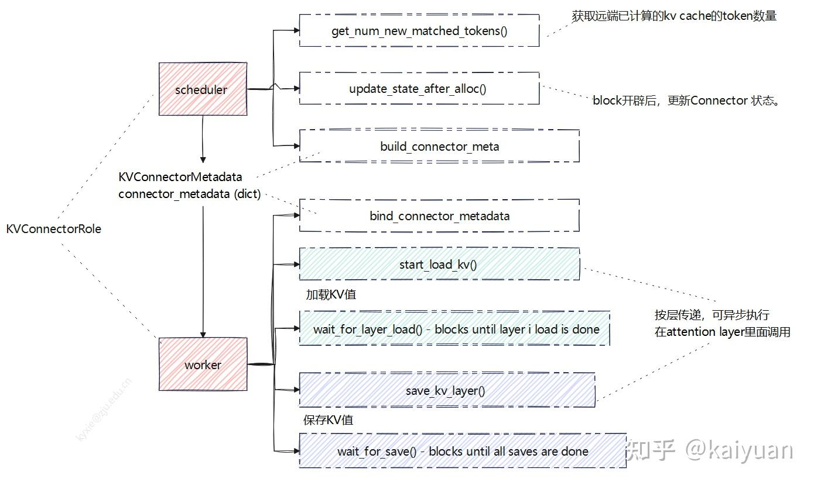

**考虑一个问题**：KV connector按理来说只要让worker能调用就行，为什么在scheduler里面也要运行？

这个问题要从scheduler的重复计算功能角度思考，因为scheduler可以通过匹配利用历史计算数据（block），在远端的KV cache也可以认为是一种计算好的数据，但这些数据在远端，所以在PD分离场景下scheduler需要增加逻辑：让worker拉取远端KV、远端KV没获取完前request请求需要继续等待、本地不需要新计算block等。反过来，worker获取远端KV cache值刷新了本地block值需要告知scheduler。

**Scheduler connector**

connector基类里面包括scheduler端、worker端调用的函数接口，其中给scheduler用的主要是：

-   get\_num\_new\_matched\_tokens()：获取远端已计算的KV cache的token数量。
-   update\_state\_after\_alloc() ：block开辟后，更新connector状态。
-   build\_connector\_meta()： 构建元数据，scheduler告诉worker需要保持/加载哪些KV数据。

函数在scheduler的schedule()操作中调用，会改变num\_computed\_tokens的计算，创建worker交互的meta数据。但base类的操作不改变scheduler\_output，也不改变队列执行顺序（扩展类可改变队列执行逻辑）。

```python
# vllm/vllm/v1/core/sched/scheduler.py
# scheduler中的函数调用位置：
                # KVConnector: update internal state after allocation.
                # This information is used to determine if a load is
                # needed for this request.
                if self.connector is not None:
                    self.connector.update_state_after_alloc(
                        request,
                        new_computed_blocks + new_blocks,
                        num_external_computed_tokens,
                    )
# ...
# 计算远端已有kv数量，
                # Get externally-cached tokens if using a KVConnector.
                num_external_computed_tokens, load_kv_async = (
                    (0, False) if self.connector is None else
                    self.connector.get_num_new_matched_tokens(
                        request, num_native_computed_tokens))

                # Total computed tokens (local + external).
                num_computed_tokens = (num_native_computed_tokens +
                                       num_external_computed_tokens +
                                       num_prealloc_computed_tokens)
# ...
        # NOTE(Kuntai): this function is designed for multiple purposes:
        # 1. Plan the KV cache store
        # 2. Wrap up all the KV cache load / save ops into an opaque object
        # 3. Clear the internal states of the connector
        if self.connector is not None:
            meta = self.connector.build_connector_meta(scheduler_output)
            scheduler_output.kv_connector_metadata = meta
```

**Worker connector**

worker connector主要接口是生产者端调用存储KV接口，消费者端调用的加载KV接口；两种角色与之配套的都有一个异步等待操作，支持按层传递，可异步执行。

-   bind\_connector\_metadata：绑定元数据；
-   start\_load\_kv：开始加载，消费端调用；
-   wait\_for\_layer\_load：阻塞直到指定层加载结束，消费端调用；
-   save\_kv\_layer：开始保存层，生产端调用；
-   wait\_for\_save：阻塞直到所有保存完成，生产端调用；

```python
#vllm/vllm/attention/layer.py
# worker connecotr 使用位置（attention部分）：
# ...
# 加载逻辑使用
def wait_for_kv_layer_from_connector(layer_name: str):
    if not has_kv_transfer_group() or not is_v1_kv_transfer_group():
        return

    connector = get_kv_transfer_group()

    forward_context: ForwardContext = get_forward_context()
    attn_metadata = forward_context.attn_metadata
    if attn_metadata is None:
        return
    assert isinstance(attn_metadata, dict)
    connector.wait_for_layer_load(layer_name)

# ...
# 保存逻辑使用
def maybe_save_kv_layer_to_connector(
    layer_name: str,
    kv_cache_layer: List[torch.Tensor],
):
    if not has_kv_transfer_group() or not is_v1_kv_transfer_group():
        return

    connector = get_kv_transfer_group()

    forward_context: ForwardContext = get_forward_context()
    attn_metadata = forward_context.attn_metadata
    if attn_metadata is None:
        return
    assert isinstance(attn_metadata, dict)
    connector.save_kv_layer(layer_name, kv_cache_layer,
                            attn_metadata[layer_name])

```

worker connector的接口start/wait由runner调用（ModelRunner模块），而attention调用存/读KV cache接口。相关PR：[KV Connector API V1](https://link.zhihu.com/?target=https%3A//github.com/vllm-project/vllm/pull/15960)，大致的时序如下：

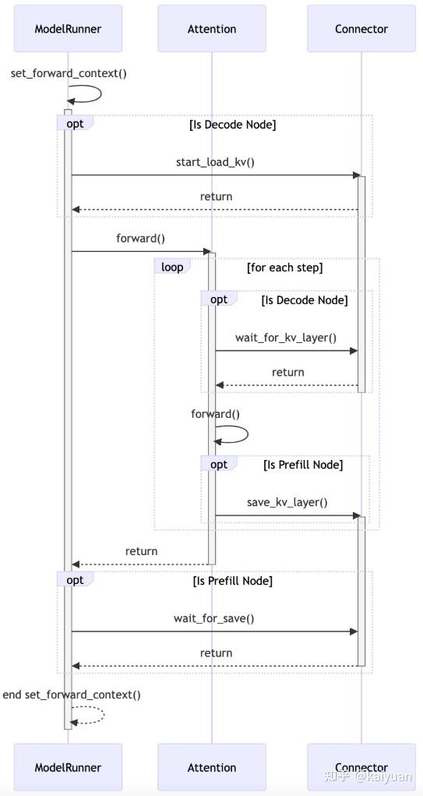

## 3 迭代的其它思考

### 3.1 控制信号的设计

由于PD分离中P实例和D实例处于不同的机器中，P和D之间的执行动作协调肯定需要一个控制信号来处理，比如P实例告诉D实例KV cache的计算状态、D实例从P实例拉取KV值的时机选择、D实例拉取完KV值后告诉P实例可以释放本地的KV值等。虽然都是P和D之间进行数据传递，控制信号和KV值数据传递方式可以不共用链路，因为控制信号的信息量较小，一般用TCP这种就能满足要求，而且传递"绕远路"也并不影响性能，目前主要的方式有两种：**直连**、通过**中心调度器传递**。

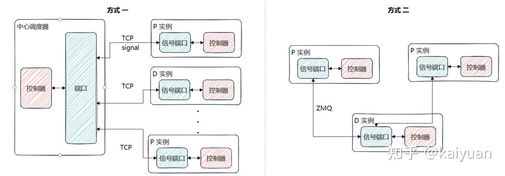

虽然控制信号对速度要求不高，但其可靠性相关问题值得关注。如，控制信号如果丢失可靠性怎么保证？更具体的例子：D实例让P实例释放KV值，结果控制信号丢失了，P实例什么时候释放KV值？

**方式的利弊**：控制信号用中心调度"包办"的方式会增加调度器的处理逻辑复杂度，但实现起来比较简单直观，所以现在很多DIY版本的PD分离用这种方式较多；直连的方式是把处理逻辑下放到了执行器，执行器之间自己去搭建通信链路，可以避免信息传递的多次转手。

### 3.2 scheduler逻辑设计

scheduler在V1的迭代中功能得到了简化，逻辑也变得更简单，带来的好处是执行效率更高，但connector需要在scheduler中执行，使得本来轻量的scheduler因为不同形态的connector模块的注入变得越来越沉重。

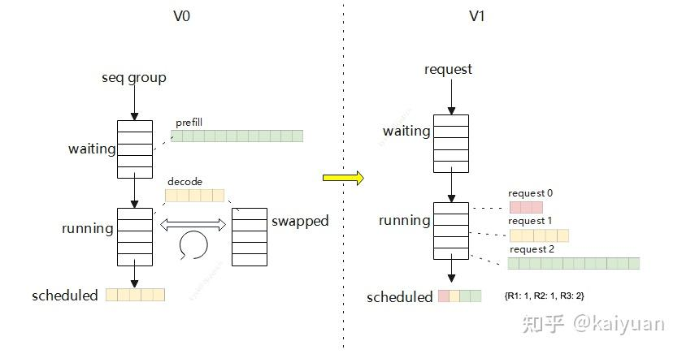

以5.13这个PR为例，为了nixl的合入引入了非常多的改动，暂时还不会对性能、cleancode构成质的影响，但后续扩展新connector逻辑能否保证？

```text
# scheduler 的修改

# 增加了一种状态：
                # P/D: skip request if still waiting for remote kvs.
                if request.status == RequestStatus.WAITING_FOR_REMOTE_KVS:
                    is_ready = self._update_waiting_for_remote_kv(request)
                    if is_ready:
                        request.status = RequestStatus.WAITING
                    else:
                        self.waiting.popleft()
                        skipped_waiting_requests.appendleft(request)
                        continue
# 增加PD的处理逻辑
    ########################################################################
    # P/D Related Methods
    ########################################################################

    def get_kv_connector(self) -> Optional[KVConnectorBase_V1]:
        return self.connector

    def _connector_finished(
            self, request: Request) -> tuple[bool, Optional[KVTransferParams]]:
        """Invoke the KV connector request_finished() method if applicable."""
        if self.connector is None:
            return False, None
        block_ids = self.kv_cache_manager.get_block_ids(request.request_id)
        return self.connector.request_finished(request, block_ids)

    def _update_waiting_for_remote_kv(self, request: Request) -> bool:
        """
        P/D: check if the request_id is finished_recving.

        The finished_recving_kv_req_ids list is populated
        on the previous steps()'s update_from_output based
        on the worker side connector.

        When the kv transfer is ready, we cache the blocks
        and the request state will be moved back to WAITING from
        WAITING_FOR_REMOTE_KV.
        """
        if request.request_id not in self.finished_recving_kv_req_ids:
            return False

        # Now that the blocks are ready, actually cache them.
        block_ids = self.kv_cache_manager.get_block_ids(request.request_id)
        num_computed_tokens = len(block_ids) * self.block_size
        if num_computed_tokens == request.num_tokens:
            num_computed_tokens -= 1
        self.kv_cache_manager.single_type_manager.cache_blocks(
            request,
            self.kv_cache_manager.req_to_block_hashes[request.request_id],
            num_computed_tokens,
        )

        # Update the request state for scheduling.
        request.num_computed_tokens = num_computed_tokens

        # Return that we are ready.
        self.finished_recving_kv_req_ids.remove(request.request_id)
        return True

    def _update_from_kv_xfer_finished(self,
                                      model_runner_output: ModelRunnerOutput):
        """
        P/D: update the scheduler state based on the output.

        The Worker side connectors add finished_recving and
        finished_sending reqs to the output.
        * if finished_sending: free the blocks
        # if finished_recving: add to state so we can
            scheduler the request during the next step.
        """
        # P/D: update recv and send status from last step.
        for req_id in (model_runner_output.finished_recving or ()):
            logger.debug("Finished recving KV transfer for request %s", req_id)
            self.finished_recving_kv_req_ids.add(req_id)
        for req_id in (model_runner_output.finished_sending or ()):
            logger.debug("Finished sending KV transfer for request %s", req_id)
            self._free_blocks(self.requests[req_id])
```

能否让scheduler中的connector也更轻量，将更多工作交给worker完成？值得关注

### **3.3 整体的可靠性设计**

KV cache传递过程需要考虑数据中途传递失败的问题，**失败后是重传还是丢弃本次计算内容**。对于故障处理这个工作可以留给第三方插件（如LMcache或者Mooncake store）进行，也可以在KV connector内部实现一套传递故障容错机制，保证故障后能够自动重试、重计算等，使得推理正常完成。除了数据传递的可靠性，就是前面提到的传递控制信号的可靠性，也需要重点考虑。

目前vLLM的PD分离相关内容还没有在可靠性方面做太多考虑，如果自己实现PD分离，开始设计时不妨把数据、控制信号传输的可靠性考虑进去。

* * *

上一篇：

[](https://zhuanlan.zhihu.com/p/1889243870430201414)

**参考**

-   [https://github.com/kvcache-ai/Mooncake](https://link.zhihu.com/?target=https%3A//github.com/kvcache-ai/Mooncake)
-   [https://docs.vllm.ai/en/latest/features/disagg\_prefill.html](https://link.zhihu.com/?target=https%3A//docs.vllm.ai/en/latest/features/disagg_prefill.html)
-   [https://github.com/ai-dynamo/nixl](https://link.zhihu.com/?target=https%3A//github.com/ai-dynamo/nixl)
-   [https://docs.lmcache.ai/index.html](https://link.zhihu.com/?target=https%3A//docs.lmcache.ai/index.html)
-   [vLLM的prefix cache为何零开销 - 知乎](https://zhuanlan.zhihu.com/p/1896927732027335111)
-   [vLLM框架V1演进分析 - 知乎](https://zhuanlan.zhihu.com/p/1894423873145004335)
-   [PD分离 vllm社区讨论文档](https://link.zhihu.com/?target=https%3A//docs.google.com/document/d/1uPGdbEXksKXeN4Q9nUm9hzotqEjQhYmnpAhidLuAsjk/edit%3Ftab%3Dt.0%23heading%3Dh.kx5q0qbcgwjm)

**欢迎点赞、关注、讨论、不足之处请指正**