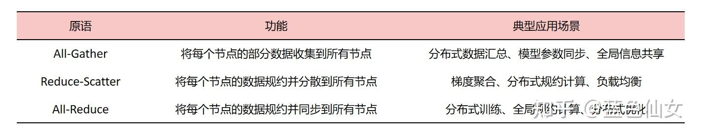
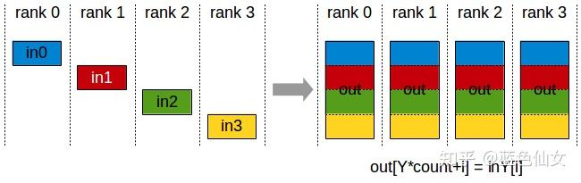
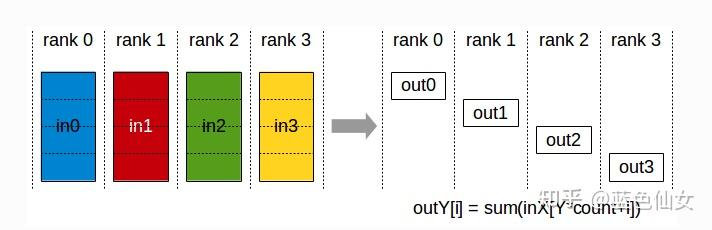
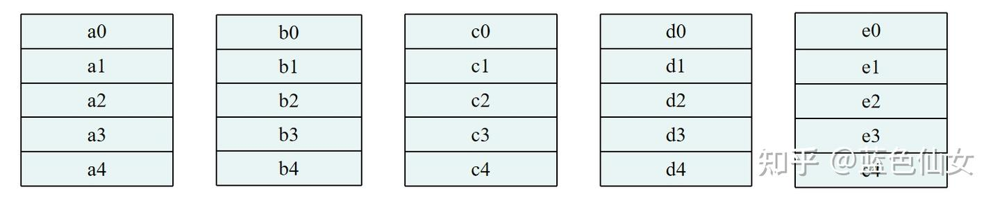
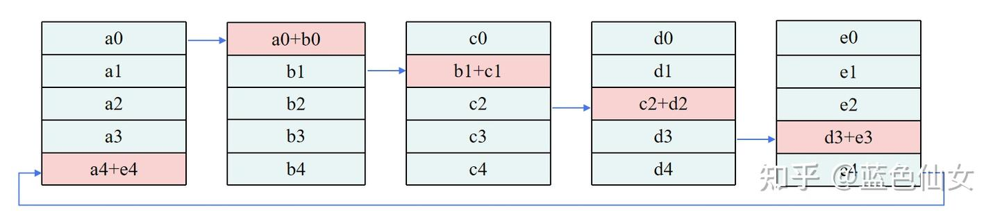
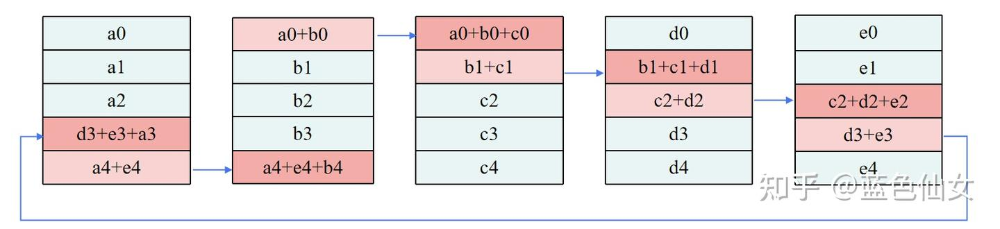
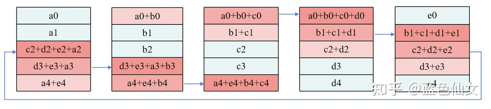
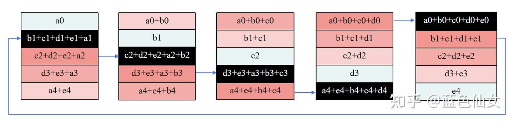
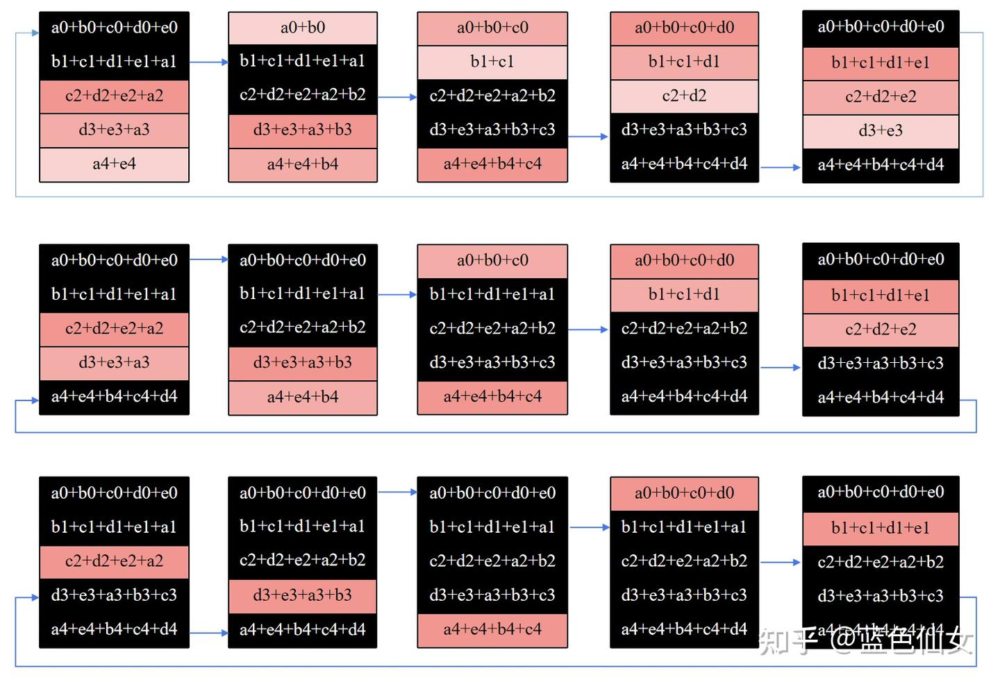
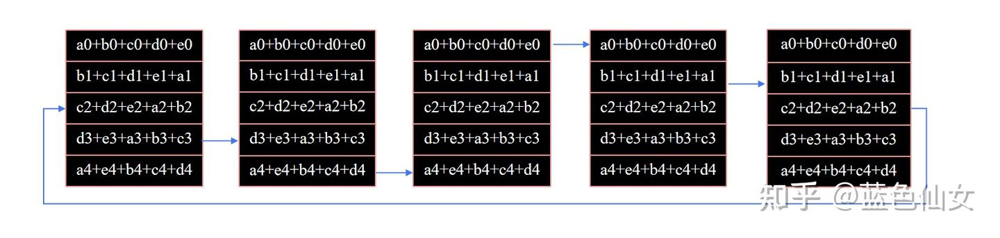

# 分布式训练中All-Reduce、All-Gather、Reduce-Scatter原理介绍

**Author:** 蓝色仙女

**Date:** 2025-05-20

**Link:** https://zhuanlan.zhihu.com/p/17201336684

## 引言

通信原语：是计算机科学中用于在并发或分布式系统中进行通信的基本操作。

在分布式训练中，**All-Gather、Reduce-Scatter、[All-Reduce](https://zhida.zhihu.com/search?content_id=252461965&content_type=Article&match_order=1&q=All-Reduce&zhida_source=entity)**是支撑大规模模型训练的核心通信原语。

-   **All-Gather** ：将分布式数据汇总到所有节点，适用于需要**全局数据**同步的场景。
-   **Reduce-Scatter**：将分布式数据进行**规约**并**分散**到所有节点，适用于需要局部结果分发的场景。
-   **All-Reduce** ： Reduce-Scatter 和 All-Gather 的组合。

## 1 All-Gather：全局数据同步的基石

**核心功能**：将每个节点的部分数据汇总到所有节点，最终所有节点拥有**完整数据**副本。  
**适用场景**：模型并行中的参数同步、全局统计信息聚合。

All-Gather

### **1.1 工作流程示例**

1.  **数据分块**：每个节点将本地数据划分为与节点数相同的块（如4节点则分4块）。
2.  **环形传递**：节点按逻辑环依次发送和接收数据块（例如节点1发送块1→节点2，同时接收节点4的块4）。
3.  **多轮迭代**：经过N-1轮（N为节点数），所有节点通过拼接累积数据块完成全局同步。

**性能优势**：通信量与节点数无关，总数据量为(_N_−1)×单节点数据量，适合大规模集群。

## 2 Reduce-Scatter：局部规约与分发的艺术

**核心功能**：先对多节点数据进行规约（如求和），再将结果分散到各节点，使每个节点仅保留部分规约结果。  
**适用场景**：ZeRO显存优化、梯度分片更新。

Reduce-Scatter

### **2.1 工作流程示例**

**规约阶段（Reduce）**

-   节点对相同位置的数据块执行并行规约（如GPU0~3分别对块0~3求和）。
-   **关键优化**：利用环形拓扑减少带宽竞争，规约与传输并行。

**分散阶段（Scatter）**

-   将规约后的数据块按节点索引分发（如GPU0接收块0，GPU1接收块1）。

**显存优势**：规约后每个节点仅存储 1/N1/_N_ 数据，显著降低显存占用。

## 3 All-Gather和Reduce-Scatter本质区别

### 3.1 **数据处理方式**

-   **All-Gather**：只进行数据收集和分发，不进行任何计算或规约操作
-   **Reduce-Scatter**：先进行数据规约（reduce），然后再进行数据分散（scatter）

### 3.2 **最终结果**

-   **AllGather**：每个节点拥有所有节点的数据副本
-   **ReduceScatter**：每个节点只拥有部分规约后的数据，而不是所有的数据

### 3.3 **通信模式**

-   **All-Gather**：多对多的数据同步全收集
-   **Reduce-Scatter**：多对多的数据规约和分散

## 4 All-Reduce：Reduce-Scatter与All-Gather的黄金组合

**核心功能**：将全局数据规约后同步至所有节点，等价于 **Reduce-Scatter + All-Gather**。  
**工业级实现**：主流框架（如PyTorch DDP、DeepSpeed）采用 **[Ring All-Reduce](https://zhida.zhihu.com/search?content_id=252461965&content_type=Article&match_order=1&q=Ring+All-Reduce&zhida_source=entity)**，因其通信效率与节点数无关。

### **4.1 All-Reduce算法对比与选型建议**

| 算法 | 简介 | 优点 | 缺点 |
| --- | --- | --- | --- |
| Ring-All-Reduce | 节点被组织成一个逻辑环，数据在环中按顺序传输。 | 通信效率高，适用于大规模集群。每个节点只与其邻居节点通信，减少了通信开销。 | 在节点数量较多时，通信轮数较多，可能导致延迟增加。 |
| Recursive Doubling | 通过递归地将节点两两配对，进行数据交换和规约。 | 通信轮数较少，理论上通信效率高。适用于节点数量为2的幂次方的情况。 | 在节点数量不是2的幂次方时，可能需要额外的处理步骤。 |
| Butterfly All-Reduce | 采用蝶形拓扑结构，类似于递归加倍，但更加复杂。 | 通信轮数少，通信效率高。适用于高性能计算和大规模分布式系统。 | 实现复杂，需要精细的调度和同步。 |
| Hierarchical All-Reduce | 将节点组织成多个层次，每个层次内部进行 All-Reduce 操作，然后进行跨层次的数据交换。 | 可以充分利用网络拓扑结构，提高通信效率。适用于具有层次化网络拓扑的分布式系统。 | 实现复杂，需要精细的调度和同步。 |
| Tree-Based All-Reduce | 将节点组织成树状结构，数据在树中进行规约和分发。 | 实现简单，适用于节点数量较少的情况。 | 在节点数量较多时，通信轮数较多，可能导致延迟增加。 |
| Rabenseifner's Algorithm | 结合了环和递归加倍的特点，先进行环式规约，再进行递归加倍的分发。 | 通信效率高，适用于大规模集群。 | 实现复杂，需要精细的调度和同步。 |
| Naive All-Reduce | 每个节点将数据发送给所有其他节点，然后每个节点对接收到的数据进行规约。 | 实现简单。 | 通信开销大，不适用于大规模集群。 |

当前主流的分布式训练框架大多采用**Ring-All-Reduce**，如DeepSpeed、PyTorch DistributedDataParallel (DDP)、Megatron-LM等。

### **4.2 Ring All-Reduce 图解**

在**Ring-All-Reduce**算法中，数据被分割成与节点数量相同的数据块数量，这种设计是为了优化通信效率和最小化数据传输延迟。

这里以5个节点为示例，数据被分割成5块

**Reduce-Scatter阶段**

-   **步骤1-4**：数据块沿环传递并累加，最终每个节点持有1个全量规约块（如GPU0持有块0的全局和）。
-   **通信量**：(N−1)×单节点数据量/N(_N_−1)×单节点数据量/_N_，时间仅与带宽相关

**All-Gather阶段**

-   **步骤5-8**：全量块沿环广播，最终所有节点获得完整规约结果。

原始每个节点的数据如下：

原始状态

第一步：Reduce-Scatter-1

第二步: Reduce-Scatter-2

第三步：Reduce-Scatter-3

第四步：Reduce-Scatter-4

可以看出，经过四次reduce-scatter之后，每个节点都拥有某一块位置的全量数据，接下来要做的就是把每个数据块的值同步到每个节点。

第五步-第七步：All-Gather 3轮

第八步：All-Gather-最后一轮

### 5 优化技巧：从理论到实践

### **算法选择**：

-   大规模集群优先选择 **Ring All-Reduce**，避免主节点瓶颈。
-   非2的幂次节点数可尝试 **Rabenseifner算法**（结合环与递归加倍）。

**硬件加速**：

-   使用RDMA网络或GPU Direct技术减少CPU参与，提升吞吐量。

**数据压缩**：

-   对梯度进行量化（如FP16→FP8）或稀疏化，减少传输量。

### 6 总结：为何这些原语至关重要？

-   **All-Gather**：实现全局数据透明化，支撑模型并行的参数聚合。
-   **Reduce-Scatter**：平衡显存与通信，为ZeRO等显存优化技术奠基。
-   **All-Reduce**：通过组合操作，成为数据并行的核心同步机制。

### 参考文献

[https://docs.nvidia.com/deeplearning/nccl/user-guide/docs/usage/collectives.html#allgather](https://link.zhihu.com/?target=https%3A//docs.nvidia.com/deeplearning/nccl/user-guide/docs/usage/collectives.html%23allgather)

[All-reduce，AIl-to-all\_all reduce算法优化-CSDN博客](https://link.zhihu.com/?target=https%3A//blog.csdn.net/qq_38998213/article/details/143094623)

[李豪：深度学习常见AllReduce算法图解](https://zhuanlan.zhihu.com/p/469942194)