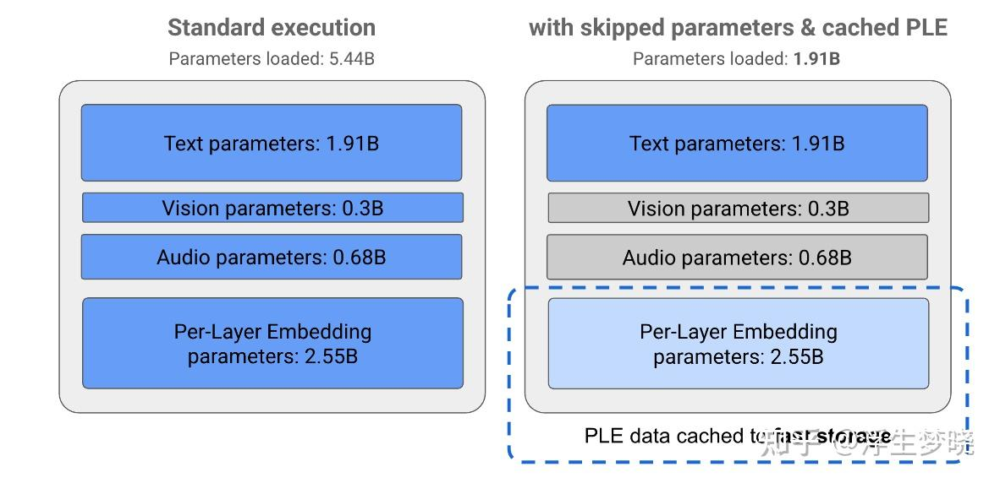

# Gemma 3n 关键技术点

**Author:** 浮生梦晓

**Date:** 2025-05-21

**Link:** https://zhuanlan.zhihu.com/p/1908807157173952536

[Gemma 3n](https://zhida.zhihu.com/search?content_id=258036619&content_type=Article&match_order=1&q=Gemma+3n&zhida_source=entity) 包含以下关键功能：

-   **音频输入**：处理声音数据，用于语音识别、翻译和音频数据分析。
-   **视觉与文本输入**：多模态功能支持处理视觉、声音和文本信息，帮助理解和分析周围世界。
-   **[PLE 缓存](https://zhida.zhihu.com/search?content_id=258036619&content_type=Article&match_order=1&q=PLE+%E7%BC%93%E5%AD%98&zhida_source=entity)**：模型中包含的每一层嵌入（PLE）参数可缓存至快速本地存储，以降低模型内存运行成本。
-   **[MatFormer 架构](https://zhida.zhihu.com/search?content_id=258036619&content_type=Article&match_order=1&q=MatFormer+%E6%9E%B6%E6%9E%84&zhida_source=entity)**：套娃式 [Transformer 架构](https://zhida.zhihu.com/search?content_id=258036619&content_type=Article&match_order=1&q=Transformer+%E6%9E%B6%E6%9E%84&zhida_source=entity)允许根据请求选择性激活模型参数，从而降低计算成本并缩短响应时间。
-   **[条件参数加载](https://zhida.zhihu.com/search?content_id=258036619&content_type=Article&match_order=1&q=%E6%9D%A1%E4%BB%B6%E5%8F%82%E6%95%B0%E5%8A%A0%E8%BD%BD&zhida_source=entity)**：绕过模型中视觉和音频参数的加载，减少加载的参数总数并节省内存资源。
-   **广泛的语言支持**：具备强大的语言能力，经过超 140 种语言的训练。
-   **3.2 万标记上下文**：提供充足的输入上下文，用于数据分析和处理任务。

截止2025.05.22，google共发布了两个Gemma 3n版本，分别是google/gemma-3n-E4B-it-litert-preview和google/gemma-3n-E2B-it-litert-preview。

“E4B”和“E2B”前面的E表示该模型可以通过一组精简的有效参数来运行，这种精简参数运行方案通过Gemma 3n模型内置的灵活参数技术实现。

Gemma 3n模型的参数分为4大主要组：文本参数、视觉参数、音频参数以及每层嵌入参数。在E2B模型标准执行过程中，模型运行时会加载超过5B个参数，但是使用参数跳过以及PLE缓存技术，模型的有效内存负载可以降至低于2B。

左：正常加载模型 右：参数卸载和选择性激活技术

通过参数卸载和选择性激活技术，可以利用一组精简后的有效参数来运行模型或者激活额外参数来处理视觉和音频等其他数据类型，这些功能使得可以根据设备性能或任务需求提升模型功能或降低功能强度。

### 关键技术1：PLE缓存

Gemma 3n系列模型包含每层嵌入参数（PLE），这些参数在模型执行期间用于生成数据，以提升每个模型层的性能。PLE数据可在模型的运行内存之外单独生成，缓存至快速存储设备，然后在各层运行时添加到模型推理过程中。这种方法可以使PLE参数不占用模型内存空间，在降低资源消耗的同时仍能提高模型响应质量。

### 关键技术2：MatFormer架构

Gemma 3n系列模型采用了套娃Transformer架构，即在单个大型模型中嵌套多个较小的子模型。当响应请求时，这些嵌套的子模型可以独立用于推理，无需激活外围模型的参数。仅运行MatFormer模型中的小型核心子模块这一特性，能够降低模型的计算成本、响应时间和能源消耗。以Gemma 3n为例，E4B模型包含了E2B模型的参数，这种架构还支持在2B至4B模型之间选择参数并组装中间规模的模型。

### 关键技术3：条件参数加载

与PLE参数类似，在Gemma 3n模型中，可以跳过某些参数的内存加载（如音频或视觉参数），以减少内存负载。如果设备具备所需资源，这些参数可在运行时动态加载。总体而言，参数跳过可以进一步降低Gemma 3n模型所需的运行内存，使其能够在更广泛的设备上执行。

细节待补充