# Wan2.1技术报告解读：视频生成基础模型训练的标杆

**Author:** 曾天真

**Date:** 2025-05-23

**Link:** https://zhuanlan.zhihu.com/p/32190956275

### 背景：Wan2.1的技术报告已经出炉，作为目前最好的视频开源基础模型，可以跟我一起看通义团队做了哪些核心优化。

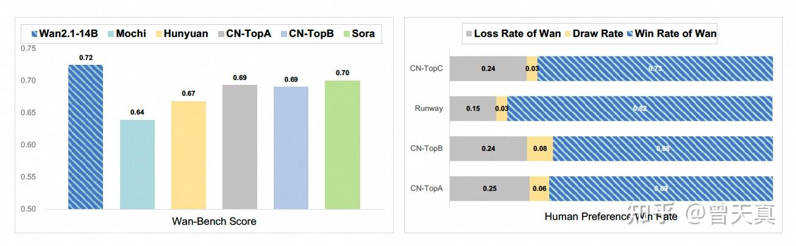

## 写在前面的个人理解：

### 1）开源值得敬佩。

### 2）算法层面优化：

最亮眼的优化，应该是加入Cache机制+分块的3D-Causual VAE ，也就是[WAN\_VAE](https://zhida.zhihu.com/search?content_id=255460585&content_type=Article&match_order=1&q=WAN_VAE&zhida_source=entity)，保证因果性的基础上实现无限长视频编解码，以及降低显存。在模型主架构上仍然沿袭了[DiT-Based](https://zhida.zhihu.com/search?content_id=255460585&content_type=Article&match_order=1&q=DiT-Based&zhida_source=entity)的模型，也没有过多提及。

这一点和笔者上一篇文章的解读应该也是一致的：

**_[曾天真：通义Wan2.1视频模型解读：Wan-VAE](https://zhuanlan.zhihu.com/p/28890549605)_**

### 3）高效推理和训练策略：

核心包括并行化，Cache缓存，以及量化等。提升模型效率做了非常多的工作。说明这篇文章确实是围绕实用的设计。

可以算是基础视频模型训练及应用的百科全书了，如果类比DeepSeek的话，应该是视频层面的[DeepSeek\_V3](https://zhida.zhihu.com/search?content_id=255460585&content_type=Article&match_order=1&q=DeepSeek_V3&zhida_source=entity)，整体上仍然沿袭了主流的模式。

### 4）模型优化空间：

**笔者不成熟的看法。**

**在缓存和高效推理层面：**应该还有很多优化空间（例如在后续的”扩散缓存“章节，使用的缓存方式和计算逻辑就有大幅度提升的方式）。

**质量优化：**模型部分，目前也没有其他更好的选择，包括WAN-VAE在内的优化更多还是围绕效率来做的，没有针对”质量“或者物理交互真实性等优化。（目前优化视频质量的方式依然是数据驱动）。

**5）下游应用接入：**

**可以预见的是马上就有很多论文和应用会基于Wan进行优化，效果确实很好。希望能在Wan2.1基础上出现类似于DeepSeek-R1的革命性突破。**

  

**下面是全文》〉》〉》〉》》〉》〉》〉》》〉》〉》〉》》〉》〉》〉》**

1.  **领先性能**：Wan 的 14B 模型在一个包含数十亿张图像和视频的庞大数据集上训练，展示了视频生成在数据和模型规模方面的扩展规律。它在多个内部和外部基准测试中持续优于现有的开源模型和最先进的商业解决方案，显示出明显且显著的性能优势。
2.  **全面性**：Wan 提供了两个功能强大的模型，即 1.3B 和 14B 参数，分别用于效率和效果。它还涵盖了多个下游应用，包括图像到视频、指导性视频编辑和个人视频生成，涉及多达八个任务。同时，Wan 是首个能够生成中英文视觉文本的模型，显著增强了其实用价值。
3.  **消费级效率**：1.3B 模型展现出卓越的资源效率，仅需 8.19 GB 的显存，使其与广泛的消费级 GPU 兼容。与更大的开源模型相比，它在文本到视频的性能上也表现优越，展现出显著的效率。

## 数据预处理模块：

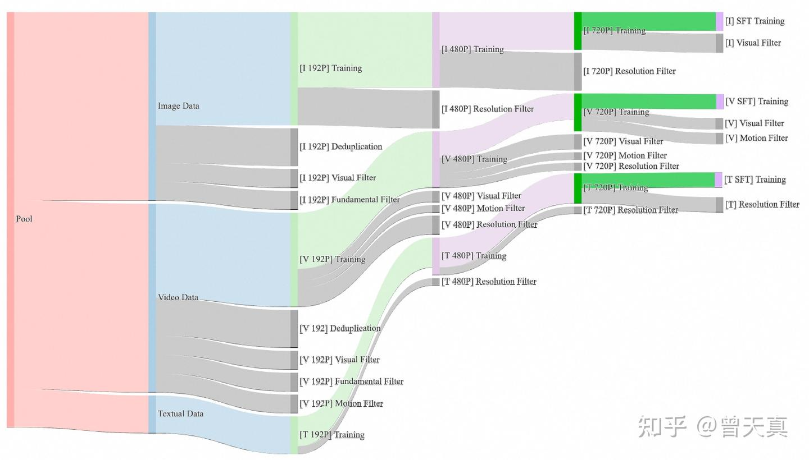

**基本过滤指标：**

我们数据过滤框架的基本维度关注源视频和图像数据的内在属性，使得能够高效地初步过滤掉所有不适合的数据。具体来说，我们的多维过滤方法涵盖以下关键方面：

-   **文本检测**：我们实现了一个轻量级的光学字符识别（OCR）检测器，以量化文本覆盖率，有效排除具有过多文本元素的视频和图像，以保持视觉清晰度。
-   **美学评估**：我们使用广泛采用的 LAION-5B（Schuhmann 等，2021）美学分类器对我们的图像进行初步质量评估，快速过滤掉低质量数据。
-   **不适合的内容评分（NSFW Score）**：通过我们的内部安全评估模型，我们系统地评估和过滤所有训练数据中计算得出的 NSFW 评分，以排除不适当内容。
-   **水印和标志检测**：我们检测视频或图像是否包含水印和标志，在训练过程中裁剪这些元素。
-   **黑边检测**：利用基于启发式的方法，我们自动裁剪多余的黑边，以保持对内容丰富区域的关注。
-   **过曝检测**：我们训练的专家分类器评估并过滤具有异常色调分布的数据，以确保训练数据集的最佳视觉质量。
-   **合成图像检测**：实证表明，即使是最小的污染（< 10%）由生成图像造成，都会显著降低模型的性能。因此，我们训练一个专家分类器来过滤掉这些“污染”图像。
-   **模糊检测**：我们内部开发的模型为训练材料分配定量模糊评分，使得可以系统性地删除视觉上模糊不清的内容。
-   **持续时间和分辨率**：我们还施加约束，要求视频持续时间必须超过 4 秒，并在不同的训练阶段应用分辨率阈值，以过滤掉低质量数据。

**视觉质量：**

这主要涉及从候选数据集中选择相对高质量并符合预训练标准的数据。这一数据子集必须具有良好的视觉质量，其整体分布应与自然数据一致。

**运动质量**。运动质量评估的目标是选择自然、完整且具有显著运动的视频，同时避免静态或抖动的运动。我们将视频数据分为六个不同的运动质量等级：

-   **最佳运动**：这一等级代表了具有最佳属性的视频，例如显著的运动布局、视角和幅度，以及清晰、平滑的运动。
-   **中等质量运动**：这一类别的视频表现出明显的运动，但可能存在多个主体或部分遮挡等小问题。这些数据确保了运动的多样性，并可在预训练中使用，帮助模型更好地理解时空关系。
-   **静态视频**：这一类别主要关注聊天和访谈风格的视频。尽管这些视频信息的运动很少，但它们的质量很高。因此，我们需要将它们单独识别并减少它们的采样比例。
-   **相机驱动的运动**：以相机运动（例如航拍镜头）为主的镜头，主体运动极少。由于它们与静态图像的相似性，这些视频的采样优先级相对较低。
-   **低质量运动**：展示出过多主体、严重遮挡或主体不清晰的视频（例如拥挤的街头场景）。由于其对训练效率和运动质量的负面影响，这类内容将被排除。

**视觉文本数据：**

此外，我们还引入了一种新颖的数据处理方法，以增强 Wan 的视觉文本生成能力。该方法包括两个不同的处理分支，旨在提高文本渲染的准确性和和谐性。一方面，我们通过在纯白背景上渲染汉字，合成了数亿张包含文本的图像。另一方面，我们从广泛的现实世界数据中收集了大量包含文本的图像。我们利用多个OCR模型准确识别图像和视频中的英文和中文文本，并将提取的文本内容输入到多模态语言模型 [Qwen2-VL](https://zhida.zhihu.com/search?content_id=255460585&content_type=Article&match_order=1&q=Qwen2-VL&zhida_source=entity) 中。这个过程生成图像的自然描述，确保描述尽可能包含准确的文本内容。

**后训练数据：**

后训练的核心目标是通过高质量数据改善生成视频的视觉逼真度和运动动态。我们在这一阶段的数据处理流水线采用了针对静态数据和动态数据的不同策略：图像数据经过优化以提升视觉质量，而视频数据则专门处理以精炼运动质量。  
  
**细粒度类别：**为了增强我们模型识别细粒度类别（如动物、植物和车辆）的能力，我们创建了一个包含数百万张跨这些类别的图像的数据集。

**关系理解：**我们通过收集专注于空间关系的数据集（如左、右、上和下），增强模型的关系理解，这些数据集是通过整合现有的物体检测数据集而获得的。

**重新注释字幕：**模型的一项重要能力是利用现有的标签或简短字幕生成详细的密集字幕。为此，我们策划了一个重新注释的数据集，该数据集根据图像内容将简短的文本标签或字幕扩展为详细描述。

**编辑指令字幕：**我们收集了描述两张图像之间差异或转变的数据集。这种类型的字幕在图像编辑任务中非常有价值。

**群组图像描述：**我们收集了一个为图像组提供描述的数据集。每个字幕以描述这些图像共享的共同特征开始，随后是对每张图像的个别描述，使用类似的措辞。

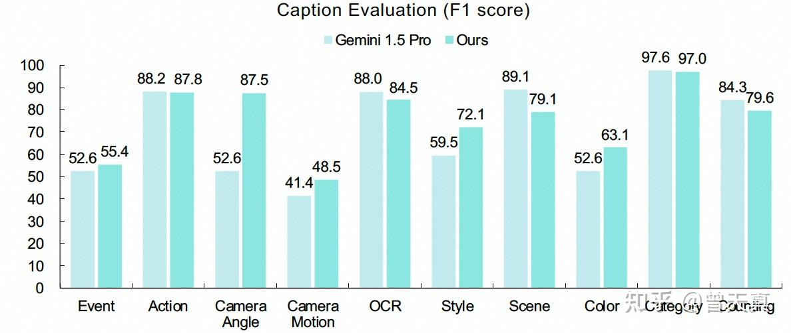

### 数据处理模型设计：

**基础架构**。我们的字幕模型采用 LLaVA 风格的架构。我们使用 ViT 编码器提取图像和视频帧的视觉嵌入。这些嵌入通过两层感知机进行投影，然后输入到 Qwen LLM中。

对于图像输入，我们采用与 LLaVA 相同的动态高分辨率方式。图像可以被划分为最多七个补丁。对于每个补丁，我们自适应地将视觉嵌入池化为 12×12 的网格表示，以减少计算量。

对于视频，我们每秒抽取 3 帧，最多限于 129 帧。为了进一步减少计算，我们采用慢-快编码策略：对每第四帧保持原始分辨率，而对其余帧的嵌入应用全局平均池化。在长视频基准上的实验表明，慢-快机制在使用有限数量的视觉标记时增强了理解能力（例如，在没有字幕的情况下，VideoMME（Fu et al., 2024）的性能从 67.6% 提升到 69.1%）。

## 模型设计与加速：

### 空间-时间变分自动编码器：

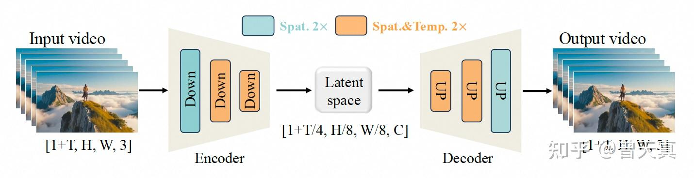

变分自编码器（VAEs）（Wu et al., 2024；Blattmann et al., 2023；OpenAI, 2024）在从高维视觉数据（尤其是视频）中学习紧凑的潜在表示方面起着至关重要的作用，促进了生成模型（例如扩散模型）的可扩展和高效训练。然而，针对视频生成任务设计有效的 VAE 面临几个挑战。

首先，视频固有地具有空间和时间两个维度，这要求 VAE 捕捉复杂的时空依赖关系。（3D-VAE可以解决时序）。

其次，视频的高维特性（例如，多个高分辨率像素的帧）增加了内存消耗和计算成本，使得将 VAE 扩展到长视频序列变得困难。（需要借助于类Tile/Cache的）。

第三，确保时间因果性（即未来帧不影响过去帧）对于生成现实和连贯的视频内容至关重要，但这一约束带来了额外的架构复杂性。（之前已经讲了很多了，Causal）。

为应对这些挑战，我们提出了一种新颖的3D因果VAE架构（Wan-VAE），专门用于视频生成。我们结合了多种策略来改进时空压缩、减少内存使用并确保时间因果性。这些增强使得Wan-VAE更加高效、可扩展，并更适合与基于扩散的生成模型（如DiT）集成。接下来，我们将介绍Wan-VAE的网络设计、训练细节、高效推理及其实验对比。

### 模型设计：

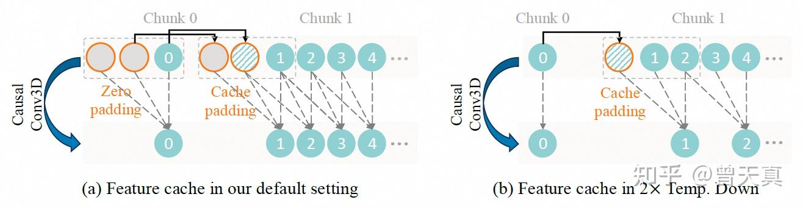

为了在高维像素空间和低维潜在空间之间实现双向映射，我们设计了一种如图5所示的3D因果变分自动编码器（VAE）。给定一个输入视频 ( V \\in R^{(1+T) \\times H \\times W \\times 3} )，Wan-VAE 将其时空维度压缩至 (\[1 + T/4, H/8, W/8\])，同时将通道数 ( C ) 扩展到16。

具体来说，第一帧仅进行空间压缩，以更好地处理图像数据，这遵循了 MagViT-v2 的设计（Yu 等，2023）。在架构方面，我们将所有 GroupNorm 层替换为 RMSNorm 层（Zhang 和 Sennrich，2019），以保持时间因果性。这一修改使得特征缓存机制得以应用，显著提高了推理效率。此外，我们在空间上采样层中将输入特征通道减半，从而在推理过程中减少了33%的内存消耗。

通过进一步精心调整基础通道的数量，Wan-VAE 实现了一个仅有1.27亿参数的紧凑模型规模。这种优化减少了编码时间和内存使用，从而有利于后续扩散变压器模型的训练。

### （Wan-VAE）训练：

我们采用三阶段的方法来训练 Wan-VAE。首先，我们构建一个具有相同结构的 2D 图像 VAE，并在图像数据上进行训练。然后，我们将训练良好的 2D 图像 VAE 扩展为 3D 因果 Wan-VAE，以提供初始的空间压缩先验，这相比于从头训练视频 VAE 大幅提高了训练速度。在这一阶段，Wan-VAE 在低分辨率（128×128）和小帧数（5 帧）的视频上进行训练，以加速收敛速度。训练损失包括 L1 重构损失、KL 损失和 LPIPS 感知损失，权重系数分别为 3、3e-6 和 3。最后，我们在不同分辨率和帧数的高质量视频上微调模型，结合来自 3D 判别器的 GAN 损失（Esser et al., 2021）。

### 高效推理：

为了高效支持任意长度视频的编码和解码，我们在 Wan-VAE 的因果卷积模块中实现了**_特征缓存机制_**。

具体来说，视频序列帧的数量遵循 1 + T 的输入格式，因此我们将视频划分为 1 + T/4 个块，这与潜在特征的数量一致。在处理输入视频序列时，模型采用块策略，每次编码和解码操作仅处理与单个潜在表示对应的视频块。根据时间压缩比，每个处理块中的帧数量限制为最多 4，从而有效防止内存溢出。

为了确保上下文块之间的时间连续性，我们的模型策略性地保留前一个块的帧级特征缓存。这些缓存特征系统性地被整合到后续块的因果卷积计算中。具体过程如图 6 所示，展示了我们特征缓存机制中的两个典型场景。在图 6 (a) 中，在我们的默认设置下，因果卷积不改变帧的数量，我们需要从历史帧中维护两个缓存特征（卷积核大小为 3）。对于初始块，我们应用零填充和两个虚拟帧来初始化缓存缓冲区。后续块系统性地重用前一个块的最后两个帧作为缓存特征，同时丢弃过时的历史数据。图 6 (b) 展示了涉及 2 倍时间下采样（步幅为 2）的场景。在这里，这一场景需要不同的缓存管理：我们为非初始块单独实现单帧缓存填充，以确保维度一致性。这一配置保证了输出序列长度遵循精确的下采样比例，同时在块的边界保持因果关系。

这一特征缓存机制不仅优化了内存利用率，还保持了跨块边界的特征一致性，从而支持了无限长度视频的稳定推理。

## 主模型设计：

### 模型训练：

在本节中，我们将详细介绍基础视频模型的架构设计，特别是针对文本到视频任务的架构，以及预训练和后训练阶段的详细信息。

在图 9 中，我们展示了 Wan 的架构，该架构基于当前主流的 DiT架构设计，通常由三个主要组件组成：Wan-VAE、扩散 Transformer 和文本编码器。对于给定视频 V∈R(1+T)×H×W×3_V_∈_R_(1+_T_)×_H_×_W_×3，Wan-VAE 的编码器将其从像素空间编码到潜在空间 ( x \\in R^{1+T/4 \\times H/8 \\times W/8} \\ )，然后将其送入后续的扩散 Transformer 结构。

### 视频扩散 Transformer：

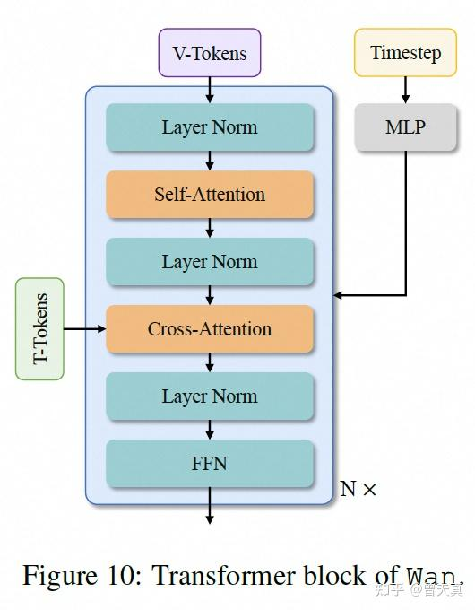

扩散 Transformer 主要由三个组件组成：一个块划分模块、Transformer 块和一个反块划分模块。在每个块中，我们专注于有效建模时空上下文关系，并嵌入文本条件以及时间步。 在块划分模块中，我们使用一个核大小为（1, 2, 2）的 3D 卷积，并应用平坦化操作将 x_x_ 转换为形状为（B, L, D）的特征序列，其中 B 表示批量大小，L=(1+T/4)×H/16×W/16_L_\=(1+_T_/4)×_H_/16×_W_/16 表示序列长度，D 表示潜在维度。

具体而言，如图 10 所示，我们采用交叉注意力机制来输入文本条件，这可以确保模型在长上下文建模下仍然保持跟随指令的能力。此外，我们使用一个包含线性层和 SiLU（Elfwing et al., 2018）层的多层感知机（MLP）来处理输入的时间嵌入，并个别预测六个调制参数。这一 MLP 在所有 Transformer 块中共享，每个块学习一组不同的偏置。通过大量实验，我们证明这一设计可以将参数数量减少约 25%，并在相同参数规模下显著提升性能。

### 文本编码器：

Wan 的架构使用 [umT5](https://zhida.zhihu.com/search?content_id=255460585&content_type=Article&match_order=1&q=umT5&zhida_source=entity)（Chung et al., 2023）来编码输入文本。通过大量实验，我们发现 umT5 在我们的框架中具有多个优势：1）它拥有强大的多语言编码能力，能够有效理解中文和英文，以及输入的视觉文本；2）在相同条件下，我们发现 umT5 在组合性能上优于其他单向注意力机制的 LLM；3）它展现出卓越的收敛性，umT5 在相同参数规模下能够更快收敛。基于这些发现，我们最终选择 umT5 作为我们的文本编码器。

## 预训练：

我们利用（[Flow-Matching](https://zhida.zhihu.com/search?content_id=255460585&content_type=Article&match_order=1&q=Flow-Matching&zhida_source=entity)/Rectified Flows）流匹配框架，来建模图像和视频领域统一的去噪扩散过程。我们首先对低分辨率图像进行预训练，然后进行图像和视频的多阶段联合优化。在各个阶段，图像和视频的联合训练在不断上升的数据分辨率和延长的时间持续性中进行。

### 训练目标：

流匹配提供了一个理论上合理的框架，用于在扩散模型中学习连续时间生成过程。它避免了迭代速度预测，使得通过常微分方程（ODE）进行稳定训练成为可能，同时保持与最大似然目标的等效性。在训练过程中，给定一个图像或视频的潜在变量 _x_1​、一个随机噪声 _x_0​∼_N_(0,_I_)，以及从对数-正态分布中采样的时间步 _t_∈\[0,1\]，我们获得一个中间潜在变量 _xt_​ 作为训练输入。遵循Rectified Flows，xt_xt_​ 被定义为 x0_x_0​ 和 x1_x_1​ 之间的线性插值，即：

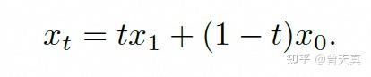

真实速度 _vt_​ 是：

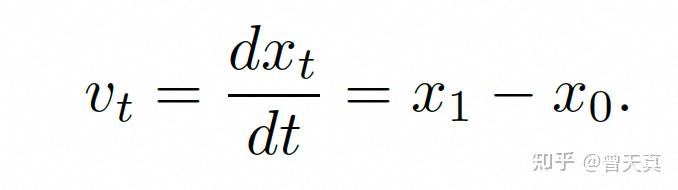

模型的训练目标是预测速度，因此损失函数可以表述为模型输出与 _vt_​ 之间的均方误差（MSE）。

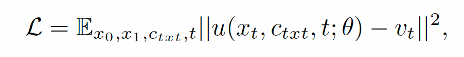

最后训练形式也是一个多阶段的流程：图像预训练，图像-视频联合训练。

### Post-Training：

在后训练阶段，我们保持与预训练阶段相同的模型架构和优化器配置，并使用预训练的检查点初始化网络。我们在 480px 和 720px 的分辨率下进行联合训练，使用在第 3.2 节中详细介绍的后训练视频数据集。

### 模型扩展与训练效率：

### 工作负载分析：

在 Wan 中，与文本编码器和 VAE 编码器相关的计算成本低于 DiT 模型，这在训练期间占据总体计算的 85% 以上。对于 DiT 模型，主要的计算成本由表达式 _L_(_αbsh_2+_βbs_2_h_) 给出，其中 _L_ 表示 DiT 层数，_b_ 是微批次大小，_s_ 表示序列长度，_h_ 表示隐藏维度大小。

这里，_α_ 对应于线性层的成本，_β_ 对应于注意力层的成本，对于 Wan 中使用的非因果注意力，正向传播时 _β_ 为 4，反向传播时为 8。与一般的 LLM 模型不同，Wan 处理的序列长度 s_s_ 往往达到数十万甚至更多。由于注意力的计算成本随着标记数量的增加呈二次增长，而与线性层相关的成本只呈线性增长，因此注意力机制逐渐成为训练的瓶颈。在序列长度达到 100 万的情况下，注意力的计算时间可能占到端到端训练时间的 95%。

在训练过程中，只有 DiT 模型被优化，而文本编码器和 VAE 编码器保持冻结状态。因此，GPU 内存使用主要集中在训练 DiT 上。DiT 的 GPU 内存使用可以表示为 _γLbsh_，其中 _γ_ 取决于 DiT 层的实现，L_L_ 表示 DiT 层数。由于视频标记、输入提示和时间步被作为模型输入，γ_γ_ 的值通常大于普通 LLM 模型。例如，标准 LLM 的 _γ_ 可能为 34（Korthikanti et al.），而 DiT 模型的 _γ_ 可以超过 60。因此，当序列长度达到 100 万个标记且微批次大小为 1 时，14B DiT 模型中激活的总 GPU 内存使用可以超过 8 TB。

总的来说，Wan 中主要的计算成本来自于注意力机制。虽然计算成本随着序列长度 s_s_ 的增加呈二次增长，但 GPU 内存使用仅随 s_s_ 线性增加。

## 一些训练策略：

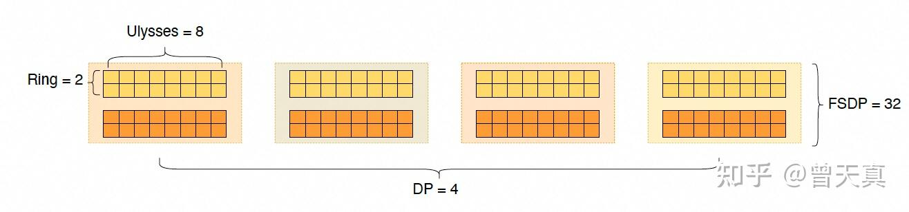

### 并行策略：

Wan 模型主要由三个模块组成：VAE、文本编码器和 DiT。根据第 4.1.3 节中概述的缓存机制优化，VAE 模块的 GPU 内存使用量最小，能够无缝地采用数据并行（DP）。相比之下，文本编码器需要超过 20 GB 的 GPU 内存，因此需要使用模型权重分片以节省后续 DiT 模块的内存。为了解决这个问题，我们采用了 DP 方法，结合完全分片数据并行（FSDP）策略。DiT 的模型参数、梯度和优化器状态将超过单个 GPU 的容量，在涉及 100 万标记且批量大小为 1 的场景中，激活存储将达到大约 8 TB。此外，DiT 部分占据了整体计算工作负载的重要比例。因此，我们专注于为 DiT 模块开发高效的分布式策略。

### DiT 并行策略

考虑到 DiT 模型的适中大小，以及优化重叠计算与通信并最大化数据并行（DP）规模，我们选择 FSDP 作为我们的参数分片策略。

关于激活值，DiT 块的输入形状为 \[b, s, h\]，其中 b 维对应数据并行，s 表示序列长度，h 表示隐藏维度。因此，我们需要检查 s 维和 h 维的分片策略。在 s 维上，分片通过上下文并行（CP）实现，常见的方法包括 Ulysses和环形注意力（Ring Attention）。

在 h 维上，分片主要涉及 Megatron 的张量并行（TP）(Shoeybi et al., 2019) 结合序列并行（SP）(Korthikanti et al.)，通过拆分权重来分片激活值的隐藏维度。由于 CP 的通信开销小于（TP + SP），我们建议使用 CP 来加速批级计算，并减少每个 GPU 上的激活内存占用。

我们设计了一种二维（2D）CP，结合了 Ulysses 和环形注意力的特点，类似于 USP。在这个设计中，外层采用环形注意力，内层采用 Ulysses。这种组合减轻了 Ulysses 中固有的跨机器通信慢的问题，并解决了环形注意力分片后对大块尺寸的需求，从而最大化了外层通信与内层计算之间的重叠。在序列长度为 256K 且跨 2 台机器的 16 个 GPU 的情况下，2D 上下文并行的通信开销从使用 Ulysses 时的 10% 以上降低到 1% 以下。

FSDP 组和 CP 组在 FSDP 组内交叉， DP 大小等于 FSDP 大小除以 CP 大小。在满足内存和单批次延迟要求后，我们使用 DP 进行扩展。图 11 展示了 DiT 模块的分布式方案。例如，在 128 个 GPU 的配置中，CP 大小为 16，Ulysses 设置为 8，环形注意力设置为 2；FSDP 设置为 32，对应于批量大小为 2b；DP 设置为 4，导致全局批量小为 8b。

### 不同模块的分布式策略切换：

在训练过程中，不同模块使用相同的资源。

具体而言，我们对 VAE 和文本编码器应用 DP，而 DiT 模块则采用 DP 和 CP 的组合。因此，当 VAE 和文本编码器的输出在训练过程中输入到 DiT 模块时，有必要切换分布式策略以避免资源浪费。

具体来说，CP 要求 CP 组内的设备读取相同的批次数据。然而，如果 VAE 和文本编码器部分的设备也读取相同的数据，就会导致冗余计算。为了消除这种冗余，CP 组内的设备最初读取不同的数据。然后，在执行 CP 之前，我们进行大小等于 CP 大小的循环遍历，依次广播 CP 组内不同设备读取的数据，以确保 CP 内的输入是相同的。通过这种方式，VAE 和文本编码器在单次模型迭代中的时间比例减少到 1/CP，从而提升总体性能。

### 内存优化：

如前所述，Wan 中的计算成本随着序列长度 s_s_ 的增加呈二次增长，而 GPU 内存使用量则随 s_s_ 线性增长。这意味着在长序列场景中，计算时间最终可能超过用于卸载激活的 PCIe 传输时间。具体而言，卸载一个 DiT 层的激活所需的 PCIe 传输时间可以与仅 1 到 3 个 DiT 层的计算重叠。与梯度检查点（GC）策略（Chen et al., 2016）相比，允许计算重叠的激活卸载（Rhu et al., 2016）提供了一种有效减少 GPU 内存使用的方法，而不会牺牲端到端性能。因此，我们优先考虑激活卸载以减少 GPU 内存。在长序列场景中，由于 CPU 内存也容易耗尽，我们将卸载与 GC 策略结合，优先对具有高 GPU 内存与计算比率的层进行梯度检查点。

## 推理策略：

推理优化的主要目标是尽量减少视频生成的延迟。与训练不同，推理过程涉及多个采样步骤，通常大约需要50步。因此，我们采用了量化和分布式计算等技术来减少每个单独步骤所需的时间。此外，我们利用步骤之间的注意力相似性来减少整体计算负载。对于无分类器指导（CFG），我们利用其内在的相似性进一步最小化计算需求。

### 并行策略：

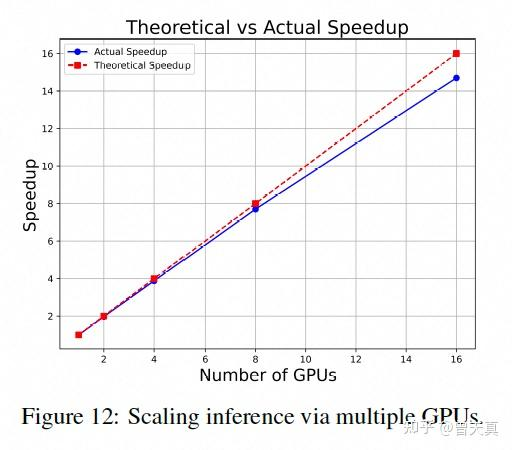

通过多个GPU扩展推理。 正如第4.3.2节所讨论的，我们使用上下文并行来减少生成单个视频的延迟，当扩展到多个GPU时。此外，对于像Wan 14B这样的大型模型，我们采用模型分片以缓解GPU内存限制。模型分片策略：鉴于推理过程中序列长度较长，相比于TP（张量并行），FSDP（完全分片数据并行）产生较少的通信开销，并允许计算重叠。因此，我们采用FSDP方法进行模型分片，这与我们的训练方法一致。上下文并行策略：我们使用与训练阶段相同的2D上下文并行，RingAttention作为外循环，Ulysses作为内循环。配备了2D上下文并行和FSDP并行策略，DiT在Wan 14B模型上实现了几乎线性的加速比，如图12所示。

这段翻译详细介绍了如何通过不同的技术和策略优化视频生成的推理过程，包括量化、分布式计算以及特定的并行策略（如上下文并行和模型分片），从而在保证性能的同时减少计算资源的需求。

### 扩散缓存：

我们对 Wan 模型进行深入分析，确定其推理过程中的以下特征：

-   **注意力相似性**：在同一个 DiT 块中，不同采样步骤的注意力输出表现出显著的相似性。
-   **CFG 相似性**：在采样的后期阶段，有条件的 DiT 输出与无条件输出之间存在明显的相似性。

这些发现也在最近的研究中得到了强调，例如 DiTFastAttn 和 FasterCache 。我们利用这些特征实现了扩散缓存，以减少计算工作负载。具体而言，我们针对 Wan 模型量身定制了扩散缓存，以确保无损性能。我们使用验证集选择某些步骤进行缓存：

-   **注意力缓存**：对于注意力组件，我们每隔几步进行一次注意力前向传播并缓存结果，将缓存结果重复用于其他步骤。
-   **CFG 缓存**：对于无条件部分，我们每隔几步进行一次 DiT 前向传播，并重复使用条件结果。此外，我们还应用了类似于 FasterCache 的残差补偿方法，以防止细节的降级。

在将扩散缓存应用于 Wan 14B 文本到视频模型后，我们的推理性能提高了 1.62 倍。

### 量化：

### FP8 GEMM：

我们发现，使用 FP8 精度进行 GEMM 操作，并结合对权重的每个张量量化和在采样步骤中的每个标记量化，带来的性能损失最小。因此，我们在 DiT 块中的所有 GEMM 操作中应用 FP8 量化。FP8 GEMM 的性能是 BF16 GEMM 的两倍，并在 DiT 模块中实现了 1.13 倍的加速。

### 8-Bit FlashAttention：

尽管 FlashAttention3 实现了高性能，但其原生 FP8 实现的实验结果显示在视频生成中存在显著的质量降级。相反，SageAttention 采用了混合精度的 int8 和 fp16 来减少精度损失，但没有为 Hopper GPU 提供具体的适配。根据本报告发布时的情况，SageAttention 的后续优化显示了更好的 Hopper 兼容性。未来的工作将探讨这些性能提升的整合。

我们展示了应用于 FA3-FP8 实现的优化，重点关注数值稳定性和计算效率。

### 准确性：

为了缓解在 FA3-FP8 量化下 Wan 中观察到的注意力数值错误，我们应用了两种主要技术：

-   **混合 8 位优化**：FA3 的原生实现对所有输入张量（Q、K、V）使用 FP8（E4M3）。根据我们对数据分布的分析和 SageAttention 的经验数据，我们采用了一种混合量化策略：对 S=QKT_S_\=_QKT_ 使用 Int8，对 O=PV_O_\=_PV_ 使用 FP8。
-   **用于跨块减法的 FP32 累加**：原生 FP8 WGMMA 实现采用 14 位累加器，使其在长序列处理过程中容易出现溢出。为了解决这一限制，我们的方法在块内部使用 FP8 WGMMA 进行 PV 减法，同时通过使用 Float32 寄存器的 CUDA 核心实现跨块累加，这**_一策略灵感来源于 DeepSeek-V3 的 FP8 GEMM 方法。_**

### 性能：

为了在混合 INT8-FP8 量化下保持内核性能，同时提高 _O_\=_PV_ 的累加精度，我们采用了两种技术：

-   **将 Float32 累加与内部工作组流水线结合**。FlashAttention3 采用了一种内部工作组流水线，将 WGMMA 与 softmax 和缩放操作重叠。为了减轻性能损失，我们将 Float32 累加与重新缩放操作进行融合。
-   **块大小调整**。由于 Float32 PV 累加寄存器跨块引入了额外的寄存器压力，我们调整了块大小以减少寄存器溢出。优化后，我们的 8 位 FlashAttention 在 NVIDIA H20 GPU 上达到了 95% 的最大功能利用率（MFU）。

因此，使用 8 位 FlashAttention，我们的推理效率提高了超过 1.27 倍。

### 提示词对齐：

提示对齐旨在通过将用户输入的提示与训练中使用的字幕格式和风格进行对齐，从而提升模型推理的有效性。我们在这个过程中采用了两种主要策略。首先，我们为每个视频增强多种字幕，从而增加多样性。其次，我们重写用户提示，使其与训练阶段视频字幕的分布相一致。以下是对这些策略的详细说明。

为了适应多样化的用户输入，每个图像或视频都配有多个反映不同风格和长度的字幕。例如，我们使用不同长度（如长、中、短）和风格（如正式、非正式、诗意）的字幕，创建了一组多样化的样本-字幕对作为我们的训练数据。这些字幕建立了文本与视频之间不同的映射关系，有效覆盖了用户可能提供的各种提示。尽管字幕具有多样性，但数据集中字幕与用户输入提示之间通常存在分布不匹配的问题。通常，用户更倾向于简洁的提示，由几个简单的单词组成，这比训练字幕要短得多。这种差异可能对生成视频的质量产生不利影响。

为了解决这个问题，我们利用大型语言模型（LLM）重写提示，精炼用户提示。我们的主要目标是将这些经过精炼的提示的分布与训练字幕的分布对齐，从而提高推理性能。在重写用户提示时，LLM 遵循以下原则：

1.  我们指导 LLM 为提示添加细节，而不改变其原始含义，从而增强生成场景的完整性和视觉吸引力。
2.  重写的提示应包含自然运动属性，我们根据主题的类别为对象添加适当的动作，以确保生成视频中的运动更加流畅和自然。
3.  我们建议将重写的提示结构类似于训练后字幕，首先说明视频风格，然后概述内容，最后提供详细描述。这种方法有助于将提示与高质量视频字幕的分布对齐。

我们在基准测试中评估了 LLM 辅助的提示重写的有效性，并在表 1 中展示了若干结果。我们的发现表明，具有强大指令跟随能力的 LLM 可以生成适合的提示，从而增强视频生成。为了平衡速度和性能，我们使用 Qwen2.5-Plus 作为我们的重写模型。

## 实验部分：

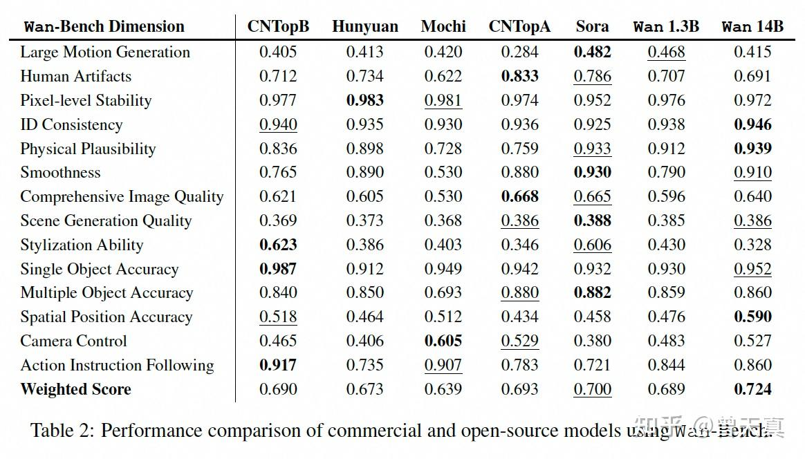

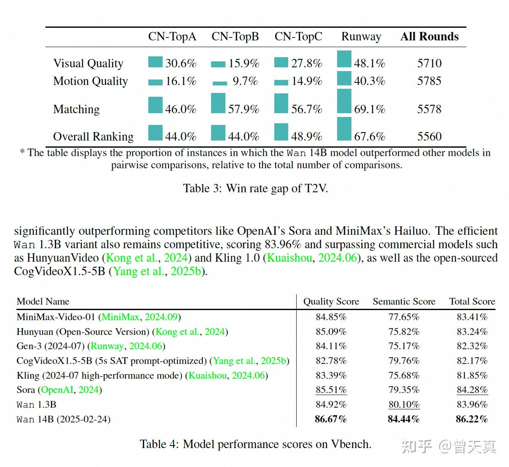

  
其他视频生成基座模型解读&历史文章：

**_[曾天真：长文解读Hunyuan-Video：来自腾讯的高质量中文通用视频模型。重磅开源，伟大无需多言](https://zhuanlan.zhihu.com/p/10529487486)_**

**_[曾天真：Goku：来自字节的视频生成基座模型，基于Flow-Based Model组建模型](https://zhuanlan.zhihu.com/p/23034846866)_**

**_[曾天真：聊聊Open-Sora-Plan V1.3 视频模型中的一些关键更新](https://zhuanlan.zhihu.com/p/16692163519)_**

**_[曾天真：HunYuan-Video 代码解读之3D-VAE](https://zhuanlan.zhihu.com/p/10991180604)_**

**_[曾天真：【AIGC-AI视频生成系列-36】Meta-Movie Gen：解读来自Meta(facebook) 视频生成模型96页技术报告，上-架构篇](https://zhuanlan.zhihu.com/p/892227816)_**

**_[曾天真：【AIGC-AI视频生成系列-30】CogVideoX：清影开源视频生成模型，开源视频生成算法新SOTA](https://zhuanlan.zhihu.com/p/716644389)_**

## **_【-END-】_**

对AIGC相关应用，算法前沿以及创业/工作感兴趣的同学，可以加微信：**Zeng\_AIGC**，**_备注：研究方向+学校/公司 + 知乎_** 即可加入交流群。

欢迎大家与创业团队，大厂leader以及顶尖名校的算法研究同学共同交流。

**另外想入AIGC算法方向，或者有疑惑的同学，也欢迎咨询：Zeng\_AIGC，_备注：AIGC+咨询_** **_对于AIGC，扩散模型相关应用，算法，实践感兴趣的欢迎关注我～_**