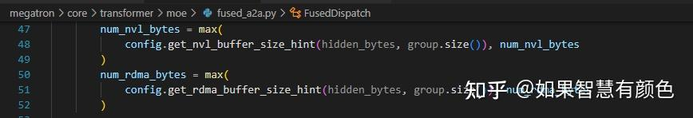
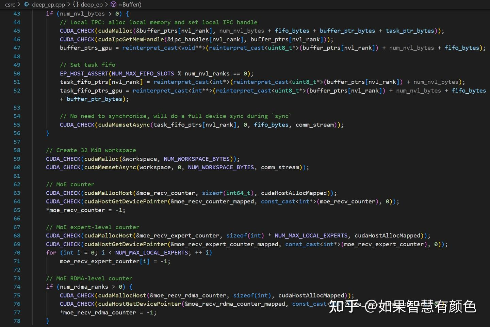
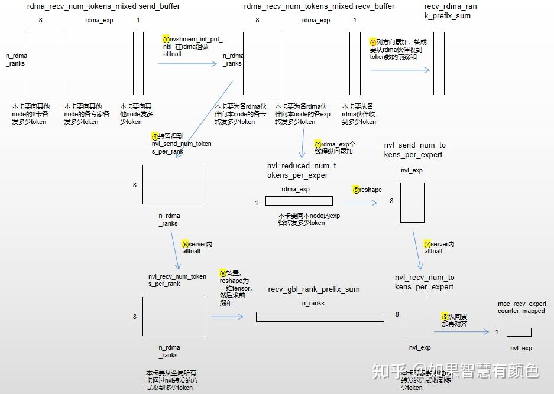

# DeepEP 代码解析

**Author:** 如果智慧有颜色

**Date:** 2025-05-27

**Link:** https://zhuanlan.zhihu.com/p/1907510782557681422

代码为2025年5月18日主线

原理图可以参考这一篇 [Marlene：DeepEP Dispatch/Combine 图示](https://zhuanlan.zhihu.com/p/29273768638) 本文主要以代码为主

## 1.总体概括

[deepEP](https://zhida.zhihu.com/search?content_id=257891368&content_type=Article&match_order=1&q=deepEP&zhida_source=entity)主要分为多节点场景和单节点场景，还有cached\_mode，low\_latency\_mode等，此处都先忽略只看v3论文里对应的场景。先了解整体设计思路，可能会对后续读代码有帮助。

整体上看，deepEp启动了若干(当前设置为20)个SM，每个SM设置512个线程，调度时分为16个wrap，然后按照规则将这些wrap划分成五种角色：kRDMASender，kRDMASenderCoordinator，kRDMAAndNVLForwarder，kForwarderCoordinator，kNVLReceivers，然后构建了三级生产者-消费者模型。

定义

**伙伴**：一个node之内所有gpu互相为**nvl伙伴**，编号一般为0-7；所有node上nvl rank相同的卡互相为**rdma伙伴**

**结果顺序：**在返回token中会按照token来源的rankid排序，并且其内部也保序

1\. kRDMASender作为0级生产者，主要任务是生产（当缓冲区足够时向[rdma\_channel\_data](https://zhida.zhihu.com/search?content_id=257891368&content_type=Article&match_order=1&q=rdma_channel_data&zhida_source=entity)的send\_buffer中搬运）可以用来做rdma数据发送的token，并使用[rdma\_send\_channel\_tail](https://zhida.zhihu.com/search?content_id=257891368&content_type=Article&match_order=1&q=rdma_send_channel_tail&zhida_source=entity)变量通知kRDMASenderCoordinator当前搬运进度

2\. kRDMASenderCoordinator作为0级消费者和1级生产者，当其发现kRDMASender生产了足够数量（num\_max\_rdma\_chunked\_send\_tokens）的token之后，消费并作为1级生产者（将rdma\_channel\_data send\_buffer的token通过rdma方式发送到recv\_buffer中），并且更新rdma\_channel\_tail变量通知kRDMAAndNVLForwarder

3\. kRDMAAndNVLForwarder作为1级消费者和2级生产者，主要任务是将从RDMA伙伴收到的token转发给nvl伙伴，当其检测到 rdma\_channel\_tail 的值满足条件时，消费并作为2级生产者（rdma\_channel\_data recv\_buffer的token分别通过nvlink发送到对应[nvl\_channel\_x](https://zhida.zhihu.com/search?content_id=257891368&content_type=Article&match_order=1&q=nvl_channel_x&zhida_source=entity)、[nvl\_channel\_src\_meta](https://zhida.zhihu.com/search?content_id=257891368&content_type=Article&match_order=1&q=nvl_channel_src_meta&zhida_source=entity)、nvl\_channel\_x\_scales、[nvl\_channel\_topk\_idx](https://zhida.zhihu.com/search?content_id=257891368&content_type=Article&match_order=1&q=nvl_channel_topk_idx&zhida_source=entity)、[nvl\_channel\_topk\_weights](https://zhida.zhihu.com/search?content_id=257891368&content_type=Article&match_order=1&q=nvl_channel_topk_weights&zhida_source=entity)中），并更新nvl\_channel\_tail的值通知kNVLReceivers搬运进度，并且更新[forward\_channel\_head](https://zhida.zhihu.com/search?content_id=257891368&content_type=Article&match_order=1&q=forward_channel_head&zhida_source=entity)（消费情况）

4\. kForwarderCoordinator作为辅助线程，其跟踪kRDMAAndNVLForwarder对token的消费情况，并通过更新rdma\_channel\_head告知kRDMASender缓冲区空闲情况

5\. kNVLReceivers作为二级消费者，将kRDMAAndNVLForwarder生产的各个缓冲区内的结果搬到最终函数返回结果区 recv\_x，recv\_x\_scales，recv\_src\_meta，recv\_topk\_idx，recv\_topk\_weights，然后更新nvl\_channel\_head，相当于通知kRDMAAndNVLForwarder有空闲buffer，可以继续生产

## 2\. 代码走读

由于internode\_dispatch的输出token其实是对本地专家做完去重的结果，可以将megatron 0.12.0中MoEFlexTokenDispatcher的一次token\_permutation调用过程作为deepEP一次完整的用法。

### 2.1 初始化

**2.1.1 缓冲区大小计算**

首先计算rdma和nvl的buffer大小，注意**①**channel等于后续实际执行deepEP的SM数量的一半，deepEP在执行时会将输入token沿着seqlen维度切成channel份，每两个SM处理一份。**②**对于每个channel，rdma buffer为num\_rdma\_ranks个rdma伙伴分配缓冲区，nvl buffer为8个nvl伙伴分配缓冲区num\_max\_nvl\_chunked\_recv\_tokens、num\_max\_rdma\_chunked\_recv\_tokens表示缓冲区存储多少个slot，每个slot不仅存了token本身还存了scale，probs，topk等相关信息。**③**对于rdma buffer计算buffer大小时要乘2，在实际内存创建时又分为大小相等的send\_buffer和recv\_buffer；出于rdma发送效率考虑，kRDMASender每次取一个token复制到其topk选择的相关rdma伙伴对应的本地send\_buffer，在满足一定条件时发送到rdma伙伴对应的远端recv\_buffer中；而在node内nvl转发时直接从rdma的recv\_buffer发送到nvl伙伴的远端nvl buffer，所以不用乘2

**2.1.2内存资源分配和建链（非本文重点关注内容）**

分配nvl buffer并调用ipc相关接口，还有一些辅助内存创建

通过allgather收集nvl伙伴的远端nvl buffer对应的handle

调用ipc相关api，将handle重建成远端buffer，此时已具备直接向nvl伙伴的内存写数据的能力

allgather收集rdma伙伴的root\_unique\_id，然后创建rdma buffer，此时应该已具备直接向rdma伙伴内存写数据的能力

**2.1.3 整理统计topk\_idx**

执行统计相关信息的核函数，核函数配置 kNumExpertsPerSM=32，kNumRanksPerSM=8，总共拉起 n\_exp/kNumExpertsPerSM个SM去统计num\_tokens\_per\_expert，和n\_rank/kNumRanksPerSM个SM去统计num\_tokens\_per\_rdma\_rank，num\_tokens\_per\_rank，is\_token\_in\_rank

统计num\_tokens\_per\_rank分两步，每个SM负责统计本卡需要向第32\*sm\_id到第min(32\*(sm\_id+1)，n\_exp)-1个专家发几个token。首先将topk\_idx\[n\_token，K\]沿着0轴以256行为单位分块(充分利用缓存机制，加载一块topk\_idx进到SM缓存，每个thread统计一行)，thread在遍历topk\_idx行时，发现exp是属于SM对应统计范围时累加num\_tokens\_per\_expert\_per\_thread

之后用32个线程纵向累加num\_tokens\_per\_expert\_per\_thread的结果，存在返回参数**num\_tokens\_per\_expert**中

然后是统计1.本卡需要向每张卡各发送多少个token (**num\_tokens\_per\_rank**)；2.本卡需要向每台server各发送多少个token (**num\_tokens\_per\_rdma\_rank**)；3.每个token是否要发往对应的rank (**is\_token\_in\_rank**)。每个thread遍历一行topk\_idx，但仅统计每个token是否发到对应的rank或者server而不计算是否同一个token发给对应rank或者server具体几个专家，即对server间和server内的token收发都做了去重，因此整体token收发应该分为三个阶段，server间收发；server内代发；本卡复制给对应专家（由megatron完成）

### 2.2 notify\_dispatch

**2.2.1 全token信息前置计算**

sm0负责交换token数信息，大致步骤如下，注意 nvl\_recv\_num\_tokens\_per\_rank 和 nvl\_send\_num\_tokens\_per\_rank 分别为同一块内存的本地地址和远端其他卡上的地址在本卡的映射，nvl\_recv\_num\_tokens\_per\_expert和nvl\_send\_num\_tokens\_per\_expert同理。

rdma\_recv\_num\_tokens\_mixed是在rdma\_buffer\_ptr上分配的一块地址空间，分为send\_buffer和recv\_buffer两块，每块大小为 n\_rdma\_ranks \* (8+n\_exp/n\_rdma\_ranks+1) \* size(int32)，8，n\_exp/n\_rdma\_ranks，1 分别代表要向每个node的8个gpu，node上的各专家，整个node发多少个token。

然后起相关线程将num\_tokens\_per\_rank，num\_tokens\_per\_expert，num\_tokens\_per\_rdma\_rank搬到本卡send\_buffer

①通过server间同号卡rdma收发，相当于做了一个alltoall，结果放在recv\_buffer上，此时每张卡都知道了自己要从各rdma伙伴收到多少token，要向server内其他gpu转发多少token

②每个线程各自累加一个nvl\_reduced\_num\_tokens\_per\_expert结果值，计算本node上各个专家需要收到的来自所有rdma伙伴的token数

③累加得到本卡收到rdma token数前缀和 （302行ld\_volatile\_global语义是强行从hbm取值，不使用寄存器值，这样做是因为moe\_recv\_expert\_counter\_mapped是由一段首先在host侧分配的moe\_recv\_expert\_counter内存然后调用cudaHostGetDevicePointer映射进来然后初始化为-1的hbm，该操作可能是异步的，因此此处等初始化结束再往里面写值，防止覆盖，后续类似操作也同理）

④和⑥实际上是一步操作，直接通过8个thread直接写入远端send buffer对应地址，拆成两步画仅方便理解，

⑤和⑦也同理。

⑧第⑥步得到了需要从各个nvl伙伴转收到其各个rdma伙伴的token，转置之后再求前缀和，当本卡从nvl伙伴转收到原本来自第rank张卡的token时，可以用 rank==0?0:recv\_gbl\_rank\_prefix\_sum\[rank-1\] 的值计算本地偏移

⑨计算本卡各专家需要收到多少token

**2.2.2 逐channel信息前置计算**

is\_token\_in\_rank表示对于每个token，是否要发到对应rank。总共拉起kNumRDMARanks个SM，每个SM统计is\_token\_in\_rank中 \[n\_token，8\] 范围内的信息，然后总共执行n\_channel次wrap调度，每次计算每个channel范围内token的各个统计信息

### 2.3执行收发internode::dispatch

一共会拉起2\*n\_channel个SM，两个SM为一组，每组各自处理channel对应范围的token的收发，每个SM起512线程即16个wrap调度，每组32个wrap调度角色分配和target\_rank分配如下：

因为各组行为一致，仅处理的token为输入的不同切片，以及出于物理链路负载均衡考虑target\_rank的分配略有差异，后续图上都不会体现channel差异

**2.3.1 kRDMASender**

kRDMASender除了参与生产消费链之外，还构建了rdma\_channel\_meta信息(在本地时每行描述当前channel需要向各rdma所在node上各卡发多少token，发送到远端则表示收)并且发送给rdma伙伴，**kRDMAAndNVLForwarder在kRDMASender的该发送行为完成之后才会开始执行。**此处取负值再减一是为了与默认0值做区分，便于kRDMAAndNVLForwarder确认meta信息到达

总共分配7个wrap，每个wrap按照顺序各取一个token，一个wrap内 kNumRDMARank个线程分别取出该token在对应rdma rank的bitmap

通过595-596，617行严格保证wrap之间按照下标先后顺序执行，即在一个channel范围内的token会按下标顺序执行下面的代码，需要保序的值是rdma\_tail\_idx，rdma\_send\_channel\_next\_tail记录的是当前channel中，对于每一个rdma rank(算上当前token)已经发送了几个token，rdma\_tail\_idx则表示该channel当前token是向rdma rank发送的第几个token，注意区别rdma\_send\_channel\_tail是不包括当前token，该channel已经向rdma rank发送了几个token，因此不能交给硬件随机wrap调度，会导致rdma\_tail\_idx的值乱掉

接下来无所谓wrap调度顺序了。由于token不确定到底会分散到哪些rdma rank上，不利于后续sm资源利用（原因后面解释），假设当前token会发送给num\_topk\_ranks（kNumTopkRDMARanks最大为8，上层逻辑应该保证了每个token会发给不超过8个node）个rdma rank，则将这几个rank值收集起来放在topk\_ranks，所需的本地buffer地址放在dst\_send\_buffers中

这里624行 \_\_shfl\_sync(0xffffffff, rdma\_tail\_idx, i) 表示所有线程都从第i个线程获取到其寄存器中rdma\_tail\_idx的值，因此可以控制所有线程在整个for循环行为一致，就可以让32个线程生成同样的topk\_ranks和dst\_send\_buffers，便于后续最大化利用sm资源，而src\_meta数据量很小，没必要扣这么细，就让前num\_topk\_ranks个线程各自持有一个，然后各自复制到对应dst\_send\_buffers的位置即可

接下去就可以利用满一个wrap中的32个线程，将token本身，scale，topk\_idx，topk\_weights信息拷贝到rdma\_channel\_data中，完成生产

**2.3.2 kRDMASenderCoordinator**

num\_tokens\_to\_send 是从 rdma\_channel\_prefix\_matrix 还原出来的需要向各rdma伙伴发送的token数量，704则表示还有待发送的token，之后707-717行轮询每个rdma伙伴的kRDMASender的本地搬运情况，当发现某个rdma伙伴有num\_max\_rdma\_chunked\_send\_tokens个token可以发送时启动720-729行的发送过程，然后在737-741行更新对应rdma伙伴上的rdma\_channel\_tail信息

这里\_\_any\_sync(0xffffffff, num\_tokens\_to\_send > 0)表示每个线程各自判断num\_tokens\_to\_send > 0的布尔值，然后32个线程对该值取或，因此整个循环控制当rdma\_channel\_prefix\_matrix中计算出的所有token都被发送时才会退出

**2.3.3kRDMAAndNVLForwarder**

kRDMAAndNVLForwarder角色有8个wrap，每个wrap向编号为target\_rank的nvl伙伴发送数据。

起始时，每个wrap有kNumRDMARanks个活跃线程，各自等待lane\_id对应rdma伙伴的rdma\_channel\_meta信息（762），nvl\_channel\_prefix\_start、nvl\_channel\_prefix\_end用于kNVLReceivers重排转收到的token，起始时8wrap的同一个lane\_id对应的num\_tokens\_to\_recv\_from\_rdma值相同，分别表示对于当前wrap，每个对应的kRDMASenderCoordinator还可以为它生产多少个token，即可以用来跟踪自身作为消费者时还剩多少token可以消费

对于一个kRDMAAndNVLForwarder中的wrap来说，其对所有rdma伙伴token向其指定target\_rank的nvl伙伴转发，都用伙伴的同一段远端内存（实际是五块），通过nvl\_channel\_head（所处的内存地址是在本卡，但是由kNVLReceivers写远端内存的方式进行更新维护）和cached\_nvl\_channel\_tail（随着token发送进度维护）可以计算出远端内存的空闲情况，有一定的空间时，结束忙等即满足转发条件1（805-808）；之后开始轮询各rdma伙伴kRDMASenderCoordinator的生产情况，发现有待消费的token时结束忙等即满足转发条件2（823-827）

然后是开始消费，rdma\_channel\_data中，token本身后面跟着的SourceMeta信息里面携带了其对应is\_token\_in\_rank的信息，可以用于判断当前token是否需要转发至target\_rank（846），无论是否转发，该token对于target\_rank都算消费过了

然后是32个线程共同进行转发，将封装好的token分为nvl\_channel\_x、nvl\_channel\_src\_meta、nvl\_channel\_x\_scales、nvl\_channel\_topk\_idx、nvl\_channel\_topk\_weights，然后更新cached\_nvl\_channel\_tail（857），如果已经转发满了num\_max\_nvl\_chunked\_send\_tokens个token则提前结束本次消费生产。

然后将自身消费情况记录在forward\_channel\_head中，便于kForwarderCoordinator读取

并且通过写远端内存的方式告知kNVLReceivers当前的生产情况，便于其进行消费

**2.3.4 kForwarderCoordinator**

forward\_channel\_head shape为 \[8, n\_rdma\_ranks\]，每一个kRDMAAndNVLForwarder中的wrap维护一行，表示target\_rank对这些rdma伙伴生产的token的消费情况，而当一个rdma token被8个nvl伙伴都消费过，才算作被彻底消费了。因此forward\_channel\_head shape每列的最小值表示对于当前rdma伙伴生产的token，有多少已经被彻底消费，将该信息通过rdma\_channel\_head传递给kRDMASender让其决策是否继续生产

**2.3.5 kNVLReceivers**

由于最终的结果数据要求token保序（相对顺序和对EP域token做allgather时的token顺序一致），总体也是8个wrap，每个wrap处理从target\_rank号nvl伙伴转收到的token，然后利用每个wrap里前kNumRDMARanks个线程维护kNumRDMARanks个total\_offset（存在各自寄存器里），第wrap\_id上第lane\_id个线程的total\_offset表示在转收到第lane\_id个节点的wrap\_id的第一个token时，应该将它放在哪个位置。num\_tokens\_to\_recv则用于控制循环退出时机

由于所有从target\_rank号nvl伙伴转收的token都放在同一段内存中，有一个线程去忙等nvl\_channel\_tail就可以了，当发现有收到token就进入后续消费环节

通过meta信息中保存的token的rdma号（1008），所有线程都知道了该token应该放哪（1009），更新total\_offset（1010），然后是利用多线程搬运数据，完成消费，最后是更新nvl\_channel\_head，通知kRDMAAndNVLForwarder其消费情况，让其继续生产（1040）

## 3.代码细节处的一些设计思路分析

  

，应该是为了降低线程忙等时的查询代价，避免产生nvl流量