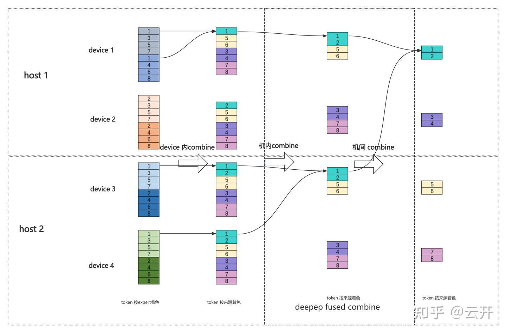

# 一点浅见：deepep 为什么快？

**Author:** 云开

**Date:** 2025-06-03

**Link:** https://zhuanlan.zhihu.com/p/28867733102

## [deepep](https://zhida.zhihu.com/search?content_id=254796055&content_type=Article&match_order=1&q=deepep&zhida_source=entity) 为什么快

最近 [megatron](https://zhida.zhihu.com/search?content_id=254796055&content_type=Article&match_order=1&q=megatron&zhida_source=entity)整合了deepep， 新增加了一个 MoEFlexTokenDispatcher。本文梳理 [MoEAlltoAllTokenDispatcher](https://zhida.zhihu.com/search?content_id=254796055&content_type=Article&match_order=1&q=MoEAlltoAllTokenDispatcher&zhida_source=entity) 与 MoEFlexTokenDispatcher 的实现， 并在此基础上分析 MoEFlexTokenDispatcher 比 MoEAlltoAllTokenDispatcher快的原因。

### MoEAlltoAllTokenDispatcher

moe layer 的逻辑大体是， input -> token\_permutation -> experts mlp -> token\_unpermutation -> output

### token\_permutation

MoEAlltoAllTokenDispatcher 的 token\_permutation 可以拆分为三个步骤。

all to all dispatch

### 1、permute

根据分发逻辑，按照 expert 的边界排布好 token， 这里的 token 数会膨胀 topk 倍。

### 2、alltoall

按照 ep 的边界， 把 token 发送到对应的卡。

### 3、sort\_chunks\_by\_idxs

第 2 步 alltoall 后， 需要把来自不同 ep rank 的属于同一个 expert 的 token 聚拢到一起。

### token\_unpermutation

unpermute 大体上是permute的逆向流程，同样可以拆分为三个步骤。

all to all combine

### 1、sort\_chunks\_by\_idxs

是 token\_permutation 第 3 步操作的逆操作

### 2、alltoall

是 token\_permutation 第 2 步操作的逆操作

### 3、unpermute

大体上， 是token\_permutation 第 1 步操作的逆操作。这里涉及到分发出去的 topk 个 token 聚合回一个 token, 这里的聚合是按照 router 的 score 加权。

### 可能存在的不足

megatron alltoall dispatcher 代码实现比较简洁，但是可能存在一个效率上的问题: 通信冗余。

以上图为例， 假设 device 1 、 device 2 在 host 1; device 3、device 4 在 host 2。 这里存在两个层次的通信冗余。

-   _同一个 token dispatch 到同一台 device 的不同 expert （如 token2 dispatch 到 device 2 的 两个 expert)。_
-   同一个 token dispatch 到同一台 host 的 不同 device (如 token2 dispatch 到 device 3 和 device 4)。 这个可以由一次机间通信加机内通信替代来减少机间通信（这个思路有点像 megatron 第2篇 paper 讲到的 pp + tp通信优化）。

这个通信冗余的问题在 ep 不跨机的时候可能不会有什么大问题（[H100 nvlink](https://zhida.zhihu.com/search?content_id=254796055&content_type=Article&match_order=1&q=H100+nvlink&zhida_source=entity) 900G 带宽），但是如果ep 跨机了，通信成为瓶颈的时候，这会成为一个问题。

### MoEFlexTokenDispatcher

MoEFlexTokenDispatcher 整合了 deepep。上面按照我们的分析，MoEAlltoAllTokenDispatcher 存在通信冗余， deepep 恰恰消除了通信的冗余。 对 deepep 机间机内通信 overlap, warp 特化等 deepseek technical report 已经讲到的点，这里就不展开了。这里只讲通信冗余消除这个点。

### token\_permutation

MoEAlltoAllTokenDispatcher 的 token\_permutation 可以拆分为2个步骤。

### 1、dispatch

每张卡获得各自需要的 token，是对 deepep fused\_dispatch 的封装。 因为 deepep 的 dispatch/combine 是层次化的， probs 等后续permute/unpermute 需要的信息也是跟着一起 dispatch.

### 2、get\_permuted\_hidden\_states\_by\_experts

dispatch 之后的 token, 按 local expert permute

### token\_unpermutation

unpermute 大体上是permute的逆向流程，同样可以拆分为2个步骤。

### 1、get\_restored\_hidden\_states\_by\_experts

get\_permuted\_hidden\_states\_by\_experts 的逆操作。

### 2、combine

dispatch 的逆操作， 是对 deepep fused\_combine 的封装。

### deepep

MoEFlexTokenDispatcher 是对 deepep 的封装，under the hood is where all the magic happens!

接下来展开分析 deepep。deepep里 与 token\_permutation/token\_unpermutation 对等的术语是 dispatch / combine。 以下内容是不求甚解地看deepep代码后的抽象理解，不保证和代码细节严格一致， 如有错漏，欢迎指正。

### dispatch

dispatch 分为 3 个阶段。

-   机间交换token
-   再机内交换 token
-   最后 device 内 permute

前两个阶段被 deepep 封装成了 fused\_dispatch。主体逻辑 fuse 在一个 kernel 里。

  

### combine

combine 大体是 dispatch 的逆过程。 也分为3 个阶段。

-   device 内 token combine
-   再机内 token combine
-   最后机间 token combine

后两个阶段被 deepep 封装成了 fused\_combine。主体逻辑 fuse 在一个 kernel 里。

deep ep combine

总得来说， deepep 对通信冗余的消除是通过层次化 dispatch/ combine： 两层通信（机间/机内），三层 permute/ unpermute （host 间， 同一 host device 间， 同 device expert 间)。

MoEFlexTokenDispatcher token\_permutation 第1步就是2层通信（机间/机内） + 2层 permute(host 间 + 同一 host device 间）， 第 2 步就是第 3 层 permute: 同一 device expert间permute。 token\_unpermutation 类似。

### 总结

MoEFlexTokenDispatcher 和MoEAlltoAllTokenDispatcher 各自是对deepep 和 alltoall 的封装，deepep dispatch / combine 比 alltoall dispatch / combine 快，个人觉得有以下这些原因。

### 冗余通信消除

首先， 是宏观上通信量的差异，deepep 利用层次化的 dispatch、combine 规避掉了机间、机内冗余的通信。 通信冗余消除得越多， deepep 相比 alltoall越有优势。 可能正是基于这个考虑， deepseek v3 限定了一个 token 最多被 dispatch 到 4 台机器。当 moe topk 为 8 的时候， 一个 token dispatch 到 4 台机器， 平均而言在每台机器命中 2 个 expert。

### 极致的工程实现

其次， 是工程细节上的极致优化，包括kernel fusion,机间、机内通信 overlap， warp 特化等。