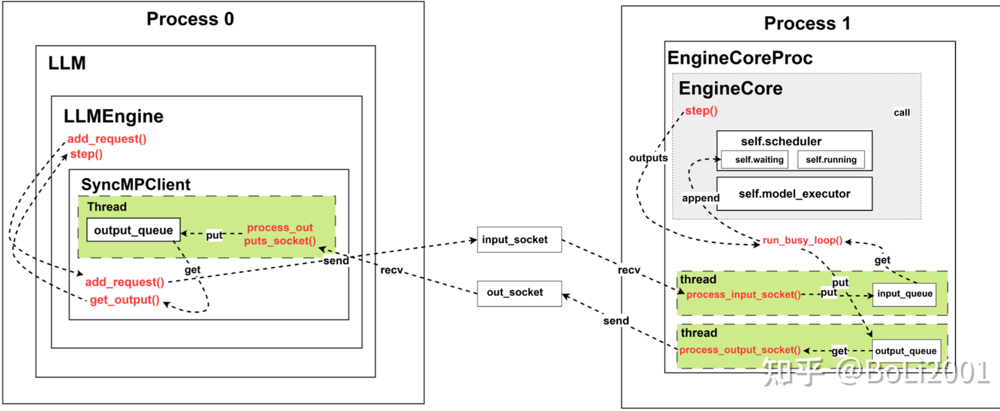
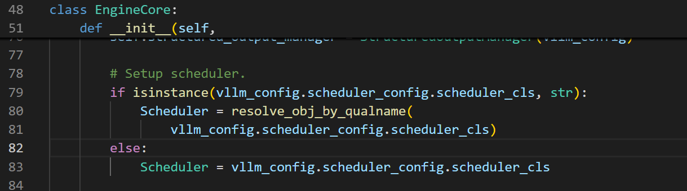
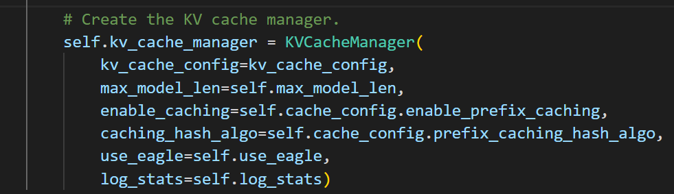
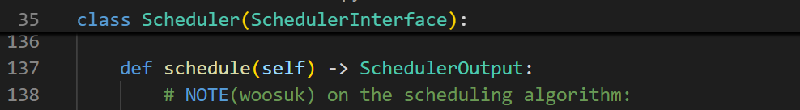

# vllm中engine梳理

**Author:** running

**Date:** 2025-06-09

**Link:** https://zhuanlan.zhihu.com/p/1911806179841128443

参考：[BoLi2001：vLLM V1 源码阅读](https://zhuanlan.zhihu.com/p/32045324831)



上图比较清晰的反映了vllm中在实例化引擎时需要进行处理的类，由于嵌套比较多，有个还是选择性的，所以很容易混乱，[BoLi2001：vLLM V1 源码阅读](https://zhuanlan.zhihu.com/p/32045324831)中得图罗列的比较清晰，很清楚，方便理解engine建立时需要用到的主要的类以及他们的嵌套关系。

在V1中，scheduler实例化的地方在engine实例化时实现，入口：vllm\\v1\\engine\\[core.py](https://link.zhihu.com/?target=http%3A//core.py/)文件中的EngineCore类



注意此处使用的是v1的scheduler不是v0的scheduler （vllm\\v1\\core\\sched\\scheduler.py）

逻辑关系，EngineCore中维护了scheduler调度工具，scheduler中定义了kv\_cache管理工具。



V1调度器相比之前的调度器有一个转变**：**

-   **没有传统的"prefill阶段"和"[decode阶段](https://zhida.zhihu.com/search?content_id=258412345&content_type=Article&match_order=1&q=decode%E9%98%B6%E6%AE%B5&zhida_source=entity)"概念**
-   每个请求维护两个关键指标：

-   [num\_computed\_tokens](file:///d%3A/project/vllm/vllm/v1/core/kv_cache_manager.py#161%2C9): 已计算的token数量
-   [num\_tokens\_with\_spec](file:///d%3A/project/vllm/vllm/v1/request.py#110%2C9): 总token数量（包括prompt、output、speculative tokens）
-   调度器在每一步都尝试让[num\_computed\_tokens](file:///d%3A/project/vllm/vllm/v1/core/kv_cache_manager.py#161%2C9)追赶[num\_tokens\_with\_spec](file:///d%3A/project/vllm/vllm/v1/request.py#110%2C9)

主要的数据结构

```python
class Scheduler(SchedulerInterface):
    def __init__(self, ...):
        # 核心数据结构
        self.requests: dict[str, Request] = {}  # 所有请求的映射
        self.waiting: deque[Request] = deque()  # 等待队列
        self.running: list[Request] = []        # 运行队列
        
        # 调度约束
        self.max_num_running_reqs = ...         # 最大并发请求数
        self.max_num_scheduled_tokens = ...     # 最大调度token数
        
        # 缓存管理器
        self.kv_cache_manager = KVCacheManager(...)
        self.encoder_cache_manager = EncoderCacheManager(...)
        
        # 优化：缓存CachedRequestData对象
        self._cached_reqs_data: dict[str, deque[CachedRequestData]] = ...
```

调度的主体：



schedule（）方法设定了调度的主体。  

```python
def schedule(self) -> SchedulerOutput:
    # 1. 初始化调度状态
    scheduled_new_reqs = []
    scheduled_resumed_reqs = []
    scheduled_running_reqs = []
    preempted_reqs = []
    
    token_budget = self.max_num_scheduled_tokens
    encoder_budget = self.max_num_encoder_input_tokens
    
    # 2. 优先调度RUNNING请求
    while req_index < len(self.running) and token_budget > 0:
        request = self.running[req_index]
        
        # 计算需要调度的新token数量
        num_new_tokens = request.num_tokens_with_spec - request.num_computed_tokens
        
        # 应用长prefill截断
        if 0 < long_prefill_threshold < num_new_tokens:
            num_new_tokens = long_prefill_threshold
            
        # 分配KV cache slots
        new_blocks = self.kv_cache_manager.allocate_slots(...)
        if new_blocks is None:
            # 抢占最低优先级请求
            preempted_req = self.running.pop()
            # ... 抢占逻辑
        
    # 3. 调度WAITING请求
    while self.waiting and token_budget > 0:
        request = self.waiting[0]
        
        # 检查prefix caching
        computed_blocks, num_computed_tokens = 
            self.kv_cache_manager.get_computed_blocks(request)
            
        # 分配新的slots
        new_blocks = self.kv_cache_manager.allocate_slots(...)
```

V1引擎中prefill/decoder在逻辑概念上的变化：

```python
# 在v1调度器中，每个请求都有两个关键指标：
request.num_computed_tokens    # 已计算的token数
request.num_tokens_with_spec  # 总token数（包括prompt、output、spec tokens）

# 调度决策基于这个简单原则：
num_new_tokens = request.num_tokens_with_spec - request.num_computed_tokens
```

KV cache块的分配策略，在vllm\\v1\\core\\kv\_cache\_manager.py文件中

```python
def allocate_slots(self, request, num_tokens, computed_blocks=None, num_lookahead_tokens=0):
    """
    Block布局结构：
    -----------------------------------------------------------------------
    | < computed > | < new computed > |    < new >    | < pre-allocated > |
    -----------------------------------------------------------------------
    |                  < required >                   |
    --------------------------------------------------
    """
    
    # 1. 计算需要的总块数
    num_computed_tokens = request.num_computed_tokens + len(new_computed_blocks) * block_size
    num_required_blocks = cdiv(num_computed_tokens + num_tokens + num_lookahead_tokens, block_size)
    
    # 2. 计算需要新分配的块数
    num_new_blocks = num_required_blocks - len(req_blocks) - len(new_computed_blocks)
    
    # 3. 检查是否有足够的自由块
    if num_new_blocks > self.block_pool.get_num_free_blocks():
        return None  # 分配失败，需要抢占
        
    # 4. 分配新块
    new_blocks = self.block_pool.get_new_blocks(num_new_blocks)
    req_blocks.extend(new_blocks)
```

前缀缓存（[Prefix Caching](https://zhida.zhihu.com/search?content_id=258412345&content_type=Article&match_order=1&q=Prefix+Caching&zhida_source=entity)）集成

```python
def get_computed_blocks(self, request) -> tuple[list[KVCacheBlock], int]:
    """获取已缓存的blocks，这是chunked prefill的基础"""
    
    # 1. 计算请求的block哈希
    block_hashes = hash_request_tokens(self.caching_hash_fn, self.block_size, request)
    
    # 2. 查找最长缓存命中
    computed_blocks = self.specialized_manager.find_longest_cache_hit(block_hashes)
    
    # 3. 特殊情况处理
    if len(block_hashes) * self.block_size == request.num_tokens:
        # 当prompt长度正好是block_size的倍数且全部缓存时，需要重新计算最后一个token
        last_block_hash = block_hashes.pop()
        computed_blocks = self.specialized_manager.find_longest_cache_hit(block_hashes)
        block_hashes.append(last_block_hash)  # 恢复
    
    # 4. Eagle speculative decoding特殊处理
    if self.use_eagle and len(computed_blocks) > 0:
        computed_blocks.pop()  # 移除最后一个匹配块用于重新计算hidden states
    
    num_computed_tokens = len(computed_blocks) * self.block_size
    return computed_blocks, num_computed_tokens
```

Chunked Prefill的完整流程

```python
def chunked_prefill_example():
    """
    假设：
    - 请求有2048个prompt tokens
    - block_size = 16
    - long_prefill_token_threshold = 512
    - 前512个tokens已缓存
    """
    
    # 第一步调度：
    request.num_tokens = 2048
    request.num_computed_tokens = 0
    
    # 检查前缀缓存
    computed_blocks, num_computed_tokens = kv_cache_manager.get_computed_blocks(request)
    # 假设返回：computed_blocks = 32个blocks, num_computed_tokens = 512
    
    # 计算本次调度的tokens
    num_new_tokens = min(
        request.num_tokens - num_computed_tokens,  # 2048 - 512 = 1536
        long_prefill_token_threshold              # 512
    )
    # 结果：num_new_tokens = 512
    
    # 分配KV cache slots
    new_blocks = kv_cache_manager.allocate_slots(
        request, 
        num_new_tokens + num_external_tokens,  # 512 + 0
        computed_blocks,                       # 32个已缓存的blocks
    )
    
    # 更新状态
    request.num_computed_tokens = num_computed_tokens  # 512
    request.status = RequestStatus.RUNNING
    
    # 调度完成后更新
    request.num_computed_tokens += num_new_tokens  # 512 + 512 = 1024
    
    # 第二步调度（下一个iteration）：
    # request.num_computed_tokens = 1024
    # num_new_tokens = min(2048 - 1024, 512) = 512
    # 继续处理下一个chunk...
```