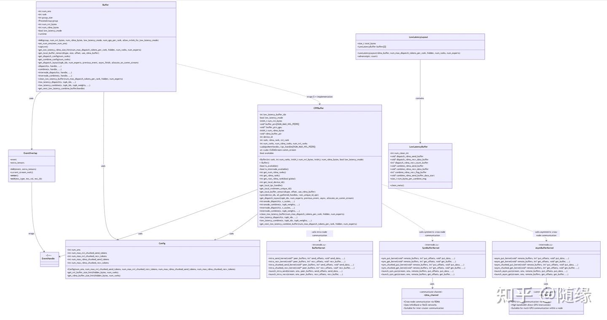

# 【DeepEP】使用Cursor+Mermaid阅读代码（一）类图总览

**Author:** shifang

**Date:** 2025-06-10

**Link:** https://zhuanlan.zhihu.com/p/1915175143908574406

​

目录

收起

项目概述

主要组件和类

Buffer 类（Python 接口）:

EventOverlap 类:

C++ Buffer 类（C++ 实现）:

Config 类:

LowLatencyBuffer 和 LowLatencyLayout 类:

Buffer 模板类 (kernel 级别):

AsymBuffer 模板类 (kernel 级别):

SymBuffer 模板类 (kernel 级别):

核心功能

Dispatch 操作:

Combine 操作:

通信管理:

事件管理和同步:

关键特性

高性能通信:

内存管理优化:

灵活配置:

Python 和 C++ 混合实现:

UML 类图

参考资料

[deepseek-ai/DeepEP: DeepEP: an efficient expert-parallel communication library](https://link.zhihu.com/?target=https%3A//github.com/deepseek-ai/DeepEP/tree/main)



  

使用cursor辅助代码阅读的具体步骤：

（1）使用cursor生成项目概述

（2）使用cursor生成UML类图

（3）把UML类图转换成svg文件

没有找到在知乎文章中上传svg格式内容的方法，屏幕截图上传的话分辨率太低。

所以把svg文件上传到了百度网盘 [DeepEP\_project.svg](https://link.zhihu.com/?target=https%3A//pan.baidu.com/s/17lhFzauehvimYUZkJlUDRsJzNBdO9lawZx0G%3D%3D%3Flinksource%3Dzhihu%26_at_%3D1749436452493)。可以下载到本地之后用浏览器打开查看。

## 项目概述

DeepEP（Deep Expert Parallel）是一个专为混合专家模型（[Mixture of Experts](https://zhida.zhihu.com/search?content_id=258731079&content_type=Article&match_order=1&q=Mixture+of+Experts&zhida_source=entity)，MoE）设计的高性能通信库。它提供了高效的专家并行通信缓冲区实现，支持多种通信模式，包括:

1.  高吞吐量节点内通信（使用 [NVLink](https://zhida.zhihu.com/search?content_id=258731079&content_type=Article&match_order=1&q=NVLink&zhida_source=entity)）
2.  高吞吐量节点间通信（使用 [RDMA](https://zhida.zhihu.com/search?content_id=258731079&content_type=Article&match_order=1&q=RDMA&zhida_source=entity) 和 NVLink）
3.  低延迟的全对全通信（使用 RDMA）

## 主要组件和类

### **Buffer** 类（[Python 接口](https://zhida.zhihu.com/search?content_id=258731079&content_type=Article&match_order=1&q=Python+%E6%8E%A5%E5%8F%A3&zhida_source=entity)）:

-   核心通信缓冲区管理类
-   负责管理 GPU 间的数据传输和同步
-   提供 dispatch 和 combine 操作，这是 MoE 模型中的关键操作
-   支持多种通信模式（节点内、节点间、低延迟）

### **EventOverlap** 类:

-   [CUDA 事件管理](https://zhida.zhihu.com/search?content_id=258731079&content_type=Article&match_order=1&q=CUDA+%E4%BA%8B%E4%BB%B6%E7%AE%A1%E7%90%86&zhida_source=entity)工具类
-   用于实现操作间的重叠，提高性能
-   支持 Python 的 `with` 语法，方便用户使用  
    

### **C++ Buffer** 类（C++ 实现）:  

-   Buffer 类的底层实现
-   管理实际的内存缓冲区和通信机制
-   处理 RDMA 和 NVLink 通信  
    

### **Config** 类:  

-   配置管理类，用于控制通信参数
-   管理 SM（Streaming Multiprocessor）数量和缓冲区大小
-   提供缓冲区大小计算的辅助函数  
    

### **LowLatencyBuffer** 和 **LowLatencyLayout** 类:  

-   专门为低延迟通信模式设计
-   管理内存布局和缓冲区分配  
    

### **Buffer 模板类** (kernel 级别):  

-   用于 intranode.cu 中的内存管理
-   提供简单的缓冲区访问接口
-   支持指针偏移和索引操作  
    

### **AsymBuffer 模板类** (kernel 级别):  

-   用于 internode.cu 中的非对称内存管理
-   处理多个 rank 之间的通信
-   支持不同的前进策略  
    

### **SymBuffer 模板类** (kernel 级别):  

-   用于 internode.cu 中的对称内存管理
-   提供发送和接收缓冲区
-   支持耦合和解耦模式

## 核心功能

### **Dispatch 操作**:

1.  将输入数据分发到不同的专家（GPU）上
2.  支持节点内、节点间和低延迟模式
3.  处理路由决策，确定每个 token 应该发送到哪个专家  
    

### **Combine 操作**:  

1.  收集来自不同专家的输出并组合
2.  支持权重组合，用于 MoE 模型中的加权输出  
    

### **通信管理**:  

1.  使用 NVSHMEM 进行 GPU 间通信
2.  支持 IPC 和 RDMA 通信方式
3.  优化缓冲区布局，减少通信开销  
    

### **事件管理和同步**:  

1.  通过 EventOverlap 管理 CUDA 事件
2.  支持异步操作，提高并行度

## 关键特性

### **高性能通信**:

1.  利用 NVLink 和 RDMA 实现高带宽通信
2.  RoCE2"> 支持低延迟模式，减少通信延迟  
    

### **内存管理优化**:  

1.  优化的缓冲区布局和管理
2.  支持不同数据类型和大小  
    

### **灵活配置**:  

1.  可根据不同规模的集群调整参数
2.  提供预设配置和自定义选项  
    

### **Python 和 C++ 混合实现**:  

1.  Python 接口易于使用
2.  C++ 核心实现提供高性能

## UML 类图

以下是 DeepEP 项目的主要类及其关系：

```text
classDiagram
    class Buffer {
        +int num_sms
        +int rank
        +int group_size
        +ProcessGroup group
        +int num_nvl_bytes
        +int num_rdma_bytes
        +bool low_latency_mode
        +runtime
        +__init__(group, num_nvl_bytes, num_rdma_bytes, low_latency_mode, num_qps_per_rank, allow_nvlink_for_low_latency_mode)
        +set_num_sms(new_num_sms)
        +capture()
        +get_low_latency_rdma_size_hint(num_max_dispatch_tokens_per_rank, hidden, num_ranks, num_experts)
        +get_local_buffer_tensor(dtype, size, offset, use_rdma_buffer)
        +get_dispatch_config(num_ranks)
        +get_combine_config(num_ranks)
        +get_dispatch_layout(topk_idx, num_experts, previous_event, async_finish, allocate_on_comm_stream)
        +dispatch(x, handle, ...)
        +combine(x, handle, ...)
        +internode_dispatch(x, handle, ...)
        +internode_combine(x, handle, ...)
        +clean_low_latency_buffer(num_max_dispatch_tokens_per_rank, hidden, num_experts)
        +low_latency_dispatch(x, topk_idx, ...)
        +low_latency_combine(x, topk_idx, topk_weights, ...)
        +get_next_low_latency_combine_buffer(handle)
    }

    class EventOverlap {
        +event
        +extra_tensors
        +__init__(event, extra_tensors)
        +current_stream_wait()
        +__enter__()
        +__exit__(exc_type, exc_val, exc_tb)
    }

    class CPPBuffer {
        -int low_latency_buffer_idx
        -bool low_latency_mode
        -int64_t num_nvl_bytes
        -void* buffer_ptrs[NUM_MAX_NVL_PEERS]
        -void** buffer_ptrs_gpu
        -int64_t num_rdma_bytes
        -void* rdma_buffer_ptr
        -int device_id
        -int rank, rdma_rank, nvl_rank
        -int num_ranks, num_rdma_ranks, num_nvl_ranks
        -cudaIpcMemHandle_t ipc_handles[NUM_MAX_NVL_PEERS]
        -at::cuda::CUDAStream comm_stream
        -bool available
        +Buffer(int rank, int num_ranks, int64_t num_nvl_bytes, int64_t num_rdma_bytes, bool low_latency_mode)
        +~Buffer()
        +bool is_available()
        +bool is_internode_available()
        +int get_num_rdma_ranks()
        +int get_rdma_rank()
        +int get_root_rdma_rank(bool global)
        +int get_local_device_id()
        +get_local_ipc_handle()
        +get_local_nvshmem_unique_id()
        +get_local_buffer_tensor(dtype, offset, use_rdma_buffer)
        +sync(device_ids, all_gathered_handles, root_unique_id_opt)
        +get_dispatch_layout(topk_idx, num_experts, previous_event, async, allocate_on_comm_stream)
        +intranode_dispatch(x, x_scales, ...)
        +intranode_combine(x, topk_weights, ...)
        +internode_dispatch(x, x_scales, ...)
        +internode_combine(x, topk_weights, ...)
        +clean_low_latency_buffer(num_max_dispatch_tokens_per_rank, hidden, num_experts)
        +low_latency_dispatch(x, topk_idx, ...)
        +low_latency_combine(x, topk_idx, topk_weights, ...)
        +get_next_low_latency_combine_buffer(num_max_dispatch_tokens_per_rank, hidden, num_experts)
    }

    class Config {
        +int num_sms
        +int num_max_nvl_chunked_send_tokens
        +int num_max_nvl_chunked_recv_tokens
        +int num_max_rdma_chunked_send_tokens
        +int num_max_rdma_chunked_recv_tokens
        +Config(num_sms, num_max_nvl_chunked_send_tokens, num_max_nvl_chunked_recv_tokens, num_max_rdma_chunked_send_tokens, num_max_rdma_chunked_recv_tokens)
        +get_nvl_buffer_size_hint(hidden_bytes, num_ranks)
        +get_rdma_buffer_size_hint(hidden_bytes, num_ranks)
    }

    class LowLatencyBuffer {
        +int num_clean_int
        +void* dispatch_rdma_send_buffer
        +void* dispatch_rdma_recv_data_buffer
        +int* dispatch_rdma_recv_count_buffer
        +void* combine_rdma_send_buffer
        +void* combine_rdma_recv_data_buffer
        +int* combine_rdma_recv_flag_buffer
        +void* combine_rdma_send_buffer_data_start
        +size_t num_bytes_per_combine_msg
        +clean_meta()
    }

    class LowLatencyLayout {
        +size_t total_bytes
        +LowLatencyBuffer buffers[2]
        +LowLatencyLayout(rdma_buffer, num_max_dispatch_tokens_per_rank, hidden, num_ranks, num_experts)
        +advance(ptr, count)
    }

    class EventHandle {
        <<C++>>
    }


    class BufferKernel {
        <<intranode.cu>>
        +intra_send_kernel(void** peer_buffers, int* send_offsets, void* send_data, ...)
        +intra_recv_kernel(void** peer_buffers, int* recv_offsets, void* recv_buffer, ...)
        +intra_chunked_send_kernel(void** peer_buffers, int* send_offsets, void* send_data, ...)
        +intra_chunked_recv_kernel(void** peer_buffers, int* recv_offsets, void* recv_buffer, ...)
        +launch_intra_send(stream, sms, peer_buffers, send_offsets, send_data, ...)
        +launch_intra_recv(stream, sms, peer_buffers, recv_offsets, recv_buffer, ...)
    }

    class SymBufferKernel {
        <<internode.cu>>
        <<used by rdma_channel>>
        +sym_put_kernel(void* remote_buffers, int* put_offsets, void* put_data, ...)
        +sym_get_kernel(void* remote_buffers, int* get_offsets, void* get_buffer, ...)
        +sym_chunked_put_kernel(void* remote_buffers, int* put_offsets, void* put_data, ...)
        +sym_chunked_get_kernel(void* remote_buffers, int* get_offsets, void* get_buffer, ...)
        +launch_sym_put(stream, sms, remote_buffers, put_offsets, put_data, ...)
        +launch_sym_get(stream, sms, remote_buffers, get_offsets, get_buffer, ...)
    }

    class AsymBufferKernel {
        <<internode.cu>>
        <<used by nvl_channel>>
        +asym_put_kernel(void* remote_buffers, int* put_offsets, void* put_data, ...)
        +asym_get_kernel(void* remote_buffers, int* get_offsets, void* get_buffer, ...)
        +asym_chunked_put_kernel(void* remote_buffers, int* put_offsets, void* put_data, ...)
        +asym_chunked_get_kernel(void* remote_buffers, int* get_offsets, void* get_buffer, ...)
        +launch_asym_put(stream, sms, remote_buffers, put_offsets, put_data, ...)
        +launch_asym_get(stream, sms, remote_buffers, get_offsets, get_buffer, ...)
    }

    class rdma_channel {
        <<communicate channel>>
        +Cross-node communication via RDMA
        +Uses InfiniBand or RoCE networks
        +Suitable for inter-cluster communication
    }

    class nvl_channel {
        <<communicate channel>>
        +GPU-to-GPU communication via NVLink
        +High bandwidth direct GPU interconnect
        +Suitable for multi-GPU communication within a node
    }

    Buffer --> EventOverlap : uses
    Buffer --> Config : uses
    CPPBuffer --> EventHandle : uses
    CPPBuffer --> Config : uses
    LowLatencyLayout --> LowLatencyBuffer : contains
    EventOverlap --> EventHandle : wraps
    Buffer ..> CPPBuffer : wraps C++ implementation
    CPPBuffer ..> BufferKernel : calls intra-node communication
    CPPBuffer ..> SymBufferKernel : calls symmetric cross-node communication
    CPPBuffer ..> AsymBufferKernel : calls asymmetric cross-node communication
    SymBufferKernel --> rdma_channel : uses
    AsymBufferKernel --> nvl_channel : uses
```

DeepEP 库主要用于大规模混合专家模型训练，通过优化专家并行通信，显著提高训练效率和模型性能。它特别适合需要高效处理大规模分布式专家模型的应用场景。

  

## 参考资料

使用在线绘图工具 [Mermaid Chart](https://link.zhihu.com/?target=https%3A//www.mermaidchart.com/play) 或者 [Mermaid 在线编辑器](https://link.zhihu.com/?target=https%3A//mermaid-live.nodejs.cn/edit) 把UML描述转化成图

[在 Ubuntu 系统中把包含UML描述转换成svg图](https://zhuanlan.zhihu.com/p/1915349232421934454)

[关于 Mermaid | Mermaid 中文网](https://link.zhihu.com/?target=https%3A//mermaid.nodejs.cn/intro/)

[AI 与 Mermaid 使用教程之流程图](https://zhuanlan.zhihu.com/p/17050937824)