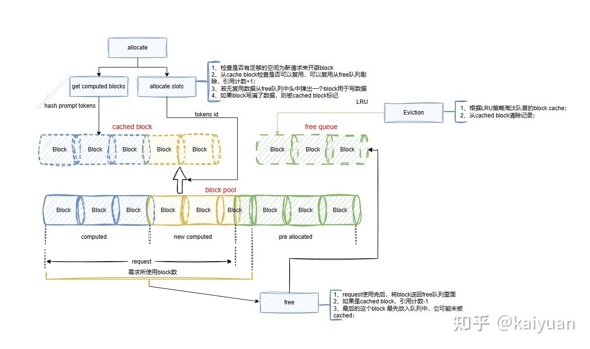

# vLLM显存管理详解

**Author:** kaiyuan

**Date:** 2025-06-13

**Link:** https://zhuanlan.zhihu.com/p/1916529253169734444


当前 GPU 硬件设备的物理显存大小远不能满足模型发展需求，如何使用好显存成为模型运算中的关键问题。在 vLLM 框架中同样涉及显存分配与使用问题，虽然框架本身关注重点是 [KV Cache](https://zhida.zhihu.com/search?content_id=258995512&content_type=Article&match_order=1&q=KV+Cache&zhida_source=entity) 分配管理，但整个显存是如何分配的、局部的显存该如何降低？也值得了解，本文主要就显存管理问题展开分析。

## 1 显存的分配

推理框架中显存使用分配与运行的实例的部署形态相关，GPU 设备与推理框架实例的映射关系可以是多对多的关系，推理实例运行时也可跨设备（如模型并行）、单个 GPU 支持运行多个推理实例，还有训练与推理共卡等场景。主要看下 vLLM 实例所占用显存包含哪些内容，如下是 GPU 全局显存的一种使用情况，包含多个 vLLM 实例，除了 vLLM 实例，显存的使用还有：系统后台、其他运行内容。


在 vLLM 实例上，显存分配可通过 torch 框架管理分为两大类：torch 类显存、非 torch 类显存。torch 类显存是由 torch 相关 API 触发的，其内容包括：

\- **权重（weights）**，与模型大小正相关，固定的 tensor 值；

\- **激活值（activation）**，运算过程中 tensor 值；

\- **KV Cache（KV cache）**，KV 的 blocks，由 torch 创建 tensor 组成；

\- **其他显存（Others）**，用 torch 模块或者 API 创建的显存，比如 Sampler() 属于 torch.nn 模块；

PyTorch 类的显存分配与管理底层依赖 allocator 模块。其中，权重或者常量一般分配后不需要释放，它们管理相对简单，而像激活值这种周期性分配或释放的 tensor 其相关的生命周期管理、碎片问题等依赖 PyTorch 本身的能力；KV blocks 则是 torch 分配 tensor 后（「预分配」）由 vLLM 管理。


PyTorch 的显存管理参见：[PyTorch 显存管理介绍与源码解析](https://zhuanlan.zhihu.com/p/680769942)

第二大部分是**非 torch 类显存**，包括：

\- **通信显存**：如 NCCL/[HCCL](https://zhida.zhihu.com/search?content_id=258995512&content_type=Article&match_order=1&q=HCCL&zhida_source=entity) 等通信过程中产生的部分缓存等；

\- **[Attention 模块](https://zhida.zhihu.com/search?content_id=258995512&content_type=Article&match_order=1&q=Attention+%E6%A8%A1%E5%9D%97&zhida_source=entity)**：vLLM 中的 Attention 模块比较关键，有些操作采用底层 API 实现，有单独分配/释放显存行为；

\- **客户定义操作**（custom ops）：操作可能有单独分配/释放显存行为。

## 2 显存占比分析

vLLM 框架的两类显存中，一般 torch 类显存占据主要部分。torch 类显存可以通过 torch 相关工具（如 profiling、snapshot）分析内容，非 torch 显存可通过加日志打印分析。通过运行一个推理示例来观测显存的占比情况：

-   模型：Qwen2.5-7B-Instruct
-   硬件：V100/910B
-   vLLM：0.8.5

在默认参数的情况下（V100 机器，\`dtype=『float16』\`），运行后日志：

```text
[model_runner.py:11401 Model loading took 14.25GiB and 103.115380 seconds
[worker.py:287] Memory profiling takes 6.33 seconds
[worker.py:287] the current vLLM instance can use total_gpu_memory (31.74GiB) x gpu_memory_utilization (0.90) = 28.57GiB
[worker.py:287] model weights take 14.25GiB; non_torch_memory takes 0.09GiB; PyTorch activation peak memory takes 4.35GiB; the rest of the memory reserved for KV Cache is 9.88GiB.
```

这里包含关键内容：模型权重、PyTorch 活跃峰值显存、KV 占用的显存，以及非 torch 的显存占用值。显存消耗大部分都通过 torch，所以可以用 snapshot 来观测这部分的时序情况。如下所示是被使用显存的时序图，主要包括四个部分：1、模型显存；2、dummy run 的激活值；3、KV Cache blocks；4、sampler 等后处理占用显存。


其中模型权重显存占用 14GB 左右，从 timeline 上可看到它创建好后会一直保持不会释放。vLLM 为了计算模型运行时激活值可能需要的显存，在正式运行前会用 dummy run 先预热，通过放大可看到这部分显存基本上由激活值组成，存在周期的释放动作。dummy run 过后 vLLM 通过 torch 创建 KV blocks，这个部分的大小可以通过 **gpu\_memory\_utilization** 参数控制。

  


模型运算时，logits/sampler 操作分配的显存会在 KV blocks 创建后，占比较小但会动态变化：


这个可视化观测可通过 torch 的可视化工具（如 torchviz）网页（参考：([PyTorch 显存可视化与 Snapshot 数据分析](https://zhuanlan.zhihu.com/p/677203832))），运行的相关代码如下供参考：

```python
from vllm import LLM, SamplingParams
import logging
import torch
logging.basicConfig(level=logging.INFO)

if __name__ == 「__main__」:
    torch.cuda.memory._record_memory_history(max_entries=100000)
    model_name = 「/home/kaiyuan/models/Qwen2.5-7B-Instruct」 
    llm = LLM(model=model_name, dtype=『float16』) # gpu_memory_utilization=0.9
    n = 16
    # 准备输入提示
    prompts = [
        「Hello, my name is」,
        「The capital of France is」,
        「The future of AI is」,
        「Please introduce vLLM framework」
    ]

    # 设置采样参数
    sampling_params = SamplingParams(
        temperature=0.8,  # 控制生成文本的随机性，值越高越随机
        top_p=0.95,  # 控制采样范围，值越高生成文本越多样化
        max_tokens=50,  # 生成的最大 token 数量
        n=n
    )
    outputs = llm.generate(prompts, sampling_params)
    torch.cuda.memory._dump_snapshot(「vllm_snapshot.pickle」)
    torch.cuda.memory._record_memory_history(enabled=None)
```

利用 snapshot 可以观测 gpu\_memory\_utilization 对 KV blocks 的影响。还是上述例子但换个显存更大设备：910B-64GB 运行，当 gpu\_memory\_utilization 由 0.9 变为 0.6 时，可观测到 blocks 占用的显存值降低：


注意 910B 是「昇腾」机器，其 snapshot 的采集命令要稍作修改：

```python
# 变化位置 1：
import torch_npu
from torch_npu.contrib import transfer_to_npu

# 变化位置 2：
    # torch.cuda.memory._record_memory_history(max_entries=100000)
    torch_npu.npu.memory._record_memory_history(max_entries=100000)
    
# 变化位置 3：
    # torch.cuda.memory._dump_snapshot(「vllm_snapshot.pickle」)
    # torch.cuda.memory._record_memory_history(enabled=None)
    torch_npu.npu.memory._dump_snapshot(「vllm_snapshot.pickle」)
    torch_npu.npu.memory._record_memory_history(enabled=None)
```

## 3 KV Cache 的管理逻辑

通过 torch 申请 tensor 作为 KV Cache blocks 后，由 vLLM 进行二次分配和管理（申请、使用、释放），注意其中的 blocks 释放操作只是 vLLM 本身一个逻辑释放，实际的 tensor 值依然保留。

**Blocks 可用数量计算**。在创建 KV Cache 前，先需要知道有多少可用显存。通过前面的 torch 显存可视化（timeline）可以知道，KV blocks 是在 dummy run 之后创建的，但可用值 vLLM 计算逻辑是怎样的？这个在 vLLM worker 的源码中能找到答案，简单来说：

KV blocks = 总显存 × gpu\_memory\_utilization −（模型显存 + 激活峰值 + 非 torch 显存）

其中有些值是静态的，可以调用 torch.cuda（或者 torch.npu）的接口获得，但是激活/通信等需要实际运行才能较为准确得到，所以 vLLM 的worker 里面在计算可用 kv\_cache 前会试跑一下模型（dummy run），通过 torch.cuda 的显存接口获取显存峰值。

-   相关的函数（vllm/vllm/worker/worker.py，vLLM 版本 0.8.x）：determine\_num\_available\_blocks
-   显存的计算函数（vllm/vllm/utils.py）：memory\_profiling
-   显存值的捕获函数（vllm/vllm/utils.py）：MemorySnapshot

snapshot 的关键计算调用的 API：

```python
       self.torch_peak = torch.cuda.memory_stats().get(
            「allocated_bytes.all.peak」, 0)

        self.cuda_memory = torch.cuda.mem_get_info(
        )[1] - torch.cuda.mem_get_info()[0]

        # torch.cuda.memory_reserved() is how many bytes
        # PyTorch gets from cuda (by calling cudaMalloc, etc.)
        # this is used to measure the non-torch memory usage
        self.torch_memory = torch.cuda.memory_reserved()

        self.non_torch_memory = self.cuda_memory - self.torch_memory
```

KV Cache 在初始化完成后，可以认为是一个以 blocks 为单位的 tensor 区域，其使用与分配由 KV manager 负责，管理的基本原理是「paged-attention」。


在 V1 引擎中开启了 prefix cache 后KV blocks 管理还会有一个淘汰机制，KV manager 运行如下（引用自：[vLLM 的prefix cache 为何零开销](https://zhuanlan.zhihu.com/p/1896927732027335111)）：

**内存使用步骤**：

1.  检查是否有足够的空间为新请求来开辟 block；
2.  从 cache block 检查是否可以复用，可以复用从 free 队列剔除，引用计数+1；
3.  若无复用数据从 free 队列中头中弹出一个 block 用于写数据
4.  如果 block 写满了数据，则被 cached block 标记

**内存释放**：request 使用完后，将 block 送回 free 队列里面，如果是 cached block，引用计数-1，最后的这个 block 最先放入队列中，它可能未被 cache；

**淘汰策略**：根据 LRU 策略淘汰队首的 block cache，并从 cached blocks 字典中去除记录。

这里分析一下 block 的状态，如下图所示，所有的 block 存放在 block pool 里面，block 在free block 和cached block 里面可能有记录（标记）



-   cached block 里面记录历史 request 请求的 block id，这些块中所有的 tokens 位置都完成了计算。部分计算 block 不会记录到 cached block 里面。
-   free queue 里面标记未被请求占用的 block；
-   block 还有一种状态就是被 request 在使用但内容未完全占满，那么它既不在 free queue 中、也未被 cached block 记录。

KV manager 完成的只是逻辑 blocks 分配。**一个请求使用 KV blocks 的基本流程**：scheduler 调用 KV manager 给请求分配逻辑 block id，然后请求在执行的时候通过 block table 完成逻辑 id 到物理 id 的映射计算，最后请求在 worker 运算时拿相应的 tensor blocks 进行 attention 计算。


## 4 显存优化/降低方式

通过前面分析可以知道显存组成和占比。接下来简单讨论一个常见的问题：如何优化显存，或者说如何降低显存使用量保证不 OOM

| 类型 | 方式 |
| --- | --- |
| 模型显存 | 模型并行（TP/PP/EP） |
| 激活值 | 算子计算融合（减小临时变量）、拆分输入（降低size）注：可能会降低性能 |
| KV caches | 调整 gpu_memory_utilization、max_model_len、max_num_seqs 等参数优化。 |
| 其它通用操作 | 量化、offload |

需要考虑问题：

**是否影响计算精度？**一些降显存操作影响输出精度，比如量化操作，会丢失一部分信息。

**是否影响计算性能？**显存空间转移操作使得显存数据不在本地计算时再传输回本地，这可能会影响性能；

**OOM 可能出现的位置**：

-   vLLM 框架侧的主动检测；
-   PyTorch allocator 的检测；
-   自定义算子调用 CUDA/CANN API 的报错；

vLLM 框架检测显存是否充足的位置，如：

-   **kv cache manager** 存在判断逻辑判断是否能够开辟 kv（vllm/vllm/v1/core/kv\_cache\_utils.py）:check\_enough\_kv\_cache\_memory
-   **worker** 的cache size 检查（vllm/vllm/worker/worker.py）: raise\_if\_cache\_size\_invalid
-   **sampler** 里面\_dummy\_sampler\_run 的try 逻辑（vllm/vllm/v1/worker/gpu\_model\_runner.py）：L1837

一般这些位置都会有对应的日志打印提示，如：

```python
def check_enough_kv_cache_memory(vllm_config: VllmConfig,
                                 kv_cache_spec: dict[str, KVCacheSpec],
                                 available_memory: int):
    if available_memory <= 0:
        raise ValueError(「No available memory for the cache blocks. 」
                         「Try increasing `gpu_memory_utilization` when 」
                         「initializing the engine.」)
```

某些情况下，OOM 出现的时机不是必现而是偶现，或者是跑了几轮后才出现显存 OOM，需考虑：

1.  **输入变化引起**：激活值、自定义操作、batch 的变化；
2.  **临时变量未及时释放**：在 PyTorch 里面的可以通过 torch 捕捉，如果是自定义算子通过日志打印观测（捕捉难度大）；
3.  **通信**：进行多卡之间通信时，传输数据量增加可能会导致通信缓存上涨，如增加并行规模。

可以观测和比较每一轮显存占比的变化，判断故障位置，尤其要捕获 OOM 时刻段的 snapshot。

* * *

参考：

[HTTPS://zhuanlan.zhihu.com/p/1896927732027335111](https://zhuanlan.zhihu.com/p/1896927732027335111)

[HTTPS://zhuanlan.zhihu.com/p/677203832](https://zhuanlan.zhihu.com/p/677203832)

[PyTorch 显存管理介绍与源码解析](https://zhuanlan.zhihu.com/p/680769942)

[https://github.com/vllm-project/vllm/tree/releases/v0.9.0](https://link.zhihu.com/?target=https%3A//github.com/vllm-project/vllm/tree/releases/v0.9.0)

**欢迎点赞、关注、讨论、不足之处请指正**