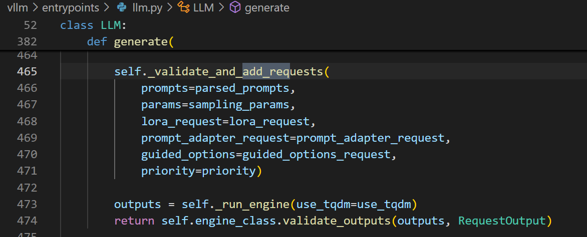

# request调度

**Author:** running

**Date:** 2025-06-18

**Link:** https://zhuanlan.zhihu.com/p/1915783753063728517

### 请求处理

request请求首先会进入entrypoints/llm.py文件中的[LLM](https://zhida.zhihu.com/search?content_id=258861280&content_type=Article&match_order=1&q=LLM&zhida_source=entity)类中的[generate](https://zhida.zhihu.com/search?content_id=258861280&content_type=Article&match_order=1&q=generate&zhida_source=entity)方法中，执行add\_request。



之后，遍历每一条prompt，挨个调用\_add\_request方法，在执行此方法时就会来到engine层。在engine中，会通过input\_process进行处理，获取prompts的token\_id。


\_add\_request方法


\_add\_request由llm\_engine中的add\_request实现


这样，一个prompt就被处理成了一个request，用于后续的scheduler和[executor](https://zhida.zhihu.com/search?content_id=258861280&content_type=Article&match_order=1&q=executor&zhida_source=entity)的调度。

### 调度机制

v1的调度器不区分prefill和decode阶段，调度决策以一个简单的字典形式表示（vllm\\v1\\core\\sched\\scheduler.py），例如{请求ID: token数量}。每个请求只记录已处理的token数量和需要处理的token数量，调度器的目的是让已处理token数量追上需要处理的token数量。V1的scheduler中有running和waitting两个请求队列，分别记录正在运行的请求和等待调度的请求。新来的请求会加入到加入到waiting队列中等待调度。

此外，scheduler中存在一个资源池，[block\_pool](https://zhida.zhihu.com/search?content_id=258861280&content_type=Article&match_order=1&q=block_pool&zhida_source=entity)（）（vllm\\v1\\core\\block\_pool.py），它会记录资源的使用情况，每个request使用的block和每个block的hash值（用于prefix catch）.

**每次调度时，先调度running队列中的请求，如无抢占行为再调度waiting队列中的请求**。

-   对running队列中的每个请求尝试在`kv_cache_manager`中分配token需要的slots，如果不足失败则开启抢占模式，释放低优先级请求占用的空间。
-   对waiting队列中的每个请求首先尝试在`kv_cache_manager`中分配token需要的slots，如果不足则继续在waiting队列等待。

主要的调度方法在：


大概 总体的调度循环类似：

```python
# 调度器的主循环逻辑
def schedule() -> SchedulerOutput:
    # 1. 处理运行中的请求 (主要是 decode)
    for request in running_requests:
        tokens_needed = request.num_tokens_with_spec - request.num_computed_tokens
        if tokens_needed > 0:
            schedule_tokens(request, min(tokens_needed, 1))  # decode 通常为 1
    
    # 2. 处理等待中的请求 (prefill)
    for request in waiting_requests:
        remaining_prompt = request.num_prompt_tokens - request.num_computed_tokens
        if remaining_prompt > 0:
            # 可能分块处理大的 prompt
            chunk_size = min(remaining_prompt, available_budget, chunk_limit)
            schedule_tokens(request, chunk_size)
    
    # 3. 构建调度输出
    return SchedulerOutput(
        num_scheduled_tokens=num_scheduled_tokens,
        blocks_to_allocate=new_block_allocations,
        ...)
```

在进行空间分配时，留意了一下PD阶段的不同。

[Prefill阶段](https://zhida.zhihu.com/search?content_id=258861280&content_type=Article&match_order=1&q=Prefill%E9%98%B6%E6%AE%B5&zhida_source=entity)：新请求的调度，对waitting队列进行操作

```python
# 位置: vllm/v1/core/sched/scheduler.py:330-380
while self.waiting and token_budget > 0:
    request = self.waiting[0]
    
    # 获取已缓存的 tokens (前缀缓存)
    computed_blocks, num_computed_tokens = \
        self.kv_cache_manager.get_computed_blocks(request)
    
    # 计算需要调度的新 tokens
    num_new_tokens = request.num_tokens - num_computed_tokens
    
    # 应用长 prefill 限制
    if (0 < self.scheduler_config.long_prefill_token_threshold < num_new_tokens):
        num_new_tokens = self.scheduler_config.long_prefill_token_threshold
    
    # 受 token budget 限制
    num_new_tokens = min(num_new_tokens, token_budget)

###计算完需要处理的token之后，计算需要分配的block数量

# 位置: vllm/v1/core/kv_cache_manager.py:160-280
def allocate_slots(self, request, num_tokens, new_computed_blocks=None):
    # 计算所需的总 block 数
    num_computed_tokens = (request.num_computed_tokens + len(new_computed_blocks) * self.block_size)
    num_required_blocks = cdiv(num_computed_tokens + num_tokens + num_lookahead_tokens, self.block_size)
    
    # 计算需要新分配的 block 数
    num_new_blocks = (num_required_blocks - len(req_blocks) - len(new_computed_blocks))
```

[Decoder阶段](https://zhida.zhihu.com/search?content_id=258861280&content_type=Article&match_order=1&q=Decoder%E9%98%B6%E6%AE%B5&zhida_source=entity)：

```python
# 位置: vllm/v1/core/sched/scheduler.py:170-250
while req_index < len(self.running) and token_budget > 0:
    request = self.running[req_index]
    
    # 计算需要处理的新 tokens (通常为 1 个)
    num_new_tokens = (request.num_tokens_with_spec - 
                      request.num_computed_tokens)
    
    # 对于 decode，通常只处理 1 个 token
    num_new_tokens = min(num_new_tokens, token_budget)
    
    # 确保不超过模型最大长度
    num_new_tokens = min(
        num_new_tokens,
        self.max_model_len - request.num_computed_tokens)
```

在decoder阶段，自回归预测通常只会生成一个token，当前拥有的block没有占满的话不会分配新的。

```python
# 当前 block 还有空间时，直接使用
if current_block_remaining_slots > 0:
    # 继续使用当前 block
    pass
else:
    # 当前 block 已满，需要分配新 block
    new_block = allocate_new_block()
    request_blocks.append(new_block)
```

在scheduler调度过程中，request的状态会更新，用来计算调度中需要的中间变量

```python
# 位置: vllm/v1/request.py:105-115
@property
def num_tokens(self) -> int:
    # prompt + output tokens 总数
    return len(self._all_token_ids)

@property  
def num_tokens_with_spec(self) -> int:
    # 包括推测 tokens 的总数
    return len(self._all_token_ids) + len(self.spec_token_ids)

def append_output_token_ids(self, token_ids):
    # 更新输出 tokens 和总 tokens
    self._output_token_ids.append(token_ids)
    self._all_token_ids.append(token_ids)
```