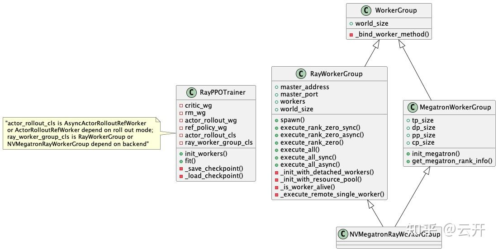

# verl 代码阅读笔记

**Author:** 云开

**Date:** 2025-06-19

**Link:** https://zhuanlan.zhihu.com/p/1918711781469165482

### 宏观理解

[verl](https://zhida.zhihu.com/search?content_id=259246042&content_type=Article&match_order=1&q=verl&zhida_source=entity) 的 single controller 设计在我看来是和 [spark](https://zhida.zhihu.com/search?content_id=259246042&content_type=Article&match_order=1&q=spark&zhida_source=entity)很类似的： 单机视图，用户界面和底层计算引擎实现解耦；给用户提供了比较大的编程灵活性，而用户又不太需要感知分布式相关的实现。就 spark 而言， 框架提供了 map、reduce 等数据处理算子，用户的数据处理脚本调用这些算子；而对于 verl, 框架提供了 compute\_values、compute\_log\_prob、update\_critic、update\_policy 等强化学习“算子”， 不同RL算法无非是 reward、advantage、 loss 等一些处理细节不同，大体的流程还是类似的。

verl 与 spark 都可以看作是数据处理系统，但verl 与 spark 的任务有本质的不同。spark 这种 [map reduce](https://zhida.zhihu.com/search?content_id=259246042&content_type=Article&match_order=1&q=map+reduce&zhida_source=entity) 计算范式， 数据比较重， 计算相对无状态（scala 函数式编程）， 计算跟着数据走。verl 处理的任务， 计算是有状态的，且是和特定 gpu 绑定， 数据往计算走。

目前 verl 训练 stage 之间的数据中转是通过 trainer （类比 spark的 driver）的,输入数据比较大的时候， 比如在多模态情况下，这里可能成为一个瓶颈点。

### 代码结构

### 用户编程界面

-   trainer 和 worker group, worker group 管理一堆 [ray actor](https://zhida.zhihu.com/search?content_id=259246042&content_type=Article&match_order=1&q=ray+actor&zhida_source=entity) (worker), 封装了对 worker 的 remote 调用

### backend

-   [megatron](https://zhida.zhihu.com/search?content_id=259246042&content_type=Article&match_order=1&q=megatron&zhida_source=entity) 和 [fsdp](https://zhida.zhihu.com/search?content_id=259246042&content_type=Article&match_order=1&q=fsdp&zhida_source=entity) 各有一套 worker

### 数据链路（以[ppo](https://zhida.zhihu.com/search?content_id=259246042&content_type=Article&match_order=1&q=ppo&zhida_source=entity) 为例）

ppo 训练一轮，整个流程其实是个有向无环图。但实际上，verl 采用 hybrid engine 模式。generate, value, reward, ref logprob, logprob 计算, 以及 [actor model](https://zhida.zhihu.com/search?content_id=259246042&content_type=Article&match_order=1&q=actor+model&zhida_source=entity), [critic model](https://zhida.zhihu.com/search?content_id=259246042&content_type=Article&match_order=1&q=critic+model&zhida_source=entity) 训练依次进行。 各阶段复用 GPU, 某个阶段执行完后，状态（权重、opt）可以从显存卸载到 cpu。 本质是资源分时复用。

对于在 worker 端计算, 输入由 trainer 分发到 worker, 计算结果从远端收集到 trainer。 分发和收集逻辑， 通过一些预先定义好的 proto (DP\_COMPUTE\_PROTO、MEGATRON\_COMPUTE\_PROTO 等), 以 decorator 的方式加在方法上。

### dataloader

-   dataloader 位于 trainer
-   dataloader 出来的结果 left padding (left padding, right aligned)

### generate

-   generate 的 结果 right padding (right padding, left aligned)

### value, reward, ref logprob, logprob 计算

-   在 worker 端

### advantage 计算

-   在 trainer

### actor model, critic model 训练

-   在 worker 端

### 权重流转

### save and load

-   actor model 需要加载 ckpt, 需要 save ckpt
-   ref model 需要加载 ckpt
-   critic model 需要加载 ckpt, 需要save ckpt
-   reward model 需要加载 ckpt

### 参数同步

-   sharding manager 主导下的 actor -> rollout 权重同步
-   合并 tp, ep，etp 以及做一些 megatron -> hf 模型的 name mapping, 同步权重到 rollout