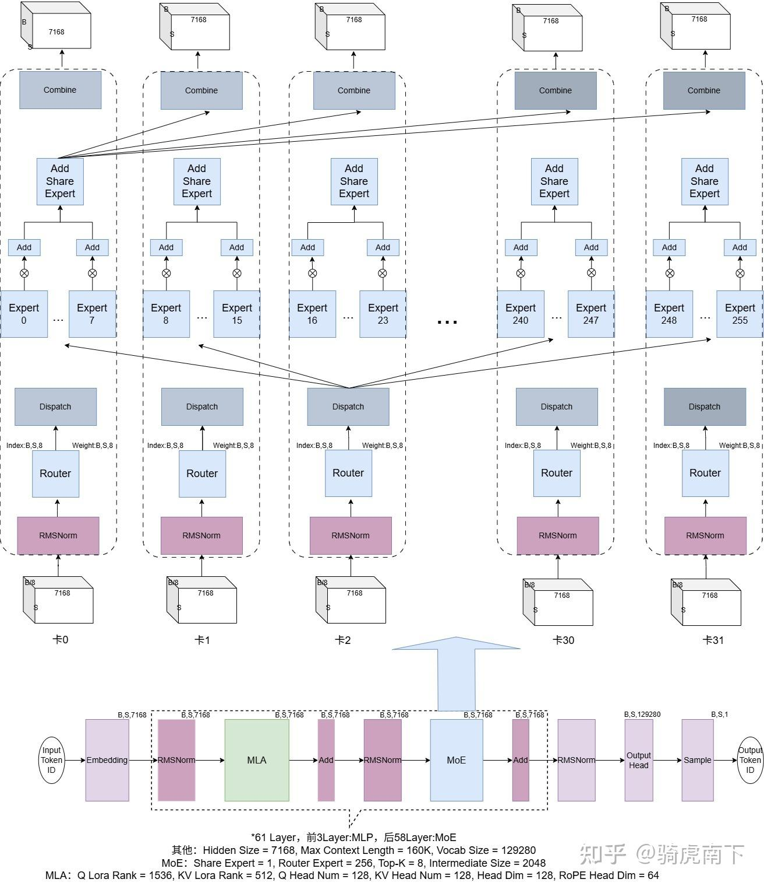
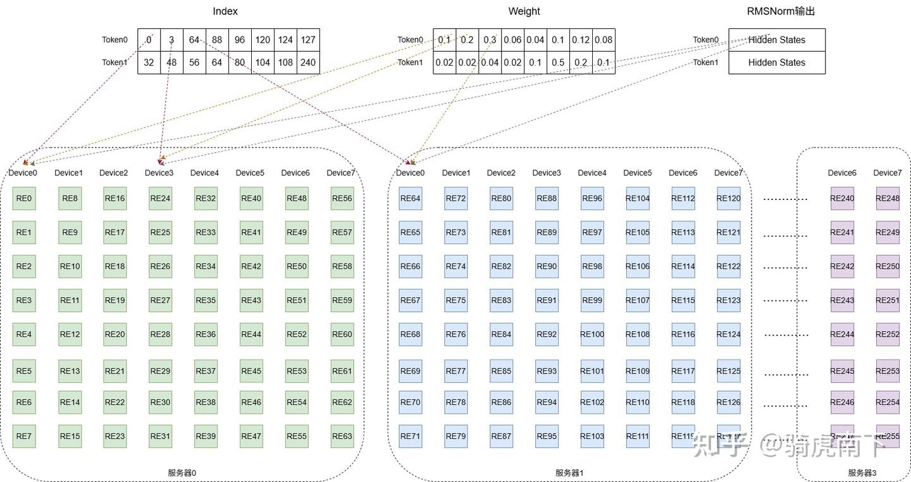
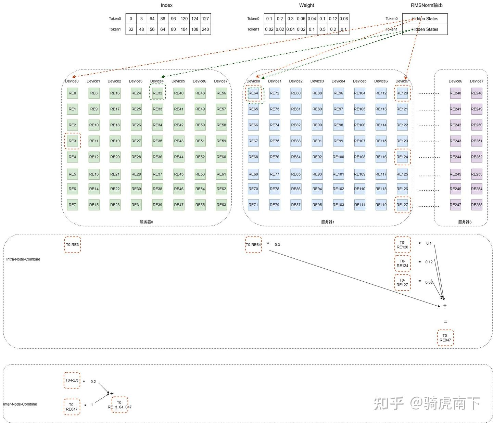

# Deepseek MoE的Deep-EP方案

**Author:** 骑虎南下

**Date:** 2025-06-22

**Link:** https://zhuanlan.zhihu.com/p/1913488667487494931?share_code=uYJ1I9NfSJ3x&utm_psn=1917866668660614961

此篇，将忽略[Deep-EP](https://zhida.zhihu.com/search?content_id=258552196&content_type=Article&match_order=1&q=Deep-EP&zhida_source=entity)中的与[Nvidia](https://zhida.zhihu.com/search?content_id=258552196&content_type=Article&match_order=1&q=Nvidia&zhida_source=entity)相关优化逻辑，从上层架构层面介绍[Deepseek MoE](https://zhida.zhihu.com/search?content_id=258552196&content_type=Article&match_order=1&q=Deepseek+MoE&zhida_source=entity)模块的Deep-EP方案

主要分以下几个模块介绍：EP方案的整体架构与计算流程，[Dispatch](https://zhida.zhihu.com/search?content_id=258552196&content_type=Article&match_order=1&q=Dispatch&zhida_source=entity)的具体逻辑，[Combine](https://zhida.zhihu.com/search?content_id=258552196&content_type=Article&match_order=1&q=Combine&zhida_source=entity)的具体逻辑。

关于Deepseek R1的模型结构及MoE模块的结构，请参考：[Deepseek R1/V3模型结构总览](https://zhuanlan.zhihu.com/p/1901297297331029667) 。

### MoE模块EP方案

如上图，我们假设将MoE的256个路由专家切分到32张卡上，做EP32并行，每卡上8个路由专家。

我们假设这样一个多服务器集群，有四台服务器，每台服务器中8个GPU卡，32卡均能通信传输数据。

因为每个Token都需要累加共享专家（[Share Expert](https://zhida.zhihu.com/search?content_id=258552196&content_type=Article&match_order=1&q=Share+Expert&zhida_source=entity)）的结果，这里将模型唯一共享专家复制到每张卡上。

**以下MoE模块的计算流程：**

1 . 经过[RMSNorm](https://zhida.zhihu.com/search?content_id=258552196&content_type=Article&match_order=1&q=RMSNorm&zhida_source=entity)的计算后，得到每个Token的RMSNorm的输出Hidden States，这里我们称为Hidden-States- A。

2 . 将Hidden-States- A输入Router计算得到每个Token用哪个8个路由专家计算，以及这8个专家的Weight。

3 . Dispatch模块中，将每个Token的Hidden-States- A分发到需要计算这个Token的8个路由专家所在的卡。

4 . 每张卡上路由专家计算对应Token的输入数据，所有卡并行计算，得到所有Token 8个专家计算结果，记为Hidden-States- B。

5 . Combine阶段，将不同服务器的不同卡的所有Token的Hidden-States- B，分发返回到每卡上，再将同一个Token的不同卡的8个路由专家的结果乘以Weight再累加起来，称为Hidden-States- C。

6 . 再每张卡将Hidden-States- A输入共享专家计算，与路由专家的结果Hidden-States- C累加起来，得到MoE的最终结果。

### Dispatch的计算流程

如上图，RE0表示第0号路由专家，前64个专家均分到服务器0的8个Device上，每卡8个专家。

我们假设有两个Token的输入，Index表格是每个Token选中的专家，Weight表格是每个Token专家的权重。

Dispatch所要做事情就是将Index，Weight，Hidden States发到对应的卡上，如图示。

### Combine的计算流程

如上图，以Token0中在部分Device上的计算为例，说明Combine的两个过程。

1 . Token0在服务器1的Device7上同时选中了3个专家，这三个专家计算完Token0的输入数据后，得到T0-RE120，T0-RE124，T0-RE127。

2 . Combine分为两个过程，同一个机内的Combine，如上Intra-Node-Combine所示。

3 . 跨机的Combine，如下Inter-Node-Combine所示，注意这里假设Token0在Dispatch之前在服务器0的Device0上。