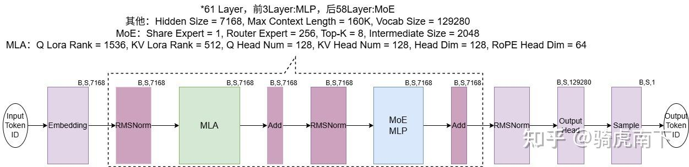
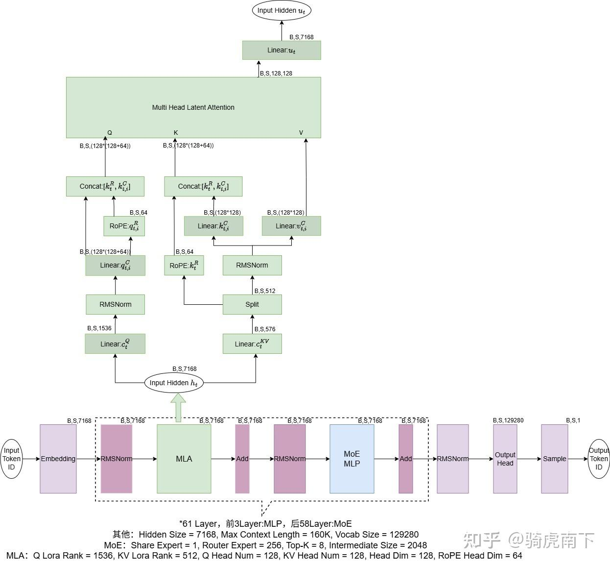
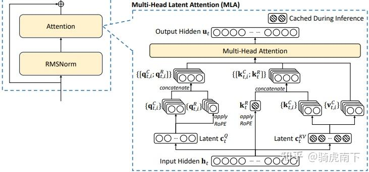
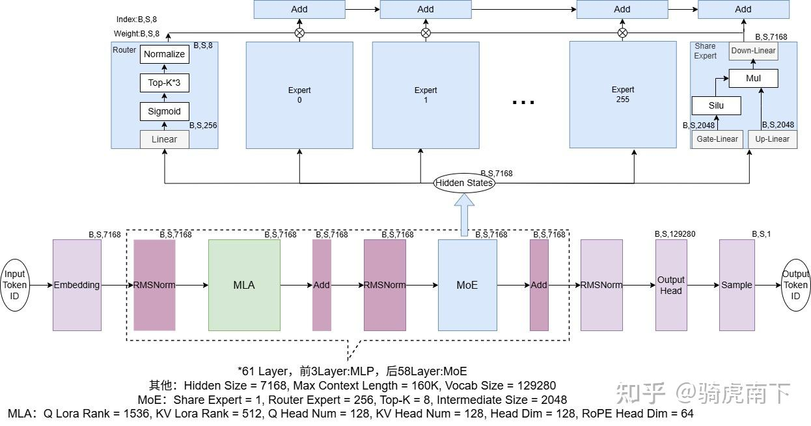
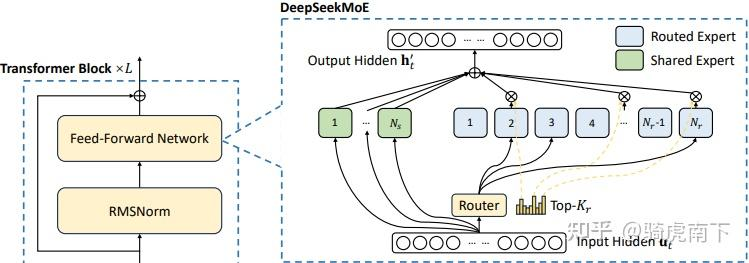
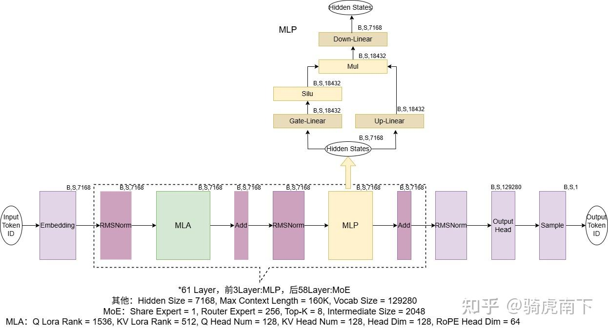

# Deepseek R1/V3模型结构总览

**Author:** 骑虎南下

**Date:** 2025-06-22

**Link:** https://zhuanlan.zhihu.com/p/1901297297331029667

此篇，会以四个章节，介绍整个[Deepseek R1](https://zhida.zhihu.com/search?content_id=257228737&content_type=Article&match_order=1&q=Deepseek+R1&zhida_source=entity)的模型结构，分为结构总览，MLA(Multi-Head Latent Attention)模块详细解析，MoE(Mixture of Experts)模块详细解析，[MLP模块](https://zhida.zhihu.com/search?content_id=257228737&content_type=Article&match_order=1&q=MLP%E6%A8%A1%E5%9D%97&zhida_source=entity)详细解析。

### Deepseek R1模型结构总览

如上图，

1 . 是整个Deepseek R1/V3模型结构的总览，从左到右是模型的算子流程，总体结构与目前业界主流的[Transformer Decode结构](https://zhida.zhihu.com/search?content_id=257228737&content_type=Article&match_order=1&q=Transformer+Decode%E7%BB%93%E6%9E%84&zhida_source=entity)一致。

2 . 整个模型共62个Layer，第62Layer是[MTP Module](https://zhida.zhihu.com/search?content_id=257228737&content_type=Article&match_order=1&q=MTP+Module&zhida_source=entity)，在另外一篇文章里有介绍：[Multi Token Prediction（MTP）技术](https://zhuanlan.zhihu.com/p/1901337553929508702)。

3 . 前61Layer中，前3层是带MLP模块的Dense结构，后58层是带[MoE模块](https://zhida.zhihu.com/search?content_id=257228737&content_type=Article&match_order=1&q=MoE%E6%A8%A1%E5%9D%97&zhida_source=entity)的稀疏结构，其他模块算子逻辑与[LLaMa/Qwen](https://zhida.zhihu.com/search?content_id=257228737&content_type=Article&match_order=1&q=LLaMa%2FQwen&zhida_source=entity)等主流模型一致。

4 . 整个模型共671B，其中MoE模块权重占比98%，剩下MLP与[MLA模块](https://zhida.zhihu.com/search?content_id=257228737&content_type=Article&match_order=1&q=MLA%E6%A8%A1%E5%9D%97&zhida_source=entity)占比2%，模型参数是由“E4M3”的FP8精度量化后保存。[Deepseek-V3/R1参数量分析](https://zhuanlan.zhihu.com/p/1917829085293416644)，这篇文章有详细分析整个模型参数占比。

5 . Hidden Size 7168，支持的词表长度为129280，支持最大文本长度为163840。

### MLA模块详解

如上图，绿色MLA模块从下往上看，参考Deepseek V3论文及源码画出来的MLA模块结构图，论文中原图如下：

比如与Linear: $c_t^Q $ 表示输出数据为原图中Latent $c_t^Q$ 的对应算子，\[B,S,576\]表示其Shape大小。

其中，Linear: $c_t^Q $ 与Linear: $c_t^{KV}$ 是一个低秩矩阵，分别将Hidden Size 7168降秩到1536与576。

其中，Linear: $q_{t,i}^C$ 再将1536维护通过做矩阵乘升维到\[B,S,128\*(128+64)\]，

另外，对其中每个Token的每个Head的64Dim的数据做[RoPE位置编码](https://zhida.zhihu.com/search?content_id=257228737&content_type=Article&match_order=1&q=RoPE%E4%BD%8D%E7%BD%AE%E7%BC%96%E7%A0%81&zhida_source=entity)，作为Q输入到Self-Attention模块。

其中，Linear: $c_t^{KV}$ 的输出数据，取\[B,S,576\]中每个Token的每个Head的64Dim的数据做RoPE得到： $k_t^R$ 。

另外对Linear: $c_t^{KV}$ 的输出数据，取剩余\[B,S,512\]数据做[RMSNorm](https://zhida.zhihu.com/search?content_id=257228737&content_type=Article&match_order=1&q=RMSNorm&zhida_source=entity)，再矩阵乘得到： $k_{t,i}^C$ 与 $v_{t,i}^C$ 。

将前面计算得到的 $k_t^R$ 与 $k_{t,i}^C$ Concat到一起后，作为K输入Seft-Attention模块， $v_{t,i}^C$ 作为V输入。

在KVA-Linear的输出中，取每个Head的64部分做RoPE，再与KVC-Linear的一半输出Concat到一起形成K。

Multi-Head Latent Attention模块是经典的MHA结构，区别是Q/K的Head Dim为192，V的Head Dim为128。

### MoE模块详解

如上图，蓝色模块从下往上看，是Deepseek R1/V3整个MoE模块的算子逻辑流程图。对应原论文图：

整个MoE模块由一个[Router模块](https://zhida.zhihu.com/search?content_id=257228737&content_type=Article&match_order=1&q=Router%E6%A8%A1%E5%9D%97&zhida_source=entity)，一个共享专家（逻辑与常见MLP一致），256个路由专家组成。

1 . Router模块主要作用是，决定某个Token由哪8个路由专家参与计算，以及这8个路由专家的比重。

2 . Router模块的算法逻辑为Linear -> Sigmoid -> Top-K（3次）-> Normalize。

3 . 整体逻辑是，Router模块计算选出8个专家，8个专家计算完之后，按权重求和累加。

4 . 再对每个Token计算共享专家结果，所有Token总得来说是9个专家结果累加到一起。

### MLP模块详解

如上图，黄色区域从下往上看，是Deepseek R1/V3中的MLP算子流程图。

与传统的MLP模块一致，唯一需要注意的是他的Intermediate Size与MoE中的路由专家不一致。