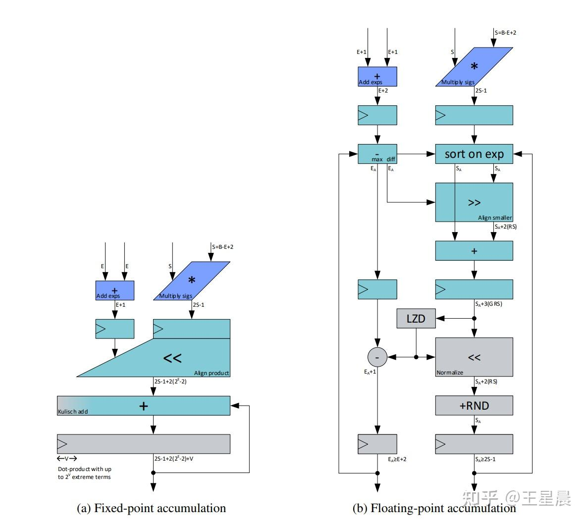

# Hopper架构FP22累加器探究

**Author:** 仰望天空的猫

**Date:** 2025-06-25

**Link:** https://zhuanlan.zhihu.com/p/1920571577222824057

[deepseek v3](https://zhida.zhihu.com/search?content_id=259457905&content_type=Article&match_order=1&q=deepseek+v3&zhida_source=entity)是第一个使用[fp8精度](https://zhida.zhihu.com/search?content_id=259457905&content_type=Article&match_order=1&q=fp8%E7%B2%BE%E5%BA%A6&zhida_source=entity)训练的开源大模型，在其技术报告里提到，[nvidia hopper架构](https://zhida.zhihu.com/search?content_id=259457905&content_type=Article&match_order=1&q=nvidia+hopper%E6%9E%B6%E6%9E%84&zhida_source=entity)下fp8的tensor core累加器精度只有22bit，原文是这样的：

> After aligning 32 mantissa products by right-shifting based on the maximum exponent, the Tensor Core only maintains their highest 13 fraction bits for addition, and truncates bits exceeding this range. Addition results are accumulated to FP22 registers (1 sign bit, 8 exponent bits, and 13 mantissa bits).

另外应该是在[sage attention2](https://link.zhihu.com/?target=https%3A//arxiv.org/pdf/2411.10958)里更早发现了这个问题。

先问是不是，再问为什么。

## 是不是

一般的[fma指令](https://zhida.zhihu.com/search?content_id=259457905&content_type=Article&match_order=1&q=fma%E6%8C%87%E4%BB%A4&zhida_source=entity)是D = A\*B + C的形式，我们可以构造一个简单的矩阵乘法，A和B都是fp8的矩阵，初始化为0，然后通过控制C的mantissa bit来验证累加器的精度，正常情况如果使用fp32作为累加器的话，那么C和D的值应该是完全相同，如果不是的话，就说明累加器的精度确实不是32bit，代码如下：

```c
__global__ void tensor_core_mma_16x8x32() {
    
    uint32_t a[4] = {0x0, 0x0, 0x0, 0x0};
    uint32_t b[2] = {0x0, 0x0};

    uint32_t t = 0b01000000010000000111001111111111;
    float t_f = *((float*)&t);

    float c[4] = {t_f, t_f, t_f, t_f};
    float d[4];
    
    asm(
        "mma.sync.aligned.m16n8k32.row.col.f32.e4m3.e4m3.f32 "
        "{%0,%1,%2,%3}, {%4,%5,%6,%7}, {%8,%9}, {%10,%11,%12,%13};\n"
        : "=f"(d[0]), "=f"(d[1]), "=f"(d[2]), "=f"(d[3])
        :
        "r"(a[0]), "r"(a[1]), "r"(a[2]), "r"(a[3]),
        "r"(b[0]), "r"(b[1]),
        "f"(c[0]), "f"(c[1]), "f"(c[2]), "f"(c[3])
    );

    if (threadIdx.x == 0) {
        printf("\nhopper mma result!!!\n");
        printf("t_f = %f\n", t_f);
        printf("c[0] = %f, c[1] = %f, c[2] = %f, c[3] = %f\n", c[0], c[1], c[2], c[3]);
        printf("d[0] = %f, d[1] = %f, d[2] = %f, d[3] = %f\n", d[0], d[1], d[2], d[3]);
    }
}
```

编译后在H20上运行，最终输出C和D一样！难道H20上的累加器精度不止22bit，通过查看对应的sass文件发现，这里的mma指令被翻译成了：

```sass
HMMA.16816.F32 R4, R4, R2, RZ;
```

也就是在hopper架构下，fp8的mma指令实际上被编译成了fp16的指令，之所以选择mma指令是因为这是一条同步的指令，比较好写，看来还是不能偷懒，于是将指令改成了wgmma，而wgmma的指令必须使用shared memory作为输入，且是异步执行：

```c
__global__ void tensor_core_wgmma_64x16x32() {
    uint32_t t = 0b01000000010000000111001111111111;
    float t_f = *((float*)&t);
    float d[8] = {t_f, t_f, t_f, t_f, t_f, t_f, t_f, t_f};

    __shared__ __align__(1024) uint8_t smem_buffer_a[4096];
    __shared__ __align__(1024) uint8_t smem_buffer_b[4096];

    if (threadIdx.x == 0) {
        for (int i = 0; i < 4096; i++) {
            smem_buffer_a[i] = 0;
            smem_buffer_b[i] = 0;
        }
    }

    __syncthreads();

    if (threadIdx.x == 0) {
        printf("\nhopper wgmma result!!!\n");
        printf("d[0] = %f, d[1] = %f, d[2] = %f, d[3] = %f\n", d[0], d[1], d[2], d[3]);
    }

    auto desc_a = make_smem_desc(smem_buffer_a, 1);
    auto desc_b = make_smem_desc(smem_buffer_b, 1);

    uint32_t scale_d = 1;

    cute::warpgroup_arrive();

    asm volatile("{\n"
                    ".reg .pred p;\n"
                    "setp.ne.b32 p, %10, 0;\n"
                    "wgmma.mma_async.sync.aligned.m64n16k32.f32.e4m3.e4m3"
                    "{%0,   %1,   %2,   %3,   %4,   %5,   %6,   %7},"
                    " %8,"
                    " %9,"
                    " p   , 1,    1;\n"
                    "}\n"
                    : "+f"(d[0]), "+f"(d[1]), "+f"(d[2]), "+f"(d[3]), "+f"(d[4]), "+f"(d[5]), "+f"(d[6]), "+f"(d[7])
                    : "l"(desc_a), "l"(desc_b), "r"(int32_t(scale_d)));

    cute::warpgroup_commit_batch();
    cute::warpgroup_wait<0>();

    if (threadIdx.x == 0) {
        printf("d[0] = %f, d[1] = %f, d[2] = %f, d[3] = %f\n", d[0], d[1], d[2], d[3]);
    }
}
```

这回输出确实不一样了

```text
hopper wgmma result!!!
d[0] = 3.007080, d[1] = 3.007080, d[2] = 3.007080, d[3] = 3.007080
d[0] = 3.006836, d[1] = 3.006836, d[2] = 3.006836, d[3] = 3.006836
```

## 为什么

在《FP8 versus INT8 for efficient deep learning inference》这篇文章里给出了两种浮点数的累加设计，左边采用的是Fixed-point accumulation，核心是[Kulisch累加器](https://zhida.zhihu.com/search?content_id=259457905&content_type=Article&match_order=1&q=Kulisch%E7%B4%AF%E5%8A%A0%E5%99%A8&zhida_source=entity)，门电路少，但是累加器的位宽很大，右边是Floating-point accumulation，明显的电路更复杂，优点是累加器的位宽更少。



  

那什么是Kulisch累加呢，这里借用维基百科里关于浮点数加法操作的一个[示例](https://link.zhihu.com/?target=https%3A//en.wikipedia.org/wiki/Floating-point_arithmetic%23Floating-point_operations)，虽然是十进制的，但是不妨碍理解：

```text
  123456.7 = 1.234567 × 10^5
  101.7654 = 1.017654 × 10^2 = 0.001017654 × 10^5
  Hence:
  123456.7 + 101.7654 = (1.234567 × 10^5) + (1.017654 × 10^2)
                      = (1.234567 × 10^5) + (0.001017654 × 10^5)
                      = (1.234567 + 0.001017654) × 10^5
                      =  1.235584654 × 10^5
```

为了让两个浮点数（指数加尾数的形式）可以累加，首先根据指数位的最大值将指数位对齐，然后将尾数右移，这样就可以直接对尾数进行加法操作，其实这也是开头那段引用里所描述的内容。

可以看到如果为了让结果更加精确的话需要位宽更大的累加器来保存中间结果。根据文章里的测算，如果使用FP32作为累加器的话，FP8-E4M3的效率将比用INT8低183%，但是翻看H系列和L系列的硬件参数可以发现，FP8和INT8的peak performance都是一样的，因此猜测出于硬件实现效率方面的考虑，hopper架构下的FP8累加器精度只使用了22bit。

参考文献：

[https://en.wikipedia.org/wiki/Floating-point\_arithmetic](https://link.zhihu.com/?target=https%3A//en.wikipedia.org/wiki/Floating-point_arithmetic)

[https://arxiv.org/pdf/2303.17951](https://link.zhihu.com/?target=https%3A//arxiv.org/pdf/2303.17951)

[https://arxiv.org/pdf/2505.09343](https://link.zhihu.com/?target=https%3A//arxiv.org/pdf/2505.09343)

[https://arxiv.org/pdf/2411.10958](https://link.zhihu.com/?target=https%3A//arxiv.org/pdf/2411.10958)