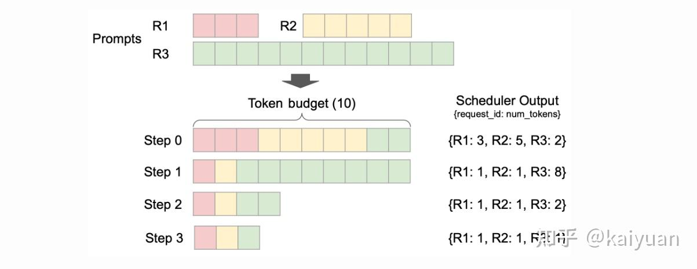

# vLLM框架V1演进分析

**Author:** kaiyuan

**Date:** 2025-06-25

**Link:** https://zhuanlan.zhihu.com/p/1894423873145004335

vLLM在V1版本上做了比较大的改变，主要是之前（当前）的架构在性能和可扩展方面不能满足社区发展要求。本文主要分析架构演进的原因以及主要改动内容。

V0与V1框架的对比（简化版本）

架构重大调整主要驱动力：

-   性能问题：提升整体性能遇到瓶颈，当前框架CPU侧计算的问题较多，影响了GPU性能的发挥；
-   功能扩展问题：架构历史债务过重，代码复杂度高。

## 整体架构

vLLM的老版本（0.6.x前版本，称作V0）已支持多种模型、多种特性，但由于框架的问题社区在0.7.x后迭代一个V1版本。目前V1和V0并存（通过环境变量VLLM\_USE\_V1=0切换到V0），V1架构主要是解决V0中比较突出的问题。

### 架构问题分析

先回顾V0的整体：架构关键模块[LLM Engine](https://zhida.zhihu.com/search?content_id=256324574&content_type=Article&match_order=1&q=LLM+Engine&zhida_source=entity)（异步模式：AsyncLLM Engine），负责处理前端传递过来的请求。Engine内部的处理一般流程：request先经过数据处理（input\_processor），把字符序列转换成特定结构体(SequenceGroup)然后经由调度器(scheduler)进行统一的分配到执行器。执行器([executor](https://zhida.zhihu.com/search?content_id=256324574&content_type=Article&match_order=1&q=executor&zhida_source=entity))创建执行实例([worker](https://zhida.zhihu.com/search?content_id=256324574&content_type=Article&match_order=1&q=worker&zhida_source=entity))和任务分发；worker管理单个GPU硬件资源，通过模型运行器（ModelRunner）加载模型进行计算获得请求返回值。框架的几个特点：

-   scheduler管理每个请求的状态（如，处于什么阶段、是否因为资源被换出）、为请求分配kv-cache；
-   worker的命令执行（如，状态检查）由executor通过RPC通道完成；请求的处理则是由worker0进行广播；
-   数据前后处理、调度、执行器都处于相同进程；

框架搭建过程一般优先考虑基本功能实现，而非完整的架构规划，因此伴随了一些问题：

1.  单线程/进程计算开销过重。很多处理集中在一个线程内：

-   输入处理 ：请求处理成模型所需的数据，比如准备kv、sampler处理、CPU密集型任务（多模态的模型）；
-   请求广播处理：每个step处理都由scheduler发送请求到worker，状态的处理由scheduler完成；
-   输出处理：Sampler开销，De-tokenization处理开销（尤其是当batch size大时）。

一方面，这些操作基本是python代码，其执行效率不高，另一方面不能很好让GPU与CPU协同。

2\. 当前prefix cache在命中为0时，性能会受影响；

3\. 增量inputs的构建在GPU中（可以在CPU中完成）；等。

在代码可扩展方面也存在问题，如：

-   scheduler负担过重：scheduler是有状态（**stateful**）的。scheduler需要记录请求的处理状态，记录prefill/decoder阶段、KV的传输情况；每个step执行都会涉及scheduler到worker的状态信息传递；
-   config构建类型太多：不同模型/特性的入参不统一，需单独构建。

### V1架构整体变化

在原有基础上对LLM Engine模块功能进行了解耦拆分，将scheduler和executor用一个Engine Core的模块承载，数据的处理保留在上层，通过process0和process1分别运行（机器内进程编号不一定就是相邻），如图下所示，底层执行还是由executor负责，

调度器scheduler的变化：把部分功能进行了下沉，且scheduler去状态化，worker则变为有状态化（stateful），需要记录请求相关信息。scheduler与work0不共线程，在TP场景下scheduler下发的请求广播不再由worker0进行，而是由scheduler所在进程执行，这样worker与executor的交互变得清晰。

通过生产者/消费者队列的方式把上层（AsyncLLM Engine）与中间层（EngineCore）联系起来，Process0发送请求到Engine Core的等待队列，AsyncLLM层进行poll轮询查询请求结果，请求处理完成后Engine Core放入另一个队列中；Engine Core与worker的传递方式保持不变。队列处理细节上面，EngineCore队列和AsyncLLM Engine的输出处理上面都使用了"busy\_loop"方式。

框架其它改动：将[beam search](https://zhida.zhihu.com/search?content_id=256324574&content_type=Article&match_order=1&q=beam+search&zhida_source=entity)从vLLM engine内部移动到外层，增强了prefix-caching特性；代码优化方面也做了工作，比如，用numpy操作代替一些python操作。整体目标是使得框架迭代后结构清晰、更好扩展、性能更好。

## Scheduler模块

Scheduler模块作为vLLM的一个核心模块，主要负责请求调度。

V0版本的scheduler需要记录请求状态、区分prefill/decoder阶段，根据调度优先级、GPU资源负载情况对请求进行换入换出（swap）。 scheduler记录的请求体的格式是sequenceGroup，scheduler通过三个队列管理请求处理流程：

-   waiting队列：等待处理的请求，仅包含prefill阶段的请求；
-   running队列：在运行的decode阶段的请求（开启了chunked模式可包含prefill）；
-   swapped队列：存放running队列里面因为系统资源或者优先级的原因被换出的请求，实现调度均衡。

内存的block的管理工作也在scheduler完成，通过block manager -> block allocator完成KV cache的分配。

V0的scheduler任务处理工作比较重，而且代码实现比较混杂（扩展性不好），比如需要支持prefill chunked特性时需要耦合修改，逻辑变得更加复杂（代码引入大量if-else，圈复杂度增加）。

V1上则让scheduler去状态化（stateless），请求体内容上不区分P/D；scheduler的输出格式也做了改变，调度器输格式：**{request\_id: num\_tokens}** ，指定某个请求id和对应处理的长度，多个请求可以混合执行。

如下展示了一个三个请求混合执行的例子，请求R1/2/3在不同step的计算处理长度不同。对于单个请求而言，其处于什么状态（P阶段/D阶段），scheduler output里面未做区分。

R1和R2在step0完成prefill计算，R3到step2才完成。

在V0版本上scheduler每个step都要重新构建输入tensor以及metadata，V1的只需要传递差异下发信息更加简单：在P阶段需要把token IDs、block IDs、采样信息等传递下去，到了D阶段**只需要传递请求IDs和新的blocks IDs**。

V1 scheduler的队列变化上只需要保留waiting和running队列、删除了swapped，即使没有swapped队列同样能够完成优先级调度、以及系统资源压力缓解等处理工作。

scheduler的变化

## KV管理模块

kv cache的管理模块主要是完成内存分配/使用/释放（原理参看PagedAttention），该模块需要给sequence的计算提供足够的存储空间，并且负责跟踪KV cache的状态，模块由scheduler调用。在V0版本中BlockManager模块的搭建层次如下图所示，在scheduler初始化时会调用BlockSpaceManager来创建实例，BlockTable完成内存块到sequence的映射，底层主要是用allocator进行内存的申请与释放，内存用块（block）为单位管理。

BlockManager支持的功能：

-   **Copy-on-write**（COW，写时复制）：当多个逻辑块映射到同一个物理块时，物理块的引用计数会增加；当需要对物理块进行写操作时，如果该物理块的引用计数大于 1，则会触发COW；
-   **Swapping KV**（存储切换）：GPU/CPU之间内存换入/换出；
-   **Lookahead scheduling（**预测调度）：为decode阶段提供相匹配的kv存储；

还有prefix caching和Sliding window等。

V1上面，由于scheduler的管理方式以及输出的内容进行了调整，所以BlockManager也进行相应修改。在V1中BlockManager的工作由KVCacheManager替代，KVCacheManager结构更加的简单。block table替换成了req\_to\_blocks，它是一个字典，完成request到KVCacheBlock映射；在KVCacheManager里面有一个BlockPool负责内存块的管理，里面有一个空闲block管理队列（FreeKVCacheBlockQueue）以及一个映射字典（block哈希值到block的映射）。FreeKVCacheBlockQueue通过LRU策略管理队列中的block，队列移除block的操作复杂度是O(1)。

结合kv管理机制和部分优化（降低python对象创建开销）在prefix caching特性上面V1性能优化较大，这里给出社区的一个测试结果：

cache命中率是0的情况下吞吐不减，V1中prefix cache默认开启

## 其它

值得注意的是框架的升级不一定都是最优解，要考虑新引入的问题。比如，以前位于同一个线程/进程内的模块，在V1中拆分到多个进程中，这增加了信息传递成本，可能会降低系统的可靠性；还需要考虑对于高并发流量的处理场景，相比进程内数据传递，新增一个生产者/消费者队列是否性能最优？ 诸如此类。

当然V1框架目前在开发完善中，还没达到完全取代V0的状态，有些特性正在适配中（[user\_guide](https://link.zhihu.com/?target=https%3A//docs.vllm.ai/en/latest/getting_started/v1_user_guide.html)）：

Optimized: Nearly fully optimized, with no further work currently planned. Functional: Fully operational, with ongoing optimizations. WIP: Under active development. Planned: Scheduled for future implementation (some may have open PRs/RFCs). Deprecated: Not planned for v1 un

除了上述，V1框架里面值得关注的更新点：

-   torch.compile + piecewise CUDA graphs

-   整图编译以单kernel下发，能降低CPU端处理时间但灵活度不够；
-   piecewise方式CPU端开销增加但灵活度变高，可结合一些现有优化模块减少自定义算子编写。

-   PD分离

-   当前V0对PD还只是一个原型（prototype）是否直接在V1基础上开发？

* * *

参考内容：

[vLLM V1 User Guide](https://link.zhihu.com/?target=https%3A//docs.vllm.ai/en/latest/getting_started/v1_user_guide.html)

[BlockManager V0](https://link.zhihu.com/?target=https%3A//docs.google.com/document/d/1ipAypZYfZgloP_08sLi1Z2BADHMauWScbT_H1F0ThCQ/edit%3Fpli%3D1%26tab%3Dt.0%23heading%3Dh.b02gkpjmw8os)

[vLLM V1: A Major Upgrade to vLLM’s Core Architecture | vLLM Blog](https://link.zhihu.com/?target=https%3A//blog.vllm.ai/2025/01/27/v1-alpha-release.html)

[vLLM's V1 Engine Architecture · Issue #8779 · vllm-project/vllm · GitHub](https://link.zhihu.com/?target=https%3A//github.com/vllm-project/vllm/issues/8779)

**欢迎点赞、关注、讨论、不足之处请指正**