# 万字长文图解Qwen2.5-VL实现细节

**Author:** 猛猿

**Date:** 2025-06-25

**Link:** https://zhuanlan.zhihu.com/p/1921289925552210138

​

目录

收起

总览

1\. 相比于qwen2-VL的改进

2\. qwen2.5-VL训练的三个阶段

一、推理请求数据格式

二、整体架构

三、process\_vision\_info

3.1 图像数据的预处理

3.2 视频数据的预处理

四、Processor

4.1 self.image\_processor: Qwen2VLImageProcessor

4.2 self.tokenzier

五、VIT Encoder

5.1 使用3D Conv将原始图像patch转变为vit的输入token

5.2 2D rope

5.3 window attention

5.4 patch merge

六、mrope

6.1 确定每个token的position\_id

6.2 3D mrope

大家好，这篇文章是今年年初就写的了，**为了防止盗版猖獗，一直没有公开**，只给我的同事和周边做框架开发的朋友们内部分享过。时隔半年，[qwen2.5-VL](https://zhida.zhihu.com/search?content_id=259552779&content_type=Article&match_order=1&q=qwen2.5-VL&zhida_source=entity)应该已经渗入到mllm开发的各个场景中了，所以我选择在这个时候放出来。

初读qwenVL的朋友们，可能都觉得不太好读，其实最绕的部分，应该是各种复杂的数据预处理（常洗数据的你我他应该都知道我在说什么 ），算法原理和模型架构上其实不难。所以我依然选择从源码中抽出图例，帮助大家理解代码。**本文涵盖了[window attention](https://zhida.zhihu.com/search?content_id=259552779&content_type=Article&match_order=1&q=window+attention&zhida_source=entity)，[动态帧率采样](https://zhida.zhihu.com/search?content_id=259552779&content_type=Article&match_order=1&q=%E5%8A%A8%E6%80%81%E5%B8%A7%E7%8E%87%E9%87%87%E6%A0%B7&zhida_source=entity)(dynamic fps sampling)，[多模态rope](https://zhida.zhihu.com/search?content_id=259552779&content_type=Article&match_order=1&q=%E5%A4%9A%E6%A8%A1%E6%80%81rope&zhida_source=entity)等大家常关注的内容。**

**最后再插句题外话，如果发现有人非法盗版，请和我说，谢谢！**

[【必看】历史技术文章导航1474 赞同 · 53 评论](https://zhuanlan.zhihu.com/p/654910335) 文章

* * *

## 总览

### 1\. 相比于qwen2-VL的改进

-   **Window attention**：  
    

-   在**vit encoder**部分，引入window attention，即一张图只在window范围内做双向attention，每个窗口的最大大小为112\*112（即8\*8个14\*14的patch/token），这样可以进一步节省计算，详情参见5.3
-   如果一个窗口的尺寸小于112\*112，也不会对他做padding，这样可以尽量保证图片在原生分辨率下做操作，详情参见代码注释
-   在vit enocder部分，只有4层用的是基于整张图的full attention，其余层用的都是window attention

-   **动态帧率采样(dynamic fps sampling)**：即可以人为设定采样帧率，按这个帧率对原始视频进行采样，详情参见3.2
-   **改进3D mrope在T维度上的position\_id计算方式**：从原来的默认值1，改成使用实际时间间隔进行加权计算，详情参见6.1
-   大幅扩展了qwen2vl的预训练数据集，从1.2万亿tokens增加到4万亿tokens

### 2\. qwen2.5-VL训练的三个阶段

**stage1: 从头训练一个vit encoder**

-   使用的数据如下  
    

-   **Image captions**：图像和对应的文本描述
-   **Visual knowledge**: 涵盖名人、地标、动植物等识别数据，帮助模型积累视觉常识。
-   **OCR数据**：从图像中提取的文本信息

-   **使用[clip预训练](https://zhida.zhihu.com/search?content_id=259552779&content_type=Article&match_order=1&q=clip%E9%A2%84%E8%AE%AD%E7%BB%83&zhida_source=entity)**：使用（image, text）数据，在clip框架下进行预训练

  
**stage2: vit 和 qwenvl decoder的联合预训练**  
  
**stage3：长上下文预训练**

-   **视频和代理任务数据**：为了处理更复杂的视觉-语言任务，强调对视频和代理任务的长时依赖理解
-   **增加序列长度**：将序列长度从8,192增加到32,768，使模型能够处理更长的上下文。

* * *

## 一、推理请求数据格式

这里以“单条数据-图像”推理为例，更多例子请参见[这里](https://link.zhihu.com/?target=https%3A//github.com/QwenLM/Qwen2.5-VL)（例如视频推理，batch推理等）

```python
"""
处理image
"""
from transformers import Qwen2_5_VLForConditionalGeneration, AutoProcessor
from qwen_vl_utils import process_vision_info

# ======================================================================================================
# 读取模型权重，推荐情况下用下面那个被注释掉的引入flashattn的做法
# ======================================================================================================
model = Qwen2_5_VLForConditionalGeneration.from_pretrained(
    "Qwen/Qwen2.5-VL-3B-Instruct", torch_dtype="auto", device_map="auto"
)

# We recommend enabling flash_attention_2 for better acceleration and memory saving, especially in multi-image and video scenarios.
# model = Qwen2_5_VLForConditionalGeneration.from_pretrained(
#     "Qwen/Qwen2.5-VL-7B-Instruct",
#     torch_dtype=torch.bfloat16,
#     attn_implementation="flash_attention_2",
#     device_map="auto",
# )

# ======================================================================================================
# 读取用于处理数据中图像和文本的processor，细节如下：
#（1） 默认情况下，在qwen2.5 LM Decoder的输入中，一张图片最少占据4个token，最多占据16384个token
# (2) 你也可以自己权衡模型效果和计算成本，自行设定一张图片最少/最多占据的token数量，
#     然后把这个自定义值传入process初始化的参数重，例如：
#     min_pixels = 256*28*28，你希望一张图片最少占据256个token，由于每个token对应一块28*28的区域，所以这张图片至少拥有256*28*28个pixel
#     max_pixels = 1280*28*28，道理同上
#     processor = AutoProcessor.from_pretrained("Qwen/Qwen2.5-VL-7B-Instruct", min_pixels=min_pixels, max_pixels=max_pixels)
# 
#     这里，取28是因为，最初的patch_size我们打算设为14，由此得到原始patch，这也是vit部分的输入。
#     但在vit输出层，为了进一步节省token，我们决定将 2*2 个patch合并起来作为一个token
#     这个token才是最后作为qwen2.5 LM Decoder的vision部分输入，所以是14*2 = 28
#     （更多细节参见后文对vit部分的解读）
# ======================================================================================================
processor = AutoProcessor.from_pretrained("Qwen/Qwen2.5-VL-3B-Instruct")

# ======================================================================================================
# 传入prompt
# （1）一个text可以对应多个image（把每个image表示成1个dict就好）
# （2）你还可以定制化地去设定针对这张图片的参数，例如你只想对这张图片改变min_pixels和max_pixels，你就可以
#     在这张图片对应的字典中去添加这两个参数，详情参见文档 https://github.com/QwenLM/Qwen2.5-VL
# ======================================================================================================
messages = [
    {
        "role": "user",
        "content": [
            {
                "type": "image",
                "image": "https://qianwen-res.oss-cn-beijing.aliyuncs.com/Qwen-VL/assets/demo.jpeg",
            },
            {"type": "text", "text": "Describe this image."},
        ],
    }
]

# ====================================================================================================
# Preparation for inference
# 对 messages 做一些处理，主要是加上一些诸如特殊字符
#
# text返回结果：
#（1）增加了默认的sys_msg
#（2）每一个角色（system或者user）说的话，其开头和结尾分别添加<|im_start|>和<|im_end|>标记
#（3）image的表达方式为<|vision_start|><|image_pad|><|vision_end|，其中<|image_pad|>是预留给图像的位置
#
# <|im_start|>system
# You are a helpful assistant.<|im_end|>
# <|im_start|>user
# <|vision_start|><|image_pad|><|vision_end|>Describe this image.<|im_end|>
# <|im_start|>assistant
# ====================================================================================================
text = processor.apply_chat_template(
    messages, tokenize=False, add_generation_prompt=True
)


# ====================================================================================================
# 预处理图像和视频数据。这里以图像数据举例，视频数据处理见后文
# image_inputs: List[PIL.Image.Image], 列表长度为这个batch中对应的所有图片数量，这点非常重要
# 假设列表长度为1，那么image_inputs形如：[<PIL.Image.Image image mode=RGB size=2044x1372>]
# process_vision_info的代码请看：https://github.com/QwenLM/Qwen2.5-VL/blob/c15045f8829fee29d4b3996e068775fe6a5855db/qwen-vl-utils/src/qwen_vl_utils/vision_process.py#L352
#
# process_vision_info对每个image都做了如下处理：
#（1）检查每张图片的 max(h,w)/min(h,w)是否在阈值范围内，如果超过阈值则认为该图片高宽比太离谱，会直接抛出异常（当前阈值200）
#（2）通过四舍五入的方式，重新设置图片的 h 和 w 值，确保它们可以被28整除
#（3）如果这张图片太大，超过了上述 max_pixels 的范围，那么就在尽量维持其宽高比例不变的情况下，缩小其宽高
#（4）这张图片太小时用同样的方式放大其宽高
#（5）经过前面的4步，我们得到了这张图片最终理想的h和w值，我们采用resize的方式把图片按这个值缩放，就得到image_inputs中的每一个图片
# 你可以发现，这里没有经过任何的“多裁少pad操作”，你只是在缩放图片。
# 
# process_vision_info对每个video都做了如下处理：TODO
# ====================================================================================================
image_inputs, video_inputs = process_vision_info(messages)

# ====================================================================================================
# 假设这里我们做的是batch inference，有2个text，text0对应2张图， text1对应1张图。
# 那么最终inputs的形式如：       
# {
# input_ids尺寸是：(text_num, token_num), 这里我们已经算好了每张图片会占据多少个token，并用相应个数的<|image_pad|>在text文本里做了替换
# 'input_ids': tensor([[151644,   8948,    198,  ..., 151644,  77091,    198],
#                      [151644,   8948,    198,  ..., 151643, 151643, 151643]]), 
# 
# attention_mask尺寸是：(text_num, token_num)
# 'attention_mask': tensor([[1, 1, 1,  ..., 1, 1, 1],
#                           [1, 1, 1,  ..., 0, 0, 0]]), 0表示第2条数据做了padding
# 
#  pixel_values尺寸为：(image_num * grid_t * grid_h * grid_w, 
#                      channel * temporal_patch_size(2) * patch_size(14) * patch_size(14))，image_num是这个batch中的image数量
#  'pixel_values': tensor([[ 0.8501,  0.8501,  0.8647,  ...,  1.3922,  1.3922,  1.3922],
#                          [ 0.9376,  0.9376,  0.9376,  ...,  1.4491,  1.4491,  1.4491],
#                          [ 0.9084,  0.9376,  0.9376,  ...,  1.4065,  1.4207,  1.4207],
#                          ...,
#                          [-0.1280, -0.1280, -0.1426,  ..., -0.2431, -0.2715, -0.3000],
#                          [-0.3324, -0.3324, -0.3032,  ..., -0.3000, -0.2715, -0.2857],
#                          [-0.3762, -0.4054, -0.4054,  ..., -0.4279, -0.4422, -0.4564]]),
#         
# image_grid_thw尺寸是：(image_num, 3)，其中3分别表示这张图片的grid_t, grid_h, grid_w
# 'image_grid_thw': tensor([[  1,  98, 146],
#                           [  1,  98, 146],
#                           [  1,  98, 146]])
# }
# 到这一步为止，我们还没有对图像做具体的转token处理，这个应该是在model.forward中做的，我们只是对图像做了一些初步的resize，rescale等处理
# ====================================================================================================
inputs = processor(
    text=[text],
    images=image_inputs,
    videos=video_inputs,
    padding=True,
    return_tensors="pt",
)
inputs = inputs.to(model.device)

# ====================================================================================================
# Inference: Generation of the output
# ====================================================================================================
generated_ids = model.generate(**inputs, max_new_tokens=128)
generated_ids_trimmed = [
    out_ids[len(in_ids) :] for in_ids, out_ids in zip(inputs.input_ids, generated_ids)
]
output_text = processor.batch_decode(
    generated_ids_trimmed, skip_special_tokens=True, clean_up_tokenization_spaces=False
)
print(output_text)
```

  

## 二、整体架构

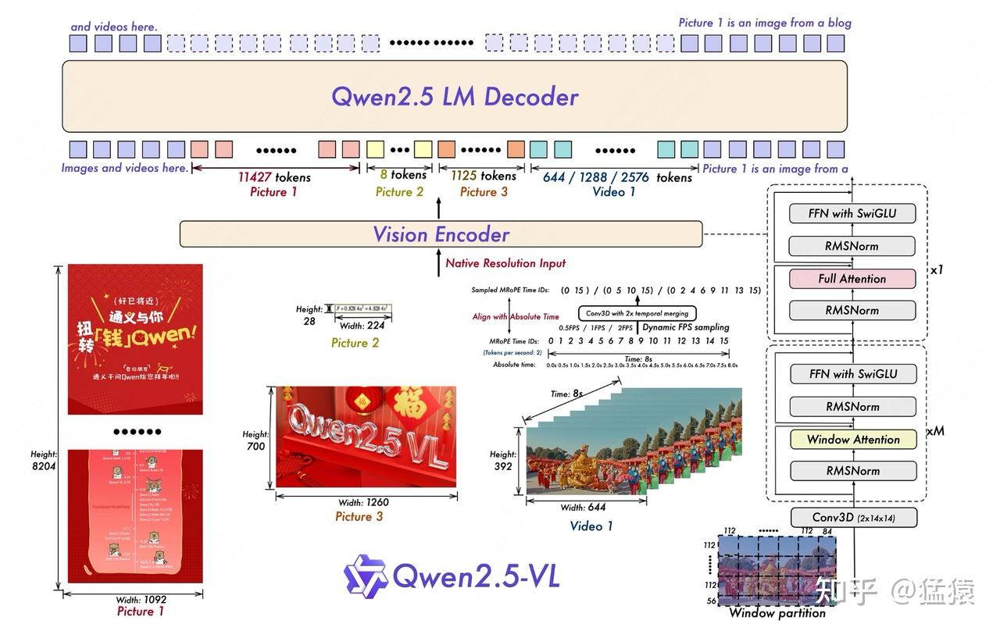

来自qwen论文

以下把图像和视频数据统称为“视觉数据”

-   [process\_vision\_info](https://link.zhihu.com/?target=https%3A//github.com/QwenLM/Qwen2.5-VL/blob/c15045f8829fee29d4b3996e068775fe6a5855db/qwen-vl-utils/src/qwen_vl_utils/vision_process.py%23L352): 视觉数据在进入vit前，会先做一些预处理，包括对图像数据尺寸的动态调整、视频动态抽帧等操作。
-   [vit](https://link.zhihu.com/?target=https%3A//github.com/huggingface/transformers/blob/41925e42135257361b7f02aa20e3bbdab3f7b923/src/transformers/models/qwen2_5_vl/modeling_qwen2_5_vl.py%23L404)：对视觉数据进行处理。在输入部分，使用3D conv把视觉数据做成14\*14 patch分块，并使用window attention节省计算。在输出部分，通过一个mlp层将2\*2个patch块合并成一个merged\_patch，这个merged\_patch代表的token才是qwen2.5 LM decoder中的一个输入。
-   [Qwen2.5 LM Decoder](https://link.zhihu.com/?target=https%3A//github.com/huggingface/transformers/blob/41925e42135257361b7f02aa20e3bbdab3f7b923/src/transformers/models/qwen2_5_vl/modeling_qwen2_5_vl.py%23L1102)：对文本和视觉数据使用3D M-rope（3D多模态rope），然后送入主体模型中。

  
  
接下来分别看这几块的细节。

  

## 三、process\_vision\_info

### 3.1 图像数据的预处理

**代码在[这里](https://link.zhihu.com/?target=https%3A//github.com/QwenLM/Qwen2.5-VL/blob/c15045f8829fee29d4b3996e068775fe6a5855db/qwen-vl-utils/src/qwen_vl_utils/vision_process.py%23L97)**

```python
# ====================================================================================================
# 预处理图像和视频数据。
# image_inputs: List[PIL.Image.Image], 列表长度为这个batch中对应的所有图片数量，这点非常重要
# 假设列表长度为1，那么image_inputs形如：[<PIL.Image.Image image mode=RGB size=2044x1372>]
# ====================================================================================================
image_inputs, video_inputs = process_vision_info(messages)
```

**process\_vision\_info对每个image都做了如下处理。** （1）检查每张图片的 `max(h,w) / min(h,w)`是否在阈值范围内，如果超过阈值。则认为该图片高宽比太离谱，会直接抛出异常（当前阈值200）  
（2）通过四舍五入的方式，重新设置图片的 h 和 w 值，确保它们可以被28整除  
（3）如果这张图片太大，超过了上述 max\_pixels 的范围，那么就在**尽量维持其宽高比例不变的情况下，重新计算其符合max\_pixels范围的h和w。图片太小也是同理。** （4）经过前面的步骤，我们得到了这张图片最终理想的h和w值（resized\_height，resized weight），我们采用  
resize的方式把图片按这个值缩放，就得到image\_inputs中的每一个图片  
**你可以发现：**  

-   这里没有经过任何的“多裁少pad到固定分辨率的操作”，你只是在合理的范围内缩放图片，尽量保存了原始图片的信息。你允许各图片的分辨率各不相同。
-   每一张图片所含的patch数量是不同的（也就是要送入vit的输入tokens数量是不同的）。
-   **以上两者共同表达了qwenvl中动态分辨率的含义**

  

### 3.2 视频数据的预处理

-   入口代码在[这里](https://link.zhihu.com/?target=https%3A//github.com/QwenLM/Qwen2.5-VL/blob/c15045f8829fee29d4b3996e068775fe6a5855db/qwen-vl-utils/src/qwen_vl_utils/vision_process.py%23L277)
-   核心处理代码在[这里](https://link.zhihu.com/?target=https%3A//github.com/QwenLM/Qwen2.5-VL/blob/c15045f8829fee29d4b3996e068775fe6a5855db/qwen-vl-utils/src/qwen_vl_utils/vision_process.py%23L226)。（假设用的处理后端是decord，当然还有torchvision之类的可选，处理逻辑都差不多）

对这个视频核心处理逻辑的代码做一个解读，这个代码负责处理每一个视频：

```python
def _read_video_decord(
    ele: dict,
) -> (torch.Tensor, float):
    """read video using decord.VideoReader

    Args:
        ele (dict): a dict contains the configuration of video.
        support keys:
            - video: the path of video. support "file://", "http://", "https://" and local path.
            - video_start: the start time of video.
            - video_end: the end time of video.
    Returns:
        torch.Tensor: the video tensor with shape (T, C, H, W).
    """
    import decord
    video_path = ele["video"]
    st = time.time()
    vr = decord.VideoReader(video_path)
    # TODO: support start_pts and end_pts
    if 'video_start' in ele or 'video_end' in ele:
        raise NotImplementedError("not support start_pts and end_pts in decord for now.")
    # =====================================================================================
    # 以下都是视频的原始属性
    # total_frames：原始视频的总帧数
    # video_fps：原始视频的fps（每秒的帧数）
    # =====================================================================================
    total_frames, video_fps = len(vr), vr.get_avg_fps()
    logger.info(f"decord:  {video_path=}, {total_frames=}, {video_fps=}, time={time.time() - st:.3f}s")
    # =====================================================================================
    # nframes：经过我们的计算，最终要对这个视频采样的总帧数。计算逻辑解读见下。
    # =====================================================================================
    nframes = smart_nframes(ele, total_frames=total_frames, video_fps=video_fps)
    # =====================================================================================
    # idx: 以均匀采样的方式，采样出被选中的视频帧id
    # （均匀采样的目的是尽量保证不丢失原始视频所有时间轴上的信息）
    # 例如，假设total_frames = 20 (原始视频20帧), video_fps = 5(每秒5帧)，那么原始视频一共4秒，其
    # 那么原始图片帧为[[0,1,2,3,4], [5,6,7,8,9], [10,11,12,13,14], [15,16,17,18,19]]
    # 假设现在nframes = 10，即我们最终要采样10帧。
    # 那么抽样后idx = [0, 2, 4, 6, 8, 11, 13, 15, 17, 19]
    # =====================================================================================
    idx = torch.linspace(0, total_frames - 1, nframes).round().long().tolist()
    video = vr.get_batch(idx).asnumpy() # 在相应位置抽帧，并将其转换为numpy数组
    video = torch.tensor(video).permute(0, 3, 1, 2)  # Convert to TCHW format
    # =====================================================================================
    # sample_fps：表示抽样后的视频的帧率。
    # 例如total_frames = 20 (原始视频20帧), video_fps = 5(每秒5帧)，那么原始视频一共4秒
    # 现在nframes=10，说明抽样后的每秒帧数为 nframes/(total_frames/video_fps) = 10/4 = 2.5fps
    # =====================================================================================
    sample_fps = nframes / max(total_frames, 1e-6) * video_fps
    # =====================================================================================
    # video: 抽样后的视频数据，已经转成tensor，尺寸为(T, C, H, W)
    # smaple_fps: 抽样后的视频帧率（fps）
    # =====================================================================================
    return video, sample_fps
```

下面对代码中`[smart_nframes](https://link.zhihu.com/?target=https%3A//github.com/QwenLM/Qwen2.5-VL/blob/c15045f8829fee29d4b3996e068775fe6a5855db/qwen-vl-utils/src/qwen_vl_utils/vision_process.py%23L143)`这个对原始视频帧的采样过程进行解读。

```python
def smart_nframes(
    ele: dict,
    total_frames: int,
    video_fps: int | float,
) -> int:
    """calculate the number of frames for video used for model inputs.

    Args:
        ele (dict): a dict contains the configuration of video.
            support either `fps` or `nframes`:
                - nframes: the number of frames to extract for model inputs.
                - fps: the fps to extract frames for model inputs.
                    - min_frames: the minimum number of frames of the video, only used when fps is provided.
                    - max_frames: the maximum number of frames of the video, only used when fps is provided.
        total_frames (int): the original total number of frames of the video.
        video_fps (int | float): the original fps of the video.

    Raises:
        ValueError: nframes should in interval [FRAME_FACTOR, total_frames].

    Returns:
        int: the number of frames for video used for model inputs.
    """
    # =====================================================================================
    # nframes 和 fps 都来自用户自己在msg里的配置。
    # - nframes：决定最终对这个视频采样的总帧数
    # - fps：    假设保持原始视频的时长不变，这个值表示用户想按每s多少帧的方式来采样视频（默认值为2）
    #            理论上，原始视频总时长 * 用户配置的fps = 最终采样出的视频总帧数
    #            但实际上，受到qwenvl的限制（不让视频数据占据太少/太多token），所以最终采样出的视频
    #            fps可能不是完全吻合用户配置的这个fps
    # 基于上述2者的定义，你要么配fps，要么配nframes，不要两者都配
    # =====================================================================================
    assert not ("fps" in ele and "nframes" in ele), "Only accept either `fps` or `nframes`"
    # =====================================================================================
    # 如果配置了nframes，就让他成为FRAME_FACTOR的倍数（默认FRAME_FACTOR=2）
    # （因为最终在进入vit前，我们希望把2帧视频合起来处理）
    # =====================================================================================
    if "nframes" in ele:
        nframes = round_by_factor(ele["nframes"], FRAME_FACTOR)
    # =====================================================================================
    # 如果配置了fps（没有配置的话就用默认值FPS = 2）
    # =====================================================================================
    else:
        fps = ele.get("fps", FPS)
        # 对视频数据来说要求的最小总帧数（默认4），并保证它是FRAME_FACTOR的倍数
        min_frames = ceil_by_factor(ele.get("min_frames", FPS_MIN_FRAMES), FRAME_FACTOR)
        # 对视频数据要求的最大总帧（默认764）
        max_frames = floor_by_factor(ele.get("max_frames", min(FPS_MAX_FRAMES, total_frames)), FRAME_FACTOR)
        # 理论上来说，最终我们需要的总帧数 = 原始视频长度（单位：秒）* 人为定义的每秒视频采集帧
        nframes = total_frames / video_fps * fps
        if nframes > total_frames:
            logger.warning(f"smart_nframes: nframes[{nframes}] > total_frames[{total_frames}]")
        # 同样对nframes做一些限制处理
        nframes = min(min(max(nframes, min_frames), max_frames), total_frames)
        nframes = floor_by_factor(nframes, FRAME_FACTOR)
    if not (FRAME_FACTOR <= nframes and nframes <= total_frames):
        raise ValueError(f"nframes should in interval [{FRAME_FACTOR}, {total_frames}], but got {nframes}.")
    return nframes
```

  

**最后，再来看来自这份代码里的、关于video部分的一个重要[返回args](https://link.zhihu.com/?target=https%3A//github.com/QwenLM/Qwen2.5-VL/blob/c15045f8829fee29d4b3996e068775fe6a5855db/qwen-vl-utils/src/qwen_vl_utils/vision_process.py%23L375)**:

```python
    if return_video_kwargs:
        return image_inputs, video_inputs, {'fps': video_sample_fps_list}
```

`{'fps': video_sample_fps_list}`就是我们上面计算出的、每个视频采样被采样后的fps（即代码里的sample\_fps）。之所以是一个list，是因为这里装着输入数据中全部视频的sample\_fps信息。  
  
  
**这个部分之所以重要，是因为后面在计算3D mrope中，它会被用在计算Temporal维度上的位置编码信息**。在这部分计算中，有一个重要参数`**second_per_grid_ts**`，它的计算方法如下：

```python
second_per_grid_ts = (1/sample_fps) * temporal_patch_size(默认为2) 
```

结合下图解释一下这里在做什么：

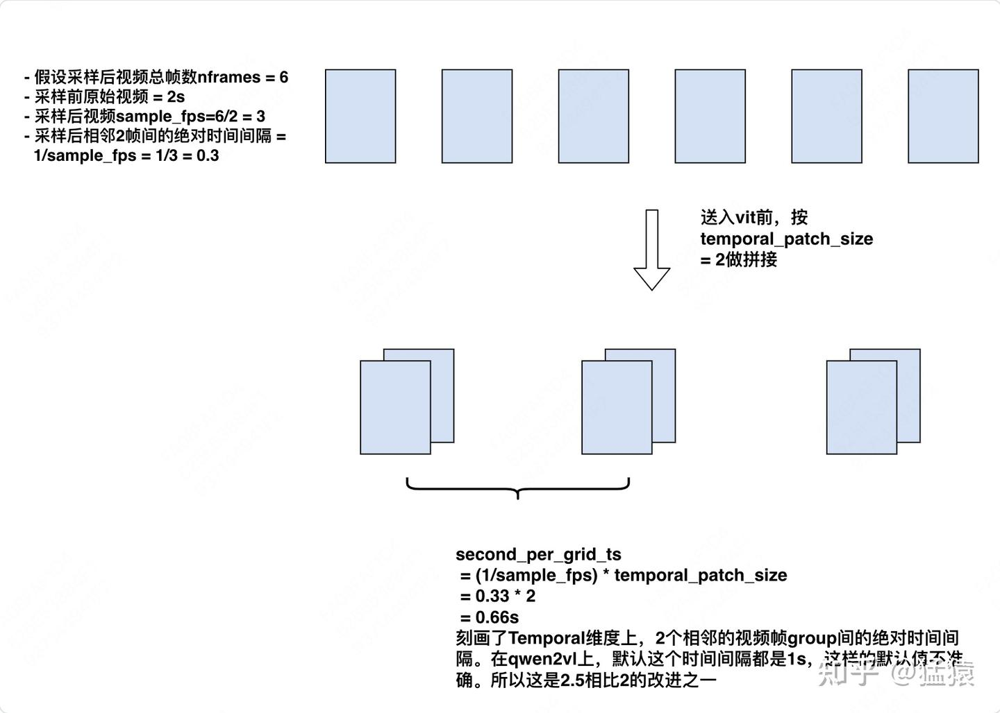

根据qwen代码原创绘制

  

## 四、Processor

在前面的处理中，对于一个batch中的数据：

-   我们对text数据做了add\_chat\_template的处理，增加了一些表示start，end、image、video的placeholder（参见一）
-   我们对vision数据做了一些预处理，例如动态resize图片的尺寸、对视频数据进行抽帧及同样resize视频帧的尺寸等。
-   但是到这里，我们没有对text做tokenize，也没有对vision做更深入的处理。所以这一些都在Processor中进一步完成，调用Processor的方式如下（第一部分写过）

```python
inputs = processor(
    text=[text],
    images=image_inputs, # List[PIL.Image.Image]，这个batch中所有的图片数据展平成一维List
    videos=video_inputs, # List[Tensor], 每个Tensor尺寸为(T, C, H, W)，表示一个视频抽帧后的结果
    padding=True,
    return_tensors="pt",
)
inputs = inputs.to(model.device)
```

-   Processor入口函数在[这里](https://link.zhihu.com/?target=https%3A//github.com/huggingface/transformers/blob/41925e42135257361b7f02aa20e3bbdab3f7b923/src/transformers/models/qwen2_5_vl/processing_qwen2_5_vl.py%23L48)，其中[这个部分](https://link.zhihu.com/?target=https%3A//github.com/huggingface/transformers/blob/41925e42135257361b7f02aa20e3bbdab3f7b923/src/transformers/models/qwen2_5_vl/processing_qwen2_5_vl.py%23L129-L142)计算了3.2中所说的`second_per_grid_ts`，这个值将在mrope中被使用。
-   Procssor中，负责处理vision数据的`self.image_processor`核心实现在[这里](https://link.zhihu.com/?target=https%3A//github.com/huggingface/transformers/blob/41925e42135257361b7f02aa20e3bbdab3f7b923/src/transformers/models/qwen2_vl/image_processing_qwen2_vl.py%23L87)。
-   Processor中，负责处理text数据的`self.tokenizer`比较常规，这里不展示细节。

### 4.1 self.image\_processor: Qwen2VLImageProcessor

-   代码在[这里](https://link.zhihu.com/?target=https%3A//github.com/huggingface/transformers/blob/41925e42135257361b7f02aa20e3bbdab3f7b923/src/transformers/models/qwen2_vl/image_processing_qwen2_vl.py%23L87)

  
**不展示全部的代码了，这里总结下它在做的事情，先以单张图片数据为例**：  
  
  
**（1）do\_resize / do\_rescale / do\_normalize**：根据配置决定是否要做这3个操作，分别表示调整图片大小 / 将像素值缩放到0-1之间（乘上1/255）/ 在每个channel上指定mean和std做normalize。**这边的do\_resize其实应该在上面process\_vision\_info中就做过了，也就是这里的操作和之前是有点重复的。**  
**（2）把每张图片复制temporal\_patch\_size次（默认为2）**。这是为了在image数据上也增加 T 这个维度，保证image和video的处理逻辑一致（因为video也是把相邻的2帧组成一组）  
**（3）最终，对于1张图**：  

-   它将被处理成`[grid_t * grid_h * grid_w, channel * temporal_patch_size(2) * patch_size(14) * patch_size(14)`\]这样的尺寸。其中grid\_t表示这张图在 T 方向上的格子数（就是有多少张2帧组成的图，对于图像来说grid\_t的值为1）；grid\_h = resize\_h / patch\_size，表示如果按照patch\_size(14)来看，h方向上可以被切分成多少个格子；grid\_w也是同理
-   这张图的对应的`(grid_t, grid_h, grid_w)`会被保存下来。
-   **对于这个batch中全部的图，我们会将其concat起来。也即最终输出结果的尺寸为**`[sum(grid_t * grid_h * grid_w), channel * temporal_patch_size(2) * patch_size(14) * patch_size(14)`\]，**最终图像的处理结果可以参见上面代码块中的`pixel_values`和`image_grid_thw`数据**

  
  
**（4）最后再强调很重要的一点，根据上面的描述，我们知道对于1张图，它最终会被处理成**`[grid_t * grid_h * grid_w, channel * temporal_patch_size(2) * patch_size(14) * patch_size(14)`\]这个尺寸，其中第0维表示某个patch，**这里patch不是按照一张图从左到右，从上到下的顺序排列的，而是按照把2 \* 2 区域内的4个patch变成连续的4个patch排列的**。具体例子如下图：

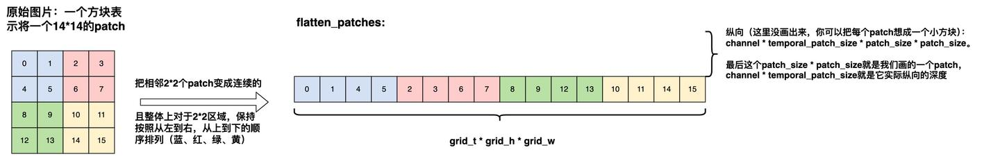

根据qwen代码原创绘制

**对于单个视频数据，也是类似处理，返回的结果尺寸依然是`[grid_t * grid_h * grid_w, channel * temporal_patch_size(2) * patch_size(14) * patch_size(14)`，只是这里的grid\_t往往不再是1，而是视频总帧数/temporal\_patch\_size（视频两两帧堆叠方式参见3.2的图）**

  

### 4.2 self.tokenzier

tokenizer的具体内容不展开，这里只强调，对于原始text部分，在进入tokenizer前我们还要做一些处理，处理核心代码在[这里](https://link.zhihu.com/?target=https%3A//github.com/huggingface/transformers/blob/41925e42135257361b7f02aa20e3bbdab3f7b923/src/transformers/models/qwen2_5_vl/processing_qwen2_5_vl.py%23L151-L177)。

```python
# 原始text例如：
# <|im_start|>system
# You are a helpful assistant.<|im_end|>
# <|im_start|>user
# <|vision_start|><|image_pad|><|vision_end|>Describe this image.<|im_end|>
# <|im_start|>assistant
```

**在之前的预处理中，我们是把整个batch中的text和image都展平成一个list，那么image和text如何对应起来呢？**  

-   对应的方法是，在text中有预留一个`<|image_pad|>`位置，一个位置表示一张图，你只要把list中的image顺次填入就可以了。
-   在知道这种对应方法的基础上，现在我们想让`<|image_pad|>`做进一步展开，即这个位置的图表示几个token，我们就拷贝几次`<|image_pad|>`。
-   **每一张图对应的token数量为：(grid\_t \* grid\_h \* grid\_w)/ (merge\_size\*\*2)，其中merge\_size表示你想让多少个patch合并成一个token，默认值是2，即在原始图像上做出14\*14大小的patch后，我将2\*2个patch合并成1个token表示。根据这个计算方式我们扩展`<|image_pad|>`。**
-   按这个方式处理完text后就可以送入self.tokenizer取做tokenize了，会按照max\_len做截断，也会在一个批次中做padding

  

## 五、VIT Encoder

处理好了text和vision，现在就可以送入模型开始正式做fwd了。整个qwenVL模型架构在`[Qwen2_5_VLForConditionalGeneration](https://link.zhihu.com/?target=https%3A//github.com/huggingface/transformers/blob/41925e42135257361b7f02aa20e3bbdab3f7b923/src/transformers/models/qwen2_5_vl/modeling_qwen2_5_vl.py%23L1511)`中，其中包含了VIT encoder和qwenVL主体decoder。这里我们只关注VIT encoder（`_[Qwen2_5_VisionTransformerPretrainedModel](https://link.zhihu.com/?target=https%3A//github.com/huggingface/transformers/blob/41925e42135257361b7f02aa20e3bbdab3f7b923/src/transformers/models/qwen2_5_vl/modeling_qwen2_5_vl.py%23L404)_`），下面介绍vit encoder的forward方法。

### 5.1 使用3D Conv将原始图像patch转变为vit的输入token

-   这个过程也称为embedding
-   这部分的代码在[这里](https://link.zhihu.com/?target=https%3A//github.com/huggingface/transformers/blob/41925e42135257361b7f02aa20e3bbdab3f7b923/src/transformers/models/qwen2_5_vl/modeling_qwen2_5_vl.py%23L88)。

在进入vit encoder前，我们vision部分的输入如下，我们会有`flatten_patches + 对应的(grid_t, grid_h, grid_w)`数据作为输入。


**那么3D conv要做的事情就是（相当于拿out\_channels（= vit\_hidden\_size）个3D kernel，每个kernel都在所有patch方块上滚一遍， 得到hidden\_size的一个数值，所有out\_channels个kernel滚完就得到了完整的hidden\_size）：**

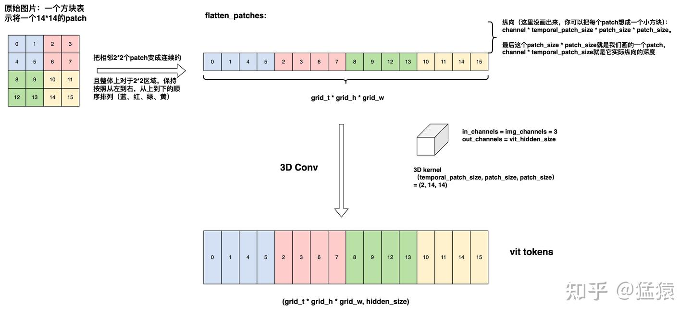

  

### 5.2 2D rope

**接下来，要做vit encoder的rope，这里用的是2D rope**，之所以用2D而不用3D，我猜主要原因是vit的主要作用是负责提供单图/单帧上的特征（特别是后面在vit部分引入window attention后，就更不需要跨Temporal维度去计算注意力了），而Temporal维度上的关联性，留到qwenvl的主体部分去做，那个时候再引入3D mrope。  
  
  
**我们先来看比较熟悉的1D rope：**

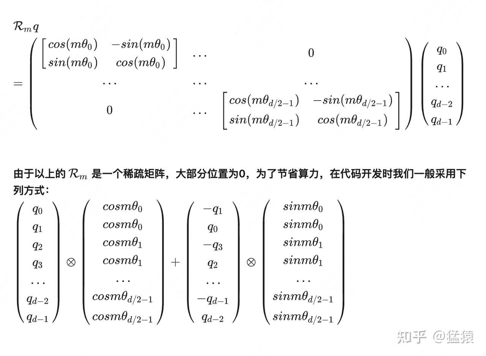

截图的我自己的rope文章

**注意，Rm矩阵的解不是唯一的，例如1D rope的Rm还可以写成下面这种形式，因为它同样满足下面蓝体公式（这也是llama系列的改写方式），在qwenvl后续的各种rope中，沿袭了此种方法（代码更好写了）：**

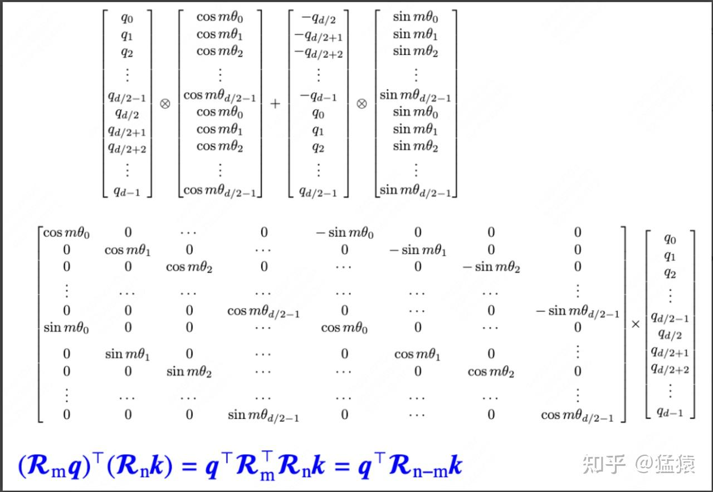

请给我一点时间找下这张图片链接，应该是来自huggingface的某个discussion

**那么对应到vit 2D rope的某个token中，它的2D位置编码如下（这里vit\_hidden\_size指的是head\_dim）：**

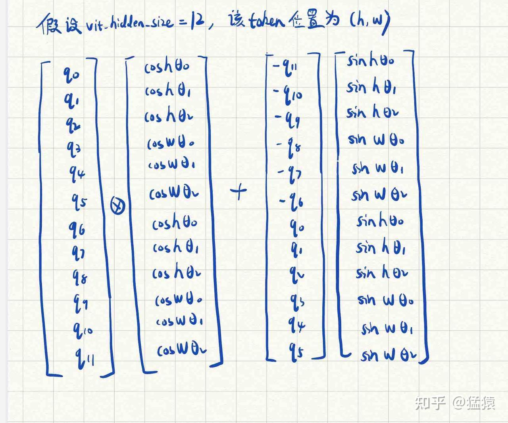

是我的丑字，希望没有辣到大家眼睛

**虽然看起来麻烦，但可以粗糙理解成半个head\_dim在负责做h位置的rope，半个head\_dim在负责做w位置的rope，这两个部分共享一套** $\theta$ **值**  
详细实现可以去看代码，分别在[这里](https://link.zhihu.com/?target=https%3A//github.com/huggingface/transformers/blob/41925e42135257361b7f02aa20e3bbdab3f7b923/src/transformers/models/qwen2_5_vl/modeling_qwen2_5_vl.py%23L114)和[这里](https://link.zhihu.com/?target=https%3A//github.com/huggingface/transformers/blob/41925e42135257361b7f02aa20e3bbdab3f7b923/src/transformers/models/qwen2_5_vl/modeling_qwen2_5_vl.py%23L436)

  

### 5.3 window attention

**Window attention的定义如下图：**

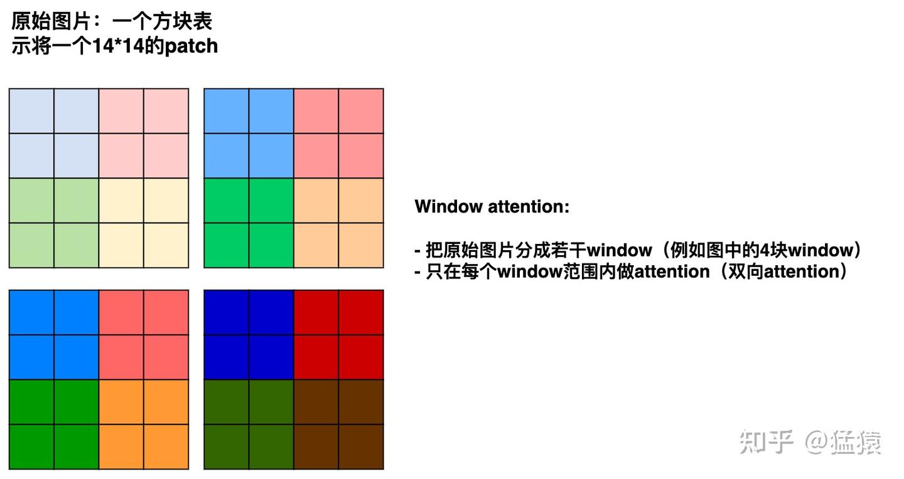

根据qwen代码原创绘制

但是按照5.1节中的展开方法，现在我们输入vit模型的tokens排序如下，这种方式下同一个窗口内的patch（也就是vit tokens）无法连续地排列在一起！

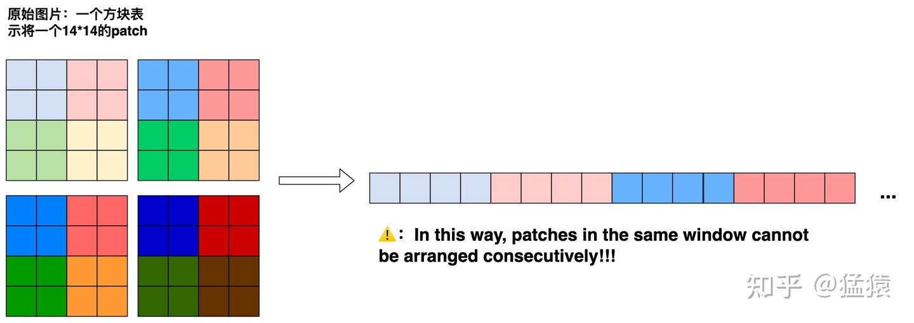

根据qwen代码原创绘制

**为了做window attention，我们希望：**

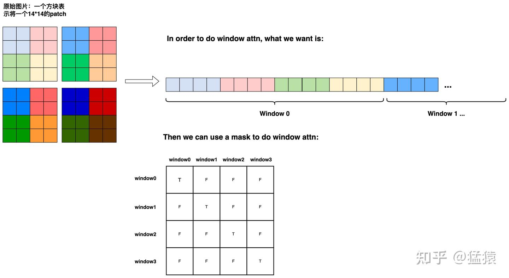

根据qwen代码原创绘制

这种调换vit tokens顺序的方法，就是[这块代码](https://link.zhihu.com/?target=https%3A//github.com/huggingface/transformers/blob/41925e42135257361b7f02aa20e3bbdab3f7b923/src/transformers/models/qwen2_5_vl/modeling_qwen2_5_vl.py%23L519-L535)在做的事情。我们按照这个顺序作为vit的输入，然后正常经过vit blocks，得到最后的输出，**但是要注意，在输出结果中，我们必须要把顺序再次调换回来。**

  

### 5.4 patch merge

在整个vit的处理中，我们都是使用14\*14的patch作为一个token处理的，但是最终进入到qwenvl decoder（也就是主体模型）中时，我们需要将原来2\*2个patch合并成一个token，这可以通过先把2\*2个token的结果concat起来，然后经过一个mlp层做hidden\_size维度的映射得到，如下图：

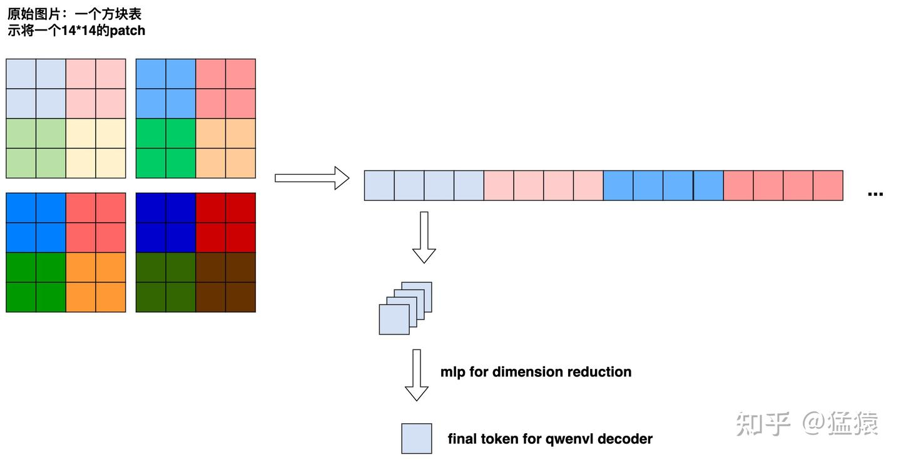

根据qwen代码原创绘制

这就是[这块代码](https://link.zhihu.com/?target=https%3A//github.com/huggingface/transformers/blob/41925e42135257361b7f02aa20e3bbdab3f7b923/src/transformers/models/qwen2_5_vl/modeling_qwen2_5_vl.py%23L146)在做的事情。

  

## 六、mrope

### 6.1 确定每个token的position\_id

即确定在mrope下，表示每个每个token位置编码的（t, h, w）分别是多少。**这里先来看qwen2vl的做法：**

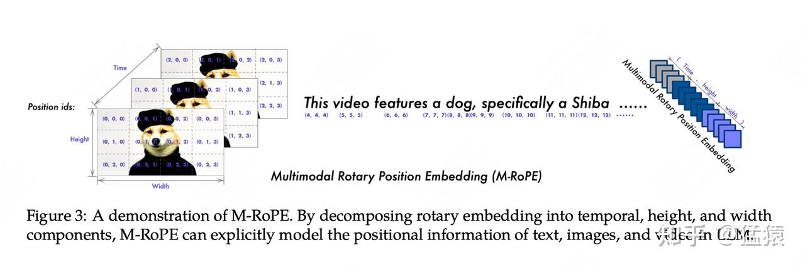

来自qwen2vl论文

在3D rope中，不管是text还是vision，它们的position\_id都表达成`(t, h, w)`，**其中text的这3个值相等。**  
现在重点解读图中的视频部分，它正好之前给出的这张图对上：

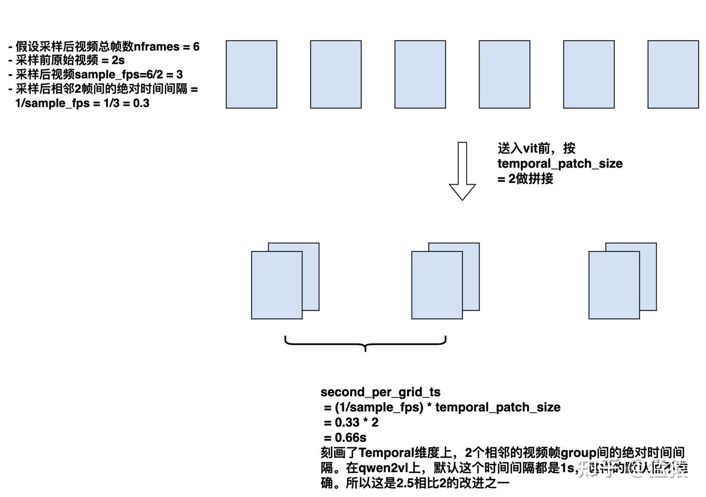

根据qwen代码原创绘制

  

-   以上3组视频帧经过vit的处理后，就变成了paper图例中的那3个小狗帧，小狗帧里每一个虚线框就表示喂给qwenvl decoder的一个vision token。结合图例，我们就不难理解它在h和w方向上的position\_id赋值了。
-   而在t时刻上，**qwenvl2是默认2个相邻小狗帧之间的间隔为1的**，因此你可以在图例中发现，t方向上是0-2顺次递增。
-   在qwenvl2中，**新模态的position\_id初始值来自上一个模态的position\_id (t, h, w)中的最大值 + 1**，我们举一些例子：  
    

-   在上图中，vision模态**所有tokens**的 max(t,h,w) = 3，所以text token的初始值就是3+1 = 4，因此第一个text token是(4, 4, 4)
-   在上图中，到最后一个text token为止，max(t, h, w) = 12。此时如果在这个text token后我们继续接一条vision数据，我们先不考虑什么初始值设置，只考虑这条vision数据自己的话，那么这个vision数据的tokens的position\_id应该是(0, 0, 0),(0, 0, 1), (0, 0, 2)...， 也就是和我们图例中画着小狗的那个vision数据编码方式是一样的。但是现在我们必须考虑整条input，所以新vision数据的position\_id初始值 = 12 + 1 = 13，那么最终的它的position\_id应该是(0+13, 0+13, 0+13), (0+13, 0+13, 1+13), (0+13, 0+13, 2+13), ...以此类推。

  

  
到这里我们就介绍完了qwenvl2的 3D position\_id，现在我们来看qwenvl2.5，**这两者之间大部分的position id处理逻辑都是一致的，只有一个地方不同，那就是对于vision数据的 t 维度的position\_id赋值。其实这个逻辑也很简单：**  

-   **我们之前介绍过`second_per_grid_t`的概念**，如上图所示，它表示T维度上2个相邻的视频帧group之间的绝对时间间隔（单位：s）。
-   **现在我们再引入`tokens_per_second`这个概念**，它是个可以人为配置的参数（来自config.json文件，默认值为2）。这个参数让我困惑了好一阵，当前我的理解是这样的，我们再次回到视频数据进入vit前的样子：

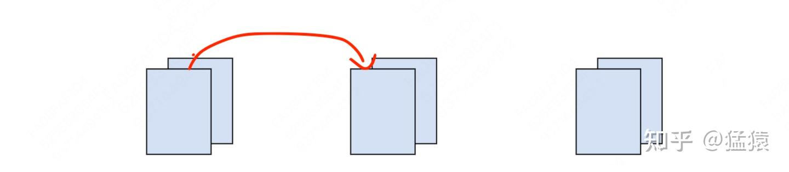

不难发现，从原始的视频数据来看，在T方向上，从第1个视频帧group到第2个视频帧group间，会经过2个token（注意，这里的token不是送给qwenvl decoder部分的token，你可以理解成是原始视频帧里的一个14\*14的patch），从这个意义上来说，`tokens_per_second`似乎就是`temporal_patch_size`的有意思。但是考虑到它本身也是一个人为可配置的参数，他可能表示”人觉得在1s的范围内，在T维度上应该要经过多少个tokens”才合理，所以默认情况下它才和`temporal_patch_size`取值一致（这里是我个人的解读，不确定理解地对不对）。  
  
  
好，基于这些理解，则现在`second_per_grid_t * tokens_per_second`这个乘积，就表示基于视频帧的绝对时间间隔（单位s），去修复它在T方向上理论上每秒应该走过的tokens数，所以这个乘积最终就是T维度上的position\_id，用来替换原来的默认值1。举个例子：  

-   假设原始T方向上的position\_id分别是\[0,1,2\]（因为默认间隔是1）
-   现在`second_per_grid_t * tokens_per_second` = 50（比原来的默认值1大得多了，说明相邻2个视频帧group间间隔时间很长，很有可能是最原始的视频非常长，但你设定的抽帧数量比较少，导致相邻2帧间相距的时间太远，而50比1更能反应这种“远”）
-   那么position\_id = \[0,1,2\]\*50 = \[0, 50, 100\]

  

### 6.2 3D mrope

现在来看，假设我们已经知道一个token的position\_id是（t, h, w），那么它的rope矩阵应该是怎么样的？**其实这里和5.2节非常相似**，**我们假设head\_dim = 128，那么我们可以从配置文件中决定，这128维里分别有多少用来做t，h，w维度的rope**。在默认配置中，我们设:  

-   **T = 16 \* 2 = 32，即32维负责做T位置的旋转**
-   **H = 24 \* 2 = 48，即48维负责做H位置的旋转**
-   **W= 24 \* 2 = 48，即48维负责做W位置的旋转**
-   我觉得这里在配置时，我们应该尽量保证H和W所用的维度数是一致的。

  
  
**那么对于某个token，它的旋转矩阵可以写成：**

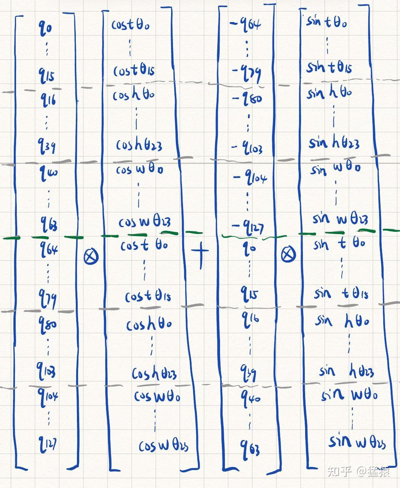

嗨，又是我的丑字