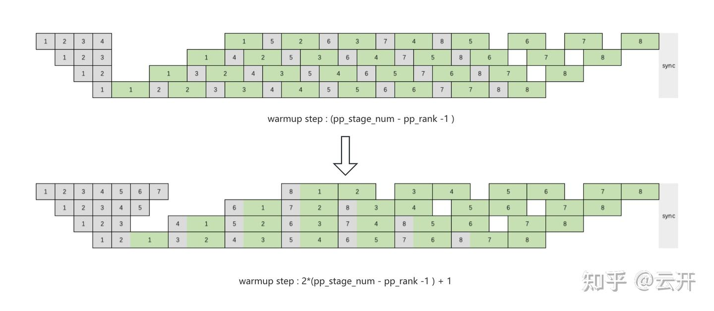
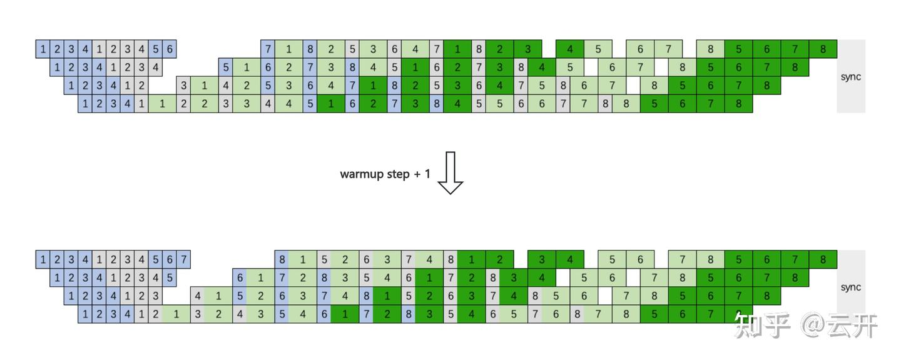
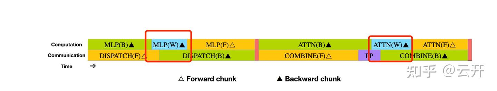

# 简装版 deepseek dualpipe: 基于 interleaved 1f1b 的 moe 通信计算 overlap

**Author:** 云开

**Date:** 2025-06-25

**Link:** https://zhuanlan.zhihu.com/p/25995403567

​

目录

收起

基于 interleaved 1f1b 的 moe 通信计算overlap

背景

moe ep alltoall 通信与计算 overlap 相关工作

1, micro batch 内 overlap

2, micro batch 间 overlap

基于 1f1b 的 moe 通信计算overlap

1f1b

interleaved 1f1b

1f1b overlapped schedule

总结

一点抛砖引玉的思考

[朱然：小红书大模型AI Infra团队介绍&招聘信息127 赞同 · 23 评论](https://zhuanlan.zhihu.com/p/29101694086) 文章

## 基于 interleaved 1f1b 的 moe 通信计算overlap

### 背景

在 MoE 模型的训练过程中，EP rank 之间的 A2A 通信在端到端时间中占据了相当大比重，对训练效率影响很大，特别是对于 Fine-grained MoE model，EP size 会比较大，跨机通信基本无法避免。那么要如何减少 EP A2A 对整体训练效率的影响呢？

_首先是尽可能提升 EP A2A 通信本身的效率。[DeepSeek](https://zhida.zhihu.com/search?content_id=254221370&content_type=Article&match_order=1&q=DeepSeek&zhida_source=entity) 开源的 [DeepEP 通信库](https://zhida.zhihu.com/search?content_id=254221370&content_type=Article&match_order=1&q=DeepEP+%E9%80%9A%E4%BF%A1%E5%BA%93&zhida_source=entity)通过将通信拆分为机内通信和机间通信，并将二者进行 overlap， 实现了很高的通信效率。这一工作已经集成到 [NVIDIA Megatron-LM](https://zhida.zhihu.com/search?content_id=254221370&content_type=Article&match_order=1&q=NVIDIA+Megatron-LM&zhida_source=entity) 中；_

其次是让 EP A2A通信尽可能和计算 overlap，用计算来掩盖通信的时间。本文从这个主题出发，介绍我们如何基于 1F1B 的流水线机制来实现 EP A2A 与计算的 overlap。

### moe ep alltoall 通信与计算 overlap 相关工作

关于 EP A2A 通信与计算 overlap，我们注意到目前有以下这些工作（不完全统计）：

### 1, micro batch 内 overlap

-   EP A2A 和 expert mlp overlap (minimax-01 方案、faster moe 方案、 tutel 方案)；
-   将 Attention + MLP 整体分成多个 block，block 间的 EP A2A 和计算overlap （AMPipe）。

### 2, micro batch 间 overlap

-   DeepSeek V3 论文提出了一种新的流水线并行算法：[DualPipe](https://zhida.zhihu.com/search?content_id=254221370&content_type=Article&match_order=1&q=DualPipe&zhida_source=entity)。实现了在两个 micro batch forward 和 backward 之间的 EP A2A 通信与计算 overlap。

以上方案有各自的不足之处：

-   _EP A2A 和 expert mlp overlap： 其效果比较好的前提是计算时间要大于通信时间，但对于跨机 A2A 的情况，A2A 的通信可能会大于 expert mlp 计算时间，DeepSeek V3 论文中提到训练过程中 EP A2A 的整体耗时占比大约是 50%，此时这一方案的 overlap 效果就大打折扣了；_
-   Attention + MLP 整体分成多个 block 方案： 需要分块 attention, 支持起来比较麻烦， 而且分了 block 可能会降低计算效率， 另外这个方案可能和其他分布式并行策略有冲突，比如 CP；
-   DeepSeek DualPipe： 毋庸置疑是很优秀的工作，但是调度逻辑比较复杂， 难以理解与 debug，另外需要对现有的分布式训练框架（如 Megatron-LM）进行大范围的重构才能接入；

### 基于 1f1b 的 moe 通信计算overlap

我们分析认为，Deepseek DualPipe 调度**核心亮点是实现了batch 之间 EP A2A 通信和 attention 、mlp 计算 overlap 的精细化调度, 从而使得跨机 ep 成为可行的分布式策略**。 Dualpipe 本身起到的主要作用是创造了 overlap 的机会， 从这个角度而言，基于1F1B 的调度也能做到 batch 之间 forward 和 backward 之间的 EP A2A 通信与计算的 overlap。

### 1f1b

可以很自然地想到，通过调整 1F1B 调度来实现 1F1B 调度中稳态阶段 f 和 b 的 EP A2A 通信与计算 overlap。 原始的 1F1B 调度，最后一个 pp stage 稳态阶段的 f 和 b 之间存在数据依赖，无法实现 f 和 b 之间的 EP A2A 通信与计算 overlap。 为了解决这个问题， 我们可以把最后一个 pp stage 的 warmup step 加 1。同时，考虑到 pp stage 间前反向的数据依赖，其他 pp stage 也需要调整 warmup step。

我们得到了一个 1F1B 通信计算 overlap 的初步方案，但是这个方案有很大的缺陷: 因为 pipeline parallel rank 之间存在数据依赖，warmup step 过大，activation 显存占用过大。

### interleaved 1f1b

我们转向考虑 interleaved 1F1B ， 沿用上面调整 warmup step 的逻辑，惊喜地发现，通过将稳态的 1F1B stage 中第一个 micro batch 的 fprop 提前到 warmup stage，即 warmup step + 1, 就可以在 interleaved 1F1B 实现 1F1B 稳态阶段不同 micro batch 前反向之间的 EP A2A 与计算的 overlap。 相比于原始的 interleaved 1F1B ， 我们的这个方案虽然在 warmup stage 增加了一个 micro batch 的前向计算，但是 1F1B 阶段的调度是前反向细粒度地交叠调度，F 在增加 activation 显存的同时，B 会释放 activation 显存，使得峰值显存基本没有变化；Bubble rate 和原始的 interleaved 1F1B 完全一致。

因此我们最终选择使用 interleaved 1F1B with A2A overlap 方案。

### 1f1b overlapped schedule

我们采用了类似 DualPipe 的方案， 拆分了 dw。我们认为这是很有必要的。如果计算与通信 1:1, 那就意味着前向的计算比通信少， 反向的计算比通信多，前向的计算不足以 overlap 反向的通信, 需要用 dw 来 overlap 部分反向通信。 （dw 拆分这个工作在我们的 poc 里并没有实现， 涉及到[Transformer Engine](https://zhida.zhihu.com/search?content_id=254221370&content_type=Article&match_order=1&q=Transformer+Engine&zhida_source=entity)的代码改动, 后续会由 nv 的同学来支持)。

(原始图片来自 deepseek v3 technical report)

### 总结

我们提出了基于 interleaved 1f1b 的 moe ep a2a 通信与计算 overlap 的方案，并给出了 poc 实现，验证了效果。我们的方案已被 megatron 采纳，正在被整合进 megatron 主分支。 更详细的技术细节，可以参考我们和 nv 共同发的[技术博客](https://link.zhihu.com/?target=https%3A//mp.weixin.qq.com/s%3F__biz%3DMzU2NzkyMzUxMw%3D%3D%26mid%3D2247550702%26idx%3D2%26sn%3D9f6bb8ea72475aa833bfd73718f03530%26chksm%3Dfdb928e884341e81762eeaffbc3d00a3023e4543001b5448f259977b8bf0e4603448db75360e%26mpshare%3D1%26scene%3D1%26srcid%3D0306blxvLHplbcAOqnznmXiQ%26sharer_shareinfo%3D962faa39bc50b5544c96cf846186f076%26sharer_shareinfo_first%3D962faa39bc50b5544c96cf846186f076%26version%3D4.1.20.70286%26platform%3Dmac%23rd)、[知乎](https://zhuanlan.zhihu.com/p/28463368206)以及我们提供的 [poc 实现](https://link.zhihu.com/?target=https%3A//github.com/lhb8125/Megatron-LM/pull/6)。

### 一点抛砖引玉的思考

1f1b 通信计算 overlap 提供了一个比较 general 的思路， TP 和 ulysess CP 通信也可以通过类似的方案被计算 overlap 掉。

  

  

欢迎加入我们： [朱然：小红书大模型AI Infra团队介绍&招聘信息](https://zhuanlan.zhihu.com/p/29101694086)