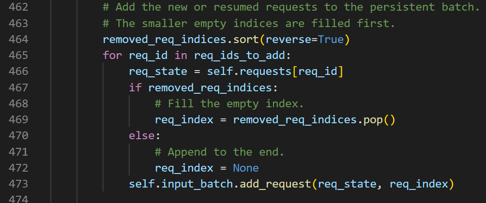
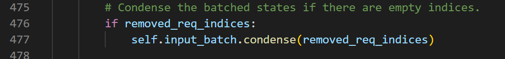
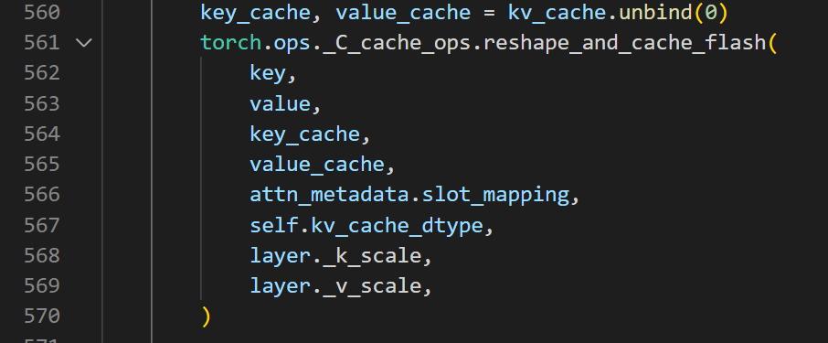
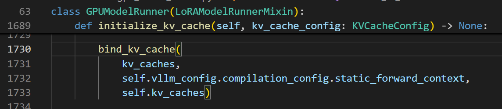

# vllm中的几种存储数据类型

**Author:** running

**Date:** 2025-06-27

**Link:** https://zhuanlan.zhihu.com/p/1921593312512571054

vllm\\v1\\worker\\[gpu\_input\_batch.py](https://zhida.zhihu.com/search?content_id=259585853&content_type=Article&match_order=1&q=gpu_input_batch.py&zhida_source=entity)

vllm\\v1\\worker\\gpu\_model\_runner.py

vllm\\v1\\core\\sched\\[scheduler.py](https://link.zhihu.com/?target=http%3A//scheduler.py/)

vllm\\v1\\[request.py](https://link.zhihu.com/?target=http%3A//request.py/)

  

批处理中有几种数据类型：

1）request，逻辑状态（request文件中的，scheduler层面），记录某个请求的信息。

2) [CachedRequestData](https://zhida.zhihu.com/search?content_id=259585853&content_type=Article&match_order=1&q=CachedRequestData&zhida_source=entity)（request文件中的，scheduler层面），正在运行的req的数据，

3）[NewRequestData](https://zhida.zhihu.com/search?content_id=259585853&content_type=Article&match_order=1&q=NewRequestData&zhida_source=entity)（request文件中的，scheduler层面），新增req的数据

4）[CachedRequestState](https://zhida.zhihu.com/search?content_id=259585853&content_type=Article&match_order=1&q=CachedRequestState&zhida_source=entity)（存在于Inpubatch类中，用于监管一个GPU的modelrunner上的batch运行状况），在modelrunning中运行的req的状态，也就是在GPU上运行的实体batch中的状态。和上面的不同是此条目会根据CachedRequestData和NewRequestData更新（增删改）

  

1.批处理的逻辑位置vllm\\v1\\worker\\gpu\_model\_runner.py

对于完成的请求和新请求之间的衔接是：



我发现这里有一个整理机制，因为推理过程中一个batch中可能有一些中间的seq已经完成且没有添加新的req，那么就把所有的这些都整理到batch队尾，然后整体删除：



vllm\\v1\\worker\\gpu\_input\_batch.py

```python
def condense(self, empty_req_indices: list[int]) -> None:
    "已有代码"
    del self._req_ids[self.num_reqs:]
    del self.req_output_token_ids[self.num_reqs:]
```

此处已经后续有联系的关键数据结构：

```python
# 全局KV Cache (所有请求共享)
self.kv_caches[layer_id].shape = (2, num_blocks, block_size, num_kv_heads, head_size)

# 每个请求的元数据
class Request:
    block_table: List[int]     # 该请求使用的block IDs
    seq_len: int              # 该请求的历史token数量
    
# Attention元数据 (批量处理时)
class FlashAttentionMetadata:
    block_tables: Tensor      # 所有请求的block tables拼接
    seq_lens: Tensor         # 所有请求的历史长度
    cu_seqlens_q: Tensor     # 累积序列长度，用于区分请求边界
```

  

  

在讲下一个attention计算tokens之前，要说明一个问题：vllm中整个一个batch中的请求，其中每个请求的tokens在逻辑上是连续的，但是实际上这些tokens会分布在不同的block中。通过block\_table来跟踪每个请求使用的block。例如：

```python
# 每个请求都有自己的block_table
block_tables = {
    request_1: [0, 1, 2, 3],      # Request 1使用的block IDs
    request_2: [4, 5],            # Request 2使用的block IDs  
    request_3: [6, 7, 8],         # Request 3使用的block IDs
    # ...
    request_100: [995, 996, 997]  # Request 100使用的block IDs
}
```

在进行预测之前会准备数据：

```python
# 在gpu_model_runner.py中
def _prepare_flash_attn_metadata():
    # 为每个请求构建block_table
    block_tables = []
    for req in requests:
        block_tables.append(req.block_table)  # [0,1,2,3] for req1
    
    # 计算每个请求的历史长度
    seq_lens = []
    for req in requests:
        seq_lens.append(req.get_len())  # req1: 64, req2: 32, req3: 48...

# 在flash_attn.py的forward方法中使用block Table访问KV cache
def forward(self, query, key, value, kv_cache, attn_metadata):
    # kv_cache: (2, 1000, 16, 32, 128) - 所有requests共享
    # attn_metadata包含：
    # - block_tables: 每个request的block列表
    # - seq_lens: 每个request的历史长度
    
    # FlashAttention kernel会：
    # 1. 根据block_tables[req_i]找到request i的blocks
    # 2. 根据seq_lens[req_i]知道要attend多少个历史token
    # 3. 从对应blocks中读取KV值进行attention计算
```

  

2.attention计算部分

核心的实现在vllm\\v1\\attention\\backends\\flash\_attn.py中

此方法会在prefill阶段和decoder阶段进行复用。



标注：

```python
flash_attn_varlen_func(
    q=query[:num_actual_tokens],        # 所有请求的所有token concatenated
    k=key_cache,                        # 更新历史KV cache
    v=value_cache,
    out=output[:num_actual_tokens],
    cu_seqlens_q=cu_seqlens_q,         # 关键！告诉FlashAttention每个请求的边界
    max_seqlen_q=max_seqlen_q,
    seqused_k=seqused_k,               # 关键！每个请求要使用的历史KV长度
    max_seqlen_k=max_seqlen_k,
    causal=True,                       # 因果掩码
    # ...
)

# query tensor: [9, num_heads, head_size]
# 索引:  0     1      2     3    4   5    6     7      8
query = ["Hello","world","how","are","I","am","fine","Thank","you"]

# cu_seqlens_q（累积序列长度）:
cu_seqlens_q = [0, 4, 7, 9]  # 每个请求的结束位置
#               ^  ^  ^  ^
#               |  |  |  +-- 请求C结束
#               |  |  +----- 请求B结束  
#               |  +-------- 请求A结束
#               +----------- 开始位置

# seqused_k（每个请求在KV cache中的有效长度）:
seqused_k = [4, 3, 2]  # 请求A有4个token，请求B有3个，请求C有2个
```

大概的数据流：

```python
# === 输入数据 ===
# 3个请求的token
requests = {
    "req_A": ["Hello", "world", "how"],      # 3个token，prefill
    "req_B": ["I", "am"],                    # 2个token，prefill  
    "req_C": ["fine"]                        # 1个token，decode
}

# === 拼接后的数据 ===
# 所有token按顺序拼接
concatenated_tokens = ["Hello", "world", "how", "I", "am", "fine"]
query_tensor = tensor([6, num_heads, head_size])  # 6个token

# === 元数据 ===
cu_seqlens_q = [0, 3, 5, 6]  # 累积长度：[开始, req_A结束, req_B结束, req_C结束]
seqused_k = [3, 2, 1]        # 每个请求的KV cache长度

# === Slot Mapping ===
# 每个token在KV cache中的物理位置
slot_mapping = [
    0,    # "Hello" -> block_0, offset_0
    1,    # "world" -> block_0, offset_1
    2,    # "how"   -> block_0, offset_2
    48,   # "I"     -> block_3, offset_0  (3*16 + 0)
    49,   # "am"    -> block_3, offset_1
    80,   # "fine"  -> block_5, offset_0  (5*16 + 0)
]

# === Block Table ===
block_table = [
    [0, -1, -1],   # 请求A使用block 0
    [3, -1, -1],   # 请求B使用block 3
    [5, -1, -1],   # 请求C使用block 5
]
```

attention计算时可能的伪代码：

```python
# FlashAttention内部逻辑（简化版）
for req_idx in range(num_requests):
    # 获取当前请求的query（只有新token）
    q_start = cu_seqlens_q[req_idx]
    q_end = cu_seqlens_q[req_idx + 1]  
    current_q = query[q_start:q_end]     # 当前新token的query
    
    # 获取该请求的所有历史KV（包括刚写入的新KV）
    kv_len = seqused_k[req_idx]          # 要使用的总KV长度
    req_blocks = block_table[req_idx]    # 该请求使用的block
    
    # 从KV cache中取出该请求的所有历史KV
    all_keys = key_cache[req_blocks][:kv_len]      # 所有历史key + 新key
    all_values = value_cache[req_blocks][:kv_len]  # 所有历史value + 新value
    
    # 计算attention：新query attend to 所有历史KV
    attention_output[q_start:q_end] = compute_attention(
        current_q,        # 新token的query
        all_keys,         # 该请求的所有历史key（包括新写入的）
        all_values        # 该请求的所有历史value（包括新写入的）
    )
```

3.kv\_cache的存储

存储kv\_cache的列表定义在：

```python
## 在GPUModelRunner初始化时创建空列表：代码位置: d:\project\vllm\vllm\v1\worker\gpu_model_runner.py中的init()方法
self.kv_caches: list[torch.Tensor] = []
```

随后，会在initialize\_kv\_cache（）方法中创建每个对叠层的kv\_cache字典。需要对每个对叠层进行遍历，确定需要存储在kv\_cache中的数据格式。

```python
# 代码位置: d:\project\vllm\vllm\v1\worker\gpu_model_runner.py:1701
kv_caches: dict[str, torch.Tensor] = {}

for kv_cache_group in kv_cache_config.kv_cache_groups:
    kv_cache_spec = kv_cache_group.kv_cache_spec
    for layer_name in kv_cache_group.layer_names:
        # ...计算num_blocks和kv_cache_shape...
        
        # 代码位置: d:\project\vllm\vllm\v1\worker\gpu_model_runner.py:1722-1724
        kv_caches[layer_name] = torch.zeros(kv_cache_shape,
                                           dtype=dtype,
                                           device=self.device)
```

通过函数bind\_kv\_cache（）进行转化，在kv\_cache中根据便利结果开辟相关的存储空间：



转化的核心代码：

```python
# 代码位置: d:\project\vllm\vllm\v1\utils.py:173-184
def bind_kv_cache(kv_caches, forward_context, runner_kv_caches):
    # 1. 确保runner_kv_caches列表为空
    assert len(runner_kv_caches) == 0
    
    # 2. 按层索引分组layer names
    index2name = defaultdict(list)
    for layer_name in kv_caches:
        # 使用extract_layer_index提取层索引
        # 代码位置: d:\project\vllm\vllm\model_executor\models\utils.py:677-695
        index2name[extract_layer_index(layer_name)].append(layer_name)
    
    # 3. 按层索引排序，将字典转换为列表
    for layer_index in sorted(index2name.keys()):
        layer_name = index2name[layer_index][0]
        runner_kv_caches.append(kv_caches[layer_name])
    
    # 4. 同时绑定到forward_context中的每个Attention层
    for layer_name, kv_cache in kv_caches.items():
        forward_context[layer_name].kv_cache = [kv_cache]
```