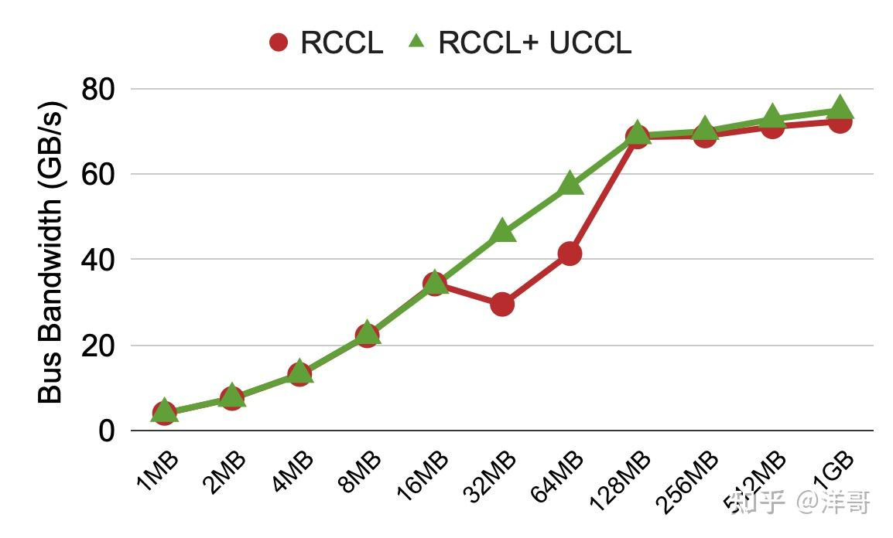

# NCCL性能调优指南：当你的GPU集群跑得比蜗牛还慢时该怎么办？

**Author:** 洋哥

**Date:** 2025-07-01

**Link:** https://zhuanlan.zhihu.com/p/1923338497181357031

NCCL调试之痛：一场与性能问题的斗智斗勇（以及UCCL如何化身救世主）

作者：[UCCL](https://link.zhihu.com/?target=https%3A//github.com/uccl-project/uccl)团队 —— 2025年6月30日

NCCL就像是现代分布式机器学习工作负载里的"交际花"，负责把几十到几千个GPU连接起来搞集合通信。但要是哪个GPU或者网卡稍微"闹脾气"，整个通信就会慢得像蜗牛一样，让你的训练任务永远看不到尽头。

在公有云GPU上让NCCL跑得欢实可不容易，主要因为两个原因：1) NCCL的环境变量多得能让人眼花缭乱（[官方文档](https://link.zhihu.com/?target=https%3A//docs.nvidia.com/deeplearning/nccl/user-guide/docs/env.html%23system-configuration)里就有78个！）-- 还有些变量藏在代码里根本不给看；2) RDMA这些网络层时不时就给你来个性能"惊喜"，而我们用户能做的调整少得可怜。

## 一次NCCL调试历险记

几周前，我们从某大型公有云厂商那里搞到了6台[HGX虚拟机](https://zhida.zhihu.com/search?content_id=259765615&content_type=Article&match_order=1&q=HGX%E8%99%9A%E6%8B%9F%E6%9C%BA&zhida_source=entity)。每台机器有8个H100 GPU和8个400Gbps的[Nvidia CX-7网卡](https://zhida.zhihu.com/search?content_id=259765615&content_type=Article&match_order=1&q=Nvidia+CX-7%E7%BD%91%E5%8D%A1&zhida_source=entity)，这些机器分布在两层RoCE网络的两个机架上。我们安装了NCCL v2.23.4，用NCCL-tests (9d26b84)在这些机器上跑all-reduce测试。结果第一次尝试的性能低得让人怀疑人生——远低于[别人](https://link.zhihu.com/?target=https%3A//semianalysis.com/2024/12/22/mi300x-vs-h100-vs-h200-benchmark-part-1-training/%23multi-node-rcclnccl-collectives-and-scale-out-network-benchmarks)测得的360GB/s总线带宽(busbw)。经验告诉我们，这很可能是跨节点网络的问题，毕竟单节点内的NVLink表现还是很给力的。

我们决定专注解决跨节点网络问题，设置了两个环境变量：`NCCL_P2P_DISABLE=1`和`NCCL_SHM_DISABLE=1`。这相当于告诉NCCL："别整那些花里胡哨的本地通信了，专心搞好跨节点网络吧！"结果发现all-reduce只能跑到网卡带宽的一半左右，约23GB/s（网卡理论带宽是50GB/s）。

我们猜测："是不是网卡有两个端口，但NCCL只用了一个？"于是我们尝试增加RDMA QP数量，让两个端口都能被充分利用。设置了`NCCL_IB_QPS_PER_CONNECTION=4`（还有个隐藏变量`NCCL_NCHANNELS_PER_NET_PEER`效果类似）。这下NCCL终于突破了25GB/s，但离理论的50GB/s还差得远。

接下来我们怀疑是NCCL需要的SM数量不够，于是调整通道数：`NCCL_MAX_NCHANNELS=8`，`NCCL_MIN_NCHANNELS=8`。本以为这下能冲上50GB/s了，结果NCCL性能卡在39GB/s不动了。更糟的是，在大消息尺寸（如128MB）时性能还会断崖式下跌。

最后我们恍然大悟：这可能是典型数据中心[Fattree](https://link.zhihu.com/?target=http%3A//ccr.sigcomm.org/online/files/p63-alfares.pdf)拓扑中的RoCE网络拥塞问题。当多个网络流从机架交换机涌向上层交换机时，可能会挤在同一个端口上造成拥塞。想想看，每个流都能达到400Gbps，而交换机端口也只有400Gbps，这不堵车才怪呢！在公有云环境下，我们对网卡和交换机设置又毫无控制权，这可咋整？

RoCE网络就像早高峰的地铁1号线，每个RDMA流都是固执的上班族——认准一条路线就绝不换乘。当两个&quot;死心眼&quot;的数据流非要挤同一个交换机端口时...恭喜你，获得了&quot;网络版人贴人&quot;体验卡一张！

终极解决方案是——请出我们的UCCL神器！只需设置一个环境变量：`NCCL_NET_PLUGIN=libnccl-net-uccl.so`。UCCL的绝活是：它能以拥塞感知的方式利用数百条网络路径，巧妙避开网络拥堵，轻松达到50GB/s的网卡极限带宽。更妙的是，UCCL完全透明，既不用改应用代码，也不用动NCCL代码。

最终，UCCL不仅消除了大消息时的性能下跌，还进一步提升了最大吞吐量。

跨6台机器的all-reduce性能，每台机器有8个H100 GPU和8个400G Nvidia网卡，分布在两个机架上。注意这个测试只用了8个GPU SM，并且关闭了NVLS

## 调参大师速成手册

根据UCCL团队的实战经验，我们整理了一份NCCL性能调优"秘籍"：

1.  **网络性能诊断**：`NCCL_P2P_DISABLE=1`, `NCCL_SHM_DISABLE=1`
2.  **QP数量调优**：`NCCL_IB_QPS_PER_CONNECTION`, `NCCL_NCHANNELS_PER_NET_PEER`
3.  **通道数调优**：`NCCL_MAX_NCHANNELS`, `NCCL_MIN_NCHANNELS`
4.  **传输缓冲区和块大小**：`NCCL_P2P_NET_CHUNKSIZE=524288`, `NCCL_BUFFSIZE=8388608`（对AWS EFA RDMA网卡特别有用）
5.  **PCIe宽松排序**：`NCCL_IB_PCI_RELAXED_ORDERING`（对GPU虚拟机比裸机更有用）
6.  **终极武器UCCL插件**：`NCCL_NET_PLUGIN=libnccl-net-uccl.so`

## AMD GPU上的调试奇遇

上周我们在一个AMD MI300X GPU + Broadcom 400G网卡的生产集群（没有root权限）上也观察到了类似的性能问题：[RCCL](https://zhida.zhihu.com/search?content_id=259765615&content_type=Article&match_order=1&q=RCCL&zhida_source=entity)（AMD的集合通信库）在大消息时性能暴跌。祭出UCCL插件后，性能立刻满血复活！

跨2台机器的all-to-all性能，每台机器有4个AMD MI300X GPU和4个400G Broadcom网卡

## 结语

调试NCCL/RCCL性能就像在迷宫里找出口——复杂的配置参数和不可控的公有云网络环境让人头大。不过别担心，UCCL团队随时准备伸出援手！我们提供免费的NCCL/RCCL性能问题咨询服务，还有UCCL插件帮你轻松解决网络拥塞问题。

UCCL已在GitHub开源：[uccl-project/uccl](https://link.zhihu.com/?target=https%3A//github.com/uccl-project/uccl)，开发团队很多来自UC Berkeley Sky Computing Lab（就是那个创造了Spark、Ray和vLLM的神奇实验室）还有清华大学网络实验室。我们热忱欢迎开源开发者加入UCCL项目，一起搞事情！

这是我第一次使用DeepSeek翻译我写的英文blog ([https://uccl-project.github.io/posts/debug-nccl/](https://link.zhihu.com/?target=https%3A//uccl-project.github.io/posts/debug-nccl/))，prompt里主要要求他翻译的诙谐有趣，感觉写出来的还挺有惊喜。So what's the next：是时候让DeepEP在AMD GPU + Broadcom NIC上跑起来serve DeepSeek model了! Stay tuned!