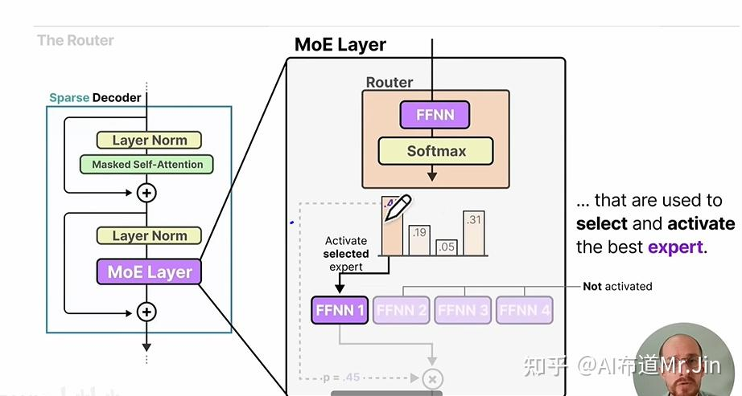

# DeepSeek模型MOE结构代码详解

**Author:** AI布道Mr.Jin

**Date:** 2025-07-10

**Link:** https://zhuanlan.zhihu.com/p/1896490149577200132

其实在[DeepSeek](https://zhida.zhihu.com/search?content_id=256556603&content_type=Article&match_order=1&q=DeepSeek&zhida_source=entity)\-R1爆火之前，DeepSeek V2在我们行业就已经妇孺皆知了，它独特的[MOE结构](https://zhida.zhihu.com/search?content_id=256556603&content_type=Article&match_order=1&q=MOE%E7%BB%93%E6%9E%84&zhida_source=entity)值得研究一下。这篇文章是基于

[@ZOMI酱](//www.zhihu.com/people/2d773e9a6d7e77c80963c080f19a1607) 的2个视频写的，这2个视频讲的很好，建议大家都学习一下：《MOE终于迎来可视化解读！傻瓜都能看懂MoE核心原理！》和《使用昇腾NPU手撕MoE单机版代码！没想到如此简单！》。

这篇文章是把我自己的理解梳理一下，加强自己的理解和记忆。

## MOE结构概述

我们可以从zomi酱视频里面的这张图开始：



MOE是mixture of experts 的缩写，简单来说，就是把传统[transformer](https://zhida.zhihu.com/search?content_id=256556603&content_type=Article&match_order=1&q=transformer&zhida_source=entity)结构中decoder层里面的单个线性层替换层多个并列的线性层。在这些线性层前面还有一个[Router](https://zhida.zhihu.com/search?content_id=256556603&content_type=Article&match_order=1&q=Router&zhida_source=entity)，Router会选择并列线性层里面的一部分进行计算。这样的话，既能让模型学习更多的知识（多个“专家”），又能减少推理计算量（选择部分“专家”进行计算）。

## MOE计算代码

接下来我们参考zomi酱提供的代码来详细看一下MOE的计算过程是怎样的：

```python3
import torch
import torch.nn as nn
import torch.nn.functional as F
import torch_npu
from torch_npu.contrib import transfer_to_npu

class Expert(nn.Module):
    def __init__(self, input_dim, hidden_dim, output_dim):
        super().__init__()
        self.net = nn.Sequential(
            nn.Linear(input_dim, hidden_dim),
            nn.GELU(),
            nn.Linear(hidden_dim, output_dim))
        
    def forward(self, x):
        return self.net(x)

class MoE(nn.Module):
    def __init__(self, input_dim, num_experts, top_k, expert_capacity, hidden_dim, output_dim):
        super().__init__()
        self.num_experts = num_experts
        self.top_k = top_k
        self.expert_capacity = expert_capacity
        
        # 路由网络
        self.gate = nn.Linear(input_dim, num_experts)
        
        # 专家集合
        self.experts = nn.ModuleList(
            [Expert(input_dim, hidden_dim, output_dim) for _ in range(num_experts)])
        
    def forward(self, x):
        batch_size, input_dim = x.shape
        device = x.device
        
        # 路由计算
        logits = self.gate(x)
        probs = torch.softmax(logits, dim=-1)
        print("probs: ", probs)
        topk_probs, topk_indices = torch.topk(probs, self.top_k, dim=-1)
        print("topk_probs: ", topk_probs)
        print("topk_indices: ", topk_indices)
        # 辅助损失计算
        if self.training:
            # 重要性损失（专家利用率均衡）
            importance = probs.sum(0)
            importance_loss = torch.var(importance) / (self.num_experts ** 2)
            
            # 负载均衡损失（样本分配均衡）
            mask = torch.zeros_like(probs, dtype=torch.bool)
            mask.scatter_(1, topk_indices, True)
            routing_probs = probs * mask
            expert_usage = mask.float().mean(0)
            routing_weights = routing_probs.mean(0)
            load_balance_loss = self.num_experts * (expert_usage * routing_weights).sum()
            
            aux_loss = importance_loss + load_balance_loss
        else:
            aux_loss = 0.0

        # 专家分配逻辑
        flat_indices = topk_indices.view(-1)
        flat_probs = topk_probs.view(-1)
        sample_indices = torch.arange(batch_size, device=device)[:, None]\
                            .expand(-1, self.top_k).flatten()
        print("sample_indices: ", sample_indices)

        # 初始化输出
        outputs = torch.zeros(batch_size, self.experts[0].net[-1].out_features, 
                            device=device)

        # 处理每个专家
        for expert_idx in range(self.num_experts):
            print("expert_idx: ", expert_idx)
            # 获取分配给当前专家的样本
            expert_mask = flat_indices == expert_idx
            print("expert_mask: ", expert_mask)
            expert_samples = sample_indices[expert_mask]
            print("expert_samples: ", expert_samples)
            expert_weights = flat_probs[expert_mask]
            print("expert_weights: ", expert_weights)

            # 容量控制
            if len(expert_samples) > self.expert_capacity:
                expert_samples = expert_samples[:self.expert_capacity]
                expert_weights = expert_weights[:self.expert_capacity]

            if len(expert_samples) == 0:
                continue

            # 处理专家计算
            expert_input = x[expert_samples]
            print("expert_input: ", expert_input)
            expert_output = self.experts[expert_idx](expert_input)
            weighted_output = expert_output * expert_weights.unsqueeze(-1)
            
            # 累加输出
            outputs.index_add_(0, expert_samples, weighted_output)

        return outputs, aux_loss

# 测试示例
if __name__ == "__main__":
    input_dim = 5
    output_dim = 10
    num_experts = 8
    top_k = 3
    expert_capacity = 32
    hidden_dim = 512
    batch_size = 10

    # add
    device = torch.device("npu:4" if torch.npu.is_available() else "cpu")
    moe = MoE(input_dim, num_experts, top_k, expert_capacity, hidden_dim, output_dim).to(device)
    x = torch.randn(batch_size, input_dim).to(device)
    moe.eval()
    output, _ = moe(x)
    print(f"Eval output shape: {output.shape}") # torch.Size([64, 256])
```

### 初始化函数定义

首先，定义了Expert类，也就是“专家”，可以看到，专家是由线性层和激活函数构成的简单模型。

然后开始定义MOE类。在初始化函数中，定义了这样几个变量：

self.num\_experts：专家的数量，也就是上面提到的“并列线性层”的个数，训练后的每个专家的权重都是不同的，代表它们所掌握的“知识”是不同的。

self.top\_k：每个输入token激活的专家数量。

self.expert\_capacity：代表计算每组token时，每个专家能被选择的最多次数。

self.gate：路由网络，一般是一个线性层，用来计算每个专家被选择的概率。

self.experts：实例化Expert类，生成多个专家。

### 前向计算逻辑

接下来看一下forward函数。为了方便大家理解，我们把上面代码的执行打印结果也一起附上。

首先是输入x，shape是（batch\_size, input\_dim），batch\_size我们可以看作是token的数量，也就是序列长度。然后通过self.gate和softmax计算每个token在每个专家上的激活概率：

```text
logits = self.gate(x)
probs = torch.softmax(logits, dim=-1)
```

probs的打印结果如下：我们设置的batch\_size是10，num\_experts是8，所以probs是个10行8列的矩阵。

```text
probs:  tensor([[0.1710, 0.1348, 0.0746, 0.1714, 0.0594, 0.2695, 0.0251, 0.0940],
        [0.1556, 0.0776, 0.1658, 0.1489, 0.1152, 0.1679, 0.0565, 0.1124],
        [0.1077, 0.1154, 0.1564, 0.1317, 0.0630, 0.2026, 0.0518, 0.1715],
        [0.0681, 0.0680, 0.1236, 0.1030, 0.1707, 0.2827, 0.0627, 0.1211],
        [0.0453, 0.0648, 0.2313, 0.0781, 0.1026, 0.1304, 0.1326, 0.2149],
        [0.1394, 0.2278, 0.0625, 0.1832, 0.0395, 0.1512, 0.0691, 0.1274],
        [0.1096, 0.1462, 0.1302, 0.1397, 0.0607, 0.1898, 0.0639, 0.1598],
        [0.1200, 0.1952, 0.0970, 0.1648, 0.0360, 0.1072, 0.1018, 0.1779],
        [0.0650, 0.0501, 0.1463, 0.1025, 0.2219, 0.1446, 0.1439, 0.1257],
        [0.0641, 0.0813, 0.0579, 0.1348, 0.1170, 0.0631, 0.3554, 0.1264]],
       device='npu:4', grad_fn=<SoftmaxBackward0>)
```

接着，再用topk算子把每个token的激活专家选出来：

```text
topk_probs, topk_indices = torch.topk(probs, self.top_k, dim=-1)
```

topk\_probs和topk\_indices 的打印结果如下，因为我们设置的top\_k=3，所以每个token都把排名前三的概率选出来了，同时topk\_indices把这些概率对应的专家编号也选出来了，比如第0个token，激活了5号专家、3号专家、0号专家。

```text
topk_probs:  tensor([[0.2695, 0.1714, 0.1710],
        [0.1679, 0.1658, 0.1556],
        [0.2026, 0.1715, 0.1564],
        [0.2827, 0.1707, 0.1236],
        [0.2313, 0.2149, 0.1326],
        [0.2278, 0.1832, 0.1512],
        [0.1898, 0.1598, 0.1462],
        [0.1952, 0.1779, 0.1648],
        [0.2219, 0.1463, 0.1446],
        [0.3554, 0.1348, 0.1264]], device='npu:4', grad_fn=<TopkBackward0>)
topk_indices:  tensor([[5, 3, 0],
        [5, 2, 0],
        [5, 7, 2],
        [5, 4, 2],
        [2, 7, 6],
        [1, 3, 5],
        [5, 7, 1],
        [1, 7, 3],
        [4, 2, 5],
        [6, 3, 7]], device='npu:4')
```

self.training分支对应的是训练过程中计算损失函数的部分，我们后面再讲。

选择好专家后，就要开始计算了。计算规则是，对于每个token，假如它选择的专家是e1、e2、e3，概率分别是p1、p2、p3，那么这个token的计算结果就是p1\*e1\_out+p2\*e2\_out+p3\*e3\_out。

由于计算个体是每个专家，所以代码中用for循环遍历每个专家。我们以第0个专家为例，看看它的计算过程是怎样的。

首先需要确定0号专家的输入。由于不是每个token都选择了0号专家，所以不能把x直接作为输入，而是要确定一个下标向量idxes，把x\[idxes\]作为0号专家的输入，idxes的值就是激活了0号专家的所有token编号，那么怎么得到idxes呢？代码里面是这样做的：

首先计算一个mask：

```text
expert_mask = flat_indices == expert_idx
```

打印结果如下：

```text
expert_mask:  tensor([False, False,  True, False, False,  True, False, False, False, False,
        False, False, False, False, False, False, False, False, False, False,
        False, False, False, False, False, False, False, False, False, False],
       device='npu:4')
```

flat\_indices是topk\_indices平铺之后的向量。通过对比，可以看到expert\_mask中True的位置和topk\_indices中0的位置铺平之后是一致的，代表第0个专家被第0个token和第1个token激活了。

而且expert\_mask代表的含义是：只要它的第0-2的位置是True的话，就代表被第0个token激活了，只要它的第3-5的位置是True的话，就代表被第1个token激活了，以此类推，我们可以声明一个sample\_indices向量：

```text
sample_indices:  tensor([0, 0, 0, 1, 1, 1, 2, 2, 2, 3, 3, 3, 4, 4, 4, 5, 5, 5, 6, 6, 6, 7, 7, 7,
        8, 8, 8, 9, 9, 9], device='npu:4
```

再通过下面的代码就可以把idxes取出来了：

```text
expert_samples = sample_indices[expert_mask]
```

也顺便把概率权重取出来：

```text
expert_weights = flat_probs[expert_mask]
```

接着把输入取出来：

```text
expert_input = x[expert_samples]
```

打印结果如下：

```text
expert_samples:  tensor([0, 1], device='npu:4')
expert_weights:  tensor([0.1710, 0.1556], device='npu:4', grad_fn=<IndexBackward0>)
expert_input:  tensor([[-1.4382, -1.5939,  0.0802, -0.5614,  0.2586],
        [-1.2631,  1.0266,  0.1806, -0.7280, -0.6913]], device='npu:4')
```

再进行专家计算：

```text
expert_output = self.experts[expert_idx](expert_input)
weighted_output = expert_output * expert_weights.unsqueeze(-1)
```

最后还需要把计算结果叠加到对应的token上面去：

```text
outputs.index_add_(0, expert_samples, weighted_output)
```

完成上面的for循环之后，就把所有专家的计算任务完成了，通过index\_add\_的操作，把每个token的计算结果也汇总了。

### 损失函数

损失函数包含2部分：专家利用率均衡和样本分配均衡。

首先是专家利用率均衡，如果每个专家被选择的概率相近，那么说明分配越均衡，损失函数越小：

```text
importance = probs.sum(0)
importance_loss = torch.var(importance) / (self.num_experts ** 2)
```

然后是样本分配均衡，首先得到每个token、每个专家的分配概率矩阵：

```text
mask = torch.zeros_like(probs, dtype=torch.bool)
mask.scatter_(1, topk_indices, True)
routing_probs = probs * mask
```

然后按照token维度（样本维度）求平均，得到每个专家被分配的token平均数量和平均概率：

```text
expert_usage = mask.float().mean(0)
routing_weights = routing_probs.mean
```

两者相乘求和得到负载均衡损失：

```text
load_balance_loss = self.num_experts * (expert_usage * routing_weights).sum()
```

样本分配越均衡，这个损失函数越小。举个例子，10个专家，10个样本，如果所有样本都分到1个专家，那么损失函数值为10x1+0+0...+0=10，如果平均分给10个专家，那么损失函数值为1x0.1+1x0.1+...+1x0.1=1。