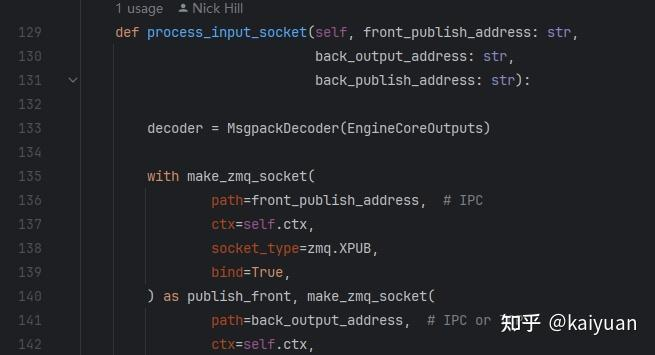
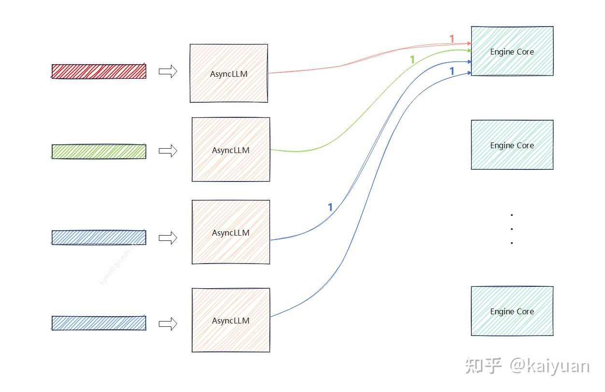

# LLM推理数据并行负载均衡(DPLB)浅析

**Author:** kaiyuan

**Date:** 2025-07-11

**Link:** https://zhuanlan.zhihu.com/p/1927317160889386326

​

目录

收起

负载均衡的场景

vLLM DPLB现状

方案讨论

基于请求数量的方案

基于资源控制的方案

在推理的[数据并行](https://zhida.zhihu.com/search?content_id=260249264&content_type=Article&match_order=1&q=%E6%95%B0%E6%8D%AE%E5%B9%B6%E8%A1%8C&zhida_source=entity)(Data parallel)策略应用中，不同并行引擎之间的负载可能会存在差异，如何保证各个引擎之间的动态[负载均衡](https://zhida.zhihu.com/search?content_id=260249264&content_type=Article&match_order=1&q=%E8%B4%9F%E8%BD%BD%E5%9D%87%E8%A1%A1&zhida_source=entity)？需要设计一种机制保证分发到实例上的推理请求尽量均衡，从而提升整个模块的吞吐/效率。**DPLB(Data parallel Load Balancing)**作为推理框架内部的一种策略目前在主流框架中已有相关应用，本文以vLLM框架现状进行DPLB的分析与方案讨论。

## 负载均衡的场景

大模型的推理请求处理与普通网络请求类似，不同流量需要不同量级的系统承载。对于商业应用而言通常会面临大流量的场景，一般而言会构建多层系统来处理响应。用户的推理请求进入到最终运算单元可能经历了多层分发，每层分发都涉及负载均衡的问题。如下图所示是一个简化的推理请求分发系统模型，用户的推理请求需要经过：服务区域、[k8s集群](https://zhida.zhihu.com/search?content_id=260249264&content_type=Article&match_order=1&q=k8s%E9%9B%86%E7%BE%A4&zhida_source=entity)、推理服务实例、vLLM引擎实例、引擎的选择。每一层的“路由器”即请求分发者，将请求分配到最合适的处理模块上。

请求抵达推理框架实例(e.g. vLLM)，如果开启了DP，请求还要进行一次分发。如果单位时间内接收的请求的数量和算力需求出现波动就要动态的均衡计算负载，保证不同engine计算量相近。当DPLB设计不当时，会出现engine算力饥饿或者请求阻塞，在一些需同步操作的地方engine之间相互等待，最终导致整个框架实例处理效率下降。

**DP的负载的类型**

观测负载的选择可以从多个维度考虑，具体取决于实际场景。

-   请求数量。以request的数量衡量负载，通常在请求参数相似时采用，比如上层路由器已经做了一次请求分类，将相同类型的请求下发到同一个vLLM实例。
-   请求体的tokens数（输入&输出）。根据输入输出的请求长度作为均衡的关键参数，这里假设请求长度与算力需求成正比。

在PD分离的场景下，prefill直接用输入的请求长度，而Decode的负载可以用当前处理的KV blocks数量。

有一些特殊情况值得关注：单个请求超过一定长度时可能有耗时的激增情况（如触发offload、抢占），用tokens数来判断计算时间不一定准确。

## vLLM DPLB现状

以当前vLLM框架(0.9.X版本)为例分析DPLB现状，vLLM在合入多API Server的PR后，前端服务与引擎核之间是一个多对多的关系。每个API server启动一个AsyncLLM，每个AsyncLLM都能向不同Engine Core发送请求，同时内部增加了一个[coordinator模块](https://zhida.zhihu.com/search?content_id=260249264&content_type=Article&match_order=1&q=coordinator%E6%A8%A1%E5%9D%97&zhida_source=entity)（vllm/vllm/v1/engine/coordinator.py），该模块目前主要负责DPLB的相关工作。

结合上图，介绍各个模块之间的交互及其运作方式：

-   **通路1和2**，coordinator模块与AsyncLLM的交互。coordinator会将引擎请求数量、当前wave数量、运行状态发布给AsyncLLM，同时AsyncLLM能够向coordinator发送启动信号（开始wave）。
-   **通路3和4**，coordinator模块与Engine Core的交互。coordinator向Engine发送开始信号和wave数量，Engine将输出的拷贝发送给coordinator。

wave控制信号作用：

在分布式数据并行场景下，多个EngineCore进程需要协同处理一批请求。每一批请求被称为一个"wave"（波次），每个wave代表一组需要同步处理的请求，所有进程必须在同一个wave上协同工作，以保证状态一致。

**同步机制**：通过current\_wave，各进程可以判断自己当前处于哪个wave，是否需要等待其他进程，或者可以进入下一个wave。

**前端与后端通信**：如果收到的请求的current\_wave大于本地的current\_wave，则本地current\_wave会被更新，进入新的wave。如果收到的请求属于已经完成的wave，则会通知前端开始下一个wave。

coordinator的处理逻辑位于process\_input\_socket函数中（vllm/vllm/v1/engine/coordinator.py L129），**控制步骤见**：[vLLM DP特性与演进方案分析](https://zhuanlan.zhihu.com/p/1909265969823580330)

coordinator的不足：

-   当前以请求数量为控制要素，未考虑具体engine的计算负载和场景；
-   作为闭环系统存在控制时延，当请求多且变化较大时，控制效果不佳。

## 方案讨论

**控制系统**

负载均衡的控制是一个典型的控制系统设计问题，对于目前的DPLB设计，可以采用开环系统，也可以采用闭环系统。如果控制要素是请求数量，不关注被控系统的运行情况，控制器不接收反馈信号，此时可采用开环系统，其优点是系统实现简单、不易出现故障；若需要结合当前待处理请求、engine的实际运行状态来进行负载控制，则适合采用闭环系统。采集engine的当前运行信息，如kv blocks数量、running队列、waiting队列信息等，作为反馈信号提供给控制系统决策。闭环系统的优点是控制精细、性能更优，缺点是实现复杂，若有时延则需要解决控制震荡、超调等问题。

### 基于请求数量的方案

方案的关键：采用朴素的随机初始化和轮询（[round robin](https://zhida.zhihu.com/search?content_id=260249264&content_type=Article&match_order=1&q=round+robin&zhida_source=entity)）方式发送。

该方案的前提假设是AsyncLLM收到的请求数量相等且均匀，此时只需按照轮询方式发送。当请求数量较多时，基本能够保证数量均衡。

round robin方案的优点：

1.  可去掉coordinator，降低实现复杂度，例如减少了一些信号传递的zmq链路；
2.  当batchsize大且请求量大时，计算量基本能实现均衡。

该方案需要注意的问题：初始值需要随机。如果都是从相同顺序开始（从第一个engine开始发送），当请求不多时，会出现请求扎堆的现象。如下图所示，所有请求都被发送到第一个引擎：

### **基于资源控制的方案**

**控制显存**：均衡各个请求的显存占用，避免因显存不足而发生offload。

显存使用的主要变化因素是KV blocks，而KV blocks的使用量与当前请求处理的tokens长度相关。由于kv blocks的占用与scheduler的running队列、waiting队列都相关，所以控制反馈值应为所有请求占用kv blocks的总和。

**控制计算量**：均衡各个请求的计算量，避免engine处理请求的速度不一致。

该方案主要根据running队列中请求的计算量作为反馈值进行调整，尽量保证每个engine的计算量相等。

基于资源方案的优点：能够最大化利用目标资源（算力/显存），提升吞吐量；

不足：需要采用闭环控制，存在响应时延，不同场景下需要调整控制参数，可能会影响请求的响应速度

DPLB关注的点除了请求数和资源，还可以是其它指标，如时延(TTFT/TPOT)，具体取决于应用场景。当发现系统在开启DP并行策略后，engine之间存在不均衡问题时，则考虑开启DPLB；反之，则无需引入。

  

* * *

参考资料：

[https://github.com/vllm-project/vllm](https://link.zhihu.com/?target=https%3A//github.com/vllm-project/vllm)

[https://github.com/vllm-project/vllm-ascend](https://link.zhihu.com/?target=https%3A//github.com/vllm-project/vllm-ascend)

[vLLM DP特性与演进方案分析](https://zhuanlan.zhihu.com/p/1909265969823580330)