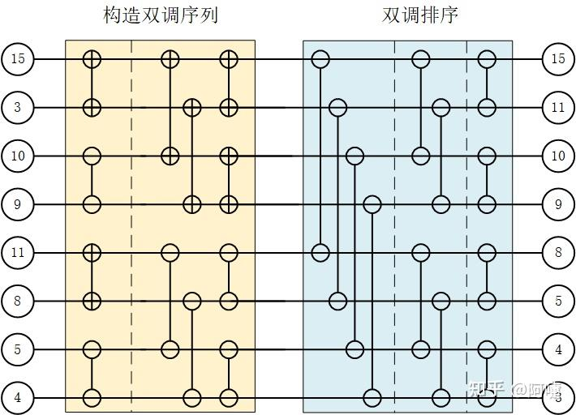

# pytorch 源码分析 （11）sort (1)

**Author:** 阿嚏

**Date:** 2025-07-11

**Link:** https://zhuanlan.zhihu.com/p/1926998363087307228

要说最经典的算法，还得是sort，学数据结构时往往会学到像快排，冒泡插入之类的经典算法，但是这些排序方法并不适合并行性，在gpu领域，排序算法比较多的是双调排序和[基数排序](https://zhida.zhihu.com/search?content_id=260212344&content_type=Article&match_order=1&q=%E5%9F%BA%E6%95%B0%E6%8E%92%E5%BA%8F&zhida_source=entity)，我们逐个分析一下

先看双调排序，关于算法的原理这里就不讲了，网上的讲解有很多，推荐下面的文章

[https://blog.csdn.net/qq\_42224089/article/details/128628161](https://link.zhihu.com/?target=https%3A//blog.csdn.net/qq_42224089/article/details/128628161)

[\[笔记\]适用于任意长度(不局限于2^k)的双调排序(Bitonic Sort)，并行排序](https://zhuanlan.zhihu.com/p/707468542)

我们这里主要关注其是怎么实现的，双调排序是不稳定排序，主要应用在数据量比较小的时候，参考[SmallBitonicSort](https://zhida.zhihu.com/search?content_id=260212344&content_type=Article&match_order=1&q=SmallBitonicSort&zhida_source=entity)，一般排序算法都是数值和index一起排序的，被称作kv排序，其中数值values是key，索引indices是value，是不是觉得有点别扭哈哈。

开始仍然是计算grid 和 block，这里minimum\_grid\_for\_occupancy调用了官方 cudaOccupancyMaxPotentialBlockSize实现来计算最小grid，这个就是根据kernel占用的smem 寄存器等资源，计算最起码多少个block才能将资源打满。

对于经典任务 (batch,dim\_size)，keySlices就是这个batch,

const auto max\_batch = std::max(IndexType{1}, keySlices / min\_grid); 最多是max\_batch 将数据处理完。

grid\_count = (keySlices + block\_y - 1) / block\_y; 取个整。

这是一种经典的任务划分方式，也就是一个block负责多个batch数据，同时有min\_grid保证，防止keySlices太小，一个block就处理完了导致利用率不足。

sort\_size 是需要排序的数据数量，可以看出来，很小，最多不超过32，每个线程处理两个值，block x轴上有16个线程。

block\_x = sort\_size / items\_per\_thread;

```text
struct SmallBitonicSort {
  template <int A, typename K, typename V, typename IndexType>
  void sort(
      at::cuda::detail::TensorInfo<K, IndexType> keyInfo,
      IndexType keySlices,
      IndexType keySliceSize,
      IndexType keySliceStride,
      at::cuda::detail::TensorInfo<V, IndexType> valueInfo,
      IndexType valueSliceStride,
      bool descending) {
    constexpr int sort_size = 32;
    constexpr int max_block_y = 16;
    constexpr int items_per_thread = 2;
    static_assert(sort_size % items_per_thread == 0, "");
    constexpr int block_x = sort_size / items_per_thread;

    TORCH_INTERNAL_ASSERT(keySliceSize <= sort_size);

    // Scale batch size down if the grid would be too small
    const auto min_grid = minimum_grid_for_occupancy(
        bitonicSortKVInPlace<
            A, -1, block_x, max_block_y,
            K, V, LTOp<K, true>, IndexType>,
        block_x * max_block_y);
    const auto max_batch = std::max(IndexType{1}, keySlices / min_grid);
    const int block_y = std::min(IndexType(max_block_y), max_batch);
    dim3 block(block_x, block_y);

    dim3 grid;
    const int grid_count = (keySlices + block_y - 1) / block_y;
    TORCH_INTERNAL_ASSERT(getGridFromTiles(grid_count, grid),
                          "Too many slices to sort");
    const auto stream = at::cuda::getCurrentCUDAStream();

    if (descending) {
      bitonicSortKVInPlace<A, -1, block_x, max_block_y>
        <<<grid, block, 0, stream>>>(
          keyInfo,
          keySlices,
          keySliceSize,
          keySliceStride,
          valueInfo,
          valueSliceStride,
          GTOp<K, true>());
      C10_CUDA_KERNEL_LAUNCH_CHECK();
    } else {
      bitonicSortKVInPlace<A, -1, block_x, max_block_y>
        <<<grid, block, 0, stream>>>(
          keyInfo,
          keySlices,
          keySliceSize,
          keySliceStride,
          valueInfo,
          valueSliceStride,
          LTOp<K, true>());
      C10_CUDA_KERNEL_LAUNCH_CHECK();
    }
  }
};
```

这里有两个比较函数，一个是GTOp 判断左值是不是大于右值，另一个LTOp 正好反着，从大往小排就用GTOp。

```text
template <typename scalar_t, bool handleNaN = false>
struct GTOp {
  __device__ bool operator()(const scalar_t& lhs, const scalar_t& rhs) const {
    return (handleNaN && at::_isnan(lhs) && !at::_isnan(rhs)) || (lhs > rhs);
  }
};

template <typename scalar_t, bool handleNaN = false>
struct LTOp {
  __device__ bool operator()(const scalar_t& lhs, const scalar_t& rhs) const {
    return (handleNaN && at::_isnan(rhs) && !at::_isnan(lhs)) || (lhs < rhs);
  }
};
```

bitonicSortKVInPlace也不是真正干活的函数，真正干活的是bitonicSort，bitonicSortKVInPlace主要负责各种数据的准备，也就是根据idx找到需要处理的数据指针，也负责将数据读入smem给bitonicSort使用

```text
template <int KeyDims, int ValueDims, int block_dim_x, int max_block_dim_y,
          typename K, typename V, typename Comparator, typename IndexType>
C10_LAUNCH_BOUNDS_1(block_dim_x * max_block_dim_y)
__global__ void
bitonicSortKVInPlace(at::cuda::detail::TensorInfo<K, IndexType> keys,
                     IndexType keySlices,
                     IndexType keySliceSize,
                     IndexType keySliceStride,
                     at::cuda::detail::TensorInfo<V, IndexType> values,
                     IndexType valueSliceStride,
                     Comparator comp) {
  // Find the slice of the tensor that we are sorting
  // NOTE: blockDim.y may be less max_block_dim_y
  const IndexType blockIndex = getLinearBlockId<IndexType>();
  const IndexType linearIndex = blockIndex * blockDim.y + threadIdx.y;

  // If the entire block is out of bounds exit early
  if (blockIndex * blockDim.y >= keySlices) {
    return;
  }
  // It's also possible for some rows of a block to be out of bounds
  // but all thread need to run for __syncthreads to work.
  const bool row_valid = linearIndex < keySlices;

  constexpr int items_per_thread = 2;
  constexpr int Power2SortSize = block_dim_x * items_per_thread;

  // Storage for max_block_dim_y sorts performed in parallel
  __shared__ K blockSharedKeys[max_block_dim_y][Power2SortSize];
  __shared__ V blockSharedValues[max_block_dim_y][Power2SortSize];
  __shared__ bool blockSharedValid[max_block_dim_y][Power2SortSize];

  auto sharedKeys = blockSharedKeys[threadIdx.y];
  auto sharedValues = blockSharedValues[threadIdx.y];
  auto sharedValid = blockSharedValid[threadIdx.y];

  const IndexType keyStartOffset =
    at::cuda::detail::IndexToOffset<K, IndexType, KeyDims>::get(linearIndex, keys);
  const IndexType valueStartOffset =
    at::cuda::detail::IndexToOffset<V, IndexType, ValueDims>::get(linearIndex, values);

  // Load 2 values per thread into the shared workspace
  #pragma unroll
  for (int k = 0; k < items_per_thread; ++k) {
    auto idx = threadIdx.x + k * blockDim.x;
    bool valid = row_valid && idx < keySliceSize;

    sharedKeys[idx] = valid ?
        keys.data[idx * keySliceStride + keyStartOffset] : K{};
    sharedValues[idx] = valid ?
        values.data[idx * valueSliceStride + valueStartOffset] : V{};
    sharedValid[idx] = valid;
  }

  // Sort!
  bitonicSort<Power2SortSize, IndexType>(
      sharedKeys, sharedValues, sharedValid, comp);

  if (!row_valid) {
    return;
  }

  // Store outputs
  #pragma unroll
  for (int k = 0; k < items_per_thread; ++k) {
    auto idx = threadIdx.x + k * blockDim.x;
    if (idx < keySliceSize) {
      keys.data[idx * keySliceStride + keyStartOffset] = sharedKeys[idx];
      values.data[idx * valueSliceStride + valueStartOffset] = sharedValues[idx];
    }
  }
}
```

终于到了最后干活的bitonicSort，但是在开始解读之前，还得看一下bitonicSwap函数，对于降序排列，GTOp 是判断kA是否大于kB, 如果大于，则交换ab

```text
template <typename Comparator, typename K, typename V>
__device__ inline void bitonicSwap(K& kA, V& vA, bool& validA,
                                   K& kB, V& vB, bool& validB,
                                   bool dir,
                                   const Comparator& comp) {
  // Invalid entries always sort to the end
  bool swap = (comp(kA, kB) && validA) || !validB;
  if (swap == dir) {
    swapVars(kA, kB);
    swapVars(vA, vB);
    swapVars(validA, validB);
  }
};
```

双调排序有两步，一步是构建双调序列，一步是对双调序列排序，这里盗个图，原文来自

[FPGA设计篇之双调排序\_双调排序网络-CSDN博客](https://link.zhihu.com/?target=https%3A//blog.csdn.net/qq_42224089/article/details/128628161)



反着看，先看双调排序部分，因为这里就一个for循环，比较简单。

```text
  for (unsigned int stride = Power2SortSize / 2; stride > 0; stride /= 2) {

    __syncthreads();

    unsigned int pos = 2 * threadIdx.x - (threadIdx.x & (stride - 1));
    bitonicSwap<Comparator, K, V>(
      keys[pos], values[pos], valid[pos],
      keys[pos + stride], values[pos + stride], valid[pos + stride],
      false, comp);
  }
```

stride 一开始是排序序列大小的一半，如果8个数排序，也就是需要4个线程。stride好理解，一开始间隔4，后面间隔2，间隔1。

pos = 2 \* threadIdx.x - (threadIdx.x & (stride - 1)) 这个公式做的很神奇，精准的找到每个线程需要处理的位置。其实等价为threadIdx.x \* 2 - (threadIdx.x % stride) 至于为啥会这样，不大清楚...

找到对应位置，根据A B大小就决定交不交换，对于降序排列，GTOp 是a>b返回true，但是只有返回false(swap == dir)才会交换，也就是a<b交换，让b往上面去。

```text
Stride = 4:
x       2*x     x&(s-1) Result
0       0       0       0
1       2       1       1
2       4       2       2
3       6       3       3

Stride = 2:
x       2*x     x&(s-1) Result
0       0       0       0
1       2       1       1
2       4       0       4
3       6       1       5

Stride = 1:
x       2*x     x&(s-1) Result
0       0       0       0
1       2       0       2
2       4       0       4
3       6       0       6
```

而对于双调序列构建，就比较复杂一些，有两个for循环。

```text
  for (unsigned int size = 2; size < Power2SortSize; size *= 2) {
    bool flag = ((threadIdx.x & (size / 2)) != 0);

#if !defined(USE_ROCM)
#pragma unroll
#endif
    for (unsigned int stride = size / 2; stride > 0; stride /= 2) {

      __syncthreads();

      unsigned int pos = 2 * threadIdx.x - (threadIdx.x & (stride - 1));
      bitonicSwap<Comparator, K, V>(
        keys[pos], values[pos], valid[pos],
        keys[pos + stride], values[pos + stride], valid[pos + stride],
        flag, comp);
    }
  }
```

只有两个值时好说，大的放前面，小的放后面完事了，但是多个值就麻烦了，双调排序的思路是，两个值先构建一个排序队列，而且一组为增序，一组为降序，两组一并，就正好是一个双调序列了，再对这个双调序列进行排序，而且仍旧为一个增序，一个降序，两个新的双调序列排序完后一合并，又是一个新的双调序列。

注意到bitonicSwap有一个dir参数，就是掌管升序降序的，通过这样组组合并，最终就可以得到一个双调序列。

```text
x:0 size:2 flag:False
x:1 size:2 flag:True
x:2 size:2 flag:False
x:3 size:2 flag:True

x:0 size:4 flag:False
x:1 size:4 flag:False
x:2 size:4 flag:True
x:3 size:4 flag:True
```

  

双调排序其实在pytorch中很少用到，因为处理数据比较大排序的时候，还是用基数排序性能好一些，而基数排序pytorch并没有自己实现，而是调用的nvidia的[cub库](https://zhida.zhihu.com/search?content_id=260212344&content_type=Article&match_order=1&q=cub%E5%BA%93&zhida_source=entity)，这个库是一堆头文件，平时就放在/usr/local/cuda下面，pytorch编译时会用到。

不得不说cub这玩意比pytorch还底层，看着很费劲，有机会会更一下基数排序的实现。