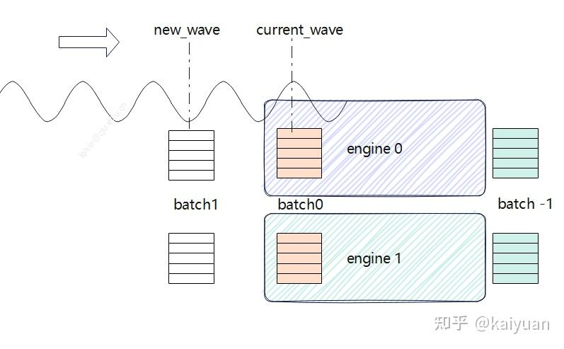

# vLLM DP特性与演进方案分析

**Author:** kaiyuan

**Date:** 2025-07-11

**Link:** https://zhuanlan.zhihu.com/p/1909265969823580330

SGLang方案(参考)：python/sglang/srt/managers/data\_parallel\_controller.py

[vLLM](https://zhida.zhihu.com/search?content_id=258102667&content_type=Article&match_order=1&q=vLLM&zhida_source=entity)框架的[数据并行](https://zhida.zhihu.com/search?content_id=258102667&content_type=Article&match_order=1&q=%E6%95%B0%E6%8D%AE%E5%B9%B6%E8%A1%8C&zhida_source=entity)（DP, Data Parallel）特性在V1版本中已支持多机运行，其在负载均衡、流量瓶颈、数据采集等方面的设计如何？下一步的迭代方案方向？本文将对vLLM DP特性的实现及相关问题进行分析和讨论。


数据并行简而言之，是将批量数据切分成多份，然后用多个模型副本分别处理。在训练和推理中都可以通过DP提升效率。DP的推理流程相较于训练更为简单，但由于推理属于实时数据处理，遇到的问题也有所不同。例如，同一批次的数据可能长度不一致且不能调换（训练中可行），或者数据量小于模型副本数量等。


DP并行方案考虑的问题点：

-   单模块瓶颈：CPU计算瓶颈、流量瓶颈；
-   负载均衡：请求数据量存在波动，需要均衡好各个设备之间的计算；
-   操作的同步：不同模型副本之间数据处理进度需要同步；
-   信息传递方式：不同GPU设备、不同节点之间的数据如何传递；

## DP并行方案现状

### 整体概览

当前vLLM已发布到0.9.x版本，支持多机的DP推理。当前方案逻辑框架图如下所示，结构上主要是单个AsyncLLM前端、多个engine cores后端，两者之间通过[ZMQ](https://zhida.zhihu.com/search?content_id=258102667&content_type=Article&match_order=1&q=ZMQ&zhida_source=entity)传递数据；主节点需要启动AsyncLLM前端（包括数据的前后处理等）和engine cores线程，其它节点只需启动engine cores。这些engine cores由引擎线程管理器（CoreEngineProcManager）拉起，并会连接到主节点的ZMQ端口，由主节点统一分发请求。


当前方案的**优点**：

-   在V1的基础上稍作改动即可支持DP并行，无需更改外部server和AsyncLLM的接口及行为，从节点启动时只需添加" --headless "参数；
-   主节点和从节点之间的通信方式简单，不额外引入其它管理模块；

**不足**：

-   主节点上主线程的AsyncLLM可能成为流量、CPU数据处理瓶颈；
-   当前数据分发未考虑engine core之间的负载均衡问题；
-   ZMQ数据传输之间的故障处理暂未考虑；

**代码：**

目前DP特性在V1版本中主要的PR（contributor：njhill）参考：

-   [\[V1\] DP scale-out (1/N): Use zmq ROUTER/DEALER sockets for input queue by njhill · Pull Request #15906 · vllm-project/vllm](https://link.zhihu.com/?target=https%3A//github.com/vllm-project/vllm/pull/15906)
-   [\[V1\] DP scale-out (2/N): Decouple engine process management and comms by njhill · Pull Request #15977 · vllm-project/vllm](https://link.zhihu.com/?target=https%3A//github.com/vllm-project/vllm/pull/15977)

### **Engine core的DP适配**

DP的engine core实现在DPEngineCoreProc类中，继承关系为DPEngineCoreProc -> EngineCoreProc -> EngineCore，代码位于（vllm/vllm/v1/engine/core.py）。输入和输出数据的处理由两个独立线程循环执行，这两个线程（process input/output socket）与主线程通过队列（input\_queue/output\_queue）进行数据传递。


在engine core的主线程主要包含一个busy loop，包括输入队列处理、step运算，execute\_dummy\_batch运算。对输入数据处理（\_handle\_client\_request）分了多种情况：ADD/ABORT/UTILITY/START\_DP\_WAVE。调度和模型计算过程在process\_engine\_step函数中完成。下面介绍几个关键点：

### **Busy loop逻辑**

EngineCoreProc的busy loop的while循环体下面有两个处理逻辑，DP重写了busy loop，主要是协同所有engines的处理进度，对比代码如下：

```python
# EngineCoreProc：
    def run_busy_loop(self):
        """Core busy loop of the EngineCore."""

        # Loop until process is sent a SIGINT or SIGTERM
        while True:
            # 1) Poll the input queue until there is work to do.
            self._process_input_queue()
            # 2) Step the engine core and return the outputs.
            self._process_engine_step()

# =============================分割线=================================
# DPEngineCoreProc：
    def run_busy_loop(self):
        """Core busy loop of the EngineCore for data parallel case."""

        # Loop until process is sent a SIGINT or SIGTERM
        while True:
            # 1) Poll the input queue until there is work to do.
            self._process_input_queue()
            local_unfinished_reqs = self.scheduler.has_unfinished_requests()
            if local_unfinished_reqs:
                # 2) Step the engine core.
                self._process_engine_step()
                # Check if we have now finished all requests.
                local_unfinished_reqs = (
                    self.scheduler.has_unfinished_requests())
            else:
                if self.scheduler.has_finished_requests():
                    self._process_engine_step()

                if not self.engines_running:
                    # All engines are idle.
                    continue

                # There must be unfinished requests in DP peers, run a
                # dummy forward pass.
                self.execute_dummy_batch()

            # 3) All-reduce operation to determine global unfinished reqs.
            self.engines_running = self._has_global_unfinished_reqs(
                local_unfinished_reqs)

            if not self.engines_running:
                if self.local_dp_rank == 0:
                    self.output_queue.put_nowait(
                        EngineCoreOutputs(wave_complete=self.current_wave))
                self.current_wave += 1
```

busy loop需要判断本地的engines和全局engines的运行情况，里面增加了wave和dummy batch处理逻辑，共同保证所有engines处理的同步性。


### **Wave概念的引入**

在分布式数据并行场景下，多个 EngineCore 进程需要协同处理一批请求。每一批请求被称为一个"wave"（波次）。每个 wave 代表一组需要同步处理的请求，所有进程必须在同一个 wave 上协同工作，保证状态一致。相关的PR：[\[V1\]\[DP\] More robust DP/EP dummy request coordination by njhill · Pull Request #16277 · vllm-project/vllm](https://link.zhihu.com/?target=https%3A//github.com/vllm-project/vllm/pull/16277)



**同步机制**：通过 current\_wave，各进程可以判断自己当前处于哪个 wave，是否需要等待其他进程，或者可以进入下一个 wave。

**前端与后端通信**：如果收到的请求的 current\_wave 大于本地的 current\_wave，则本地 current\_wave 会被更新，进入新的 wave。如果收到的请求属于已经完成的 wave，则会通知前端需要开始下一个 wave。

**步骤：**

1.  前端发起 wave：前端（ EngineCoreClient）通过 zmq socket 发送 START\_DP\_WAVE 指令，通知所有后端进程进入新 wave。
2.  后端同步 wave 状态：后端进程收到 START\_DP\_WAVE，更新自己的 current\_wave，并开始处理新 wave 的请求。
3.  后端处理请求：后端进程处理本 wave 的所有请求。
4.  后端通知 wave 完成：当所有请求处理完毕，后端进程通过 wave\_complete 消息通知前端。
5.  前端收到 wave\_complete：前端收到所有后端的 wave\_complete 消息后，可以发起下一波 wave 或结束流程。

DP的\_handle\_client\_request 增加了START\_DP\_WAVE的一个状态处理：

```python
    def _handle_client_request(self, request_type: EngineCoreRequestType,
                               request: Any) -> None:
        if request_type == EngineCoreRequestType.START_DP_WAVE:
            new_wave: int = request
            if new_wave >= self.current_wave:
                self.current_wave = new_wave
                if not self.engines_running:
                    logger.debug("EngineCore starting idle loop for wave %d.",
                                 new_wave)
                    self.engines_running = True
        else:
            super()._handle_client_request(request_type, request)
```

**dummy batch的作用？**

设置 execute\_dummy\_batch 的主要目的是为了保证所有数据并行进程的同步，避免某些进程因没有任务而阻塞，导致全局同步点无法到达。在数据并行模式下，多个进程（通常对应多张 GPU）需要协同处理任务。只有当所有进程都完成当前 wave 的任务后，才能进入下一个 wave。但在实际情况下，有些进程可能已经没有可处理的请求（如本地请求已全部完成），而其他进程还在忙。这时，如果没有特殊处理，这些"空闲"进程就会阻塞在同步点。

**如何判断全局请求的处理情况？**

主要是让所有engines进行集体通信，代码如下：

```python
# engines的执行情况判断：
    def _has_global_unfinished_reqs(self, local_unfinished: bool) -> bool:

        # Optimization - only perform finish-sync all-reduce every 24 steps.
        self.counter += 1
        if self.counter != 24:
            return True
        self.counter = 0

        return ParallelConfig.has_unfinished_dp(self.dp_group,
                                                local_unfinished)

# class ParallelConfig.has_unfinished_dp 中调用了all_reduce：
    @staticmethod
    def has_unfinished_dp(dp_group: "ProcessGroup",
                          has_unfinished: bool) -> bool:
        tensor = torch.tensor([has_unfinished],
                              dtype=torch.int32,
                              device="cpu")
        # dp rank 0: has_unfinished_seqs=True
        # dp rank 1: has_unfinished_seqs=False
        # aggregated: has_unfinished_seqs=True
        # so this is an OR operation, i.e. MAX in integers
        torch.distributed.all_reduce(tensor, op=ReduceOp.MAX, group=dp_group)
        aggregated_has_unfinished = bool(tensor.item())
        return aggregated_has_unfinished
```

## 方案演进分析

DP特性演进在vLLM社区上有两个方向的讨论：一个是多API server的方案，另一个是基于[Ray](https://zhida.zhihu.com/search?content_id=258102667&content_type=Article&match_order=1&q=Ray&zhida_source=entity)的方案。同样有参考的是SGLang的controller方案，这里一并做个简单分析。

### 多API Server 方案

目前这个方案是想解决DP特性的流量瓶颈以及负载均衡的问题，由njhill维护，在[设计文档](https://link.zhihu.com/?target=https%3A//docs.google.com/document/d/10jhCNxJYvsUhtMtiMAaW2MxU5LU8HVje2pGDnj49gH4/edit%3Ftab%3Dt.0)中它提供四种解决方案，并讨论各个实现方式的利弊。


目前有PR（[https://github.com/vllm-project/vllm/pull/17546](https://link.zhihu.com/?target=https%3A//github.com/vllm-project/vllm/pull/17546%25EF%25BC%2589%25EF%25BC%258C%25E8%25BF%2599%25E4%25B8%25AA%25E6%2596%25B9%25E6%25A1%2588%25E5%25BC%2595%25E5%2585%25A5%25E4%25BA%2586%25E4%25B8%2580%25E4%25B8%25AAcoordinator%25EF%25BC%2588%25E5%258D%258F%25E8%25B0%2583%25E5%2599%25A8%25EF%25BC%2589%25EF%25BC%258C%25E5%258D%258F%25E8%25B0%2583%25E5%2599%25A8%25E8%2583%25BD%25E5%25A4%259F%25E8%25B5%25B7%25E5%2588%25B0%25E8%25B4%259F%25E8%25BD%25BD%25E5%259D%2587%25E8%25A1%25A1%25E7%259A%2584%25E4%25BD%259C%25E7%2594%25A8%25EF%25BC%258C%25E6%2596%25B9%25E6%25A1%2588%25E5%2588%2586%25E6%259E%2590%25E5%25A6%2582%25E4%25B8%258B%25EF%25BC%259A)）的一个方案，这个方案引入了一个coordinator（协调器），协调器能够起到负载均衡的作用。概括如下：

> **使用Linux的[SO\_REUSEPORT](https://zhida.zhihu.com/search?content_id=258102667&content_type=Article&match_order=1&q=SO_REUSEPORT&zhida_source=entity)套接字选项在API服务器之间平衡HTTP请求。API服务器与DP引擎之间通过ZMQ进行全连接通信。一个独立的协调器进程在每次迭代中从所有引擎收集等待/运行状态统计信息，并每100毫秒将这些信息发布给API服务器，API服务器利用这些信息进行负载均衡。协调器还负责EP协调——当有其他引擎正在处理请求时，在空闲引擎中启动虚拟前向循环。**  
> **优点：**在不需要外部负载均衡器的情况下，能够很好地在引擎之间平衡请求；没有额外的每个请求的进程间通信（IPC）跳转；API服务器和DP大小可以独立扩展  
> **缺点：**DP不能再透明地部署在AsyncLLM实例之后；队列设置更加复杂；由于引擎需要将输出写入多个队列（每个API服务器一个），可能会对ITL产生潜在影响

整个方案的调用逻辑本人进行了简单梳理如下（PR更新时间2025.05.05)：


多 API 的启动是在 vllm/entrypoints/cli/serve.py 里面加入 run\_multi\_api\_server 函数，这个函数里面会启动 api\_server\_manager、coordinator、local\_engine\_manager 三类模块，其中 manager 和 coordinator 只有主节点会创建。


在原有的基础上，多个 AsyncLLM 与 coordinator 建立一个 ZMQ 通路，coordinator 通过广播向每个 AsyncLLM 发布信息，包括 engines\_reqs 的情况（格式\[\[waiting, running\], \[waiting, running\] ...\]）、current\_wave、引擎的运行布尔值。每个 AsyncLLM 需要处理请求时，可以向 coordinator 发送 start\_wave 指令；  
coordinator 与每个 engine 也建立 ZMQ 通路。coordinator 将是否开始 DP wave 的信号、wave 的轮次广播给所有 engine，而每个 engine 可以将结果的副本传递给 coordinator，用于更新 engines\_reqs、wave 的状态。


这里单看coordinator模块设计可能还需要考虑的点：新增一个通信链路zmq，通信如果不稳定或者coordinator模块线程挂了，engine core是否能够正常运行？反过来，如果有某些engine core挂了，coordinator是否需要感知并调整请求均衡？

**注意**：这个 **PR 在 wave 下发的逻辑上存在一个 BUG**，大流量多并发**可能导致 Hang 住，**因为当前在coordinator里面的逻辑判断可能导致start wave发布不到engine。合入前进行测试应该能踩BUG发现问题并修正，待后续跟踪。

### Ray方案

目前ray的方案主要PR（[https://github.com/vllm-project/vllm/pull/18233](https://link.zhihu.com/?target=https%3A//github.com/vllm-project/vllm/pull/18233)），Ray方案的特点是方案相对简单，而且仅需在主节点上执行命令可拉起所有DP进程。


Ray这个方案目前与主方案并行推进，因此其流量瓶颈和负载均衡等问题也需要进一步设计和优化。

### SGLang方案(参考)：python/sglang/srt/managers/data\_parallel\_controller.py

* * *

**参考：**

[https://docs.google.com/document/d/10jhCNxJYvsUhtMtiMAaW2MxU5LU8HVje2pGDnj49gH4/edit?tab=t.0](https://link.zhihu.com/?target=https%3A//docs.google.com/document/d/10jhCNxJYvsUhtMtiMAaW2MxU5LU8HVje2pGDnj49gH4/edit%3Ftab%3Dt.0)

[https://github.com/vllm-project/vllm/pull/16277](https://link.zhihu.com/?target=https%3A//github.com/vllm-project/vllm/pull/16277)

[https://github.com/vllm-project/vllm/pull/18233](https://link.zhihu.com/?target=https%3A//github.com/vllm-project/vllm/pull/18233)

[https://github.com/vllm-project/vllm/pull/17546](https://link.zhihu.com/?target=https%3A//github.com/vllm-project/vllm/pull/17546)