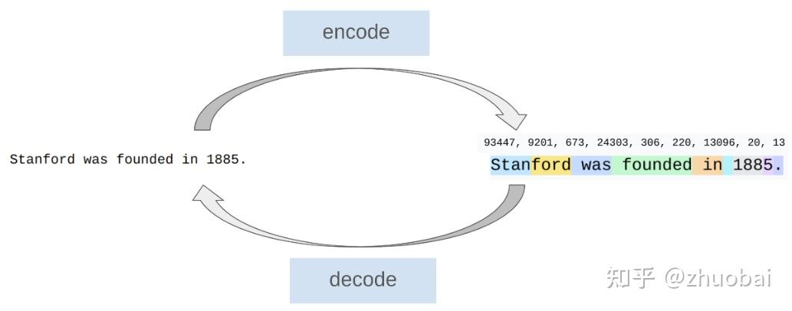
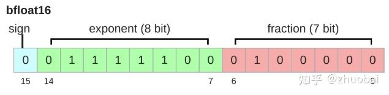

# CS336学习记录-Lec1&2

**Author:** zhuobai

**Date:** 2025-07-13

**Link:** https://zhuanlan.zhihu.com/p/1927498972286653422

之前一直没有写博客的习惯，学的东西总是写在笔记本里，但是发现笔记本老是会丢，导致很多学习的记录丢失了，现在准备从这一篇开始，记录下从本科到研究生再到博士（如果决定读的话）的学习过程。

之前学过的系统课程有[李宏毅](https://zhida.zhihu.com/search?content_id=260269863&content_type=Article&match_order=1&q=%E6%9D%8E%E5%AE%8F%E6%AF%85&zhida_source=entity)老师的 2024 大模型基础课，看过[李沐](https://zhida.zhihu.com/search?content_id=260269863&content_type=Article&match_order=1&q=%E6%9D%8E%E6%B2%90&zhida_source=entity)老师的《动手学深度学习》，目前也做了一些成果，但感觉还是很缺乏实际经验，没有动手尝试从零开始搭建一个 LLM 出来，需要学习的东西太多太多，在很多媒体网站看到 [CS336](https://zhida.zhihu.com/search?content_id=260269863&content_type=Article&match_order=1&q=CS336&zhida_source=entity) 的推荐视频后就果断准备系统学习下了。因为后面准备要申请美博，也是第一次挑战全英无翻译学习视频。最近虽然有两个项目在做，但每天还是能抽出来一到两个小时来学习，后续看看三四天能不能更一次学习记录。

## Lecture1-Overview and Tokenization

一开始这位老师就抛出一个很直接的问题：**_研究者与底层的技术正在越来越脱节。_**他说啊，八年前，学者会补充并训练他们自己的模型，六年前还会下载一个模型再 fine-tune，而现在学者们只会向闭源模型（[GPT-4](https://zhida.zhihu.com/search?content_id=260269863&content_type=Article&match_order=1&q=GPT-4&zhida_source=entity)/[Claude](https://zhida.zhihu.com/search?content_id=260269863&content_type=Article&match_order=1&q=Claude&zhida_source=entity)/[Gemini](https://zhida.zhihu.com/search?content_id=260269863&content_type=Article&match_order=1&q=Gemini&zhida_source=entity)）提问。当然这是一个比较夸张的说法，但现在确实随着模型能力的提升，很多基础的工作不再需要研究者去深究了。但他认为呢，**Full understanding** of this technology is necessary for **fundamental research**（好多老师都喜欢说的 fundamental！）。我看了下这位老师一作的几篇文章，感觉做的工作确实很基础又很有意思。

那通过这个课程能学到些什么东西呢。

-   **Mechanics**: how things work (什么是 [Transformer](https://zhida.zhihu.com/search?content_id=260269863&content_type=Article&match_order=1&q=Transformer&zhida_source=entity), 模型如何并行使用 GPU)
-   **Mindset**: 最大化利用硬件的显存，scaling laws！
-   **Intuitions**: 什么样的 data 和 modeling decisions 会有更好的结果

还特别强调了该课程最核心的理念：**maximize efficiency**! 也就是在给定你的数据和特定 GPU 的情况下，什么是能够训练出来的最好的模型。

正式课程从模型的整体发展历史开始，讲了下不同关键时间点模型的变化情况，其中在讲到开源的时候，第一次看到了对开源的不同的定义，感觉还挺有意思的，他把开源分了两种类型，一种叫 Open-weight models（比如 DeepSeek），另一种叫 Open-source models（比如 OLMo），前者公开模型权重，架构细节，但只提供部分训练细节，没有数据细节；而后者基本全部都公开，但也没有提供训练过程的失败案例。

其他就是关于该课程的其他部分，没什么太重要的。

讲完整个课程的 Overview 后，就正式开始讲解 Tokenization 了。

首先，我们为什么需要这个东西，LLM 需要把概率分布置于 token 序列（通常用整数索引表示），所以我们需要将初始文本的字符串 encode 成 token，又需要将 token decode 回字符串，这时候就需要有 Tokenizer 来完成这些事情。

可以试下这个链接

://tiktokenizer.vercel.app/?encoder=gpt2

可以实操玩一下 GPT2 的 tokenizer，能细致的观察到 string 被 encode 后的具体的 token 结果。

讲了几个 Tokenization 的不同方法，并介绍了目前主流的大家都在用的。

1.  Character-based tokenization。每个 character 被转换成一个 code point（整数），这样对每种语言的处理都很方便，但问题是 vocabulary 太大，有些 character 不常用，这样转换效率不高；
2.  Byte-based tokenization。转换成字节序列，可以把表征范围限制在 0-255，问题是有些 character 会被转换为 \\xf0\\x9f\\x8c\\x8d，序列太长，而 transformer 的上下文长度是有限的；
3.  Word-based tokenization。将字符串分割成单词，然后将这些分割的结果映射成整数，但问题词表可能变得巨大，包含很多不常见的词汇，vocabulary 的大小不确定；
4.  Byte Pair Encoding (BPE)。在 BPE 之前普遍用 word-base，之后从 GPT-2 开始使用 BPE。基本思想是在原始的文本上训练 tokenizer，自动确定 vocabulary，也就是常见的 vocabulary 用单一的 token 表示，很少出现的 vocabulary 用多个 token 表示。

## Lecture2-[Pytorch](https://zhida.zhihu.com/search?content_id=260269863&content_type=Article&match_order=1&q=Pytorch&zhida_source=entity), Resource Accounting

这堂课的核心的感觉就是随时随地在算这两个东西：

-   Memory (GB)
-   Compute (FLOPs)

老规矩，先抛出一个 motivating questions：用 1024 个 [H100](https://zhida.zhihu.com/search?content_id=260269863&content_type=Article&match_order=1&q=H100&zhida_source=entity) 在 15T tokens 上训练一个 70B 的模型需要多长时间？

总共的 flops 是 6 \* 70e9 \* 15e12，H100 每秒计算 flop 是 1979e12 / 2，假设 mfu（Model FLOPs Utilization）为 0.5，那每天需要计算的 flops 为 h100\_flop\_per\_sec \* mfu \* 1024 \* 60 \* 60 \* 24，总共大概需要 144 天。

这节课主要由三部分组成：Memory accounting，Compute accounting 和 Models，我们先从 memory 开始！

Tensors！存储万物（参数、梯度、优化器状态、数据和激活值）的 basic building block，实际表示为一个多维的矩阵。又因为这些数据存储为浮点数，所以这里讲了很多的浮点结构。

1.  float32。又称单精度，默认设置。每个数据用 32 个 bit 存储，也就是 4 个 byte
2.  float16。又称半精度，存储的 memory 更少，但是 dynamic range 太低，如果用 16 位表示 1e-8，结果为 0（下溢），使用该精度会导致模型的训练不稳定
3.  bfloat16。和 float16 一样的 memory，和 float32 一样的 dynamic range。虽然 resolution 更低，但在深度学习中并不重要
4.  fp8。H100s 支持两种 FP8: E4M3 和 E5M2

bfloat16示意图

目前很多工作在做混合精度训练，比如：{bfloat16, fp8} 用作前向传播，在计算梯度和模型参数的时候用 float32 存储，结合两者的优点。甚至 NVIDIA's Transformer Engine 在线性模型中能够支持 FP8。

memory 基本就讲了这些，接下来主要讲 compute 了。

前三节讲了如何把 tensor 从 CPU 转移到 GPU，关于 tensor 的一些常规运算，主要是矩阵乘法等，这一块内容比较基础，就不详细做笔记了，主要记录下计算消耗这一块。

首先澄清一个基本概念：FLOP/s 是每秒的（floating-point operations），用来评估硬件的运算速度。那其中训练 GPT-3 花费了 3.14e23 FLOPs，训练 GPT-4 推测花费了近 2e25 FLOPs。

通过一个最简单的**线性模型**作为计算示例：假设我们有 n 个神经元，每个神经元有 d 维，线性模型将 d 维向量映射为 k 个输出（可以把 n 看作数据，(D K) 为模型参数）。那实际的总 flops = 2 \* b \* d \* k（2 表示 d 次乘法和 d 次加法相加）。假设数据以 float32 的格式存储，那么计算这样的矩阵乘法一块 H100 就可以在 0.16 秒完成。那对于反向传播来说，每个矩阵的参数都要计算梯度更新一次，所以多一次矩阵乘法，每一层的输入（activation）也要被回传梯度，再加一次矩阵乘法，所以总结如下：

总共需要计算的 FLOPs (data points) (parameters) = 前向传播（2）+反向传播（4）=6 \* b \* d \* k。

最后来到 Model 部分~这一节也比较基础，主要以两层线性模型为例，怎么计算参数量，怎么搭建模型，怎么加载数据，怎么设置优化器，如何开始训练等等，我就不做详细的笔记了。