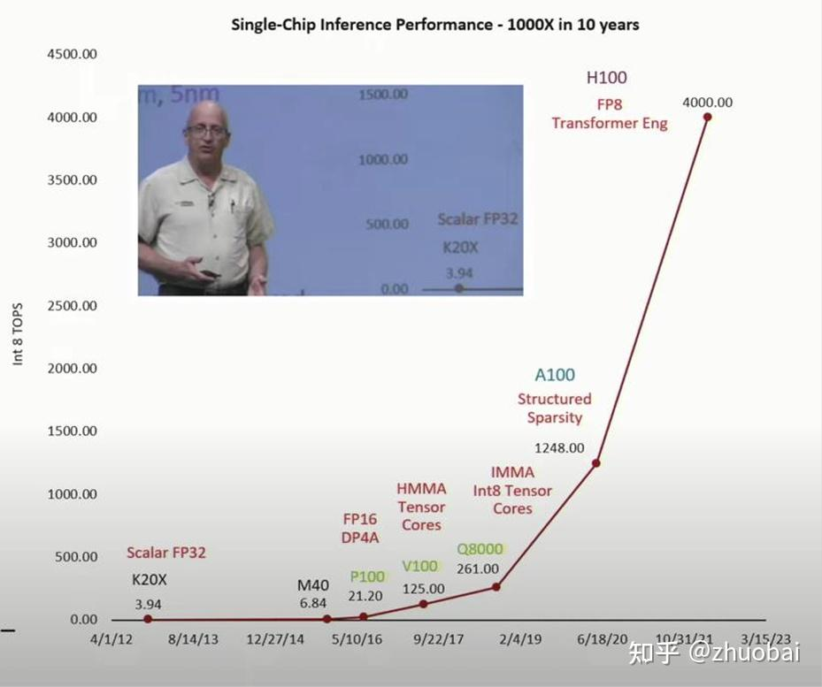
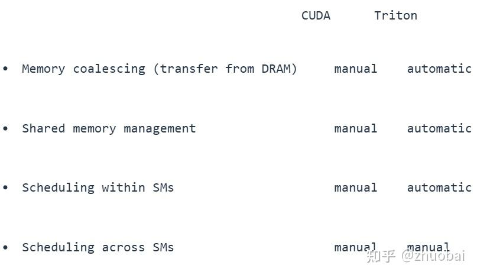

# CS336学习记录-Lec5&6

**Author:** zhuobai

**Date:** 2025-07-19

**Link:** https://zhuanlan.zhihu.com/p/1929489354822247064

这两节课的内容是有着非常强的关联度的，Lec5 主要是 high-level 的 GPU 的介绍和如何去提升性能表现，Lec6 紧接着就介绍了 low level 的 GPU 是如何运作的，并且会带我们手把手写一些 cuda 算子，所以这两节课的学习建议不要间隔太久。那话不多说，让我们开始！

## Lecture5-GPUs

这堂课的 goal：Make [CUDA](https://zhida.zhihu.com/search?content_id=260509453&content_type=Article&match_order=1&q=CUDA&zhida_source=entity) and GPUs less magic！（让 CUDA 和 GPUs 看起来没有那么神秘！）

核心内容总共有三块：

-   GPUs in depth – how they work and important parts（深入学习 GPU）
-   Understanding GPU performance（为什么有些任务 GPU 会变慢，如何加速运算）
-   Putting it together – unpacking [FlashAttention](https://zhida.zhihu.com/search?content_id=260509453&content_type=Article&match_order=1&q=FlashAttention&zhida_source=entity)

在 deep learning 时代，compute leads to predictable performance（计算量能带来可预测的性能表现），通常情况下，计算量的增加会带来 LLM 性能的可预测提升。通过下面这张图我们就可观察出，计算的重要性（计算量越大，loss 越低）。在当前阶段，更快的硬件、更高效的利用率、更好的并行化，仅凭这些目前仍可推动进步。


Neural Scaling Laws 示意图

过去十年中，GPU 的 Parallel scaling 能力提升了超过 1000 倍，如果没有 GPU 的 scaling，就不可能实现 LLM 的 scaling。



十年间 GPU 的提升（H100真是强啊）

那我们常用的 CPU 与 GPU 有什么区别呢，GPU 有非常非常多的 compute units (ALUs)，优化的是 throughput（总体处理的数据量），而 CPU 优化的是 latency（每个线程尽快完成）。GPU 的结构可以概括为两大块：

1.  execution units。GPU 拥有许多个 SM（streaming multiprocessors），它们可以独立执行 block（任务），而每个 SM 进一步包含许多 SP（streaming processor），它们可以并行执行线程，所以 GPU 可以做大量的并行运算。
2.  memory。**_memory 距离 SM 越近，访问速度就越快_**——L1 缓存和共享内存位于 SM 内部，L2 缓存在芯片上（on die），而 global memory 则是 GPU 外部旁边的 memory chip 中。这也就是为什么 CUDA 编程时会尽量使用共享内存和缓存，以避免频繁访问全局内存带来性能瓶颈，访问速度大概能提升 8 倍左右。


GPU 内部 SM 示意图

以 A100 为例：global memory 有 80G 左右的显存，L2 cache 大概有 40MB，L1 cache 中每个 SM 大致有 192KB，memory 不多但访问起来非常迅速。

那在执行 GPU 的时候有三个重要的 player：

1.  Threads： 线程以并行方式“ do the work ”——所有线程执行相同的指令，但输入不同（SIMT：单指令多线程）
2.  Blocks： block 是由多个线程组成的 group。每个 block 在一个 SM 上运行，并拥有自己的共享内存。
3.  Warp： 线程总是以一个由连续编号的 32 个线程组成的“warp”方式执行。


三个 player 之间关系的示意图

那 GPU 内部的 memory 是怎么传输的呢，每个线程可以访问自己的 register，以及其 block 内的共享内存。跨线 block 通信的数据必须通过 global memory 读写（速度较慢）。每个线程私有一个 Register 和 Local Memory，共享 block 内的 Shared Memory，所有线程共享 Global Memory（最常用于输入/输出）和 Constant Memory（适合存储不变常量，如超参数）。 下面这张图表达的很清楚：


GPU memory 传输示意图

我们来回顾下第一个 part 关于 GPU 的内容：what are they and how do they work

1.  GPU 是高度 parallel 的 —— 同一条指令会同时在大量计算单元上执行
2.  compute 能力（尤其是矩阵乘法）scale 的速度超过了内存带宽的提升
3.  我们必须遵循 memory hierarchy（内存层级结构）才能让程序运行更快

第二个 part，有什么 trick 能加速 GPU 的 performance！

-   Control divergence (not a memory issue)。如果某些线程执行了 if 分支，而其他线程执行了 else 分支，就不能同时执行，必须顺序执行各自的分支，产生 Control divergence（控制发散），降低 GPU 的运行效率。比如下面这张图，由于加了 if else 的 conditional，A 和 X 不能同时执行。所以要在 wrap 中避免产生这种情况。


Conditionals 示例

-   Low precision computation。通过 ReLU ( = max(0, )) 我们来举个例子，对于 Float 32 来说，Memory access 需要读取一次 x, 1 if x < 0 需要 write 一次，float 32 = 8 bytes。由于需要比较大小所以 Operations 为 1 次，整个 Intensity: 8 bytes / FLOP。对于 Float 16 来说，float 16 = 4 bytes，但是 Operations 不变，所以 Intensity 整整小一倍。
-   Operator fusion。如果我们有很多 operations 的话，尽量将它们 fusion 到一个 CUDA kernel 去运算，最后再传输到 memory，就像下图一样。


Fused kernel 示意图

-   recomputation。在梯度回流的时候，我们会选择存储 activations，但这样会导致大量的 memory read/write，不如 Throw away the activations, re-compute them！
-   Memory coalescing and DRAM（内存合并和 global memory）。当一个 warp 中的所有线程同时执行一个 load instruction，并且它们访问的内存地址落在同一个 burst section 内时，这些内存访问可以被合并为一个 DRAM 请求。
-   (the big one): tiling。tiling 是对线程进行分组和排序，以尽量减少 global memory access。下面这张图是一个实际的矩阵相乘的例子，这种情况下，thread0,0 和 thread0,1 要从 global memory 读取两次 M0,0，这显然会降低速度。那我们应该怎么办呢，**_将矩阵分割为很多的 tiles，然后加载进 shared memory。_**这样计算的优点在于：重复读取使用 shared memory 而非 global memory，速度快；线程访问的内存地址更连续，符合内存合并的优化原则，提高效率。


矩阵相乘运算示例


Tiling 后的矩阵相乘运算示例

但是 tiling 也会遇到很严重的问题，如果矩阵的 size 不能被 tile 的 size 整除，就会导致稀疏矩阵的出现，造成计算效率严重下降，比如下面这张图，被 2 整除和被 8 整除完全是两个效果！


紫色代表被32能整除，蓝色代表能被2整除

最后一个 part 是讲 Flash Attention 的，Flash Attention 是用来加速 Transformer 计算速度的一种手段，其中在运算的时候用到了很多刚刚的提到的这些 trick，这里就不再详细介绍了。

## Lecture 6-Kernels, [Triton](https://zhida.zhihu.com/search?content_id=260509453&content_type=Article&match_order=1&q=Triton&zhida_source=entity)

这节课的主要内容: benchmarking/profiling + write kernels

Benchmarking 主要是计算一些操作花费的时间，通过 benchmarking 我们可以比较不同的 implementation，看看哪个部分更快，还可以了解 scale 对运算时间的影响，这里主要评估了下加法和矩阵乘法运算的时间，以及在一个最简单的 MLP 的前向传播和反向传播的运算中，迭代次数、层的数量，batch size、dimension 的大小对运行时间的影响。

虽然 benchmarking 关注的是端到端的总耗时，但 profiling 主要关注的是时间花在哪里了。显然 profiling 可以帮助你了解时间都花在哪些地方了。更深入一点说：profiling 可以帮助你了解（具体调用了什么）。这里课程举了很多的计算例子来展示 CPU 和 GPU 的运算时间，比如 gelu、softmax、MLP 等，比如在下面这个 MLP 的例子中我们就可以很清晰的看到不同运算所占用的时间。


MLP profiling

OK，那假如我们自己写一个 Gelu 和 pytorch 比较下呢，用这个函数来逼近下 Gelu：0.5 \* x \* ( 1 + torch.tanh( 0.79788456 \* ( x + 0.044715 \* x \* x \* x )。通过计算时间我们发现，**_pytorch 版本仅花费了 1.13 ms，而我们自己写的花费了 8.15 ms，接近八倍的差距！_**那通过下面这张图我们就可以看出为什么差距如此大，就是因为在 pytorch 内部将加法、矩阵运算、tanh 函数运算等等都融合了，而不是单独运算反复传输 memory，这也是在 Lecture 5 讲到的 trick。


手写 Gelu 的 profiling 结果

CUDA 是一种扩展的 C/C++ 用来管理 GPU 的 API，那不妨我们在 CUDA kernel 里写一个 Gelu 看看运算时间如何。下面这段代码就是用 cuda 写的函数，运行时间只有 1.805 ms，虽然表现还不如 pytorch 官方函数，但要比不在 kernel 写的函数速度快多了。

```cuda
#include <math.h>
#include <torch/extension.h>
#include <c10/cuda/CUDAException.h>

// __global__ 表示该函数将在 GPU 上执行，由 CPU 发起调用。
_global_ void gelu_kernel(float* in, float* out, int num_elements) {
// 获取当前线程的 index tensor
int i = blockIdx.x * blockDim.x + threadIdx.x;
if (i < num_elements) {  // 仅在索引未越界时才执行计算
    // 执行 GELU 近似公式：
    out[i] = 0.5 * in[i] * (1.0 + tanh(0.79788456 * (in[i] + 0.044715 * in[i] * in[i] * in[i])));
}
}

// 计算向上取整
inline unsigned int cdiv(unsigned int a, unsigned int b) {
return (a + b - 1) / b;
}

torch::Tensor gelu(torch::Tensor x) {
TORCH_CHECK(x.device().is_cuda());
TORCH_CHECK(x.is_contiguous());
torch::Tensor y = torch::empty_like(x);  // Allocate empty tensor
int num_elements = x.numel();
int block_size = 1024;  // 每个 block 中的线程数
int num_blocks = cdiv(num_elements, block_size);
// 启动 CUDA kernel 执行
gelu_kernel<<<num_blocks, block_size>>>(x.data_ptr<float>(), y.data_ptr<float>(), num_elements);
C10_CUDA_KERNEL_LAUNCH_CHECK();  // Catch errors immediately
return y;
}
```

最后一部分内容主要是讲了下 Triton。这是一个 2021 年由 [OpenAI](https://zhida.zhihu.com/search?content_id=260509453&content_type=Article&match_order=1&q=OpenAI&zhida_source=entity) 开发的 高性能深度学习算子开发框架，用简单的 Python 风格代码，快速编写 GPU 上高效执行的自定义内核，能替代手写 CUDA。那 Triton 能提供给我们什么特别的东西呢，如下图所示，很多东西都会自动的确定优化。



只有不同 SM 之间的调度不是自动化的

下面这段代码是用 Triton 框架写的同样的 Gelu 函数，可以观察到代码更简洁了，而且主要是我们以 block 的 level 去写代码而不是以 thread 的 level 去写了，而且也从指针变为我们更习惯的 vector。而 Triton 的运行时间为 1.848 ms，与 CUDA 算子不相上下。

```text
def triton_gelu_kernel(x_ptr, y_ptr, num_elements, BLOCK_SIZE: tl.constexpr):
    # Input is at `x_ptr` and output is at `y_ptr`
    #     |        Block 0            |          Block 1          |      ...      |
    #                            BLOCK_SIZE                                 num_elements
    pid = tl.program_id(axis=0)
    block_start = pid * BLOCK_SIZE
    # Indices where this thread block should operate
    offsets = block_start + tl.arange(0, BLOCK_SIZE)
    # Handle boundary
    mask = offsets < num_elements
    # Read
    x = tl.load(x_ptr + offsets, mask=mask)
    # Approx gelu is 0.5 * x * (1 + tanh(sqrt(2/pi) * (x + 0.044715 * x^3)))
    # Compute (tl.tanh doesn't exist, use tanh(a) = (exp(2a) - 1) / (exp(2a) + 1)
    a = 0.79788456 * (x + 0.044715 * x * x * x)
    exp = tl.exp(2 * a)
    tanh = (exp - 1) / (exp + 1)
    y = 0.5 * x * (1 + tanh)
    # Store
    tl.store(y_ptr + offsets, y, mask=mask)
```

但其实我们完全可以不用手写 kernel，可以直接使用 Python 写完然后编译成 Triton，就像这样：compiled\_gelu = torch.compile(manual\_gelu)。而且 compile 的运行速度还要比 pytorch 更快，如果你提前知道并确认输入的矩阵特征的话。