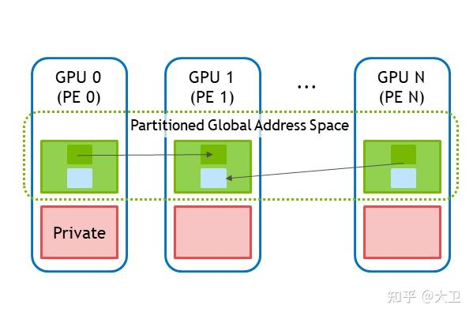
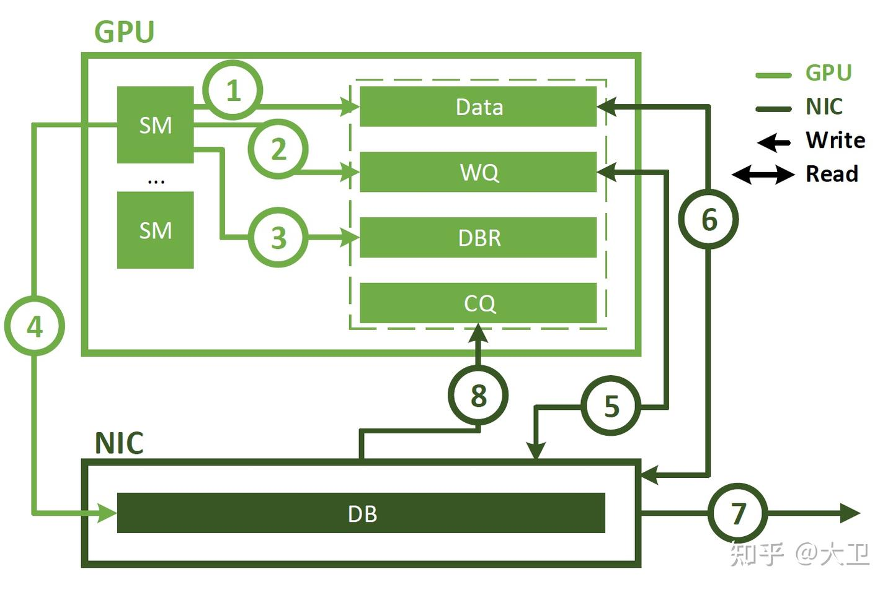
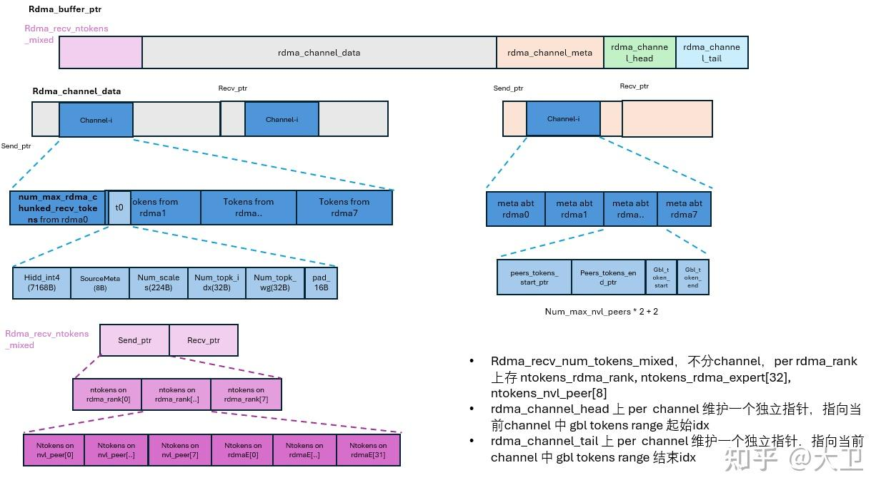
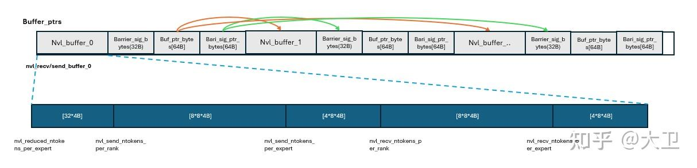
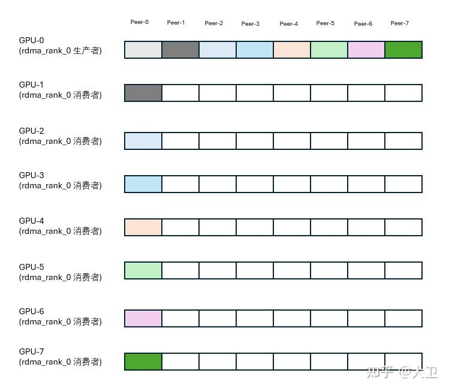

# kernel 笔记: DeepEP (1) 预备知识

**Author:** 大卫

**Date:** 2025-07-19

**Link:** https://zhuanlan.zhihu.com/p/1928161639397586106

## 预备知识

一个牛逼的工程化工作，本质上是搭建复杂系统能力。本着去理解复杂系统，先整理下初读 [DeepEP](https://zhida.zhihu.com/search?content_id=260334674&content_type=Article&match_order=1&q=DeepEP&zhida_source=entity) 源码里一堆概念。

-   网络相关, NVShmem, RDMA
-   CUDA 相关, [pinned-memory](https://zhida.zhihu.com/search?content_id=260334674&content_type=Article&match_order=1&q=pinned-memory&zhida_source=entity), ipc, nvshmem\_ibgda apis, [multi-gpu barrier](https://zhida.zhihu.com/search?content_id=260334674&content_type=Article&match_order=1&q=multi-gpu+barrier&zhida_source=entity)，[线程锁](https://zhida.zhihu.com/search?content_id=260334674&content_type=Article&match_order=1&q=%E7%BA%BF%E7%A8%8B%E9%94%81&zhida_source=entity)、 [汇编指令](https://zhida.zhihu.com/search?content_id=260334674&content_type=Article&match_order=1&q=%E6%B1%87%E7%BC%96%E6%8C%87%E4%BB%A4&zhida_source=entity)等
-   内存数据结构, buffer\_ptrs, [nvl\_buffer](https://zhida.zhihu.com/search?content_id=260334674&content_type=Article&match_order=1&q=nvl_buffer&zhida_source=entity), rdma\_buffer 等等

### NVSHMEM



nvshmem 是基于 OpenSHMEM，针对GPU集群设计的通信库。当下(2020年)，计算任务已经卸载到GPU上，但通信仍然依赖CPU，而会带来额外的同步、kernel launch 等开销。NVSHMEM 提供一个 partitioned global address space(PGAS)，将多个GPU上的显存组合成一个共享地址空间(shared address space)，并通过nvshmem api 访问。

nvshmem api 包括 barrier、broadcast、malloc/free 等对称 API。支持在多卡多机环境下，通过统一的地址空间读写线程，从而每个GPU进程都有对其他GPU进程显存的访问能力（put/get 操作）。对于底层通信链路，对于节点内通信，nvshmem 走 p2p 互联(nvlink/pcie等)，对于节点间通信，nvshmem 走 rdma 互联(e.g. IB, RoCE等)。

### 对称显存(Symmetric Buffer)

为了解决跨多卡、多机的显存访问和同步问题，只需要保证nvshmem通讯组内的每个GPU的PGAS上，同一个变量具有同样的地址偏移即可，即使用对称地址。其由 `nvshmem_malloc(), nvshmem_align()` 分配:

```cpp
auto rdma_buffer_ptr = nvshmem_align(alignment, 1e9);
```

按alignemnt 字节对齐，分配 1GB 的对称显存，即 nvshmem通信组里，每个gpu 都会在本地对称内存区域，分配一块1GB的显存，专门用于nvshmem相关的通信。该对等缓存申请成功后，返回 `rdma_buffer_ptr`，该指针在所有PE(processing elements)上是一样的。需要注意，本地 `rdma_buffer_ptr` 仅指向本地对称显存上的地址。对于 2节点 16xGPU 系统:

| PE（GPU） | rdma_buffer_ptr 值（逻辑地址） | 实际数据所在显存 |
| --- | --- | --- |
| PE 0 | 0x700000000000 | PE 0 的显存 |
| PE 1 | 0x700000000000 | PE 1 的显存 |
| PE 2 | 0x700000000000 | PE 2 的显存 |
| ... | ... | ... |
| PE 15 | 0x700000000000 | PE 15 的显存 |

即所有 PE 得到的指针值是一样(symmetric)的，但是它们引用的是本地显存中的不同物理内存块。

当前GPU需要读写其他PE(peer GPUs)则通过 nvshmem\_get/put() apis。例如, 当前GPU读写 GPU8，如下：

```cpp
// read data from PE-8
int target_pe = 8;
float local_data[10];
nvshmem_getmem(local_data, rdma_buffer_ptr, sizeof(float) * 10, target_pe);

// write local data to PE-8
float value = 3.14;
nvshmem_putmem(rdma_buffer_ptr, &value, sizeof(float), target_pe);
```

### ibgda 异步通信

传统意义上，跨节点通信需要提交一个 work\_request 给到 nic，然后nic 执行 异步数据传输。在IBGDA之前，nvshmem IB Reialble Connection(IBRC) 传输需要使用 CPU代理线程(proxy thread)来管理，包括创建工作队列buffer、管理DBRbuffer，通知nic有新工作了、轮询CQ\_Buffer 以查询nic是否完成数据传输，并最终通知GPU data transfer done。

基于CPU代理线程的通信方式，有2处缺点：1) 代理线程需要轮询，占用cpu cycles; 2) 对于细粒度的控制，代理线程的吞吐会变成瓶颈而影响整体性能



相比基于cpu proxy的通信方式，ibgda 使用 GPUDirect Async-Kernel-Initiated(GPUDirect Async-Kl) 以允许 GPU SMs 直接与 NIC 对话. 流程如下：

1.  应用起 cuda kernel 生产数据，放在gpu memory 里
2.  应用call nvshmem(e.g. nvshmem\_put()) 与另一个 processing element(PE) 建立通信。
3.  该SM 更新 DBR\_buffer, 位于 gpu 显存，然后通过向nic DB 写一个寄存器位从而通知 nic 有新工作来了。
4.  NIC 使用GPUDirect RDMA 从 WQ\_Buffer 读取最新的 work\_descriptor，然后根据work\_desc 从gpu 显存读取数据，然后传输数据到tgt node
5.  传输结束后，nic 通过GPUDirect RDMA 向 CQ buffer 写一个事件，通知gpu 传输结束，

即基于 IBGDA 传输，GPU <-> NIC 建立了直接通信，无CPU 依赖。

**RDMA 事务(transaction)和槽位(slots)**

1.  一个 \`事务\` 是指一次完整的rdma 远程内存访问操作，通常是异步的。e.g. 讲本地数据写入远端设备的内存中
2.  事务通常有几个阶段：  
    1\. 准备阶段，发送端准备数据、meta\_src  
    2\. 投递阶段，把当前事务交给rdma引擎(nic)  
    3\. 执行阶段，rdma网络完成数据传输  
    4\. 完成阶段，通知发送端事务完成，释放发送端本地的rdma缓存资源
3.  事务槽(slot)，用于追踪/记录一个正在执行的事务的占位单元。类似“on-going transcation 的登记表"  
    \* 每发起一个新事务，就要占用一个槽位  
    \* 当一个事务完成，则对应槽位释放
4.  滑动窗口  
    \* 为了提高 RDMA 的并发能力和吞吐量，通常允许最多 N 个事务并行进行，而不是一发一等。这里 \`N\` 个槽位就是 \`发送窗口(send window)\`。允许同时存在 32 个进行中的事务（已发送但未确认完成）便于流水线优化。而DeepEP中窗口大小32:

1.  便于使用一个 uint32\_t 变量管理，per bit per slots，及使用 bitmask 管理槽位
2.  A100/H100 的 NVLink 最大支持 32 个未完成请求（硬件特性）

## cuda 概念

### pinned-memory(锁页内存)

```cpp
// cudaError_t cudaMallocHost(void** ptr, size_t size, unsigned int flags = 0);
cudaMallocHost(&moe_recv_counter, sizeof(int64_t), cudaHostAllocMapped);
// cudaError_t cudaHostGetDevicePointer(void** pDevice, void* pHost, unsigned int flags);
cudaHostGetDevicePointer(&moe_recv_counter_mapped, const_cast<int*>(moe_recv_counter), 0);
```

-   在host端分配可在host/device上访问的 64bit 的锁页内存，主机端由 moe\_recv\_counter 指针访问；
-   cudaHostGetDevicePointer()，获取 GPU 端访问这块锁定内存的指针。即在gpu上使用 moe\_recv\_counter\_mapped 指针来访问这块锁页内存。

### cuda IPC

1.  进程A(gpu\_A) 分配 GPU 显存, 并通过 `cudaIpcGetMemHandle(cudaIpcMemHandle_t* handle, void* devPtr)` 获取指向该显存的 ipc\_handle
2.  进程B(gpu\_B) 使用 `cudaIpcOpenMemHandle(void** devPtr, cudaIpcMemHandle_t handle, unsigned int flags)` 打开远端 ipc\_handle， 从而获得访问远端进程 gpu\_A memory 的指针
3.  通信结束后，使用 `cudaIpcCloseMemHandle()` 关闭访问

注意, IPC是进程间通信，即限定在节点内多张GPU之间的通信。

```cpp
// 1. Buffer 构造时创建 per ipc_handle per nvl_rank in each rdma_rank 
CUDA_CHECK(cudaMalloc(&buffer_ptrs[nvl_rank], num_nvl_bytes + barrier_signal_bytes + buffer_ptr_bytes + barrier_signal_ptr_bytes));
CUDA_CHECK(cudaIpcGetMemHandle(&ipc_handles[nvl_rank], buffer_ptrs[nvl_rank]));

// 2. 通过all_gather 在节点内分发 ipc_handles dist.all_gather_object(ipc_handles, local_ipc_handle, group) 

// 3. 本地gpu进程 通过 ipc_handles 获取远端peer gpus 的显存访问
CUDA_CHECK(cudaIpcOpenMemHandle(&buffer_ptrs[i], ipc_handles[i], cudaIpcMemLazyEnablePeerAccess)); // 必须支持 p2p 
CUDA_CHECK(cudaMemcpy(buffer_ptrs_gpu, buffer_ptrs, sizeof(void*) * NUM_MAX_NVL_PEERS, cudaMemcpyHostToDevice));
```

在deepEP 实现中，同节点上的 GPU peeers (nvl\_rank) 之间走 ipc 通信，互相读写buffer。

### nvshmem apis

1.  nvshmem\_sync()

```cpp
__device__ void nvshmem_sync_with_same_gpu_idx(const nvshmem_team_t& rdma_team) {
    kLowLatencyMode ? void(nvshmem_sync(rdma_team)) : nvshmem_sync_all();
}
```

1.  nvshmemi\_ibgda\_quiet()

```cpp
// Wait previous operations to be finished。 有 i!=rdma_rank 对应，等待跨节点 同步完成
if (thread_id < kNumRDMARanks and thread_id != rdma_rank)
    nvshmemi_ibgda_quiet(translate_dst_rdma_rank<kLowLatencyMode>(thread_id, nvl_rank), 0);
__syncthreads();
```

作用类似`mpi_barrier`。跨节点rmda通信是异步的，put/get 操作可能还未在网络层完成（只是发出），所以需要 quiet() 等待它们真正完成，避免数据一致性问题。每个线程对自己负责的远程 RDMA rank 进行 quiet()，实现跨节点的同步或屏障控制。

1.  nvshmemi\_ibgda\_put\_nbi\_warp()

```cpp
nvshmemi_ibgda_put_nbi_warp<true>(dst_ptr, src_ptr, num_bytes_per_msg,
        translate_dst_rdma_rank<kLowLatencyMode>(dst_rdma_rank, nvl_rank), channel_id, lane_id, 0);
```

`nvshmem put` 操作，将一小段数据从本地 GPU 非阻塞(non-blocking implicit)地 put 到远程 GPU（跨节点）中，在 warp 内发起、执行，通过 GPU Direct RDMA 实现的点对点通信，而且不会等待完成，需手动同步。

其用来将本地(rdma\_rank) 的 send\_buffer 中的数据广播(put)到其他所有 rdma\_rank 对应的 recv\_buffer 中。

1.  nvshmemi\_ibgda\_amo\_nonfetch\_add()

```cpp
nvshmemi_ibgda_amo_nonfetch_add(rdma_channel_tail.buffer(rdma_rank), num_tokens_to_issue,
    translate_dst_rdma_rank<kLowLatencyMode>(dst_rdma_rank, nvl_rank), channel_id, dst_rdma_rank == rdma_rank);
```

非取值原子加操作（non-fetching atomic add），dst\_rdma\_rank 上来自 rdma\_rank 的 rdma\_channel\_tail 尾指针偏移 num\_tokens\_to\_issue 位置

### barrier\_block

用于实现节点内multi-gpu之间barrier同步。

1.  每张gpu 维护一个 `int* barrier_signal_ptrs[nvl_rank]`，在 symBuffer 上，该指针全局(8卡)可读写。长度为8，每个元素表示本地GPU 向peer GPU(thread\_id)发送了信号。
2.  每个本地GPU(rank) 向peer GPUs(thread\_id) 发送信号，也接收从peer GPUs 写回本地的信号。然后while loop轮询查看是否所有rank GPU 的发收完成，此时本节点上所有GPUs 都达到了同步点。

-   注意，rank 向 thread\_id 发送信号，在rank本地立即执行，但是remote 不一定立即可见。故有轮询操作

```cpp
// Add self-ranks, sub other ranks
    if (thread_id < kNumRanks) {
        atomicAdd_system(barrier_signal_ptrs[rank] + thread_id, FINISHED_SUM_TAG); // signals completion to thread_id
        atomicSub_system(barrier_signal_ptrs[thread_id] + rank, FINISHED_SUM_TAG); // acknowledge receipt from thread_id
    }

    while (true) {
        auto value = thread_id < kNumRanks ? ld_volatile_global(barrier_signal_ptrs[rank] + thread_id) : 0;
        if (__all_sync(0xffffffff, value <= 0))
            break;
    }
```

### **线程锁**

当 warp 内所有线程需要访问同一个共享变量，或者某个窗口状态(e.g. rdma channel window)。此时就需要一个机制，保证每个时间点，只有一个线程能修改这些共享状态。rdma\_rank 上 per channel 的 tail指针由 rdma\_send\_channel\_lock\[rdma\_rank\_idx\] 锁保护。当前 lane\_id 只有在获取对应锁后，才能访问/更新该channel\_tail。

```text
__shared__ int rdma_send_channel_lock[kNumRDMARanks]  
acquire_lock(rdma_send_channel_lock + lane_id);  //   加锁（进入临界区）
auto latest_tail = rdma_send_channel_tail[lane_id];
...
rdma_send_channel_tail[lane_id] = updated_value;
release_lock(rdma_send_channel_lock + lane_id);  //   解锁（离开临界区）
```

### **汇编指令**


DeepEP 大量使用了cuda 底层汇编指令，如下:

**\_\_1. Memory Fence Instructions\_\_**  
Ensure memory operation ordering and visibility. e.g. fence.acq\_re.sys, fence.acq\_rel.gpu, fence\_acq\_rel.cta e.t.c

**\_\_2. Load Operations\_\_**  
Memory load operations with various semantics. e.g. ld.acquire.sys.global.s32, ld.acquire.cta.s32, ld.relaxed.gpu.global.L1::no\_allocate.b8, ld.volatile.global.s32, e.t.c

**\_\_3. Store Operations\_\_**  
Memory store operations with various semantics. e.g. st.relaxed.sys.global.s32, st.relaxed.gpu.global.L1::no\_allocate.b8, e.t.c

**\_\_4. Atomic Operations\_\_**  
Atomic memory operations. e.g. atom.add.release.sys.global.s32, atom.acquire.cta.shared::cta.cas.b32 e.t.c  
**\_\_5. Barrier Operations\_\_**  
Synchronization barriers for collective operations. e.g. mbarrier.init.shared::cta.b64, e.t.c  
**\_\_6. Tensor Memory Access (TMA)\_\_**  
e.g. cp.async.bulk.global.shared::cta.bulk\_group.L2::cache\_hint, cp.async.bulk.wait\_group.read e.t.c

**\_\_7. Utility Functions\_\_**  
Higher-level abstractions built on assembly primitives.  

1\. Memory Operations  
\- \`ld\_nc\_global\`: Non-caching load with template specialization for various types (int8, int, float, int2, int4)  
\- \`st\_na\_global\`: Cache-bypassing store with template specialization  
\- \`broadcast\`: Warp-level broadcast of any datatype using \`\_\_shfl\_sync\`  
\- \`warp\_reduce\_sum\`: Warp-level integer sum reduction  
\- \`half\_warp\_reduce\_max\`: Half-warp floating point max reduction  

2\. Synchronization  
\- \`barrier\_block\`: Inter-block synchronization using pairwise signaling  
\- \`acquire\_lock\`/\`release\_lock\`: Locking primitives using \`atomic\_cas\_cta\_acquire\` and \`atomic\_exch\_cta\_release\`  

3\. FP8 Utilities  
\- \`calculate\_fp8\_scales\`: Computes scaling factors for FP8 conversion  
\- \`extract\_required\_scale\_format\`: Extracts scale in specific FP8 format

## buffer\_ptrs

-   `buffer_ptrs[nvl_rank]` 为当前nvl\_rank 上 nvl\_bytes 大小的buffer
-   `buffer_ptrs_gpu` 为 `void*[8]`，指向每个peer\_gpu 上的 buffer\_ptrs 地址，用于 ipc p2p 通信。

```cpp
CUDA_CHECK(cudaMemcpy(buffer_ptrs_gpu, buffer_ptrs, sizeof(void*) * NUM_MAX_NVL_PEERS, cudaMemcpyHostToDevice));
```

-   `int barrier_signals[8]` ， 当前GPU维护的用于记录与其他peer gpus barrier信号量， 自己(nvl\_rank)只读，其他peer gpu 写
-   `int* barrier_signal_ptrs[8]`，当前GPU记录peer\_gpu上的 barrier\_signal 的地址，自己(nvl\_rank)写，对方(peer gpu)读。

```cpp
CUDA_CHECK(cudaMemcpy(barrier_signal_ptrs_gpu, barrier_signal_ptrs, sizeof(int*) * NUM_MAX_NVL_PEERS, cudaMemcpyHostToDevice));
```

-   nvl gpus 之间的同步:

-   per nvl\_rank 上维护一个 barrier\_signals\[num\_nvl\_peers\]，当前 nvl\_rank 通过读取该 barrier\_signals 来知道是否已与peer GPUs 同步
-   而该 barrier\_signals\[peer\_gpu\_idx\] 是由对应peer\_gpu\_idx 写入的信号。故 per nvl\_rank 实际上也需要知道所有 nvl\_peer 上 barrier\_signals 的地址

### rdma\_buffer

### rdma\_recv\_num\_tokens\_mixed

-   rdma\_buffer\_ptr 为 notify\_dispatch() 中 rdma\_recv\_num\_tokens\_mixed 提供存储空间，其用于统计nvl\_rank, rdma\_experts, rdma\_rank 层面的tokens数，共计 `num_nvl_peers(8) + num_rdma_experts(32) + rdma_rank(1)` 41个统计值。对应层面的tokens 数，分别由 `num_tokens_per_rank`, `num_tokens_per_expert`, `num_tokens_per_rdma_rank` 提供。赋值后，本地 rdma\_rank 将上述 rdma\_recv\_num\_tokens\_mixed 通过 `nvshmem_ibgda_put` 广播到所有其他 rdma\_rank上，类似 `all2all`。发送后会有两个层面的同步: 1) nvshmem\_ibdga\_quite() 在nvhsmem 通信组上同步，2）sync\_with\_same\_gpu\_idx() 为 per rdma\_rank 内同步。同步完成后，整个集群层面 每个 rdma\_rank 上都有了全局 tokens 的流向信息。

### rdma\_channel\_buffer

rdma\_buffer\_ptr 为dispatch()中 rdma\_channel\_data, rdma\_channel\_meta, rdma\_channel\_head, rdma\_channel\_tail 准备空间。其显存分配在 Buffer.sync() 中完成: `rdma_buffer_ptr = internode::alloc(num_rdma_bytes, NUM_BUFFER_ALIGNMENT_BYTES);` 这里 `rdma_buffer_ptr` 是每个 rdma\_rank 为支持 nvshmem rdma/p2p 通信在本地PGAS上开辟的buffer，大小为 `num_rdma_bytes(1GB)`

rdma\_buffer\_ptr 中内存布局如下:



总结下， rdma\_buffer\_ptr 为所有channel(channel 在内存上连续)准备:

-   per channel 上所有 rdma\_ranks收/发的tokens buffer (per channel to multi rdma\_ranks 1对多映射)
-   per channel 上每个 rdma\_rank level上总tokens数，及分发到其内各个gpu\_rank上的1st token and last token idx
-   per channel 中每个 rdma\_rank 的 ringBuffer head/tail 地址

### nvl\_buffer layout



### rs\_wr\_buffer\_ptr vs ws\_rr\_buffer\_pt

以 nvl\_rank 为视角。

-   当 nvl\_rank 为 RDMAAndNVLForwarder(即生产者)，其从自身 nvl\_buffer，即 buffer\_ptrs\[nvl\_rank\] 取值写入peers GPU 的nvl\_buffer，即 buffer\_ptrs\[target\_ranks\];
-   当 nvl\_rank 为 NVLRecivers(消费者)。则需要从peer GPU 的 nvl\_buffer，即 buffer\_ptrs\[target\_rank\] 取值写入 自身的nvl\_buffer，即 buffer\_ptrs\[nvl\_rank\]
-   统一定义：

-   从中取值的 nvl\_buffer 定义为 `rs_wr_buffer_ptr`， 对应rank 定义为 `rs_wr_rank`
-   被写入值的nvl\_buffer 定义为 `ws_rr_buffer_ptr`， 对应 rank 定义为 `ws_rr_rank`

-   需要写入 nvl\_buffer 的内容(即 ws\_rr\_buffer\_ptr) 包括: nvl\_channel\_x, nvl\_channel\_src\_meta, nvl\_channel\_x\_scales, nvl\_channel\_topk\_idx, nvl\_channel\_topk\_weights, nvl\_channel\_prefix\_start, nvl\_channel\_prefix\_end, 及nvl\_rank buffer 上写入地址 nvl\_channel\_tail  
    
-   而nvl\_rank buffer 上读取地址是: nvl\_channel\_head

### nvl\_channel\_x

```cpp
auto nvl_channel_x = AsymBuffer<int4>(ws_rr_buffer_ptr, num_elems, NUM_MAX_NVL_PEERS, channel_id, num_channels, rs_wr_rank).advance_also(rs_wr_buffer_ptr);
```

-   case-1. nvl\_rank 为 RDMAAndNVLForwarder(生产者)

-   ws\_rr\_buffer\_ptr = nvl\_buffer\[peer\_nvl\_rank\_idx\]
-   rs\_wr\_buffer\_ptr = nvl\_buffer\[nvl\_rank\]
-   rs\_wr\_rank = nvl\_rank
-   nvl\_channel\_x Asymbuffer 实例：

1.  以nvl\_buffer\[peer\_nvl\_rank\_idx\] 为 base 指针，区间长度为 `num_elems * sizeof(int4) * num_nvl_peers * num_channels` 一块buffer。
2.  当前 nvl\_rank 要写入该AsynBuffer实例的地址为 `nvl_buffer[peer_nvl_rank_idx] + num_elems * sizeof(int4) * num_nvl_peers * channel_id + num_elems * sizeof(int4) * rs_wr_rank` ，即写入peer gpu
3.  最后，将 nvl\_buffer\[nvl\_rank\] 生产者指针前推 `num_elems * sizeof(int4) * num_nvl_peers * num_channels`

-   case-2, nvl-rank 为 NVLRecivers(消费者)
-   ws\_rr\_buffer\_ptr = nvl\_buffer\[nvl\_rank\]
-   rs\_wr\_buffer\_ptr = nvl\_buffer\[peer\_nvl\_rank\_idx\]
-   rs\_wr\_rank = peer\_nvl\_rank\_idx
-   nvl\_channel\_x Asymbuffer 实例：

1.  以 nvl\_buffer\[nvl\_rank\]为base指针，区间长度为 `nm_elems * sizeof(int4) * num_nvl_peers * num_channels` 的buffer
2.  当前nvl\_rank 写入该 AsymBuffer 实例的地址，即写入自身的 nvl\_buffer 上的地址：`nvl_buffer[nvl_rank] + num_elemssz(int4)num_nvl_peers * channel_id + num_elemssz(int4)peer_nvl_rank_idx`
3.  最后，将nvl\_buffer\[peer\_nvl\_rank\_idx\] 生产者指针前推 `nm_elems * sizeof(int4) * num_nvl_peers * num_channels`

关于nvl\_buffer 简单总结如下：

1.  当nvl\_rank 是生产者(从自身 rdma\_rank\_buffer 的数据分发到 peer nvl gpus)，其将从自身 nvl\_buffer 上读取对应peer\_gpu\_id 的 x，然后发送到对应peer\_gpu 上 nvl\_buffer 的 nvl\_rank\_id 对应的地址。
2.  当nvl\_rank是消费者(接收来自同节点内的写入)，其将向自身nvl\_buffer 中写入来自 peer\_nvl\_rank\_idx 的x
3.  rdmaandnvlForwarder完成后，每个nvl\_rank 上都有了来自所有rdma\_rank 的tokens，亦即系统层面的 token dispatch 完成。
4.  同理 nvl\_channel\_x, nvl\_channel\_src\_meta, nvl\_channel\_x\_scales, nvl\_channel\_topk\_idx, nvl\_channel\_topk\_weights, nvl\_channel\_prefix\_start, nvl\_channel\_prefix\_end 这些buffer 同 nvl\_channel\_x buffer pattern 一致。

1.  如果是 生产者 rank，则当前nvl\_rank 向 peer gpu 的 nvl\_buffer\[peer\_nvl\_rank\_idx\] 中写入 \`num\_elems\` 的buffer段 为这些buffer指针变量
2.  如果是 消费者 rank，则当前nvl\_rank 自身的 nvl\_buffer\[nvl\_rank\] 中 peer\_nvl\_rank\_idx 对应的buffer 段为这些buffer指针变量
3.  定义完这些buffer指针的交换后，其实每个nvl\_rank 都知道了 peer GPUs 上需要来自自身的各类buffer 的映射。



### 总结

读 DeepEP 源码，直观的感受就是相比 FlashAttn 等单kernel级别的源码是next level了。或者更应该把 DeepEP 当作system level 的工作看待。记录下初读DeepEp 的概念梳理。

### 参考

-   [Scaling Scientific Computing with NVSHMEM | NVIDIA Technical Blog](https://link.zhihu.com/?target=https%3A//developer.nvidia.com/blog/scaling-scientific-computing-with-nvshmem/)
-   [Improving Network Performance of HPC Systems Using NVIDIA Magnum IO NVSHMEM and GPUDirect Async | NVIDIA Technical Blog](https://link.zhihu.com/?target=https%3A//developer.nvidia.com/blog/improving-network-performance-of-hpc-systems-using-nvidia-magnum-io-nvshmem-and-gpudirect-async/)