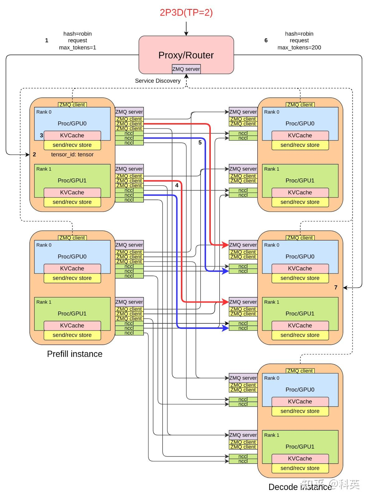
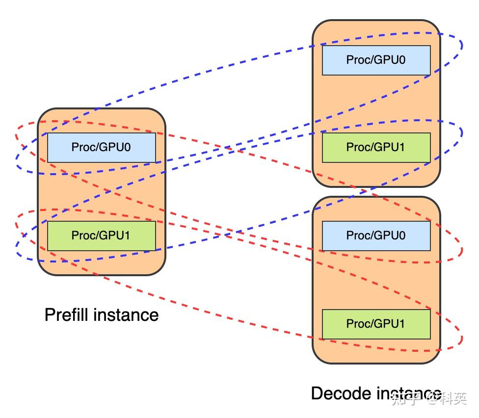
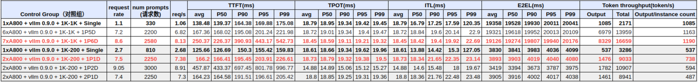

# vLLM上基于点对点NCCL实现的PD分离

**Author:** 科英

**Date:** 2025-07-19

**Link:** https://zhuanlan.zhihu.com/p/1917559316807923245

​

目录

收起

1\. 背景

2\. 详细设计

2.1 整体流程

2.2 Proxy/Router（Demo）

2.3 KVCache传输方式

2.4 基于ZMQ和NCCL进行点对点通信

2.5 NCCL组的布局

2.6 显存buffer与Tensor内存池

3\. 复现

3.1 安装vLLM

3.2 运行xPyD

3.3 单次请求

3.4 压测

3.5 关闭

4\. 压测数据

4.1 测试场景1：Meta-Llama-3.1-8B-Instruct/A800/1K-200

4.2 测试场景2：Meta-Llama-3.1-8B-Instruct/A800/1K-1K

5\. 实验：NCCL组占用显存Buffer大小

5.1 实验环境

5.2 实验结论

5.3 实验代码

一种基于点对点NCCL通信动态缩放的xPyD的原生实现，部分受到Dynamo的启发。

PR: [https://github.com/vllm-project/vllm/pull/18242](https://link.zhihu.com/?target=https%3A//github.com/vllm-project/vllm/pull/18242)

## 1\. 背景

PD分离是[DeepSeek](https://zhida.zhihu.com/search?content_id=259107607&content_type=Article&match_order=1&q=DeepSeek&zhida_source=entity)优化推理性能的手段之一。业界大部分的PD分离方案都是基于Cache Store，例如MoonCake和LMCache（目前它们也支持点对点方案了），即P实例将KV Cache存储到中间件Cache Store，然后D实例从该Cache Store获取KV Cache。我们想要去掉Cache Store，直接使用显卡到显卡，即点对点的传输方案，相比于Cache Store，节省一次传输，并且Cache Store的传输涉及CPU的参与，而点对点没有CPU的参与，跨节点直接走[RDMA](https://zhida.zhihu.com/search?content_id=259107607&content_type=Article&match_order=1&q=RDMA&zhida_source=entity)，同节点内走NVLink，性能会更好。NCCL相比于NIXL，优点是NCCL更轻量级，不需额外安装其他的库（NIXL需要安装UCX和GDRCopy），换言之，NCCL是native方案。

## 2\. 详细设计

### 2.1 整体流程

如图1所示，通过一个请求来介绍本PD分离方案的整体流程。

1.  客户端请求Proxy/Router的HTTP接口/v1/completions。
2.  Proxy/Router轮询或随机选择1P1D，生成request\_id（规则稍后介绍），修改HTTP请求消息中的max\_tokens为1，然后发送给P实例。
3.  紧接着Proxy/Router将原始HTTP请求转发给D实例。
4.  P实例做Prefill，然后将生成的KVCache主动发送给D实例（采用PUT\_ASYNC模式），D实例的zmq\_addr可以通过request\_id解析出来。
5.  D实例有一个线程专门接收KVCache，这样不会阻塞主进程，将接收到的KVCache保存到显存buffer中，这个buffer大小由[vLLM](https://zhida.zhihu.com/search?content_id=259107607&content_type=Article&match_order=1&q=vLLM&zhida_source=entity)启动参数[kv\_buffer\_size](https://zhida.zhihu.com/search?content_id=259107607&content_type=Article&match_order=1&q=kv_buffer_size&zhida_source=entity)决定。当显存buffer满时将KVCache保存到本地的[Tensor内存池](https://zhida.zhihu.com/search?content_id=259107607&content_type=Article&match_order=1&q=Tensor%E5%86%85%E5%AD%98%E6%B1%A0&zhida_source=entity)中。
6.  D实例主进程在作Decode时会从显存buffer或内存池中获取P实例传输过来的KVCache，进而跳过Prefill。
7.  D实例在处理完Decode后将结果返回给Proxy/Router，然后Proxy/Router转发给客户端。



图1

### 2.2 Proxy/Router（Demo）

简单的HTTP服务，是客户端请求的入口，并且启动了一个后台线程，用于监听P/D实例上报自己的HTTP的IP和PORT，以及[ZMQ](https://zhida.zhihu.com/search?content_id=259107607&content_type=Article&match_order=1&q=ZMQ&zhida_source=entity)的IP和PORT，其里面维护了一个字典http\_addr->zmq\_addr。http\_addr是vLLM实例应对客户端请求的IP:PORT，zmq\_addr是接收KVCache时握手和元数据的地址。

Proxy/Router负责根据客户端请求特点，例如prompt，选择1P1D，生成对应的request\_id，例如：

```text
cmpl-___prefill_addr_10.0.1.2:21001___decode_addr_10.0.1.3:22001_93923d63113b4b338973f24d19d4bf11-0
```

目前为了快速验证xPyD能否跑通，采用了轮询选择1P1D，后面考虑采用前缀树结合实例负载情况选择合适的P和D。

每个P/D实例定期（目前3秒）向Proxy/Router发送心跳包，用于注册（即上报http\_addr->zmq\_addr）和保活。当某个实例崩溃后，超过一定时间没有发送ping后，Proxy/Router会将超时的实例摘除。

### 2.3 KVCache传输方式

KVCache传输方式有三种：PUT、GET和PUT\_ASYNC。可通过--kv-transfer-config→kv\_connector\_extra\_config中的send\_type指定。PUT和PUT\_ASYNC方式都是P实例主动将KVCache发送给D实例，区别在于PUT是同步发送，会阻塞主进程，而PUT\_ASYNC是异步发送，即启动专门的线程进行发送，也就不会阻塞主进程。GET方式是P实例计算完prefill后，将KVCache保存到显存buffer中等待D实例的拉取，当D实例分配好KVCache空间后，主动向P实例获取计算好的KVCache。

经过实验表明三者的性能从高到低一次为PUT\_ASYNC→GET→PUT。

### 2.4 基于ZMQ和NCCL进行点对点通信

每个P/D实例只需要创建一个P2pNcclEngine实例，这个实例中维护一个ZMQ Server，启动一个线程专门监听zmq\_addr地址并接收来自其他实例的控制流请求，例如：建立NCCL的请求和发送KVCache的元数据（包括tensor的形状与数据类型等）的请求。ZMQ不实际发送KVCache数据。

当某个P实例和某个D实例第一次传输KVCache时，需要建立ZMQ连接以及NCCL组，后面再传输KVCache时，就复用这个ZMQ连接和NCCL组。这个NCCL组只有两个rank，即world size等于2，这样做的目的是为了动态扩缩容，这意味着增减P/D实例无需全系统重启。只要知道对方地址，就可以进行点对点的KVCache传输，不受rank和world size限制。

### 2.5 NCCL组的布局

目前仅支持对称TP方式传输KVCache，非对称TP、对称/非对称PP和EP等方式后面陆续支持。如图2示意了1P2D，每个实例TP等于2，一共有7个NCCL组，其中3个vLLM内部各有一个TP等于2的NCCL组，然后P的0号卡分别与每个D实例的0号卡各建立一个NCCL组。同样地，P的1号卡分别与每个D实例的1号卡各建立一个NCCL组。



图2

每个NCCL组会占用一定量的GPU内存缓冲区用于通信，其大小主要受NCCL\_MAX\_NCHANNELS环境变量的影响。当NCCL\_MAX\_NCHANNELS=16时，一个NCCL组通常会占用100MB的GPU内存；而当NCCL\_MAX\_NCHANNELS=8时，它通常会占用52MB的GPU内存，相关实验后面会介绍。对于大规模的xPyD（例如DeepSeek的96P144D），当前这种实现方式是不可行的。笔者正在考虑使用RDMA（Remote Direct Memory Access）进行点对点通信，并且也在关注UCCL的进展。

### 2.6 显存buffer与Tensor内存池

显存buffer大小的取舍，P实例在PUT和PUT\_ASYNC模式下不需要显存buffer，在GET模式下需要显存buffer，而D实例在三种模式下都需要显存buffer，D实例的显存buffer不能过大，同样P实例在GET模式下显存buffer也不能过大。该D的显存buffer用于临时存放P发送的KVCache，若过大则会减少D实例的正常推理使用的KVCache空间，进而降低推理batch大小，最终导致输出吞吐量下降。显存buffer大小由kv\_buffer\_size配置，单位为字节，通常为显存大小的5～10%。

如果P实例的--max-num-seqs设得较大，由于批量大，P实例会同时生成大量KVCache，很可能超出D实例的显存buffer容量，导致KVCache丢失。一旦丢失，D实例需重新计算Prefill，相当于重复计算两次Prefill，因此TTFT会明显变长，性能反而变差。

为了解决这上面的问题，笔者设计开发了一个用于存储KVCache的本地Tensor内存池，采用了Linux的内存模块中伙伴系统的设计。因为内存足够大，通常服务器上的内存都是TB级别，所以不用考虑前缀缓存那些特性，也不需要考虑使用分块设计来复用内存，进而节省空间。就是当显存buffer不够用时直接将KVCache存到Tensor内存池，后面D实例可以直接从Tensor内存池获取KVCache。读写速度就是PCIe的速度，PCIe4的读写速度大概为21GB/s，通常比prefill速度要快，否则Mooncake和lmcache也就不用做了。Tensor内存池就是一个泄洪区，通常情况下不使用，只有当流量突增时使用，也就是说，我的方案最差情况就是有Cache store方案的正常情况。

这个Tensor内存池，笔者后面有一个想法，可以用来存储被抢占的请求的KVCache，重新计算在某些生成特别长的场景简直是灾难，比如一个输入1K输出16K的场景，笔者发现抢占频率很高，很多计算都浪费了。

## 3\. 复现

### 3.1 安装vLLM

```text
pip install "vllm>=0.9.2"
```

### 3.2 运行xPyD

以下示例运行在配备A800（80GB显存）的设备上，使用Meta-Llama-3.1-8B-Instruct模型。

特别注意kv\_buffer\_size（单位为字节）的设置，经验值为GPU显存大小的5～10%。该参数与KVCache大小相关：若设置过小，用于临时存储接收到的KVCache的GPU内存缓冲区会溢出，导致KVCache被存入张量内存池，从而增加延迟；若设置过大，可供推理使用的KVCache会减少，导致批量处理（batch size）变小，吞吐量下降。

对于Prefill实例：

-   使用非GET模式时，kv\_buffer\_size可设为1，因为Prefill当前无需接收KVCache。
-   使用GET模式时，则需要较大的kv\_buffer\_size，因为它需存储待发送给D实例的KVCache。

您可能需要修改以下命令中的kv\_buffer\_size和port参数（若存在冲突）。

PUT\_ASYNC模式能提供最佳性能，应优先使用。

注意：--port必须与--kv-transfer-config中的http\_port保持一致。

脚本disagg\_prefill\_proxy\_xpyd.py将使用：

-   端口10001（接收客户端请求）
-   端口30001（接收来自P和D实例的服务发现）

运行代理（proxy）的节点需安装quart库。

支持多节点部署，只需修改--kv-transfer-config中的proxy\_ip和proxy\_port即可。

以下示例假设Proxy的IP地址为10.0.1.1。

**3.2.1 Run 1P3D**

Proxy (e.g. 10.0.1.1)

```text
cd {your vllm directory}/examples/online_serving/disaggregated_serving_p2p_nccl_xpyd/
python3 disagg_proxy_p2p_nccl_xpyd.py &
```

Prefill1 (e.g. 10.0.1.2 or 10.0.1.1)

```text
VLLM_USE_V1=1 CUDA_VISIBLE_DEVICES=0 vllm serve {your model directory} \
    --host 0.0.0.0 \
    --port 20005 \
    --tensor-parallel-size 1 \
    --seed 1024 \
    --served-model-name base_model \
    --dtype float16 \
    --max-model-len 10000 \
    --max-num-batched-tokens 10000 \
    --max-num-seqs 256 \
    --trust-remote-code \
    --gpu-memory-utilization 0.9 \
    --disable-log-request \
    --kv-transfer-config \
    '{"kv_connector":"P2pNcclConnector","kv_role":"kv_producer","kv_buffer_size":"1e1","kv_port":"21001","kv_connector_extra_config":{"proxy_ip":"10.0.1.1","proxy_port":"30001","http_port":"20005"}}' > /var/vllm.log 2>&1 &
```

Decode1 (e.g. 10.0.1.3 or 10.0.1.1)

```text
VLLM_USE_V1=1 CUDA_VISIBLE_DEVICES=1 vllm serve {your model directory} \
    --host 0.0.0.0 \
    --port 20009 \
    --tensor-parallel-size 1 \
    --seed 1024 \
    --served-model-name base_model \
    --dtype float16 \
    --max-model-len 10000 \
    --max-num-batched-tokens 10000 \
    --max-num-seqs 256 \
    --trust-remote-code \
    --gpu-memory-utilization 0.7 \
    --disable-log-request \
    --kv-transfer-config \
    '{"kv_connector":"P2pNcclConnector","kv_role":"kv_consumer","kv_buffer_size":"8e9","kv_port":"22001","kv_connector_extra_config":{"proxy_ip":"10.0.1.1","proxy_port":"30001","http_port":"20009"}}' > /var/vllm.log 2>&1 &
```

Decode2 (e.g. 10.0.1.4 or 10.0.1.1)

```text
VLLM_USE_V1=1 CUDA_VISIBLE_DEVICES=2 vllm serve {your model directory} \
    --host 0.0.0.0 \
    --port 20003 \
    --tensor-parallel-size 1 \
    --seed 1024 \
    --served-model-name base_model \
    --dtype float16 \
    --max-model-len 10000 \
    --max-num-batched-tokens 10000 \
    --max-num-seqs 256 \
    --trust-remote-code \
    --gpu-memory-utilization 0.7 \
    --disable-log-request \
    --kv-transfer-config \
    '{"kv_connector":"P2pNcclConnector","kv_role":"kv_consumer","kv_buffer_size":"8e9","kv_port":"23001","kv_connector_extra_config":{"proxy_ip":"10.0.1.1","proxy_port":"30001","http_port":"20003"}}' > /var/vllm.log 2>&1 &
```

Decode3 (e.g. 10.0.1.5 or 10.0.1.1)

```text
VLLM_USE_V1=1 CUDA_VISIBLE_DEVICES=3 vllm serve {your model directory} \
    --host 0.0.0.0 \
    --port 20008 \
    --tensor-parallel-size 1 \
    --seed 1024 \
    --served-model-name base_model \
    --dtype float16 \
    --max-model-len 10000 \
    --max-num-batched-tokens 10000 \
    --max-num-seqs 256 \
    --trust-remote-code \
    --gpu-memory-utilization 0.7 \
    --disable-log-request \
    --kv-transfer-config \
    '{"kv_connector":"P2pNcclConnector","kv_role":"kv_consumer","kv_buffer_size":"8e9","kv_port":"24001","kv_connector_extra_config":{"proxy_ip":"10.0.1.1","proxy_port":"30001","http_port":"20008"}}' > /var/vllm.log 2>&1 &
```

**3.2.2 Run 3P1D**

Proxy (e.g. 10.0.1.1)

```text
cd {your vllm directory}/examples/online_serving/disaggregated_serving_p2p_nccl_xpyd/
python3 disagg_proxy_p2p_nccl_xpyd.py &
```

Prefill1 (e.g. 10.0.1.2 or 10.0.1.1)

```text
VLLM_USE_V1=1 CUDA_VISIBLE_DEVICES=0 vllm serve {your model directory} \
    --host 0.0.0.0 \
    --port 20005 \
    --tensor-parallel-size 1 \
    --seed 1024 \
    --served-model-name base_model \
    --dtype float16 \
    --max-model-len 10000 \
    --max-num-batched-tokens 10000 \
    --max-num-seqs 256 \
    --trust-remote-code \
    --gpu-memory-utilization 0.9 \
    --disable-log-request \
    --kv-transfer-config \
    '{"kv_connector":"P2pNcclConnector","kv_role":"kv_producer","kv_buffer_size":"1e1","kv_port":"21001","kv_connector_extra_config":{"proxy_ip":"10.0.1.1","proxy_port":"30001","http_port":"20005"}}' > /var/vllm.log 2>&1 &
```

Prefill2 (e.g. 10.0.1.3 or 10.0.1.1)

```text
VLLM_USE_V1=1 CUDA_VISIBLE_DEVICES=1 vllm serve {your model directory} \
    --host 0.0.0.0 \
    --port 20009 \
    --tensor-parallel-size 1 \
    --seed 1024 \
    --served-model-name base_model \
    --dtype float16 \
    --max-model-len 10000 \
    --max-num-batched-tokens 10000 \
    --max-num-seqs 256 \
    --trust-remote-code \
    --gpu-memory-utilization 0.9 \
    --disable-log-request \
    --kv-transfer-config \
    '{"kv_connector":"P2pNcclConnector","kv_role":"kv_producer","kv_buffer_size":"1e1","kv_port":"22001","kv_connector_extra_config":{"proxy_ip":"10.0.1.1","proxy_port":"30001","http_port":"20009"}}' > /var/vllm.log 2>&1 &
```

Prefill3 (e.g. 10.0.1.4 or 10.0.1.1)

```text
VLLM_USE_V1=1 CUDA_VISIBLE_DEVICES=2 vllm serve {your model directory} \
    --host 0.0.0.0 \
    --port 20003 \
    --tensor-parallel-size 1 \
    --seed 1024 \
    --served-model-name base_model \
    --dtype float16 \
    --max-model-len 10000 \
    --max-num-batched-tokens 10000 \
    --max-num-seqs 256 \
    --trust-remote-code \
    --gpu-memory-utilization 0.9 \
    --disable-log-request \
    --kv-transfer-config \
    '{"kv_connector":"P2pNcclConnector","kv_role":"kv_producer","kv_buffer_size":"1e1","kv_port":"23001","kv_connector_extra_config":{"proxy_ip":"10.0.1.1","proxy_port":"30001","http_port":"20003"}}' > /var/vllm.log 2>&1 &
```

Decode1 (e.g. 10.0.1.5 or 10.0.1.1)

```text
VLLM_USE_V1=1 CUDA_VISIBLE_DEVICES=3 vllm serve {your model directory} \
    --host 0.0.0.0 \
    --port 20008 \
    --tensor-parallel-size 1 \
    --seed 1024 \
    --served-model-name base_model \
    --dtype float16 \
    --max-model-len 10000 \
    --max-num-batched-tokens 10000 \
    --max-num-seqs 256 \
    --trust-remote-code \
    --gpu-memory-utilization 0.7 \
    --disable-log-request \
    --kv-transfer-config \
    '{"kv_connector":"P2pNcclConnector","kv_role":"kv_consumer","kv_buffer_size":"8e9","kv_port":"24001","kv_connector_extra_config":{"proxy_ip":"10.0.1.1","proxy_port":"30001","http_port":"20008"}}' > /var/vllm.log 2>&1 &
```

### 3.3 单次请求

```text
curl -X POST -s http://10.0.1.1:10001/v1/completions \
-H "Content-Type: application/json" \
-d '{
    "model": "base_model",
    "prompt": "San Francisco is a",
    "max_tokens": 10,
    "temperature": 0
}'
```

### 3.4 压测

```text
python3 benchmark_serving.py \
    --backend vllm \
    --model base_model \
    --tokenizer meta-llama/Llama-3.1-8B-Instruct \
    --dataset-name "random" \
    --host 10.0.1.1 \
    --port 10001 \
    --random-input-len 1024 \
    --random-output-len 1024 \
    --ignore-eos \
    --burstiness 100 \
    --percentile-metrics "ttft,tpot,itl,e2el" \
    --metric-percentiles "90,95,99" \
    --seed $(date +%s) \
    --trust-remote-code \
    --request-rate 3 \
    --num-prompts 1000
```

### 3.5 关闭

```text
pgrep python | xargs kill -9 && pkill -f python
```

## 4\. 压测数据

### 4.1 测试场景1：Meta-Llama-3.1-8B-Instruct/A800/1K-200

-   1P1D（2卡A800）在端到端延时P99在4s左右情况下，在输入1K输出200 Token的推理场景下，相比于单实例A800部署的vLLM的输出吞吐提升**37.4%**(537->1476/2)，ITL(P99)降低**81.8%**(127.05ms->23.14ms)，TTFT(P99)增加**41.8%**(159.83ms->226.61ms)，TPOT持平。

### 4.2 测试场景2：Meta-Llama-3.1-8B-Instruct/A800/1K-1K

-   1P5D（6卡A800）在端到端延时P99在20s左右情况下，在输入1K输出1K Token的推理场景下，相比于单实例A800部署的vLLM的输出吞吐提升**7.2%**(1085->6979/6)，ITL(P99)降低**81.3%**(120.35ms->22.9ms)，TTFT(P99)增加**26.8%**(175.08ms->221.98ms)，TPOT持平。
-   1P6D（7卡A800）在端到端延时P99在20s左右情况下，在输入1K输出1K Token的推理场景下，相比于单实例A800部署的vLLM的输出吞吐提升**9.6%**(1085->8329/7)，ITL(P99)降低**81.0%**(120.35ms->22.69ms)，TTFT(P99)增加**210%**(175.08ms->542.73ms)，TPOT持平。



## 5\. 实验：NCCL组占用显存Buffer大小

每个NCCL组都会占用一定的显存Buffer来进行通信，其大小主要受到NCCL\_MAX\_NCHANNELS环境变量的影响。对于大规模xPyD，例如：DeepSeek那种是 96P144D，目前就不能用这种实现了。

### 5.1 实验环境

vLLM0.9.0.1、A800、NCCL2.26

### 5.2 实验结论

-   如NCCL\_MAX\_NCHANNELS=2，那么除第一个NCCL组外，一个NCCL组占用16MB显存。
-   如NCCL\_MAX\_NCHANNELS=4，那么除第一个NCCL组外，一个NCCL组占用28MB显存。
-   如NCCL\_MAX\_NCHANNELS=8，那么除第一个NCCL组外，一个NCCL组占用52MB显存。
-   如NCCL\_MAX\_NCHANNELS=16，那么除第一个NCCL组外，一个NCCL组占用100MB显存。
-   NCCL\_MAX\_NCHANNELS=2会导致传输延时增加，NCCL\_MAX\_NCHANNELS=8和16（默认值）延时基本一样。

### 5.3 实验代码

1\. 测试点对点的NCCL组占用显存Buffer大小

```text
from multiprocessing import Process, Queue
import os
import pynvml

import torch

from vllm.distributed.device_communicators.pynccl_wrapper import NCCLLibrary
from contextlib import contextmanager
from typing import Any

@contextmanager
def set_p2p_nccl_context(num_chennels: int):
   original_values: dict[str, Any] = {}
   env_vars = [
 'NCCL_MAX_NCHANNELS',
 'NCCL_MIN_NCHANNELS',
 'NCCL_BUFFSIZE',
 'NCCL_PROTO',  # LL,LL128,SIMPLE
 'NCCL_ALGO',  # RING,TREE
 'NCCL_P2P_LEVEL',
 'NCCL_CUMEM_ENABLE'
 ]

 for var in env_vars:
       original_values[var] = os.environ.get(var)
 print(f"{var}:{original_values[var]}")

 try:
       os.environ['NCCL_MAX_NCHANNELS'] = str(num_chennels)
       os.environ['NCCL_MIN_NCHANNELS'] = str(num_chennels)
 # os.environ['NCCL_PROTO'] = 'LL128'
       # os.environ['NCCL_BUFFSIZE'] = '4194304'
 os.environ['NCCL_CUMEM_ENABLE'] = '1'
 yield
   finally:
 for var in env_vars:
 if original_values[var] is not None:
               os.environ[var] = original_values[var]
 else:
               os.environ.pop(var, None)

def prefill(q: Queue, index: int):
   pynvml.nvmlInit()
   handle = pynvml.nvmlDeviceGetHandleByIndex(index)

   device = torch.device(f"cuda:{index}")
   lib = NCCLLibrary()

   info = pynvml.nvmlDeviceGetMemoryInfo(handle)
 print(f"GPU {index} 总显存: {info.total / 1024 ** 2:.2f} MB")
 print(f"创建NCCL前，已使用显存: {info.used / 1024 ** 2:.2f} MB")
   last = info.used

 for i in range(5):
       unique_id = lib.ncclGetUniqueId()
       q.put(unique_id)
 with torch.cuda.device(device):
 with set_p2p_nccl_context(2):
 comm: ncclComm_t = lib.ncclCommInitRank(2, unique_id, 0)
 # print(f"Worker 1 PID: {os.getpid()}, {bytes(unique_id.internal)}, {comm}")
 info = pynvml.nvmlDeviceGetMemoryInfo(handle)
 print(f"创建第{i+1}个NCCL后，已使用显存: {info.used / 1024 ** 2:.2f} MB，第{i+1}个NCCL占用: {(info.used - last) / 1024 ** 2:.2f} MB")
       last = info.used

def decode(q: Queue, index: int):
   device = torch.device(f"cuda:{index}")
   lib = NCCLLibrary()
   unique_id = q.get()
 with torch.cuda.device(device):
 with set_p2p_nccl_context(2):
 comm: ncclComm_t = lib.ncclCommInitRank(2, unique_id, 1)

if __name__ == '__main__':
 print(f"Main PID: {os.getpid()}")
   q = Queue()
   p1 = Process(target=prefill, args=(q,2))
   p2 = Process(target=decode, args=(q,3))
   p3 = Process(target=decode, args=(q,4))
   p4 = Process(target=decode, args=(q,5))
   p5 = Process(target=decode, args=(q,6))
   p6 = Process(target=decode, args=(q,7))

   p1.start()
   p2.start()
   p3.start()
   p4.start()
   p5.start()
   p6.start()

   p1.join()
   p2.join()
   p3.join()
   p4.join()
   p5.join()
   p6.join()
```

2\. 测试多卡的NCCL组占用显存Buffer大小

```text
from multiprocessing import Process, Queue
import os
import pynvml

import torch

from vllm.distributed.device_communicators.pynccl_wrapper import NCCLLibrary

def prefill(q: Queue, index: int, rank: int, world_size:int):
   pynvml.nvmlInit()
   handle = pynvml.nvmlDeviceGetHandleByIndex(index)

   device = torch.device(f"cuda:{index}")
   lib = NCCLLibrary()

   info = pynvml.nvmlDeviceGetMemoryInfo(handle)
 print(f"GPU {index} 总显存: {info.total / 1024 ** 2:.2f} MB")
 print(f"创建NCCL前，已使用显存: {info.used / 1024 ** 2:.2f} MB")
   last = info.used


   unique_id = lib.ncclGetUniqueId()
   q.put(unique_id)
 with torch.cuda.device(device):
 comm: ncclComm_t = lib.ncclCommInitRank(world_size, unique_id, rank)
 # print(f"Worker 1 PID: {os.getpid()}, {bytes(unique_id.internal)}, {comm}")
 info = pynvml.nvmlDeviceGetMemoryInfo(handle)
 print(f"创建NCCL后，已使用显存: {info.used / 1024 ** 2:.2f} MB，NCCL占用: {(info.used - last) / 1024 ** 2:.2f} MB")


def decode(q: Queue, index: int, rank: int, world_size:int):
   device = torch.device(f"cuda:{index}")
   lib = NCCLLibrary()
   unique_id = q.get()
   q.put(unique_id)
 with torch.cuda.device(device):
 comm: ncclComm_t = lib.ncclCommInitRank(world_size, unique_id, rank)

if __name__ == '__main__':
 print(f"Main PID: {os.getpid()}")
   q = Queue()
   world_size = 6
 p1 = Process(target=prefill, args=(q,2,0,world_size))
   p2 = Process(target=decode, args=(q,3,1,world_size))
   p3 = Process(target=decode, args=(q,4,2,world_size))
   p4 = Process(target=decode, args=(q,5,3,world_size))
   p5 = Process(target=decode, args=(q,6,4,world_size))
   p6 = Process(target=decode, args=(q,7,5,world_size))

   p1.start()
   p2.start()
   p3.start()
   p4.start()
   p5.start()
   p6.start()

   p1.join()
   p2.join()
   p3.join()
   p4.join()
   p5.join()
   p6.join()
```