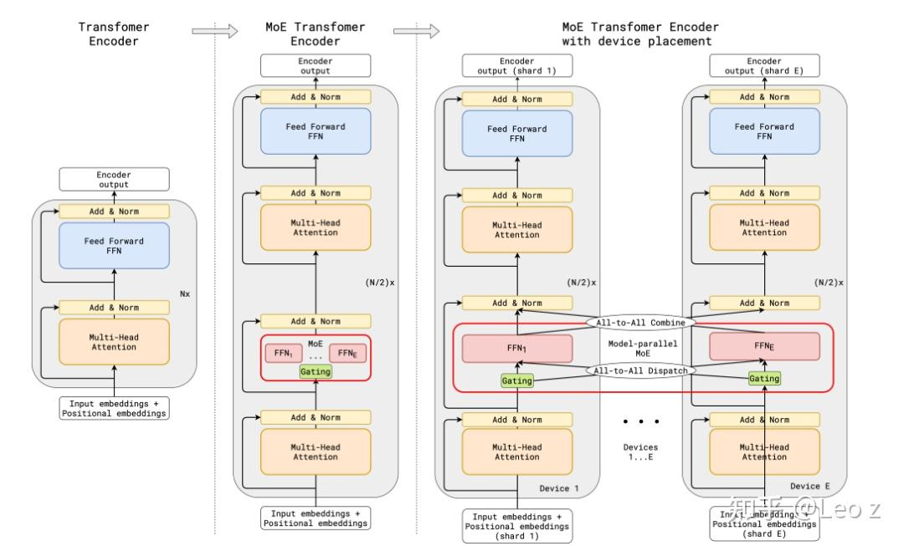
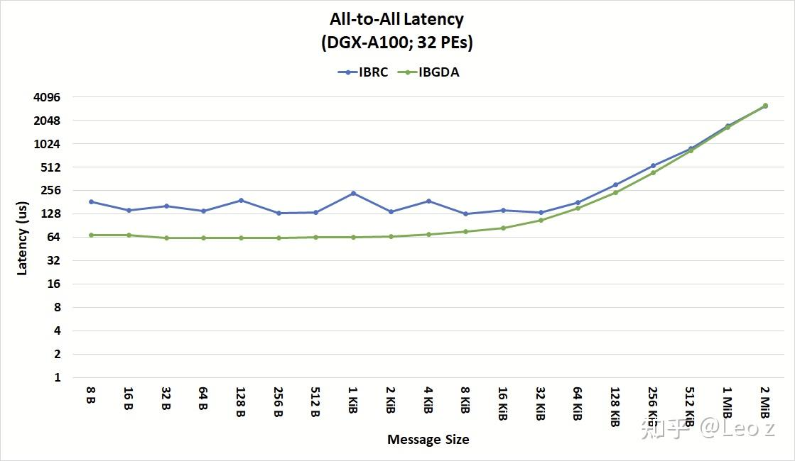
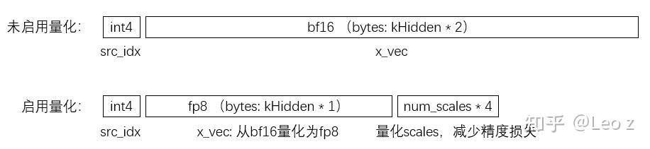
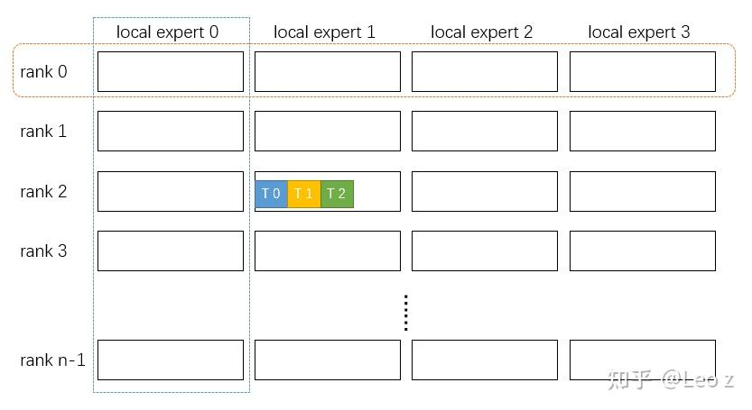
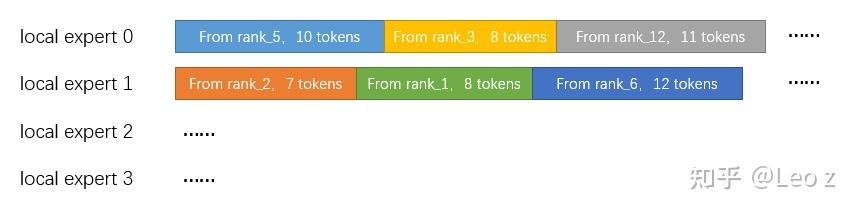
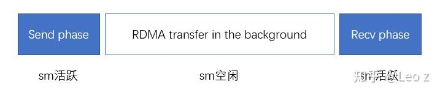
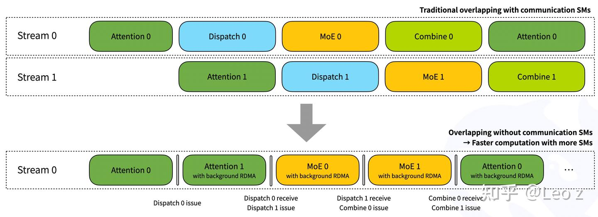

# 浅谈对DeepEP low latency模式实现的理解

**Author:** Leo z

**Date:** 2025-07-20

**Link:** https://zhuanlan.zhihu.com/p/1930346437507551397

## 相关背景简介

最近的工作和 DeepEP 强相关，对 DeepEP 源码看过用过也改过，这里把对 low latency kernel 的理解记下来。如有错漏，请多指正。

  
DeepEP 的核心是两个 CUDA Kernel 函数——dispatch 和 combine，分别对应 [MoE 模型](https://zhida.zhihu.com/search?content_id=260597916&content_type=Article&match_order=1&q=MoE+%E6%A8%A1%E5%9E%8B&zhida_source=entity)专家层中 token 分发给 experts 和聚合回原 rank 的两次 [All-to-All 通信](https://zhida.zhihu.com/search?content_id=260597916&content_type=Article&match_order=1&q=All-to-All+%E9%80%9A%E4%BF%A1&zhida_source=entity)（见图 1）。  

在分布式推理或训练时，MoE 的专家分布在不同的节点和 GPU 上，而这两个 Kernel 正是 token 与专家高效“跨设备交互”的底层引擎。  



图1 GShard 论文中的 MoE Transformer Encoder

  
  
DeepEP 专注于 MoE 模型分布式训练和推理场景。其 low latency kernel 主要对 decode 阶段的 All-to-All 进行优化——该阶段频繁的小数据量通信使得通信在整个端到端过程中占比大，因此需要降低通信延迟。DeepEP low latency kernel 通过 NVSHMEM IBGDA 的单边异步通信技术，实现多机多卡间低延迟的 All-to-All 通信。  

NVSHMEM 是 NVIDIA 基于 OpenSHMEM 规范实现的 GPU 通信库，采用分区全局地址空间(PGAS)架构，支持 GPU 间的点对点和集体通信。其核心优势在于：1)通过单边 put/get API 实现高效的远程数据读写；2)IBGDA 使 GPU 可直接通过 IB 网卡进行跨节点通信，完全绕过 CPU。这些特性显著提升了 GPU 集群的通信效率和吞吐量，具体实现细节可参考 NVIDIA 官方文档。  
图 2 展示了 IBGDA 在小消息 All-to-All 通信场景下相比 IBRC 的延迟优势，对此感兴趣想进一步了解可参考文献\[2\]\[3\]。  



图2 Latency comparison of 32 PE All-to-All transfer between IBRC and IBGDA

###   
  
Low Latency Kernel 实现

  
DeepEP 的 low latency 模式预分配充足缓冲区，通过预先申请足够大的 buffer 减少了元数据同步开销（无需预先交换各 rank 待发送的 token 数量信息）。  

**low\_latency\_dispatch**

  
DeepEP 的 dispatch kernel 采用两阶段设计（send/recv），其中 send 阶段还支持开启 [FP8 量化](https://zhida.zhihu.com/search?content_id=260597916&content_type=Article&match_order=1&q=FP8+%E9%87%8F%E5%8C%96&zhida_source=entity)。开启 FP8 量化可将原始 BF16 格式的 token 向量转换为 FP8 格式，数据量减少 50%。为保持精度，增加 scales 进行量化缩放，通过范围缩放确保数据分布落在 FP8 类型的有效表示范围内。  



图3 不启用量化和启用量化的token数据格式

  
图 3 对比了量化开启前后的数据分布情况，展示了 send 阶段发出的实际数据结构。特别需要注意的是，每个数据块头部包含一个 int4 格式的 src\_idx 索引，用于标识当前发送的 token idx（第几个 token）。在 combine 阶段，系统会依据该索引将分散到多个 experts（如 topk=8 时分配到 8 个 experts）的同一 token（src\_idx 相同）的处理结果进行归约（reduce）获得最终的 token。  

1\. send 阶段又分成两个小阶段：token data send 和 token count send。

前面提到，在 low latency 模式下系统会预先分配充足的接收缓冲区，使各 rank 能够并行写入数据而无需同步等待。具体实现上：每个 rank 包含 m 个 experts（下图举例 4 个），在 n 个 rank 的集群中，recv\_x buffer 被划分为 4×n 个独立区域。例如，当 rank 2 需要向本地的 local expert 1 发送 3 个 token 时，它会直接计算偏移地址并将 token 写入对应的 buffer 区域。这种设计消除了传统方案中的元数据传输，缓冲区竞争和等待开销。



图4 充足buffer存放不同rank发往不同local experts的token数据

-   token data send：

DeepEP 的 low latency kernel 运行时会尽可能多的占用 sm，以提高通信效率。在 token data send 阶段，每个循环迭代并行处理 num\_sms 个 tokens，首先对需要量化的 token 执行 FP8 转换，然后每个 sm 使用前 topk（通常为 8）个 warps 将 token 分发给 8 个目标 experts，调用 warp 级的 `nvshmemi_ibgda_put_nbi_warp` 进行 [RDMA](https://zhida.zhihu.com/search?content_id=260597916&content_type=Article&match_order=1&q=RDMA&zhida_source=entity) 传输。

需要注意的是，使用 qp\_id=dst\_expert\_local\_idx 绑定通信 qp，确保发往同一目标 expert 的 token data 和 token count 使用相同 qp 并按 data→count 顺序发送，这样当接收端收到 count 时，对应的 data 必定已就绪可用。

-   token count send：

在 send 阶段，每个 sm 分配出一个 warp（总共 num\_sms 个 warp）用于统计发往各 expert 的 token 数量（对 topk\_idx 进行统计，topk\_idx 指示每个 token 要发往哪 topk 个 experts）。待该 expert 的所有 token data 发送完成，再通过 nvshmemi\_ibgda\_amo\_nonfetch\_add 将计数写入目标 expert 的 rdma\_recv\_count buffer。为确保 token data 发送确已完成，每发送一个 token 就递增全局计数器，token count 发送前会循环检查该计数器是否达到了从 topk\_idx 中统计得到的 count 值。确认所有 token 均已发出才会执行 nvshmemi\_ibgda\_amo\_nonfetch\_add。

```text
// Wait local sends issued and send expert counts
while (ld_acquire_global(atomic_finish_counter_per_expert + responsible_expert_idx) != FINISHED_SUM_TAG * 2);
```

值得一提的是：在 dispatch 的 token data send 阶段和 combine 最后的 reduce 阶段 sm 资源按照 token 来分配，而其他阶段则转为按 experts 划分，将所有 warps 分组为 num\_experts 个 warp\_groups 进行并行处理。

2\. recv 阶段

在 recv 阶段，kernel 会等待 RDMA 完成数据写入，然后将这些非连续存储的 token 数据重组为连续内存布局（发往同一个 expert 的 token 连续存放）以提升后续计算效率，如图 5。在 recv 阶段，kernel 将 warps 划分为 num\_local\_experts\*num\_ranks 个 warp\_groups，每个 group 专门处理一个 rank 发往特定 local\_expert 的 tokens。  
  
  
具体地，在 send token count 阶段，kernel 会向特定的 buffer 地址写入发送给某个 expert 的 token 数量 num\_recv\_tokens，实际写入的值是：-num\_recv\_tokens-1。接收端通过 while 循环检测该 buffer 地址的值非零后，即可确认数据接收完成，并通过逆运算 num\_recv\_tokens = -num\_recv\_tokens-1 还原 token count 数值。进一步地，recv 阶段会将接收到的 token 数据拷贝至连续的地址空间中，同时记录下 token 数量和拷贝后位置信息，方便 combine 阶段将 token 原路发回。例如，当 local expert0 接收到 rank5 的数据并将其拷贝到 recv\_x 上时（10 tokens，起始索引=0），会记录 recv\_range\[5\]=pack2(10,0)；随后接收到 rank3 的数据（8 tokens，起始索引=10）则记录 recv\_range\[3\]=pack2(8,10)。所有 local\_experts 均记录类似的 recv\_range 数据。我们便可以知道来自不同 rank 的 token 的数量和位置分布。  
  
  
recv\_range 记录了各 token 的来源 rank，而 recv\_src\_info 则存储了每个 token 在其源 rank 中的原始位置（src\_idx）。这些信息在 combine 阶段至关重要：系统通过 src\_idx 将经过不同 experts 计算后的同一原始 token（即 src\_idx 相同的 tokens）聚合进行 reduce 操作。src\_idx 用 recv\_src\_info\[recv\_token\_begin\_idx + i\] = ld\_nc\_global(src\_src\_idx)来记录。在 token data send 阶段我们已经将 src\_idx 带入 token data 的头部信息中了。  
while ((num\_recv\_tokens = ld\_acquire\_sys\_global(rdma\_recv\_count + local\_expert\_idx \* num\_ranks + src\_rank)) == 0); num\_recv\_tokens = -num\_recv\_tokens - 1;  



图5 将发往同一个experts的token连续存放

  
**low\_latency\_combine**

  
有了上面 low latency dispatch 阶段的介绍，combine 阶段就相对容易理解了。  
1）在 combine send 中同样将所有 warps 分成 num\_experts 个 warp\_groups；2）利用 dispatch 阶段记录的 recv\_range 信息每个 local\_expert 使用 num\_ranks 个 warp\_groups 将处理后的 tokens 按原路径发回源 rank；3）利用 dispatch 阶段记录的 src\_idx 进行数据归位，在 recv 阶段通过 src\_idx 聚合 topk 个结果进行 reduce。同样的，整个过程中，data 和 recv flag 复用同一 QP 通道，在 data 发送完成后发送 recv flag 通知对端传输完成：

```text
auto dst_ptr = reinterpret_cast<uint64_t>(rdma_recv_flag + global_expert_idx);
nvshmemi_ibgda_amo_nonfetch_add(reinterpret_cast<int*>(dst_ptr), 1, dst_rank, local_expert_idx);
```

  
在 combine recv 阶段，系统在确认所有 rank 的 token 数据均已到达后，启动 reduce 聚合流程。该阶段采用与 token data send 相同的并行架构：每个 sm 每次将 1 个 token 分散处理的 topk 个结果聚合成一个，最终得到与 dispatch 前数量一致的 num\_tokens 个完整 token。  

```text
#pragma unroll
for (int i = 0; i < num_topk; ++ i) if (reg_topk_idx[i] >= 0) {
    // Read from sources
    auto rdma_buffer_type = reinterpret_cast<const int*>(static_cast<uint8_t*>(rdma_recv_x) + (reg_topk_idx[i] * num_max_dispatch_tokens_per_rank + token_idx) * num_bytes_per_slot);
    auto rdma_buffer_row = reinterpret_cast<const uint8_t*>(rdma_buffer_type);

    // Reduce
    auto x_vec = ld_nc_global(reinterpret_cast<const int4*>(rdma_buffer_row) + hidden_idx);
    const auto x_bf16 = reinterpret_cast<nv_bfloat16*>(&x_vec);
    #pragma unroll
    for (int j = 0; j < kNumElemsPerInt4; ++ j)
        combined_values[j] += static_cast<float>(x_bf16[j]) * reg_topk_weights[i];
}
```

### 两种通信模式

  
（recv\_hook=true/false）  
上面将通信分成 send 和 recv 两个阶段进行介绍。实际上也可以将整个 dispatch 和 combine 的工作流程看成是三个阶段：首尾是 LOW\_LATENCY\_SEND\_PHASE 和 LOW\_LATENCY\_RECV\_PHASE（对应上文中的 send 和 recv），这两个阶段需要处理 tokens，SM 处于活跃状态；中间阶段则处于等待状态，等待 RDMA 完成数据传输至目标 buffer，此时 SM 空闲。  



图6 Low Latency kernel的三阶段划分

  
DeepEP low latency kernel 提供两种模式以适应不同场景：

1.  recv\_hook=false：dispatch 或者 combine 整体作为一个 kernel 执行，可与计算 kernel 重叠执行以提升资源利用率，如图 7（上）；
2.  recv\_hook=true：将 send/recv 拆分为两个独立 kernel，如图 7（下）：

-   先快速执行 send 阶段（约 10μs），完成后立即释放 SM 资源
-   延迟执行 recv 阶段（约 10μs），与 RDMA 传输时间解耦

recv\_hook=true 通过 kernel 细粒度拆分，将通信资源占用降至最低。



图7 recv\_hook=false和true的两种模式用法

  
参考文献  
\[1\] [HTTPS://GitHub.com/deepseek-ai/DeepEP](https://link.zhihu.com/?target=HTTPS%3A//GitHub.com/deepseek-ai/DeepEP)  
\[2\] [HTTPS://developer.nvidia.com/blog/improving-network-performance-of-hpc-systems-using-nvidia-magnum-io-nvshmem-and-gpudirect-async/](https://link.zhihu.com/?target=HTTPS%3A//developer.nvidia.com/blog/improving-network-performance-of-hpc-systems-using-nvidia-magnum-io-nvshmem-and-gpudirect-async/)  
\[3\] [HTTPS://zhuanlan.zhihu.com/p/1919711162783757414](HTTPS://zhuanlan.zhihu.com/p/1919711162783757414)