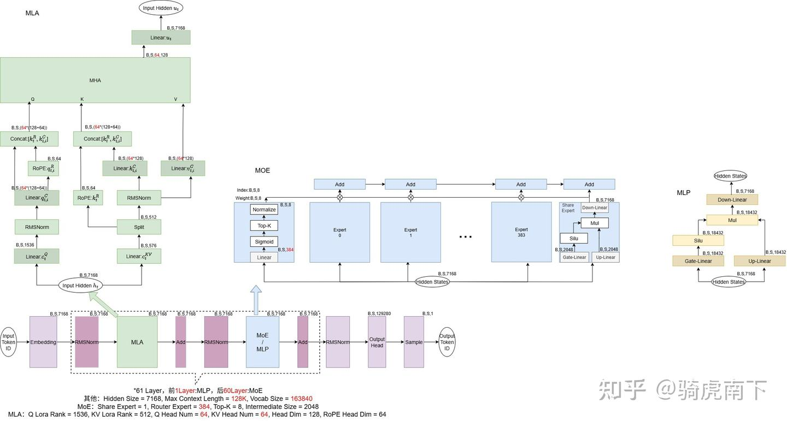

# Kimi-K2与Deepseek V3的区别

**Author:** 骑虎南下

**Date:** 2025-07-21

**Link:** https://zhuanlan.zhihu.com/p/1930344281052280446

这里，从模型推理部署的角度，简单介绍下最新开源的[Kimi-K2](https://zhida.zhihu.com/search?content_id=260597779&content_type=Article&match_order=1&q=Kimi-K2&zhida_source=entity)模型与[Deepseek V3](https://zhida.zhihu.com/search?content_id=260597779&content_type=Article&match_order=1&q=Deepseek+V3&zhida_source=entity)的区别。

### 模型结构与算子

参考Deepseek-V3模型结构解析，[Deepseek R1/V3模型结构总览](https://zhuanlan.zhihu.com/p/1901297297331029667)，整理两区别如下：

1 . Deepseek-V3是前3层 [Dense Layer](https://zhida.zhihu.com/search?content_id=260597779&content_type=Article&match_order=1&q=Dense+Layer&zhida_source=entity)，后58层 [MoE Layer](https://zhida.zhihu.com/search?content_id=260597779&content_type=Article&match_order=1&q=MoE+Layer&zhida_source=entity)；Kimi-K2是第1层 Dense(MLP)，后60层 MoE 。

2 . Deepseek-V3的Vocab Size是129280，Kimi-K2是163840，这导致Embedding与Ouput-Head计算量差异。

3 . [MLA模块](https://zhida.zhihu.com/search?content_id=260597779&content_type=Article&match_order=1&q=MLA%E6%A8%A1%E5%9D%97&zhida_source=entity)算子逻辑完全一致，Head数由Deepseek-V3的128Head变成缩减为64Head。

4 . MoE模块Router取消了路由专家的分组，Router逻辑是直接从384个路由专家中为每个Token选8个专家。

原来Deepseek-V3的256路由专家增加到384路由专家，仍然保留一个共享专家。

5 . 其中路由专家，共享专家，第一层的MLP的参数规模均与Deepseek-V3一致，计算逻辑也一致。

如上图，标红部分均为与Deepseek-V3结构有差异的地方。

### 模型参数大小

参考[Deepseek-V3/R1参数量分析](https://zhuanlan.zhihu.com/p/1917829085293416644)，我们分析整个K2**大致**参数量分布如下 ：

**1 . Embedding :**

$[B,S] * [163840, 7168] = [B,S, 7168]$ 参数量：1.174B。

**2 . Output Head:**

$[B,S,7168] * [7168, 163840] = [B,S,163840]$ 参数量：1.174B。

**_MoE模块参数量：_**

**1 . [Router模块](https://zhida.zhihu.com/search?content_id=260597779&content_type=Article&match_order=1&q=Router%E6%A8%A1%E5%9D%97&zhida_source=entity) Linear：**

$[B,S,7168] * [7168,384] = [B,S,384]$ 参数量：0.00275B。

**2 . 单个[Shared Expert](https://zhida.zhihu.com/search?content_id=260597779&content_type=Article&match_order=1&q=Shared+Expert&zhida_source=entity) 与 Router Expert：**

**Gate Linear :**

$[B,S,7168] * [7168,2048] = [B,S,2048]$ 参数量：0.01468B。

**Up Linear :**

$[B,S,7168] * [7168,2048] = [B,S,2048]$ 参数量：0.01468B。

**Down Linear :**

$[B,S,2048] * [2048,7168] = [B,S,7168]$ 参数量：0.01468B。

单MoE中，共384个Router Expert，1个Share Expert，1个Router Linear，权重参数个数为：16.911B。

整个模型中，共60层MoE模块的权重参数量为：1015.732B。

**_MLA模块参数量：_**

**1 . Linear:** $c_t^Q$ **：**

$[B,S,7168] * [7168,1536] = [B,S,1536]$ 参数量：0.011B。

**2 . Linear:** $q_{t,i}^{C}$ **：**

$[B,S,1536] * [1536,64*192] = [B,S,64*192]$ 参数量：0.01887B。

**3 . Linear :** $c_t^{KV}$ **：**

$[B,S,7168] * [7168,576] = [B,S,576]$ 参数量：0.00413B。

**4 . Linear:** $k_{t,i}^C$ **：**

$[B,S,512] * [512,64*128] = [B,S,64*128]$ 参数量：0.00419B。

**5 . Linear:** $v_{t,i}^C$ **：**

$[B,S,512] * [512,64*128] = [B,S,64*128]$ 参数量：0.00419B。

**6 . Linear:** $u_t$ **：**

$[B,S,64*128] * [64*128,7168] = [B,S,7168]$ 参数量：0.460B。

单MLA中，所有Linear权重参数为：0.962B，整个模型，共61层Linear权重总参数是：58.685B。

**_MLP模块参数量：_**

**Gate Linear :**

$[B,S,7168] * [7168,18432] = [B,S,18432]$ 参数量：0.132B。

**Up Linear :**

$[B,S,7168] * [7168,18432] = [B,S,18432]$ 参数量：0.132B。

**Down Linear :**

$[B,S,18432] * [18432,7168] = [B,S,7168]$ 参数量：0.132B。

单MLP中，三个Linear的权重的参数量为：0.396B，整个模型中，共1层MLP权重的参数量为：0.396B。

### 推理部署的优化手段

1 . Attention模块是典型的MLA结构，参考[Deepseek R1/V3 的MLA矩阵吸收](https://zhuanlan.zhihu.com/p/1907125377597431898)，可以使用Deepseek-V3的Absorb方案将MLA模块的[MHA](https://zhida.zhihu.com/search?content_id=260597779&content_type=Article&match_order=1&q=MHA&zhida_source=entity)转换成[MQA](https://zhida.zhihu.com/search?content_id=260597779&content_type=Article&match_order=1&q=MQA&zhida_source=entity)。

2 . MLA模块的**Linear:** $k_{t,i}^C$与 **Linear:** $v_{t,i}^C$吸收之后，整个KVCache的大小为 $[B,S,576]$ ，同样适合做[PD分离](https://zhida.zhihu.com/search?content_id=260597779&content_type=Article&match_order=1&q=PD%E5%88%86%E7%A6%BB&zhida_source=entity)。

3 . 该模型未提供[MTP Module](https://zhida.zhihu.com/search?content_id=260597779&content_type=Article&match_order=1&q=MTP+Module&zhida_source=entity)，无法使用MTP采优化，参考：[Multi Token Prediction（MTP）技术](https://zhuanlan.zhihu.com/p/1901337553929508702) 。

4 . MoE模块结构与Deepseek-V3几乎一致，同样适用DeepEP优化，采用Dispatch与Combine做跨机跨卡通信，计算与通信的Pipeline同样适用。