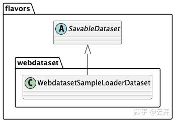
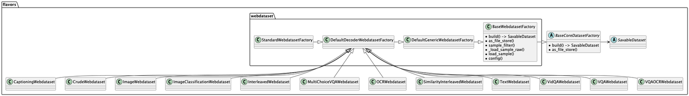
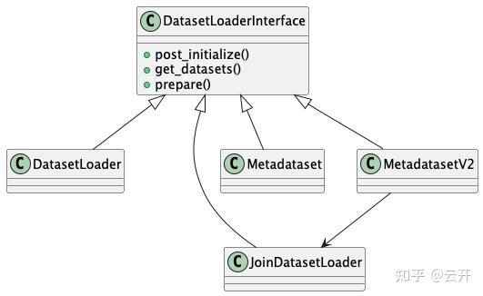
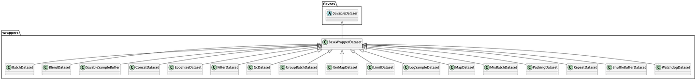
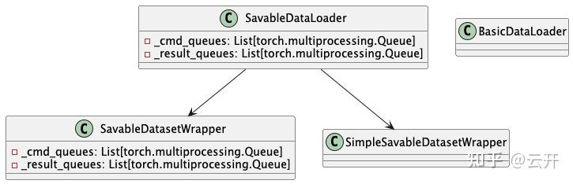
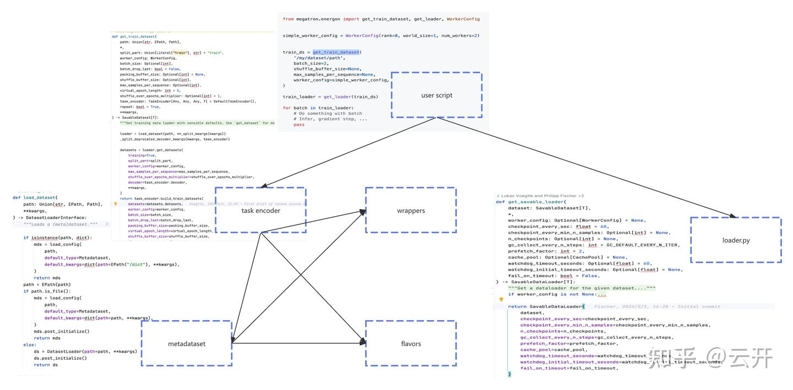

# 多模态训练 data loader: megatron energon

**Author:** 云开

**Date:** 2025-07-22

**Link:** https://zhuanlan.zhihu.com/p/1931058499212796205

本文是我阅读 [megatron energon](https://zhida.zhihu.com/search?content_id=260691882&content_type=Article&match_order=1&q=megatron+energon&zhida_source=entity) 代码后的一点总结，希望对读者阅读代码或更好地使用这个库有所帮助。本文不深入代码细节， 只浅析代码的整体结构与关键设计。

## 背景

数据加载是模型训练的第一步，是大模型训练 pipeline 中重要的一环。 一个比较完备的多模 data loader 库应该满足以下 3 点:

1、高效

-   高效的IO
-   多线程 \\ 多进程并行处理

2、灵活

-   灵活地支持支持各种模态数据的编解码
-   灵活地支持 blend、packing、padding、batching 等数据处理策略

3、数据复现与接续

-   支持数据 replay，方便消融实验
-   支持从断点续训，以便故障恢复

megatron energon 是 megatron 的多模态数据加载库， 它完全满足这 3 个点。 下面，我们来看看它大概是如何做到的。

## megatron energon

### 目录结构

以下只罗列关键部分

-   energon

-   flavors/

-   [webdataset](https://zhida.zhihu.com/search?content_id=260691882&content_type=Article&match_order=1&q=webdataset&zhida_source=entity)/

-   wrappers/
-   metadataset/
-   task\_encoder/
-   loader.py
-   savable\_loader.py

### 各模块设计与主要功能

flavors

WebdatasetSampleLoaderDataset

dataset factory

-   定义了基础的 WebdatasetSampleLoaderDataset， 读取 webdataset 格式文件
-   webdataset 格式把数据打包成大文件，避免了小文件读取的元信息频繁读取，同时大文件顺序读取也有利于充分利用 IO 带宽
-   WebdatasetSampleLoaderDataset 按 sample 的粒度把数据 shard 到各rank 的各个 loader worker 子进程
-   WebdatasetSampleLoaderDataset是 saveble 的， dataset 设计之初就考虑了数据状态恢复
-   预定义了一些 dataset [Datasetfactory](https://zhida.zhihu.com/search?content_id=260691882&content_type=Article&match_order=1&q=Datasetfactory&zhida_source=entity)， 工厂模式构建最初的 datasets

metadataset

metadataset

-   负责加载 yaml / 目录 对应的dataset 元信息 （配置、Datasetfactory)
-   负责构建最初的 dataset.

wrappers

wrapper datasets

-   实现各种 dataset wrapper
-   这些 dataset 都是 saveble 的
-   通过在 dataset之上套 wrapper 的方式，支持 blend、packing、padding、batching 等数据处理策略

task\_encoder

-   task encoder 负责组装 dataset （decode, pack， blend,...）, 这些组装行为都可以通过覆盖 task encoder 的方法或属性来自定义/配置
-   task encoder 最初的 dataset 配置来自 metadataset， 最初的 dataset 实例由 metadataset 建的 DataSetfactory build 而来。

savable\_loader.py

-   savable loader 继承了 torch 的 dataloader, 支持多进程加载数据
-   savable loader 给 dataset 套上一层 wrapper 来支持状态的 save 与 restore。
-   loader （main process）与 loader worker 子进程间通过 跨进程队列通信
-   loader worker 子进程定时保存 dataset 的状态 ckpt
-   loader worker cmd 监听线程， 收到 save 指令的时候， 查找离当前 sample index 最近的 ckpt, 返回 ckpt 以及 sample index 与 ckpt 之间的 offset
-   loader worker restore 时， 恢复 ckpt, 跳过 offset 条样本即可

### 模块间依赖关系

  

  

### 总结

-   使用 webdataset 以及 torch dataloader 实现数据的高效加载
-   flavors, task encoder 支持不同程度的灵活配置与定制化
-   savable loader 实现数据复现与接续