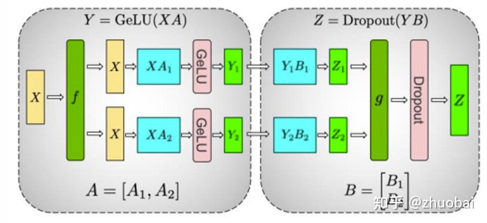

# CS336学习记录-Lec7&8

**Author:** zhuobai

**Date:** 2025-07-24

**Link:** https://zhuanlan.zhihu.com/p/1930022560000614792

终于学习到并行训练（Parallelism）这一部分了！还记得去年刚进组的时候，老师就让我去拜读 [DeepSpeed](https://zhida.zhihu.com/search?content_id=260573320&content_type=Article&match_order=1&q=DeepSpeed&zhida_source=entity) 的 [ZeRO](https://zhida.zhihu.com/search?content_id=260573320&content_type=Article&match_order=1&q=ZeRO&zhida_source=entity) 论文（[HTTPS://arxiv.org/pdf/1910.02054](https://link.zhihu.com/?target=https%3A//arxiv.org/pdf/1910.02054)），他说这是对他思想影响最大的几篇论文之一。老实说，当时由于基础知识不够，看得云里雾里，这次终于有机会系统地学习下该部分的知识，课程中也会详细讲解 ZeRO 的三个阶段。那话不多说，让我们正式开始！

## Lecture7-Parallelism 1

这两节系列课的 goal：

-   理解训练超大模型时系统层面的复杂性
-   掌握不同的 parallelization paradigms，以及为什么人们通常会同时使用多种并行方式
-   了解大规模训练任务通常是如何进行的

那今天这堂课主要由三部分组成：LLM 基本的 networking；parallel LLM training 的不同形式；利用 parallelism 训练和 Scaling 大模型。

单块 GPU 是完全无法满足我们 scaling 的需求的，compute 的速度不够，memory 无法 fit 大多数的 LMs，那我们应该怎么办呢，**_我们需要 Multi-GPU, multi-machine parallelism_**，就像下面这张图：


高性能计算架构示例

首先，我们先讲一些 collective communication 的 basic 知识。All Reduce：每个位置的结果是所有输入的数据之和，实际应用于梯度同步。[Broadcast](https://zhida.zhihu.com/search?content_id=260573320&content_type=Article&match_order=1&q=Broadcast&zhida_source=entity)：将输入的数据分发给所有 rank，实际应用于分发模型参数或初始数据。[All Gather](https://zhida.zhihu.com/search?content_id=260573320&content_type=Article&match_order=1&q=All+Gather&zhida_source=entity)：每个 rank 拿到的是所有 rank 数据的拼接（**注意这里与 All Reduce 的求和不同，很重要！**），用于收集激活值或特征图。[Reduce Scatter](https://zhida.zhihu.com/search?content_id=260573320&content_type=Article&match_order=1&q=Reduce+Scatter&zhida_source=entity)：每个 rank 拿到的是输入总和中分散对应部分的计算结果，用于分担梯度计算或数据处理。需要注意下：Reduce 可以由 reduce-scatter 和 all-gather 组合而成。


basic 知识的图示

OK，讲完这些初始的知识后，我们正式进入第二部分也是最核心的部分：不同形式的 parallel！

-   [Data parallelism](https://zhida.zhihu.com/search?content_id=260573320&content_type=Article&match_order=1&q=Data+parallelism&zhida_source=entity)

那最早之前的 data parallelism 的怎么做的呢，假设我们来计算一个 SGD：我们会把 B 大小下的 batch 分给 M 个不同的机器，然后交换梯度去同步计算。这种情况对于 Compute scaling，每个 GPU 计算 B/M 个数据（不错！）；对于 Communication overhead，每个 batch 需要转移两次梯度（发送和接受）；对于 Memory scaling，完全没有，每个 GPU 都需要复制一次模型参数。


SGD（stochastic gradient descent）随机梯度下降计算公式

那早期的 data parallelism 问题在哪里呢，memory 是个主要的问题，我们需要把模型参数复制给每个 GPU，比如下面这张简易的示意图。**_而实际中 memory 的内存使用情况比我们初步的直觉判断还要糟糕_**，模型的每种参数需要保存 5 个副本：BF16 的模型参数、BF16 的梯度和 Optimizer state（FP32 的主权重、Adam 的 first/second moment estimates），也就是每个参数占用 16 个 bytes（2\*2+4\*3）。


早期 data parallelism 的示意图

ZeRO 就是用来解决上述传统 DP 的 memory 问题的，core idea 就是将这些 state 分割然后使用 reduce-scatter equivalence。

那 ZeRO 第一阶段主要聚焦于 optimizer state sharding。把 optimizer state（first + second moments）分给每个 GPU，每个 GPU 都有 parameters + gradients，负责更新一部分 params，如下图所示。那具体应该怎么做呢。


第一阶段 optimizer state sharding 示意图，绿色代表 optimizer state

1.  每个 GPU 根据分配到的 batch 子集计算完整的梯度，此时只拥有局部梯度
2.  利用 ReduceScatter 将所有 GPU 的局部梯度汇总并分散到每个设备上，现在每个 GPU 只持有全局梯度的一部分
3.  每个 GPU 利用局部梯度和 optimizer state 更新该部分参数
4.  利用 AllGather 将所有 GPU 的部分参数收集并分发给所有设备，确保每个 GPU 拥有完整的参数。

这种方法的通信开销并没有增加，而且 memory 减少了接近四倍（上图）。

那 ZeRO 的第二阶段我们利用一阶段的思想（增加通信和计算），聚焦于 gradient sharding。这样操作的复杂性在于我们无法实例化一个完整的梯度向量，但每个 GPU 必须计算完整的梯度（因为 data parallel）。如何操作呢：


第二阶段 gradient sharding 示意图

1.  每张卡计算完某一层的梯度后，立即进行 reduce 操作，将对应梯度加总并发给负责该参数的那一张卡，不需要每张卡都存全部梯度，一旦梯度不再用于反向传播，立即释放内存
2.  各 GPU 用自己负责的梯度（**_对应参数的梯度，与第一阶段的局部梯度不同_**） + optimizer state 更新参数
3.  参数 All-Gather 同步

OK，那既然 gradient 和 optimizer state 都能 sharding，为何不 shard everything 呢


第三阶段 shard everything 示意图

我们不妨通过一个例子来看看第三阶段的一些重要设计思路。如下图所示，在 forward 过程中，多个 all-gather 操作（AG0, AG1, AG2）同时发生，收集分布式参数，这些操作（通信）与 forward 计算重叠，减少通信等待时间，参数在用完后立即释放（Parameter Free）。在 backward 计算开始后，执行 reduce-scatter（RS2）以汇总梯度，梯度被分片并分散，之后每个设备更新自己的参数。


计算示例

跑题一下，这两天我正好在训练 MMaDA 模型，我用 8 张 32G 显存的 V100 测试了下 ZeRO 第三阶段和单卡运行代码的不同，单卡运行大概占用二十多 G 的显存，而第三阶段的 ZeRO 分布到每张卡有 700 兆左右，减少了很多显存的需求，但我也能感觉到由于增加了通信， 等待的时间明显变久了。

但是 data parallel 还是存在一些问题，Stage 1 和 Stage 2 无法有效扩展内存所以不能支持很大的模型，而 stage 3 理论上是一个很好的解决方案，但实际中速度较慢，且无法减少 activation memory。那我们不妨试一试 split up the model，进入第二种 parallelism：

-   Beyond data parallel – [model parallelism](https://zhida.zhihu.com/search?content_id=260573320&content_type=Article&match_order=1&q=+model+parallelism&zhida_source=entity)

model parallelism 可以在不改变 batch size 的情况下 Scaling up in memory，它会像 zero3 一样把参数分布给 GPU，但是 communicate activations（zero3 sends params）。因为 cut up model 的形式不同，所以总共有两类：[Pipeline parallel](https://zhida.zhihu.com/search?content_id=260573320&content_type=Article&match_order=1&q=Pipeline+parallel&zhida_source=entity) 和 Tensor parallel，我们先从前者开始！

很自然的我们会想到模型有很多 layer 构成，我们把 layers cut up 然后分布到 GPU，交换 activations。但这样的话利用率会非常低，每个 GPU 大部分时间都在空闲，等待反向传播的完成。我们可以尝试在一个 bubble 中发送完后马上计算第二个，但是我们需要很大的 batch size。现在也有一些工作比如‘Zero bubble’pipelining 在尝试推进这方面工作，但 Pipeline parallel 在实际操作中其实是非常复杂的。


Layer-wise parallel 示意图

那我们在 depth 的角度 cutting up 去实现 pipeline parallel，我们能不能从 width 角度思考呢，比如矩阵乘法？把两个很大的矩阵分割成不同的小矩阵放在不同的 GPU，比如下面这张图：复制两份输入 X，将矩阵 A 和 B 分割，分别进行计算，在前向过程中 g 是一次 all-reduce，反向过程类似。这种方法的优点无需等待其他部分，不需要 bubble；复杂度很低 - 无需大幅更改基础设施；不需要 large batch sizes 也能良好运行。缺点在于 communication 远大于 pipeline parallel。



Tensor parallel 示意图

我们之前一直只讨论 memory 而没有 activations，但实际上它也会很大占很多显存！那最后一部分我们来到：

-   Sequence parallel


parallel 后 activation memory 不断变高

Sequence parallel 通过沿 sequence axis 对神经网络的层进行分割来优化 activation 内存使用并实现线性内存扩展。将 LayerNorm 和 Dropout 等操作沿着序列轴分割，在前向过程中 g 表示 all gather，将数据从不同序列单元收集起来；『g』 表示 reduce-scatter，将部分计算结果分发到不同单元。


Sequence parallel 示意图

最后主要讲了下其他模型的使用情况，比如 DeepSeek V3 – ZeRO stage 1 with Tensor, Sequence, and Pipeline parallel（16）等，Llama3 405B 和 Gemma 2，这里就不详细记录了。

## Lecture8-Parallelism 2

在课堂内容开始之前，我们先来回顾下多 node 多 GPU 的结构，如下图。我们把结构层次化（从 small/fast to big/slow）：Single node, single GPU: L1 cache / shared memory；Single node, single GPU: HBM；Single node, multi-GPU: [NVLink](https://zhida.zhihu.com/search?content_id=260573320&content_type=Article&match_order=1&q=NVLink&zhida_source=entity)；Multi-node, multi-GPU: NVSwitch。


多 node 多 GPU 示意图

这节课我们主要把上节课提到的概念用代码实现，主要分为两个 part：

-   Part 1: building blocks of distributed communication/computation
-   Part 2: distributed training

第一个 part 主要利用 pytorch 封装好的函数用一些例子来计算上节课提到的 collective communication 的知识。

all-reduce 操作：

```python3
# 输入                                          
tensor([1,2,3,4],device=『cuda:1』)
tensor([3,4,5,6],device=『cuda:3』)
tensor([0,1,2,3],device=『cuda:0』)
tensor([2,3,4,5],device=『cuda:2』)
# 输出
tensor([6,10,14,18],device=『cuda:1』)
tensor([6,10,14,18],device=『cuda:3』)
tensor([6,10,14,18],device=『cuda:0』)
tensor([6,10,14,18],device=『cuda:2』)
```

reduce-scatter 操作：

```text
# 输入与 all-reduce 类似
# 输出
tensor([10],device=『cuda:1』)
tensor([18],device=『cuda:3』)
tensor([6],device=『cuda:0』)
tensor([14],device=『cuda:2』)
```

all-gather 操作：

```text
# 输入是 reduce-scatter 的输出
# 输出
tensor([6,10,14,18],device=『cuda:1』)
tensor([6,10,14,18],device=『cuda:3』)
tensor([6,10,14,18],device=『cuda:0』)
tensor([6,10,14,18],device=『cuda:2』)
```

通过这样简单的示例就能很清晰的了解这些操作具体对应的数值变化，而且我们也可以观察到：all-educe = reduce-scatter + all-gather。最后还对这些操作做了一些 benchmarking 计算时间，这里就不详细记录了，直接看原视频感受下即可。

OK，来到第二个 part！也是这节课的核心：distributed training。

对于 data parallelism，代码主要是这样简易实现的（注意 all-reduce 操作的位置在计算梯度后，optimizer 更新前）。每个 GPU 计算的 loss 不同，梯度被 all-reduced 到不同的 GPU，因此每个 GPU 的参数是保持一致的。

```python3
def data_parallelism_main(rank: int, world_size: int, data: torch.Tensor, num_layers: int, num_steps: int):
    for step in range(num_steps):
        # Forward pass
        x = data
        for param in params:
            x = x @ param
            x = F.gelu(x)
        loss = x.square().mean()  # Loss function is average squared magnitude
        # Backward pass
        loss.backward()
        # Sync gradients across workers (only difference between standard training and DDP)
        for param in params:
            dist.all_reduce(tensor=param.grad, op=dist.ReduceOp.AVG, async_op=False)
        # Update parameters
        optimizer.step()
```

那对于 tensor parallelism，每个 GPU 获取部分 layer（submatrix），传输所有的 data 和 activation。代码实现如下（把一个 num\_dim \* num\_dim 的矩阵分割为 GPU 数量个 num\_dim \* local\_num\_dim）：

```text
def tensor_parallelism_main(rank: int, world_size: int, data: torch.Tensor, num_layers: int):
    local_num_dim = int_divide(num_dim, world_size)  # Shard `num_dim` 
    # Create model (each rank gets 1/world_size of the parameters)
    params = [get_init_params(num_dim, local_num_dim, rank) for i in range(num_layers)]
    # Forward pass
    x = data
    for i in range(num_layers):
        # Compute activations (batch_size x local_num_dim)
        x = x @ params[i]  # Note: this is only on a slice of the parameters
        x = F.gelu(x)
        # Allocate memory for activations (world_size x batch_size x local_num_dim)
        activations = [torch.empty(batch_size, local_num_dim, device=get_device(rank)) for _ in range(world_size)]
        # Send activations via all gather
        dist.all_gather(tensor_list=activations, tensor=x, async_op=False)
        # Concatenate them to get batch_size x num_dim
        x = torch.cat(activations, dim=1)
```

课程的最后主要是对前面的课程做了一些总结，并且介绍了一些新的框架，这里就不详细记录了，内容基本和 lec 7 一致。

晚上八点 NeurIPS 就要开始 rebuttal 了，后面一周应该不会有时间更新了，我会从八月开始继续坚持学习并记录的！