# 【论文阅读】Demystifying NCCL: An In-depth Analysis of GPU Communication Protocols and Algorithms

**Author:** Han Shen

**Date:** 2025-07-25

**Link:** https://zhuanlan.zhihu.com/p/1932137763840458794

看到一篇介绍NCCL的文章，觉得很不错，用 LLM 详细记录了一下核心内容（也是开始LLM辅助阅读的一个初步尝试）。

* * *

**论文标题**: [Demystifying NCCL: An In-depth Analysis of GPU Communication Protocols and Algorithms](https://link.zhihu.com/?target=https%3A//www.arxiv.org/abs/2507.04786)

**作者**: Zhiyi Hu, Siyuan Shen, Tommaso Bonato, Sylvain Jeaugey, Cedell Alexander, Eric Spada, James Dinan, Jeff Hammond, Torsten Hoefler

**机构**：ETH Z ̈urich, NVIDIA, Broadcom

  

## **A1. 主要贡献**

这篇论文旨在揭开 [NVIDIA Collective Communication Library](https://zhida.zhihu.com/search?content_id=260832618&content_type=Article&match_order=1&q=NVIDIA+Collective+Communication+Library&zhida_source=entity) (NCCL) 的内部工作机制之谜。尽管 NCCL 是开源的，但其内部设计，如通信信道的编排、协议的选择以及跨设备和节点的内存移动处理等关键方面缺乏清晰的文档，导致研究人员和工程师难以分析其性能或识别瓶颈 。

该研究的核心目标和贡献如下：

-   **系统性内部架构分析**：论文对 NCCL (版本 2.19.1) 进行了全面而系统的探索，主要集中在四个方面：

1.  **通用概览**：包括 API 结构和通信信道管理 。
2.  **通信协议**：详细审查了 Simple、LL (Low Latency) 和 LL128 三种协议的变体 。
3.  **数据传输模型**：分析了 NCCL 在节点内和节点间的数据传输模式 。
4.  **集合通信算法**：全面分析了基于环（Ring）和树（Tree）的集合通信算法 。

-   **为性能建模提供基础**：本研究获得的见解为性能建模和架构优化提供了重要背景 ，并已成功应用于 ATLAHS ——一个应用跟踪驱动的网络模拟器工具链，该工具链能够精确复现大规模 AI 训练工作负载中的 NCCL 通信模式 。
-   **指导从业者**：通过阐明 NCCL 的内部设计原则，这项工作为系统研究人员、互连设计师、网络架构师和性能工程师提供了指导，帮助他们在以 GPU 为中心的高性能计算环境中做出更明智的优化决策 。

## **A2. 背景知识与设计原则**

### **II. NCCL OVERVIEW**

**A. NCCL API**

NCCL 旨在为 GPU 集群提供高度优化的集合通信操作，强调低延迟和高带宽 。其 API 抽象了复杂的技术细节，主要提供四类功能 ：

-   **1) Communicator Management (通信器管理)**：所有通信操作都在通信器的上下文中执行，这与 MPI 类似 。每个参与通信的 GPU 都维护一个通信器对象 。当所有设备在单个进程中管理时，可使用ncclCommInitAll 统一创建 ；对于多进程或多线程环境，每个进程需调用ncclCommInit Rank 并传入一个共享的唯一标识符来建立通信器 。通信任务完成后，应使用ncclCommDestroy（安全销毁，会等待挂起操作完成）或 ncclCommAbort（立即终止，用于错误恢复以避免死锁） 来释放资源。
-   **2) Collective Communication (集合通信)**：NCCL 提供五种集合操作：ncclAllReduce、ncclBroadcast、ncclReduce、ncclAllGather 和 ncclReduceScatter 。历史上，NCCL 曾包含一个名为ncclBcast 的 ncclBroadcast 的in-place（原地）变体，以模仿 MPI\_Bcast 的行为 。然而，为了支持更通用的场景并实现更规整的API，后续引入了支持独立发送和接收缓冲区的ncclBroadcast 。如今ncclBcast 已基本被弃用，主要为兼容 MPI 风格的接口而保留 。
-   **3) Point-to-Point Communication (点对点通信)**：NCCL 通过 neclSend 和 ncclRecv 支持点对点操作 。
-   **4) Group Calls (组调用)**：为聚合操作并减少开销，NCCL 提供了 ncclGroupStart 和 ncclGroupEnd 。这些函数包裹一系列 NCCL 调用，并将它们的执行延迟到组结束时 。分组操作可以包含多个 Send/Recv 调用（以模拟 SendRecv、All-to-One 等模式）或一组集合操作 。这种聚合方式能将所有分组操作作为单个 NCCL 启动的一部分一起执行，从而显著减少启动开销和延迟 。

**B. Launching Strategies**

NCCL 支持三种启动操作的执行模型，各有优劣 ：

-   **One CPU process per GPU (每GPU一进程)**：此模型能更好地控制进程放置 。通过将每个GPU绑定到独立进程，相关的CPU代码可以被调度在本地NUMA域上，从而改善数据局部性并降低内存访问延迟 。
-   **One CPU thread per GPU (每GPU一线程)**：当单个CPU进程通过多线程管理多个GPU时，可以实现高效的进程内内存共享 。这种设置允许跨rank直接访问内存，包括GPU缓冲区，从而减少通信时的内存拷贝开销 。
-   **One CPU thread for multiple GPUs (单线程管理多GPU)**：虽然此模型存在顺序内核启动和并发性降低的问题，但它提供了简单性、最小的CPU开销和确定性执行的优点 。这使其适用于小规模部署或优先考虑实现简便性的原型环境 。

**C. Communication Channels**

-   **硬件协同**：NCCL 通过 GPU、CPU 和网络接口（NIC）三个硬件组件协同通信。GPU 执行归约和数据移动，CPU 启动内核并管理主机端协调，NIC 在节点间传输数据包 。当只有一个流式多处理器（SM）处理 GPU 工作时，大消息会使其过载，导致其他 SM 未被充分利用，也无法饱和 NVLink 或 InfiniBand 等链路 。
-   **信道并行化**：为避免此瓶颈，NCCL 将每个集合操作细分为多个通信信道 。每个信道作为一个独立的 CUDA 块在各自的 SM 上运行，并且库会对输入缓冲区进行分区，使各信道能并行处理不相交的数据块 。这种细粒度的并行性提高了总吞吐量，尤其对于大数据负载 。将工作分散到多个信道还有助于在 NVLink 平台上的多个 NIC 之间平衡流量，因为每个信道可以独立地通过不同的 NIC 离开节点 。
-   **信道数量的权衡**：然而，过度使用多信道可能对网络效率产生负面影响 。当每个信道的数据块大小变得小于 NIC 传输所用的 512 KiB FIFO 缓冲区大小时，代理线程会发送部分填充的缓冲区 。这种利用不足会降低 PCIe 和网络吞吐量，尤其是在为启用 ECMP 负载均衡而激活多个队列对（QP）时 。NCCL 通过启发式地为小消息减少nChannels 的数量来解决此问题（参考 [http://enqueue.cc](https://link.zhihu.com/?target=http%3A//enqueue.cc) 中的 calcP2pChunkSize 函数）。因此，选择最佳信道数是在 GPU 端并行性与网络利用效率之间的一种权衡 。
-   **信道管理与拓扑**：信道管理在通信器级别进行协调 。在通信器初始化期间，NCCL 建立一组初始信道结构 。当调用集合操作时，NCCL 会动态选择算法和协议，其内部调优模型再根据所选策略、消息大小等因素决定使用多少个预建信道 。尽管早期版本允许用户通过环境变量（如NCCL\_NTHREADS）影响信道行为，但现在已不鼓励手动调优，这些设置通常会被忽略，甚至可能导致不正确的行为 。分配给每个信道的逻辑通信拓扑直接决定了数据流。在**环形拓扑**中，每个 GPU 识别其前驱和后继 。在**树形拓扑**中，每个 GPU 跟踪其父节点和子节点 。为提高带宽利用率，NCCL 采用了**双二叉树**结构（double binary tree structure），该思想由 Hoefler 等人提出 (【Energy, Memory, and Runtime Tradeoffs for Implementing Collective Communication Operations, 2014, Journal of Supercomputing Frontiers and Innovations】与 【Full bandwidth broadcast, reduction and scan with only two trees, 2007, PVM/MPI’07】) 。这些拓扑在通信器初始化时建立，并被所有集合操作复用 。

## **A3. 方法细节**

### **III. COMMUNICATION PROTOCOLS**

NCCL 采用多种通信协议来优化数据传输效率，主要包括 Simple、LL (Low Latency) 和 LL128，它们在带宽和延迟之间做出了不同的权衡 。

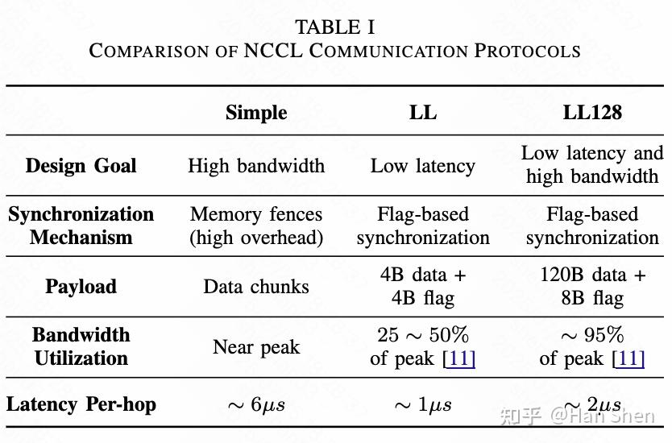

TABLE I: COMPARISON OF NCCL COMMUNICATION PROTOCOLS

**A. [Simple Protocol](https://zhida.zhihu.com/search?content_id=260832618&content_type=Article&match_order=1&q=Simple+Protocol&zhida_source=entity)**

-   **为高带宽设计**：Simple 协议旨在最大化带宽利用率，主要用于大消息传输 。它通过将数据分割成较大的数据块并在通信信道间分发，从而充分利用网络接口和 GPU 内存系统的高吞吐量 。
-   **基于内存屏障的同步**：为保证内存一致性，该协议使用内存屏障（memory fences）来强制执行正确的操作顺序和数据可见性 。接收方必须等待一个完整的数据块传输完毕后才能访问它 。虽然这种方法能确保正确性，但内存屏障引入了显著的开销，这成为小消息传输的限制因素，因为同步成本主导了总传输时间 。因此，Simple 协议虽然能为大消息实现接近峰值的带宽，但在处理小负载时延迟较高 。

**B. LL (Low Latency) Protocol**

-   **为低延迟优化**：为解决 Simple 协议的延迟问题，NCCL 引入了 LL 协议，该协议专为小消息优化，因为小消息场景下带宽通常未被充分利用 。
-   **基于标志的轻量级同步**：LL 协议不依赖内存屏障，而是使用轻量级的基于标志的同步（flag-based synchronization）。一个小的标志（flag）与数据一同传输以表示其有效性，使接收方一旦数据可用就能立即处理，无需昂贵的内存屏障 。
-   **实现细节与性能权衡**：每次 LL 协议传输包含 4 字节数据和 4 字节标志，通过 8 字节原子操作一同发送 。这种方法显著降低了同步开销 。然而，它强制要求中间缓冲区必须位于主机内存中，以便 CPU 可以轮询标志并检测数据何时准备好通过 NIC 发送 。这是因为通过 PCIe 轮询 GPU 内存比访问 DRAM 慢得多，并且需要显式同步来确保数据在主机上的可见性 。此设计虽然实现了低延迟，但也
-   **阻止了 GPUDirect RDMA 的使用**，严重限制了带宽 。因此，LL 协议通常只能达到峰值带宽的 25-50% ，仅在延迟至关重要且带宽利用率次要的小数据量传输中被优先选择 。

**C. [LL128 Protocol](https://zhida.zhihu.com/search?content_id=260832618&content_type=Article&match_order=1&q=LL128+Protocol&zhida_source=entity)**

-   **兼顾低延迟与高带宽**：LL128 协议在保持 LL 协议低延迟特性的同时，显著提高了带宽效率，尤其是在 NVLink 等高性能互连上 。它同样采用基于标志的同步来避免内存屏障，但以 128 字节为单位传输数据 。
-   **传输单元与性能**：在这 128 字节中，120 字节用于数据，8 字节保留给标志，使得该协议能够利用大约 95% 的峰值带宽 。在网络路径上，LL128 类似于 Simple 协议，发送方 GPU 会聚合一个相对较大的数据块，然后通知 CPU 发送 。虽然这种基于块的聚合限制了跨节点的流水线操作，但由于其较小的传输粒度，LL128 仍然能在节点内部实现细粒度的流水线 。
-   **硬件依赖性**：LL128 对硬件有更严格的要求，它依赖于 128 字节的原子写操作，这些操作不能被内存系统或互连拆分或重排 。在由于 PCIe 限制或其他架构约束而无法保证此类操作的系统中，NCCL 会禁用 LL128 以避免数据损坏 。

**D. Protocol Selection and Comparison**

-   **动态选择机制**：NCCL 在运行时根据用户设置（NCCL\_PROTO）、集合算法以及内部性能启发式动态地在 Simple、LL 和 LL128 协议中进行选择 。若未明确指定，NCCL 会使用一个调优模型，该模型综合考虑系统拓扑、GPU 架构、消息大小和预定义的性能指标来选择最佳的算法-协议对 。该选择受到内存等资源的限制 。通常，LL/LL128 被用于小消息以降低延迟，而 Simple 被用于大消息以最大化吞吐量 。

### **IV. DATA-TRANSFER METHODS AND TRANSPORT LAYER**

NCCL 根据通信是在单个节点内部（intra-node）还是跨多个节点（inter-node）发生，采用不同的数据传输策略和传输机制 。

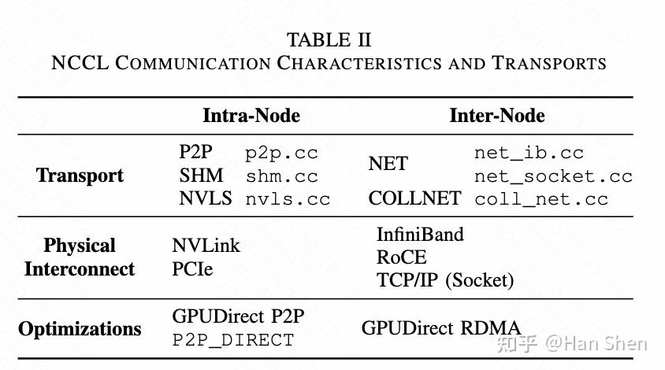

TABLE II: NCCL COMMUNICATION CHARACTERISTICS AND TRANSPORTS

**A. Intra-node Data Transfer** NCCL 采用分层方法进行节点内通信，优先选择最低延迟和最高带宽的路径 。它大量利用了 NVIDIA 的 GPUDirect Peer-to-Peer (P2P) 技术，该技术使 GPU 能直接访问彼此的内存，无需通过 CPU 系统内存中转 。

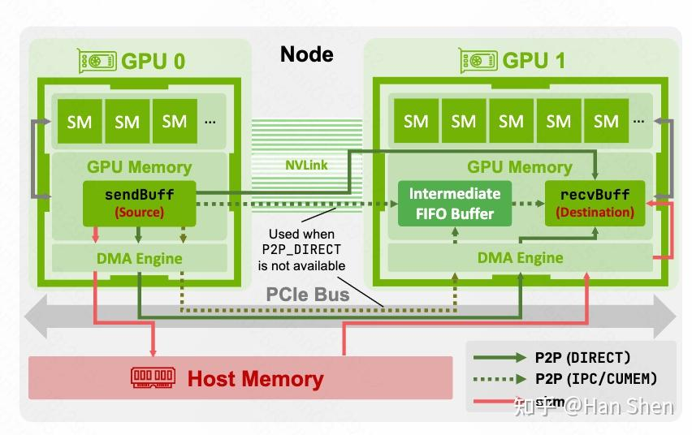

Fig. 1: 节点内数据传输路径图解。图中展示了 P2P (DIRECT)、P2P (IPC/CUMEM) 和 shm 三种不同的传输路径。P2P (DIRECT) 直接在两个 GPU 的内存之间通过 NVLink 或 PCIe 传输。当 P2P DIRECT 不可用时，数据会通过一个中间 FIFO 缓冲区。当 P2P 通信不可用或性能不佳时，会使用主机内存（Host Memory）

**P2P Transport (P2P传输)**：P2P 传输是核心策略，主要在 src/transport/[http://p2p.cc](https://link.zhihu.com/?target=http%3A//p2p.cc) 中管理 。当 GPU 通过 NVIDIA NVLink 互连时，NCCL 优先使用此路径实现 GPUDirect P2P 。若 NVLink 不可用，NCCL 会回退到通过 PCIe 总线使用 GPUDirect P2P 。

-   **P2P\_DIRECT 优化**：当通信的 rank 属于同一进程时，会启用 P2P\_DIRECT 模式 。此模式通过两种方式显著提高效率：首先，它通过在同一地址空间内使用直接的 GPU 内存指针，绕过了 IPC 句柄的需求 ；其次，它通过使用direct Send 和 direct Recv 等原语，直接在源和目标缓冲区之间传输数据，而不是通过中间 FIFO 缓冲区，从而消除了一个中间数据拷贝 。
-   **Shared Memory (SHM) Transport (共享内存传输)**：当直接 P2P 通信不可用或性能不佳时（例如，跨 CPU 插槽的 PCIe P2P 性能下降），NCCL 可能会利用 SHM 传输 。SHM 通过系统内存路由流量，利用 CPU 优化的 PCIe-内存和内存-PCIe 传输来避免性能问题 。
-   **通过NIC进行节点内通信**：在某些多插槽系统中，如果每个 GPU 位于独立的 CPU 插槽上，且各自拥有支持 GPUDirect RDMA 的本地 NIC，NCCL 可能会使用 NIC 进行节点内通信 。这种 GPU-NIC-NIC-GPU 路径利用 PCIe 带宽，避免了 CPU 互连的瓶颈 。此行为由 NCCL 的拓扑感知逻辑决定，并可通过NCCL\_CROSS\_NIC 等环境变量控制 。

**B. Inter-node Data Transfer** 节点间通信协调位于不同物理节点中的 GPU 之间的数据交换，涉及 GPU 执行 NCCL 内核、CPU 上的代理线程管理网络操作以及底层网络结构 。

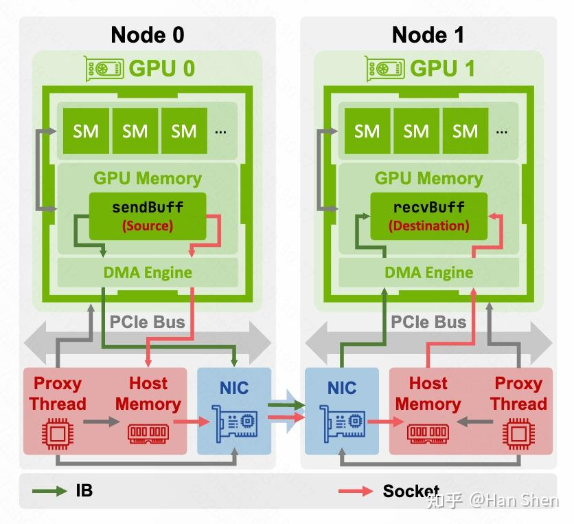

Fig2 : 节点间数据传输路径图解。图中展示了两种主要的网络传输路径：基于 InfiniBand (IB) 的和基于 Socket 的。IB 路径可以利用 GPUDirect RDMA 直接在 GPU 内存和 NIC 之间传输数据，而 Socket 路径则需要通过主机内存（Host Memory）作为中介进行数据拷贝 。

_(注意：原图标题误作“intra-node”)_

-   **1) Socket-Based Communication (基于套接字的通信)**：当网络接口不支持 RDMA 时，NCCL 使用在 transport/[http://net\_socket.cc](https://link.zhihu.com/?target=http%3A//net_socket.cc) 中实现的套接字传输 。在这种模式下，数据需从 GPU 拷贝到主机固定内存（pinned memory）中，然后通过标准套接字调用发送 。这会产生额外的 PCIe 总线拷贝开销 。
-   **2) IB Verbs Transport (IB Verbs 传输)**：对于 InfiniBand 或 RoCE 等高性能网络，NCCL 使用在 [http://net\_ib.cc](https://link.zhihu.com/?target=http%3A//net_ib.cc) 中实现的 IB 传输 。它利用 RDMA 功能以最少的 CPU 干预实现节点间的直接数据移动 。

-   **a) The GPUDirect RDMA (GDRDMA) Optimization**：GDRDMA 是 IB 传输中的一个关键优化，它使 NIC 能够直接访问 GPU 内存，从而消除了主机内存中转 。这仅在 NIC 和 GPU 连接到同一个 PCIe 交换机时使用 。CPU 代理线程使用如nv\_peer\_mem (【Developing a Linux Kernel Module using GPUDirect RDMA, 2025, NVIDIA Corporation】) 或 Linux DMA-BUF 子系统 (【Buffer Sharing and Synchronization (dma-buf), 2025,<a href="http://[http://kernel.org/](https://link.zhihu.com/?target=http%3A//kernel.org/)"> [http://kernel.org](https://link.zhihu.com/?target=http%3A//kernel.org)】) 等机制将 GPU 内存注册到 NIC，使其可以直接进行 RDMA 读写 。
-   **b) Per-peer Multi-channel Connections (每对等体多信道连接)**：为提高带宽利用率，IB 传输默认情况下为每个远程 GPU 和每个 NIC 实例化 2 个逻辑信道（由 NCHANNELS\_PER\_NET\_PEER 参数控制）。主机端的网络代理在发出ncclNet->isend() 调用时，会在这两个信道间交替（轮询），从而将流量分散到不同的 QP 集合中，为支持 ECMP 的网络结构引入路径多样性 。
-   **c) QP Layout (QP布局)**：对于每对 rank，RDMA 插件会建立两个可靠连接（RC）QP，每个方向一个 。前向 QP 负责批量数据流（RDMA\_WRITE），后跟一个 RDMA\_WRITE\_WITH\_IMM 用于完成通知 。反向 QP 只承载一个微小的“准备发送”（CTS）消息，即一个RDMA\_WRITE 。将控制流量（CTS）与数据流分离，可以避免队头阻塞，确保低延迟 。
-   **d) Local Flush with Loop-back RDMA READ (使用环回RDMA READ进行本地刷新)**：启用 GDRDMA 时，发送方必须确保所有未完成的 PCIe 写操作都已到达 GPU 内存 。NCCL 通过在最后一次接收完成后发出一个虚拟的RDMA\_READ 来实现这一点 。这个RDMA\_READ 操作被发送到一个连接自身的“刷新”QP上，因此读操作从未离开主机，但 Verbs 层会等待先前的 PCIe 写操作完成，从而提供了一个廉价的排序屏障 。

### **V. NCCL COLLECTIVE ALGORITHMS**

集合算法是 NCCL 的核心，它们通过将高级集合操作分解为低级通信原语并在多个并行信道上分发来实现 。算法的选择（通常是环形或树形）取决于具体操作、消息大小和拓扑等参数 。

**A. Overview of Algorithm and Protocol Support**

  

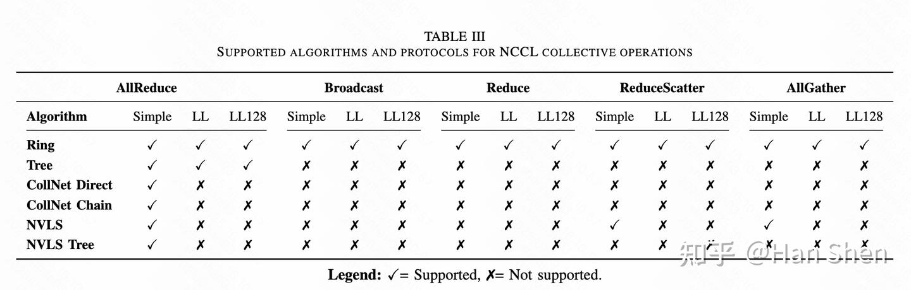

TABLE III: SUPPORTED ALGORITHMS AND PROTOCOLS FOR NCCL COLLECTIVE OPERATIONS

  

-   **专用算法**：除了常用的 Ring 和 Tree 算法，还存在专用的 **[CollNet](https://zhida.zhihu.com/search?content_id=260832618&content_type=Article&match_order=1&q=CollNet&zhida_source=entity)** 和 **NVLS** 算法 。CollNet 算法利用 NVIDIA SHARP 技术进行网络卸载，将归约等计算 offload 到交换机 。NVLS 算法则为 NVSwitch 系统设计，利用高带宽直连路径优化通信 。本文主要关注更具普适性的 Ring 和 Tree 算法 。

**B. Communication Primitives**

-   **构建模块**：高级集合操作由一组低级通信原语构成 。这些原语封装了发送、接收、归约和复制等基本操作 。
-   **命名与功能**：常见的原语包括 send、recv、recvReduceSend、recvCopySend 和 recvReduceCopySend 等 。其命名清晰地指示了操作序列，例如，recvReduceSend 表示一个 GPU 接收来自对等方的数据，与本地缓冲区进行归约，然后将结果发送给下一个 GPU 。这些原语针对环形和树形等具有固定、少量源和目标的拓扑进行了高度优化 。

**C. Iterative Execution of NCCL Collectives**

-   **数据分区与流水线**：NCCL 首先将用户数据划分到多个通信信道上 。每个信道处理一个连续的数据段 。如果一个信道的数据量超过其固定大小的缓冲区，NCCL 会将数据**分解为多次外部循环迭代** 。在每次外部循环迭代中，NCCL 通过将信道缓冲区划分为多个“槽”（slots，通常为8个，由NCCL\_STEPS 设置）来实现流水线 。每个槽可以独立地推进，从而重叠数据传输与计算 。

  

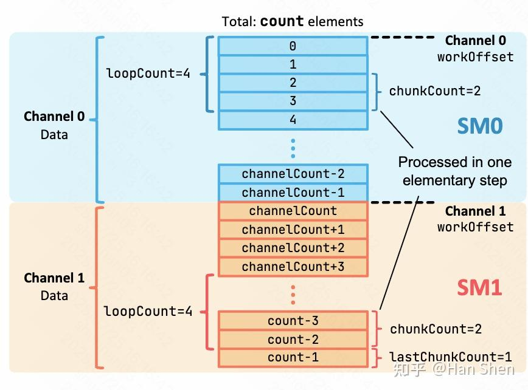

Fig. 3: NCCL 数据分区策略可视化。总数据被分割到不同信道（Channel 0, Channel 1）。每个信道再将自己的数据分为多个循环（loopCount），每个循环内又分为更小的块（chunkCount）进行处理，实现了多层次的并行 。

  

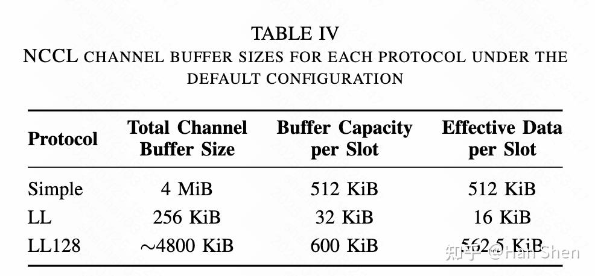

TABLE IV: NCCL CHANNEL BUFFER SIZES FOR EACH PROTOCOL UNDER THE DEFAULT CONFIGURATION

  

-   **“元素”的定义**：在 NCCL 中，“元素”的含义取决于集合操作。对于 ncclAllGather 和 ncclBroadcast，一个元素是一个字节 。对于ncclAllReduce、ncclReduceScatter 和 ncclReduce，一个元素对应于用户定义的数据类型（如 float），因为这些操作需要进行算术归约 。

**D. Mapping Communication Pipelines to CUDA Hierarchy**

-   **网格与块结构**：NCCL 内核以 (nChannels, 1, 1) 的网格维度启动，确保每个 CUDA 块（blockIdx.x）精确对应一个通信信道 。
-   **信道到块的映射**：通过一个 channelMask 位掩码来管理 blockIdx.x 和信道ID之间的映射 。
-   **Warp级组织**：在每个块内，Warp 0 加载通信器元数据，Warp 1 加载信道特定数据，其余的 Warp 执行实际的通信和计算工作 。
-   **基于槽的流水线执行**：NCCL\_STEPS 个槽使得线程级别的细粒度流水线成为可能。一个 Warp 内的线程协同工作，以循环方式通过这些槽移动数据 。
-   **并发流水线执行**：NCCL 并行执行多个信道，每个信道内流水线化多个槽，每个槽内由多个 Warp 处理不同阶段，这种多级并行是实现高带宽利用率的关键 。

**E. Qualitative Algorithm Analysis** 由于影响性能的变量过多（如GPU在节点间的分布），定量复杂度分析不切实际，因此本节采用定性分析 。算法根据其是否能对连续的循环迭代进行流水线操作分为两类：

**非流水线（non-pipelined）和流水线（pipelined）** 。

-   **1) Non-pipelined Pattern (非流水线模式)**

-   **特征**：每个 GPU 必须完成一次迭代中的所有任务才能开始下一次迭代 。适用于**Ring AllReduce**、**Ring AllGather** 和 **Ring ReduceScatter** 。
-   **a) Ring AllReduce**：该算法在一个循环中包含 2k−1 个步骤，结合了 ReduceScatter 和 AllGather 两个阶段（k为GPU数量） 。

-   **Reduce-Scatter 阶段 (步骤 0 到 k-1)**：每个 GPU 最初发送自己的一段数据（send），然后在接下来的 k−2 步中重复执行 recvReduceSend（接收、归约、发送），最后一步执行 recvReduceCopySend（接收、完成归约、复制到输出缓冲区并发送）。
-   **All-Gather 阶段 (步骤 k 到 2k-2)**：在此阶段，每个 GPU 接收完整的、已归约的数据块。GPU 重复执行 recvCopySend（接收、复制到输出、转发），最后一步执行 recv 完成收集 。

  

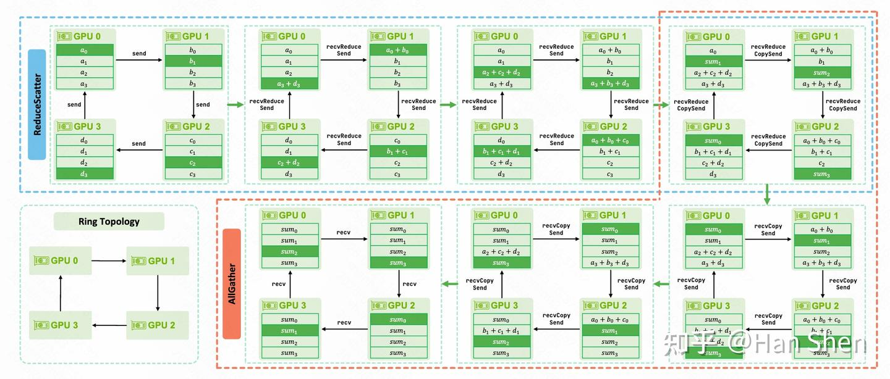

Fig. 4: Ring AllReduce 算法图解（4个GPU）。上半部分展示了 ReduceScatter 阶段，数据块在环上逐步归约；下半部分展示了 AllGather 阶段，已完全归约的数据块在环上传播，直到所有 GPU 都拥有完整结果 。

-   **b) Ring AllGather**：在 k−1 个步骤中，每个 GPU 收集所有 rank 的数据块 。起始 GPU 发送其本地块（send 或 copySend），中间 GPU 执行 recvCopySend 接收并转发，最后一个 GPU 执行 recv 。
-   **c) Ring ReduceScatter**：该算法执行归约，然后将结果的不同分片散发给每个 GPU 。初始步骤是send，中间步骤是 recvReduceSend，最后一步是 recvReduceCopy（接收、最终归约并复制到接收缓冲区）。

-   **2) Pipelined Pattern (流水线模式)**

-   **特征**：GPU 可以对连续的循环迭代进行流水线操作。适用于 **Tree AllReduce**、**Ring Broadcast** 和 **Ring Reduce** 。
-   **a) Tree AllReduce**：此算法在每次循环迭代中分为 Reduce 和 Broadcast 两个阶段，这两个阶段通常可以被两个非对称的 SM 分区并发执行 。

-   **Reduce 阶段**：叶子 GPU send 数据给父节点，中间 GPU recvReduceSend 向上归约，根 GPU recvReduceCopySend 完成最终归约并复制到输出 。
-   **Broadcast 阶段**：根 GPU recvCopySend 向下广播，中间 GPU 同样 recvCopySend 转发，叶子 GPU recv 。
-   **注意**：树形结构仅在节点间构建，节点内的 GPU 以简单的链式结构连接 。

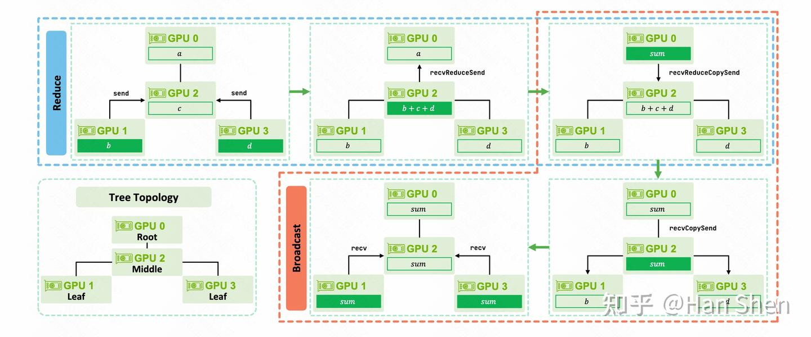

Fig. 5 : Tree AllReduce 算法图解（4个GPU）。上半部分为 Reduce 阶段，数据从叶子节点（GPU 1, 3）向根节点（GPU 0）汇聚并归约。下半部分为 Broadcast 阶段，归约完成的结果从根节点广播回所有 GPU 。

-   **b) Ring Broadcast**：数据从根 GPU 沿着环形拓扑构成的有向链顺序传播 。根 GPU 执行send 或 copySend，中间 GPU 执行 recvCopySend，最后一个 GPU 执行 recv 。
-   **c) Ring Reduce**：数据沿着链式路径流向根 GPU 并累积归约 。起始 GPU 执行send，中间 GPU 执行 recvReduceSend，根 GPU 执行 recvReduceCopy 完成操作 。

**F. Benchmarking**

  

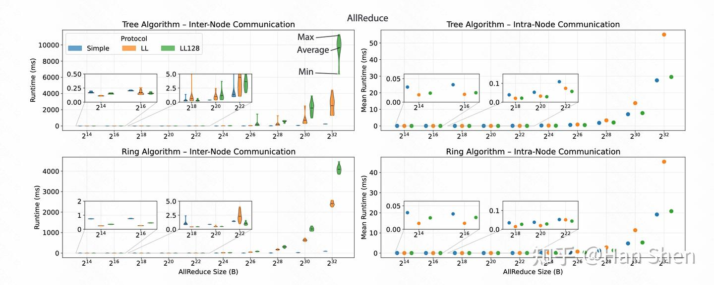

Fig. 6: Ring 和 Tree AllReduce 算法下各协议在节点内和节点间运行时的性能对比 。

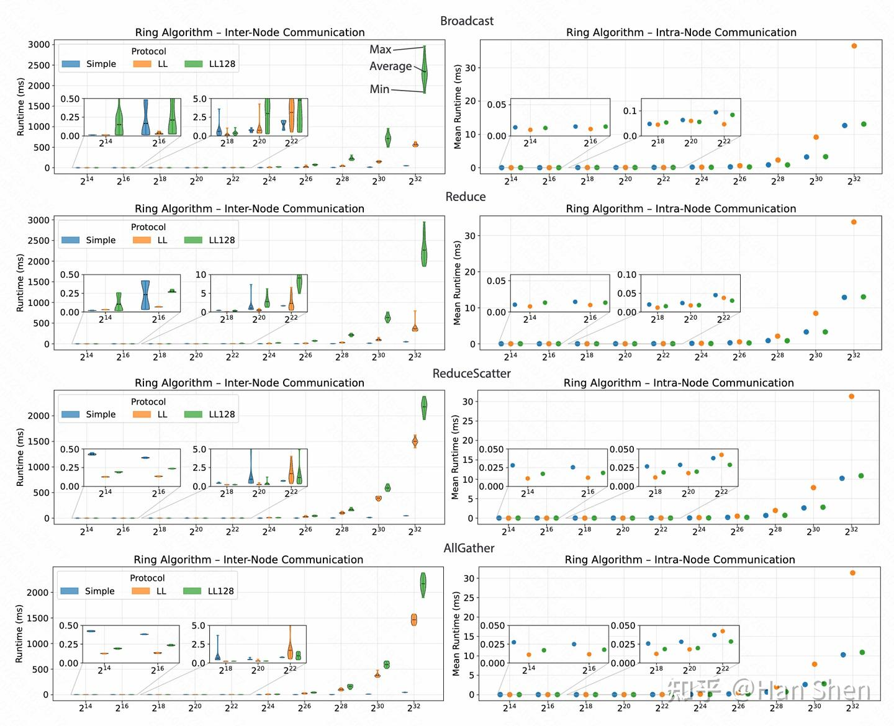

Fig. 7: 其他 NCCL 集合操作在节点内和节点间的运行时性能对比，趋势与 AllReduce 类似 。

**节点间性能 (Inter-node)**：对于 AllReduce，当消息较小（< 64 KiB）时，LL 和 LL128 协议表现最佳。但随着消息增大，它们的性能因细粒度标志同步（flag-based synchronization）在网络上的巨大开销而急剧下降 。相比之下，Simple 协议由于同步事件少，对网络延迟不敏感，在大消息上能保持高吞吐量，表现最好 。

-   **节点内性能 (Intra-node)**：在节点内（利用NVLink），LL128 协议在所有消息大小上都表现出卓越且一致的性能 。它在大消息上几乎与 Simple 协议性能持平（慢约5%），在小消息上与 LL 协议相当或稍差 。
-   **算法性能**：在节点内和节点间设置中，**Tree 算法**在处理小消息时性能更优，而 **Ring 算法**则在处理大消息时表现更佳 。

## **A4. 实验环境**

-   **硬件配置**：实验在瑞士国家超级计算中心（CSCS）的 Alps 超级计算系统上进行，使用了 16 个节点 。

-   **计算单元**：每个节点配备 NVIDIA Grace Hopper Superchips (GH200) 。
-   **互连**：

-   **节点内**：150 GB/s 的高带宽互连 。
-   **节点间**：Cray Slingshot 互连，每个节点提供 25 GB/s（单向）的网络链路 。

-   **软件配置**：

-   **库版本**：分析基于 NCCL 版本 2.19.1 。
-   **测试方法**：每个数据点由 20 次运行组成，并包含一个预热阶段 。

## **A5. 实验结果**

-   **评估指标**：主要评估 NCCL 集合操作的**运行时（Runtime）** 。
-   **核心发现**：

1.  **协议选择是关键**：实验结果证实，LL 和 LL128 协议最适合小消息，尤其是在节点间通信中；而 Simple 协议在大规模分布式传输（大消息）中表现始终优于其他协议 。
2.  **通信场景影响巨大**：节点内（intra-node）和节点间（inter-node）的通信性能差异显著，特别是 LL128 协议在两种配置下表现截然不同 。
3.  **算法选择依赖消息大小**：Tree 算法对小消息友好，Ring 算法对大消息友好 。
4.  **相信自动调优**：尽管手动选择协议可用于特定调优，但在大多数情况下，依赖 NCCL 的自动调优（autotuning）机制，让其根据工作负载特性选择协议，通常能提供稳健的性能和可扩展性 。

## **方法细节中的引用汇总**

以下是论文方法章节（III, IV, V）中引用的参考文献及其在文中的作用：

-   **\[9\] P. Sanders, J. Speck, and J. L. Träff, “Full bandwidth broadcast, reduction and scan with only two trees,” (2007, PVM/MPI’07)**

-   **引用位置**: Section II-C, Communication Channels
-   **原文描述**: "To increase bandwidth utilization, NCCL employs a double binary tree structure \[9\], \[10\]: no node is a non-leaf in both trees, and at most one node appears as a leaf in both."
-   **作用**: 支撑了 NCCL 采用双二叉树拓扑结构以提升带宽利用率这一设计选择。

-   **\[10\] T. Hoefler and D. Moor, “Energy, Memory, and Runtime Tradeoffs for Implementing Collective Communication Operations,” (2014, Journal of Supercomputing Frontiers and Innovations)**

-   **引用位置**: Section II-C, Communication Channels
-   **原文描述**: 同上，与 \[9\] 一同引用，作为双二叉树结构的理论依据。
-   **作用**: 同上。

-   **\[11\] S. Jeaugey, “Distributed deep neural network training: Nccl on summit.” (2019, Presentation slides)**

-   **引用位置**: Table I, Comparison of NCCL Communication Protocols
-   **原文描述**: 在表格中被引用，为 Simple 和 LL128 协议的带宽利用率提供数据来源。
-   **作用**: 提供量化的性能数据。_(注意：该数据与正文描述存在出入)_

-   **\[12\] zegao96, “NCCL GitHub Issue # 609: why uses rdma write for default ib traffic.” (2021, GitHub Issue)**

-   **引用位置**: Section IV-B, IB Verbs Transport
-   **原文描述**: "The GPU kernel copies data to this buffer, and the proxy thread posts an RDMA operation to move the data from host memory to the remote node with RDMA write \[12\]."
-   **作用**: 解释了在 IB 传输中，默认使用 RDMA write 操作的原因，提供了实现细节的佐证。

-   **\[13\] NVIDIA Corporation, Developing a Linux Kernel Module using GPUDirect RDMA. (2025, NVIDIA Documentation)**

-   **引用位置**: Section IV-B, The GPUDirect RDMA Optimization
-   **原文描述**: "The CPU proxy thread registers this GPU memory with the RDMA-capable NIC using mechanisms such as nv\_peer\_mem \[13\] or the Linux DMA-BUF subsystem \[14\]..."
-   **作用**: 指出 nv\_peer\_mem 是实现 GPUDirect RDMA 时用于注册 GPU 内存的关键机制之一。

-   **\[14\] Linux Kernel Documentation Project, Buffer Sharing and Synchronization (dma-buf). (2025,**<**a href="htt**p://[http://kernel.org/](https://link.zhihu.com/?target=http%3A//kernel.org/)"> [http://kernel.org](https://link.zhihu.com/?target=http%3A//kernel.org))

-   **引用位置**: Section IV-B, The GPUDirect RDMA Optimization
-   **原文描述**: 同上，与 \[13\] 一同引用。
-   **作用**: 指出 DMA-BUF 是实现 GPUDirect RDMA 的另一种机制。

-   **\[15-17\] Rabenseifner (2004), Patarasuk & Yuan (2009), Thakur et al. (2005)**

-   **引用位置**: Section V, NCCL Collective Algorithms
-   **原文描述**: "The choice of algorithm, typically ring or tree, depends on the specific collective operation and relevant execution parameters such as message size and topology \[15\]-\[17\]."
-   **作用**: 作为背景知识，说明集合通信中算法选择（如环形或树形）依赖于消息大小和拓扑是该领域已有的共识和研究方向。

-   **\[18\] NVIDIA, “NCCL Issue #320: NVLS and CollNet Support.” (2021, GitHub Issue)**

-   **引用位置**: Section V-A, Overview of Algorithm and Protocol Support
-   **原文描述**: "allowing reductions or other partial collective computations to be offloaded to network switches, thereby reducing data movement and latency \[18\]."
-   **作用**: 解释 CollNet 算法利用了网络卸载（如 SHARP）的能力，引用了相关的 GitHub issue 作为信息来源。

-   **\[19\] NVIDIA, “Nccl github issue #919: Question: Nccl tree algorithm behaviour.” (2023, GitHub Issue)**

-   **引用位置**: Section V-A, Overview of Algorithm and Protocol Support
-   **原文描述**: 分别描述了 CollNet Chain 和 NVLS Tree 算法的具体行为。
-   **作用**: 为 CollNet 和 NVLS 算法的内部工作机制提供了详细的解释来源。

-   **\[20, 21\] S. Jeaugey et al. (2025) and S. Jeaugey (2025)**

-   **引用位置**: Section V-A, Overview of Algorithm and Protocol Support
-   **原文描述**: "We acknowledge that NCCL continues to evolve, recently introducing additional algorithms such as Parallel Aggregated Trees (PAT) in version 2.23 \[20\], \[21\]."
-   **作用**: 指出 NCCL 仍在发展，并引用了关于新算法 PAT 的文献，以说明本文分析范围的局限性和领域的最新进展。