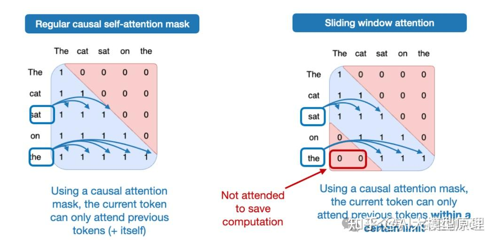
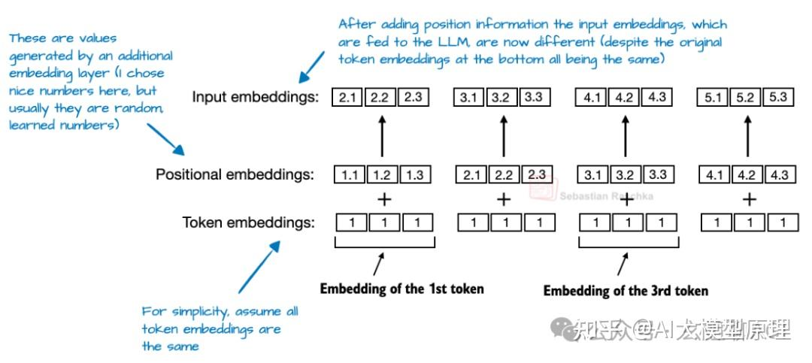

# 从 DeepSeek R1 到 Kimi K2 8种大模型架构设计剖析

**Author:** AI大模型原理

**Date:** 2025-07-27

**Link:** https://zhuanlan.zhihu.com/p/1933129578051802871

从最早的 GPT 到现在，已经过去7年了。回头看看 GPT-2（2019年），再看看最新的 DeepSeek-V3 和 [Llama 4](https://zhida.zhihu.com/search?content_id=260914802&content_type=Article&match_order=1&q=Llama+4&zhida_source=entity)（2024-2025年），你可能会惊讶：这些大模型在结构上居然还是那么像！

当然，细节上还是有不少改进的，比如：位置编码从固定的变成了旋转的（RoPE），注意力机制从多头注意力（Multi-Head Attention）换成了更省算力的分组查询注意力（Grouped-Query Attention），激活函数也从 GELU 换成了更高效的 SwiGLU。但说到底，这些只是小修小补，底层架构还是原来那一套。

那么问题来了：这些大模型到底变没变？还是说，我们只是在给老架构“抛光打蜡”？

其实，要比较这些大模型，搞清楚它们为什么表现好（或者不好）特别难，因为训练数据、训练方法和超参数都不一样，而且很多细节都没公开。

不过，我觉得还是有必要专门聊聊架构本身的变化，看看2025年的开发者们到底在折腾啥。（下图是本文要讲的几个代表性模型）

最近两年，大家都可以看到AI的发展有多快，我国超10亿参数的大模型，在短短一年之内，已经超过了100个，现在还在不断的发掘中，时代在瞬息万变，我们又为何不给自己多一个选择，多一个出路，多一个可能呢？

与其在传统行业里停滞不前，不如尝试一下新兴行业，而AI大模型恰恰是这两年的大风口，整体AI领域2025年预计缺口1000万人，其中算法、工程应用类人才需求最为紧迫！

学习AI大模型是一项系统工程，需要时间和持续的努力。但随着技术的发展和在线资源的丰富，零基础的小白也有很好的机会逐步学习和掌握。

**【完整版的大模型 AI 学习资源已经准备好，朋友们如果需要了解更多可以点击下方小卡片 100%免费】**

[【2025最新】AI大模型全套学习资料（可白嫖）：LLM面试题+AI大模型学习路线+大模型PDF书籍+640套AI大模型报告等等，从入门到进阶再到精通，超全面存下吧！21 赞同 · 7 评论](https://zhuanlan.zhihu.com/p/25616182602) 文章

所以，这篇文章不聊跑分，也不聊训练技巧，就专门讲讲现在主流开源大模型在架构上的新花样。

下文我们对主流的**8个开源大模型（[DeepSeek V3](https://zhida.zhihu.com/search?content_id=260914802&content_type=Article&match_order=1&q=DeepSeek+V3&zhida_source=entity)/R1、[OLMo 2](https://zhida.zhihu.com/search?content_id=260914802&content_type=Article&match_order=1&q=OLMo+2&zhida_source=entity)、[Gemma 3](https://zhida.zhihu.com/search?content_id=260914802&content_type=Article&match_order=1&q=Gemma+3&zhida_source=entity)、Mistral 3.1、Llama 4、[Qwen 3](https://zhida.zhihu.com/search?content_id=260914802&content_type=Article&match_order=1&q=Qwen+3&zhida_source=entity)、[SmolLM3](https://zhida.zhihu.com/search?content_id=260914802&content_type=Article&match_order=1&q=SmolLM3&zhida_source=entity)、[Kimi K2](https://zhida.zhihu.com/search?content_id=260914802&content_type=Article&match_order=1&q=Kimi+K2&zhida_source=entity)）架构设计**详细剖析之。

_**—1**—_

**8种大模型技术架构剖析**

## **1、DeepSeek V3/R1 大模型架构设计**

DeepSeek V3/R1 通过两项关键架构设计技术优化了计算效率，使其在众多大语言模型中脱颖而出：**[多头潜在注意力](https://zhida.zhihu.com/search?content_id=260914802&content_type=Article&match_order=1&q=%E5%A4%9A%E5%A4%B4%E6%BD%9C%E5%9C%A8%E6%B3%A8%E6%84%8F%E5%8A%9B&zhida_source=entity)（MLA）** 和 **[混合专家](https://zhida.zhihu.com/search?content_id=260914802&content_type=Article&match_order=1&q=%E6%B7%B7%E5%90%88%E4%B8%93%E5%AE%B6&zhida_source=entity)（MoE）**。

### **1.1 多头潜在注意力（MLA）**

MLA 的核心目标是解决传统多头注意力（MHA）在大规模模型中内存占用过高的问题。与分组查询注意力（GQA）相比，MLA 通过进一步压缩键（Key）和值（Value）张量，显著降低了内存使用量。

-   **MHA 与 GQA 的对比**  
    在 GQA 中，多个查询（Query）可以共享一组键值对，从而减少冗余。例如，当组大小为 2 时，两个查询共享一个键值对，这已经是一个显著的改进。然而，MLA 更进一步，通过压缩技术进一步优化内存占用。
-   **MLA 的工作原理**  
    在 MLA 中，键和值张量在存储到 KV 缓存之前会被压缩到一个低维空间。在推理阶段，这些压缩的张量会被重新投影回原始大小。虽然这一过程增加了额外的矩阵乘法操作，但显著降低了内存占用，从而在推理时能够处理更长的上下文。
-   **MLA 与 MHA 的对比**  
    MLA 通过压缩技术，显著减少了 KV 缓存的内存占用，同时保持了高效的推理能力。

### **1.2 混合专家（MoE）**

MoE 将传统的前馈模块替换为多个专家层，每个专家层本身也是一个前馈模块。在推理阶段，一个路由器会选择一小部分专家进行激活，从而实现计算资源的高效利用。

-   **MoE 的工作原理**  
    以 DeepSeek V3 为例，模型中包含 256 个专家层，但每次推理时，仅激活 9 个专家（1 个共享专家和 8 个由路由器选择的专家）。这种设计使得模型在推理时只需激活一小部分专家，从而显著降低了计算量。
-   **MoE 与传统前馈模块的对比**  
    传统的前馈模块在每次推理时都会激活所有神经元，而 MoE 通过选择性激活专家，显著降低了计算量，同时保留了模型的高容量和多样性。

通过 MLA 和 MoE，DeepSeek V3/R1 在保持高性能的同时，显著优化了内存和计算资源的使用，使其在大规模应用中更具优势。  

**2、OLMo 2 大模型架构设计**

### **2.1 归一化层放置：[后归一化](https://zhida.zhihu.com/search?content_id=260914802&content_type=Article&match_order=1&q=%E5%90%8E%E5%BD%92%E4%B8%80%E5%8C%96&zhida_source=entity)（Post-Norm）的妙用**

OLMo 2 采用了后归一化（Post-Norm）策略，这与大多数大语言模型（LLM）常用的前归一化（Pre-Norm）截然不同。这种架构设计的核心目的是提升训练过程的稳定性。

-   **后归一化与前归一化的对比**  
    在 OLMo 2 中，归一化层被放置在注意力模块和前馈模块的**后面**，而不是像传统方法那样放在前面。这种设计与最初的 Transformer 架构中的 Post-LN（后归一化）类似，但它使用了 **RMSNorm** 而不是常见的 **LayerNorm**。

-   **稳定性提升**  
    研究表明，后归一化在训练时更加稳定，尤其是在没有精心设计的学习率预热策略的情况下。OLMo 2 的训练损失曲线显示，这种设计在训练过程中表现得更为平稳。
-   **对比图示**  
    下图展示了 Pre-Norm（如 GPT-2、Llama 3 等模型中使用）与 OLMo 2 的 Post-Norm 变体在训练稳定性上的对比。

### **2.2 QK-Norm：多头注意力模块中的额外归一化**

QK-Norm 是 OLMo 2 在多头注意力模块中引入的一个额外的 RMSNorm 层，它被应用于查询（q）和键（k）之前。这种设计的主要作用是在应用 RoPE（旋转位置编码）之前对输入进行归一化，从而减少训练过程中的数值不稳定。

-   **架构对比**  
    与 Llama 3 相比，OLMo 2 的架构在某些方面相对相似，但有一个关键区别：OLMo 2 仍然使用传统的多头注意力（MHA），而不是 GQA（分组查询注意力）。
-   **对比图示**  
    下图展示了 Llama 3 和 OLMo 2 的架构对比。

通过这些优化，OLMo 2 在训练稳定性和数值稳定性方面表现出色，为大语言模型的开发提供了新的思路和方向。

## **3、Gemma 3 大模型架构设计**

### **3.1** **[滑动窗口注意力](https://zhida.zhihu.com/search?content_id=260914802&content_type=Article&match_order=1&q=%E6%BB%91%E5%8A%A8%E7%AA%97%E5%8F%A3%E6%B3%A8%E6%84%8F%E5%8A%9B&zhida_source=entity)：内存优化与性能平衡**

Gemma 3 采用了滑动窗口注意力机制，旨在减少 KV 缓存的内存需求，同时保持模型的性能。这种设计特别适合处理长序列的任务，例如长文本生成或长文档理解。

-   **内存优化**  
    滑动窗口注意力通过限制每个查询位置的上下文范围，使其仅关注局部窗口内的内容，从而显著减少了 KV 缓存的内存占用。例如，Gemma 3 将滑动窗口大小从 Gemma 2 的 4096 减少到 1024，并调整了全局与局部注意力的比例。

-   **性能对比**  
    与传统的全局注意力机制相比，滑动窗口注意力在内存使用上带来了显著的优化，同时对模型的建模性能影响极小。这种设计使得 Gemma 3 在处理长序列时更加高效。
-   **对比图示**  
    下图展示了常规注意力（左）和滑动窗口注意力（右）的对比。

### **3.2 归一化层放置：结合前归一化与后归一化的优点**

Gemma 3 在注意力模块和前馈模块的前后都放置了 RMSNorm 层。这种设计结合了前归一化和后归一化的优点，既保持了训练稳定性，又提高了推理效率。

-   **归一化层设计**  
    在 Gemma 3 中，每个注意力模块和前馈模块的前后都分别放置了一个 RMSNorm 层。这种设计既利用了前归一化在训练过程中的稳定性，又利用了后归一化在推理阶段的高效性。
-   **架构对比**  
    下图展示了 OLMo 2 和 Gemma 3 的架构对比，注意 Gemma 3 中额外的归一化层。

通过这些创新，Gemma 3 在处理长序列任务时表现出了卓越的性能和高效的内存管理能力，为大语言模型在实际应用中的优化提供了新的思路。

## **4、[Mistral Small 3.1](https://zhida.zhihu.com/search?content_id=260914802&content_type=Article&match_order=1&q=Mistral+Small+3.1&zhida_source=entity) 大模型架构设计**

Mistral Small 3.1 通过一系列巧妙的优化手段，使其在推理延迟上表现出色，同时保持了较高的性能。这些优化措施包括：

### **4.1 [自定义分词器](https://zhida.zhihu.com/search?content_id=260914802&content_type=Article&match_order=1&q=%E8%87%AA%E5%AE%9A%E4%B9%89%E5%88%86%E8%AF%8D%E5%99%A8&zhida_source=entity)**

Mistral Small 3.1 采用了自定义分词器，能够更高效地处理输入文本，减少不必要的计算开销。

### **4.2 缩小 KV 缓存**

通过优化 KV 缓存的大小，Mistral Small 3.1 在内存使用上更加高效，从而降低了推理时的内存需求。

### **4.3 减少层数**

减少模型层数，直接降低了计算复杂度，使得模型在推理时更加轻量级，速度更快。

### **4.4 [FlashAttention 技术](https://zhida.zhihu.com/search?content_id=260914802&content_type=Article&match_order=1&q=FlashAttention+%E6%8A%80%E6%9C%AF&zhida_source=entity)**

Mistral Small 3.1 放弃了滑动窗口注意力，转而采用更高效的 FlashAttention 技术。FlashAttention 能够在不牺牲性能的前提下，大幅减少推理延迟。

### **4.5 性能对比**

这些优化使得 Mistral Small 3.1 在推理延迟上优于 Gemma 3，同时保持了较高的性能。这种设计特别适合需要快速推理的应用场景，例如实时对话、在线推荐等。

### **4.6 架构对比**

下图展示了 OLMo 2 和 Gemma 3 的架构对比，注意 Gemma 3 中额外的归一化层。

## **5、Llama 4 大模型架构设计**

### **5.1 架构概览**

Llama 4 在整体架构上与 DeepSeek V3 有相似之处，但在一些关键细节上进行了优化，从而提升了模型的性能和效率。

### **5.2 关键优化点**

### **5.2.1 分组查询注意力（GQA）**

与 DeepSeek V3 采用的多头潜在注意力（MLA）不同，Llama 4 选择了分组查询注意力（GQA）。这种选择在某些场景下能够提供更优的性能表现，同时保持了计算效率。

### **5.2.2 混合专家（MoE）模块的调整**

在 MoE 模块的设计上，Llama 4 采用了更少但更大的专家。这种设计减少了专家之间的竞争，同时提升了每个专家的处理能力，从而在整体上提高了模型的效率。

### **5.2.3 Transformer 块的交替使用**

Llama 4 在每个 Transformer 块中交替使用 MoE 模块和密集模块。这种交替结构使得模型在处理不同类型的输入时更加灵活，同时平衡了计算资源的使用。

### **5.3 架构对比**

下图展示了 DeepSeek V3（6710 亿参数）和 Llama 4 Maverick（4000 亿参数）的架构对比。

通过这些优化，Llama 4 在保持与 DeepSeek V3 类似架构的基础上，进一步提升了性能和效率，使其在多种应用场景中表现出色。

## **6、Qwen 3 大模型架构设计**

### **6.1 密集模型：深度架构的探索**

Qwen3 的密集模型在架构设计上选择了“深度优先”的策略，与 Llama 3 的“宽度优先”形成鲜明对比。

-   **架构对比**  
    **Qwen3 0.6B 的密集模型采用了较深的架构，拥有更多的 Transformer 块，这意味着它有更多层次来逐步处理和理解输入信息。相比之下，Llama 3 1B 则是一种更宽的架构，它通过增加更多的注意力头来提升模型的并行处理能力。**

-   **性能特点**  
    Qwen3 的这种深度架构使得其内存占用相对较小，但生成速度较慢。这是因为更多的层次意味着更复杂的计算过程，但同时也让模型能够更细致地处理信息，适合对生成质量要求较高的场景。

### **6.2 MoE 模型：高效训练与推理**

Qwen3 的 MoE 模型在架构上借鉴了 DeepSeek V3 的设计，但在一些关键细节上进行了优化。

-   **架构对比**  
    与 DeepSeek V3 类似，Qwen3 的 MoE 模型也采用了混合专家（MoE）机制，将前馈模块拆分为多个专家层。然而，Qwen3 的 MoE 模型不使用共享专家，而是让每个输入独立选择最适合的专家进行处理。

-   **性能特点**  
    这种设计使得模型在训练时能够学习更多知识，因为每个专家可以独立地处理特定类型的输入，从而提升模型的泛化能力。而在推理时，由于只激活少数专家，模型能够保持高效的计算性能，适合需要快速响应的应用场景。

通过这些设计，Qwen3 在密集模型和 MoE 模型上都找到了适合自身需求的架构平衡，既提升了性能，又优化了效率。

## **7、SmolLM3 大模型架构设计**

SmolLM3 的架构设计看似常规，但其最大亮点在于采用了独特的 **NoPE（无位置嵌入）** 技术。

### **7.1 无位置嵌入（NoPE）：抛弃传统，拥抱创新**

-   **NoPE 的核心理念**  
    NoPE（No Position Embedding）完全摒弃了传统的位置嵌入方式，无论是绝对位置嵌入还是旋转位置嵌入（RoPE），都不再使用。相反，它依赖因果注意力掩码（Causal Masking）来维持序列的自回归顺序。这意味着模型在训练过程中能够自主学习到隐式的位置信息，而不是依赖显式的位置编码。
-   **对比传统位置嵌入**  
    传统的位置嵌入（如绝对位置嵌入）会为序列中的每个位置分配一个固定的嵌入向量，帮助模型理解位置关系。然而，这种方法在处理长序列时可能会遇到性能瓶颈。例如，绝对位置嵌入在处理过长序列时，位置信息可能会变得过于复杂，导致模型难以有效学习。

-   **NoPE 的优势**  
    研究表明，NoPE 在长度泛化方面表现出色，即在处理更长序列时，性能下降幅度较小。这种设计使得 SmolLM3 在处理长序列任务时表现优异，例如长文本生成、长文档理解等场景。
-   **架构对比**  
    下图展示了 Qwen3 4B 和 SmolLM3 3B 的架构对比，注意 SmolLM3 中独特的 NoPE 设计。

通过这种创新设计，SmolLM3 在保持架构简洁的同时，显著提升了对长序列任务的处理能力，为大语言模型的设计提供了新的思路。

## **8、Kimi K2 大模型架构设计**

### **8.1 架构设计**

Kimi K2 在架构上继承并扩展了 DeepSeek V3 的设计。它采用了混合专家（MoE）架构，拥有 **384 个专家**，每层激活其中 **8 个**，这种稀疏设计在保证性能的同时优化了计算效率。此外，Kimi K2 在多头潜在注意力（MLA）模块中使用了 **更少的头**（64 个），进一步降低了推理过程中的资源消耗。

### **8.2 MuonClip 优化器**

Kimi K2 的一大亮点是采用了 **MuonClip 优化器。这种优化器在** **Muon** **的基础上引入了 QK-Clip 技术，通过动态裁剪注意力 logits 来防止训练不稳定。具体来说，QK-Clip 在每次更新后直接对查询（query）和键（key）投影的权重矩阵进行重缩放，从而在源头控制注意力 logits 的规模。这一改进使得 Kimi K2 在 15.5 万亿 token 的预训练过程中实现了零损失 spike，确保了大规模训练的稳定性和连续性。**

### **8.3 训练表现**

这些设计使得 Kimi K2 在训练过程中表现优异，训练损失曲线平滑且下降迅速。这种优异的训练表现可能有助于 Kimi K2 在多个基准测试中跃居榜首，其性能与谷歌的 Gemini、Anthropic 的 Claude 和 OpenAI 的 ChatGPT 等顶级专有模型不相上下。

### **8.4 架构对比**

下图展示了 DeepSeek V3 和 Kimi K2 的架构对比。可以看到，Kimi 2 在 MoE 模块中使用了更多的专家，而在 MLA 模块中使用了更少的头，这些调整使其在处理长上下文时更加高效。

通过这些创新设计，Kimi K2 不仅在训练效率和稳定性上表现出色，还在多个领域实现了卓越的性能，成为开源模型中的佼佼者。

_**—2**—_

**8种大模型架构设计对比总结剖**

今天，我们深入探讨了几款前沿大语言模型（LLM）的架构设计及其优化策略。这些模型通过独特的架构创新，在性能、效率和稳定性方面取得了显著进展。

### 1\. **DeepSeek V3/R1**

-   **多头潜在注意力（MLA）**：通过压缩键和值张量，显著降低了内存占用，优化了推理效率。
-   **混合专家（MoE）**：在推理时仅激活部分专家，大幅减少了计算量，同时保留了模型的高容量。

### 2\. **OLMo 2**

-   **后归一化（Post-Norm）**：与传统的前归一化相比，后归一化提升了训练稳定性，尤其在没有精心设计的学习率预热策略时。
-   **QK-Norm**：在多头注意力模块中引入额外的 RMSNorm 层，减少数值不稳定，优化训练过程。

### 3\. **Gemma 3**

-   **滑动窗口注意力**：通过限制每个查询位置的上下文范围，显著减少了 KV 缓存的内存占用，适合处理长序列任务。
-   **归一化层放置**：在注意力模块和前馈模块的前后都放置了 RMSNorm 层，结合了前归一化和后归一化的优点，提升了训练稳定性和推理效率。

### 4\. **Mistral Small 3.1**

-   **自定义分词器**：优化了输入文本的处理，减少了计算开销。
-   **缩小 KV 缓存**：降低了内存需求，提升了推理效率。
-   **FlashAttention 技术**：替代了滑动窗口注意力，进一步减少了推理延迟，适合快速推理场景。

### 5\. **Llama 4**

-   **分组查询注意力（GQA）**：相比多头潜在注意力（MLA），GQA 提供了更优的性能表现。
-   **混合专家（MoE）模块调整**：采用更少但更大的专家，减少了专家间的竞争，提升了处理能力。
-   **Transformer 块交替使用**：在每个 Transformer 块中交替使用 MoE 模块和密集模块，提升了灵活性和效率。

### 6\. **Qwen3**

-   **密集模型**：采用较深的架构，拥有更多 Transformer 块，适合对生成质量要求较高的场景。
-   **MoE 模型**：借鉴 DeepSeek V3 的架构，但不使用共享专家，提升了训练时的知识学习能力和推理时的效率。

### 7\. **SmolLM3**

-   **无位置嵌入（NoPE）**：完全摒弃传统位置嵌入，依赖因果注意力掩码维持序列顺序，提升了长度泛化能力，适合长序列任务。

### 8\. **Kimi K2**

-   **架构扩展**：基于 DeepSeek V3，采用更多专家和更少的注意力头，优化了计算效率。
-   **MuonClip 优化器**：引入 QK-Clip 技术，防止训练不稳定，确保了大规模训练的连续性。
-   **训练表现**：训练损失曲线平滑且下降迅速，有助于模型在基准测试中取得优异成绩。

这些大模型通过不同的架构优化策略，在各自的领域中展现了卓越的性能和效率。这些创新不仅推动了大语言模型的发展，也为未来的大模型架构设计提供了宝贵的参考。

最近两年，大家都可以看到AI的发展有多快，我国超10亿参数的大模型，在短短一年之内，已经超过了100个，现在还在不断的发掘中，时代在瞬息万变，我们又为何不给自己多一个选择，多一个出路，多一个可能呢？

与其在传统行业里停滞不前，不如尝试一下新兴行业，而AI大模型恰恰是这两年的大风口，整体AI领域2025年预计缺口1000万人，其中算法、工程应用类人才需求最为紧迫！

学习AI大模型是一项系统工程，需要时间和持续的努力。但随着技术的发展和在线资源的丰富，零基础的小白也有很好的机会逐步学习和掌握。

**【完整版的大模型 AI 学习资源已经准备好，朋友们如果需要了解更多可以点击下方小卡片 100%免费】**

[【2025最新】AI大模型全套学习资料（可白嫖）：LLM面试题+AI大模型学习路线+大模型PDF书籍+640套AI大模型报告等等，从入门到进阶再到精通，超全面存下吧！21 赞同 · 7 评论](https://zhuanlan.zhihu.com/p/25616182602) 文章