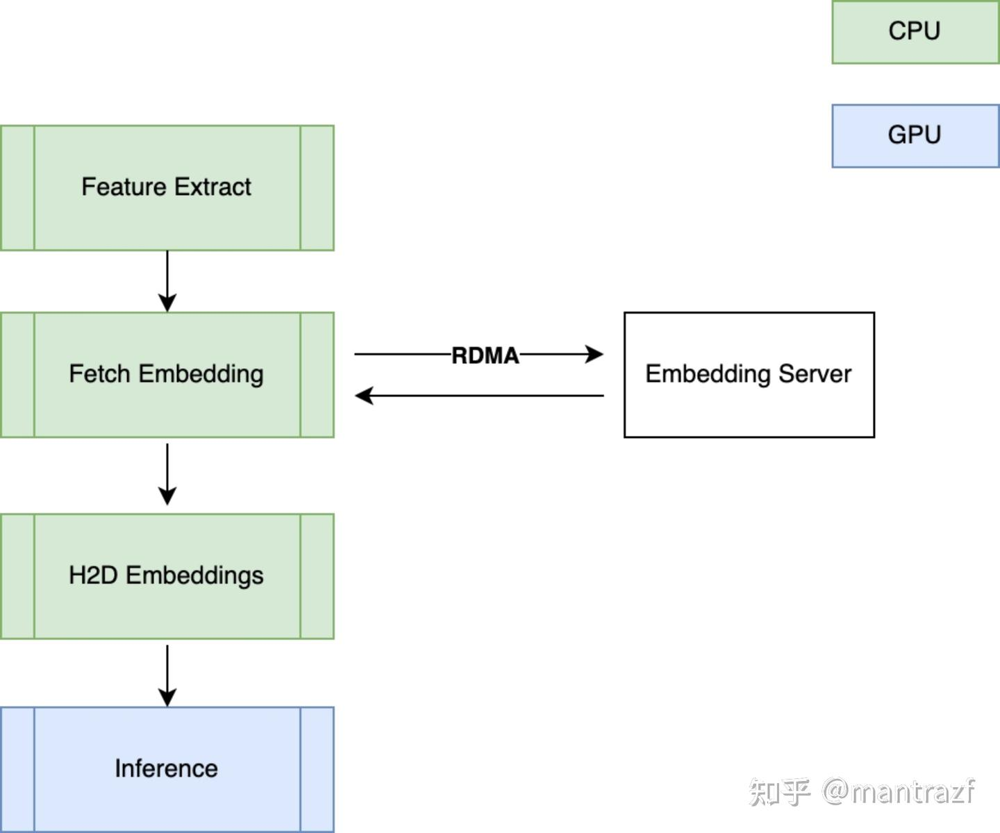
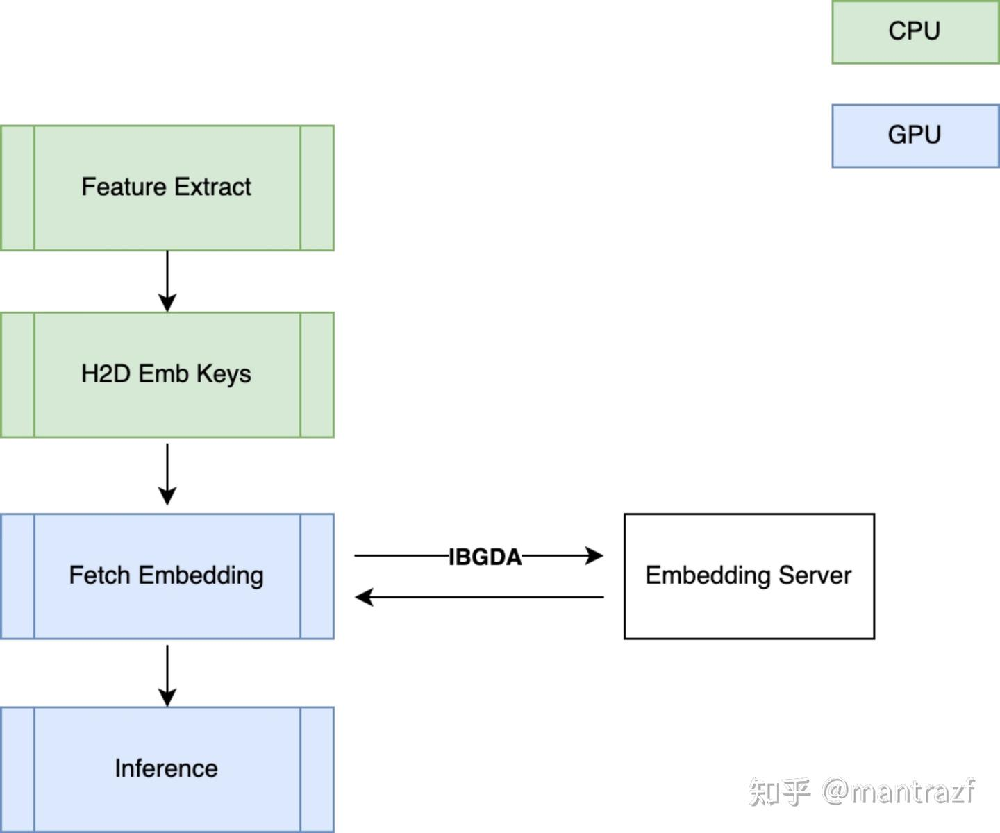
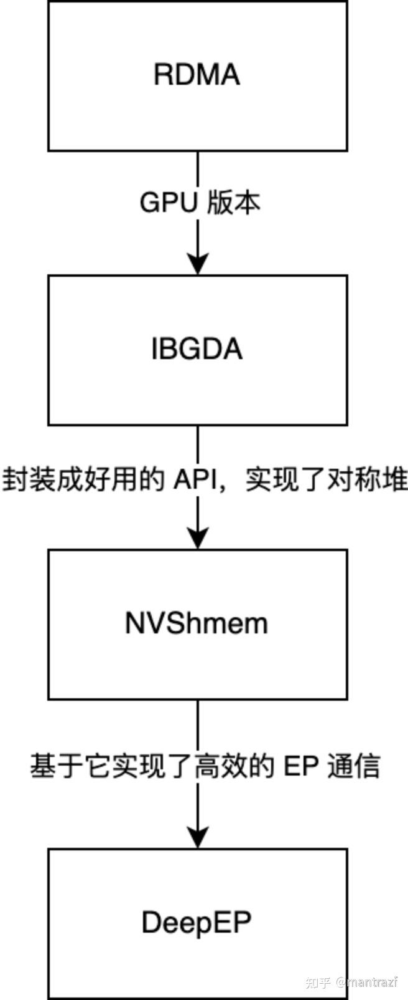

# DeepEP，nvshmem 和 IBGDA 二三事（1）

**Author:** 头像不是浣熊

**Date:** 2025-07-28

**Link:** https://zhuanlan.zhihu.com/p/1932080517358022987

楼主也是初学者，所以可能文章有谬误。但是尽量保证 80% 正确

专门开这个话题是组里一直在研究这方面，自己也有一些理解，所以准备长期更新下去，最后深入分析一下 [DeepEP](https://zhida.zhihu.com/search?content_id=260817714&content_type=Article&match_order=1&q=DeepEP&zhida_source=entity) 和 nvshmem 的源码（[IBGDA](https://zhida.zhihu.com/search?content_id=260817714&content_type=Article&match_order=1&q=IBGDA&zhida_source=entity) 本身基于 gdrcopy，太底层了就算了）

首先需要了解一些基础的概念：

  

**[RDMA](https://zhida.zhihu.com/search?content_id=260817714&content_type=Article&match_order=1&q=RDMA&zhida_source=entity)**

这个就不做过多解释了，感兴趣可以网上搜。这是讨论的地基，至关重要。它有非常多的概念名词，类似黑话，初学者可能一头雾水。这里选取几个出现最频繁的列举如下：

1.  [QP](https://zhida.zhihu.com/search?content_id=260817714&content_type=Article&match_order=1&q=QP&zhida_source=entity)（Queue Pair）。可以认为这个就类似 RPC 场景下的长链接中的一端，两端各自提供一个 QP，组成一条长链接。要使用 RDMA 必须建立 QP 链。
2.  RC & DC。QP 的类型，可靠链接和动态链接，可以认为 RC 和 DC 都是 QP
3.  [WQE](https://zhida.zhihu.com/search?content_id=260817714&content_type=Article&match_order=1&q=WQE&zhida_source=entity)。任务，可以理解成 RPC 里的 Request
4.  WQ。工作队列，包含在 QP 里。WQE 就是写入到 WQ，然后 RDMA 消费 WQ 取出 WQE，根据 WQE 里的 meta 信息，进行数据的“搬运”工作
5.  [CQ](https://zhida.zhihu.com/search?content_id=260817714&content_type=Article&match_order=1&q=CQ&zhida_source=entity)。完成队列。一般用在双向通信（send / recv)，你可以认为是一种信号量。我们假设 NodeA 是客户端，NodeB 是服务端，如果 NodeA 往 NodeB 写入了一批数据，并且它需要确认这部分数据已经写入完成了，此时 CQ 就是完成事件的信号量容器。如果是单向通信（write / read），那么就没有 CQ 什么事了
6.  DB。门铃，doorbell，就是 WQE 写入 WQ 之后，要通知网卡可以进行数据传输了，这时候就需要“Ring db”

  

**IBGDA**

这个说白了就是 GPU 版本的 RDMA，它把整个操作全部在 GPU 上完成，即上面提到的，获取 QP，生成 WQE，写入 WQ，Ring db 一系列操作，全部在 GPU 上，全部在你的 [cuda kernel](https://zhida.zhihu.com/search?content_id=260817714&content_type=Article&match_order=1&q=cuda+kernel&zhida_source=entity) 里完成。没错，GPU 自己也可以发起类似 RPC 的通信了，用户可以 CUDA 编程来进行数据收发了～

当然这么说可能不太规范，也很玄幻，后续章节会通过详细分析代码来看这一切是如何实现的

那这样有什么好处呢？对于推理服务器来说，可以显著看到如下两点好处：

1.  类似 EP，TP 之类的分布式推理，可以直接在 cuda kernel 完成，而无需回到 CPU 侧调用 nccl 等集合通信库，说白了，它不仅省去了 GPU 和 CPU 之间切换协作的开销，同时给了用户可以自己造轮子的机会。用户可以自己通过 CUDA 编程分配资源，切分数据，来高效的实现集合通信。尤其是 EP 这种动态分布式推理的场景
2.  对于传统搜广推服务，一般特征抽取完成之后，会通过 RPC / RDMA 获取 [sparse embedding](https://zhida.zhihu.com/search?content_id=260817714&content_type=Article&match_order=1&q=sparse+embedding&zhida_source=entity)，然后拷贝到 [pinned memory](https://zhida.zhihu.com/search?content_id=260817714&content_type=Article&match_order=1&q=pinned+memory&zhida_source=entity) 上，最后通过 [h2d](https://zhida.zhihu.com/search?content_id=260817714&content_type=Article&match_order=1&q=h2d&zhida_source=entity) 传输到 GPU 进行 inference：

在使用 IBGDA 之后，会变成下述场景：

简单来说，IBGDA 会将获取的 sparse embedding 直接通过网卡写到 GPU 上，省却了 CPU 上多余的拷贝（要拷贝到 pinned memory）和 H2D 的开销，同时因为一切在 CUDA kernel 里进行，你还可以顺便做大量的数据处理（比如 sum pooling），最后同步给 CPU 数据处理完成的信号即可（然后 CPU 就可以 launch cuda stream 进行 inference 了！）

是不是特别的美好呢～当然这里边还有 GPU embedding cache 等模块我没有画出来，是可以完全打通的，甚至来说，今后特征抽取也会下沉到 GPU 里进行，这样就可以释放出整个 CPU 了

为什么要释放 CPU 呢，因为 CPU 昂贵啊。如果一件事情可以放到 GPU 上实现，那么换算成本，同等的算力 GPU 会比 CPU 便宜很多～

  

**NVShmem**

这个是 IBGDA 的实现方式之一，并不是说我们一定要 NVShmem 这个库来说 IBGDA，你可以选择别的（比如 GPUNetIO），并且还提供了对称内存的能力。它这个库比较吸引人的是它提供的对称内存，因为现在 EP / TP 这些比较流行吗，那么节点间互相要通信就需要“约定好，互相可以明白的”地址，毕竟节点间是不同的进程，进程是独立的内存空间，那么两个节点之间怎么知道数据该写到对面的地方呢？这点 NVShmem 就顺带帮忙做了，不需要用户自己来进行内存注册（这个后边要讲，RDMA 必不可少的一环）和管理，它内部叫做【对称堆】

这大概也是 DeepEP 选择使用 NVShmem 的原因之一吧～

  

**DeepEP**

[DeepSeek](https://zhida.zhihu.com/search?content_id=260817714&content_type=Article&match_order=1&q=DeepSeek&zhida_source=entity) 全家桶之一，是基于 NVShmem 实现的专门用于 EP 的通信库，特点就是专做 EP。就像上面说的 ，IBGDA 给了大家造轮子的机会，那么 DeepSeek 就在上面造起了轮子，DeepEP 就是这个轮子～

  

所以上面四个名词简单的关系就是：

第一篇就解释了下基础的概念，后续会从源码上分析是如何实现的