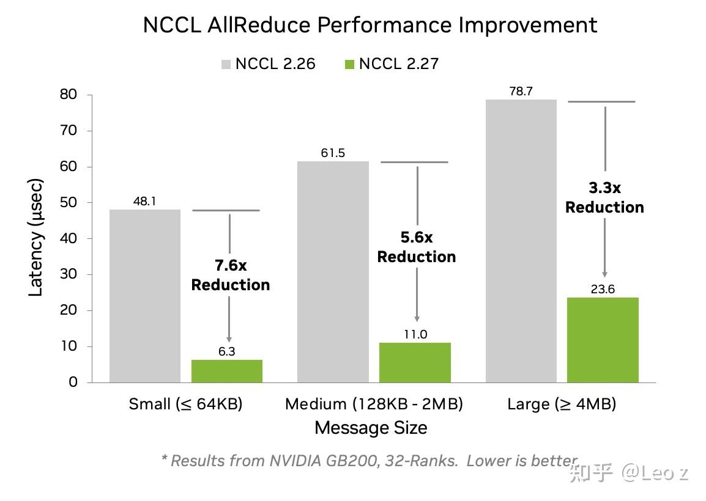
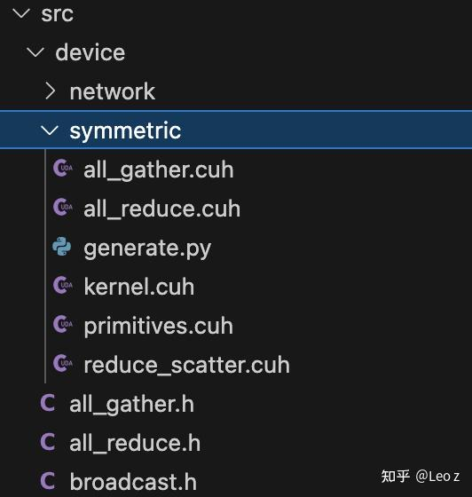
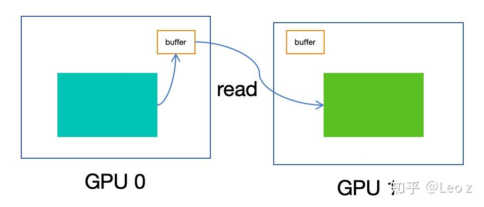
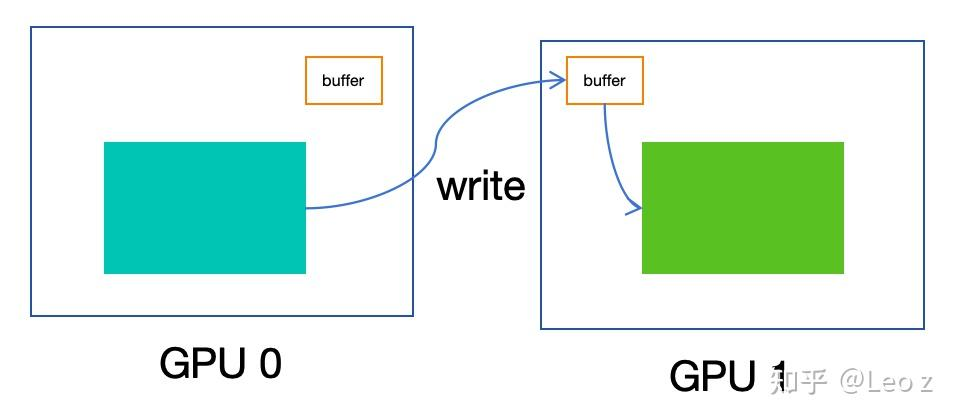
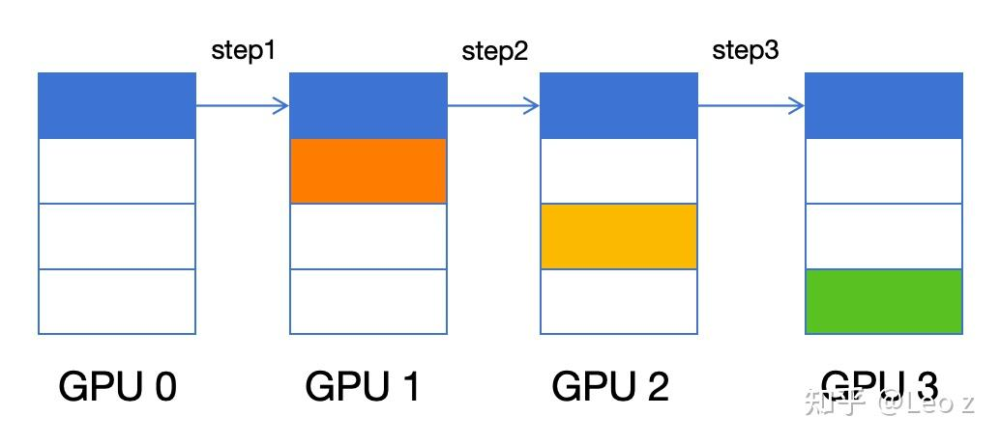
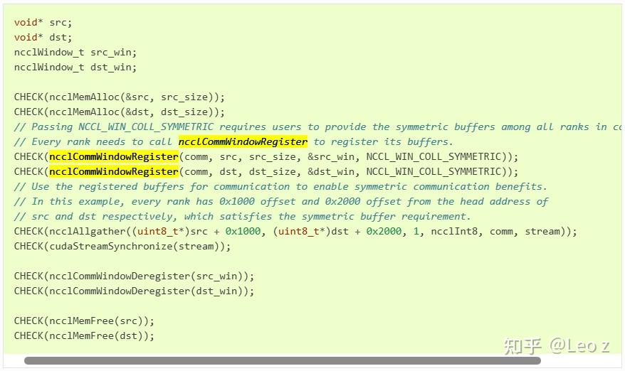

# NCCL Symmetric Memory不深入解读

**Author:** Leo z

**Date:** 2025-07-28

**Link:** https://zhuanlan.zhihu.com/p/1932515428309141450

## 本文重点关注

优秀的集合通信算法有两个重要指标：通信速度要快（不阻塞计算），资源占用要少（与计算重叠时不影响计算效率）。

本文重点关注 NCCL 2.27 中的 Symmetric Memory 通信是如何做到性能更好且 sm 占用更少的。

## 背景

当前 NVL72 火热，高速互连的 ScaleUp 域越来越大。过去需要跨机走网卡通信的场景，当前可以直接全部通过 [NVLink](https://zhida.zhihu.com/search?content_id=260865887&content_type=Article&match_order=1&q=NVLink&zhida_source=entity) 通信。这种硬件架构的变化必然带来通信库软件的发展演变(也许会使得 AI 场景下的大部分通信完全融于计算之中)。NVL72 支持 72 个 GPU 通过 NVLink 高速互联，其中任意两个 GPU 之间的单向带宽高达 900GB/s（注：NV 文档中的 1.8TB/s 为双向带宽和），将大幅提升大模型训练和推理的通信效率\[1\]。  
  
NCCL 2.27 引入的 Symmetric Memory 模式为 ScaleUp 通信提供了创新解决方案。该技术通过注册对称内存实现虚拟地址映射，使 GPU 能够直接以 load/store 指令访问 NVLink 域内所有显存，如同操作本地显存一样（还可以使用NVSwitch提供的[Multimem](https://zhida.zhihu.com/search?content_id=260865887&content_type=Article&match_order=1&q=Multimem&zhida_source=entity)访问能力）。实测表明，该模式显著降低了 AllReduce/[AllGather](https://zhida.zhihu.com/search?content_id=260865887&content_type=Article&match_order=1&q=AllGather&zhida_source=entity)/[ReduceScatter](https://zhida.zhihu.com/search?content_id=260865887&content_type=Article&match_order=1&q=ReduceScatter&zhida_source=entity) 等集合通信的延迟，小消息场景下最高可提升 7.6 倍性能\[2\]。



Average AllReduce latency improvements using low-latency kernels in NCCL 2.27\[2\]



NCCL 2.27新增加的Symmetric Memory代码

## NCCL Symmetric Memory 性能优化分析

NVL72 的推出大幅扩展了 Symmetric Memory 的应用场景。该技术支持 NVLink 域内 72 个 GPU 的直接通信，在此之前，如 [vLLM](https://zhida.zhihu.com/search?content_id=260865887&content_type=Article&match_order=1&q=vLLM&zhida_source=entity) 的 CustomAllReduce 等方案仅支持单机 2-8 个 GPU 的通信：

```text
class CustomAllreduce:
    _SUPPORTED_WORLD_SIZES = [2, 4, 6, 8]
```

回归主题，本节重点对比 Symmetric Memory 与 NCCL 原 Ring 算法的性能差异：实测显示，单机 8 卡场景下 Symmetric Memory 仅需 1-2 个 channels（和计算中的 blocks 对应）即可实现最优性能，而 NCCL Ring 随着消息增大需要使用十几甚至数十个 channels。尽管使用更多的 channels，NCCL Ring 在各个消息段的性能表现仍然不及 Symmetric Memory。下面简要介绍两种算法的实现原理。

### NCCL Ring

NCCL 利用 NVLink 建立 P2P 连接(p2pSendConnect/p2pRecvConnect)，其核心机制是交换 buffer 的 IPC handle(ncclP2pImportShareableBuffer)将远端 buffer 映射为本地可访问地址，将可访问的远端 buffer 作为 GPU 间的通信中转。

```text
struct p2pConnectInfo {
  int rank;
  int read;
  struct ncclP2pBuff p2pBuff;
  // Used by CE memcpy
  ncclShmIpcDesc_t desc;
};

struct ncclP2pBuff {
  void* directPtr;
  size_t size;
  ncclIpcDesc ipcDesc;
};

// Different PID
NCCLCHECK(ncclP2pImportShareableBuffer(comm, peerInfo->rank, p2pBuff->size, &p2pBuff->ipcDesc, devMem));
*ipcPtr = *devMem;
```

该 buffer 通常为 4MB 大小。由于采用中转机制，需要遵循生产者-消费者同步逻辑：生产者完成数据搬运后消费者才能读取，消费者清空 buffer 后生产者才能继续写入。因此，NCCL 的 GenericOp 操作会串行执行以下三个步骤：

```text
waitPeer：同步和指针设置，保证数据访问安全。
reduceCopy：实际数据处理（copy/reduce）。
postPeer：完成通知和进度推进。
```

此外，NCCL 针对不同 NVIDIA GPU 架构，会选择 read 或 write 模式进行跨 GPU 数据传输：

```text
  if (path->type == PATH_NVL) {
    struct ncclTopoNode* gpu2 = system->nodes[GPU].nodes+g2;
    // Enable P2P Read for Ampere/NVLink only
    if (read && (gpu1->gpu.cudaCompCap == gpu2->gpu.cudaCompCap) && (gpu1->gpu.cudaCompCap == 80)) *read = 1;
  }
```



Ampere use Read（load）for P2P



Hopper use Write（store）for P2P

以上简要说明了 NCCL 的 P2P 通信实现，接下来看一下其核心的 Ring 算法：单机场景下，ReduceScatter 和 AllGather 均采用 Ring 算法；AllReduce 则根据消息大小区分，小消息使用 Ring 算法，大消息采用 NVLS 算法。

下图展示了 Ring 算法在 AllGather 时的工作方式：GPU0 需要经过 nRanks-1 跳才能将数据块（蓝色）传递给所有 GPU（其他 GPU 上的数据也经过同样的方式进行传输）。这种链式传输导致小消息的延迟与 GPU 数量成正比，扩展性较差。相比之下，FullMesh 连接支持并行发送，能显著降低时延。这正是 Symmetric Memory 和 vLLM custom\_allreduce 采用的优化方案。

  



Ring算法数据传输steps

### Symmetric Memory

Symmetric Memory 目前支持 AllReduce、AllGather 和 ReduceScatter 操作，其 kernel 选择取决于两个关键因素：消息大小和是否启用 Multimem（NVSwitch 的 Reduce/Broadcast 功能）：

```text
constexpr char const* kernelName[] = {
  // Must align with enum ncclSymKernelId definition in src/include/symmetric.h
  「AllReduce_AGxLL_R」,
  「AllReduce_AGxLLMC_R」,
  「AllReduce_RSxLD_AGxST」,
  「AllReduce_RSxLDMC_AGxSTMC」,
  「AllGather_LL」,
  「AllGather_LLMC」,
  「AllGather_ST」,
  「AllGather_STMC」,
  「ReduceScatter_LL」,
  「ReduceScatter_LD」,
  「ReduceScatter_LDMC」
};
```

上述 kernel 名称中的缩写含义（参考\[4\]）：

```text
AG -> AllGather
LL -> LowLatency
MC -> Multicast
RS -> ReduceScatter
LD -> Load
ST -> Store
R -> Reduce ?
```

我们聚焦 Allreduce 场景：启用 Multimem 时，小消息采用 AllReduce\_AGxLLMC\_R kernel，中消息及大消息则使用 AllReduce\_RSxLDMC\_AGxSTMC 方案。

**AllReduce\_AGxLLMC\_R**

AllReduce\_AGxLLMC\_R 的核心实现包含两个关键函数：

1.  bcastLL：通过 NVSwitch 广播数据到所有 rank
2.  recvReduceLL：接收各 rank 广播过来的数据并在本地完成 reduce

```text
prim.bcastLL(/*slot=*/nIterPacks*rank + t, inp);
Pack out = prim.template recvReduceLL<Pack, T>(t, nIterPacks, red);
```

**AllReduce\_RSxLDMC\_AGxSTMC**

AllReduce\_RSxLDMC\_AGxSTMC 的核心代码块是下面这段：

```text
#pragma unroll
for (int u=0; u < UnrollPacks; u++) {
    tmp[u] = applyLoadMultimem<Red, BytePerPack>(red, inputUptr + cursor + u*WARP_SIZE*BytePerPack);
}
#pragma unroll
for (int u=0; u < UnrollPacks; u++) {
    multimem_st_global(outputUptr + cursor + u*WARP_SIZE*BytePerPack, tmp[u]);
}
```

这里仅从函数命名推断：

1.  applyLoadMultimem：对应 reducescatter 操作，从多个 GPU 上对应的地址偏移上加载数据，并在 NVSwitch 上应用归约操作（如累加），将归约后的数据写回本 GPU。每个 GPU 负责一段数据；
2.  multimem\_st\_global：实现 AllGather，将 Reduce 结果写入输出 Multicast 地址，NVSwitch 将数据 Broadcast 到所有 GPU 对应地址上。

**Symmetric Memory 使用示例**

在\[3\]中提供了 Symmetric Memory 的使用示例：首先通过 ncclCommWindowRegister 注册用户输入/输出 buffer，随后即可调用 NCCL 集合通信算子。通信完成后，使用 ncclCommWindowDeRegister 释放 Symmetric Memory 相关 handle。

在最新的 [PyTorch](https://zhida.zhihu.com/search?content_id=260865887&content_type=Article&match_order=1&q=PyTorch&zhida_source=entity) 中，已经对 NCCL Symmetric Memory 进行了相应的 Python 接口封装。



NCCL Symmetric Memory使用示例

## NCCL Symmetric Memory vs. VLLM custom\_all\_reduce

NCCL Symmetric Memory 的 AllReduce\_AGxLLMC\_R/AllReduce\_RSxLDMC\_AGxSTMC 与 vLLM 的 cross\_device\_reduce\_1stage/cross\_device\_reduce\_2stage 算法对应：前者均为 one-shot 方案（全量收集+本地 Reduce），后者均为 two-shot 方案（ReduceScatter+AllGather）。关键区别在于，vLLM 通过点对点 load/store 实现，而 NCCL 利用 NVSwitch 的 Broadcast/Reduce 能力卸载部分通信和计算，减少端侧数据传输量。实测证明 NCCL 方案性能更优。  
  

## 总结

为什么 NCCL Symmetric Memory 性能好，且 sm 占用少：

1.  算法优化：one-shot/two-shot vs. Ring，多 rank 并行传输比逐跳传输延迟更低，对应的链路延迟比是 1：(nRanks-1)的关系；
2.  零拷贝设计：直接读写用户 buffer（userInput->userOutput），消除 Ring 方案的中转开销（userInput->buffer->userOutput）：
3.  简化同步：避免原Ring算法中P2P通信的生产-消费等待机制；
4.  硬件卸载：NCCL Symmetric Memory 充分利用 NVSwitch 的能力，降低 GPU 侧负载。

## 参考文献

\[1\] [HTTPS://developer.nvidia.com/blog/nvidia-gb200-nvl72-delivers-trillion-parameter-llm-training-and-real-time-inference/](https://link.zhihu.com/?target=HTTPS%3A//developer.nvidia.com/blog/nvidia-gb200-nvl72-delivers-trillion-parameter-llm-training-and-real-time-inference/)

\[2\] [HTTPS://developer.nvidia.com/blog/enabling-fast-inference-and-resilient-training-with-nccl-2-27/](https://link.zhihu.com/?target=HTTPS%3A//developer.nvidia.com/blog/enabling-fast-inference-and-resilient-training-with-nccl-2-27/)  

\[3\] [HTTPS://docs.nvidia.com/deeplearning/nccl/archives/nccl\_2275/user-guide/docs/usage/bufferreg.HTML](https://link.zhihu.com/?target=HTTPS%3A//docs.nvidia.com/deeplearning/nccl/archives/nccl_2275/user-guide/docs/usage/bufferreg.HTML)

\[4\] [HTTPS://GitHub.com/NVIDIA/nccl/issues/1701](https://link.zhihu.com/?target=HTTPS%3A//GitHub.com/NVIDIA/nccl/issues/1701)