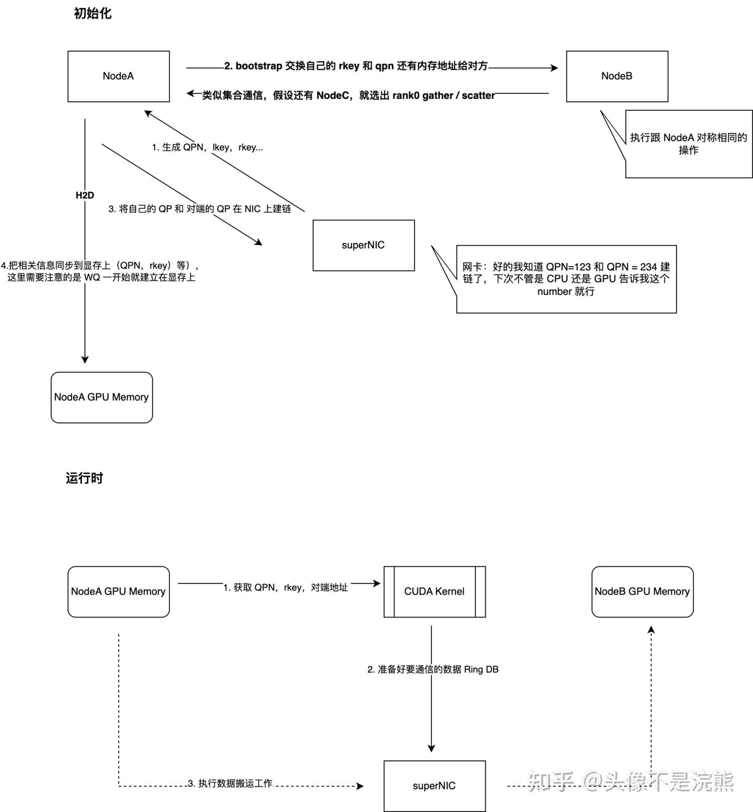

# DeepEP，nvshmem 和 IBGDA 二三事（2）

**Author:** 头像不是浣熊

**Date:** 2025-07-29

**Link:** https://zhuanlan.zhihu.com/p/1933173778881447433

下一节准备先讲 Nvshmem 源码，再讲 [DeepEP](https://zhida.zhihu.com/search?content_id=260922117&content_type=Article&match_order=1&q=DeepEP&zhida_source=entity)，主要是 DeepEP 的源码分析比较多了，但是讲 NvShmem 的很少

本节主要承接上一章基础阐述一些基本的原理，若有谬误欢迎指出来，大家一起共勉～

**源码分析前有些事情需要说清楚，就是可能很多跟我一样的萌新会疑惑，为什么 GPU 可以发起网络通信。CUDA 上很多 C++ 库都用不了，难道还能搞 socket 编程那一套？**

没错，socket 编程不可以，但是 [RDMA](https://zhida.zhihu.com/search?content_id=260922117&content_type=Article&match_order=1&q=RDMA&zhida_source=entity) 可以，原因就是 RDMA 是非常简单高效的协议，为什么它可以在 GPU 上实现呢，这不得不说 RDMA 主要通信原理是基于下列三要素：

1.  **[QPN](https://zhida.zhihu.com/search?content_id=260922117&content_type=Article&match_order=1&q=QPN&zhida_source=entity)**。上一节提到了 QP，QPN 其实就是 QP 的一个编号（就是一个 uint32\_t），加上网卡的 [GID](https://zhida.zhihu.com/search?content_id=260922117&content_type=Article&match_order=1&q=GID&zhida_source=entity)，就可以全局唯一确定一个 QP。因此，假设你有两个节点 NodeA，NodeB，A 生成了（使用一些看不懂的网卡驱动提供的 API） QP1，B 生成了 QP2，Node A 把这两个 uint32\_t 提交给网卡（Node B也是如此），网卡就会给 QPN 建链（好的，你们可以互相之间通信了）。**这些操作全部可以在 CPU，注意是 CPU 上完成**，等一切都完成了，**GPU 只需要使用这个 QPN**。相当于 CPU 承担了所有，但是通信只需要 uint32\_t 就能交流，而 GPU 恰恰使用一个 uint32\_t 的能力还是有的:)，大概就是复杂的事情 CPU 来做，GPU 吃现成。因此 GPU 就是可以网络通信，而 IBGDA 提供的最大能力就是，**通信的数据结构（[WQ](https://zhida.zhihu.com/search?content_id=260922117&content_type=Article&match_order=1&q=WQ&zhida_source=entity)，[CQ](https://zhida.zhihu.com/search?content_id=260922117&content_type=Article&match_order=1&q=CQ&zhida_source=entity)）也可以通知网卡注册在显存上，并且GPU 也可以发起 Ring db 的操作**，这就闭环了
2.  **内存注册（[MR](https://zhida.zhihu.com/search?content_id=260922117&content_type=Article&match_order=1&q=MR&zhida_source=entity)）**。可以认为 RDMA 是进行内存的数据搬运工作，但是也需要最基本的“鉴权”能力，否则那不是谁都可以往对端的机器里写数据了。所以每一段分配用来进行 RDMA 的内存，都需要向网卡注册，同时会产生 [MTT 表](https://zhida.zhihu.com/search?content_id=260922117&content_type=Article&match_order=1&q=MTT+%E8%A1%A8&zhida_source=entity)，用来建立虚拟地址和真实物理地址的映射。假设当前是 nodeA，此时网卡会对该内存生成一对key，分别是 **[lkey](https://zhida.zhihu.com/search?content_id=260922117&content_type=Article&match_order=1&q=lkey&zhida_source=entity) （local key） 和 [rkey](https://zhida.zhihu.com/search?content_id=260922117&content_type=Article&match_order=1&q=rkey&zhida_source=entity)（remote key）**，没错，在DeepEP 里也能它的影子。这两个 key 是相同的，为什么有俩是因为 rkey 是要给对端用的。当你把这块内存用于发送，也就是自己使用的时候，你就要使用 lkey，**当你的对端（nodeB）需要向你申请的这块内存写数据的时候，它就需要使用 rkey**。简单来说就是自己用这块内存的钥匙（权限）和其他节点用这块内存的钥匙。那问题来了，其他节点怎么有 nodeA 的 rkey 呢？
3.  **[bootstrap](https://zhida.zhihu.com/search?content_id=260922117&content_type=Article&match_order=1&q=bootstrap&zhida_source=entity)**。那就不能不提这个阶段，其实这个词很模糊，老外总喜欢写一些奇奇怪怪的词来形容一些阶段，一些概念，跟黑话一样，好好说话他们就浑身难受。这个阶段主要是做什么呢，你想啊 GCC 本身是个编译器，但是它自己又是个程序，那么在你有 GCC 之前，它自己是怎么把自己编译出来的呢？这里大家都知道是自举编译。为什么提到这个，是你可以发现，**RDMA 本身是用来通信的，但是它要建立起通信的前提是，节点之间本身就需要互相交换一些基础的信息（QPN，rkey，数据读写的地址），也就是本身就需要先通信，才能建立通信。那么这不是鸡生蛋蛋生鸡了么？**它当然是没有类似“自举”的能力的，所以它需要 socket 通信，也就是在 CPU 上，把这些数据交换了，该建立的链接建立了，**这个过程就是 bootstrap**。

因此总结起来就是下边简略图的形式（认真画太累我就粗略画一下了）：

这里需要说明的是对端地址。对端地址就是要写给 NodeB 的地址。那么 NodeA 怎么能使用这个地址呢？这个也是 bootstrap 的时候，NodeB 发送给 NodeA 的。可以认为反正地址就是一个指针，一个 int64，对端B 把这个 int64 在初始化的时候给了 A，那么A 直接把这个地址告诉给网卡“你把我给的这一批数据，写到 NodeB 的这个 int64 上，这是钥匙（rkey）“，那么网卡就照办就是了，虽然不同进程地址空间不一样，但是因为这个 int64 本身就是 NodeB 提供的，网卡拿到这个 int64，再查询 MR 阶段产生的 MTT 表，自然它就是有效的地址了，数据就能搬运到正确的位置

  

上面讲述都很简略，比如只讲了 write 模式，其实就是想说明白《为什么 GPU 也可以做通信》这件事，很多描述都不是很标准，请见谅。