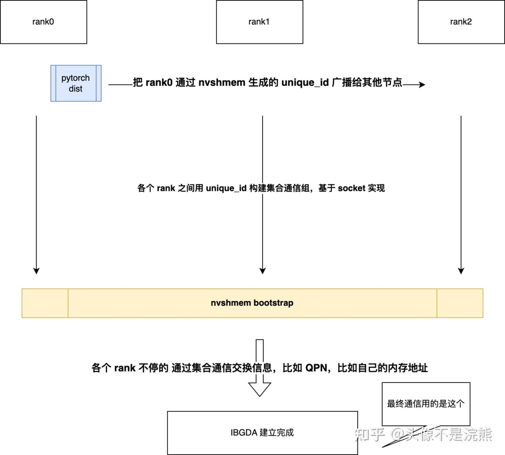

# DeepEP，nvshmem 和 IBGDA 二三事（3）

**Author:** 头像不是浣熊

**Date:** 2025-07-30

**Link:** https://zhuanlan.zhihu.com/p/1933899894881489690

想了想，还是直接 [DeepEP](https://zhida.zhihu.com/search?content_id=261015022&content_type=Article&match_order=1&q=DeepEP&zhida_source=entity) 跟 Nvshmem 干脆串联起来讲比较好，分开讲不知道怎么组织语言，很割裂

然后开始进入源码环节，DeepEP 提供了多种通信模式，这里我们先从 DeepEP 最简单的 low\_latency\_mode 视角进行代码阅读

DeepEP 还是使用了 [Cython](https://zhida.zhihu.com/search?content_id=261015022&content_type=Article&match_order=1&q=Cython&zhida_source=entity) 那一套来实现 EP，要完成一次 nvshmem 的初始化，包括以下四个核心步骤：

1.  bootstrap，让各个 rank 之间能够通信交换初始化所需要的信息
2.  [IBGDA](https://zhida.zhihu.com/search?content_id=261015022&content_type=Article&match_order=1&q=IBGDA&zhida_source=entity) 建链（创建 CQ，QP...）
3.  建立对称堆，建链只是创建了 QP 链接，然而集合通信还需要所有 rank 互相都能理解的地址空间用于数据传输，这个地址空间叫做对称堆
4.  把上述创建好的所有资源从 host 端拷贝到 device 上，供 cuda kernel 调用

前文提到，节点间和节点内的 rank 之间建立起通信关系，需要其他通信库的帮助，就是所谓的 bootstrap。其实 bootstrap 的方式是可以自己设计开发的，没有必要沿用 DeepEP 这一套，在 DeepEP 里一共实现了三层通信：

1.  第一层是基于 [pytorch](https://zhida.zhihu.com/search?content_id=261015022&content_type=Article&match_order=1&q=pytorch&zhida_source=entity) 的 dist 集合通信。它需要用 python 语言可支持的方式来让 rank 之间互相获取对方的网络通信基本信息，比如 rank0 的主机地址，在 nvshmem 里封装成了 unique\_id。各个 rank 之间有了这个统一的 unique\_id，才可以使用 nvshmem 基于 unique\_id 的功能创建集合通信组
2.  第二层就是上面说到的 nvshmem 集合通信组，这个别误解成了 IBGDA，这个还是 bootstrap，是基于 socket 实现的。因为 IBGDA 建链过程中，是需要反复在 rank 之间传递中间信息的，也就是说中间也有很多 alltoall，allgather 之类的集合通信逻辑（这个后面看代码就更清晰了），这些操作就是由这个集合通信组完成。简单来说第一层集合通信是为了创建第二层集合通信，第二层集合通信是为了创建第三层最终的 IBGDA 通信，最后用的其实是第三层通信，当第三层创建好了之后，前两层就可以抛弃掉了（这么说过于绝对，因为你可能会扩容缩容，那么还需要前两层牵线搭桥）
3.  第三层就是最终的 IBGDA，它是由前两层通信一起穿针引线最终建链成功的。所以初看代码会非常的心塞，怎么搞了这么多层，原因就在于此



**值得一提的是，nvshmem 的设计每个 rank 必须是一个独立的进程，也就是说它的对称堆和 IBGDA 通信机制是进程级的。对于 pytorch 生态的服务自然没有任何问题，但是对于很多传统搜广推服务，很多情况下是多卡机器，比如一台机器 4/8 张 GPU，但是基于单进程 multi-stream 的模式实现推理，这种场景 nvshmem 是无法支持的，它绑定了 rank 的粒度必须是进程，原因就在于它内部源码大量使用了全局变量保存通信相关的资源，对于不同的进程自然是没问题的，但是单进程内部会导致所有的 rank（rank粒度本质是一张 GPU）共享通信资源，这当然是无法 work 的**

我们当前工作之一就是把 nvshmem 改造成与进程解耦的形式，同一个进程内部也可以实现每张 GPU 一个对称堆，卡和卡之间实现 IBGDA（因为我们的机器没有 [NvLink](https://zhida.zhihu.com/search?content_id=261015022&content_type=Article&match_order=1&q=NvLink&zhida_source=entity)，还需要考虑到 [NUMA](https://zhida.zhihu.com/search?content_id=261015022&content_type=Article&match_order=1&q=NUMA&zhida_source=entity) 问题，因此使用 IBGDA 来实现一种“伪全互联”的能力）

接下来是部分代码阅读，代码只关注关键逻辑。其他细节，比如说 num\_rdma\_ranks 这些二阶段相关的含义，感兴趣的同学可以具体去了解一下

```cpp
if (num_rdma_bytes > 0) {
        // Initialize NVSHMEM 
        EP_HOST_ASSERT(root_unique_id_opt.has_value());
        std::vector<uint8_t> root_unique_id(root_unique_id_opt->size());
        auto root_unique_id_str = root_unique_id_opt->cast<std::string>();
        std::memcpy(root_unique_id.data(), root_unique_id_str.c_str(), root_unique_id_opt->size());
        auto nvshmem_rank = low_latency_mode ? rank : rdma_rank;
        auto num_nvshmem_ranks = low_latency_mode ? num_ranks : num_rdma_ranks;
        EP_HOST_ASSERT(nvshmem_rank == internode::init(root_unique_id, nvshmem_rank, num_nvshmem_ranks, low_latency_mode));
        internode::barrier();

        // Allocate
        rdma_buffer_ptr = internode::alloc(num_rdma_bytes, NUM_BUFFER_ALIGNMENT_BYTES);

        // Clean buffer (mainly for low-latency mode)
        CUDA_CHECK(cudaMemset(rdma_buffer_ptr, 0, num_rdma_bytes));

        // Barrier
        internode::barrier();
        CUDA_CHECK(cudaDeviceSynchronize());
}
```

其中核心代码是 internode::init 和 internode::alloc

**internode::init 会进入到 nvshmem，并执行核心初始化函数 nvshmemid\_hostlib\_init\_attr：**

```text
int nvshmemid_hostlib_init_attr(int requested, int *provided, unsigned int bootstrap_flags,
                                nvshmemx_init_attr_t *attr,
                                nvshmemi_version_t nvshmem_device_lib_version,
                                nvshmemx_device_lib_init_cb cb) {
    int status = 0; 

    if (nvshmemi_is_version_compatible(nvshmemi_host_lib_version, nvshmem_device_lib_version) !=
        0) { 
        printf("NVSHMEM device library version does not match with NVSHMEM host library version\n");
        return 1;
    }    

    // 这部分代码就是最后需要把在 CPU 上创建好的 IBGDA 资源拷贝到 GPU 上，供 cuda kernel 使用
    // 这里放了一个回调函数，但是在整个阶段快结束时才会调用
    // 为什么不需要传递闭包是因为它很多变量都是全局的……
    if (!nvshmemi_device_state.nvshmemi_is_nvshmem_bootstrapped) {
        nvshmemi_device_state = NVSHMEMI_DEVICE_HOST_STATE_INITIALIZER;
#ifdef NVSHMEM_IBGDA_SUPPORT
        nvshmemi_init_ibgda_device_state(nvshmemi_ibgda_device_state);
#endif
    }    

    if (cb) {
        registered_device_state_cb.emplace(cb);
    } else {
        nvshmemi_init_counter++;
    }

    .........

    NVTX_FUNC_RANGE_IN_GROUP(INIT);

    if (!nvshmemi_device_state.nvshmemi_is_nvshmem_bootstrapped) {
         ..........
        // 这里边的代码全部在执行 bootstrap，就是前文提到的，每个 rank 需要根据自己拿到的 rank0 广播出去的
        // unique_id，互相之间建立起第二层集合通信组，然后在这个集合通信组的加持下，完成整个 IBGDA 通信
        // 链的创建工作，因为没有集合通信，是没有办法完成 IBGDA 建链的
    }

    // 在 bootstrap 阶段完成之后，开始进入正式的初始化流程
    // 里边的核心函数是 nvshmemi_try_common_init，这个函数是整个初始化最核心的部分
    if (!nvshmemi_device_state.nvshmemi_is_nvshmem_initialized) {
        if (!nvshmemi_state) {
            nvshmemi_state = (nvshmemi_state_t *)calloc(1, sizeof(nvshmemi_state_t));
            NVSHMEMI_NULL_ERROR_JMP(nvshmemi_state, status, NVSHMEMX_ERROR_INTERNAL, out,
                                    "nvshmemi_init_thread/calloc failed \n");
            // 其实这里边并没有多少字段生效
            nvshmemi_init_nvshmemi_state(nvshmemi_state);
        }
        status = nvshmemi_try_common_init(nvshmemi_state);
        NVSHMEMI_NZ_ERROR_JMP(status, NVSHMEMX_ERROR_INTERNAL, out,
                              "nvshmem common init failed \n");
    } else {
        status = nvshmemi_update_device_state();
        NVSHMEMI_NZ_ERROR_JMP(status, NVSHMEMX_ERROR_INTERNAL, out,
                              "nvshmem update device state failed \n");
    }

    .......
```

**接下来就是核心初始化函数 nvshmemi\_try\_common\_init：**

**下一节再写吧，每天精力只够写一点**