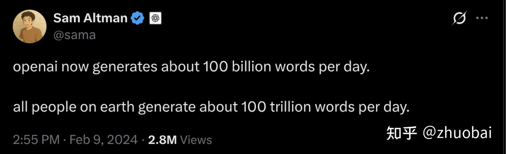

# CS336学习记录-Lec9&10

**Author:** zhuobai

**Date:** 2025-08-02

**Link:** https://zhuanlan.zhihu.com/p/1934732443170104819

Rebuttal 阶段终于结束了，现在可以腾出来时间继续学习了！

## Lecture9-Scaling laws 1

在开始之前我们先想象着进入这样一个场景—**_你有一个很富的朋友，给你一万张 [H100](https://zhida.zhihu.com/search?content_id=261130791&content_type=Article&match_order=1&q=H100&zhida_source=entity) 让你在一个月内 build 一个很好的开源 [LLM](https://zhida.zhihu.com/search?content_id=261130791&content_type=Article&match_order=1&q=LLM&zhida_source=entity)，那你应该怎么做呢？_**你要思考选取什么架构，用什么数据集训练，参数怎么调等等。当然了，我们之前学习过很多优秀的开源模型的设计，直接搬过来用不就好了吗，可是如果要求下必须 optimize 呢？那这就涉及到一件不容易做的事了——scaling。

那首先我们先溯源下 scaling 的历史。

-   Part 1. Scaling laws, history and background

最早认为开始尝试做 data scaling 的是下面这篇 1993 年来自 NeurIPS 的论文，可以看到它们用一个比较小的模型做训练（实线），然后利用已有的信息预测增大 data 后的曲线的走向。

Earliest (data) scaling law paper

在 2012 年之前呢，很多学者尝试用 functional forms 精准预测 data amount 和 task performance 比如一些特定的指数函数。2017 年 Hestness 在百度的时候首次尝试了 large scale [neural scaling](https://zhida.zhihu.com/search?content_id=261130791&content_type=Article&match_order=1&q=+neural+scaling&zhida_source=entity) work，并且非常超前的观察到了很多关键的信息比如 Emergence、Scaling by compute 和 [Speed = accuracy](https://zhida.zhihu.com/search?content_id=261130791&content_type=Article&match_order=1&q=Speed+%3D+accuracy&zhida_source=entity) 等等。

Hestness et al 2017 论文图一

-   Part 2. Neural (LLM) scaling behaviors

简单介绍完 history 后，我们正式进入这节课的核心内容，总共三个小节，每小节对应一个问题。

1.  Data vs performance（Are there simple rules that determine how data affects performance?）

什么是 Data scaling laws 呢，**_用一个简单的公式能够映射 data size 和 error 之间的关系_**。为什么我们认为 scaling laws 会 show up 呢，我们认为 error 应该是单调的。

一个实验观察

那为什么是 power law / linear in log-log 这样的关系去拟合呢，像上面这张图，Estimation error 很自然的是以多项式的形式衰减的。这句话看起来很难理解，我们先通过一个简单的例子来说明：如果我们的 task 是去 estimate 一个数据集的平均值，什么是 scaling law？

假设我们有 n 个样本 $x_1, \dots, x_n \sim \mathcal{N}(\mu, \sigma^2) $ ，如果用 $\hat{\mu} = \frac{\sum_i x_i}{n} $ 来估计样本均值，那么估算的误差可以用 $\mathbb{E}\left[(\hat{\mu} - \mu)^2\right] = \frac{\sigma^2}{n} $ 来表示，两边取下 log 就变成了 $\log(\text{Error}) = -\log n + 2 \log \sigma $ ，那这就是一种 scaling law 了，误差的对数和样本数量的对数成负相关，More generally，任何像 $\frac{1}{n^\alpha} $ 这样的多项式都是一种 scaling law。

所以很多 classical models 都有 $\frac{1}{n} $ 的 scaling，也就是说我们会看到 y = -x + $y = -x + c $ 。那我们再回过头来看下之前的工作不同 task 做的实验结果图：

一条几乎完美的一次函数

对于 data scaling 之前我们会想：how does dataset size relate to performance，而现在很多新的问题出现比如：how does dataset composition affect performance；假如我们的数据有限，应该训练多少个 epoch 影响 scaling 等等，已经有很多工作在做大量实验观察了，这里就不详细说明了。

2\. Data vs model size（Do we train on more data or bigger models?）

现在我们正式进入 model scaling！我们如何设计一个大的 LLM efficiently 呢，我们通过一篇经典的 [Kaplan scaling paper](https://zhida.zhihu.com/search?content_id=261130791&content_type=Article&match_order=1&q=Kaplan+scaling+paper&zhida_source=entity) 来看看面对这个问题是怎么做选择的。

-   Architecture: [transformers](https://zhida.zhihu.com/search?content_id=261130791&content_type=Article&match_order=1&q=transformers&zhida_source=entity) vs [LSTMs](https://zhida.zhihu.com/search?content_id=261130791&content_type=Article&match_order=1&q=LSTMs&zhida_source=entity)。transformers 会比 LSTMs 更好吗，一个 Brute force way：花费 tens of millions 去训练一个 LSTM GPT-3（如下图所示），结果一目了然，**_简单，直接，费钱！_**

\[Kaplan+ 2021\] 的工作

-   Optimizer choice。[ADAM](https://zhida.zhihu.com/search?content_id=261130791&content_type=Article&match_order=1&q=ADAM&zhida_source=entity) vs [SGD](https://zhida.zhihu.com/search?content_id=261130791&content_type=Article&match_order=1&q=SGD&zhida_source=entity)，做 scaling 就好。
-   Depth/Width: Number of layers。depth 还是 width 影响巨大呢，1 vs 2 layers 看起来差异巨大，增加 layer 后 loss 更低，但其他看起来都比较 stable。

depth vs width

3\. Hyper-parameters vs performance（How should we set hyperparameters on the big model?）

-   Batch size: Critical batch size。下图左图我们可以看出小 batch 的梯度方向不稳定，路径带有更多噪声，大 batch 的梯度更接近真实方向，路径更直，更稳定，但每一步计算成本更高。下图右图我们可以看到当 batch size 达到一个 critical batch 后，收益迅速减少。所以我们给定一个定义：**_Critical batch = min number of examples for target loss / min number of steps for target loss 。_**

batch size 影响示意图

-   Learning rates: muP and scale-aware LR choices。如果我们直接 naively scale up，那么最优的学习率就会依赖于模型的规模。因此，我们需要 scaling aware initialization 和 learning rate scaling。这时候就需要 μP（Micro Parameterization） ，由 OpenAI 提出的一个理论框架，指导如何一致地 scale up 模型，同时保持 training dynamics 不变。

muP 后 loss 更加稳定

值得注意的是，训练阶段的 scaling 是可控的，但下游任务的 scaling 常常不确定，比如一些 benchmark 的表现。

OK，我们来到最后一个关键问题：One important use of scaling laws，**_我们是需要更多的 data 还是更大的 model 呢_**，已经有部分学者发现 **_Joint data-model scaling laws_** 能解释两者的关系，Rosenfeld et al. (2020) 提出 $\text{Error} = n^{-\alpha} + m^{-\beta} + C $ ，n 代表 data；m 代表模型参数量；α,β>0，代表经验拟合得到的指数系数；C 代表误差下限。这个公式意味着：（1）增加 n 或 m 都能降低 Error，但收益是幂律递减的；（2）总误差是两个误差源的加和：数据不足 + 模型容量不足；（3）最终误差会收敛到某个不可降低的最低误差 C。

同样的也有学者 Kaplan et al. (2020) 也发现了类似的关系： $\text{Error} = \left( m^{-\alpha} + n^{-1} \right)^{\beta} $ ，并且 Kaplan 论文中使用这个公式来拟合 transformer 训练过程中的 loss ~ model size, data size，发现能很好拟合真实实验数据。比如下面这张图：

不管是 ImageNet 还是 WikiText 拟合的都很好

最后还简要说明了下 chinchilla authors 对于 fitting scaling laws 的三种建议，这里就不详细记录了。

## Lecture10-Inference

我们暂时先跳过 scailing，进入 inference 的学习阶段。那什么是 inference 呢，given a **fixed model**, generate responses given prompts。为什么我们要专注于 inference 呢，training 只需要花费一次，而 inference is repeated many times，花费是巨大的。

OpenAI 每天会生成 100B 的 words

Naive inference 在生成 token 的时候是一个一个生成的，根据前面已知的 token 信息，我们发现在 prefix 的时候很多计算工作是可以共享的，怎么解决呢，提前存储 **KV cache**，如下图所示。KV cache 也就是对于每一个 sequence (B), token (S), layer (L), head (K), 都存储一个 H 维的向量

sampling with KV cache

Inference 总共分为两个阶段：

1.  **Prefill**: 给定 prompt, encode 成向量（像训练一样可以并行）
2.  **Generation**: 逐个生成新的响应 token（顺序的）

这里原视频做了很多关于 MLP 和 attention 推导计算的 code，我在这里就不详细写了，主要记录下结论：在 inference 的计算阶段：**_不同于 MLP，attention 对 batch 没有依赖，所以 batching doesn't help！_**为什么呢？

1.  在 MLP 层中，所有序列都使用同一组权重（Wup, Wgate, Wdown 与 batch size B 无关），也就是 MLP 的计算可以通过加大 batch size 提升效率（多个样本共享 MLP 权重）
2.  在 attention 层中，每个 sequence 都有自己的 KV cache 向量（Q、K、V 都依赖于 batch size B），也就是由于每个样本都有独立的 K/V cache，并不能通过 batching 来减少内存访问或提高重用率。

所以，**_Prefill is compute-limited, generation is memory-limited_**，attention intensity 为 1，很难提升！

这里还计算了下不同 batch size 对 latency 和 throughout（吞吐量）的影响，结论是：

1.  较小的 batch size 会带来更低的 latency，但 throughout 较差，也就是对每个请求都单独计算，开销大，GPU 利用率低
2.  较大的 batch size 会提升 throughout，但 latency 较高，也就是等足够多的请求堆积后一起处理，单个请求等待时间长

通过刚刚的内容我们理解了 inference 的 workload，现在来看看怎么通过 shortcuts 来变得更好（在不损失 accuracy 的情况下加速，简化 complexity）！

-   reduce\_kv\_cache\_size

memory 是 inference 的 bottleneck，因此一些学者在尝试减少 KV cache 的 size，比如 [Grouped-query attention](https://zhida.zhihu.com/search?content_id=261130791&content_type=Article&match_order=1&q=Grouped-query+attention&zhida_source=entity) (GQA)，不同于 Multi-head 和 Multi-query，减少 KV cache 的 memory，并且不会损失太多的 accuracy。还有诸如 [DeepSeek-V2](https://zhida.zhihu.com/search?content_id=261130791&content_type=Article&match_order=1&q=DeepSeek-V2&zhida_source=entity) 提出的 [Multi-head latent attention](https://zhida.zhihu.com/search?content_id=261130791&content_type=Article&match_order=1&q=Multi-head+latent+attention&zhida_source=entity) (MLA) 方法，[Cross-layer attention](https://zhida.zhihu.com/search?content_id=261130791&content_type=Article&match_order=1&q=Cross-layer+attention&zhida_source=entity) (CLA)，local attention 代替 full attention 等等，都在尝试解决该 bottleneck。

Grouped-query 示意图

-   alternatives\_to\_the\_transformer

那如果我们 Go beyond the Transformer 呢，探索完全不同的架构，主要有两种研究方向：state-space models 和 diffusion models，我最近这段时间一直在做 diffusion model 的工作，所以这里可以多提下。**_diffusion 相较于 autoregression 有着天然的 parallel sampling 的优势，所以在 inference 有很大的优势。_**前期主要在 image generation 比较火，自从 LLaDA 和工业界下场后，diffusion 在 text 的任务开始强起来，现在已有大量的工作 focus 该领域，后面我会专门整理一篇 diffusion 的 survey 详细说明下。

-   quantization

quantization 的 key idea 就是：减少 number 的 accuracy。在 inference 中我们默认为 bf16，naturally 我们就可以试试量化为 fp8，int8 和 int4 等等，目前也有很多工作在尝试推进，比如 LLM.int8 和 Activation-aware quantization。

-   model\_pruning

Key idea: just rip out parts of an expensive model to make it cheaper...and then fix it up。比如 NVIDIA 的这种 algorithm：在一个小的校准数据集（1024 个样本）上识别重要的 layer、head、hidden dimension；移除不重要的层，以获得一个更小的模型；将原始模型 distill 到这个 pruning 后的模型中。

pruning 示意图

最后还讲了一些比较新的技术比如 Speculative Sampling，用一个 cheaper draft 猜一些 token，再由大模型判断这些猜测是否可以接受（in parallel），从而减少大模型的调用次数。还有一些 systems 的 Ideas (speculative execution, paging 等等)，这里 percy 老师讲的比较浅，可以看原视频 taste 下。