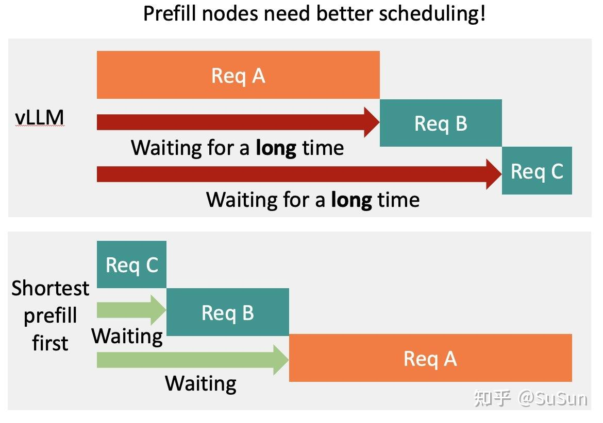

# dynamo (2): 从Dynamo的I/O 聊开去：一些不成熟的想法

**Author:** SuSun

**Date:** 2025-08-02

**Link:** https://zhuanlan.zhihu.com/p/1935027337570780662

最近在工作围绕着推理系统的多层级I/O系统调度展开，从 Dynamo 的三级（GPU/CPU/Disk）KV 缓存的I/O出发，思考如何设计IO调度，优先级，公平性，带宽利用率。和数据库I/O调度有异曲同工之妙，读一读[seastar](https://zhida.zhihu.com/search?content_id=261156589&content_type=Article&match_order=1&q=seastar&zhida_source=entity)的i/o调度器。

目前对于dynamo来说，单机总共有三个存储层级，GPU, CPU, DISK. 数据随着热度退却等原因需要下沉到下一层级，也会随着请求命中或者热度提升等原因提升。在dynamo中卸载到下一层叫做offloading， lmcache中是store, sglang是backup，提升到上一层，dynamo中是onboarding, lmcache是retrieve，sglang中是prefetch。

从同一件事情在不同系统的不同命名，他们在系统中被期望的职责不同，更准确的说，是kv缓存管理和调度算法设计不同。 如何针对不同的负载设计不同的调度算法将会是短期比较重要的一个议题。

无论是offloading还是onboarding，由于上层的i/o模式简单，实际上的实现也不会太复杂，GPU→ GPU cudaMemcpy（也可以走kernel，不过我不熟）， CPU→ DISK write，反之亦然。

一旦提到I/O，存储人的脑子里就会开始冒出长尾，读放大，写放大，i/o碎片化，i/o调度等问题，传统存储在DISK 和网络I/O 上做的比较成熟了。但涉及到GPU I/O的还是头一次。我们来看看Dynamo是怎么设计的。

### dynamo offloading模块设计

Dynamo整体采用Actor风格，通过消息队列来解耦。它设置了四个无界消息通道，分别处理 `GPU → Host`、`Host → Disk` 的offloading，以及 `Host → GPU`、`Disk → GPU` 的onboarding。

```rust
/// OffloadManager处理所有跨缓存层级的块传输
pub struct OffloadManager<Metadata: BlockMetadata> {
    // 三个层级的存储池句柄
    disk: Option<Arc<BlockPool<DiskStorage, Metadata>>>,
    host: Option<Arc<BlockPool<PinnedStorage, Metadata>>>,
    device: Option<Arc<BlockPool<DeviceStorage, Metadata>>>,

    // 两个offloading请求队列
    device_offload_tx: mpsc::UnboundedSender<OffloadRequest<DeviceStorage, Metadata>>,
    host_offload_tx: mpsc::UnboundedSender<OffloadRequest<PinnedStorage, Metadata>>,

    // 两个onboarding请求队列
    host_onboard_tx: mpsc::UnboundedSender<OnboardRequest<PinnedStorage, DeviceStorage, Metadata>>,
    disk_onboard_tx: mpsc::UnboundedSender<OnboardRequest<DiskStorage, DeviceStorage, Metadata>>,

    // 用于排序的逻辑时间戳
    // 或许换成AtomicU64会更好，毕竟只是需要一个单调递增的标记。
    tick: Arc<Mutex<u64>>,
}
```

代码很清晰，很漂亮，但真正体现设计意图的，是`OnboardRequest`和`OffloadRequest`的定义差异：

-   **OffloadRequest**:  
    pub struct OffloadRequest<S: Storage, M: BlockMetadata> { pub key: OffloadRequestKey,// 包含优先级和时间戳 pub block: Weak<MutableBlock<S, M>>,// 注意：这里是弱引用 pub sequence\_hash: u64, }  
    offloadng请求持有**弱引用**。这意味着，即使一个block在下沉队列里排队，上层缓存如果需要空间，也可以随时回收它，下沉任务届时只需取消即可。这是一种“**尽力而为（Best-Effort）**”的异步模式。同时，需要保证gpu 内存的高利用率。  
    
-   **OnboardRequest** :  
    pub struct OnboardRequest<Source: Storage, Target: Storage, M: BlockMetadata> { pub blocks: Vec<ImmutableBlock<Source, M>>,// 强引用 pub response\_tx: oneshot::Sender<...>,// 需要一个明确的结果回传 }  
    提升请求持有**强引用**，并且调用方会等待一个`oneshot`的返回结果。这是一种“**必须成功**”的同步阻塞模式。  
    

这种设计上的鲜明对比，把系统的核心诉求摆在了台面上：

1.  **Onboarding是第一公民**：延迟敏感，必须优先处理，保证服务质量（QoS）。
2.  **Offloading是二等公民**：尽力而为，利用系统空闲时段悄悄进行，类似数据库后台的压缩和清理工作。

这就引出了一系列经典问题：优先级如何定？如何保证公平性，避免低优任务饿死？所谓的背压（Back-pressure）真的有效吗？

而onboard则不同，强引用，上层需要等待结果，“必须要及时给我结果”。

代码设计和实现都比较漂亮，但展开讲一讲似乎没什么必要，因为不同语言，不同生态下的代码还是很不一样。

但真的背压了吗？我们来看CudaTransferManager，提交请求的流程

```rust
// 这里已经开始传输，如果是cpu memcpy会阻塞，gpu略有复杂，但应该是async的
        // 这里阻塞了实际会影响到后面的请求吧？可能这里不会触发 cpu memcpy
        let notify = pending_transfer
            .sources
            .write_to(
                &mut pending_transfer.targets,
                true,
                self.transfer_ctx.clone(),
            )?;

        // 这里有背压，但感觉没用，因为传输已经开始了
        self.pending_transfer_q
            .send((pending_transfer, notify))
            .await?;
```

dynamo 给了很好的思考开始

1.  为什么offloading需要优先级？onboarding优先级是否一直优于offloading?
2.  做了优先级，就会有公平性，饿死的问题需要考虑
3.  为什么需要背压？ 有bench展示吗？

系统设计的要求是什么？

1.  offloading尽力而为，有空就运输一些。类似db的后台io，校验，压缩。
2.  onboarding是第一公民，高优先级，latency很重要。类似db的用户实时query。

所以对于一个好的 offloading 模块来说，最重要的是两个指标

1.  onboarding 请求处理时间
2.  系统带宽利用率

### Seastar的I/O 调度器

回到熟悉的数据库领域，会发现这些问题早已被深入探讨，只不过换了存储介质。我们不妨回看经典的seastar io调度器，寻求一些灵感

资源是有限的，面对诸多请求，需要切分地刚刚好，太保守，资源利用率低，太激进，资源负载过高，容易长尾等。

> as much as it can, but not more than this

### **I/O Throttler (节流器) - 如何控制资源总量？**

容量的切分，最naive的方案，就是 `Mutex<int>` ，来了看一下有没有，有就更新拿走，用完归还，没有就等待。

但这样没法实现公平性，可能会有worker在这种CAS中一直拿不到资源，这样的结构无法表达，“hey，我需要2份资源的语义”，它只能表达“现在还剩多少资源”。

seastar用一个滑动窗口解决该问题

-   tail\_rover : 记录已经分派出去的请求总数，取号的，单调递增，左边界，初始值=0
-   head\_rover: 系统资源的capacity，右边界，初始值=capacity

一个请求到来时，先去`tail_rover`取一个号。如果票号小于`head_rover`，请求可以通过；否则，就得等待已完成的请求归还容量，使`head_rover`前进。这个简单的FIFO机制保证了基础的公平性。为了适应[NUMA架构](https://zhida.zhihu.com/search?content_id=261156589&content_type=Article&match_order=1&q=NUMA%E6%9E%B6%E6%9E%84&zhida_source=entity)，它还为每个核创建了独立的I/O组，进一步提升了性能。

假设capacity = 10，系统启动后head\_rover = 10, tail\_rover = 0，表示目前可以发送10个请求。

-   有线程提交1个请求，取到的号码是0，tail\_rover → 1, tail\_rover ≤ head\_rover, 可以发出i/o
-   一直提交直到 tail\_rover == 10
-   此时又有一个新请求到来， 渠道的号码是10， tail\_rover → 11, 超出了head\_rover，需要等待head\_rover越过11。

这是公平的，因为每次取号的号码都是单调递增的，head也是递增的，隐式的FIFO。

足够公平吗？也还不够。在NUMA下，tail\_rover 位于哪一个numa，就意味着哪一个numa有更快的速度能拿到号。所以需要为每一个NUMA创建一个独立的I/O组。

无锁，公平，充分利用资源。当然实际的seastart，现在又基于这个机制做的更复杂了一些，进化成了[Shared Token Bucket](https://zhida.zhihu.com/search?content_id=261156589&content_type=Article&match_order=1&q=Shared+Token+Bucket&zhida_source=entity)，增加了一些更加工程的feat，比如后端服务突然变慢了，这时候需要限制head\_over的前进。

### **Fair Queue & [Priority Class](https://zhida.zhihu.com/search?content_id=261156589&content_type=Article&match_order=1&q=Priority+Class&zhida_source=entity)es - 如何平衡优先级与公平性？**

有了总量控制，下一步就是如何在不同类型的请求间分配资源。既能按照优先级有限分配带宽，又不至于让低优先级饿死？

和缓存一样，这实际上也是一个rank 问题，回答的并不是“这个请求到底有多热，有多冷”，而是“A请求比起B请求更热还是更冷”。

1.  **定义优先级类别（Priority Class）**: 用户可以为不同类型的I/O（比如我们的Onboarding和Offloading）定义不同的`shares`（配额）。`shares`越高的类别，能获得的资源越多。  
    
2.  **用“欠债”思想实现公平队列**: 每个优先级类别都有一个`_accumulated`（已累积服务量）计数。  
    

-   当一个请求被处理时，它的`_accumulated`会增加。增加的量（`cost`）反比于它的`shares`。即 `cost = capacity / shares`。
-   调度器永远优先选择`_accumulated`最小的队列。
-   这个值的核心思想是“**欠服务**”越多的队列，优先级越高。同时，因为高`shares`类别的`cost`增长得慢，它们自然能获得更多服务机会。

1.  **解决“沉睡”队列问题**: 一个长期没有请求的低优队列，其`_accumulated`会非常小。一旦它被唤醒，可能会因为“欠债”太多而长时间霸占资源，导致高优任务延迟。Seastar通过一个“**宽恕因子（forgiving\_factor）**”来解决这个问题：当一个沉睡的队列被唤醒时，它的`_accumulated`会被重置到一个接近当前活跃队列的水平，而不是从一个很小的值开始，从而避免了不公平的反向压制。  
    

为不同的请求定义Priority Class

```cpp
class fair_queue::priority_class_data {
    uint32_t _shares = 0;
    capacity_t _accumulated = 0;
    capacity_t _pure_accumulated = 0;
    fair_queue_entry::container_list_t _queue;
    bool _queued = false;
    bool _plugged = true;
    uint32_t _activations = 0;
};
```

-   Share，代表配额。 A class是200，B class 是100，意味着A最大能获得的i/o资源是B的两倍。如果它们都是100，则意味着相同的公平性。
-   capacity\_t \_accumulated: 已经获得的服务量。 \_accumulated越小，优先级越高。

请求会带有一个`capacity`参数，根据请求对iops，带宽的压力计算得出，隐含“对系统压力小的请求优先“。

这意味着同等优先级，更小的请求会具有更高的优先级，这不禁让我想起最近的一篇llm 调度论文（sosp 2025)



  

天下没有新鲜事，只不过一样的事情重复发生。

调度器会为基于优先级类维护一个优先队列，已经获得的服务量，也就是`_accumulated` 小的优先。这里是这样融入优先级的

```cpp
auto req_cap = req._capacity;
    auto req_cost  = std::max(req_cap / h._shares, (capacity_t)1);
    h._accumulated += req_cost;
```

shares越大，cost越小。

这样还是有公平性问题，A shares =100, B shares = 10，A一直在处理，\_accumulated逐步增大，B一直没有，突然某段时间来了很多B，因为B的\_accumulated很小，那么系统在这段时间里就会高优处理B，这违反了优先级。

在seastar里是这么解决的

```cpp
void fair_queue::push_priority_class_from_idle(priority_class_data& pc) noexcept {
    if (!pc._queued) {
        // Don't let the newcomer monopolize the disk for more than tau
        // duration. For this estimate how many capacity units can be
        // accumulated with the current class shares per rate resulution
        // and scale it up to tau.
        // On start this deviation can go to negative values, so not to
        // introduce extra if's for that short corner case, use signed
        // arithmetics and make sure the _accumulated value doesn't grow
        // over signed maximum (see overflow check below)
        pc._accumulated = std::max<signed_capacity_t>(_last_accumulated - _config.forgiving_factor / pc._shares, pc._accumulated);
        _handles.assert_enough_capacity();
        _handles.push(&pc);
        pc._queued = true;
        pc._activations++;
    }
}
```

当B重新启动时，\_accumulated 会被更新为最近处理的最大的\_accumulated 减去它的shares乘上它的”宽恕因子“获得一个新的\_accumulated。

### What’s next?

llm 推理有这么一些带宽，pcie 带宽， RDMA 带宽， nvlink带宽。是否有带宽资源已经达到瓶颈开始排队效应了，是一个值得思考，需要观测的问题。

即使我们知道了 xx带宽是瓶颈，但我们也需要确保io调度的高效，它不能增加过多的额外负担。

调度，调度，还是调度，给定一个workload，和机器配置，决定系统性能的最核心的我觉得是调度策略，我觉得P/D 分离不过是一种分布式调度策略。单机推理引擎融入多级缓存后，单机调度策略也值得思考。

调度和缓存一样，都是处理”时序数据“，需要全局和历史上尽可能多的信息。

-   FIFO有一个全局的队列
-   LRU，LFU则为全局的所有对象”排序“

近几年的缓存工作，也增加了一些类似ghost queue等来保留一定量的历史信息。

无论是单机调度器还是分布式调度器，是否也需要增加一些”历史“信息的维护，同时为当前到来的请求维护”一定的顺序”，比如现在的最长前缀匹配什么的。需要更多的信息，维护更多的状态，逼近更优的解法。

我始终觉得只需要整个系统只需要一个调度器，因为推理服务qps并不高，而且对调度可能产生的开销没有那么“敏感”，除非是groq, cerebras那种，普通大规模云服务推理，感觉只要别排队效应就好说。