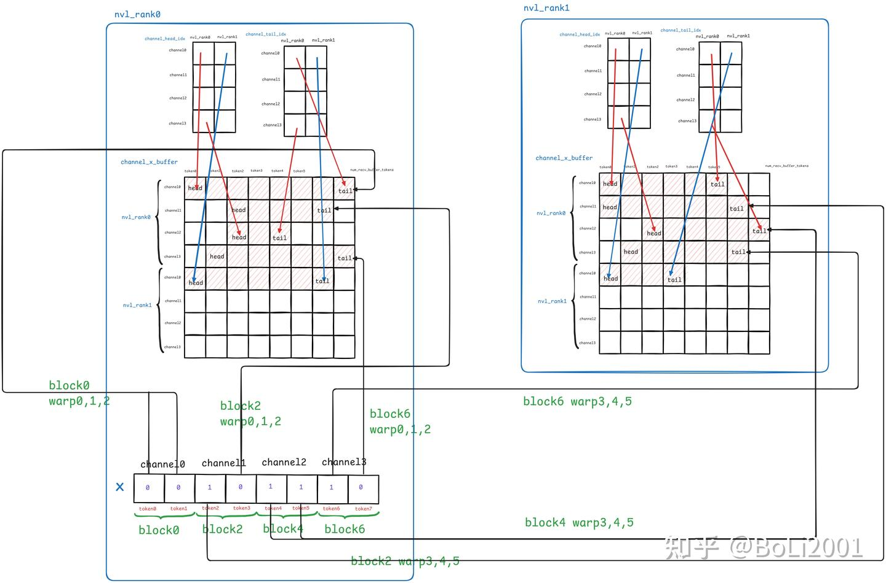
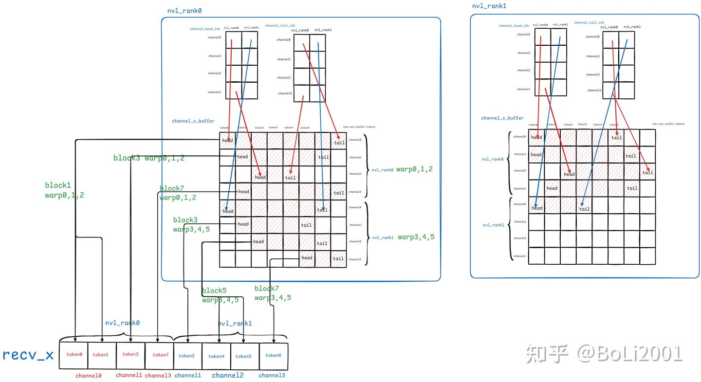

# 一文彻底看懂DeepEP（1）：intranode

**Author:** BoLi2001

**Date:** 2025-08-02

**Link:** https://zhuanlan.zhihu.com/p/1935094821804040824

​

目录

收起

buffer构造

同步通信handle

sync（用handle创建通信组）

nvshmem通信组初始化

get\_dispatch\_layout

dispatch

notify\_dispatch

dispatch

combine

系列文章：

[一文彻底看懂DeepEP（1）：intranode](https://zhuanlan.zhihu.com/p/1935094821804040824)

[一文彻底看懂DeepEP（2）：low latency](https://zhuanlan.zhihu.com/p/1935108598784058926)

待续：internode

本系列文章主要讲解DeepEP代码的实现，对于相关的背景知识如MoE、All2All、CUDA IPC、NVSHMEM不进行过多的介绍，可以通过其他文章了解，如[kernel 笔记: DeepEP (1) 预备知识](https://zhuanlan.zhihu.com/p/1928161639397586106)

DeepEP有两个版本的算子，一个是normal的算子，一个是low latency的算子

-   normal算子主要特点是可以在异构的通信拓扑中进行转发的优化，也就是采用了两阶段的all2all算法。第一阶段将发往同一机器所有token通过IB发送给该机器的一个rank，然后再让这个rank通过NVLink进行机内的转发；这样的好处是[吞吐量](https://zhida.zhihu.com/search?content_id=261164291&content_type=Article&match_order=1&q=%E5%90%9E%E5%90%90%E9%87%8F&zhida_source=entity)比较高，适用于训练和推理prefill阶段
-   而对于需要低延迟的decode阶段，则使用纯RDMA的低延迟算子，它使用卡间直接收发数据的方式，而不是使用normal算子的第一步执行机间同号卡网络发送，再通过nvlink进行转发的两阶段方式。并且normal算子的dispatch包含了notify\_dispatch传输meta信息（即需要给每个专家发送多大的数据）和dispatch传输实际数据两个kernel，而low lantency也省去了notify的过程，为此需要的代价就是显存占用较高。

本文主要讲解normal模式的intranode部分的实现。

对于normal模式来说：

-   num\_nvl\_bytes代表用于节点内通信（使用nvlink）的buffer的大小；num\_rdma\_bytes代表在节点间通信（使用rdma）的buffer大小；所以NVSHMEM只会在跨节点中使用，会调用网络传输接口，NVSHMEM 默认使用 IBRC（但是现在DeepEP已经指定为IBGDA了）


-   这里使用了**双缓冲策略，`num_nvl_bytes`（NVLink[缓冲区](https://zhida.zhihu.com/search?content_id=261164291&content_type=Article&match_order=1&q=%E7%BC%93%E5%86%B2%E5%8C%BA&zhida_source=entity)）和`num_rdma_bytes`（RDMA缓冲区）分离，确保高带宽设备间通信（NVLink）和跨节点通信（RDMA）互不干扰**。

**对于low latency模式来说，在节点内通信和节点间通信都会使用rdma，所以low latency构造buffer时传入的num\_nvl\_bytes为0**，只传入num\_rdma\_bytes，不管是节点内还是节点间都使用纯的RDMA通信，不再使用两阶段通信。所以在low latency模式中，所有的GPU都应该通过RDMA连接


所以intranode的kernel要求所有的rank都必须通过nvlink可见；internode的kernel要求在节点内的ranks通过nvlink可见，不同节点上同一个GPU index的rank的通过rdma可见；low latency的kernel要求不管是节点内还是不同节点的rank都必须通过rdma可见（更具体来说就是启用了IBGDA）（现在节点内的rank也允许通过nvlink可见）

## buffer构造

[构造函数](https://zhida.zhihu.com/search?content_id=261164291&content_type=Article&match_order=1&q=%E6%9E%84%E9%80%A0%E5%87%BD%E6%95%B0&zhida_source=entity)首先将传入的参数，如当前进程的 rank、总进程数 num\_ranks、用于 NVLink 的缓冲区大小 num\_nvl\_bytes、用于 RDMA 的缓冲区大小 num\_rdma\_bytes 等保存到类的[成员变量](https://zhida.zhihu.com/search?content_id=261164291&content_type=Article&match_order=1&q=%E6%88%90%E5%91%98%E5%8F%98%E9%87%8F&zhida_source=entity)中。

再使用runtime中的buffer构造函数进行初始化


整个系统由多个节点组成，每个节点内有`NUM_MAX_NVL_PEERS`个GPU；**根据传入的全局rank计算得到对应的节点内的local\_rank（nvl\_rank），和节点在全局的id（rdma\_rank）**

```text
    rdma_rank = rank / NUM_MAX_NVL_PEERS, nvl_rank = rank % NUM_MAX_NVL_PEERS;
    num_rdma_ranks = std::max(1, num_ranks / NUM_MAX_NVL_PEERS), num_nvl_ranks = std::min(num_ranks, NUM_MAX_NVL_PEERS);
```

随后分配节点内的nvlink buffer：

-   这里通过一次 cudaMalloc 调用，在当前 GPU 上分配了一整块内存，并且将内存的指针保存在buffer\_ptrs中当前nvl\_rank对应的位置。这块内存被划分成了几个区域：

1.  num\_nvl\_bytes: 主要的[数据缓冲区](https://zhida.zhihu.com/search?content_id=261164291&content_type=Article&match_order=1&q=%E6%95%B0%E6%8D%AE%E7%BC%93%E5%86%B2%E5%8C%BA&zhida_source=entity)，用于存储要发送或接收的 token 数据。
2.  barrier\_signal\_bytes: 用于节点内 GPU 间同步。
3.  buffer\_ptr\_bytes & barrier\_signal\_ptr\_bytes: **这两个空间实际上是用来存放主机上的buffer\_ptr数组和barrier\_signal\_ptr数组的，后面在sync时会将这两个数组从主机上拷贝到gpu中**

-   然后使用 cudaIpcGetMemHandle 为刚刚分配的内存块创建了一个ipc\_handles。稍后在 sync 阶段，当前 GPU 会把这个句柄广播给节点内的其他所有 GPU。**其他 GPU 收到这个句柄后，就可以通过 cudaIpcOpenMemHandle 将这块[内存映射](https://zhida.zhihu.com/search?content_id=261164291&content_type=Article&match_order=1&q=%E5%86%85%E5%AD%98%E6%98%A0%E5%B0%84&zhida_source=entity)到自己的地址空间，从而实现直接的、通过 NVLink 的高速读写。**
-   接着代码设置了一些指向这块大内存不同区域的指针，方便后续在 CUDA Kernel 中访问。例如 buffer\_ptrs\_gpu 和 barrier\_signal\_ptrs\_gpu。

```text
    if (num_nvl_bytes > 0) {
        // Local IPC: alloc local memory and set local IPC handles
        CUDA_CHECK(cudaMalloc(&buffer_ptrs[nvl_rank], num_nvl_bytes + barrier_signal_bytes + buffer_ptr_bytes + barrier_signal_ptr_bytes));
        CUDA_CHECK(cudaIpcGetMemHandle(&ipc_handles[nvl_rank], buffer_ptrs[nvl_rank]));
        buffer_ptrs_gpu = reinterpret_cast<void**>(static_cast<uint8_t*>(buffer_ptrs[nvl_rank]) + num_nvl_bytes + barrier_signal_bytes);

        // Set barrier signals
        barrier_signal_ptrs[nvl_rank] = reinterpret_cast<int*>(static_cast<uint8_t*>(buffer_ptrs[nvl_rank]) + num_nvl_bytes);
        barrier_signal_ptrs_gpu = reinterpret_cast<int**>(static_cast<uint8_t*>(buffer_ptrs[nvl_rank]) + num_nvl_bytes + barrier_signal_bytes + buffer_ptr_bytes);

        // No need to synchronize, will do a full device sync during `sync`
        CUDA_CHECK(cudaMemsetAsync(barrier_signal_ptrs[nvl_rank], 0, barrier_signal_bytes, comm_stream));
    }
```


单机内的布局


多机的布局

最后创建MoE计数器：

-   在 All-to-All 通信中，每个 GPU 需要知道自己总共会收到多少个 token，才能提前分配好接收缓冲区。这个信息是在 GPU 上计算出来的，但 CPU 需要知道这个结果来执行后续逻辑。
-   这里使用了 cudaHostAllocMapped 来分配Pinned Host Memory并将其映射到 GPU 的地址空间。

-   cudaMallocHost: 在主机（CPU）内存中分配一块特殊的内存，这块内存不会被[操作系统](https://zhida.zhihu.com/search?content_id=261164291&content_type=Article&match_order=1&q=%E6%93%8D%E4%BD%9C%E7%B3%BB%E7%BB%9F&zhida_source=entity)交换到磁盘上。
-   cudaHostAllocMapped: 标志位告诉 CUDA，这块内存需要被 GPU 可见
-   cudaHostGetDevicePointer: 获取这块主机内存在 GPU 侧的地址。

```cpp
    // MoE counter
    CUDA_CHECK(cudaMallocHost(&moe_recv_counter, sizeof(int64_t), cudaHostAllocMapped));
    CUDA_CHECK(cudaHostGetDevicePointer(&moe_recv_counter_mapped, const_cast<int*>(moe_recv_counter), 0));
    *moe_recv_counter = -1;
```

-   CUDA Kernel 可以直接使用 GPU 地址（moe\_recv\_counter\_mapped）向这块内存写入数据，而 CPU 可以直接读取主机地址（moe\_recv\_counter）上的值。这实现了一种高效的从 GPU到CPU 的通信机制，避免了显式的 cudaMemcpy，CPU 这边只需要忙等这个值从 -1 变为一个有效值即可。
-   代码中为不同层级的计数（全局、每个专家、RDMA）都创建了类似的计数器。

```cpp
    // MoE expert-level counter
    CUDA_CHECK(cudaMallocHost(&moe_recv_expert_counter, sizeof(int) * NUM_MAX_LOCAL_EXPERTS, cudaHostAllocMapped));
    CUDA_CHECK(cudaHostGetDevicePointer(&moe_recv_expert_counter_mapped, const_cast<int*>(moe_recv_expert_counter), 0));
    for (int i = 0; i < NUM_MAX_LOCAL_EXPERTS; ++ i)
        moe_recv_expert_counter[i] = -1;
​
    // MoE RDMA-level counter
    if (num_rdma_ranks > 0) {
        CUDA_CHECK(cudaMallocHost(&moe_recv_rdma_counter, sizeof(int), cudaHostAllocMapped));
        CUDA_CHECK(cudaHostGetDevicePointer(&moe_recv_rdma_counter_mapped, const_cast<int*>(moe_recv_rdma_counter), 0));
        *moe_recv_rdma_counter = -1;
    }
```

总的来说，Buffer 的构造函数主要为后续 sync 函数中真正的“建立连接”（即交换 IPC 句柄和建立 RDMA 连接）打下基础，**负责单卡（单进程）的资源准备和本地初始化**

### 同步通信handle

（这里的通信handle包括ipc handle和nvshmem的通信组的unique id）

然后通过allgather获取**group内**的所有ipc handle和device id，

-   注意，这里是整个group内的所有ipc handle，虽然每个进程的buffer中只维护了单机内的ipc\_handle的数组

```python
        # Synchronize device IDs
        device_ids = [None, ] * self.group_size
        local_device_id = self.runtime.get_local_device_id()
        dist.all_gather_object(device_ids, local_device_id, group)
​
        # Synchronize IPC handles
        # 同步ipc_handle
        ipc_handles = [None, ] * self.group_size
        local_ipc_handle = self.runtime.get_local_ipc_handle()
        dist.all_gather_object(ipc_handles, local_ipc_handle, group)
```

随后是否创建NVSHMEM的unique ID

-   在初始化NVSHMEM时，一个至关重要的步骤是：所有需要相互通信的进程（或GPU）必须就一个唯一的ID（Unique ID）达成一致，**所有拥有同一个unique id的进程加入到同一个NVSHMEM通信组**。

而在低延迟模式下，整个ep group中的所有rank都使用NVSHMEM通信，不管是单机还是多机，所以所有的rank都要加入到同一个NVSHMEM通信组中，于是这里就让rank为0的进程负责创建一个nvshmem\_unique\_id，然后广播给所有其他进程

在normal模式下，在单机内部使用的是nvlink通信，而在跨机的情况下，所有节点上相同本地ID的GPU之间使用NVSHMEM通信，组成一个独立的通信组。于是这里让rdma\_rank为0的节点上的所有卡都会执行创建unique\_id的过程，然后将unique\_id广播给整个group，每个rank的root\_unique\_id就是rdma\_rank0机器的相同nvl\_rank的unique\_id。

```python
        # Synchronize NVSHMEM unique IDs
        # 获取root的NVSHMEM的unique_id， 并且同步
        root_unique_id = None
        if self.runtime.get_num_rdma_ranks() > 1 or low_latency_mode:
            # Synchronize using the root ID
            nvshmem_unique_ids = [None, ] * self.group_size
            if (low_latency_mode and self.rank == 0) or (not low_latency_mode and self.runtime.get_rdma_rank() == 0):
                root_unique_id = self.runtime.get_local_nvshmem_unique_id()
            dist.all_gather_object(nvshmem_unique_ids, root_unique_id, group)
            root_unique_id = nvshmem_unique_ids[0 if low_latency_mode else self.runtime.get_root_rdma_rank(True)]
​
        # Make CPP runtime available
        # 已经获取了所有对端的信息，接下来创建IPC和NVSHMEM的结构
        self.runtime.sync(device_ids, ipc_handles, root_unique_id)
        assert self.runtime.is_available()
```

除此之外，对于跨机的normal模式和ll模式，这里还设置了一些[环境变量](https://zhida.zhihu.com/search?content_id=261164291&content_type=Article&match_order=1&q=%E7%8E%AF%E5%A2%83%E5%8F%98%E9%87%8F&zhida_source=entity)：

-   通过设置环境变量`NVSHMEM_IB_ENABLE_IBGDA=1`和`NVSHMEM_IBGDA_NIC_HANDLER=gpu`，让**跨机的normal模式和ll模式都使用了IBGDA**
-   可以通过设置环境变量`NVSHMEM_DISABLE_P2P=1`禁用[自适应路由](https://zhida.zhihu.com/search?content_id=261164291&content_type=Article&match_order=1&q=%E8%87%AA%E9%80%82%E5%BA%94%E8%B7%AF%E7%94%B1&zhida_source=entity)（AR），以避免数据包在NVLink和RDMA之间的转发（normal模式通常不禁用，ll模式通过设置allow\_nvlink\_for\_low\_latency\_mode参数来决定是否禁用）
-   设置较大的QP深度（如`NVSHMEM_QP_DEPTH=1024`），以确保QP槽位足够，避免等待WQ（WorkQueue）槽位检查。

```python
        if self.runtime.get_num_rdma_ranks() > 1 or low_latency_mode:
            # Enable IBGDA 
            assert num_qps_per_rank > 0
            os.environ['NVSHMEM_DISABLE_P2P'] = '0' if allow_nvlink_for_low_latency_mode else '1'
            os.environ['NVSHMEM_IB_ENABLE_IBGDA'] = '1'
            os.environ['NVSHMEM_IBGDA_NUM_RC_PER_PE'] = f'{num_qps_per_rank}'
            # Make sure QP depth is always larger than the number of on-flight WRs, so that we can skip WQ slot check
            os.environ['NVSHMEM_QP_DEPTH'] = '1024'
​
            # Reduce gpu memory usage
            # 6 default teams + 1 extra team
            os.environ['NVSHMEM_MAX_TEAMS'] = '7'
            # Disable NVLink SHArP
            os.environ['NVSHMEM_DISABLE_NVLS'] = '1'
            # NOTES: NVSHMEM initialization requires at least 256 MiB
            os.environ['NVSHMEM_CUMEM_GRANULARITY'] = f'{2 ** 29}'
​
            if not allow_mnnvl:
                # Disable multi-node NVLink detection
                os.environ['NVSHMEM_DISABLE_MNNVL'] = '1'
```

### sync（用handle创建通信组）

（这里的通信组包括cuda ipc和nvshmem通信组）

然后调用sync，将cuda ipc的handle和nvshmem的handle进行同步

首先是对于机内通信，每个rank打开cuda ipc\_handle并且建立映射：

-   由于all\_gathered\_handles的大小是整个ep group的大小，而buffer中ipc\_handles数组和buffer\_ptrs数组的大小是节点内部gpu的数量（本质上是因为只有在节点内部才使用ipc通信)，所以需要用rdma\_rank \* num\_nvl\_ranks计算offset来找到当前节点在all\_gathered\_handles中对应的ipc\_handles；
-   然后每个进程遍历当前节点内部所有rank的ipc\_handle，通过cudaIpcOpenMemHandle将它们的buffer映射到自己地址空间，并且开启p2p访问，将地址保存在buffer\_ptrs的对应位置，这样每个rank就可以访问到机内所有rank的buffer了


```cpp
    if (num_nvl_bytes > 0) {
        EP_HOST_ASSERT(num_ranks == device_ids.size());
        EP_HOST_ASSERT(device_ids.size() == all_gathered_handles.size());
        // rdma_rank相当于是节点的编号；num_nvl_ranks相当于是节点上rank数量
        for (int i = 0, offset = rdma_rank * num_nvl_ranks; i < num_nvl_ranks; ++ i) {
            EP_HOST_ASSERT(all_gathered_handles[offset + i].has_value());
            auto handle_str = std::string(all_gathered_handles[offset + i].value());
            EP_HOST_ASSERT(handle_str.size() == CUDA_IPC_HANDLE_SIZE);
            if (offset + i != rank) {
                std::memcpy(ipc_handles[i].reserved, handle_str.c_str(), CUDA_IPC_HANDLE_SIZE);
                // 开启p2p访问
                CUDA_CHECK(cudaIpcOpenMemHandle(&buffer_ptrs[i], ipc_handles[i], cudaIpcMemLazyEnablePeerAccess));
                barrier_signal_ptrs[i] = reinterpret_cast<int*>(static_cast<uint8_t*>(buffer_ptrs[i]) + num_nvl_bytes);
            } else {
                EP_HOST_ASSERT(std::memcmp(ipc_handles[i].reserved, handle_str.c_str(), CUDA_IPC_HANDLE_SIZE) == 0);
            }
        }
```

此时每个rank的buffer的地址只保存在了主机进程的buffer\_ptrs数组中，为了让GPU上的kernel也能直接访问其他rank的buffer，所以还需要将buffer\_ptrs数组cudaMemcpy到GPU上；barrier\_signal\_ptrs数组也是一样的

```cpp
        // Copy all buffer and barrier signal pointers to GPU
        CUDA_CHECK(cudaMemcpy(buffer_ptrs_gpu, buffer_ptrs, sizeof(void*) * NUM_MAX_NVL_PEERS, cudaMemcpyHostToDevice));
        CUDA_CHECK(cudaMemcpy(barrier_signal_ptrs_gpu, barrier_signal_ptrs, sizeof(int*) * NUM_MAX_NVL_PEERS, cudaMemcpyHostToDevice));
```


  

然后是对于机间通信：

```cpp
        auto nvshmem_rank = low_latency_mode ? rank : rdma_rank;
        auto num_nvshmem_ranks = low_latency_mode ? num_ranks : num_rdma_ranks;
        EP_HOST_ASSERT(nvshmem_rank == internode::init(root_unique_id, nvshmem_rank, num_nvshmem_ranks, low_latency_mode));
        internode::barrier();
```

先调用`internode::init`来初始化每个nvshmem通信组，需要传入当前进程在nvshmem通信组中的rank（nvshmem\_rank）；一个nvshmem通信组中的rank数量，即通讯组的大小（num\_nvshmem\_ranks）；和通讯组的root\_unique\_id

-   对于低延迟模式所有进程都是一个nvshmem通信组，所以nvshmem\_rank就等于进程在ep group中的rank，nvshmem通讯组的大小就是ep group中的rank数量
-   对于normal模式每个nvshmem的通信组是所有节点上nvl rank相同的GPU，所以nvshmem\_rank就等于rdma\_rank（即节点的编号），每个通信组的大小为rdma rank的数量，每个通信组的root位于rdma rank=0的节点上。

### **nvshmem通信组初始化**

`internode::init`函数主要通过调用nvshmemx\_init\_attr 接口初始化nvshmem环境，并且返回当前进程对应的pe id

**nvshmem环境通过`nvshmemx_init_attr`函数初始化，支持多种启动方式**：默认通过[进程管理器](https://zhida.zhihu.com/search?content_id=261164291&content_type=Article&match_order=1&q=%E8%BF%9B%E7%A8%8B%E7%AE%A1%E7%90%86%E5%99%A8&zhida_source=entity)的 PMI 接口交互式启动，也可以直接利用现有的 MPI 通信域、OpenSHMEM 环境或者 Plugin 模式。可以通过 NVSHMEM\_BOOTSTRAP 环境变量来指定：

-   PMI：可以选择不同的版本，比如 PMI-1、PMI-2 或 PMIx。
-   MPI：用户可在调用 `nvshmemx_init_attr` 函数时指定 `NVSHMEMX_INIT_WITH_MPI_COMM` 标志以传入一个已有的 MPI\_Comm 作为全局 Team。
-   OpenSHMEM：同样可以在调用`nvshmemx_init_attr` 函数时用 `NVSHMEMX_INIT_WITH_SHMEM` 指示在 OpenSHMEM 程序内启动。
-   UID：**在没有 MPI/SHMEM 的场景下，还可以采用网络唯一 ID (UID) 方式，先调用 nvshmemx\_get\_uniqueid 在一个 PE 上生成 UID，并通过用户定义的机制（比如环境变量 NVSHMEM\_BOOTSTRAP\_UID\_SESSION\_ID或者pytorch的集合[通信接口](https://zhida.zhihu.com/search?content_id=261164291&content_type=Article&match_order=1&q=%E9%80%9A%E4%BF%A1%E6%8E%A5%E5%8F%A3&zhida_source=entity)）分发给各 PE，然后各 PE 在调用 `nvshmemx_set_attr_uniqueid_args` 设置该 UID、自己的 PE 编号和总 PE 数，再集体调用 nvshmemx\_init\_attr函数，并使用 `NVSHMEMX_INIT_WITH_UNIQUEID`标志**。这种 UID 模式利用 TCP 套接字自动交换初始化信息，无需依赖 MPI。DeepEP中就采用了这种初始化方式

具体来说：先调用nvshmemx\_set\_attr\_uniqueid\_args，其实就是设置了 nvshmemx\_init\_attr 的id、当前进程在nvshmem通信组中的pe编号和一个nvshmem通讯组的总pe数；然后调用了nvshmemx\_init\_attr

```cpp
int init(const std::vector<uint8_t> &root_unique_id_val, int rank, int num_ranks, bool low_latency_mode) {
    nvshmemx_uniqueid_t root_unique_id;
    nvshmemx_init_attr_t attr;
    std::memcpy(&root_unique_id, root_unique_id_val.data(), sizeof(nvshmemx_uniqueid_t));
    nvshmemx_set_attr_uniqueid_args(rank, num_ranks, &root_unique_id, &attr);
    nvshmemx_init_attr(NVSHMEMX_INIT_WITH_UNIQUEID, &attr);
```

然后在init函数中，接下来如果是 low\_latency\_mode，并且 num\_ranks > NUM\_MAX\_NVL\_PEERS(8)，也就是多机时，执行 nvshmem\_team\_split\_strided，将 NVSHMEM 的 team 划分为多组 sub-RDMA team，这样可以实现每组内部的高效通信，同时保证整体的[可扩展性](https://zhida.zhihu.com/search?content_id=261164291&content_type=Article&match_order=1&q=%E5%8F%AF%E6%89%A9%E5%B1%95%E6%80%A7&zhida_source=entity)和性能。

-   用户可以通过“split”现有 Team 来创建新 Team（如 nvshmem\_team\_split\_strided() 等），也可以使用扩展接口 nvshmemx\_team\_get\_uniqueid 和 nvshmemx\_team\_init 任意指定新 Team 成员。后者需要选定一个 Root PE 来生成 Team 的唯一 ID，并将此 ID 分发给 Team 内所有 PE。创建 Team 时，每个 PE 提供在新 Team 中的编号（pe\_idx\_in\_team），新 Team 成员按照该编号 0 到 N–1 重新编号。

```cpp
    if (low_latency_mode and num_ranks > NUM_MAX_NVL_PEERS) {
        EP_HOST_ASSERT(cpu_rdma_team == NVSHMEM_TEAM_INVALID);
        EP_HOST_ASSERT(num_ranks % NUM_MAX_NVL_PEERS == 0);
        EP_HOST_ASSERT(nvshmem_team_split_strided(NVSHMEM_TEAM_WORLD, rank % NUM_MAX_NVL_PEERS, NUM_MAX_NVL_PEERS,
                                                  num_ranks / NUM_MAX_NVL_PEERS, &cpu_rdma_team_config, 0, &cpu_rdma_team) == 0);
        EP_HOST_ASSERT(cpu_rdma_team != NVSHMEM_TEAM_INVALID);
    }
```

最后init函数使用`nvshmem_my_pe` 返回当前进程的pe id

```text
    return nvshmem_my_pe();
```

init结束后，返回sync函数中，最后使用`internode::alloc`创建创建NVSHMEM的[共享内存](https://zhida.zhihu.com/search?content_id=261164291&content_type=Article&match_order=1&q=%E5%85%B1%E4%BA%AB%E5%86%85%E5%AD%98&zhida_source=entity)指针`rdma_buffer_ptr`，此后，所有GPU可以用`rdma_buffer_ptr`来创建共享的buffer，然后使用nvshmem进行通信

```cpp
        rdma_buffer_ptr = internode::alloc(num_rdma_bytes, NUM_BUFFER_ALIGNMENT_BYTES);
        // Clean buffer (mainly for low-latency mode)
        CUDA_CHECK(cudaMemset(rdma_buffer_ptr, 0, num_rdma_bytes));
        // Barrier
        internode::barrier();
}
void* alloc(size_t size, size_t alignment) {
    return nvshmem_align(alignment, size);
}
```

### **get\_dispatch\_layout**

buffer初始化完毕后，在调用dispatch之前，首先要调用get\_dispatch\_layout，主要职责就是根据topk\_idx计算出当前GPU分发给每个rank的token数量（num\_tokens\_per\_rank，是一个长度为rank数量的一维向量），以及分发给每个专家的token数量（num\_tokens\_per\_expert，是一个长度为专家数量的一维向量）和每个token是否要发给每个rank（is\_token\_in\_rank，是一个形状为num\_tokens \* num\_ranks的二维张量）；任务分配是：

-   一部分block专门负责计算num\_tokens\_per\_expert，其中每个block负责计算32个连续的专家的token数量，也就是说每个block负责计算num\_tokens\_per\_expert向量中的32个元素
-   一部分block专门负责计算num\_tokens\_per\_rank，其中每个block负责计算8个连续的rank的token数量，也就是说每个block负责计算num\_tokens\_per\_rank向量中的8个元素


```cpp
void get_dispatch_layout(const int64_t* topk_idx,
                         int* num_tokens_per_rank, int* num_tokens_per_rdma_rank,
                         int* num_tokens_per_expert, bool* is_token_in_rank,
                         int num_tokens, int num_topk, int num_ranks, int num_experts,
                         cudaStream_t stream) {
    // 一个block 256个线程，一个SM 负责32个专家，8个rank
    constexpr int kNumThreads = 256, kNumExpertsPerSM = 32, kNumRanksPerSM = 8;
    // 根据专家和rank的总数计算需要多少个SM，这里说明该kernel是一部分block专门用于专家的计算，一部分专门用于rank的计算
    int num_sms = ((num_experts + kNumExpertsPerSM - 1) / kNumExpertsPerSM) + (num_ranks + kNumRanksPerSM - 1) / kNumRanksPerSM;
    EP_STATIC_ASSERT(kNumExpertsPerSM % NUM_MAX_NVL_PEERS == 0, "Invalid number of experts per SM");
​
    // 根据计算出的sm数量和kNumThreads来设置Grid和block的维度
    SETUP_LAUNCH_CONFIG(num_sms, kNumThreads, stream);
    LAUNCH_KERNEL(&cfg, (get_dispatch_layout<kNumThreads, kNumExpertsPerSM, kNumRanksPerSM>),
                  topk_idx, num_tokens_per_rank, num_tokens_per_rdma_rank, num_tokens_per_expert, is_token_in_rank,
                  num_tokens, num_topk, num_ranks, num_experts);
}
```

kernel中具体的计算过程为：前面block id较小的block负责计算num\_tokens\_per\_expert

```cpp
// 获取该线程块负责的专家区间，每个block根据自己的id认领一段连续的专家
int expert_begin_idx = sm_id * kNumExpertsPerSM, expert_end_idx = min(expert_begin_idx + kNumExpertsPerSM, num_experts);
if (expert_begin_idx < expert_end_idx) {
```

虽然每个block只需要计算num\_tokens\_per\_expert或num\_tokens\_per\_rank中的一部分结果，但是每个block仍然需要完整地遍历整个topk\_idx中的所有token，基本想法就是在共享内存中维护一个大小为256 \* 32的数组（num\_tokens\_per\_expert\_per\_thread），作为当前block的计数器，这样做的好处是**每个线程处理的token不同，在计数器中有自己独立的一行，所以不需要原子操作**；

```cpp
    // Count expert statistics
    __shared__ int num_tokens_per_expert_per_thread[kNumThreads][kNumExpertsPerSM];
```

然后外层的大循环是以block\_size 256为步长遍历topk\_idx，在遍历topk\_idx过程中，一个线程负责一条token，内层的小循环就是每个线程遍历自己对应的token的topk专家的id，如果id在block负责的专家id范围之内，那么就将它累加到num\_tokens\_per\_expert\_per\_thread中该线程自己的计数器中；

```cpp
for (int i = thread_id; i < num_tokens; i += kNumThreads) {
    auto shifted_topk_idx = topk_idx + i * num_topk;
    #pragma unroll
    for (int j = 0, expert_idx; j < num_topk; ++ j) {
        expert_idx = static_cast<int>(shifted_topk_idx[j]);
        // 如果这个token的专家是本块负责的专家之一
        if (expert_begin_idx <= expert_idx and expert_idx < expert_end_idx)
        // 在共享内存中增加自己的私有计数器
        // 即在第几个线程中统计这个专家的token数
            ++ num_tokens_per_expert_per_thread[thread_id][expert_idx - expert_begin_idx];
    }
}
```

最后遍历完之后得到256 \* 32的统计结果，每个专家分配到的token数目分散在256个线程各自的计数器中，所以还需要在256个线程的维度上对计数器进行一次规约，那么一个线程负责一条长度为256的向量，所以这里只需要block中的前32个线程，每个线程遍历256个元素，将它们求和，最后32个线程分别将结果写入到num\_tokens\_per\_expert的对应位置中；最后这部分的block做完了自己的任务，直接返回

```cpp
// Sum up
// 获得最后该专家需要多少个tokens
EP_STATIC_ASSERT(kNumExpertsPerSM <= kNumThreads, "Too many experts per SM");
if (expert_begin_idx + thread_id < expert_end_idx) {
    int sum = 0;
    #pragma unroll
    for (int i = 0; i < kNumThreads; ++ i)
        sum += num_tokens_per_expert_per_thread[i][thread_id];
    num_tokens_per_expert[expert_begin_idx + thread_id] = sum;
}
return;
```

后面的block\_id较大的block则负责计算num\_tokens\_per\_rank和is\_token\_in\_rank的结果，计算方式也是一样的，在共享内存中维护一个大小为256 \* 8的数组（num\_tokens\_per\_rank\_per\_thread），外层的大循环以256为步长遍历topk\_idx中所有的token，每个线程每次负责一条token，内层的小循环就是每个线程遍历自己对应的token的topk专家的id；区别在于这里**每个线程在遍历一条token的topk时都会在自己的[寄存器](https://zhida.zhihu.com/search?content_id=261164291&content_type=Article&match_order=1&q=%E5%AF%84%E5%AD%98%E5%99%A8&zhida_source=entity)上创建一个长为8的向量（is\_in\_rank），来记录该token是否在线程所负责的rank上**；遍历完一条token之后，每个线程再遍历自己的is\_in\_rank向量，将它的值保存在全局的is\_token\_in\_rank中，再更新num\_tokens\_per\_rank\_per\_thread中线程对应的行。

```cpp
for (int i = thread_id; i < num_tokens; i += kNumThreads) {
    auto shifted_topk_idx = topk_idx + i * num_topk;
    int is_in_rank[kNumRanksPerSM] = {0}, is_in_rdma_rank[kNumRDMARanksPerSM] = {0};
    #pragma unroll
    for (int j = 0, expert_idx, rank_idx; j < num_topk; ++j) {
        expert_idx = static_cast<int>(shifted_topk_idx[j]);
        if (expert_begin <= expert_idx and expert_idx < expert_end) {
            // Count single rank
            rank_idx = expert_idx / num_expert_per_rank - rank_begin_idx;
            is_in_rank[rank_idx] ++, is_in_rdma_rank[rank_idx / NUM_MAX_NVL_PEERS] ++;
        }
    }
​
    auto shifted_is_token_in_rank = is_token_in_rank + i * num_ranks;
    #pragma unroll
    for (int j = 0; j + rank_begin_idx < rank_end_idx; ++ j) {
        shifted_is_token_in_rank[j + rank_begin_idx] = (is_in_rank[j] > 0);
        num_tokens_per_rank_per_thread[thread_id][j] += (is_in_rank[j] > 0);
    }
}
```

最后遍历完之后得到256 \* 8的统计结果，依然需要在256个线程的维度上进行规约，让block中的前8个线程，每个线程遍历256个token，将它们求和；最后8个线程分别将结果写入到num\_tokens\_per\_rank的对应位置中

```cpp
// Sum up
EP_STATIC_ASSERT(kNumRanksPerSM <= kNumThreads, "Too many ranks per SM");
if (rank_begin_idx + thread_id < rank_end_idx) {
    int sum = 0;
    #pragma unroll
    for (int i = 0; i < kNumThreads; ++ i)
        sum += num_tokens_per_rank_per_thread[i][thread_id];
    num_tokens_per_rank[rank_begin_idx + thread_id] = sum;
}
```

## **dispatch**

dispatch输入的x，可以是bf16的数据或量化成fp8的数据，如果是bf16，那么就是一个形状为(num\_tokens, hidden)的fp16的tensor；如果是fp8，那么x就是一个torch.Tensor的tuple，第一个元素是一个形状为(num\_tokens, hidden)的fp8（e4m3）的tensor，第二个元素是tensor对应的scale，形状是(num\_tokens, hidden // 128)，可能是因为tensor是按照128的group量化的

量化具体过程为：

-   对称量化：确保输入张量 x 是一个二维矩阵，并且其第二维（列数）的大小是128的整数倍。然后将输入张量 x（形状为 \[num\_tokens, hidden\]）变形为 \[num\_tokens, hidden/128, 128\]。相当于对token按照128的group进行量化。然后`x_view.abs().float().amax(dim=2)`对于x\_view的第二个维度获取最大值（即每个128元素的group）amax。最后return中返回的第二个值`(x_amax / 448.0)`就是量化得到的scale，448是 torch.float8\_e4m3fn 数据类型能表示的最大正数值；再让x\_view中的每个数除以对应的scale（`x_view * (448.0 / x_amax.unsqueeze(2))`）

```python
def per_token_cast_to_fp8(x: torch.Tensor):
    assert x.dim() == 2 and x.size(1) % 128 == 0
    m, n = x.shape
    x_view = x.view(m, -1, 128)
    x_amax = x_view.abs().float().amax(dim=2).view(m, -1).clamp(1e-4)
    return (x_view * (448.0 / x_amax.unsqueeze(2))).to(torch.float8_e4m3fn).view(m, n), (x_amax / 448.0).view(m, -1)
​
​
def per_token_cast_back(x_fp8: torch.Tensor, x_scales: torch.Tensor):
    if x_scales.dtype == torch.int:
        x_scales = x_scales.view(dtype=torch.int8).to(torch.int) << 23
        x_scales = x_scales.view(dtype=torch.float)
    x_fp32 = x_fp8.to(torch.float32).view(x_fp8.size(0), -1, 128)
    x_scales = x_scales.view(x_fp8.size(0), -1, 1)
    return (x_fp32 * x_scales).view(x_fp8.shape).to(torch.bfloat16)
```

dispatch输入的其他参数：

-   num\_tokens\_per\_rank，形状是rank的数量，表示当前rank发送给每个rank的token数量
-   num\_tokens\_per\_rdma\_rank，形状是rdma\_rank的数量，对normal dispatch来说就是节点的数量；如果是intranode dispatch那么此参数为none
-   is\_token\_in\_rank，形状是(num\_tokens, num\_ranks)，表示当前rank中的每个token是否要发给某个rank
-   num\_tokens\_per\_expert，形状是专家的数量，表示当前rank要发送多少token给某个专家
-   topk\_idx和topk\_weights，形状是(num\_tokens, num\_topk)，表示当前rank的每个token要发送topk专家的idx和weight是什么

输出：

-   recv\_x，当前rank接收到的token
-   recv\_topk\_idx和recv\_topk\_weights，当前rank接收到的token所对应的topk 专家的idx和weights
-   num\_recv\_tokens\_per\_expert\_list：形状为当前rank本地的专家数量，表示本地的每个专家接收到的token数量
-   handle：由于在dispatch之前需要先调用notify\_dispatch在所有rank之间通信一次，获取一些通信的metadata（比如当前rank从其他rank接收的token总数，当前rank的每个本地专家从其他rank接收多少token等），如果不同的dispatch之间topk\_idx和token数量都不变，那么这些metadata也是不变的，这种情况就可以复用之前的metadata，所以dispatch支持返回本次的notify\_dispatch的结果（rank\_prefix\_matrix, channel\_prefix\_matrix, recv\_channel\_prefix\_matrix），将它们打包成handle返回给用户；用户下一次调用dispatch时可以将handle传入，dispatch检测到handle不为空就可以跳过notify\_dispatch阶段，而是调用cached\_notify\_dispatch kernel，仅对rank\_prefix\_matrix做一个拷贝

在dispatch中，如果get\_num\_rdma\_ranks结果大于1，说明有多个节点，那么就调用internode\_dispatch，否则就调用intranode\_dispatch。intranode\_dispatch中如上面所说，如果检测到cached\_mode（也就是handle不为空），那么就调用cached\_notify\_dispatch；否则就会调用`notify_dispatch` kernel

### notify\_dispatch

由于dispatch时需要将接收到的结果保存在recv\_x中，所以为了给recv\_x tensor分配空间，需要提前得知当前rank总共会从其他rank接收到多少token，这个数值需要由notify\_dispatch与其他rank通信计算得到，保存在`moe_recv_counter_mapped`中

除此之外，在dispatch时，是将token切分为子序列，称为channel，每个block负责发送一个channel；dispatch时每个rank是并行发送token的，在rank内部，channel也是并行发送token的；而接收方不能一股脑地将所有token直接放在recv\_x中，而是需要有序地存放在recv\_x中，**recv\_x中不同rank之间的token按照rank id排序（需要知道rank在全局的偏移量），rank内部的token按照channel id排序（需要知道channel在rank内部的偏移量），channel内部的token按照token id排序**。因此reciever需要知道上面的三个信息。那么notify\_dispatch就负责计算：

-   `rank_prefix_matrix`：每个rank从其他rank接收的token数量的前缀和矩阵，形状为num\_ranks \* num\_ranks，(i, j)表示rank j从rank i以及rank i之前的所有rank接收的token数量，用于在数据接收时，精确定位来自不同rank的数据应该存放在接收缓冲区的哪个位置
-   `channel_prefix_matrix`：形状为num\_ranks \* num\_channels，(i, j)表示当前rank的channel j以及channel j之前的所有channel给rank i发送的token数量

notify\_dispatch C++[包装函数](https://zhida.zhihu.com/search?content_id=261164291&content_type=Article&match_order=1&q=%E5%8C%85%E8%A3%85%E5%87%BD%E6%95%B0&zhida_source=entity)通过 `SETUP_LAUNCH_CONFIG` 宏来配置Kernel，它会启动 1 + num\_ranks 个线程块（Thread Blocks）,块内线程数量是128；

那么在单机八卡的intranode\_dispatch的情况下，就是9个线程块，依然是一个block分配到一个sm，函数逻辑根据 sm\_id 分为两部分：

-   1个协调块 (Coordinator Block)：blockIdx.x（sm\_id） 为 0 的线程块，扮演总指挥的角色。
-   8个工作块 (Worker Blocks)：blockIdx.x （sm\_id）从 1 到 8 的线程块，每个块负责一个目标rank的计算任务。

```cpp
#ifndef SETUP_LAUNCH_CONFIG
#ifndef DISABLE_SM90_FEATURES // 使用sm90的情况下
#define SETUP_LAUNCH_CONFIG(num_sms, num_threads, stream) \
    cudaLaunchConfig_t cfg = {(num_sms), (num_threads), 0, stream, nullptr, 0}; \
    cudaLaunchAttribute attr[2]; \
    attr[0].id = cudaLaunchAttributeCooperative; \
    attr[0].val.cooperative = 1; \
    attr[1].id = cudaLaunchAttributeClusterDimension; \
    attr[1].val.clusterDim.x = (num_sms % 2 == 0 ? 2 : 1); \
    attr[1].val.clusterDim.y = 1; \
    attr[1].val.clusterDim.z = 1; \
    cfg.attrs = attr; \
    cfg.numAttrs = 2
#else // 不使用sm90的情况下
#define SETUP_LAUNCH_CONFIG(sms, threads, stream) \
    int __num_sms = (sms); \
    int __num_threads = (threads); \
    auto __stream = (stream)
#endif
#endif
​
#ifndef LAUNCH_KERNEL
#ifndef DISABLE_SM90_FEATURES
#define LAUNCH_KERNEL(config, kernel, ...) CUDA_CHECK(cudaLaunchKernelEx(config, kernel, ##__VA_ARGS__))
#else
#define LAUNCH_KERNEL(config, kernel, ...) \
do { \
    kernel<<<__num_sms, __num_threads, 0, __stream>>>(__VA_ARGS__); \
    cudaError_t e = cudaGetLastError(); \
    if (e != cudaSuccess) { \
        EPException cuda_exception("CUDA", __FILE__, __LINE__, cudaGetErrorString(e)); \
        fprintf(stderr, "%s\n", cuda_exception.what()); \
        throw cuda_exception; \
    } \
} while (0)
#endif
#endif
​
#define SWITCH_RANKS(case_macro) \
    switch (num_ranks) { \
        case 2: case_macro(2); \
        case 4: case_macro(4); \
        case 8: case_macro(8); \
        default: EP_HOST_ASSERT(false and "Unsupported ranks"); \
    } while (false)
​
void notify_dispatch(const int* num_tokens_per_rank, int* moe_recv_counter_mapped, int num_ranks,
                     const int* num_tokens_per_expert, int* moe_recv_expert_counter_mapped, int num_experts,
                     int num_tokens, const bool* is_token_in_rank, int* channel_prefix_matrix,
                     int* rank_prefix_matrix_copy, int num_memset_int, int expert_alignment,
                     void** buffer_ptrs, int** barrier_signal_ptrs, int rank,
                     cudaStream_t stream, int num_channels) {
#define NOTIFY_DISPATCH_LAUNCH_CASE(ranks) \
    LAUNCH_KERNEL(&cfg, notify_dispatch<ranks>, \
        num_tokens_per_rank, moe_recv_counter_mapped, \
        num_tokens_per_expert, moe_recv_expert_counter_mapped, num_experts, \
        num_tokens, num_channels, is_token_in_rank, channel_prefix_matrix, \
        rank_prefix_matrix_copy, num_memset_int, expert_alignment, \
        buffer_ptrs, barrier_signal_ptrs, rank); \
    break
​
    constexpr int kNumThreads = 128;
    EP_HOST_ASSERT(num_experts % num_ranks == 0);
    EP_HOST_ASSERT(num_experts / num_ranks <= kNumThreads and num_ranks <= kNumThreads);
​
    SETUP_LAUNCH_CONFIG(1 + num_ranks, kNumThreads, stream);
    SWITCH_RANKS(NOTIFY_DISPATCH_LAUNCH_CASE);
#undef NOTIFY_DISPATCH_LAUNCH_CASE
}
```

（1）worker block的逻辑 (sm\_id > 0)：每个block负责一个目标rank（dst\_rank = sm\_id - 1）。**它的任务是计算channel\_prefix\_matrix**，更具体来说，每个block负责计算channel\_prefix\_matrix的一行，因为channel\_prefix\_matrix的形状为num\_ranks \* num\_channels，它的一行就代表当前rank的每个channel向这一行对应的目标rank发送的token数量的前缀和。

**它分为两步实现，先计算出当前rank的每个channel向目标rank发送的token数量，并保存在channel\_prefix\_matrix中；然后再对channel\_prefix\_matrix的每一行计算前缀和**

1.  任务划分是 block中的每个warp负责一个channel；channel的数量是config中指定的sm数量的一半，比如如果当前rank输入的token数量是10000，config中指定的sm数量是100，那么channel数量就是50，每个channel有200个token，由于block\_size是128，那么一个block中有4个warp，4个warp要负责50个channel中的token，在一个channel中一个warp中的32个线程要负责200个token；那么代码上就是由两层循环组成，外层循环以num\_warps（4）为步长遍历50个channel，内层循环以warp\_size（32）为步长遍历200个token；
2.  在每个通道内，对应的warp以32为步长遍历通道的token，它通过该token在全局的偏移量和该block负责的rank的偏移量在is\_token\_in\_rank数组中找到该token是否发往自己负责的rank，并且累加，**得到该channel要发往目标rank的token数量**，存放在`channel_prefix_matrix`中的对应位置

```cpp
int dst_rank = sm_id - 1;
for (int channel_id = warp_id; channel_id < num_channels; channel_id += num_warps) {
    int token_start_idx, token_end_idx;
    get_channel_task_range(num_tokens, num_channels, channel_id, token_start_idx, token_end_idx);

    // Iterate over tokens
    int count = 0;
    for (int64_t i = token_start_idx + lane_id; i < token_end_idx; i += 32)
        count += is_token_in_rank[i * kNumRanks + dst_rank];
    count = warp_reduce_sum(count);
    if (lane_id == 0)
        channel_prefix_matrix[dst_rank * num_channels + channel_id] = count;
}
__syncthreads();
```

3\. 计算出的每个通道的token数后，由每个block的第一个线程遍历channel\_perfix\_matrix的对应行，计算该行的前缀和，结果原地存入channel\_prefix\_matrix。这个矩阵将在后续真正数据传输时，用来精确定位每个token应该被放到发送缓冲区的哪个位置。

```cpp
// Pre-compute prefix sum for all channels
if (thread_id == 0) {
    #pragma unroll
    for (int i = 1; i < num_channels; ++ i)
        channel_prefix_matrix[dst_rank * num_channels + i] += channel_prefix_matrix[dst_rank * num_channels + i - 1];
}
```

（2）协调块的逻辑 (sm\_id == 0)：协调块是整个同步和信息汇总的核心。它利用 barrier\_block（一种基于GPU内存的屏障）来强制所有rank同步。**所有rank的第一个block共同执行这部分的代码，通过共享内存交换各自的本地统计信息，然后每个rank在自己的HBM中都能得到全局的通信信息，再各自汇总，计算出每个rank和每个本地专家的最终接收数量**，并且将计算结果写入CPU可直接读取的内存中。

1.  第一次同步 (`barrier_block<kNumRanks, true>`): 等待所有工作块完成它们的计算，并确保所有rank都到达了这个同步点。
2.  共享本地计数:

-   每个rank将自己本地之前通过get\_dispatch\_layout kernel统计的 num\_tokens\_per\_rank（当前GPU分发给每个rank的token数量）和 num\_tokens\_per\_expert（当前GPU发给每个expert的token数量）写入到其他每个rank的buffer中。这样每个rank的buffer中就有了全局的所有rank的num\_tokens\_per\_rank和num\_tokens\_per\_expert


-   具体过程是：

-   每个rank的notify\_dispatch kernel的第一个block负责进行同步，**block0中的前num\_ranks（8）个线程，每个线程负责将本地的num\_tokens\_per\_rank和num\_tokens\_per\_expert写入一个其他的rank的buffer**。
-   由于buffer\_ptrs\_gpu（就是这里代码中的buffer\_ptrs）中保存了其他所有rank的buffer指针，所以每个线程可以这样获取到其他rank的buffer地址

```cpp
int *per_rank_buffer, *per_expert_buffer;
if (thread_id < kNumRanks) {
 per_rank_buffer = static_cast<int*>(buffer_ptrs[thread_id]);
 per_expert_buffer = per_rank_buffer + kNumRanks * kNumRanks;
}
```

-   随后每个线程将num\_tokens\_per\_rank和num\_tokens\_per\_expert中的每个元素复制到对应rank的buffer中。注意，**num\_tokens\_per\_expert的复制与num\_tokens\_per\_rank的复制不一样，后者是直接将整个向量复制，前者是仅仅将目标rank的local expert部分复制过去**

```cpp
int num_experts_per_rank = num_experts / kNumRanks;
if (thread_id < kNumRanks) {
 #pragma unroll
 for (int i = 0; i < kNumRanks; ++ i)
 per_rank_buffer[rank * kNumRanks + i] = num_tokens_per_rank[i];
 #pragma unroll
 for (int i = 0; i < num_experts_per_rank; ++ i)
 per_expert_buffer[rank * num_experts_per_rank + i] = num_tokens_per_expert[thread_id * num_experts_per_rank + i];
}
```

-   假设一共两个rank，每个rank两个专家，全局一共四个专家，每个rank的num\_tokens\_per\_rank和num\_tokens\_per\_expert的值如图中所示，那么上面的拷贝过程就像图中一样，每个rank将自己本地的num\_tokens\_per\_rank和num\_tokens\_per\_expert拷贝到其他rank的buffer中


3\. 第二次同步 (`barrier_block<kNumRanks>`): 等待，确保所有rank都完成了上述信息的写入。

4\. 汇总计算与回写:现在共享缓冲区里有了所有rank的统计信息。协调块开始进行全局汇总。

-   计算总接收量: 先获取当前rank的buffer，并且在其中找到per\_rank\_buffer（实际上就在buffer的开头）， 每个线程负责一列，在列上做前缀和，并且写回原地，得到的就是rank\_prefix\_matrix，**即每个rank从其他rank接收的token数量的前缀和矩阵，形状为num\_ranks \* num\_ranks，(i, j)表示rank j从rank i以及rank i之前的所有rank接收的token数量，用于在数据接收时，精确定位来自不同rank的数据应该存放在接收缓冲区的哪个位置。**并且最后**将当前rank从其他所有rank接收的token总数写入到 moe\_recv\_counter\_mapped中**，这是一块CPU可以直接访问的映射内存（Mapped Memory）。

```cpp
auto local_per_rank_buffer = static_cast<int*>(buffer_ptrs[rank]);
if (thread_id < kNumRanks) {
 #pragma unroll
 for (int i = 1; i < kNumRanks; ++ i)
 local_per_rank_buffer[i * kNumRanks + thread_id] += local_per_rank_buffer[(i - 1) * kNumRanks + thread_id];
 if (thread_id == rank)
 *moe_recv_counter_mapped = local_per_rank_buffer[(kNumRanks - 1) * kNumRanks + rank];
}
```

-   计算专家接收量: 同样地，它会计算出**当前rank上的每个本地专家（local expert）将从所有其他rank那里接收到多少token。结果写入 moe\_recv\_expert\_counter\_mapped**。

```cpp
auto local_per_expert_buffer = local_per_rank_buffer + kNumRanks * kNumRanks;
if (thread_id < num_experts_per_rank) {
 int sum = 0;
 #pragma unroll
 for (int i = 0; i < kNumRanks; ++ i)
 sum += local_per_expert_buffer[i * num_experts_per_rank + thread_id];
 sum = (sum + expert_alignment - 1) / expert_alignment * expert_alignment;
 moe_recv_expert_counter_mapped[thread_id] = sum;
}
__syncthreads();
```

  

所以，notify\_dispatch的协调块执行完毕后，**每个rank的kernel会将rank\_prefix\_matrix（每个rank从其他rank接收的token数量的前缀和矩阵）和local\_per\_expert\_buffer（每个rank要向当前rank上的每个本地专家（local expert）发送多少token）这两个矩阵保存在自己的buffer的最开头的地方**

```cpp
auto local_per_rank_buffer = static_cast<int*>(buffer_ptrs[rank]);
auto local_per_expert_buffer = local_per_rank_buffer + kNumRanks * kNumRanks;
```


但是注意，在协调块的最后，**kernel又将自己buffer中的local\_per\_expert\_buffer的数据清空了，只保留了buffer中的rank\_prefix\_matrix的数据**，为后续的dispatch操作的channel buffer留空间。具体来说：

-   在Buffer::Intranode\_dispatch函数中，指定了清空buffer的数据范围。注释表明这是给channel start/end offset, head and tail四个矩阵留的空间

```cpp
// Barrier or send sizes
// To clean: channel start/end offset, head and tail
int num_memset_int = num_channels * num_ranks * 4;
```

-   在notify\_dispatch kernel的最后，将local\_per\_expert\_buffer清空

```cpp
// Extra memset for later communication queue
#pragma unroll
for (int i = thread_id; i < num_memset_int; i += num_threads)
 local_per_expert_buffer[i] = 0;
```

于是我们可以得知，在未来dispatch时每个rank的buffer的内容会变成：


上面的notify\_dispatch会将计算结果写入CPU可直接读取的内存中，即：

-   moe\_recv\_counter\_mapped：当前rank从其他所有rank接收的token总数
-   moe\_recv\_expert\_counter\_mapped：当前rank上的每个本地专家（local expert）将从所有其他rank那里接收到多少token

而intranode\_dispatch函数启动notify\_dispatch后会轮询这两个内存空间，当发现结果计算完毕后，就停止轮询，将C语言数组moe\_recv\_expert\_counter转换成一个vector `num_recv_tokens_per_expert_list`，这个就是intranode\_dispatch的返回值之一

```cpp
while (true) {
    // Read total count
    num_recv_tokens = static_cast<int>(*moe_recv_counter);
​
    // Read per-expert count
    bool ready = (num_recv_tokens >= 0);
    for (int i = 0; i < num_local_experts and ready; ++i)
        ready &= moe_recv_expert_counter[i] >= 0;
​
    if (ready)
        break;
​
    // Timeout check
    if (std::chrono::duration_cast<std::chrono::seconds>(std::chrono::high_resolution_clock::now() - start_time).count() > NUM_CPU_TIMEOUT_SECS)
        throw std::runtime_error("DeepEP error: CPU recv timeout");
}
num_recv_tokens_per_expert_list = std::vector<int>(moe_recv_expert_counter, moe_recv_expert_counter + num_local_experts);
```

再根据确切的大小分配内存，为下一步真正的dispatch做好准备。

```cpp
// Allocate new tensors
auto recv_x = torch::empty({num_recv_tokens, hidden}, x.options());
auto recv_src_idx = torch::empty({num_recv_tokens}, dtype(torch::kInt32).device(torch::kCUDA));
auto recv_topk_idx = std::optional<torch::Tensor>(), recv_topk_weights = std::optional<torch::Tensor>(), recv_x_scales = std::optional<torch::Tensor>();
auto recv_channel_prefix_matrix = torch::empty({num_ranks, num_channels}, dtype(torch::kInt32).device(torch::kCUDA));
auto send_head = torch::empty({num_tokens, num_ranks}, dtype(torch::kInt32).device(torch::kCUDA));
```

  

### dispatch

此时每个rank都有两个[数据结构](https://zhida.zhihu.com/search?content_id=261164291&content_type=Article&match_order=1&q=%E6%95%B0%E6%8D%AE%E7%BB%93%E6%9E%84&zhida_source=entity)：

```cpp
rank_prefix_matrix = torch::empty({num_ranks, num_ranks}, ...);
channel_prefix_matrix = torch::empty({num_ranks, num_channels}, ...);
```

1.  `rank_prefix_matrix`：每个rank从其他rank接收的token数量的前缀和矩阵，形状为num\_ranks \* num\_ranks，(i, j)表示rank j从rank i以及rank i之前的所有rank接收的token数量，用于在数据接收时，精确定位来自不同rank的数据应该存放在接收缓冲区的哪个位置
2.  `channel_prefix_matrix`：形状为num\_ranks \* num\_channels，(i, j)表示当前rank的channel j以及channel j之前的所有channel给rank i发送的token数量

dispatch时会将所有token划分给多个 Channel，两个sm（即block）负责一个channel，偶数block负责发送该channel的数据，奇数block负责接收该channel的数据，所以channel数量等于config中的sm数量除以2

所以intranode::dispatch C++包装函数会启动 num\_sms 个线程块（Thread Blocks），每个block的线程数量为768

在每个channel内，由多个warp来负责发送token，每个warp负责发送特定目标rank的token，**由于一个block的warp数量是768 / 32 = 24，所以当总共有八个rank时，每个 Rank 就会得到一个由 3 个 Warp 组成的warp group**。token的终点是存放在目标rank的recv\_x中

所以在kernel中，每个线程先找到自己负责的rank（responsible\_rank)和自己负责的通信通道 (responsible\_channel)

```cpp
// Several warps are response for a single rank
const auto num_threads_per_rank = kNumThreads / kNumRanks;
const auto num_channels = num_sms / 2;
const auto responsible_rank = (static_cast<int>(thread_id)) / num_threads_per_rank;
// Even-numbered blocks for sending, odd-numbered blocks for receiving.
const auto responsible_channel = sm_id / 2;
```

发送者需要访问目标rank的HBM来写入数据，所以通过 `buffer_ptrs[responsible_rank]` 获取到指向目标Rank的共享通信缓冲区（buffer）的基地址

```cpp
// Calculate pointers by the specific layout
// `rank_prefix_matrix`: kNumRanks * kNumRanks * sizeof(int)
auto ptr = reinterpret_cast<void*>(static_cast<int8_t*>(buffer_ptrs[is_sender ? responsible_rank : rank]) + kNumRanks * kNumRanks * sizeof(int));
```

由于dispatch时，每个rank是并行发送token的，在rank内部，channel也是并行发送token的；而接收方不能一股脑地将所有token直接放在recv\_x中，而是需要有序地存放在recv\_x中，**recv\_x中不同rank之间的token按照rank id排序（需要知道rank在全局的偏移量），rank内部的token按照channel id排序（需要知道channel在rank内部的偏移量），channel内部的token按照token id排序**。如下图所示，假设两个rank，每个rank的x中有八个token，分为8个channel，x中紫色数字表示该token的目标rank，那么经过dispatch之后，两个rank中得到的recv\_x如图所示，就是按照上面所说的顺序进行排序


  

因此reciever需要知道上面的三个信息，其中：

-   rank在全局的偏移量可以通过rank\_prefix\_matrix得知，这个矩阵已经保存在了所有rank的buffer中了
-   channel在rank内部的偏移量：现在每个rank的本地已经有了`channel_prefix_matrix`矩阵，(i, j)表示当前rank的channel j以及channel j之前的所有channel给rank i发送的token数量。这是**记录了自己作为sender发送给每个rank的channel的token分布**，而现在我们需要知道自己作为reciever从每个rank接收到的channel的token分布，所以这个信息可以直接从channel\_prefix\_matrix中获取

因此这里在buffer中又分配了两个矩阵，channel\_start\_offset，channel\_end\_offset，用来记录每个rank发送给自己的channel之间的偏移量

```cpp
int target_rank = is_sender ? rank : responsible_rank;
auto num_channels_total = num_channels * kNumRanks;
auto channel_rank_offset = responsible_channel * kNumRanks + target_rank;
// `start_offset`: kNumChannels * kNumRanks * sizeof(int)
// `end_offset`: kNumChannels * kNumRanks * sizeof(int)
// Buffer构造函数参数为Buffer(void* &gbl_ptr, int num_elems, int offset = 0)，其作用为：
// 将Buffer内部维护的ptr指针指向gbl_ptr + offset的位置，将传入的gbl_ptr指针向后移动num_elems个位置
auto channel_start_offset = Buffer<int>(ptr, num_channels_total, channel_rank_offset);
auto channel_end_offset = Buffer<int>(ptr, num_channels_total, channel_rank_offset);
```

channel\_start\_offset的形状为num\_channel \* num\_ranks，(i, j)表示rank j的channel i发送的token存放在当前rank的recv\_x中的起始位置，

-   实际上就等于当前rank从rank j的channel i之前的所有channel（不包括channel i）接收多少token，也**就是说将rank j的channel\_prefix\_matrix的channel i - 1位置复制过来**

channel\_end\_offset的形状为num\_channel \* num\_ranks，(i, j)表示rank j的channel i发送的token存放在当前rank的缓冲区中的结束位置

-   实际上就等于当前rank从rank j的channel i以及i之前的所有channel（包括channel i）接收多少token，**也就是说将rank j的channel\_prefix\_matrix的channel i位置复制过来**

实际上在kernel后面的代码中，**sender端的每个rank的派送小组中第一个warp的第一个线程（`if (lane_id == 0 and send_warp_id_in_rank == 0)`）需要将本地的channel\_prefix\_matrix中对应的数值拷贝到该block负责的rank的channel\_start\_offset和channel\_end\_offset的对应位置**

```cpp
if (is_sender) {
    // Workers for sending
    constexpr int num_send_warps = kNumThreads / 32; // 24
    constexpr int num_send_warps_per_rank = num_send_warps / kNumRanks; // 8
    const auto send_thread_id = thread_id;
    const auto send_warp_id_in_rank = send_thread_id % num_threads_per_rank / 32; // 当前线程在一个负责一个rank的warp组中的相对warp id，可能为0,1,2
    EP_DEVICE_ASSERT(kNumRanks <= 32);
    EP_DEVICE_ASSERT(num_send_warps % kNumRanks == 0);
​
    // Send offset by `-value - 1`, e.g. 0 -> -1, 1 -> -2
    // NOTES: this is for distinguishing zero tokens
    if (lane_id == 0 and send_warp_id_in_rank == 0) {
        int value = responsible_channel > 0 ? channel_prefix_matrix[responsible_rank * num_channels + responsible_channel - 1] : 0;
        st_relaxed_sys_global(channel_start_offset.buffer(), -value - 1);
        value = channel_prefix_matrix[responsible_rank * num_channels + responsible_channel];
        st_relaxed_sys_global(channel_end_offset.buffer(), -value - 1);
    }
    __syncwarp();
```

假设nvlink域内只有两个rank，每个rank有8个token要dispatch，每个rank的kernel有八个block，那么每个rank的token划分为4个channel，每个channel两个token；那么在dispatch的时候，所有sender端的block完成上面的代码时，channel\_start\_offset和channel\_end\_offset就会像下图这样


除此之外，由于DeepEP中的实现是**sender先将token发送到reciever的一个临时的环形缓冲区中，然后再由reciever将环形缓冲区的token读取到最终的recv\_x中，并且为了区分不同rank不同channel的数据，这里给每个rank每个channel都单独分配了一个环形缓冲区**，所以这里需要在每个rank的buffer中分配一个大小为num\_channels \* num\_ranks \* num\_recv\_buffer\_tokens \* hidden大小的矩阵，这里的num\_recv\_buffer\_tokens就是每个channel的环形缓冲区的大小，由config中的num\_max\_nvl\_chunked\_recv\_tokens决定

-   dispatch时除了传递数据，还需要传递src\_idx、topk\_idx、weights和scale，所以也要给它们分配对应的大小的缓冲区。  
    

-   src\_idx是被dispatch的token在原rank的token序列中的idx，**在 combine 阶段，系统会依据该索引将分散到多个 experts（如 topk=8 时分配到 8 个 experts）的同一 token（src\_idx 相同）的处理结果进行归约（reduce）获得最终的 token**。由于一个token只有一个src\_idx，所以src\_idx的buffer的大小为num\_channels \* num\_ranks \* num\_recv\_buffer\_tokens（没有hidden维度）
-   由于一个token由topk\_num个topk\_idx，所以topk\_idx的buffer大小为num\_channels \* num\_ranks \* num\_recv\_buffer\_tokens \* num\_topk（实际上每个token的topk\_idx是全局的expert id，在rank内有效的expert id数量小于num\_topk，但是这里为了简化情况还是分配了num\_topk大小的缓冲区）
-   同理，topk\_weights的buffer大小也为num\_channels \* num\_ranks \* num\_recv\_buffer\_tokens \* num\_topk
-   由于每个token有num\_scales个scaling factor，所以x\_scales的buffer的大小为num\_channels \* num\_ranks \* num\_recv\_buffer\_tokens \* num\_scales

```cpp
// `x_buffers`: kNumChannels * kNumRanks * num_recv_buffer_tokens * hidden_int4 * sizeof(int4)
// `src_idx_buffers`: kNumChannels * kNumRanks * num_recv_buffer_tokens * sizeof(int)
// `topk_idx_buffers`: kNumChannels * kNumRanks * num_recv_buffer_tokens * num_topk * sizeof(int64_t)
// `topk_weights_buffers`: kNumChannels * kNumRanks * num_recv_buffer_tokens * num_topk * sizeof(float)
// `x_scales_buffers`: kNumChannels * kNumRanks * num_recv_buffer_tokens * num_scales * sizeof(float)
auto channel_x_buffers = Buffer<int4>(ptr, num_channels_total * num_recv_buffer_tokens * hidden_int4, channel_rank_offset * num_recv_buffer_tokens * hidden_int4);
auto channel_src_idx_buffers = Buffer<int>(ptr, num_channels_total * num_recv_buffer_tokens, channel_rank_offset * num_recv_buffer_tokens);
auto channel_topk_idx_buffers = Buffer<int64_t>(ptr, num_channels_total * num_recv_buffer_tokens * num_topk, channel_rank_offset * num_recv_buffer_tokens * num_topk);
auto channel_topk_weights_buffers = Buffer<float>(ptr, num_channels_total * num_recv_buffer_tokens * num_topk, channel_rank_offset * num_recv_buffer_tokens * num_topk);
auto channel_x_scales_buffers = Buffer<float>(ptr, num_channels_total * num_recv_buffer_tokens * num_scales, channel_rank_offset * num_recv_buffer_tokens * num_scales);
```

**既然它们是环形缓冲区，所以每个缓冲区都要有一个head指针和一个tail指针**，所以这里每个rank还需要在自己的buffer中分配两个大小为num\_channels \* num\_ranks的矩阵，即channel\_head\_idx，channel\_tail\_idx，**分别维护了每个rank的每个channel的缓冲区的两个指针**，从tail指针处写入缓冲区，从head指针处读取

-   kernel中在正式开始发送之前没有对channel\_head\_idx和channel\_tail\_idx进行赋值，所以它们的初始值都是0

```cpp
    // `head_idx`: kNumChannels * kNumRanks * sizeof(int)
    // `tail_idx`: kNumChannels * kNumRanks * sizeof(int)
    auto channel_head_idx = Buffer<int>(ptr, num_channels_total, channel_rank_offset);
    auto channel_tail_idx = Buffer<int>(ptr, num_channels_total, channel_rank_offset);
```

对于两个rank，四个channel的场景，channel\_head\_idx、channel\_tail\_idx和channel\_x\_buffer的关系就像下图所示


所以此时每个rank的HBM中的buffer就像下图这样


正式发送的过程：

（1）sender端：

每个block先获取自己负责的channel的token范围

```cpp
// Get tasks
int token_start_idx, token_end_idx;
get_channel_task_range(num_tokens, num_channels, responsible_channel, token_start_idx, token_end_idx);
```

然后block中的每个线程都要挨个遍历channel中的每个token；

-   我们在之前说过，由三个warp负责一个目标rank的token发送，这里会进一步细化任务的分配，**一个warp只负责发送一个token，所以对于目标rank，三个warp会并行发送三个token**（如果有空间并且有token）
-   并且由于发送端每次发送token都需要读取一下接收端的channel\_head\_idx矩阵判断接收端缓冲区是否有空间，这样可能会造成性能低下；所以在循环中是按照chunk（即num\_max\_send\_tokens）发送的，每次等到接收端的缓冲区空出至少num\_max\_send\_tokens后才开始发送

所以在sender遍历每个token时，**每个warp的第一个线程首先要代表该warp**判断接收端是否有足够的空间。发送者通过读取接收方更新的 head 指针，和自己本地维护的 tail 指针做比较，来判断环形缓冲区是否已满。如果满了，就自旋等待，等reciever将缓冲区中的数据读取到recv\_x中，将head指针向后移动。

```cpp
// Iterate over all tokens and send by chunks
int cached_channel_tail_idx = 0;
for (int64_t token_idx = token_start_idx; token_idx < token_end_idx; ) {
    // Check destination queue emptiness, or wait a buffer to be released (rare cases)
    while (lane_id == 0) {
        int num_used_slots = cached_channel_tail_idx - ld_volatile_global(channel_head_idx.buffer());
        if (num_recv_buffer_tokens - num_used_slots >= num_max_send_tokens)
            break;
    }
    __syncwarp();
```

一旦接收缓冲区有超过num\_max\_send\_tokens的空间，就开始遍历chunk和channel范围内的token（`while (chunk_token_idx < num_max_send_tokens and token_idx < token_end_idx)`），

先判断每个token的目标rank是否是当前warp负责的rank（`is_token_in_rank[token_idx * kNumRanks + responsible_rank]`）

如果是就将本地的cached\_channel\_tail\_idx递增并且对缓冲区的大小（num\_recv\_buffer\_tokens）求余，得到该token的发送的目标位置，再调用`UNROLLED_WARP_COPY`将token拷贝过去

**除了拷贝token本身，还要拷贝源索引(src\_idx)，topk\_idx、topk\_weights和scale**

-   由于一个token只有一个src\_idx，所以一个warp中只需要一个线程（lane\_id == 0）来拷贝src\_idx
-   每个token的topk\_idx的个数为topk\_num，所以一个warp只需要前topk\_num个线程来拷贝topk\_idx（lane\_id < num\_topk）；这里topk\_idx是用来在rank内部将token分配到对应的local expert的，所以只需要发送目标rank范围的topk\_idx（并且**原始的topk\_idx是全局的expert idx，这里在发送之前需要将它转换成该目标rank内的local expert idx**），不在范围的topk\_idx发送-1即可（`idx_value = (idx_value >= recv_expert_begin and idx_value < recv_expert_end) ? idx_value - recv_expert_begin : -1`）
-   由于一个token的scale个数可能会大于一个warp的线程个数（DeepEP中token是按照group size为128量化的，所以如果token的hidden大于128 \* 32就会出现这种情况），所以这里以32为步长循环拷贝scale；

```cpp
int chunk_token_idx = 0;
while (chunk_token_idx < num_max_send_tokens and token_idx < token_end_idx) {
    // Skip if not selected
    if (not is_token_in_rank[token_idx * kNumRanks + responsible_rank]) {
        token_idx ++;
        continue;
    }
​
    // Get an empty slot
    int dst_slot_idx = (cached_channel_tail_idx ++) % num_recv_buffer_tokens;
    // 每个warp轮流负责一个token
    if (cached_channel_tail_idx % num_send_warps_per_rank == send_warp_id_in_rank) {
        auto shifted_channel_x_buffers = channel_x_buffers.buffer() + dst_slot_idx * hidden_int4;
        auto shifted_x = x + token_idx * hidden_int4;
        UNROLLED_WARP_COPY(5, lane_id, hidden_int4, shifted_channel_x_buffers, shifted_x, __ldg, st_na_global);
        // Copy source index
        if (lane_id == 0)
            channel_src_idx_buffers[dst_slot_idx] = static_cast<int>(token_idx);
​
        // Copy `topk_idx` and `topk_weights` with transformed index
        if (lane_id < num_topk) {
            // Top-k index
            int recv_expert_begin = responsible_rank * num_experts_per_rank, recv_expert_end = (responsible_rank + 1) * num_experts_per_rank;
            auto idx_value = __ldg(topk_idx + token_idx * num_topk + lane_id);
            idx_value = (idx_value >= recv_expert_begin and idx_value < recv_expert_end) ? idx_value - recv_expert_begin : -1;
            channel_topk_idx_buffers[dst_slot_idx * num_topk + lane_id] = idx_value;
​
            // Top-k weights
            auto weight_value = __ldg(topk_weights + token_idx * num_topk + lane_id);
            weight_value = (idx_value >= 0) ? weight_value : 0.0f;
            channel_topk_weights_buffers[dst_slot_idx * num_topk + lane_id] = weight_value;
        }
​
        // Copy `x_scales`
        #pragma unroll
        for (int i = lane_id; i < num_scales; i += 32) {
            auto offset = token_idx * scale_token_stride + i * scale_hidden_stride;
            channel_x_scales_buffers[dst_slot_idx * num_scales + i] = __ldg(x_scales + offset);
        }
    }
​
    // Move token index
    chunk_token_idx ++, token_idx ++;
}
```

最后，发送完毕后，**由每个rank的warp group中的第一个warp的第一个线程来更新接收端的channel\_tail\_idx中的指针**

```cpp
// Move tail index
// NOTES: here all warps should share the same new tail
asm volatile("bar.sync %0, %1;" :: "r"(responsible_rank), "r"(num_threads_per_rank));
if (send_warp_id_in_rank == 0 and lane_id == 0)
    st_release_sys_global(channel_tail_idx.buffer(), cached_channel_tail_idx);
```



（2）reciever端：

首先计算当前线程和warp的idx

```cpp
constexpr int num_recv_warps = kNumThreads / 32; // 24
constexpr int num_recv_warps_per_rank = num_recv_warps / kNumRanks; // 3
const auto recv_thread_id = thread_id; // 取值范围为0到768
const auto recv_thread_id_in_rank = recv_thread_id % num_threads_per_rank; // 取值范围为0到96
const auto recv_warp_id_in_rank = recv_thread_id_in_rank / 32; // 取值范围为0到2
```

然后读取当前warp负责搬运的rank的数据在recv\_x中的rank\_offset和channel\_offset，并且计算出该warp group负责搬运的channel有多少token（num\_tokens\_to\_recv，通过channel\_end\_offset减去channel\_start\_offset的值得到）和该channel在recv\_x中的全局偏移（total\_offset）

```cpp
// Calculate offset first
auto rank_prefix_matrix = static_cast<int*>(buffer_ptrs[rank]);
int rank_offset = responsible_rank > 0 ? rank_prefix_matrix[(responsible_rank - 1) * kNumRanks + rank] : 0;
​
// Receive channel offset
int total_offset, num_tokens_to_recv;
while (lane_id == 0 and (total_offset = ld_volatile_global(channel_start_offset.buffer())) == 0);
while (lane_id == 0 and (num_tokens_to_recv = ld_volatile_global(channel_end_offset.buffer())) == 0);
if (lane_id == 0) {
    total_offset = -total_offset - 1, num_tokens_to_recv = -num_tokens_to_recv - 1;
    if (recv_warp_id_in_rank == 0)
        recv_channel_offset[responsible_rank * num_channels + responsible_channel] = total_offset;
    num_tokens_to_recv -= total_offset;
}
// 将total_offset和num_tokens_to_recv广播到warp内所有线程
total_offset = __shfl_sync(0xffffffff, total_offset, 0);
// total_offset是channel_offset，加上rank_offset得到该channel在recv_x中的偏移
total_offset += rank_offset;
num_tokens_to_recv = __shfl_sync(0xffffffff, num_tokens_to_recv, 0);
```

接下来和之前sender端读取环形缓冲区的head\_idx一样，这里也需要读取warp group对应的环形缓冲区的tail\_idx；但是与之前sender端不同的是，sender是warp group中的每个warp的第一个线程各自读取channel\_head\_idx，而这里是整个warp group的第一个线程（`recv_thread_id_in_rank == 0`）读取channel\_tail\_idx，读取完之后还要保存在共享内存数组中，**表示warp group要共享同一个channel\_tail\_idx，而sender的每个warp的channel\_head\_idx可以不一致**

```cpp
// Shared tail indices for different warps
__shared__ volatile int shared_channel_tail_idx[kNumRanks];
int cached_channel_head_idx = 0, cached_channel_tail_idx = 0;
while (num_tokens_to_recv > 0) {
    // NOTES: unlike the sender, the receiver must ensure that the tail indices hold by different warps are the same
    while (recv_thread_id_in_rank == 0) {
        cached_channel_tail_idx = ld_acquire_sys_global(channel_tail_idx.buffer());
        // Ready to copy
        if (cached_channel_head_idx != cached_channel_tail_idx) {
            shared_channel_tail_idx[responsible_rank] = cached_channel_tail_idx;
            break;
        }
    }
​
    // Synchronize queue tail
    asm volatile("bar.sync %0, %1;" :: "r"(responsible_rank), "r"(num_threads_per_rank));
    cached_channel_tail_idx = shared_channel_tail_idx[responsible_rank];
```

接下来开始拷贝数据，这里也是一个warp拷贝一个token，使用一个循环遍历channel\_head\_idx和channel\_tail\_idx之间的token，以warp group的size为步长（即3）；

因为缓冲区中的数据已经将rank分隔开了，所以每个warp也不需要像sender一样判断token是否是目标rank，直接拷贝即可。

对每个token通过`(cached_channel_head_idx + chunk_idx) % num_recv_buffer_tokens`找到它在缓冲区中的位置，通过`total_offset + chunk_idx`找到它在recv\_x中的位置

```cpp
// Copy data
int num_recv_tokens = cached_channel_tail_idx - cached_channel_head_idx;
for (int chunk_idx = recv_warp_id_in_rank; chunk_idx < num_recv_tokens; chunk_idx += num_recv_warps_per_rank) {
    int token_idx_in_buffer = (cached_channel_head_idx + chunk_idx) % num_recv_buffer_tokens;
    auto shifted_buffer_x_int4 = channel_x_buffers.buffer() + token_idx_in_buffer * hidden_int4;
    auto shifted_recv_x_int4 = recv_x + static_cast<int64_t>(total_offset + chunk_idx) * hidden_int4;
    UNROLLED_WARP_COPY(5, lane_id, hidden_int4, shifted_recv_x_int4, shifted_buffer_x_int4,
                       ld_nc_global, st_na_global);
}
```

并且之前的sender是每个warp拷贝完一个token，就将该token对应的src\_idx、topk\_idx、topk\_weights一起拷贝了

而这里是在一个循环中一次性将所有token拷贝完之后，再拷贝所有token的src\_idx、topk\_idx等；所以拷贝src\_idx是warp group中的96个线程每个线程拷贝一个值

```cpp
// Copy `src_idx`
#pragma unroll 4
for (int chunk_idx = cached_channel_head_idx + recv_thread_id_in_rank; chunk_idx < cached_channel_tail_idx; chunk_idx += 32 * num_recv_warps_per_rank)
    recv_src_idx[total_offset + chunk_idx - cached_channel_head_idx] = ld_nc_global(channel_src_idx_buffers.buffer() + chunk_idx % num_recv_buffer_tokens);
​
// Copy `topk_idx` and `topk_weights`
#pragma unroll 4
for (int idx = recv_thread_id_in_rank; idx < num_recv_tokens * num_topk; idx += 32 * num_recv_warps_per_rank) {
    int chunk_idx = idx / num_topk, token_topk_idx = idx % num_topk;
    int token_idx_in_buffer = (cached_channel_head_idx + chunk_idx) % num_recv_buffer_tokens;
    auto recv_idx = static_cast<int64_t>(total_offset + chunk_idx) * num_topk + token_topk_idx;
    auto buffer_idx = token_idx_in_buffer * num_topk + token_topk_idx;
    recv_topk_idx[recv_idx] = ld_nc_global(channel_topk_idx_buffers.buffer() + buffer_idx);
    recv_topk_weights[recv_idx] = ld_nc_global(channel_topk_weights_buffers.buffer() + buffer_idx);
}
​
// Copy `x_scales`
#pragma unroll 4
for (int i = recv_thread_id_in_rank; i < num_recv_tokens * num_scales; i += 32 * num_recv_warps_per_rank) {
    int chunk_idx = i / num_scales, scales_idx = i % num_scales;
    int token_idx_in_buffer = (cached_channel_head_idx + chunk_idx) % num_recv_buffer_tokens;
    recv_x_scales[static_cast<int64_t>(total_offset + chunk_idx) * num_scales + scales_idx] =
            ld_nc_global(channel_x_scales_buffers.buffer() + token_idx_in_buffer * num_scales + scales_idx);
}
```

最后将head更新回channel\_head\_idx矩阵

```cpp
cached_channel_head_idx += num_recv_tokens;
total_offset += num_recv_tokens;
asm volatile("bar.sync %0, %1;" :: "r"(responsible_rank), "r"(num_threads_per_rank));
if (recv_warp_id_in_rank == num_recv_warps_per_rank - 1 and lane_id == 0)
    st_relaxed_sys_global(channel_head_idx.buffer(), cached_channel_head_idx);
```

然后再重复上面的循环，直到所有token接收完毕；



## combine

待续