# 一文彻底看懂DeepEP（2）：low latency

**Author:** BoLi2001

**Date:** 2025-08-02

**Link:** https://zhuanlan.zhihu.com/p/1935108598784058926

​

目录

收起

buffer初始化

dispatch

send阶段

recv阶段

combine

系列文章：

[一文彻底看懂DeepEP（1）：intranode](https://zhuanlan.zhihu.com/p/1935094821804040824)

[一文彻底看懂DeepEP（2）：low latency](https://zhuanlan.zhihu.com/p/1935108598784058926)

待续：internode

本系列文章主要讲解DeepEP代码的实现，对于相关的背景知识如[MoE](https://zhida.zhihu.com/search?content_id=261166661&content_type=Article&match_order=1&q=MoE&zhida_source=entity)、[All2All](https://zhida.zhihu.com/search?content_id=261166661&content_type=Article&match_order=1&q=All2All&zhida_source=entity)、[CUDA IPC](https://zhida.zhihu.com/search?content_id=261166661&content_type=Article&match_order=1&q=CUDA+IPC&zhida_source=entity)、NVSHMEM不进行过多的介绍，可以通过其他文章了解，如[kernel 笔记: DeepEP (1) 预备知识](https://zhuanlan.zhihu.com/p/1928161639397586106)

## **buffer初始化**

首先是构造buffer

buffer构造过程中与normal模式的主要区别在于：

**low\_latency的buffer构造时传入的num\_nvl\_bytes等于0，表示不使用nvl\_buffer**

```python
# local_rank表示当前进程在节点内的局部rank，num_local_ranks表示节点内的进程数
rank, num_ranks, group = init_dist(local_rank, num_local_ranks)
num_tokens, hidden = args.num_tokens, args.hidden
num_topk, num_experts = args.num_topk, args.num_experts
​
num_rdma_bytes = deep_ep.Buffer.get_low_latency_rdma_size_hint(num_tokens, hidden, num_ranks, num_experts)
buffer = deep_ep.Buffer(group, num_nvl_bytes=0, num_rdma_bytes=num_rdma_bytes, low_latency_mode=True, num_qps_per_rank=num_experts // num_ranks, allow_mnnvl=args.allow_mnnvl)
```

-   而normal模式构造buffer时传入的num\_rdma\_bytes为0，num\_nvl\_bytes不为0

然后**在buffer构造过程中，low latency模式也不会在HBM上malloc buffer和分配cuda IPC handle**

```cpp
// ll模式不会执行下面的代码
if (num_nvl_bytes > 0) {
    // Local IPC: alloc local memory and set local IPC handles
    CUDA_CHECK(cudaMalloc(&buffer_ptrs[nvl_rank], num_nvl_bytes + barrier_signal_bytes + buffer_ptr_bytes + barrier_signal_ptr_bytes));
    CUDA_CHECK(cudaIpcGetMemHandle(&ipc_handles[nvl_rank], buffer_ptrs[nvl_rank]));
    buffer_ptrs_gpu = reinterpret_cast<void**>(static_cast<uint8_t*>(buffer_ptrs[nvl_rank]) + num_nvl_bytes + barrier_signal_bytes);
​
    // Set barrier signals
    barrier_signal_ptrs[nvl_rank] = reinterpret_cast<int*>(static_cast<uint8_t*>(buffer_ptrs[nvl_rank]) + num_nvl_bytes);
    barrier_signal_ptrs_gpu = reinterpret_cast<int**>(static_cast<uint8_t*>(buffer_ptrs[nvl_rank]) + num_nvl_bytes + barrier_signal_bytes + buffer_ptr_bytes);
​
    // No need to synchronize, will do a full device sync during `sync`
    CUDA_CHECK(cudaMemsetAsync(barrier_signal_ptrs[nvl_rank], 0, barrier_signal_bytes, comm_stream));
}
```

**所以ll模式的buffer构造时基本上只分配了下面这些计数器，用来存储notify\_dispatch统计的发送信息，并且实现CPU和GPU之间的同步**

```cpp
// MoE counter
CUDA_CHECK(cudaMallocHost(&moe_recv_counter, sizeof(int64_t), cudaHostAllocMapped));
CUDA_CHECK(cudaHostGetDevicePointer(&moe_recv_counter_mapped, const_cast<int*>(moe_recv_counter), 0));
*moe_recv_counter = -1;
​
// MoE expert-level counter
CUDA_CHECK(cudaMallocHost(&moe_recv_expert_counter, sizeof(int) * NUM_MAX_LOCAL_EXPERTS, cudaHostAllocMapped));
CUDA_CHECK(cudaHostGetDevicePointer(&moe_recv_expert_counter_mapped, const_cast<int*>(moe_recv_expert_counter), 0));
for (int i = 0; i < NUM_MAX_LOCAL_EXPERTS; ++ i)
    moe_recv_expert_counter[i] = -1;
​
// MoE RDMA-level counter
if (num_rdma_ranks > 0) {
    CUDA_CHECK(cudaMallocHost(&moe_recv_rdma_counter, sizeof(int), cudaHostAllocMapped));
    CUDA_CHECK(cudaHostGetDevicePointer(&moe_recv_rdma_counter_mapped, const_cast<int*>(moe_recv_rdma_counter), 0));
    *moe_recv_rdma_counter = -1;
}
```

随后回到Buffer的python函数中，对于跨机的normal模式和ll模式，这里还设置了一些环境变量：

-   通过设置环境变量`NVSHMEM_IB_ENABLE_IBGDA=1`和`NVSHMEM_IBGDA_NIC_HANDLER=gpu`，让跨机的normal模式和ll模式都使用了IBGDA
-   **如果ll模式不允许使用nvlink（allow\_nvlink\_for\_low\_latency\_mode），那么就设置环境变量`NVSHMEM_DISABLE_P2P=1`禁用自适应路由（AR），以避免数据包在NVLink和RDMA之间的转发**
-   设置较大的QP深度（如`NVSHMEM_QP_DEPTH=1024`），以确保QP槽位足够，避免等待WQ（WorkQueue）槽位检查。

```python
if self.runtime.get_num_rdma_ranks() > 1 or low_latency_mode:
    # Enable IBGDA 
    assert num_qps_per_rank > 0
    os.environ['NVSHMEM_DISABLE_P2P'] = '0' if allow_nvlink_for_low_latency_mode else '1'
    os.environ['NVSHMEM_IB_ENABLE_IBGDA'] = '1'
    os.environ['NVSHMEM_IBGDA_NUM_RC_PER_PE'] = f'{num_qps_per_rank}'
    # Make sure QP depth is always larger than the number of on-flight WRs, so that we can skip WQ slot check
    os.environ['NVSHMEM_QP_DEPTH'] = '1024'
​
    # Reduce gpu memory usage
    # 6 default teams + 1 extra team
    os.environ['NVSHMEM_MAX_TEAMS'] = '7'
    # Disable NVLink SHArP
    os.environ['NVSHMEM_DISABLE_NVLS'] = '1'
    # NOTES: NVSHMEM initialization requires at least 256 MiB
    os.environ['NVSHMEM_CUMEM_GRANULARITY'] = f'{2 ** 29}'
​
    if not allow_mnnvl:
        # Disable multi-node NVLink detection
        os.environ['NVSHMEM_DISABLE_MNNVL'] = '1'
```

随后ll模式需要创建NVSHMEM的unique ID

-   在初始化NVSHMEM时，一个至关重要的步骤是：所有需要相互通信的进程（或GPU）必须就一个唯一的ID（Unique ID）达成一致，**所有拥有同一个unique id的进程加入到同一个NVSHMEM通信组**。

而在低延迟模式下，整个ep group中的所有rank都使用NVSHMEM通信，不管是单机还是多机，所以所有的rank都要加入到同一个NVSHMEM通信组中，于是这里就让rank为0的进程负责创建一个nvshmem\_unique\_id，然后广播给所有其他进程

在normal模式下，在单机内部使用的是nvlink通信，而在跨机的情况下，所有节点上相同本地ID的GPU之间使用NVSHMEM通信，组成一个独立的通信组。于是这里让rdma\_rank为0的节点上的所有卡都会执行创建unique\_id的过程，然后将unique\_id广播给整个group，每个rank的root\_unique\_id就是rdma\_rank0机器的相同nvl\_rank的unique\_id。

```python
        # Synchronize NVSHMEM unique IDs
        # 获取root的NVSHMEM的unique_id， 并且同步
        root_unique_id = None
        if self.runtime.get_num_rdma_ranks() > 1 or low_latency_mode:
            # Synchronize using the root ID
            nvshmem_unique_ids = [None, ] * self.group_size
            if (low_latency_mode and self.rank == 0) or (not low_latency_mode and self.runtime.get_rdma_rank() == 0):
                root_unique_id = self.runtime.get_local_nvshmem_unique_id()
            dist.all_gather_object(nvshmem_unique_ids, root_unique_id, group)
            root_unique_id = nvshmem_unique_ids[0 if low_latency_mode else self.runtime.get_root_rdma_rank(True)]
​
        # Make CPP runtime available
        # 已经获取了所有对端的信息，接下来创建IPC和NVSHMEM的结构
        self.runtime.sync(device_ids, ipc_handles, root_unique_id)
        assert self.runtime.is_available()
```

然后是调用buffer的sync函数

同样的，ll模式这里不需要执行下图中的cuda IPC handle的同步操作

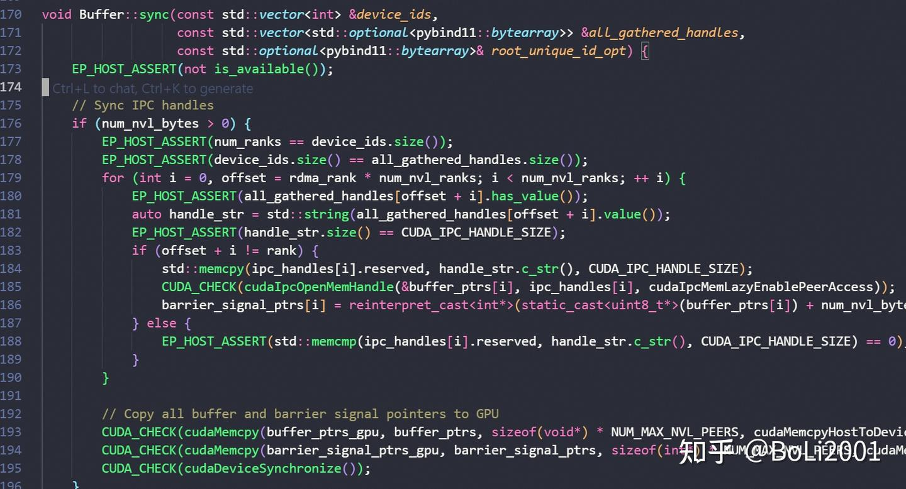

然后ll模式需要调用`internode::init`来初始化每个nvshmem通信组，需要传入当前进程在nvshmem通信组中的rank（nvshmem\_rank）；一个nvshmem通信组中的rank数量，即通讯组的大小（num\_nvshmem\_ranks）；和通讯组的root\_unique\_id

-   对于低延迟模式所有进程都是一个nvshmem通信组，所以nvshmem\_rank就等于进程在ep group中的rank，nvshmem通讯组的大小就是ep group中的rank数量

```cpp
auto nvshmem_rank = low_latency_mode ? rank : rdma_rank;
auto num_nvshmem_ranks = low_latency_mode ? num_ranks : num_rdma_ranks;
EP_HOST_ASSERT(nvshmem_rank == internode::init(root_unique_id, nvshmem_rank, num_nvshmem_ranks, low_latency_mode));
internode::barrier();
```

`internode::init`函数中，如果是 low\_latency\_mode，并且 num\_ranks > NUM\_MAX\_NVL\_PEERS(8)，也就是多机时，执行 nvshmem\_team\_split\_strided，将 NVSHMEM 的 team 划分为多组 sub-RDMA team，每个team大小为NUM\_MAX\_NVL\_PEERS，这样可以实现每组内部的高效通信，同时保证整体的可扩展性和性能。

```cpp
    if (low_latency_mode and num_ranks > NUM_MAX_NVL_PEERS) {
        EP_HOST_ASSERT(cpu_rdma_team == NVSHMEM_TEAM_INVALID);
        EP_HOST_ASSERT(num_ranks % NUM_MAX_NVL_PEERS == 0);
        EP_HOST_ASSERT(nvshmem_team_split_strided(NVSHMEM_TEAM_WORLD, rank % NUM_MAX_NVL_PEERS, NUM_MAX_NVL_PEERS,num_ranks / NUM_MAX_NVL_PEERS, &cpu_rdma_team_config, 0, &cpu_rdma_team) == 0);
        EP_HOST_ASSERT(cpu_rdma_team != NVSHMEM_TEAM_INVALID);
    }
```

init结束后，返回sync函数中，最后使用`internode::alloc`（内部调用的是nvshmem接口`nvshmem_align(alignment, size)`） 在所有pe的HBM上都分配一块大小为size的对称空间，每个pe使用`rdma_buffer_ptr`指向该空间的地址。此后，所有GPU可以用`rdma_buffer_ptr`来创建共享的buffer，然后使用nvshmem进行通信

```cpp
        rdma_buffer_ptr = internode::alloc(num_rdma_bytes, NUM_BUFFER_ALIGNMENT_BYTES);
        // Clean buffer (mainly for low-latency mode)
        CUDA_CHECK(cudaMemset(rdma_buffer_ptr, 0, num_rdma_bytes));
        // Barrier
        internode::barrier();
}
void* alloc(size_t size, size_t alignment) {
    return nvshmem_align(alignment, size);
}
```

## **dispatch**

ll的dispatch接口与normal的dispatch接口的区别在于：

-   它有一个use\_fp8的参数，如果是true，那么dispatch内部会将传入的bf16的x数据量化成fp8再发送出去，并且dispatch返回的recv\_x也是fp8的格式，还会包括scale；而normal的dispatch不支持这个操作，用户只能在dispatch之前自己手动将x量化成fp8，然后在调用dispatch时将量化后的x和scale一起传入，dispatch返回的recv\_x也是fp8的格式，也会包括scale
-   对x的num\_tokens维度和hidden\_size维度都有限制，num\_tokens必须小于num\_max\_dispatch\_tokens\_per\_rank（由用户传入的参数），而hidden size只有DeepEP中指定的几个固定的大小可以选择
-   `cumulative_local_expert_recv_stats`参数，用来统计当前rank的本地专家接收的数据，用于EPLB
-   `return_recv_hook`参数：如果设置了这个参数，那么dispatch函数只会发送RDMA的请求，但是不会真正接收到数据，而是马上返回给用户一个hook，用户可以调用这个hook来确保真正收到数据
-   由于**ll为了降低延迟，不会先调用get\_dispatch\_layout获取当前rank需要给每个rank发送多少token、每个token是否发送给某个rank这些数据结构，所以low\_latency\_dispatch也不需要传入num\_tokens\_per\_rank、is\_token\_in\_rank等参数，而是仅仅依靠topk\_idx来将token分发出去**

返回值：

-   recv\_x：与normal的recv\_x一样，如果选择了量化，那么得到的recv\_x是一个包括fp8 x和scale的tuple；区别在于normal的recv\_x的形状是不固定的，取决于每个rank实际接收到的token数量（normal会在真正的dispatch kernel之前做一次notify\_dispatch先进行一次通信，获取到每个rank接收到多少token）；而ll为了降低延迟，减少元数据同步开销，不会做notify\_dispatch，所以recv\_x的形状是预估的一个固定最坏情况的数值，具体来说是`[num_local_experts, num_max_dispatch_tokens_per_rank * num_ranks, hidden]`，也就是预估本地的每个专家最多从其他rank中接收多少token；相应的，recv\_x中如果有scale，那么scale的形状就是`[num_local_experts, num_max_dispatch_tokens_per_rank * num_ranks, hidden // 128]`（fp8量化的情况）  
    

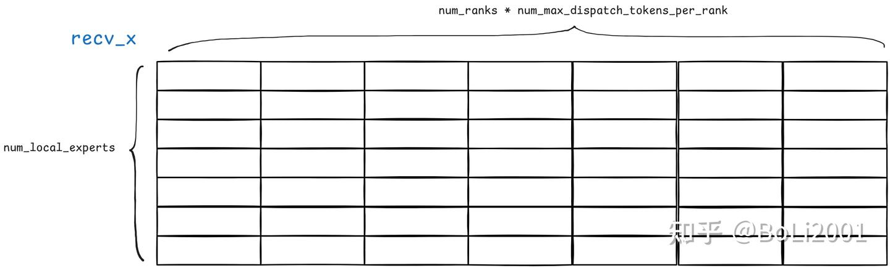

-   recv\_count：由于recv\_x相当于是一个余量分配的buffer，所以还需要有每个本地专家实际接收多少token的数据，这样才能从recv\_x中读取出接收的token
-   hook

low\_latency\_dispatch中首先在每个pe的rdma\_buffer中分配后续dispatch所需要的各种缓冲区：

```cpp
std::tuple<torch::Tensor, std::optional<torch::Tensor>, torch::Tensor, torch::Tensor, torch::Tensor, std::optional<EventHandle>, std::optional<std::function<void()>>>
Buffer::low_latency_dispatch(const torch::Tensor& x, const torch::Tensor& topk_idx,
                             const std::optional<torch::Tensor>& cumulative_local_expert_recv_stats,
                             int num_max_dispatch_tokens_per_rank, int num_experts,
                             bool use_fp8, bool round_scale, bool use_ue8m0,
                             bool async, bool return_recv_hook) {
#ifndef DISABLE_NVSHMEM
​
    auto num_tokens = static_cast<int>(x.size(0)), hidden = static_cast<int>(x.size(1));
    auto num_topk = static_cast<int>(topk_idx.size(1));
    auto num_local_experts = num_experts / num_ranks;
​
    // Buffer control
    LowLatencyLayout layout(rdma_buffer_ptr, num_max_dispatch_tokens_per_rank, hidden, num_ranks, num_experts);
```

分配缓冲区的代码：

```cpp
struct LowLatencyBuffer {
    int num_clean_int = 0;
​
    void* dispatch_rdma_send_buffer = nullptr;
    void* dispatch_rdma_recv_data_buffer = nullptr;
    int* dispatch_rdma_recv_count_buffer = nullptr;
​
    void* combine_rdma_send_buffer = nullptr;
    void* combine_rdma_recv_data_buffer = nullptr;
    int* combine_rdma_recv_flag_buffer = nullptr;
​
    void* combine_rdma_send_buffer_data_start = nullptr;
    size_t num_bytes_per_combine_msg = 0;
​
    std::pair<int*, int> clean_meta() {
        EP_HOST_ASSERT(dispatch_rdma_recv_count_buffer == combine_rdma_recv_flag_buffer);
        return {dispatch_rdma_recv_count_buffer, num_clean_int};
    }
};
​
struct LowLatencyLayout {
    size_t total_bytes = 0;
    LowLatencyBuffer buffers[2];
​
    template <typename out_ptr_t = void*, typename count_ptr_t = uint8_t*, typename in_ptr_t = void*>
    out_ptr_t advance(const in_ptr_t& ptr, size_t count) {
        return reinterpret_cast<out_ptr_t>(reinterpret_cast<count_ptr_t>(ptr) + count);
    }
​
    LowLatencyLayout(void* rdma_buffer, int num_max_dispatch_tokens_per_rank, int hidden, int num_ranks, int num_experts) {
        const int num_scales = hidden / 128;
​
        // Dispatch and combine layout:
        //  - 2 symmetric odd/even send buffer
        //  - 2 symmetric odd/even receive buffers
        //  - 2 symmetric odd/even signaling buffers
​
        // Message sizes
        // NOTES: you should add a control `int4` for combine messages if you want to do data transformation
        EP_HOST_ASSERT(num_scales * sizeof(float) <= hidden);
        size_t num_bytes_per_dispatch_msg = sizeof(int4) + std::max(hidden * sizeof(nv_bfloat16), hidden + num_scales * sizeof(float));
        size_t num_bytes_per_combine_msg = hidden * sizeof(nv_bfloat16);
​
        // Send buffer
        size_t dispatch_send_buffer_bytes = num_max_dispatch_tokens_per_rank * num_bytes_per_dispatch_msg;
        size_t combine_send_buffer_bytes = num_experts * num_max_dispatch_tokens_per_rank * num_bytes_per_combine_msg;
        size_t send_buffer_bytes = std::max(dispatch_send_buffer_bytes, combine_send_buffer_bytes);
        EP_HOST_ASSERT(send_buffer_bytes % sizeof(int4) == 0);
        total_bytes += send_buffer_bytes * 2;
​
        // Symmetric receive buffers
        // TODO: optimize memory usages
        size_t dispatch_recv_data_buffer_bytes = num_experts * num_max_dispatch_tokens_per_rank * num_bytes_per_dispatch_msg;
        size_t combine_recv_buffer_bytes = num_experts * num_max_dispatch_tokens_per_rank * num_bytes_per_combine_msg;
        size_t recv_buffer_bytes = std::max(dispatch_recv_data_buffer_bytes, combine_recv_buffer_bytes);
        EP_HOST_ASSERT(recv_buffer_bytes % sizeof(int4) == 0);
        total_bytes += recv_buffer_bytes * 2;
​
        // Symmetric signaling buffers
        size_t dispatch_recv_count_buffer_bytes = num_experts * sizeof(int);
        size_t combine_recv_flag_buffer_bytes = dispatch_recv_count_buffer_bytes;
        size_t signaling_buffer_bytes = std::max(dispatch_recv_count_buffer_bytes, combine_recv_flag_buffer_bytes);
        total_bytes += signaling_buffer_bytes * 2;
​
        // Assign pointers
        // NOTES: we still leave some space for distinguishing dispatch/combine buffer,
        // so you may see some parameters are duplicated
        for (int i = 0; i < 2; ++ i) {
            buffers[i] = {
                static_cast<int>(signaling_buffer_bytes / sizeof(int)),
                advance(rdma_buffer, send_buffer_bytes * i),
                advance(rdma_buffer, send_buffer_bytes * 2 + recv_buffer_bytes * i),
                advance<int*>(rdma_buffer, send_buffer_bytes * 2 + recv_buffer_bytes * 2 + signaling_buffer_bytes * i),
                advance(rdma_buffer, send_buffer_bytes * i),
                advance(rdma_buffer, send_buffer_bytes * 2 + recv_buffer_bytes * i),
                advance<int*>(rdma_buffer, send_buffer_bytes * 2 + recv_buffer_bytes * 2 + signaling_buffer_bytes * i),
                advance(rdma_buffer, send_buffer_bytes * i),
                num_bytes_per_combine_msg
            };
        }
    }
};
```

分配完之后的大致格式就如下图所示：

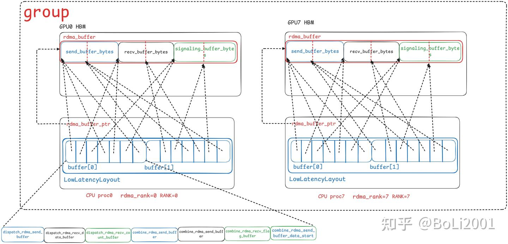

dispatch\_rdma\_recv\_data\_buffer的形状为：

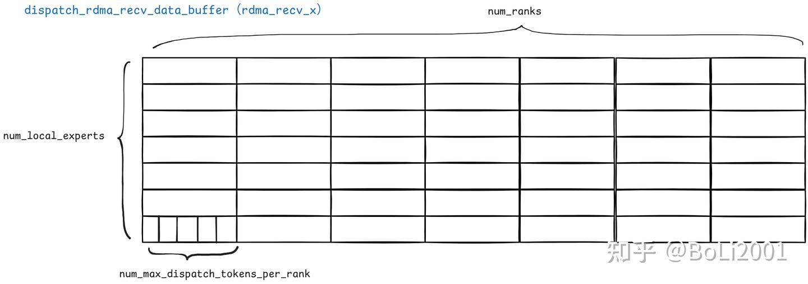

这里使用了双缓冲的机制，在rdma\_buffer中分配了两个缓冲区，并且在Buffer类中维护了low\_latency\_buffer\_idx指向当前可以使用的buffer；当调用low\_latency\_dispatch和low\_latency\_combine的时候使用low\_latency\_buffer\_idx执行的缓冲区，并且将low\_latency\_buffer\_idx更新为指向另一个缓冲区

```cpp
EP_HOST_ASSERT(layout.total_bytes <= num_rdma_bytes);
auto buffer = layout.buffers[low_latency_buffer_idx];
auto next_buffer = layout.buffers[low_latency_buffer_idx ^= 1];
```

随后分配dispatch返回值的tensor，如packed\_recv\_x，packed\_recv\_src\_info，packed\_recv\_layout\_range，packed\_recv\_count和packed\_recv\_x\_scales等

接下来开始启动dispatch kernel。**low latency的dispatch和combien kernel与normal模式不一样，normal模式是一半的block负责发，一半的block负责收，发送和接收是同时进行的；而low latency模式的dispatch和combine kernel的发送和接收是分为两个阶段，先让所有的warp负责发送，然后再让所有的warp负责接收。**

所以ll的dispatch kernel有send和recv两个阶段，并且两个阶段可以分开执行。如果用户指定了return\_recv\_hook的话，那么调用dispatch kernel时就传low\_latency\_send\_phase，表示该kernel只执行send阶段就返回；如果没有指定，那么就同时传入low\_latency\_send\_phase和low\_latency\_recv\_phase，表示该kernel既会执行send阶段也会执行recv阶段，并且全部执行完毕

```cpp
// Kernel launch
auto next_clean_meta = next_buffer.clean_meta();
auto launcher = [=](int phases) {
    internode_ll::dispatch(packed_recv_x.data_ptr(), packed_recv_x_scales_ptr,
                           packed_recv_src_info.data_ptr<int>(), packed_recv_layout_range.data_ptr<int64_t>(),
                           packed_recv_count.data_ptr<int>(),
                           cumulative_local_expert_recv_stats.has_value() ? cumulative_local_expert_recv_stats->data_ptr<int>() : nullptr,
                           buffer.dispatch_rdma_recv_data_buffer, buffer.dispatch_rdma_recv_count_buffer,
                           buffer.dispatch_rdma_send_buffer,
                           x.data_ptr(), topk_idx.data_ptr<int64_t>(),
                           next_clean_meta.first, next_clean_meta.second,
                           num_tokens, hidden, num_max_dispatch_tokens_per_rank,
                           num_topk, num_experts, rank, num_ranks,
                           use_fp8, round_scale, use_ue8m0,
                           workspace, num_device_sms,
                           launch_stream, phases);
};
launcher(return_recv_hook ? LOW_LATENCY_SEND_PHASE : (LOW_LATENCY_SEND_PHASE | LOW_LATENCY_RECV_PHASE));
```

如果是return\_recv\_hook，最后会将dispatch kernel的launcher作为一个hook返回，用户调用这个hook时相当于传入low\_latency\_recv\_phase再调用一次kernel，直接跳转到kernel中的recv部分，这个hook执行完毕后，才真正收到其他rank dispatch的token

```cpp
// Receiver callback
std::optional<std::function<void()>> recv_hook = std::nullopt;
if (return_recv_hook)
    recv_hook = [=]() { launcher(LOW_LATENCY_RECV_PHASE); };
```

dispatch kernel：

### send阶段

一个 Block 中的 Warp 被分成了两种角色：

-   数据处理Warp (warp\_id < num\_warps - 1): 负责量化、打包和发送数据。
-   元数据统计Warp (warp\_id == num\_warps - 1): 负责精确统计本 Rank 总共要给每个专家发送多少 Token。

数据处理Warp 的流程：

以num\_sms为步长遍历tokens，**每个 SM（Block）一次负责处理一个 Token**。

所以一开始每个block要定位到自己负责的token在x和rdma\_x（也就是dispatch\_rdma\_send\_buffer）中的位置

```cpp
// 一个block负责一个token
for (int token_idx = sm_id; token_idx < num_tokens; token_idx += num_sms) {
    // 每个block找到自己负责的token在x中的位置，并且将x转换成int4的地址，方便后续以ldg128读取x
    const auto x_int4 = static_cast<const int4*>(x) + token_idx * hidden_bf16_int4;
    // 每个block找到自己负责的token在rdma_send_buffer中的位置，以及token的src_idx、数据本身和scale在rdma_send_buffer中的位置
    const auto rdma_x_src_idx = reinterpret_cast<int*>(static_cast<uint8_t*>(rdma_x) + token_idx * num_bytes_per_msg);
    const auto rdma_x_vec = reinterpret_cast<vec_t*>(reinterpret_cast<uint8_t*>(rdma_x_src_idx) + sizeof(int4));
    const auto rdma_x_scales = reinterpret_cast<float*>(reinterpret_cast<uint8_t*>(rdma_x_vec) + hidden_bytes);
```

**对于一个 Token，Block 内的每个 Warp 从topk\_idx 中读取该token的一个目标专家**；只有前num\_topk个warp负责读取，剩下的warp的目标专家的idx就是-1。这样，num\_topk 个目标专家被并行处理。同时，每个block还将自己负责的 token 的idx拷贝到dispatch\_rdma\_send\_buffer中对应的src\_idx位置

```cpp
// 对于一个token，block中的每个warp读取出自己对应的expert id
auto dst_expert_idx = warp_id < num_topk ? static_cast<int>(__ldg(topk_idx + token_idx * num_topk + warp_id)) : -1;
// 每个block给自己负责的token在rdma_send_buffer中的src_idx位置赋值
thread_id == 0 ? (*rdma_x_src_idx = token_idx) : 0;
```

上面完成了将token的src\_idx拷贝到dispatch\_rdma\_send\_buffer中，接下来开始拷贝token本身的数据以及token的scale（如果有量化的话）；这里是**block中的每个线程（除了最后一个warp之外）负责搬运token的一个元素（以int4为单位）**，以线程总数num\_threads为步长遍历token的hidden维度

```cpp
// 一个block中除了最后一个warp之外的所有线程负责搬运一个token，其中每个线程负责搬运一个int4，
// hidden_bf16_int4 是一个token的hidden_size包含多少个int4块
for (int i = thread_id; i < hidden_bf16_int4; i += num_threads) {
    // 每个线程从x中一次读取一个int4
    auto int4_value = __ldg(x_int4 + i);
    // 如果不量化，直接把加载的int4块写回
    rdma_x_vec[i] = *reinterpret_cast<vec_t*>(&int4_value);
}
```

上面是不需要量化的情况，直接搬运即可；low latency模式的kernel还支持量化成fp8再发送出去：

-   由于量化的group大小是128个元素（fp16），而每个线程只负责读取八个元素，所以这里需要**先在每个线程局部独立计算它加载的8个 bfloat16 值中的绝对值最大值（amax）。然后再在warp级别规约，计算16个线程中128个元素的最大值**
-   再根据每个group最终的 amax 计算出缩放因子 scale 和它的倒数 scale\_inv。然后由每个半Warp的领头线程（lane\_id == 0 或 lane\_id == 16）将 scale\_inv 写入发送缓冲区的 rdma\_x\_scales 部分。
-   每个线程用刚刚得到的 scale 来缩放自己负责的8个 float32 值，然后调用 nv\_cvt\_float2\_to\_fp8x2 这个硬件指令，将两个 float 值高效地转换为一个 nv\_fp8x2\_storage\_t（一个16位数，包含两个FP8值）。
-   最后将转换后的FP8数据打包成 int2（64位，因为每个线程负责8个bf16，量化后就是8个fp8，合起来就是64位），存入发送缓冲区 rdma\_x\_vec 的对应位置。

```cpp
if constexpr (kUseFP8) {
    // 将128位的数据块看作8个bfloat16的数组
    auto bf16_values = reinterpret_cast<nv_bfloat16*>(&int4_value);
    float fp32_values[kNumElemsPerRead]; // kNumElemsPerRead = 8
    float amax = kFP8Margin, scale, scale_inv;
​
    // 线程局部amax：计算当前线程负责的8个值中的绝对值最大值
    #pragma unroll
    for (int j = 0; j < kNumElemsPerRead; ++ j) {
        fp32_values[j] = static_cast<float>(bf16_values[j]);
        amax = fmaxf(amax, fabsf(fp32_values[j]));
    }
​
    // Warp级归约：在16个线程中找到amax，一个Warp处理 32*8=256个bfloat16，正好是两个128的量化组
    // 所以这里用半个Warp（16线程）处理一个128的组
    amax = warp_reduce_max<16>(amax);
​
    // 计算并存储Scale
    calculate_fp8_scales(amax, scale, scale_inv, round_scale);
    // 每个半Warp的第一个线程（lane_id 0和16）负责写入scale值
    if (lane_id == 0 or lane_id == 16)
        rdma_x_scales[i * kNumElemsPerRead / 128] = scale_inv;
​
    // 缩放与类型转换
    vec_t int2_value; // FP8时，vec_t是int2（64位）
    auto fp8x2_values = reinterpret_cast<__nv_fp8x2_storage_t*>(&int2_value);
    #pragma unroll
    for (int j = 0; j < kNumElemsPerRead; j += 2) {
        float2 fp32x2 = {fp32_values[j] * scale, fp32_values[j + 1] * scale};
        // 将两个float32值转换为一个fp8x2（16位）
        fp8x2_values[j / 2] = __nv_cvt_float2_to_fp8x2(fp32x2, __NV_SATFINITE, __NV_E4M3);
    }
    // 将量化后的数据写入发送缓冲区
    rdma_x_vec[i] = int2_value;
}
```

假设每个rank发送的token数量是8个（num\_max\_dispatch\_tokens\_per\_rank=8），一个kernel中有四个block，全局一共有四个专家，那么上面所描述的代码的流程就如图所示，每个block负责将一个token从x中搬运到rdma\_send\_buffer中。X中紫色的数字代表该token的目标专家idx

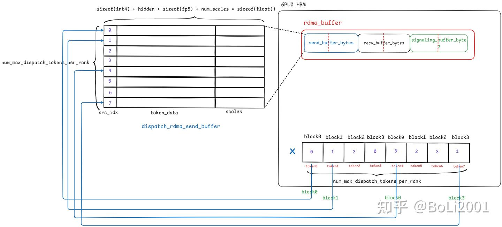

上面的代码完成了每个block将一个token从x中拷贝到自己的GPU的dispatch\_rdma\_send\_buffer中，**接下来各个block需要将这个token从自己GPU的rdma\_buffer中拷贝到目标专家所对应的rank的rdma\_buffer中**

这里的分工还是像之前所说的，**一个block中的一个warp负责该token到一个目标专家的拷贝**，如果某个warp没有被分配到目标专家（dst\_expert\_idx < 0），那么就跳过

-   首先每个warp获取在当前rank中自己对目标专家的写入偏移：实现方式是由warp的第一个线程对rank内的一个全局计数器atomic\_counter\_per\_expert进行原子加，这个**atomic\_counter\_per\_expert实际上是一个在rank本地的HBM中分配的长度为num\_experts的数组**；这样就能获得**在当前rank内部，该warp是第几个对此专家发送token的**，就能知道应该存放在目标缓冲区的什么位置

```cpp
// Workspace checks
auto atomic_counter_per_expert = static_cast<int*>(workspace);
auto atomic_finish_counter_per_expert = atomic_counter_per_expert + num_experts;
```

-   然后计算该token在远程接收缓冲区中的目标地址，如果没有NVLink 直连，则调用 IBGDA 通过 RDMA 发送；如果有NVLink相连，那么就像intranode一样，通过UNROLLED\_WARP\_COPY进行拷贝。这里的NVLink直连的检测可以通过环境变量开关。
-   发送完成后，对另一个原子计数器atomic\_finish\_counter\_per\_expert的对应目标专家位置加一，**表示该rank完成一次对目标专家的token发送**，用于后续的同步

```cpp
// 如果当前 warp 负责的目标专家有效 (dst_expert_idx >= 0)
if (dst_expert_idx >= 0) {
    // 1. 获取写入槽位: Warp 的第一个线程对目标专家的全局计数器执行原子加
    int slot_idx = lane_id == 0 ? atomicAdd(atomic_counter_per_expert + dst_expert_idx, 1) : 0;
    // 2. 广播槽位: 将该偏移广播给 Warp 内的所有线程
    slot_idx = __shfl_sync(0xffffffff, slot_idx, 0);
​
    // 3. 计算远程地址
    const auto dst_rank = dst_expert_idx / num_local_experts;
    const auto dst_expert_local_idx = dst_expert_idx % num_local_experts;
    const auto src_ptr = reinterpret_cast<uint64_t>(rdma_x_src_idx); // 本地发送缓冲区的源地址
    // 远程接收缓冲区的目标地址 = 接收区基址 + 专家分区偏移 + 源Rank分区偏移 + token槽位偏移
    const auto dst_ptr = reinterpret_cast<uint64_t>(rdma_recv_x) +
                         dst_expert_local_idx * num_ranks * num_max_dispatch_tokens_per_rank * num_bytes_per_msg + rank * num_max_dispatch_tokens_per_rank * num_bytes_per_msg + slot_idx * num_bytes_per_msg;
​
    // 4. 检查P2P路径并发送数据
    const auto dst_p2p_ptr = nvshmemi_get_p2p_ptr(dst_ptr, rank, dst_rank);
    if (dst_p2p_ptr == 0) {
        // 如果没有 NVLink 直连，则调用 IBGDA 通过 RDMA 发送
        nvshmemi_ibgda_put_nbi_warp(dst_ptr, src_ptr, num_bytes_per_msg, dst_rank, dst_expert_local_idx, lane_id, slot_idx);
    } else {
        // 如果有 NVLink 直连，则直接执行高速内存拷贝
        const auto* src_int4_ptr = reinterpret_cast<const int4*>(src_ptr);
        const auto* dst_int4_ptr = reinterpret_cast<int4*>(dst_p2p_ptr);
        UNROLLED_WARP_COPY(8, lane_id, num_int4_per_msg, dst_int4_ptr, src_int4_ptr, ld_nc_global, st_na_global);
    }
​
    // 5. 更新完成计数器: 发送完成后，对另一个原子计数器+1，用于后续的同步
    __syncwarp();
    lane_id == 0 ? atomic_add_release_global(atomic_finish_counter_per_expert + dst_expert_idx, 1) : 0;
}
```

假设每个rank dispatch8个token，全局一共有4个专家，一共有两个rank，一个kernel中四个block，每个token的topk\_num等于1；那么下图展示了rank0中的各个block将自己负责的token从自己GPU的rdma\_buffer中拷贝到目标专家所对应的rank的rdma\_buffer中的流程，依然是每个block负责搬运一个token；block中的前topk\_num个warp，每个warp负责搬运到目标专家对应的缓冲区（由于本例中的topk\_num等于1，所以每个block中只有warp0负责搬运）；

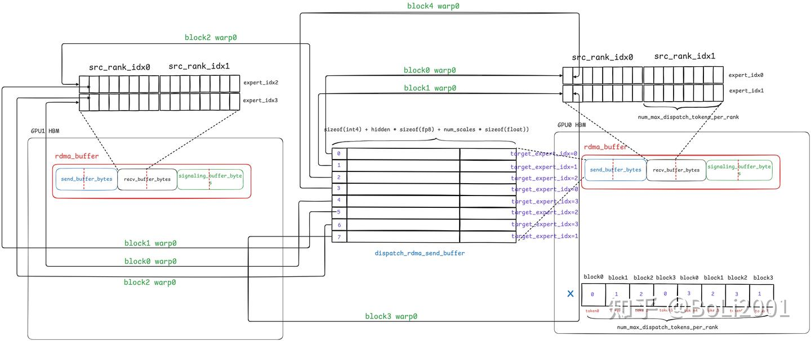

以上进行的是对目标专家发送token数据的过程，与此同时，**每个block中的最后一个warp**会并行地进行数据统计，计算当前rank**应该**给每个专家发送多少token，具体来说：

-   第一个Block（sm\_id == 0）的元数据Warp会给atomic\_finish\_counter\_per\_expert中的每个专家都加上一个很大的魔法值FINISHED\_SUM\_TAG。

```cpp
if (sm_id == 0) {
 #pragma unroll
 for (int i = lane_id; i < num_experts; i += 32)
 atomic_add_release_global(atomic_finish_counter_per_expert + i, FINISHED_SUM_TAG);
}
```

-   等第一个block的最后一个warp给atomic\_finish\_counter\_per\_expert的每个专家加上FINISHED\_SUM\_TAG之后，所有block的最后一个warp开始一起计算当前rank应该给每个专家发送多少token，所以每个block的最后一个warp平均分配专家，**每个warp负责kNumMaxWarpGroups个专家，然后计算每个warp负责统计的expert范围（expert\_begin\_idx和expert\_end\_idx）**。每个warp要遍历完整的topk\_idx数组（num\_tokens \* num\_topk），碰到自己负责的目标专家，就在自己的计数器（expert\_count）上加一

```cpp
// This SM should be responsible for some destination experts, read `topk_idx` for them
int expert_count[kNumMaxWarpGroups] = {0};
const auto expert_begin_idx = sm_id * num_warp_groups;
const auto expert_end_idx = min(expert_begin_idx + num_warp_groups, num_experts);
​
// Per lane count
#pragma unroll 8
for (int i = lane_id; i < num_tokens * num_topk; i += 32) {
 auto idx = static_cast<int>(__ldg(topk_idx + i));
 if (idx >= expert_begin_idx and idx < expert_end_idx)
 expert_count[idx - expert_begin_idx] ++;
}
```

-   扫描完成后，通过warp\_reduce\_sum，Warp内的所有线程进行并行规约，得到向每个专家发送的Token的精确总数 sum。在得到精确的sum之后，Warp的领头线程会向**全局**的计数器的对应专家位置加上FINISHED\_SUM\_TAG - sum。
-   并且**由于这个数值计算出来之后，在后面的代码中，是由同一个block中的所有warp共同负责发送，所以这里还要将数值保存在一个大小为kNumMaxWarpGroups（也就是每个block的最后一个warp负责计算的sum个数）的共享内存数组中**

```cpp
// Warp reduce
#pragma unroll
for (int i = expert_begin_idx; i < expert_end_idx; ++ i) {
 auto sum = warp_reduce_sum(expert_count[i - expert_begin_idx]);
 if (lane_id == 0) {
 shared_num_tokens_sent_per_expert[i - expert_begin_idx] = sum;
 atomic_add_release_global(atomic_finish_counter_per_expert + i, FINISHED_SUM_TAG - sum);
    }
}
```

-   所以，此时当前rank全局的atomic\_finish\_counter\_per\_expert计数器中每个专家的的值变成了 2 \* FINISHED\_SUM\_TAG - sum。

最后执行 `__syncthreads();`进行一次同步。

在元数据Warp进行计时的同时，其他的数据Warp正在疯狂地通过RDMA发送Token数据，当程序执行到这里时，意味着在一个Block内部，所有数据Warp已经完成了对该block所负责的Token的数据打包和RDMA发送指令的发起；元数据Warp已经完成了对所有Token的topk\_idx的扫描，并计算出了精确的发送数量。

现在需要将当前rank对每个专家的发送数量 发送到对应的rank的rdma\_buffer中

**此时的工作划分变成了由一个warp group负责一个expert的发送（一个warp group包括多个warp）**，所以需要得到warp group等相关的信息。这些数据在dispatch kernel的一开始计算

```cpp
// num_warp_groups表示一个block中的warp group数量，num_warps_per_group表示每个warp group的warp数量
// 所以num_warps表示一个block中的warp数量
const auto num_warps = num_warp_groups * num_warps_per_group;
// 当前线程在block中的warp id
const auto warp_id = thread_id / 32
// 当前线程属于哪一个warp group（block local）
const auto warp_group_id = warp_id / num_warps_per_group;
// 当前线程在warp group中的local warp id
const auto sub_warp_id = warp_id % num_warps_per_group;
// 通过block id和warp group id计算出当前warp负责哪一个专家的数据收发
const auto responsible_expert_idx = sm_id * num_warp_groups + warp_group_id;
```

由于这里对于一个expert实际上只需要发送一个数据（即当前rank向该expert发送多少token），所以这里仅仅从每个warp group中选择第一个warp的第一个线程进行发送（sub\_warp\_id == 0 and lane\_id == 0）

然后计算该expert所在的rank（dst\_rank），在目标rank中的local\_idx（dst\_expert\_local\_idx），读取该expert在block共享内存数组shared\_num\_tokens\_sent\_per\_expert中的值。

再自旋等待之前的数据处理warp完成token的发送（`while (ld_acquire_global(atomic_finish_counter_per_expert + responsible_expert_idx) != FINISHED_SUM_TAG * 2);`），再通过ibgda或者nvlink完成数据的发送。最后清空当前rank的atomic\_counter\_per\_expert和atomic\_finish\_counter\_per\_expert两个buffer

```cpp
// Issue count sends
if (responsible_expert_idx < num_experts and sub_warp_id == 0 and lane_id == 0) {
    const auto dst_rank = responsible_expert_idx / num_local_experts;
    const auto dst_expert_local_idx = responsible_expert_idx % num_local_experts;
    const auto num_tokens_sent = shared_num_tokens_sent_per_expert[responsible_expert_idx - sm_id * num_warp_groups];
​
    // Wait local sends issued and send expert counts
    while (ld_acquire_global(atomic_finish_counter_per_expert + responsible_expert_idx) != FINISHED_SUM_TAG * 2);
    auto dst_ptr = reinterpret_cast<uint64_t>(rdma_recv_count + dst_expert_local_idx * num_ranks + rank);
    auto dst_p2p_ptr = nvshmemi_get_p2p_ptr(dst_ptr, rank, dst_rank);
    if (dst_p2p_ptr == 0) {
        nvshmemi_ibgda_amo_nonfetch_add(reinterpret_cast<int*>(dst_ptr), -num_tokens_sent - 1, dst_rank, dst_expert_local_idx);
    } else {
        st_release_sys_global(reinterpret_cast<int*>(dst_p2p_ptr), -num_tokens_sent - 1);
    }
​
    // Clean workspace for next use
    atomic_counter_per_expert[responsible_expert_idx] = 0;
    atomic_finish_counter_per_expert[responsible_expert_idx] = 0;
​
    // Clean `packed_recv_count`
    if (dst_rank == 0)
        packed_recv_count[dst_expert_local_idx] = 0;
}
__syncwarp();
```

所以上面的数据发送时对atomic\_finish\_counter\_per\_expert的同步过程为：

1.sm\_id=0的最后一个Warp首先给atomic\_finish\_counter\_per\_expert计数器加上TAG

```cpp
atomic_add_release_global(..., FINISHED_SUM_TAG);
```

2.元数据Warp在计算出需要发送sum个token后，给计数器加上TAG - sum。

```cpp
atomic_add_release_global(..., FINISHED_SUM_TAG - sum);
```

3.同时数据warp在发送token，每当一个数据Warp成功发送一个Token，它就把计数器加1。这个操作会发生sum次。

```cpp
atomic_add_release_global(..., 1);
```

4.最终检查是否所有数据warp完成了发送：`while (ld_acquire_global(...) != FINISHED_SUM_TAG * 2);`

假设每个rank dispatch8个token，全局一共有4个专家，一共有两个rank，一个kernel中两个block，每个token的topk\_num等于1；那么一个block负责两个专家，所以一个block中有两个warp group（即kNumMaxWarpGroups的大小），每个warp group有32 / 2 = 16个warp，负责一个专家。所以每个block的`shared_num_tokens_sent_per_expert`大小为2，保存了该block的两个warp group负责的专家的num\_tokens\_sent。

首先每个block的最后一个warp负责遍历topk\_idx，统计出当前rank要给自己负责的两个专家发送多少token，保存在block的shared\_num\_tokens\_sent\_per\_expert中

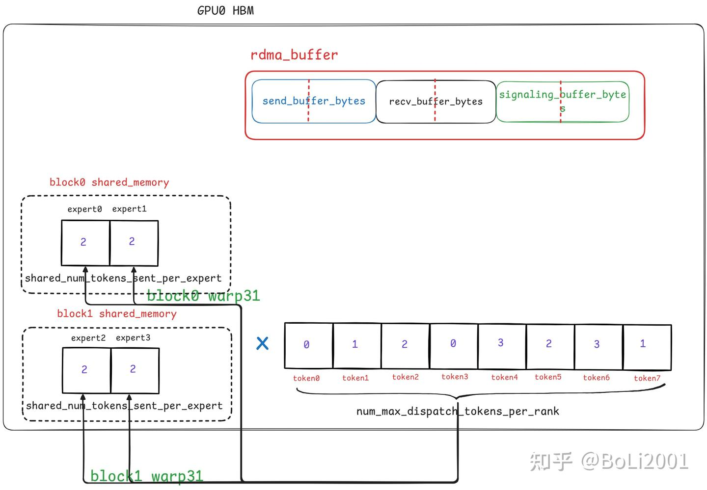

然后每个block的warp group中第一个warp的第一个线程负责将shared\_num\_tokens\_sent\_per\_expert中的数据搬运到目标专家所在rank的rdma\_recv\_count中

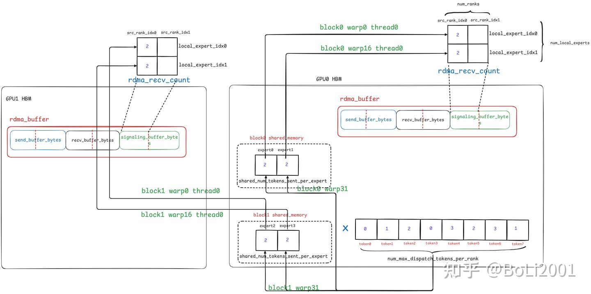

### recv阶段

首先进行一个全局同步：当 dispatch Kernel 同时执行发送和接收两个阶段时（即 phases 包含了 LOW\_LATENCY\_SEND\_PHASE），我们需要确保所有发送方（Grid内的所有线程）都已经完成了它们的 SEND\_PHASE 的发送部分，接收方才能开始工作。

```cpp
// For send-and-recv kernels, we need a grid sync for making `packed_recv_count` visible
if (phases & LOW_LATENCY_SEND_PHASE)
    cg::this_grid().sync();
```

接下来主要做的工作就是将rdma\_recv\_x中非连续存储的 token 数据重组为连续的内存布局（发往同一个 expert 的 token 连续存放）存放在recv\_x中，如下图所示：

-   rdma\_recv\_x中的`src_rank_idx0`部分表示这些token来自rank0，t0 t1 t2 t3表示这些token在rank0中src\_idx，所以t2这个token被发送给了本地的专家0和专家1；
-   同理src\_rank\_idx1部分表示这些token来自rank1，T0 T1 T2 T3表示这些token在rank 1中的src\_idx，所以T2和T3这两个token也被发送给了两个本地的专家

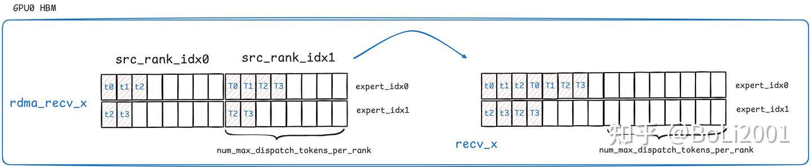

并且工作划分依然是**一个warp group负责一个专家的token的重组和搬运的工作**，但是注意，**一个warp group的负责对象不是一个recv\_x中的本地专家，而是rdma\_recv\_x中的某一个src\_rank的专家**；所以如果全局有n个rank，对于每一个本地的专家（也就是上图中rdma\_recv\_x或recv\_x中的一行），这里都需要有n个warp group将rdma\_recv\_x中的一行非连续存储的token合并到recv\_x中连续存储的一行，**每个warp group负责rdma\_recv\_x一行的一个src\_rank**

还是假设全局有两个rank，4个专家，每个kernel有两个block，那么每个block有两个warp group，那么他们的分工如下图所示（注意，这里搬运到recv\_x之后不一定会保持原来的src\_rank\_idx的顺序不变）

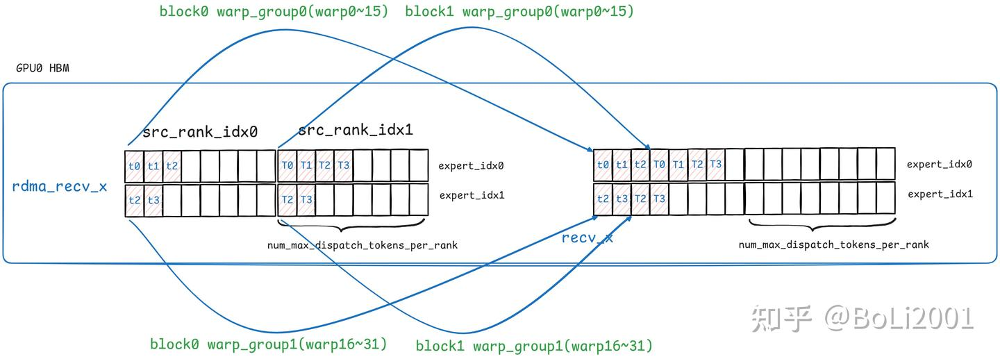

所以这里首先计算出每个warp group负责搬运的token，在rdma\_recv\_x中的位置，和在recv\_x中的目标位置

```cpp
const auto src_rank = responsible_expert_idx / num_local_experts;
const auto local_expert_idx = responsible_expert_idx % num_local_experts;
const auto rdma_recv_x_uint8 = static_cast<uint8_t*>(rdma_recv_x) +
        local_expert_idx * num_ranks * num_max_dispatch_tokens_per_rank * num_bytes_per_msg + src_rank * num_max_dispatch_tokens_per_rank * num_bytes_per_msg;
const auto recv_x_int4 = static_cast<int4*>(packed_recv_x) +
        local_expert_idx * num_ranks * num_max_dispatch_tokens_per_rank * hidden_int4;
```

接下来每个warp group中的**一个**线程（sub\_warp\_id == 1 and lane\_id == 0）负责等待接收到发送方的token，这里接收完毕的标志就是rdma\_recv\_count中对应位置不为0；并且还可以顺便读取到**该warp group接下来负责处理的token数量**；随后将读取到的num\_recv\_tokens累加到packed\_recv\_count中。

-   注意，这里的packed\_recv\_count的作用是记录每个本地的专家接收到的token总数，所以相当于是对rdma\_recv\_count的每一行进行求和。并且这里每个warp group都只使用一个线程对packed\_recv\_count进行原子加，所以在这个过程中**每个warp group可以得到自己负责的token最终写入recv\_x的位置**

同时每个warp group还要将自己拷贝的 token 数量和拷贝到recv\_x的idx记录在recv\_range中，方便 combine 阶段将 token 原路发回。我们便可以知道来自不同 rank 的 token 的数量和位置分布。

```cpp
// Wait tokens to arrive
// NOTES: using sub-warp 1 to overlap with sub-warp 0
int num_recv_tokens, recv_token_begin_idx;
EP_DEVICE_ASSERT(num_warps_per_group > 1 and num_warp_groups < 15);
if (sub_warp_id == 1 and lane_id == 0) {
    while ((num_recv_tokens = ld_acquire_sys_global(rdma_recv_count + local_expert_idx * num_ranks + src_rank)) == 0);
    num_recv_tokens = -num_recv_tokens - 1;
    recv_token_begin_idx = atomicAdd(packed_recv_count + local_expert_idx, num_recv_tokens);
    shared_num_recv_tokens[warp_group_id] = num_recv_tokens; 
    shared_recv_token_begin_idx[warp_group_id] = recv_token_begin_idx;
    recv_range[src_rank] = pack2<int, int64_t>(num_recv_tokens, recv_token_begin_idx);
    if (cumulative_local_expert_recv_stats != nullptr)
        atomicAdd(cumulative_local_expert_recv_stats + local_expert_idx, num_recv_tokens);
}
```

如下图所示，假设专家0的src\_rank 0的warp\_group抢到了最开始的packed\_recv\_count，所以它存放在recv\_x的最开始的位置，它的packed\_recv\_layout\_range的对应位置就是(3,0)；

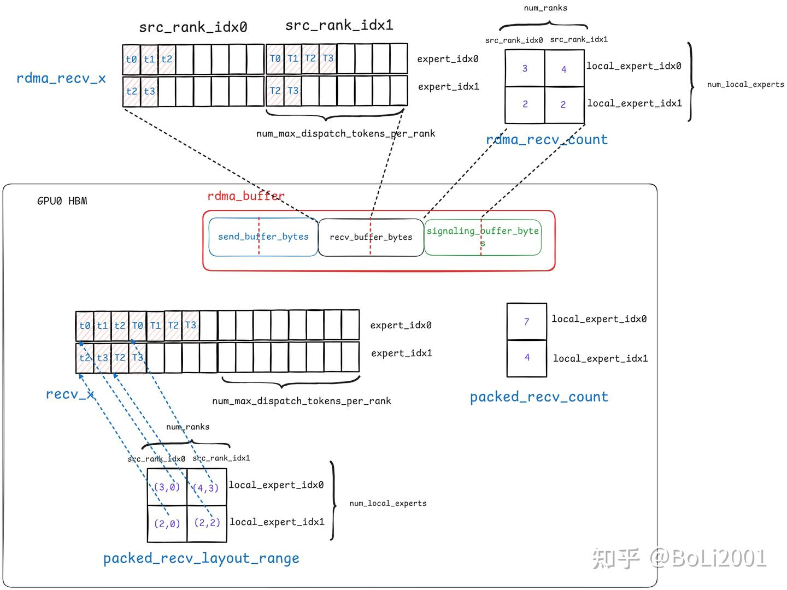

接下来每个warp group读取到自己要搬运的token数量和搬运到recv\_x中的位置

```cpp
num_recv_tokens = shared_num_recv_tokens[warp_group_id];
recv_token_begin_idx = shared_recv_token_begin_idx[warp_group_id];
```

接下来开始数据的搬运，这里进一步划分工作粒度，**warp group中的每个warp负责搬运一个token**，以num\_warps\_per\_group为步长遍历该group需要负责的tokens；由于rdma\_recv\_x中的数据实际上是将每个token的src\_idx、数据以及scale打包在一起的，所以这里分三部分拷贝，将它们分别拷贝到`packed_recv_src_info`、`packed_recv_x`和`packed_recv_x_scales`中

```cpp
for (int i = sub_warp_id; i < num_recv_tokens; i += num_warps_per_group) {
    // Copy source info
    const auto src_src_idx = reinterpret_cast<int*>(rdma_recv_x_uint8 + i * num_bytes_per_msg);
    if (lane_id == 0)
        recv_src_info[recv_token_begin_idx + i] = ld_nc_global(src_src_idx);
    __syncwarp();
​
    // Copy data
    // NOTES: only 2 load iterations for 7K hidden with 7 unrolls
    const auto src_data = reinterpret_cast<int4*>(reinterpret_cast<uint8_t*>(src_src_idx) + sizeof(int4));
    const auto dst_data = recv_x_int4 + (recv_token_begin_idx + i) * hidden_int4;
    UNROLLED_WARP_COPY(7, lane_id, hidden_int4, dst_data, src_data, ld_nc_global, st_na_global);
​
    // Copy scales
    if constexpr (kUseFP8) {
        // Equivalent CuTe layout:
        //   (num_tokens, (num_packed, num_elems_per_pack)):(num_elems_per_pack, (num_tokens * num_elems_per_pack, 1))
        const auto src_scales = reinterpret_cast<float*>(reinterpret_cast<uint8_t*>(src_data) + hidden_bytes);
        const auto num_elems_per_pack = static_cast<int>(sizeof(packed_t) / sizeof(scale_t));
        const auto token_idx = recv_token_begin_idx + i;
        const auto token_stride = num_elems_per_pack;
        const auto pack_stride = num_ranks * num_max_dispatch_tokens_per_rank * num_elems_per_pack;
        if (lane_id < num_scales) {
            const auto pack_idx = lane_id / num_elems_per_pack;
            const auto elem_idx = lane_id % num_elems_per_pack;
            auto scale = extract_required_scale_format<kUseUE8M0>(ld_nc_global(src_scales + lane_id));
            recv_x_scales[token_idx * token_stride + pack_idx * pack_stride + elem_idx] = scale;
        }
        if (lane_id + 32 < num_scales) {
            const auto pack_idx = (lane_id + 32) / num_elems_per_pack;
            const auto elem_idx = (lane_id + 32) % num_elems_per_pack;
            auto scale = extract_required_scale_format<kUseUE8M0>(ld_nc_global(src_scales + lane_id + 32));
            recv_x_scales[token_idx * token_stride + pack_idx * pack_stride + elem_idx] = scale;
        }
    }
}
```

至此完成了low latency的dispatch阶段

### **combine**

`low_latency_dispatch`完成后，返回的rcv\_src\_info和recv\_layout\_range会被打包成handle，随后在调用low\_latency\_combine的时候被传入进去；然后如果是使用fp8进行的dispatch（`dispatch_use_fp8`），那么low\_latency\_dispatch返回给用户一个fp8的recv\_x和它对应的recv\_x\_scales

```python
packed_recv_x, packed_recv_count, handle, event, hook = \
buffer.low_latency_dispatch(current_x, topk_idx, num_tokens, num_experts,
                use_fp8=dispatch_use_fp8, round_scale=round_scale, use_ue8m0=use_ue8m0,
                cumulative_local_expert_recv_stats=cumulative_local_expert_recv_stats,
                async_finish=not return_recv_hook, return_recv_hook=return_recv_hook)
```

然后用户需要手动将fp8的recv\_x和recv\_x\_scales转换成bf16的recv\_x

```python
simulated_gemm_x = per_token_cast_back(packed_recv_x[0].view(-1, hidden), packed_recv_x[1].view(-1, hidden // 128)).view(packed_recv_x[0].shape) if dispatch_use_fp8 else packed_recv_x.clone()
```

此时recv\_x就像这样（假设本地两个专家，全局两个rank，每个rank最多dispatch八个token）：

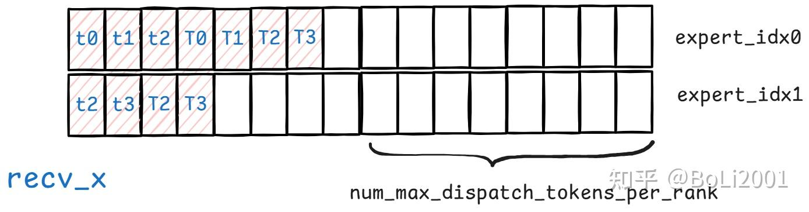

然后用户才能使用bf16的recv\_x，比如传入group gemm中（此处省略）；然后每个rank再调用low\_latency\_combine，将做完计算后的bf16的token收回来。**low\_latency\_combine传入的是通过了group gemm后的bf16的recv\_x（也就是low\_latency\_combine内部的形参x），以及之前用于dispatch的topk\_idx和topk\_weights，还有dispatch返回的handle**

```python
combined_x, event, hook = buffer.low_latency_combine(simulated_gemm_x, topk_idx, topk_weights, handle, use_logfmt=use_logfmt, async_finish=not return_recv_hook, zero_copy=zero_copy, return_recv_hook=return_recv_hook, out=out)
```

-   由于使用rdma需要将输入的用户缓冲区中的x拷贝到本地rdma\_buffer中，再从本地的rdma\_buffer发送出去；而low\_latency\_combine这里支持zero copy，可以调用`get_next_low_latency_combine_buffer`获取本地的rdma\_send\_buffer，然后用户将要发送的数据直接写入到rdma\_send\_buffer中，而不是先保存在用户的tensor中；这样combine kernel可以直接从rdma\_send\_buffer发送数据了，不需要先从用户的tensor（比如这里的simulated\_gemm\_x）将数据拷贝到rdma\_send\_buffer中，然后再用rdma 发送到远端

```python3
buffer.get_next_low_latency_combine_buffer(handle)[:, :, :] = simulated_gemm_x
```

所以low\_latency\_combine中的参数x的形状与low\_latency\_dispatch的返回recv\_x的形状相同（实际上就是同一个东西），即`[num_local_experts, num_max_dispatch_tokens_per_rank * num_ranks, hidden]`；topk\_idx和topk\_weights的形状也与dispatch时一样

combine的整体流程与dispatch类似，也是分为send和recv两个阶段

send阶段：这里的任务划分也是一个warp group负责一个专家。同样，这里不是指本地的专家，而是全局的专家，相当于是**一个warp group负责发送layout\_range中一个元素对应token**

所以每个warp要计算出自己负责的dst\_rank和local\_expert\_idx，从layout\_range中获取自己应该发送的toke数量和自己对应的token在发送buffer中的offset

```cpp
const auto dst_rank = responsible_expert_idx / num_local_experts;
const auto local_expert_idx = responsible_expert_idx % num_local_experts;
const auto global_expert_idx = rank * num_local_experts + local_expert_idx;
const auto layout = __ldg(layout_range + local_expert_idx * num_ranks + dst_rank);
const auto local_x = static_cast<const int4*>(x) +
        local_expert_idx * num_ranks * num_max_dispatch_tokens_per_rank * hidden_bf16_int4;
const auto local_src_info = src_info + local_expert_idx * num_ranks * num_max_dispatch_tokens_per_rank;
const auto rdma_send_x_vec = static_cast<uint8_t*>(rdma_send_x) +
        local_expert_idx * num_ranks * num_max_dispatch_tokens_per_rank * num_bytes_per_slot;
// Unpack layout
int offset, num_tokens_to_send;
unpack2(layout, num_tokens_to_send, offset);
```

然后依然是粒度进一步划分，warp group中的每个warp负责该专家的一个token

```cpp
for (int token_idx = offset + sub_warp_id; token_idx < offset + num_tokens_to_send; token_idx += num_warps_per_group) {
```

然后每个warp通过自己的token\_idx定位到自己在源地址和目标地址中的token

对于源地址 (`cpy_src_int4_ptr`):

-   如果 zero\_copy 是 false ，源地址就是外部传入的原始输入张量 x。
-   如果 zero\_copy 是 true，源地址是 本地的RDMA发送缓冲区 rdma\_send\_x。

目标地址 (cpy\_dst\_int4\_ptr):

-   如果不支持nvlink（dst\_p2p\_ptr == 0)，目标地址是本地的 RDMA 发送缓冲区rdma\_send\_x。数据需要先被拷贝到这里，准备进行网络发送。
-   如果支持nvlink，目标地址就是另一块 GPU 上的接收缓冲区rdma\_recv\_x

然后每个warp完成该token的拷贝

如果支持nvlink，那么到这里通信其实已经完成了，数据已经被拷贝到接收缓冲区rdma\_recv\_x上了

如果不支持nvlink，那么数据仅仅被拷贝到了本地的 RDMA 发送缓冲区，那么接下来会调用nvshmemi\_ibgda\_put\_nbi\_warp 将数据发送到接收端的rdma\_recv\_x缓冲区

所以这里一共有三个区域，一个是x，一个是本地的RDMA发送缓冲区rdma\_send\_x，一个是接收端的接收缓冲区rdma\_recv\_x，基本可以理解成先从x拷贝到rdma\_send\_x，再拷贝到rdma\_recv\_x；

-   x和rdma\_send\_x中token的分布是相同的，所以warp在这两个缓冲区中对自己负责的token的寻址方式也是相同的，不管是作为目标地址还是源地址都是如此。都是按照layout\_range中提供的对应的offset作为token\_idx来寻址

```cpp
const auto x_int4 = local_x + token_idx * hidden_bf16_int4;
const auto rdma_send_type_row = reinterpret_cast<int*>(rdma_send_x_vec + token_idx * num_bytes_per_slot);
const auto rdma_send_x_vec_row = reinterpret_cast<uint8_t*>(rdma_send_type_row);
```

-   从rdma\_send\_x拷贝到rdma\_recv\_x实际上并不是dispatch中从rdma\_recv\_x拷贝到recv\_x的一个逆过程，这里rdma\_recv\_x的形状是`num_experts` \* `num_max_dispatch_tokens_per_rank`，**每一行对应一个全局专家，用来存放从该专家combine回来的token，并且为了后续的reduce，token必须按照它dispatch之前的src\_idx的顺序存放**

```cpp
const auto src_idx = __shfl_sync(0xffffffff, __ldg(local_src_info + token_idx), 0);
const auto buf_ptr = reinterpret_cast<int64_t>(rdma_send_x_vec_row);
const auto dst_ptr = reinterpret_cast<uint64_t>(rdma_recv_x) + (global_expert_idx * num_max_dispatch_tokens_per_rank + src_idx) * num_bytes_per_slot;
const auto dst_p2p_ptr = nvshmemi_get_p2p_ptr(dst_ptr, rank, dst_rank);
```

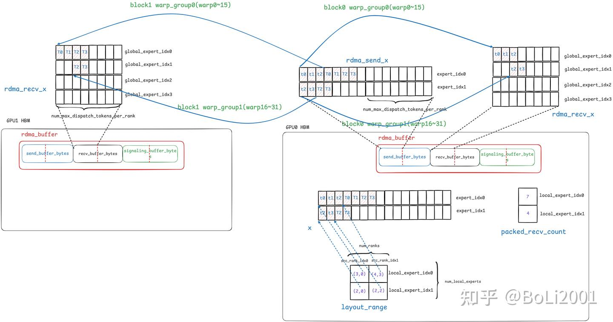

每个专家的token发送完毕后，负责该专家的warp group中的第二个warp的第一个线程（sub\_warp\_id == 1 and lane\_id == 0）会将向接收端的rdma\_recv\_flag缓冲区（一个长度为num\_experts的数组）写入一个finish flag，从而接收端读取到这个flag后就能知道这个全局专家的token被combine回来了

```cpp
if (sub_warp_id == 1 and lane_id == 0) {
    while (ld_acquire_global(atomic_clean_flag) == 0);
    auto dst_ptr = reinterpret_cast<uint64_t>(rdma_recv_flag + global_expert_idx);
    auto dst_p2p_ptr = nvshmemi_get_p2p_ptr(dst_ptr, rank, dst_rank);
    if (dst_p2p_ptr == 0) {
        nvshmemi_ibgda_amo_nonfetch_add(reinterpret_cast<int*>(dst_ptr), 1, dst_rank, local_expert_idx);
    } else {
        st_release_sys_global(reinterpret_cast<int*>(dst_p2p_ptr), 1);
    }
    atomic_add_release_global(atomic_clean_flag, -1);
}
```

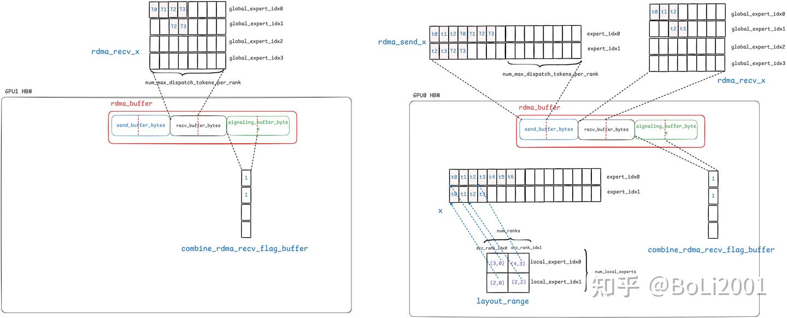

在接收阶段，任务划分依然是一个warp group负责一个专家，首先是每个warp group中的第一个warp的第一个线程读取rdma\_recv\_flag中对应专家的flag，等待token的到来

```cpp
// Receiving phase
LOW_LATENCY_COMBINE_RECV:
if ((phases & LOW_LATENCY_RECV_PHASE) == 0)
    return;
​
// Wait all ranks to arrive
if (responsible_expert_idx < num_experts) {
    EP_DEVICE_ASSERT(num_warps_per_group > 1);
    if (sub_warp_id == 0 and lane_id == 0) {
        while (ld_acquire_sys_global(rdma_recv_flag + responsible_expert_idx) == 0);
    }
}
cg::this_grid().sync();
```

等全局所有专家的token都被combine到rdma\_recv\_x中后，开始做reduce

reduce过程的任务分配是一个block负责reduce一个token（也就是rdma\_recv\_x中的一列），在一个token中，block中的每个线程负责一个INT4区域（即128bit，8个bf16元素）的元素的计算。

```cpp
for (int hidden_idx = thread_id; hidden_idx < hidden_bf16_int4; hidden_idx += num_threads) {
    for (int token_idx = sm_id; token_idx < num_combined_tokens; token_idx += num_sms) {
```

所以每个线程本地有一个大小为8的combined\_values数组，用来累加它所负责的8个bf16元素的reduce结果

```cpp
float combined_values[kNumElemsPerInt4] = {0.0f};
```

每个线程都要遍历自己对应token的topk\_idx，就能得到该token之前dispatch到哪些专家，从而得到该token在rdma\_recv\_x中的哪些行，再用token\_idx就能定位到该token在rdma\_recv\_x中的具体位置

```cpp
#pragma unroll
for (int i = 0; i < num_topk; ++ i) if (reg_topk_idx[i] >= 0) {
    // Read from sources
    auto rdma_buffer_type = reinterpret_cast<const int*>(static_cast<uint8_t*>(rdma_recv_x) + (reg_topk_idx[i] * num_max_dispatch_tokens_per_rank + token_idx) * num_bytes_per_slot);
    auto rdma_buffer_row = reinterpret_cast<const uint8_t*>(rdma_buffer_type);
```

然后每个线程根据自己的hidden\_idx再在token内部定位到自己负责的8个bf16的元素，将他们乘以topk\_weights累加到combined\_values上

```cpp
// Reduce
auto x_vec = ld_nc_global(reinterpret_cast<const int4*>(rdma_buffer_row) + hidden_idx);
const auto x_bf16 = reinterpret_cast<nv_bfloat16*>(&x_vec);
#pragma unroll
for (int j = 0; j < kNumElemsPerInt4; ++ j)
    combined_values[j] += static_cast<float>(x_bf16[j]) * reg_topk_weights[i];
```

对每8个bf16的元素，每个线程遍历完所有的topk\_idx，得到这8个bf16元素的最终reduce结果，将结果写回到combined\_x中，combined\_x的形状为`[num_combined_tokens, hidden]`，定位方式也是用token\_idx和hidden\_idx

```cpp
// Write results
int4& combined_int4 = *reinterpret_cast<int4*>(combined_values);
auto combined_bf16 = reinterpret_cast<nv_bfloat16*>(&combined_values);
#pragma unroll
for (int j = 0; j < kNumElemsPerInt4; ++ j)
    combined_bf16[j] = static_cast<nv_bfloat16>(combined_values[j]);
(static_cast<int4*>(combined_x) + token_idx * hidden_bf16_int4)[hidden_idx] = combined_int4;
```