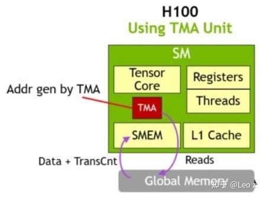

# GPU间NVLink数据传输实践之一：从LD/ST到TMA

**Author:** Leo z

**Date:** 2025-08-03

**Link:** https://zhuanlan.zhihu.com/p/1935487076796695140

## 背景

最近，DeepEP项目代码在支持TMA（Tensor Memory Accelerator）的[Hopper架构](https://zhida.zhihu.com/search?content_id=261200467&content_type=Article&match_order=1&q=Hopper%E6%9E%B6%E6%9E%84&zhida_source=entity)下，将原有的机内LD/ST数据传输方式替换为TMA，通过搜索近一两个月的'TMA'相关commits可见这一变更。

本文简要探索LD/ST和TMA在机内多GPU间数据搬运的实现差异，并说明如何利用DeepEP代码快速实现LD/ST和TMA数据传输测试示例。

## LD/ST和TMA简单介绍

LD/ST：即load/store，通过load指令从global memory读取数据到寄存器，再通过store指令写回global memory。多线程并行处理可获得更高带宽。

TMA：Tensor Memory Accelerator，SM（streaming multiprocessor）内的独立硬件单元，用于shared memory和global memory间高效传输大块数据。由单线程发起异步传输，多维tensor分块传输时TMA支持地址计算（此时数据地址不连续），无需线程介入。

Asynchronous memory copy with TMA on H100 \[1\]

不考虑L1/L2 cache，DeepEP中LD/ST和TMA在机内跨GPU数据搬运的路径分别是：

-   LD/ST：global memory ----> register ----> peer gpu global memory （由GPU线程执行）
-   TMA：global memory ----> SMEM ----> peer gpu global memory （由TMA unit执行）

这里通过一个简单计算来说明DeepEP为何将LD/ST替换成TMA：在DeepEP中，数据传输通常以warp为单位，按token粒度进行，token大小一般为从几KB或者十几KB。

-   LD/ST使用[UNROLLED\_WARP\_COPY](https://zhida.zhihu.com/search?content_id=261200467&content_type=Article&match_order=1&q=UNROLLED_WARP_COPY&zhida_source=entity)，每个线程每次搬运16B(int4)，一个warp(32线程)可并行搬运512B；
-   TMA使用[tma\_load\_1d](https://zhida.zhihu.com/search?content_id=261200467&content_type=Article&match_order=1&q=tma_load_1d&zhida_source=entity)/[tma\_store\_1d](https://zhida.zhihu.com/search?content_id=261200467&content_type=Article&match_order=1&q=tma_store_1d&zhida_source=entity)，每次搬运量为warp申请使用的shared memory大小（几KB~几十KB），Hopper架构每个SM支持最大使用228KB shared memory。

以上能够一定程度上说明为何在DeepEP场景下TMA能更加高效的进行数据传输。

关于TMA的介绍网上资料很多，参考文献列出了其中几篇：\[1\]\[2\]\[3\]。

## 测试实现

在DeepEP代码的`csrc/kernels/utils.cuh`文件中，实现了`UNROLLED_WARP_COPY`、`tma_load_1d`和`tma_store_1d`等函数，可直接复用。

修改`UNROLLED_WARP_COPY`可从warp级别实现grid级别的数据搬运（使用kernel内所有线程）。`tma_load_1d`和`tma_store_1d`的使用可参考`internode.cu`。

以下是一个简单的跨GPU数据传输测试方案：

1.  MPI启动双进程，各绑定GPU并分配显存buffer
2.  通过[CudaIPC](https://zhida.zhihu.com/search?content_id=261200467&content_type=Article&match_order=1&q=CudaIPC&zhida_source=entity)和[MPI\_Sendrecv](https://zhida.zhihu.com/search?content_id=261200467&content_type=Article&match_order=1&q=MPI_Sendrecv&zhida_source=entity)交换buffer句柄
3.  调用`utils.cuh`的LD/ST或TMA方法跨GPU传输数据

实现测试代码后（注：借助大语言模型生成测试代码还是挺好用的），可以通过调整以下参数对比不同场景下LD/ST和TMA性能差异：

1.  消息大小
2.  block数量
3.  LD/ST使用的线程数量
4.  TMA使用的shared memory大小

## 其他

在实现LD/ST和TMA高性能传输代码时，需特别注意内存同步问题。虽然前文介绍数据搬运路径时未考虑L1/L2缓存，但实际编码必须处理好数据一致性问题，深感在这一块还有许多课要补。

LD/ST实现中，DeepEP通过L1::no\_allocate绕过L1缓存，counter传输使用st.release.sys.global.s32指令确保前序跨GPU传输的数据可见性。

TMA实现中，DeepEP封装了fence/barrier/wait等函数用于在TMA异步拷贝中建立同步点，确保异步拷贝的数据可见性顺序。

## 参考文献

\[1\] [https://developer.nvidia.com/blog/nvidia-hopper-architecture-in-depth/](https://link.zhihu.com/?target=https%3A//developer.nvidia.com/blog/nvidia-hopper-architecture-in-depth/)

\[2\] [深入探究 Hopper TMA 单元在 FP8 GEMM 中的应用](https://link.zhihu.com/?target=https%3A//pytorch.ac.cn/blog/hopper-tma-unit/)

\[3\] [\[Hopper 架构特性学习笔记 Part2\] Tensor Memory Access（TMA）](https://zhuanlan.zhihu.com/p/709750258)

\[4\] [https://github.com/deepseek-ai/DeepEP](https://link.zhihu.com/?target=https%3A//github.com/deepseek-ai/DeepEP)