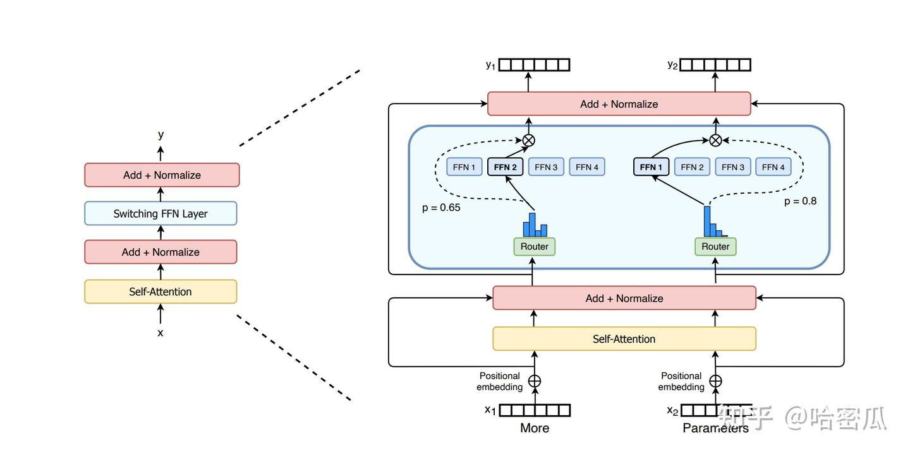
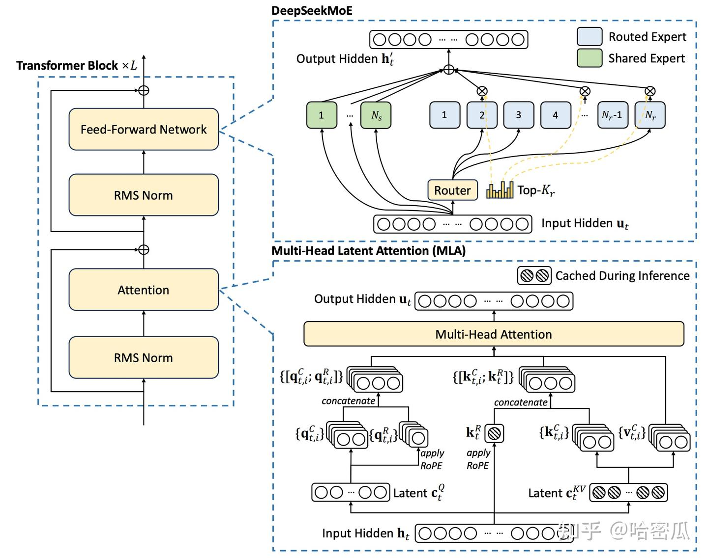
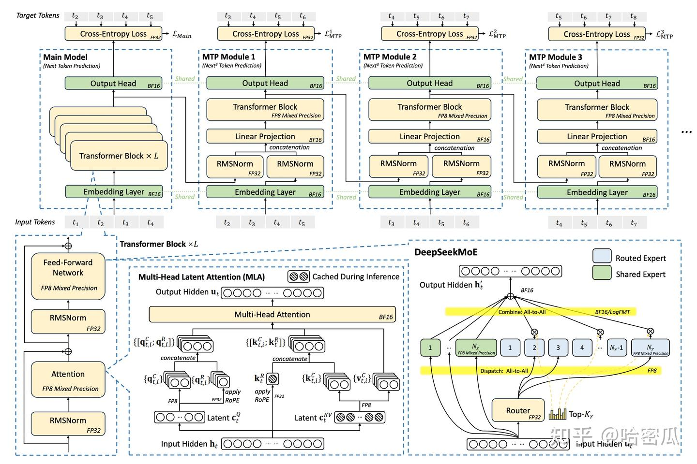

# MoE大训练过程记录与总结

**Author:** 哈密瓜

**Date:** 2025-08-04

**Link:** https://zhuanlan.zhihu.com/p/1906058319996622240

## 一、前言

1.  从24年1月到5月，一直在忙于MoE训练的事情。时过一年，现在记录并总结下当时的训练经验，并与deepseek为蓝本作为对比，反思不足
2.  MoE相比[Dense模型](https://zhida.zhihu.com/search?content_id=257737549&content_type=Article&match_order=1&q=Dense%E6%A8%A1%E5%9E%8B&zhida_source=entity)，它的好处是：在参数量足够大的情况下，还能保持一个比较小的计算量。即希望通过大的参数量来保证模型效果，同时希望用一个小的计算量来保证训练和推理性能。

## 二、MoE模型结构

Moe的整体结构如下：moe = attention + n\*FFN

图1. MoE模型结构，分为Attention层和专家层

### 2.1 Attention层

1.  大部分的moe模型与dense模型没有任何区别，跳过
2.  deepseek-V2提出了MLA：结构如下图所示

图2. deepseek-v2 MLA示意图

-   MLA在做attention计算是还是MHA，只不过产生q/k/v实际是用了低秩压缩，将q/k/v通过2个低秩矩阵进行压缩，公式如下：

-   $c_t^{kv}=W^{DKV}h_t(W^{DKV}\in R^{d_c\times d},h_t\in R^{d})$ ：在推理的时候，保存的是 $c_t^{kv}$ 而不是kv-cache。**由于** $c_t^{kv}$ **的维度远小于kv的dimension(** $d^c<d$ **)，所以cache会很小（**注意这个 $c_t^{kv}$ 被多个头所共享**）**。由于保存的是$c_t^{kv}$所以没有必要用GQA之类的，直接MHA。
-   $k_{t}^{c}=W^{UK}c_t^{kv}(W^{UK} \in R^{d\times d_c})$ ：通过 $W^{UK}$ 将$c_t^{kv}$ 给还原回来作为key，并拆分为多个头
-   $v_{t}^{c}=W^{UV}c_t^{kv}(W^{UV}\in R^{d\times dc})$ ：通过 $W^{UV}$ 将$c_t^{kv}$ 给还原回来作为value，并拆分为多个头
-   为了减少训练时的activation memory, 也将q进行了低秩压缩： $c_t^q=W^{DQ}h_t,q_t^c=W^{UQ}c_t^q$ ，其中 $W^{DQ}\in R^{{d_c}'\times d},W^{UQ}\in R^{d\times{d_c}'}$

-   这种方案有3个优点：

-   推理时：极大减少了kvcache，**本质原因是多个头共享一个压缩向量**$c_t^{kv}$，虽然多了 $W^{UK}$ 和 $W^{UV}$ 两个参数矩阵，但实际相比MHA参数量未必会增加（因为是低秩压缩， $d_c$ 很小的话， $W^{UK}+W^{DK} \lt W^{K}$ ）。
-   推理时：**并不会因为多乘上3个矩阵而增加计算量**，原因是**在推理时用矩阵结合律将参数矩阵合并了**（但训练时不能合并，训练的目的就是训出这2个压缩和还原矩阵），推导如下：

-   原始MHA中注意力权重的计算量是： $\alpha=q^tk=(W^Qh)^Tk$ ，输出矩阵O的计算量是： $o=W^O\sum_{j=1}^{T}\alpha_jv_j$
-   在MLA中，注意力权重的计算量是： $\alpha=q^Tk=(W^{UQ}c_t^q)^TW^{UK}c_t^{kv}=(c_t^q)^T(W^{UQ}W^{UK})c_t^{kv}$ ，中间2个矩阵可以在推理时合并成一个矩阵，**即所谓的$W^{UK}$ 被 $W^{UQ}$ 所吸收了**；而输出矩阵O的计算量为： $o=W^{O}\sum_{j=1}^{T}\alpha_j(W^{UV}c_{j}^{kv})=W^{O}W^{UV}\sum_{j=1}^{T}\alpha_jc_{j}^{kv}$ ，前2个矩阵融合在一起，**即所谓的** $W^{UV}$ 被 $W^{O}$ 吸收了

-   然而这里有个问题：如果按原始ROPE的方法加入MLA中，那么在推理时没法将$W^{UK}$和$W^{UQ}$合并（因为rope不满足结合律），这样就会带入额外的计算量。为了解决这个问题，**MLA简单的将ROPE进行了改造**：

-   对于q，为每个head引入了一个矩阵 $W^{QR}$ ，令 $q_t^R=ROPE(W^{QR}c_t^{q})$ ，最终 $q_t=[q_t^c;q_t^R]$
-   对于k，所有head共享一个矩阵 $W^{KR}$ ，令 $k_t^{R}=ROPE(W^{KR}c_t^{kv})$ ，最终 $k_t=[k_t^c;k_t^R]$
-   注意，由于**加上rope，还是会引入额外rope的计算量**（不过由于采用了GQA的思想，多个rope q共享一个rope k，这个计算量比较小）

### 2.2 [FFN层](https://zhida.zhihu.com/search?content_id=257737549&content_type=Article&match_order=1&q=FFN%E5%B1%82&zhida_source=entity)

-   **专家结构**

-   moe模型与dense模型和核心区别在于FFN层，将dense模型的FFN层切分成多个小FFN(每一个小FFN称之为一个专家, routed-expert)。
-   相比于Dense模型中所有token都会过一个相同的MLP层，MoE模型中每个token会在多个小专家中会选择top-k个专家，专家输出的结果再合成一个，计算量相比之前降低了很多：

-   $h_t=u_t+\sum_{i=1}^{N_s}FFN^{(s)}_{i}(u_t)+\sum_{i=1}^{N_r}g_{i,t}FFN_{i}^{(r)}(u_t)$
-   $u^t$ 是第t个token经过attention之后的输出， $h_t$ 是MoE层的输出
-   $FFN^{s}$ 是共享专家，也就是dense模型中的FFN，所有token都会经过它
-   $FFN^{r}$ 是routed expert，每个token只会选择top-k个routed expert， $g_{i,t}$ 是第t个token在第i个专家上的权重，它经过一个gate 层得到，不被选中的专家权重为0：

$     g_{i,t}= \begin{cases}  s_{i,t} & \text{ if } s_{i,t} \in TopK(\{s_{j,t}|1 \le j \le N_{r}\},K)\\  0 & \text{ otherwise }  \end{cases}， s_{i,t}=G(u^{t})_i $

-   **专家容量和负载均衡：**

-   经过router路由矩阵后，**每个专家分配到的token数量是不一样的，这样带来的一个副作用是每个专家的计算负载不同，导致负载低的专家需要等待负载高的专家，从而浪费计算资源。**另外负载不均衡的专家也会让效果有所折扣。
-   **解决负载不均衡的方法有2种**：

-   设置专家容量：假设有16个token，4个专家，topk=2，专家容量capacity=1.25，那么理想情况下，每个专家应该接收16x2/4=8个token，我们对每个专家给出一定的buffer让其容纳更多的token，这个buffer就是专家容量：8x1.25=10，多余这个buffer的token就丢弃了，公式计算就是 $\frac{seq\times topk}{experts} \times cf$ .cf=capacity factor. 另外为了防止丢弃的token太多，引入了一个额外的辅助loss
-   增加[负载均衡loss](https://zhida.zhihu.com/search?content_id=257737549&content_type=Article&match_order=1&q=%E8%B4%9F%E8%BD%BD%E5%9D%87%E8%A1%A1loss&zhida_source=entity)：另一种解决专家负载不均衡的方式，是通过训练过程中增加一个loss来惩罚不均衡的现象，这个loss称为专家级负载均衡loss：

$  \begin{align*}  L_{ExpBal} & =\alpha N_r\sum_{i}^{N_r}f_{i}P_{i}\\  f_i & = \frac{1}{KT} \sum_{t}^{T} \mathbb{1}(Token\ t\ selects\ Expert\ i)  \\   P_i&=\frac{1}{T}\sum_{i=1}^{T}s_{i,t}  \end{align*}$

-   解释一下这个loss为什么长这样，或者说为什么最小化 $L_{Balance}$ 能达到负债均衡的效果，可参考[这篇文章](https://zhuanlan.zhihu.com/p/18062746529)

-   $f_i$ 是第i个专家上分配到的token数占所有token的比例（即token落到第i个专家的概率），满足以下约束： $\sum_i^{N_r}f_i=1, 0\le f_i \le1$
-   $P_i $ 是第i个专家上分配到token的分数之和与所有token分数之和的占比（注意到 $\sum_{i=1}^{N_r}s_{i,t}=1$ ），满足以下约束： $\sum_{j=1}^{T}\sum_{i=1}^{N_r}P_{i}=1$
-   可以将 $minL_{ExpBal}$ 看成 $min\sum_{i=1}^{N}x_iy_i,s.t. \sum_{i=1}^{N}x_i=1, \sum_{i=1}^{N}y_i=1,$ 为了求解这个最优解，定义 $f(x_i,y_i)=\sum_{i=1}^{N}x_iy_i$ ，使用拉格朗日乘数法， 对$L(x,y,\lambda,\mu)=\sum_{i=1}^{3}x_iy_i+\lambda(1-\sum_{i=1}^{3}x_i)+\mu(1-\sum_{i=1}^{3}y_i)$ 求偏导可得：

-   $\frac{\partial L}{\partial x_i}=y_i-\lambda=0 \Rightarrow y_i=\lambda$
-   $\frac{\partial L}{\partial y_i}=x_i-\mu=0 \Rightarrow x_i=\mu$
-   $\sum_{i=1}^{N}x_i=1\Rightarrow N\lambda=1\Rightarrow \lambda=\frac{1}{N} \Rightarrow x_i=\frac{1}{N} $ ,同理 $y_i=\frac{1}{N}$ ，这说明当 $x_i=y_i=\frac{1}{N}$ 时， $\sum_{i=1}^{N}x_iy_i$ 取得最小值。换句话说，当 $f_i=P_i=\frac{1}{N_r}$ (每个专家都是相同的token)时， $L_{Balance}$ 取得最小值

-   除了上述 $L_{Balance}$ 之外，deepseek V2还提出了2种负载均衡:

-   **基于设备的负载均衡**：

-   deepseek V2将所有专家分为了D（D=8）个组 $\{\varepsilon_1,\cdots,\varepsilon_D\}$ ，同一个组内的专家在同一个device(这里的device应该是指一个node而不是device， 虽然论文没有明说)上，ds v2并没有直接采用top-k来选取专家，而是先选取分数最大的M个device(M=3)，然后再在这些device中选取top-k个专家，所以一个token所路由的专家所在的device最多为M个
-   $L_{DevBal}=\alpha_2\sum_{i=1}^{D}{f}'_i{P}'_i$
-   ${{f}_i}'=\frac{1}{|\varepsilon_i|}\sum_{j\in\varepsilon_i}f_j$
-   ${P_i}'=\sum_{j\in \varepsilon_i}P_j$
-   $L_{DevBal}$ 的设计思路和 $L_{ExpBal}$ 是一样的

-   **基于通信的复杂均衡**：

-   $L_{CommBal}=\alpha_3\sum_{i=1}^{D}{f_i}''{P_i}''$
-   ${f_i}''=\frac{D}{MT}\sum1(Token\ t\ is\ sent\ to\ Device\ i)$
-   ${P_i}''=\sum_{j\in \varepsilon_i}P_j$
-   $L_{CommBal}$ 的设计思路和 $L_{ExpBal}$ 是一样的

## 三、并行策略

**并行策略1：dp+ep+tp+sp**

-   这是我们当时的并行策略，1024张H800，64+2(64 routed expert， 2 shared expert)，world\_size=1024, tp=8, dp=128, ep=64, dp-ep=1024/64=16。具体来说，attention和shared-expert是用tp=8拆分，pp=1，所以dp=128。对于routed-expert，每一个专家单独放在一张卡上，一共64个专家，ep=64，即64张卡来分摊所有routed-expert。dp=128用于非expert模块做梯度的allreduce，dp-ep=16用于expert模块做梯度的allreduce。dp-ep这个说法是我自定义的，由于需要8个dp才能覆盖完整的64个专家，128个dp被分为16个组，每个组内部有完整的专家，这16个组计算完各自的梯度后，需要做allreduce（和普通的dp不是一个group），这16组中的每个组包含8dp，我们称之为dp-ep。

**并行策略2：dp+ep+pp**

-   deepseek-v2的并行策略是dp+ep+pp，pp=16，ep=8。论文没说用了多少卡，假设在1024卡上，pp=16，ep=8，dp=64，ep-dp=64/8=8，每个device放160/8=20个专家(但是切了pp，只有部分层数)，每个token最多跨M=3个device(如果pp是跨node的话，每一层的ep=8都在同一个node上)。
-   由于没有切分tp，ds-v2在某些算子上做了一些recompute以减少激活值占用的显存开销。
-   另外在做[all2all](https://zhida.zhihu.com/search?content_id=257737549&content_type=Article&match_order=1&q=all2all&zhida_source=entity)的时候，这部分通信和shared expert的计算overlap

**两者对比：**

|   | own | deepseek-v2 |
| --- | --- | --- |
| 参数/激活（B) | 255/36 | 236/21 |
| 层数 | 50 | 60 |
| routed expert | 64 | 160 |
| shared expert | 2 | 2 |
| top-k | 6 | 6 |
| hidden_size | 6144 | 5120 |
| intermediate_size | 4096 | 1536 |
| 推理kv-cache(2k 长度，32并发) | 24GB | 4.2GB |
| attention | GQA | MLA |
| batch-size | 4M | 9M~32M |
| 预训练上下文长度 | 8K | 4K |
| 训练性能 | 4.5亿/天 | 10亿/天 |

1.  从训练性能上看，我们的训练性能差多了（即便换算成同样的激活值，deepseek-v2的训练性能也有5.8亿/天），原因有以下几种：

1.  我们的all2all通信开销很大，因为跨了8个节点，ds-v2只需要2个节点
2.  我们做了tp，负担了额外的通信开销
3.  当时也想做pp，但觉得气泡率会很高。而deepseek v2用了zero-bubble pipeline，舍弃了tp，同时又不会有很高的气泡。
4.  我们的seqlen=8k，如果换成4k实测下来性能会更好（mbs从1变为2了）。
5.  deepseek-v2的batch-size更大，使用更大的global-batch-size也会有利于性能（mico-batchs更多了，导致梯度allreduce的通信占比更少了）。
6.  如果我们的模型也设置为seq-len=4k，gbs=32M，并且用热启动(此时专家负载已经十分均衡了)，此时性能5.5亿/天，和deepseek-v2相差不多。

## 四、一些实现细节和优化

1.  每个专家独占一张卡，由于开了sp，每张卡的数据都不重复。
2.  每张卡统计自己的数据应该发送给哪些专家，此时每张卡只知道各自要发送多少token给哪些专家，但不知道应该收那些数据，所以还需要使用all2all把这些信息发送出去
3.  此时每个专家知道自己要发送和接收哪些token，调用all2all，这个过程叫dispatch。
4.  每个专家接收到自己的token，进行计算，然后将结果用all2all发送回去，这个过程叫combine
5.  共享专家和all2all可以overlap
6.  一些layernorm之类的可以recompute
7.  grad reduce和param scatter都可以做overlap

## 五、deepseek v3

1.  deepseekv3 的完整架构图：

图3. deepseek v3架构图

1.  相比于deepseek v2，V3的多了很多创新点：

-   **模型结构上增加了[MTP](https://zhida.zhihu.com/search?content_id=257737549&content_type=Article&match_order=1&q=MTP&zhida_source=entity)**（Multi-Token Prediction），它是一种推测解码用于加速推理性能
-   在负载均衡loss上，除了专家级负债均衡loss，还引入了**无辅助损失的负载平衡策略，**此外还为每个专家的路由分数加一个bias，在每个step结束时，如果其对应的专家超载则将bias减少，否则增加bias，通过此调整，鼓励模型更负载均衡
-   与 [DeepSeek-V2](https://zhida.zhihu.com/search?content_id=257737549&content_type=Article&match_order=1&q=DeepSeek-V2&zhida_source=entity) 使用的设备限制路由一样，**我们确保每个 token 最多被发送到 M 个节点**
-   由于采用了有效的负载均衡策略，**不会丢弃任何token**
-   **结合双流PP和zero-bubble PP，提出了**[DualPipe](https://zhida.zhihu.com/search?content_id=257737549&content_type=Article&match_order=1&q=DualPipe&zhida_source=entity)，
-   深度修改了all2all以充分利用 IB 和 NVLink 带宽，并不让sm参与通信，只专注于计算
-   极度的显存节省

-   重新计算 RMSNorm 和 MLA Up-Projection
-   PP的内存节省：将最浅层和最深层的PP放在同一个PP RANK上

-   **第一次大规模使用FP8进行训练**

-   细粒度量化策略：以tile或者block为一组进行量化
-   大多数计算密度操作都在 FP8 中进行，而一些关键操作则策略性地保留在其原始数据格式中，以平衡训练效率和数值稳定性。具体哪些操作是fp8，哪些是fp16如图3所示

-   推理阶段使用了PD分离：

-   预填充阶段的最小部署单位由 4 个节点 32 个 GPU 组成，attention部分是4tp+8dp+sp，moe部分是32ep

## 六、参考内容

1.  [神之听之终和且平：混合专家模型（Mixture-of-Experts，MoE）中的路由辅助损失（Auxiliary loss）分析](https://zhuanlan.zhihu.com/p/18062746529)
2.  [https://arxiv.org/pdf/2412.19437](https://link.zhihu.com/?target=https%3A//arxiv.org/pdf/2412.19437)
3.  [https://www.arxiv.org/pdf/2505.09343](https://link.zhihu.com/?target=https%3A//www.arxiv.org/pdf/2505.09343)
4.  [猛猿：图解大模型训练系列之：DeepSpeed-Megatron MoE并行训练（原理篇）](https://zhuanlan.zhihu.com/p/681154742)