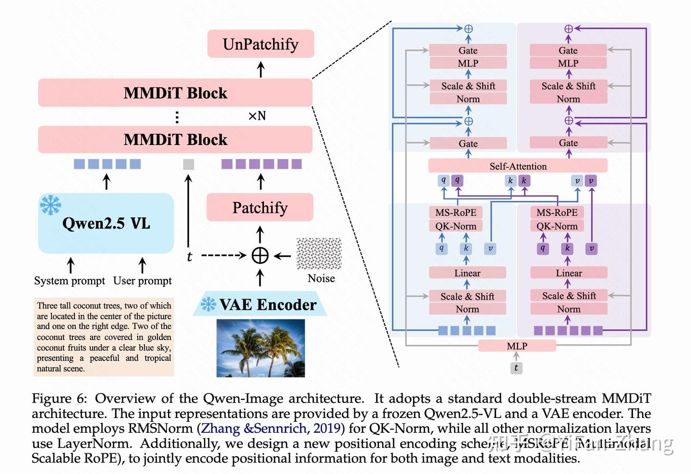
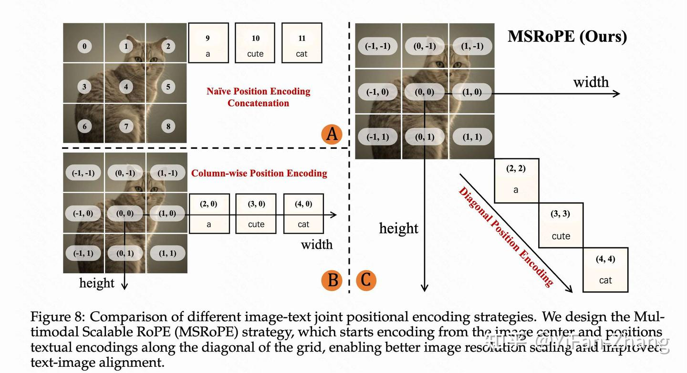
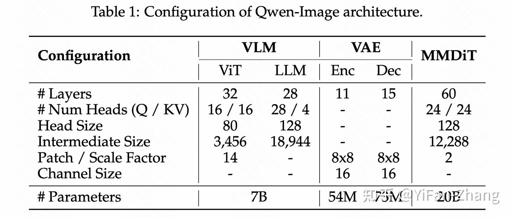
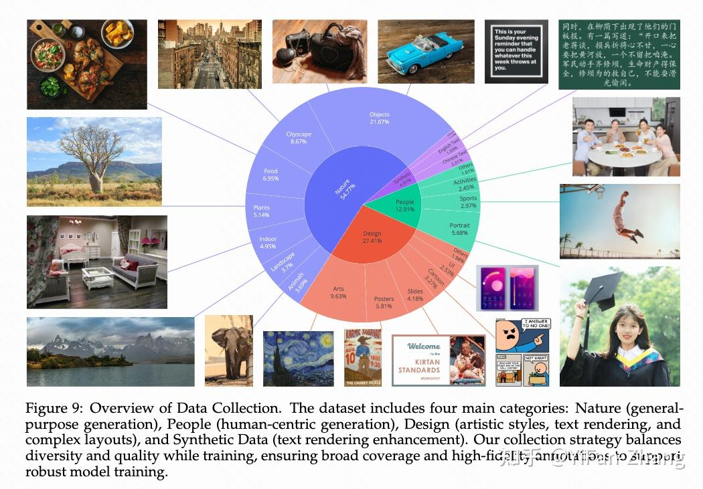
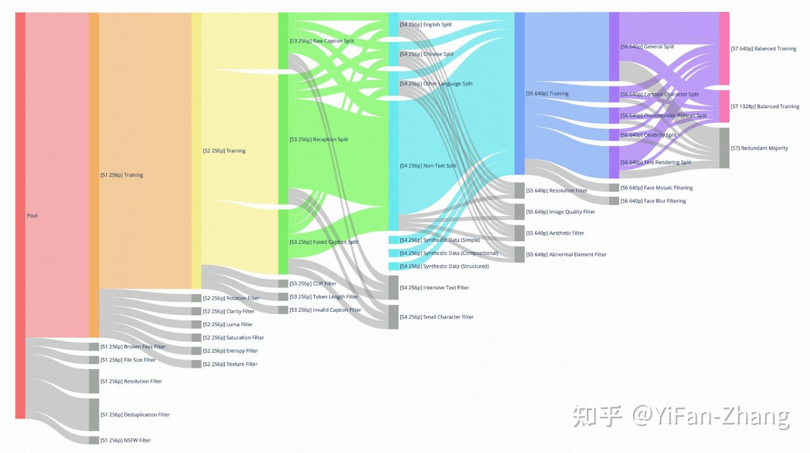
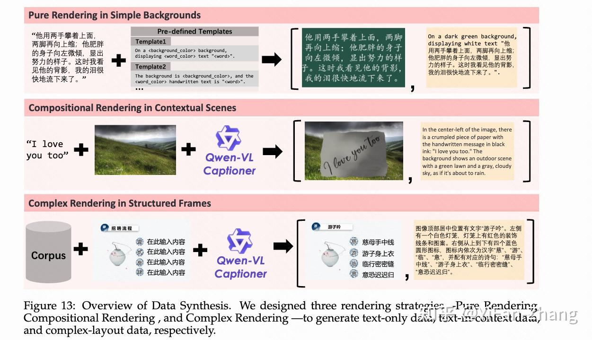

# Qwen-Image技术报告：数据工程+超多阶段训练

**Author:** YiFan-Zhang

**Date:** 2025-08-04

**Link:** https://zhuanlan.zhihu.com/p/1936040896731784351

​

目录

收起

主要贡献

架构

MllM+VAE+MMDiT+MSRoPE

一些有意义的实验发现

数据工程

数据收集

数据过滤

数据标注

数据合成

Qwen-Image 训练策略

预训练 (Pre-training)

渐进式训练策略

后训练 (Post-training)



Qwen-Image架构概述。它采用了标准的双流MMDiT架构。输入表示由冻结的Qwen2.5-VL和VAE编码器提供。模型对QK归一化使用了RMSNorm，而所有其他归一化层则采用LayerNorm。使用了一种新的位置编码方案MSRoPE（多模态可扩展RoPE），用于联合编码图像和文本模态的位置信息。

## 主要贡献

主要是为了解决复杂的文字渲染，以及图像编辑的一致性问题。一段话总结四个contribution

1.  构建了专门针对文字渲染的数据处理流程，从收集，过滤，标注，合成都写的比较详细了。
2.  训练stage也很多，pretrain用[Flow Matching](https://zhida.zhihu.com/search?content_id=261270119&content_type=Article&match_order=1&q=Flow+Matching&zhida_source=entity)提升生成质量，人工标注的数据用来[SFT](https://zhida.zhihu.com/search?content_id=261270119&content_type=Article&match_order=1&q=SFT&zhida_source=entity)，然后DPO 用于大规模的粗粒度对齐， [GRPO](https://zhida.zhihu.com/search?content_id=261270119&content_type=Article&match_order=1&q=GRPO&zhida_source=entity) 用于小规模的精细化微调。
3.  “渐进式”训练策略：从低分到高分，从无文本到复杂文本，从真实数据到合成数据。
4.  在传统的文生图（T2I）、图文生图（TI2I）任务基础上，加入了图生图（I2I）的重建任务。这种多任务共同训练的方式，有效拉齐了模型内部不同模块对图像特征的理解，使得编辑过程更加协调。
5.  在编辑图片时，模型会通过两条路径分别处理原始图片：一条路径将图片送入视觉语言模型（Qwen2.5-VL）以提取其高层语义信息（图片里“有什么”）；另一条路径则通过VAE编码器获得其底层的视觉重建特征（图片“长什么样”）。同时保持质量和一致性。

## 架构

### MllM+VAE+MMDiT+MSRoPE

主要组成部分上一个多模态大语言模型（MLLM）、一个变分自编码器（VAE）和一个多模态扩散 Transformer（MMDiT）。

MLLM：用了Qwen 2.5 VL VAE：Wan-2.1-VAE，能同时处理图像和视频。 diffusion：MMDiT+MSRoPE

之前的方法，如 [Seedream 3.0](https://zhida.zhihu.com/search?content_id=261270119&content_type=Article&match_order=1&q=Seedream+3.0&zhida_source=entity)，将文本信息视为图像网格中的某一行。这样做虽然可行，但会导致两个问题：首先，文本的位置编码可能与图像中某一行的位置编码变得相同，让模型难以区分；其次，究竟该把文本放在哪一行，本身就是一个难题。Qwen-Image将将文本信息的位置编码放置在图像网格的对角线上。如图中所示，如果将图像展成一个二维网格，文本 token "a", "cute", "cat" 会被依次赋予 (2, 2), (3, 3), (4, 4) 这样的对角线位置。

对于图像信息，它保留了二维位置编码的优势，有利于模型处理不同分辨率的图片；对于文本信息，由于其行列坐标相同，其行为等效于标准的一维 RoPE，



### 一些有意义的实验发现

1.  通过平衡重建损失 (reconstruction loss) 和感知损失 (perceptual loss)，可以有效减少在生成灌木丛等重复纹理时常见的网格状瑕疵。
2.  当图像重建质量变得非常高时，对抗性损失 (adversarial loss) 会失效，因为判别器已经无法有效分辨真假，无法提供有价值的指导。因此，他们在训练后期放弃了对抗性损失。
3.  仅微调解码器，就能显著提升图像细节和微小文字的渲染质量，为 Qwen-Image 强大的文字生成能力打下了坚实的基础。



Qwen-Image 是一个体量巨大的模型，其核心的 MMDiT 部分拥有多达60层，头部大小为128。

## 数据工程

数据pipeline非常详细，有点东西

### 数据收集



这部分强调了质量和均衡分布，而不是一味的scale up

```text
自然 (Nature): 占比最大，约 55%。这是一个通用的类别，包含了物体、风景、城市景观、植物、动物、室内、食物等子类。它也是模型生成真实多样自然图像能力的基础。

设计 (Design): 约占 27%。主要包括海报、用户界面、演示幻灯片等结构化视觉内容，以及绘画、雕塑、艺术品等。这类数据通常包含丰富的文本元素和复杂的布局，对于提升模型在艺术风格、文本渲染和布局设计方面的能力至关重要。

人物 (People): 约占 13%。包含肖像、体育、人类活动等与人相关的图像，旨在提升模型生成真实、多样化人像的能力。

合成数据 (Synthetic Data): 约占 5%。这部分数据是通过可控的文本渲染技术合成的，并非由其他AI模型生成的图像。研究者认为，使用其他AI生成的图像可能会引入视觉瑕疵、文本扭曲和偏见等风险，因此采取了保守策略。
```

### 数据过滤



为了在模型迭代开发中筛选出高质量的训练数据，研究者设计了一个包含七个阶段的多阶段过滤流程。

-   **阶段一：初始预训练数据管理**  
    

-   在模型训练初期，图像被统一调整到 `256p`（即256x256像素，包含多种宽高比）。  
    
-   应用了一系列过滤器来移除低质量数据：  
    

-   **破损文件过滤器**: 剔除损坏或不完整的文件。
-   **文件大小过滤器**: 检测并移除文件大小异常的图像。
-   **分辨率过滤器**: 移除原始分辨率低于 `256p` 的图像。
-   **去重过滤器**: 消除重复或近似重复的图文对。
-   **NSFW过滤器**: 排除色情、暴力等不适宜内容。

  
-   **阶段二：图像质量增强**  
    

-   此阶段专注于系统性地提升图像质量。
-   **旋转过滤器**: 根据图像的元数据（EXIF）移除有明显旋转或翻转的图片。
-   **清晰度过滤器**: 丢弃模糊或失焦的图像。
-   **亮度过滤器**: 排除过亮或过暗的图像。
-   **饱和度过滤器**: 剔除颜色饱和度过高、看起来不自然的图像。
-   **熵过滤器**: 移除信息量过低（如有大面积纯色区域）的图像。
-   **纹理过滤器**: 丢弃纹理过于复杂（通常是噪声或无意义图案）的图像。

-   **阶段三：图文对齐度提升**  
    

-   此阶段重点是改善文本描述与图像内容的匹配度。  
    
-   为了平衡数据，数据集被分为三个部分：  
    

-   **原始标题**: 包含网站提供的原始标题或标签，有助于模型处理短文本并获取真实世界知识。
-   **重标注标题**: 使用先进的 `Qwen-VL` 字幕生成器为图像生成更具描述性的结构化标注。
-   **融合标题**: 结合原始标题和生成标题，兼顾通用知识和详细描述。

  

-   应用了 **中文CLIP过滤器** 和 **SigLIP 2过滤器** 来移除图文不匹配的数据，并使用 **Token长度过滤器** 和 **无效标题过滤器** 清理过长或无意义的标题。  
    

-   **阶段四：文本渲染能力增强**  
    

-   为了提升模型在图像中渲染文字的能力，此阶段将数据分为四个部分：英文、中文、其他语言和无文本。
-   引入了通过特定策略生成的合成文本数据，以解决低频字符、多语言混合和字体多样性的问题。
-   应用了 **密集文本过滤器** 和 **小字符过滤器**，移除文本过于密集或过小的图像，因为这些情况难以标注和清晰渲染。

  
-   **阶段五：高分辨率精炼**  
    

-   模型转为使用 `640p` 分辨率的图像进行训练。
-   **图像质量过滤器**: 进一步排除过曝、欠曝、模糊或有压缩痕迹的图像。
-   **分辨率过滤器**: 确保所有图像满足最低分辨率要求。
-   **美学过滤器**: 排除构图或视觉吸引力差的图像。
-   **异常元素过滤器**: 移除包含水印、二维码、条形码等干扰视觉元素的图像。

-   **阶段六：类别平衡与人像增强**  
    

-   通过错误分析，将数据重新划分为 **通用**、**人像**、**文本渲染** 三个主要类别，以便在训练中进行平衡。
-   使用关键词和图像检索技术来补充数据不足的类别。
-   特别针对人像进行了增强：从人物类别中检索出高质量的照片、卡通角色和名人图像，并生成强调面部特征、表情、服装和背景等细节的标题。同时，过滤掉带有人脸马赛克或模糊的图像。

  
-   **阶段七：均衡的多尺度训练**  
    

-   在最后阶段，模型同时在 `640p` 和 `1328p` 两种分辨率的图像上进行训练。
-   为了避免因严格的分辨率门槛导致数据大量丢失，设计了一个类似 `WordNet` 的层级分类系统对所有图像进行分类。
-   在每个类别中，只保留质量和美学得分最高的图像。
-   采用专门的重采样策略来平衡包含文本渲染的数据。这种多尺度训练使模型在适应高分辨率输入的同时，能够保留已学到的通用知识，确保训练稳定。

### 数据标注

研究者设计了一个高效的数据标注流程，使用一个强大的图像标注模型（如 `[Qwen-2.5-VL](https://zhida.zhihu.com/search?content_id=261270119&content_type=Article&match_order=1&q=Qwen-2.5-VL&zhida_source=entity)`）同时完成两项任务：

1.  **生成详细的图像描述**: 描述内容包括物体属性、物体间的空间关系、环境细节，并能准确转录图像中可见的文字。
2.  **生成结构化的元数据**: 以 `JSON` 格式输出图像的关键属性，如图像类型、图像风格、是否包含水印、是否存在二维码或马赛克等异常元素。

这种方法将传统的图像描述和元数据提取合二为一，无需额外的模型或后处理步骤，实现了大规模数据的高效处理。

### 数据合成



为了解决真实世界图像中文字内容（尤其是像中文这样的非拉丁语言）长尾分布的问题，研究者提出了一个多阶段的文本感知图像合成流程。

-   **纯粹渲染 (Pure Rendering)**: 这是最直接的方法。从高质量语料库中提取文本段落，使用动态布局算法将其渲染到干净的背景上。为了保证质量，如果段落中的任何一个字符因字体缺失等原因无法渲染，整个样本都会被丢弃。
-   **组合渲染 (Compositional Rendering)**: 该策略将合成的文本嵌入到真实的视觉场景中。例如，模拟文字被写在纸上或木板上，然后将这个物体无缝地合成到不同的背景图像中。之后，使用图像标注模型为合成后的图像生成描述，捕捉文本与周围环境的关系。
-   **复杂渲染 (Complex Rendering)**: 为了让模型能理解涉及复杂布局的指令，该策略通过编程方式编辑预定义的模板（如PPT幻灯片或UI模型）。一个基于规则的系统会自动替换占位符文本，同时保持布局结构的完整性。这对于训练模型执行涉及多行文本、精确定位和字体颜色控制的详细指令至关重要。

## Qwen-Image 训练策略

### 预训练 (Pre-training)

**训练目标：流匹配 (Flow Matching)**

研究人员采用了“流匹配”作为训练目标。这是一种先进的技术，它通过常微分方程（ODE）来确保训练过程的稳定性，同时其效果等同于最大化模型生成真实图像的概率。

其核心思想可以这样理解：

1.  首先，将输入的真实图像 `x` 通过 VAE 编码器 `E` 压缩成一个潜向量 `z`，即 $z = E(x)$。  
    
2.  然后，定义一个从纯噪声 $x_1$（从标准正态分布中采样）到真实图像潜向量 $x_0$ 的一条“直线路径”。路径上的任意一点 $x_t$ 和它的前进“速度” $v_t$ 可以表示为：  
    $\begin{cases} x_t = t \cdot x_0 + (1 - t) \cdot x_1 \\ v_t = \frac{dx_t}{dt} = x_0 - x_1 \end{cases} \\$ 其中，$t$ 是一个从0到1的时间步。这个公式意味着，模型需要学习的方向 $v_t$ 其实就是一个简单的、从噪声指向真实图像的恒定向量。  
    
3.  模型的训练目标，就是预测出这个正确的“速度”方向。损失函数被定义为模型预测的速度 $v_{\theta}(x_t, t, h)$ 与真实速度 $v_t$ 之间的均方误差（MSE）：  
    $\mathcal{L} = \mathbb{E}_{(x_0, h)\sim\mathcal{D}, x_1, t} \left\| v_{\theta}(x_t, t, h) - v_t \right\|^2 \\$ 其中，$h$ 是从多模态大语言模型中提取的用户输入（文本或图文）的引导信息。  
    

### 渐进式训练策略

整个预训练过程遵循一个“由浅入深、由粗到精”的渐进式策略：

1.  **从低分辨率到高分辨率**：模型先在 256x256 的低分辨率图像上学习基本结构，然后逐步提升到 640x640，最终到 1328x1328，从而学会捕捉越来越精细的图像特征。
2.  **从无文字到有文字**：先让模型学习通用的视觉表征，然后逐步引入包含文字的图像，专门训练其文字渲染能力。
3.  **从海量数据到精炼数据**：早期用大规模数据让模型学习基础能力，后期则采用越来越严格的过滤标准，用高质量数据提升模型的上限。
4.  **从不均衡到均衡**：在训练过程中，持续调整不同领域和分辨率的数据分布，防止模型对某些类别产生“偏科”，确保其泛化能力。
5.  **从真实数据到合成数据**：针对现实世界中稀缺的数据类型（如超现实主义风格、带大量文字的高清图），通过数据合成技术进行补充，填补数据集的空白。

### 后训练 (Post-training)

预训练完成后，模型进入后训练阶段，主要目标是修复模型的特定缺陷，并使其生成结果更符合人类的审美和偏好。

**第一阶段：监督微调 (SFT)**

在 SFT 阶段，团队构建了一个分层组织的语义类别数据集，并辅以**精细的人工标注**。他们挑选出清晰、细节丰富、明亮且逼真的图像，用这些高质量数据对模型进行微调，引导模型产出更具真实感和细节美感的内容。

**第二阶段：强化学习 (RL)**

为了让模型真正理解人类的偏好，团队使用了两种不同的强化学习策略：

1.  \*\*直接偏好优化 (DPO)\*\*：这是一种计算效率较高的离线偏好学习方法。  
    

-   **数据准备**：针对同一个提示词，生成多张图片。然后由人类标注员选出“最好”和“最差”的一张。  
    
-   **算法核心**：其损失函数的目标是，让策略模型（policy model）与一个固定的参考模型（reference model）相比，增大“被选中的好图” $x_{win}$ 的概率，同时减小“被拒绝的差图” $x_{lose}$ 的概率。其损失函数可以概括为：  
    $\mathcal{L}_{\text{DPO}} = -\mathbb{E} \left[ \log \sigma \left( -\beta (\text{Diff}_{\text{policy}} - \text{Diff}_{\text{ref}}) \right) \right] \\$ 其中，$Diff$ 代表了模型对好图和差图的偏好差异，$\beta$ 是一个超参数。  
    

-   GRPO：这是一种更精细的在线（on-policy）优化方法，用于在 DPO 之后进行微调。  
    

-   **算法核心**：模型根据一个提示词生成一组（比如 G 张）图片，并用一个奖励模型 R 为每张图片打分。然后，计算每张图片的“优势”（Advantage），即它比组内平均分高出多少。  
    $A_i = \frac{R(x_0^i, h) - \text{mean}(\{R(x_0^j, h)\}_{j=1}^G)}{\text{std}(\{R(x_0^j, h)\}_{j=1}^G)} \\$ GRPO 的目标是更新模型参数，使得生成高“优势”图像的概率更大。  
    
-   **随机探索**：一个关键细节是，标准的流匹配采样过程是确定性的，不利于 RL 的探索。因此，团队将其改造为一个\*\*随机微分方程（SDE）\*\*的采样过程，通过引入一个随机项，让模型在生成过程中有更多的探索性。  
    $dx_t = \left[ \dots \right] dt + \sigma_t dw \\$

DPO 用于大规模的粗粒度对齐，而 GRPO 则用于小规模的精细化微调，二者结合，构成了强大的对齐流水线。  

最后，欢迎大家关注github，聚合了Multimodal Large Language Models, Large Language Models, and Diffusion Models以及一些前沿研究方向的一些阅读笔记，非常欢迎大家补充完善  
  

[](https://link.zhihu.com/?target=https%3A//github.com/yfzhang114/Awesome-Multimodal-Large-Language-Models)

  
  

开启送礼物