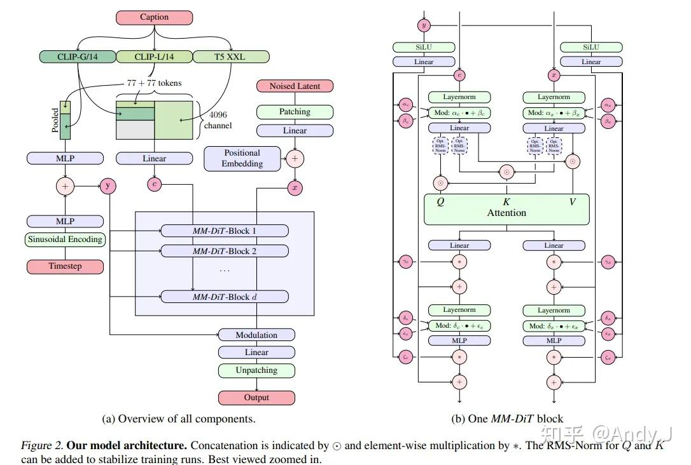

# 浅谈SD3和FLUX

**Author:** AIDog

**Date:** 2025-08-17

**Link:** https://zhuanlan.zhihu.com/p/1940447918185243403

## [SD3](https://zhida.zhihu.com/search?content_id=261836982&content_type=Article&match_order=1&q=SD3&zhida_source=entity)

paper：[Scaling Rectified Flow Transformers for High-Resolution Image Synthesis (arxiv.org)](https://link.zhihu.com/?target=https%3A//arxiv.org/pdf/2403.03206)

相比 SD 之前的版本，SD3 有比较大的改进。首先，SD3 是一个基于 Rectified Flow 的[生成模型](https://zhida.zhihu.com/search?q=%E7%94%9F%E6%88%90%E6%A8%A1%E5%9E%8B&zhida_source=entity&is_preview=1)；其次，SD3 引入了 T5-XXL 来作为text encoder来提升模型的文本理解能力；最后，SD3 采用了一个[多模态](https://zhida.zhihu.com/search?q=%E5%A4%9A%E6%A8%A1%E6%80%81&zhida_source=entity&is_preview=1)的 [DiT](https://zhida.zhihu.com/search?content_id=261836982&content_type=Article&match_order=1&q=DiT&zhida_source=entity) 架构，并且将模型参数量扩展为 8B 。

**多模态 DiT** 的一个核心对图像的 latent tokens 和文本 tokens 拼接在一起，并采用两套独立的权重处理，但是在 attention 时统一处理。

SD3 还是由扩散模型、VAE、文本编码器三大部分组成，但各部分都有一定的改进。其中 VAE 是增加了通道数，提升了细节还原能力。

  

在 SD3 中，一共使用了三个预训练的文本编码器，分别是**[CLIP VIT-L](https://zhida.zhihu.com/search?content_id=261836982&content_type=Article&match_order=1&q=CLIP+VIT-L&zhida_source=entity)（~124M）、OpenCLIP ViT-bigG（~695M）、T5-XXL（~4.7B）**。

首先两个 CLIP 分别对文本编码得到 $77×768$ 和 $77×1280$ 的特征。T5 则得到 $77×4096$ 的特征，这三组文本特征通过不同的方式组合，得到两个文本特征，它们分别会在 [MM-DiT](https://zhida.zhihu.com/search?content_id=261836982&content_type=Article&match_order=1&q=MM-DiT&zhida_source=entity) 中通过不同的方式应用，具体如下：

一方面，两组 CLIP 特征分别在 token 维度经过池化，得到特征向量，并拼接起来，得到 $1×2048（=1280+768）$ 的特征向量，这就是图中的文本特征，该特征会和时间步向量加和后得到 $y$ ;

另一方面，两组 CLIP 特征直接相加拼接后得到 $77×2048$ 的特征，经过 zero padding 后，与T5的特征形状相同为 $77×4096$ ，将 CLIP 特征和 T5 特征再拼接，得到形状为 $154（=77+77）×4096$ 的文本特征 $c$ （代码实现上直接把CLIP和T5的特征直接拼接起来，并没有限制 T5 的 seqlen 只有 $77$ ，即 $333（=77+256）*4096）$

**MM-DIT**

实际上，每个 block 只有 $y,c,x$ 三个输入，其中 $y, c$ 是我们上面刚介绍的 CLIP 和 T5 编码出的两个文本特征，而 $x$ 就是噪声图像经过 patchify 的得到的 token 序列。

先看 $y$ ，图中的线看着很乱，但仔细看可以发现 $y$ 并没有与 block 的核心结构发生作用，而是只在左右两侧进行处理。 $y$ 实际的作用就是进行 DiT 中的adaLN modulation，用于计算一共 $\alpha, \beta, \gamma；\delta,\epsilon,\xi$ 六组参数，每组两个分别对应 $c$ 和 $x$ ，每个 block 内共12个参数，该参数会用于 $c,x$ 各自的 modulation 的计算。除了计算这 12 个参数， $y$ 不参与 block 中的任何其他操作了，这里所谓的 modulation（Mod）就对应与 DiT 中的 scale， shift。

再看 $c$ 和 $x$ ,分别是一个文本输入和一个图片输入，所以称为 MM(MultiModal) DiT。它们以双流的形式在block 中分别进行处理，但是一起做 Attention 。以 $x$ 为例（ $c$ 的处理是对称的），在每个block 中，首先经过一个 LN，然后根据 $y$ 计算出的参数进行 modulation 控制，之后经过一个线性层之后，与 $c$ 对应拼接起来共同计算 QKV Attention。之后再依次经过 linear、scale、residual、layernorm、scale+shift(mod)、mlp、scale、residual 就完成了一个block的完整计算。

两个需要注意的点：

-   一是在 Attention 的Q 和 K 的处理时，有一个 RMS Norm，这称为 QK-Normalization，是为了在混合精度训练时提升训练的稳定性，避免在模型变大、分辨率变高时 attention logit 出现 NAN，。
-   二是SD3 采用了扩展+插值的2D 位置编码方式来提升训练分辨率并适应可变长宽比。

## FLUX

[Flux](https://zhida.zhihu.com/search?content_id=261836982&content_type=Article&match_order=1&q=Flux&zhida_source=entity) 整体上延续了 SD3 MM DiT 的设计，

文本编码器部分，Flux 取消了 SD3 中的 1 个 CLIP 模型，只使用了 1 个 CLIP 模型和 1 个 T5 模型来编码文本条件；

Flux 采用了更先进的旋转位置编码 [RoPE](https://zhida.zhihu.com/search?content_id=261836982&content_type=Article&match_order=1&q=RoPE&zhida_source=entity)

Flux 的在 MM-DiT（DoubleStreamTransformer）之后，将文本和图像拼接，在送入到SingleStreamTransformer 中进行处理。这样能够降低单层的参数量，增大网络深度；

为了进行 CFG 蒸馏，Flux dev 版本的 DiT 需要显式地直接接受 guidance scale 作为条件。这个条件与 timestep 条件类似，分别经过正弦 embedding 后加在一起

Flux相对于其他模型最明显的改动是使用了两种不同的transformer block，分别是`FluxTransformerBlock`与`FluxSingleTransformerBlock`。两者前后拼接，分别有19层与38层。

`FluxTransformerBlock`的架构几乎完全与SD3使用的`JointTransformerBlock`等价。直接使用了MM-DiT的模式，用两套权重分别处理condition和image tokens。唯一的差别在与Attention层使用的AttnProcessor不同：其中Flux使用的`FluxSingleAttnProcessor2_0`由于使用了rope，相对于`JointAttnProcessor2_0`在做SDPA前多了一个apply rope的过程；同时`FluxSingleAttnProcessor2_0`将condition拼接到了image tokens前面，而`JointAttnProcessor2_0`是拼接到后面。

Flux.1中的RoPE同样是直接在patch tokens被展平成一维以后进行，而非将2d的rope直接作用于图片用以编码patch tokens空间相关信息。