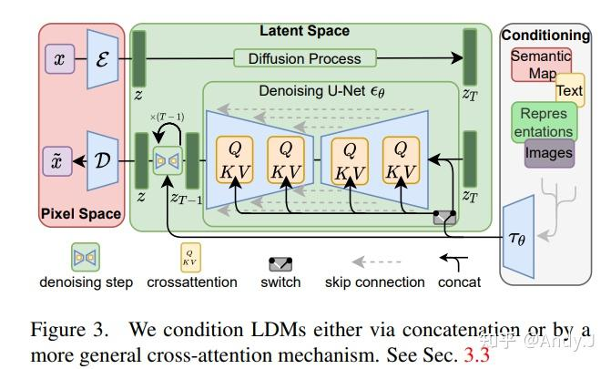
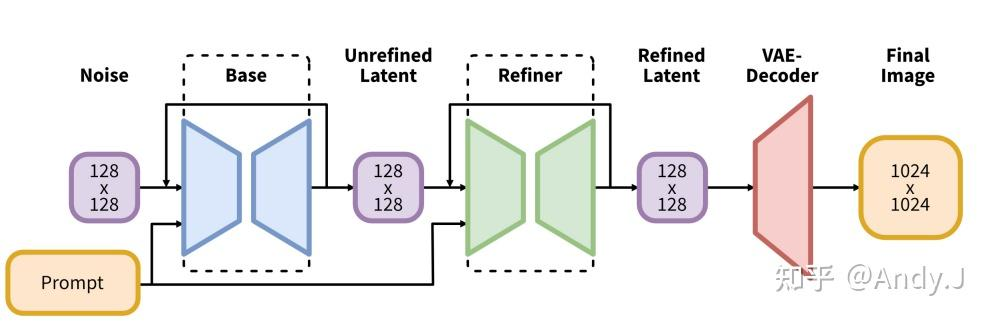
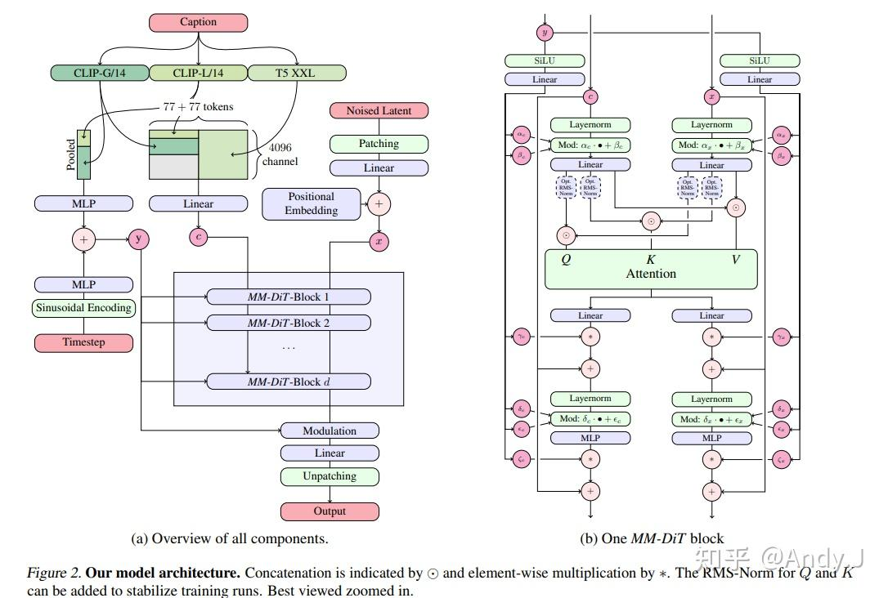

# 浅谈StableDiffusion

**Author:** AIDog

**Date:** 2025-08-17

**Link:** https://zhuanlan.zhihu.com/p/1940438860342473948

### StableDiffusion系列

code：[CompVis/stable-diffusion: A latent text-to-image diffusion model (github.com)](https://link.zhihu.com/?target=https%3A//github.com/CompVis/stable-diffusion)

code：[huggingface/diffusers: Diffusers: State-of-the-art diffusion models for image and audio generation in PyTorch and FLAX. (github.com)](https://link.zhihu.com/?target=https%3A//github.com/huggingface/diffusers/tree/main)

paper：[\[2112.10752\] High-Resolution Image Synthesis with Latent Diffusion Models (arxiv.org)](https://link.zhihu.com/?target=https%3A//arxiv.org/abs/2112.10752)

  

  

### 模型简介

**SD模型是生成式模型：**输入可以是文本、文本和图像、以及更多控制条件等，输出是生成的图像。

**SD模型属于[扩散模型](https://zhida.zhihu.com/search?content_id=261835926&content_type=Article&match_order=1&q=%E6%89%A9%E6%95%A3%E6%A8%A1%E5%9E%8B&zhida_source=entity)：**扩散模型的特点是生成过程分步化与可迭代，这让整个生成过程更加灵活，同时为引入更多约束与优化提供了可能。

**SD模型是基于Latent的扩散模型：**将输入数据压缩到[Latent隐空间](https://zhida.zhihu.com/search?content_id=261835926&content_type=Article&match_order=1&q=Latent%E9%9A%90%E7%A9%BA%E9%97%B4&zhida_source=entity)中，这比起常规扩散模型，大幅提高计算效率的同时，降低了显存占用，成为了SD模型破圈的关键一招。

**[Stable Diffusion](https://zhida.zhihu.com/search?content_id=261835926&content_type=Article&match_order=1&q=Stable+Diffusion&zhida_source=entity)的整个训练过程在最高维度上可以看成是如何加噪声和如何去噪声的过程，并在针对噪声的“对抗与攻防”中学习到生成图片的能力。**

Stable Diffusion整体的训练逻辑也非常清晰：

1.  从数据集中随机选择一个[训练样本](https://zhida.zhihu.com/search?q=%E8%AE%AD%E7%BB%83%E6%A0%B7%E6%9C%AC&zhida_source=entity&is_preview=1)
2.  从K个噪声量级随机抽样一个timestep t
3.  将timestep t对应的高斯噪声添加到图片中
4.  将加噪图片输入[U-Net](https://zhida.zhihu.com/search?content_id=261835926&content_type=Article&match_order=1&q=U-Net&zhida_source=entity)中预测噪声
5.  计算真实噪声和预测噪声的L2损失
6.  计算梯度并更新SD模型参数

### SD 1.x系列

-   SD 1.1：先在LAION2B-en数据集上用256x256分辨率训练237,000步（LAION2B-en数据集中256分辨率以上的数据一共有1324M）；然后在LAION-5B的[高分辨率数据集](https://link.zhihu.com/?target=https%3A//huggingface.co/datasets/laion/laion-high-resolution)（laion-high-resolution：LAION-5B数据集中图像分辨率在1024x1024以上的样本，共170M样本）用512x512分辨率接着训练194,000步。
-   SD 1.2：以SD 1.1为初始权重，在laion-improved-aesthetics数据集（LAION2B-en数据集中美学评分在5分以上并且分辨率大于512x512的无水印数据子集，一共约有600M个样本。这里设置了pwatermark>0.5为水印图片的规则来过滤含有水印的图片）上用512x512分辨率训练了515,000步。
-   SD 1.3：以SD 1.2为初始权重，在laion-improved-aesthetics数据集上继续用512x512分辨率训练了195,000步，并且采用了CFG技术（训练时以10%的概率dropping掉Text Embeddings）进行优化。
-   SD 1.4：以SD 1.2为初始权重，在laion-aesthetics v2 5+数据集上采用CFG技术用512x512分辨率训练了225,000步。
-   **SD 1.5**：以SD 1.2为初始权重，在laion-aesthetics v2 5+数据集上采用CFG技术用512x512分辨率训练了595,000步。

### SD 2.x系列

### SD 2.0

与SD 1.5模型相比，SD 2.0模型主要改动了**模型结构**和**训练数据**两个部分。

### 模型结构

Stable Diffusion 1.x系列中的Text Encoder部分是采用OpenAI开源的**CLIP ViT-L/14模型**，其模型参数量为123.65M；而Stable Diffusion V2系列则换成了新的OpenCLIP模型——**CLIP ViT-H/14模型**（基于LAION-2b数据集训练），其参数量为354.03M，比SD 1.x的Text Encoder模型大了3倍左右。

使用Text Encoder倒数第二层的特征来作为U-Net模型的文本信息输入，这与SD 1.x所使用的Text Encoder倒数第一层的特征不同。Imagen和novelai在训练时也采用了Text Encoder倒数第二层的特征，**因为倒数第一层的特征存在部分丢失细粒度文本信息的情况，而这些细粒度文本信息有助于SD模型更快地学习某些概念特征**。

**SD2.0和SD1.x的VAE部分是一致的**。由于切换了Text Encoder模型，在SD 2.0中U-Net的cross attention dimension从SD 1.x U-Net的768变成了1024，从而U-Net部分的整体参数量有一些增加（**860M -> 865M**），除此之外**SD 2.0 U-Net与SD 1.x U-Net的整体架构是一样的**。与此同时，在SD 2.0 U-Net中不同stage的attention模块的attention head dim是不固定的（5、10、20、20），而SD 1.x则是不同stage的attention模块采用固定的attention head数量（8），这个改动不会影响模型参数量。

### 训练数据

Stable Diffusion 2.0模型从头开始在LAION-5B数据集的子集（该子集通过LAION-NSFW[分类器](https://zhida.zhihu.com/search?q=%E5%88%86%E7%B1%BB%E5%99%A8&zhida_source=entity&is_preview=1)过滤掉了NSFW数据，过滤标准是punsafe=0.1和美学评分>= 4.5）上**以256x256的分辨率训练了550k步，**然后接着**以512x512的分辨率在同一数据集上进一步训练了850k步**。

SD 1.x系列模型主要采用LAION-5B中美学评分>= 5以上的子集来训练，而到了SD 2.0版本采用美学评分>= 4.5以上的子集，**这相当于扩大了训练数据集**。

### SD 2.1

SD 2.0在训练过程中采用NSFW检测器过滤掉了可能包含安全风险的图像（punsafe=0.1），但是同时也过滤了很多人像图片，这导致SD 2.0在人像生成上效果并不理想，**所以SD 2.1在SD 2.0的基础上放开了过滤限制（punsafe=0.98），在SD 2.0的基础上继续进行微调训练**。

**最终SD 2.1的人像的生成效果得到了优化和增强，同时与SD 2.0相比也提高了生成图片的整体质量，其base生成分辨率有512x512和768x768两个版本**，

### SDXL

paper：[\[2307.01952\] SDXL: Improving Latent Diffusion Models for High-Resolution Image Synthesis (arxiv.org)](https://link.zhihu.com/?target=https%3A//arxiv.org/abs/2307.01952)

### 模型简介

  

  

Stable Diffusion XL是一个**二阶段的级联扩散模型（Latent Diffusion Model）**，包括Base模型和Refiner模型。其中**Base模型的主要工作和Stable Diffusion 1.x-2.x一致**，具备文生图（txt2img）、图生图（img2img）、图像inpainting等能力。在Base模型之后，级联了Refiner模型，**对Base模型生成的图像Latent特征进行精细化提升，其本质上是在做图生图的工作**。

**SDXL Base模型由U-Net、VAE以及CLIP Text Encoder（两个）三个模块组成**，在FP16精度下Base模型大小6.94G（FP32：13.88G），其中U-Net占5.14G、VAE模型占167M以及两个CLIP Text Encoder一大一小（OpenCLIP ViT-bigG和OpenAI CLIP ViT-L）分别是1.39G和246M。

**SDXL Refiner模型同样由U-Net、VAE和CLIP Text Encoder（一个）三个模块组成**，在FP16精度下Refiner模型大小6.08G，其中U-Net占4.52G、VAE模型占167M（与Base模型共用）以及CLIP Text Encoder模型（OpenCLIP ViT-bigG）大小1.39G（与Base模型共用）。

### VAE

**Stable Diffusion XL使用了和之前Stable Diffusion系列一样的VAE结构（KL-f8）**，但在训练中选择了**更大的Batch-Size（256 vs 9）**，并且对模型进行指数滑动平均操作（**EMA**，exponential moving average），EMA对模型的参数做平均，从而提高性能并增加模型[鲁棒性](https://zhida.zhihu.com/search?q=%E9%B2%81%E6%A3%92%E6%80%A7&zhida_source=entity&is_preview=1)。

SD 2.x VAE是基于SD 1.x VAE微调训练了Decoder部分，同时保持Encoder部分权重不变，使他们有相同的Latent特征分布，所以**SD 1.x和SD 2.x的VAE模型是互相兼容的**。而SDXL VAE是重新从头开始训练的，所以其Latent特征分布与之前的两者不同。

由于Latent特征分布产生了变化，SDXL VAE的**缩放系数**也产生了变化。VAE在将Latent特征送入U-Net之前，需要对Latent特征进行缩放让其[标准差](https://zhida.zhihu.com/search?q=%E6%A0%87%E5%87%86%E5%B7%AE&zhida_source=entity&is_preview=1)尽量为1，之前的Stable Diffusion系列采用的**缩放系数为0.18215，**由于Stable Diffusion XL的VAE进行了全面的重训练，所以**缩放系数重新设置为0.13025**。

**注意：由于缩放系数的改变，Stable Diffusion XL VAE模型与之前的Stable Diffusion系列并不兼容。如果在SDXL上使用之前系列的VAE，会生成充满噪声的图片。**

### U-Net

U-Net的Encoder和Decoder结构也从之前系列的4stage改成3stage（\[1,1,1,1\] -> \[0,2,10\]），同时SDXL只使用两次下采样和上采样，而之前的SD系列模型都是三次下采样和上采样。并且比起Stable Diffusion 1.x-2.x，Stable Diffusion XL在第一个stage中不再使用Spatial Transformer Blocks，而在第二和第三个stage中大量增加了Spatial Transformer Blocks（分别是2和10），**那么这样设计有什么好处呢？**首先，**在第一个stage中不使用SDXL\_Spatial Transformer\_X模块，可以明显减少显存占用和计算量。**然后在第二和第三个stage这两个维度较小的feature map上使用数量较多的SDXL\_Spatial Transformer\_X模块，能**在大幅提升模型整体性能（学习能力和表达能力）的同时，优化了计算成本**。

### Text Encoder

Stable Diffusion XL和Stable Diffusion 1.x-2.x系列一样，**只使用Text Encoder模块从文本信息中提取Text Embeddings**。

**不同的是，Stable Diffusion XL与之前的系列相比使用了两个CLIP Text Encoder，分别是OpenCLIP ViT-bigG（694M）和OpenAI CLIP ViT-L/14（123.65M），从而大大增强了Stable Diffusion XL对文本的提取和理解能力，同时提高了输入文本和生成图片的一致性**。

Stable Diffusion XL分别**提取两个Text Encoder的倒数第二层特征**，并进行concat操作作为文本条件（Text Conditioning）。其中OpenCLIP ViT-bigG的特征维度为77x1280，而OpenAI CLIP ViT-L/14的特征维度是77x768，所以输入总的特征维度是77x2048（77是最大的token数，2048是SDXL的context dim），再通过Cross Attention模块将文本信息传入Stable Diffusion XL的训练过程与推理过程中。

### Refiner模型

由于已经有U-Net（Base）模型生成了图像的Latent特征，所以**Refiner模型的主要工作是在Latent特征进行小噪声去除和细节质量提升**。

**Refiner模型和Base模型一样是基于Latent的扩散模型**，也采用了Encoder-Decoder结构，和U-Net兼容同一个VAE模型。不过在Text Encoder部分，Refiner模型只使用了OpenCLIP ViT-bigG的Text Encoder，同样提取了倒数第二层特征以及进行了pooled text embedding的嵌入。

**Refiner模型主要做了图像生成图像（img2img）的工作**，其具备很强的**迁移兼容能力。**

**Stable Diffusion XL采用了多尺度训练策略，这个是在传统深度学习时代的王牌模型YOLO系列中常用的增强模型鲁棒性与泛化性的策略，终于在AIGC领域应用并常规化了，并且Stable Diffusion XL在多尺度训练的基础上，增加了分桶策略。**

### SD 3.0

paper：[Scaling Rectified Flow Transformers for High-Resolution Image Synthesis (arxiv.org)](https://link.zhihu.com/?target=https%3A//arxiv.org/pdf/2403.03206)

相比SD之前的版本，SD3有比较大的改进。首先，SD3是一个基于Rectified Flow的[生成模型](https://zhida.zhihu.com/search?q=%E7%94%9F%E6%88%90%E6%A8%A1%E5%9E%8B&zhida_source=entity&is_preview=1)；其次，SD3引入了T5-XXL来作为text encoder来提升模型的文本理解能力；最后，SD3采用了一个[多模态](https://zhida.zhihu.com/search?q=%E5%A4%9A%E6%A8%A1%E6%80%81&zhida_source=entity&is_preview=1)的[DiT](https://zhida.zhihu.com/search?content_id=261835926&content_type=Article&match_order=1&q=DiT&zhida_source=entity)架构，并且将模型参数量扩展为8B。

### 改进的RF

### 多模态DiT

多模态DiT的一个核心对图像的latent tokens和文本tokens拼接在一起，并采用两套独立的权重处理，但是在attention时统一处理。

  

  

### 改进的autoencoder

依然是使用一个autoencoder（VAE）来将图像编码为latent，然后将latent转成patches，送入transformer处理。SD3通过增加d来提升autoencoder的重建质量。SD3使用16通道的autoencoder。要注意，虽然增加通道并不会对生成模型（UNet或者DiT）的参数带来大的影响（只需要修改网络第一层和最后一层的通道数），但是会增加任务的难度，当通道数从4增加到16，网络要拟合的内容增加了4倍，这也意味模型需要增加参数来提供足够的容量。

### 文本编码器

SD3的text encoder包含3个预训练好的模型：

-   [CLIP ViT-L](https://link.zhihu.com/?target=https%3A//huggingface.co/openai/clip-vit-large-patch14)：参数量约124M
-   [OpenCLIP ViT-bigG](https://link.zhihu.com/?target=https%3A//huggingface.co/laion/CLIP-ViT-bigG-14-laion2B-39B-b160k)：参数量约695M
-   [T5-XXL encoder](https://link.zhihu.com/?target=https%3A//huggingface.co/google/t5-v1_1-xxl)：参数量约4.7B

SD 1.x模型的text encoder使用CLIP ViT-L，SD 2.x模型的text encoder采用OpenCLIP ViT-H，而SDXL的text encoder使用CLIP ViT-L + OpenCLIP ViT-bigG。这次SD3更上一个台阶，加上了一个更大的T5-XXL encoder。