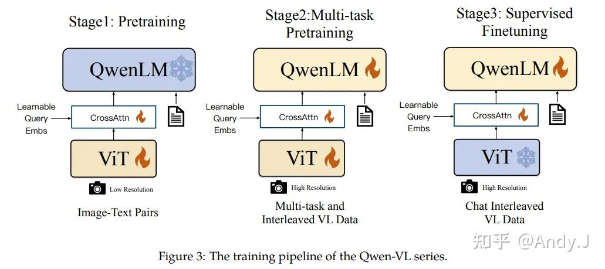
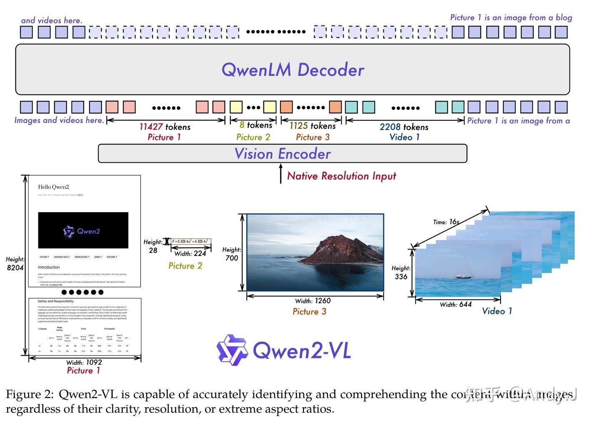
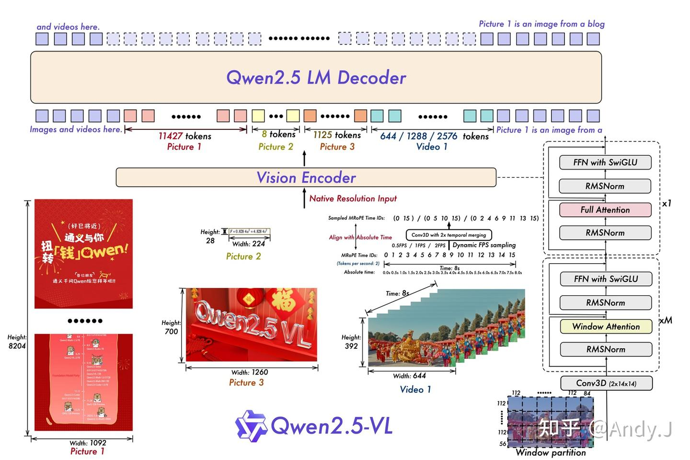

# 多模态模型解读-Qwen VL 全家桶

**Author:** AIDog

**Date:** 2025-08-23

**Link:** https://zhuanlan.zhihu.com/p/1942626985814790975

Qwen系列是阿里开源的模型，包含大语言模型Qwen series(大语言模型)和 [Qwen-VL](https://zhida.zhihu.com/search?content_id=262153761&content_type=Article&match_order=1&q=Qwen-VL&zhida_source=entity) series(多模态大模型)。本文主要对Qwen-VL series进行介绍。

本文重点介绍Qwen2-VL和Qwen2.5-VL两个模型

## Qwen-VL

模型训练pipeline如下：



1.  Qwen-VL的**大型语言模型**使用了来自**Qwen-7B**模型的预训练权重。
2.  **视觉编码器**的架构和预训练权重来自于Openclip的**[ViT-bigG](https://zhida.zhihu.com/search?content_id=262153761&content_type=Article&match_order=1&q=ViT-bigG&zhida_source=entity)**模型。
3.  **位置感知的视觉-语言适配器**（Position-aware Vision-Language Adapter）：

-   压缩图像特征。适配器包括一个单层的交叉注意力模块，随机初始化。此模块使用一组可训练的向量（嵌入）作为查询向量，使用来自视觉编码器的图像特征作为交叉注意力操作的键。这个机制将视觉特征序列压缩到固定长度的256。
-   考虑位置信息。引入了2D绝对位置编码到交叉[注意力机制](https://zhida.zhihu.com/search?q=%E6%B3%A8%E6%84%8F%E5%8A%9B%E6%9C%BA%E5%88%B6&zhida_source=entity&is_preview=1)的查询-键对中。

在处理大量的图像特征时，尤其是在序列非常长的情况下，直接传递可能会导致效率问题。通过引入这个“Position-aware Vision-Language Adapter”，可以有效地处理长序列，提高了模型的整体性能。

## Qwen2-VL

论文链接：[Qwen2-VL: Enhancing Vision-Language Model’s Perception of the World at Any Resolution](https://link.zhihu.com/?target=https%3A//arxiv.org/pdf/2409.12191)



Qwen2-VL模型主要包含以下几个MLLM常用部分组件

```text
1. chat_template : 
    - 用于将用户的输入转化为模型所需要输入的标准格式，例如 qwen 的 chatml 格式 
2. image processor 
    - 用于对输入的图像进行预处理，将输入的图像转化为模型所需要的格式,如 llava 需要切分的patch都是在这一步准备的
3. processor 
    - 利用 image processor 处理图片
    - 利用 tokenizer 处理 prompt 
    - 可能会在 prompt 当中为 image 提前预留好位置 (placeholder) , 如 minicpm 的处理方法
4. model 
    - vision_model 
        - 接受 vision embedding
    - scatter 
        - 将 vision embedding 插入到 text embedding 当中, llava onevision 和 minicpm 都采用了 scatter 的方式 
    - llm encoder 
        - 采用大语言模型进行建模
```

### **2.1 chat\_template处理**

Qwen2-VL采用[ChatML](https://zhida.zhihu.com/search?content_id=262153761&content_type=Article&match_order=1&q=ChatML&zhida_source=entity)格式template。Qwen2-VL将图片编码为<|vision\_start|><|image\_pad|><|vision\_end|>形式。最后一行为推理辅助token。

```python
'''<|im_start|>system\n
You are a helpful assistant.<|im_end|>\n
<|im_start|>user\n
<|vision_start|><|image_pad|><|vision_end|><|vision_start|><|image_pad|><|vision_end|>请描述这两张图片<|im_end|>\n
<|im_start|>assistant\n
'''
```

### **2.2 image\_processor**

Qwen2-VL在图像预处理主要两部分：

```text
1. smart_resize：
   将图像的宽高reszie到patch_size的整数倍，比如(1080, 1920)的图像变为(1092, 1932);
   目的：patch_size的整数倍，patch数量不要超过ViT的上限。
2. 图片flatten到(patch_num_h * patch_num_w) 个 patch  (patch_size * patch_size)
```

代码实现：

```python3
# 生成patch_size正式倍的宽高，且位于min_pixels和max_pixels之间
resized_height, resized_width = smart_resize(
                    height, #原始图像宽高
                    width,
                    factor=self.patch_size * self.merge_size, # 14 * 2
                    min_pixels=self.min_pixels,
                    max_pixels=self.max_pixels,
                )
image = resize(
                    image, size=(resized_height, resized_width), resample=resample, input_data_format=input_data_format
                )

def smart_resize(
    height: int, width: int, factor: int = 28, min_pixels: int = 56 * 56, max_pixels: int = 14 * 14 * 4 * 1280
):
    h_bar = round(height / factor) * factor
    w_bar = round(width / factor) * factor
    if h_bar * w_bar > max_pixels:
        beta = math.sqrt((height * width) / max_pixels)
        h_bar = math.floor(height / beta / factor) * factor
        w_bar = math.floor(width / beta / factor) * factor
    elif h_bar * w_bar < min_pixels:
        beta = math.sqrt(min_pixels / (height * width))
        h_bar = math.ceil(height * beta / factor) * factor
        w_bar = math.ceil(width * beta / factor) * factor
    return h_bar, w_bar
```

最大像素 14\*14\*4\*1280，有一层MLP（2\*2 merge），14为patch\_size，1280为最大patch数量。

Dynamic Resolution方法先按patch\_size=14切分，然后在通过MLP对相邻的2x2的tokens进行特征合并，得到最终的vision token对齐

使用smart\_resize后进行reshape，代码如下：

```python
# self.temporal_patch_size = 2
# self.merge_size = 2
# patches.shape = (2, 3, H, W), 以h=364, w=644为例
grid_t = patches.shape[0] // self.temporal_patch_size # 1
# 宽高按patch_size进行切分数量, grid_h=26, grid_w=46
grid_h, grid_w = resized_height // self.patch_size, resized_width // self.patch_size 
# patch shape: [1,2,3,13,2,23,2,14]
patches = patches.reshape(
    grid_t,
    self.temporal_patch_size,
    channel,
    grid_h // self.merge_size, # 注意：为什么再除self.merge_size，为了后面MLP(2x2相邻tokens)
    self.merge_size,
    self.patch_size,
    grid_w // self.merge_size,
    self.merge_size,
    self.patch_size,
    ) 
# 维度变换(1, 13, 23, 2, 2, 3, 2, 14, 14)
patches = patches.transpose(0, 3, 6, 4, 7, 2, 1, 5, 8)
# flatten_patches.shape = (1196, 1176)
flatten_patches = patches.reshape(
    grid_t * grid_h * grid_w, channel * self.temporal_patch_size * self.patch_size * self.patch_size
)
```

这样的处理方式可以保证2x2patch flatten后是相连的, 方便后面MLP的时候切分。

图像image\_processor最终返回image\_inputs：

```text
# pixel_values.shape = (2392, 1176) 传了两幅图像
# vision_grid_thws = array([[ 1, 26, 46], [ 1, 26, 46]])
image_inputs = {"pixel_values": pixel_values, "image_grid_thw": vision_grid_thws}
```

### **2.3 tokens预定义**

通过计算横纵patch的数量，将text中的`<image_pad>`替换为`image_grid_thw[index].prod() // merge_length个<|placeholder|>`,为什么需要除merge\_length? 就是和MLP(2x2相邻patch)变成一个vision token有关。  
然后再将所有的`<|placeholder|>`变成`<image_pad>`.

```python3
# merge_length = 4
merge_length = self.image_processor.merge_size**2
index = 0
for i in range(len(text)):
    while self.image_token in text[i]:
        text[i] = text[i].replace(
            self.image_token, "<|placeholder|>" * (image_grid_thw[index].prod() // merge_length), 1
        )
        index += 1
    '''
    text = <|im_start|>system\n
            You are a helpful assistant.<|im_end|>\n
            <|im_start|>user\n
            <|vision_start|><|placeholder|> * 26*46/4 <|vision_end|><|vision_start|><|placeholder|> * 26*46/4<|vision_end|>请描述这两张图片<|im_end|>\n
            <|im_start|>assistant\n
    '''
    text[i] = text[i].replace("<|placeholder|>", self.image_token)
    '''
    text = <|im_start|>system\n
            You are a helpful assistant.<|im_end|>\n
            <|im_start|>user\n
            <|vision_start|><image_pad> * 26*46/4 <|vision_end|><|vision_start|><image_pad> * 26*46/4<|vision_end|>请描述这两张图片<|im_end|>\n
            <|im_start|>assistant\n
    '''
# 将text的文本tokenizer编码为id的形式
# text_inputs.kyes = (['input_ids', 'input_ids'])
# input_ids=[[151664,...,198], attention_mask=[[1,..,1]]
text_inputs = self.tokenizer(text, **output_kwargs["text_kwargs"])
```

### **2.4 processor**

经过前面image\_processor得到image\_inputs, text\_prompt tokenizer得到text\_inputs。最后processor将这两部分的信息合并起来得到inputs。

```python
image_inputs = {"pixel_values": pixel_values, "image_grid_thw": vision_grid_thws}
text_inputs = {"input_ids": input_ids, "attention_mask": attention_mask}
inputs = {"input_ids": input_ids, "attention_mask": attention_mask, "pixel_values": pixel_values, "image_grid_thw": vision_grid_thws}
```

### **2.5 model input数据准备**

**2.5.1 model\_inputs变量**

数据准备位于Qwen2VLForConditionalGeneration.prepare\_inputs\_for\_generation()，得到model\_inputs。

```python
model_inputs =
    {   "input_ids": input_ids, # token的index
        "position_ids": position_ids, # 3D RoPE的位置编码index
        "past_key_values": past_key_values, # DynamicCache()用于储存KVCache的信息
        "use_cache": use_cache, # 是否采用cache
        "attention_mask": attention_mask, # 推理的attention mask
        "pixel_values": pixel_values, # images的patch 原始像素信息
        "pixel_values_videos": pixel_values_videos, #video的patch 原始像素信息
        "image_grid_thw": image_grid_thw, # images的patch数量信息
        "video_grid_thw": video_grid_thw, # video的patch数量信息
        "rope_deltas": rope_deltas, # rope的惩罚系数
    }
```

**2.5.2 position\_ids变量生成**

3D RoPE位置编码index，包含tempraol,height和width。

图像包含3个维度的index是不同的,而文本3个维度的index是一样的。如下图所示:

  

```python3
# 代码位于：Qwen2VLForConditionalGeneration.get_rope_index()
# 假设input_ids:[V V V V V V V V V V V V T T T T T], V表示vision的token <image_pad>, T表示text的token
# 计算图像和文本的 temproal, height和width的位置编码index
vision temporal position_ids: [0, 0, 0, 0, 1, 1, 1, 1, 2, 2, 2, 2]
vision height position_ids: [0, 0, 1, 1, 0, 0, 1, 1, 0, 0, 1, 1]
vision width position_ids: [0, 1, 0, 1, 0, 1, 0, 1, 0, 1, 0, 1]
text temporal position_ids: [3, 4, 5, 6, 7]
text height position_ids: [3, 4, 5, 6, 7]
text width position_ids: [3, 4, 5, 6, 7]
# 文本开始的position_idx是vision position_idx的最大值+1
# 最后将不同维度的图和文本的position_ids进行拼接，输出最终的position_ids，shape:[3, 1, num_tokens]
```

### **2.6 model推理过程**

**2.6.1 整体推理**

主要逻辑位于[这里](https://link.zhihu.com/?target=https%3A//github.com/huggingface/transformers/blob/main/src/transformers/models/qwen2_vl/modeling_qwen2_vl.py%23L1255)

```python
class Qwen2VLForConditionalGeneration(Qwen2VLPreTrainedModel, GenerationMixin):
    _checkpoint_conversion_mapping = {
        "^visual": "model.visual",
        r"^model(?!\.(language_model|visual))": "model.language_model",
    }
    _tied_weights_keys = ["lm_head.weight"]

    def __init__(self, config):
        super().__init__(config)
        self.model = Qwen2VLModel(config)
        self.lm_head = nn.Linear(config.text_config.hidden_size, config.text_config.vocab_size, bias=False)

        self.post_init()

class Qwen2VLModel(Qwen2VLPreTrainedModel):
    base_model_prefix = ""
    _checkpoint_conversion_mapping = {"^model": "language_model"}

    def __init__(self, config: Qwen2VLConfig):
        super().__init__(config)
        self.visual = Qwen2VisionTransformerPretrainedModel._from_config(config.vision_config)
        self.language_model = Qwen2VLTextModel._from_config(config.text_config)
        self.rope_deltas = None  # cache rope_deltas here

        # Initialize weights and apply final processing
        self.post_init()
```

Qwen2VLForConditionalGeneration的forward代码：

```python
def forward(**model_inputs):
    output_attentions = output_attentions if output_attentions is not None else self.config.output_attentions
    output_hidden_states = (
        output_hidden_states if output_hidden_states is not None else self.config.output_hidden_states
    )

    outputs = Qwen2VLModel(
        input_ids=input_ids,
        pixel_values=pixel_values,
        pixel_values_videos=pixel_values_videos,
        image_grid_thw=image_grid_thw,
        video_grid_thw=video_grid_thw,
        position_ids=position_ids,
        attention_mask=attention_mask,
        past_key_values=past_key_values,
        inputs_embeds=inputs_embeds,
        use_cache=use_cache,
        output_attentions=output_attentions,
        output_hidden_states=output_hidden_states,
        return_dict=True,
        cache_position=cache_position,
        **kwargs,
    )

    hidden_states = outputs[0]
    logits = self.lm_head(hidden_states)

    loss = None
    if labels is not None:
        loss = self.loss_function(
            logits=logits, labels=labels, vocab_size=self.config.text_config.vocab_size, **kwargs
    )

    return Qwen2VLCausalLMOutputWithPast(
        loss=loss,
        logits=logits,
        past_key_values=outputs.past_key_values,
        hidden_states=outputs.hidden_states,
        attentions=outputs.attentions,
        rope_deltas=outputs.rope_deltas,
    )
```

Qwen2VLModel的forward代码：

```python
def forward(**model_inputs):
    output_attentions = output_attentions if output_attentions is not None else self.config.output_attentions
    output_hidden_states = (
        output_hidden_states if output_hidden_states is not None else self.config.output_hidden_states
    )
    return_dict = return_dict if return_dict is not None else self.config.use_return_dict

    if inputs_embeds is None:
        inputs_embeds = self.get_input_embeddings()(input_ids)

    if pixel_values is not None:
        image_embeds = self.get_image_features(pixel_values, image_grid_thw)
        image_embeds = torch.cat(image_embeds, dim=0).to(inputs_embeds.device, inputs_embeds.dtype)
        image_mask, _ = self.get_placeholder_mask(
            input_ids, inputs_embeds=inputs_embeds, image_features=image_embeds
        )
        inputs_embeds = inputs_embeds.masked_scatter(image_mask, image_embeds)

    if pixel_values_videos is not None:
        video_embeds = self.get_video_features(pixel_values_videos, video_grid_thw)
        video_embeds = torch.cat(video_embeds, dim=0).to(inputs_embeds.device, inputs_embeds.dtype)
        _, video_mask = self.get_placeholder_mask(
            input_ids, inputs_embeds=inputs_embeds, video_features=video_embeds
        )
        inputs_embeds = inputs_embeds.masked_scatter(video_mask, video_embeds)

    if position_ids is None:
        if self.rope_deltas is None or cache_position is None or cache_position[0] == 0:
            position_ids, rope_deltas = self.get_rope_index(
                input_ids, image_grid_thw, video_grid_thw, attention_mask
            )
            self.rope_deltas = rope_deltas
        # then use the prev pre-calculated rope-deltas to get the correct position ids
        else:
            batch_size, seq_length, _ = inputs_embeds.shape
            position_ids = torch.arange(seq_length, device=inputs_embeds.device)
            position_ids = position_ids.view(1, 1, -1).expand(3, batch_size, -1)
            if cache_position is not None:
                delta = (cache_position[0] + self.rope_deltas).to(inputs_embeds.device)
            else:
                delta = torch.zeros((batch_size, seq_length), device=inputs_embeds.device)
            delta = delta.repeat_interleave(batch_size // delta.shape[0], dim=0)
            position_ids += delta.to(position_ids.device)

    outputs = self.language_model(
        input_ids=None,
        position_ids=position_ids,
        attention_mask=attention_mask,
        past_key_values=past_key_values,
        inputs_embeds=inputs_embeds,
        use_cache=use_cache,
        output_attentions=output_attentions,
        output_hidden_states=output_hidden_states,
        return_dict=True,
        cache_position=cache_position,
        **kwargs,
    )

    output = Qwen2VLModelOutputWithPast(
        last_hidden_state=outputs.last_hidden_state,
        past_key_values=outputs.past_key_values,
        hidden_states=outputs.hidden_states,
        attentions=outputs.attentions,
        rope_deltas=self.rope_deltas,
    )
    return output if return_dict else output.to_tuple()
```

**2.6.2 ViT-2D多维RoPE**

1D-RoPE的实现方法：  
$R_{\Theta,m}^{d} x=\left(\begin{array}{c}  x_{1}\\  x_{2}\\  x_{3}\\  x_{4}\\  \vdots\\  x_{d-1}\\  x_{d} \end{array}\right)\otimes\left(\begin{array}{c} \cos m\theta_{1}\\  \cos m\theta_{1}\\  \cos m\theta_{2}\\  \cos m\theta_{2}\\  \vdots\\  \cos m\theta_{d/2}\\  \cos m\theta_{d/2} \end{array}\right)+\left(\begin{array}{c} -x_{2}\\  x_{1}\\  -x_{4}\\  x_{3}\\  \vdots\\  -x_{d}\\  x_{d-1} \end{array}\right)\otimes\left(\begin{array}{c} \sin m\theta_{1}\\  \sin m\theta_{1}\\  \  \sin m\theta_{2}\\  \sin m\theta_{2}\\  \vdots\\  \sin m\theta_{d/2}\\  \sin m\theta_{d/2} \end{array}\right) \\$  
2D-RoPE的实现方法，可以对比发现， $\theta$ 的序列编码最大到d/4，两个特征为X方向的编码ids进行旋转，然后再两个特征为Y方向的编码ids进行旋转，依次类推。  
$R_{\Theta,ids_x,ids_y}^{d} x=\left(\begin{array}{c}  x_{1}\\  x_{2}\\  \vdots\\ x_{d/2-1}\\  x_{d/2}\\   x_{d/2+1}\\  x_{d/2+2}\\  \vdots\\  x_{d-1}\\  x_{d} \end{array}\right)\otimes\left(\begin{array}{c} \cos ids_x\theta_{1}\\  \cos ids_y\theta_{1}\\  \vdots\\  \cos ids_x\theta_{d/4}\\  \cos ids_y\theta_{d/4}\\  \cos ids_x\theta_{1}\\  \cos ids_y\theta_{1}\\  \vdots\\  \cos ids_x\theta_{d/4}\\  \cos ids_y\theta_{d/4} \end{array}\right)+\left(\begin{array}{c} -x_{d/2+1}\\  -x_{d/2+2}\\  \vdots\\ -x_{d/2-1}\\  -x_{d/2}\\   x_{1}\\  x_{2}\\  \vdots\\  x_{d/2-1}\\  x_{d/2} \end{array}\right)\otimes\left(\begin{array}{c} \sin ids_x\theta_{1}\\  \sin ids_y\theta_{1}\\  \vdots\\  \sin ids_x\theta_{d/4}\\  \sin ids_y\theta_{d/4}\\  \sin ids_x\theta_{1}\\  \sin ids_y\theta_{1}\\  \vdots\\  \sin ids_x\theta_{d/4}\\  \sin ids_y\theta_{d/4} \end{array}\right) \\$

计算2D旋转位置编码的角度信息 rotary\_pos\_emb

```python
def rot_pos_emb(self, grid_thw):
    '''
    得到每个patch位置的2D-位置编码的正余弦()内的角度信息, 然后再对xy方向进行flatten
    '''
    pos_ids = []
    for t, h, w in grid_thw:
        # [h, w]
        hpos_ids = torch.arange(h).unsqueeze(1).expand(-1, w) 
        # [h//spatial_merge_size, spatial_merge_size, w//spatial_merge_size, spatial_merge_size], spatial_merge_size=2
        hpos_ids = hpos_ids.reshape(
            h // self.spatial_merge_size,
            self.spatial_merge_size,
            w // self.spatial_merge_size,
            self.spatial_merge_size,
        ) 
        # [h//spatial_merge_size,  w//spatial_merge_size, spatial_merge_size, spatial_merge_size]
        hpos_ids = hpos_ids.permute(0, 2, 1, 3) 
        # [h*w]
        hpos_ids = hpos_ids.flatten() 

        wpos_ids = torch.arange(w).unsqueeze(0).expand(h, -1)
        wpos_ids = wpos_ids.reshape(
            h // self.spatial_merge_size,
            self.spatial_merge_size,
            w // self.spatial_merge_size,
            self.spatial_merge_size,
        )
        wpos_ids = wpos_ids.permute(0, 2, 1, 3)
        wpos_ids = wpos_ids.flatten()
        pos_ids.append(torch.stack([hpos_ids, wpos_ids], dim=-1).repeat(t, 1)) # [t, h*w, 2]
    # [n*h*w, 2], 每个patch的(x,y)位置，比如这个例子就是[2392,2]
    pos_ids = torch.cat(pos_ids, dim=0) 
    max_grid_size = grid_thw[:, 1:].max()
    # [max_grid_size, head_dim//4], x和y每个方向最大的就是\theta_{d//4}
    rotary_pos_emb_full = self.rotary_pos_emb(max_grid_size)
    # 提取每个patch的x,y的embedding角度信息m*\theta_{i}, [nhw, 2, head_dim//4] -> [nhw, head_dim//2]
    rotary_pos_emb = rotary_pos_emb_full[pos_ids].flatten(1)
    return rotary_pos_emb


# 其中self.rotary_pos_emb定义如下：
class VisionRotaryEmbedding(nn.Module):
    def __init__(self, dim: int, theta: float = 10000.0) -> None:
        super().__init__()
        # 就是 1 / (10000^{2i/d})
        inv_freq = 1.0 / (theta ** (torch.arange(0, dim, 2, dtype=torch.float) / dim))
        self.register_buffer("inv_freq", inv_freq, persistent=False)

    def forward(self, seqlen: int) -> torch.Tensor:
        # [seqlen]
        seq = torch.arange(seqlen, device=self.inv_freq.device, dtype=self.inv_freq.dtype) 
        # [seqlen, dim//2], 对应每m个对应的位置编码正余弦里面的数 m/(10000^{2i/dim})
        freqs = torch.outer(seq, self.inv_freq) # 外积
        return freqs
```

添加到Q和K中：

```python
def apply_rotary_pos_emb_vision(tensor: torch.Tensor, freqs: torch.Tensor) -> torch.Tensor:
    # tensor:query或者key, freqs：2D旋转位置编码的角度信息
    orig_dtype = tensor.dtype
    tensor = tensor.float() # [b, seq_len, num_head, dim]
    cos = freqs.cos() # [seq_len, dim//2]
    sin = freqs.sin() # [seq_len, dim//2]
    # repeat(1,1,2)中的2 就是 公式中的两个相同的 m\theta_i
    cos = cos.unsqueeze(1).repeat(1, 1, 2).unsqueeze(0).float() # 维度对齐 [b, seq_len, num_head, dim]
    sin = sin.unsqueeze(1).repeat(1, 1, 2).unsqueeze(0).float()
    output = (tensor * cos) + (rotate_half(tensor) * sin) # rope 2D高效计算 [b, seq_len, num_head, dim]
    output = output.to(orig_dtype)
    return output
 
 # 其中rotate_half是将[x1,..,x_{d/2},x_{d/2+1},..,x_d]变为[-x_{d/2+1},..,-x_d,x1,..,x_{d/2}]
 def rotate_half(x):
    """Rotates half the hidden dims of the input."""
    x1 = x[..., : x.shape[-1] // 2]
    x2 = x[..., x.shape[-1] // 2 :]
    return torch.cat((-x2, x1), dim=-1)
```

  

**2.6.3 Modal-RoPE**

上面是 2D-RoPE 直接将每个 patch 的 xy 的角度信息 embed\_dim 拼接为 2\*embed\_dim，然后再 repeat，也就是 dim 中一半用 x\_id 的位置编码，一半用 y\_id 的位置编码。  
而 Modal-RoPE 是 dim 中不同区域取不同信息 (temporal, height and width) 的位置编码。  

首先先看一下rotary\_embed如何实现M-RoPE。首先计算head\_dim//2个 $\theta_i$ 角度信息, 然后与position\_id进行相乘得到freqs，最后两个相同的freqs进行拼接得到emb, 以第ids位置token的freqs进行举例 $[ids*\theta_1,ids*\theta_2, \dots, ids*\theta_{d/2}, ids*\theta_1,ids*\theta_2, \dots, ids*\theta_{d/2}]$

```python
class Qwen2VLRotaryEmbedding(nn.Module):
 def forward(self, x, position_ids):
    if "dynamic" in self.rope_type:
        self._dynamic_frequency_update(position_ids, device=x.device)

    # Core RoPE block. In contrast to other models, Qwen2_VL has different position ids for thw grids
    # So we expand the inv_freq to shape (3, ...)
    # 首先计算head_dim//2个$$\theta_i$$角度信息，并expand到[3, 1, 64, 1]，其中head_dim=128
    inv_freq_expanded = self.inv_freq[None, None, :, None].float().expand(3, position_ids.shape[1], -1, 1) # [3, 1, 64, 1]
    position_ids_expanded = position_ids[:, :, None, :].float()  # shape (3, bs, 1, positions)
    # Force float32 (see https://github.com/huggingface/transformers/pull/29285)
    device_type = x.device.type
    device_type = device_type if isinstance(device_type, str) and device_type != "mps" else "cpu"
    with torch.autocast(device_type=device_type, enabled=False):
        # $$\theta_i$$与position_ids进行相乘，得到ids * $$\theta_i$$
        freqs = (inv_freq_expanded.float() @ position_ids_expanded.float()).transpose(2, 3) # [3, bs, positions, 64]
        # 相同的freqs进行拼接
        emb = torch.cat((freqs, freqs), dim=-1) # [3, bs, positions, 128]
        cos = emb.cos()
        sin = emb.sin()

    # Advanced RoPE types (e.g. yarn) apply a post-processing scaling factor, equivalent to scaling attention
    cos = cos * self.attention_scaling
    sin = sin * self.attention_scaling

    return cos.to(dtype=x.dtype), sin.to(dtype=x.dtype)
 
```

上面通过freqs得到每个维度的cos和sin信息。那么在多维怎么做RoPE呢？是每个维度切取一部分的位置编码，然后进行拼接得到最终的旋转位置编码，这样就包含了不同维度的位置信息。以head\_dim=128举例，公式和code实现如下, 例如 $x_{1}和x_{65}$ 特征值进行了旋转。  
$R_{\Theta,ids_t,ids_x,ids_y}^{d} x=\left(\begin{array}{c}  x_{1}\\  \vdots\\ x_{16}\\  x_{17}\\ \vdots\\ x_{40}\\  x_{41}\\  \vdots\\ x_{64}\\ x_{65}\\ \vdots\\ x_{80}\\  x_{81}\\  \vdots\\ x_{104}\\  x_{105}\\   \vdots\\ x_{128} \end{array}\right)\otimes\left(\begin{array}{c} \cos ids_t\theta_{1}\\  \vdots\\ \cos ids_t\theta_{16}\\  \cos ids_x\theta_{1}\\ \vdots\\ \cos ids_x\theta_{24}\\  \cos ids_y\theta_{1}\\  \vdots\\ \cos ids_y\theta_{24}\\ \cos ids_t\theta_{1}\\  \vdots\\ \cos ids_t\theta_{16}\\  \cos ids_x\theta_{1}\\ \vdots\\ \cos ids_x\theta_{24}\\  \cos ids_y\theta_{1}\\  \vdots\\ \cos ids_y\theta_{24}\\ \end{array}\right)+\left(\begin{array}{c} -x_{65}\\ \vdots\\ -x_{80}\\  -x_{81}\\  \vdots\\ -x_{104}\\  -x_{105}\\   \vdots\\ -x_{128}\\ x_{1}\\  \vdots\\ x_{16}\\  x_{17}\\ \vdots\\ x_{40}\\  x_{41}\\  \vdots\\ x_{64}\\ \end{array}\right)\otimes\left(\begin{array}{c} \sin ids_t\theta_{1}\\  \vdots\\ \sin ids_t\theta_{16}\\  \sin ids_x\theta_{1}\\ \vdots\\ \sin ids_x\theta_{24}\\  \sin ids_y\theta_{1}\\  \vdots\\ \sin ids_y\theta_{24}\\ \sin ids_t\theta_{1}\\  \vdots\\ \sin ids_t\theta_{16}\\  \sin ids_x\theta_{1}\\ \vdots\\ \sin ids_x\theta_{24}\\  \sin ids_y\theta_{1}\\  \vdots\\ \sin ids_y\theta_{24}\\ \end{array}\right)$

```python
# position_ids是一个[3, b, num_tokens], 每个token有3个方向temporal, height and width的位置编码id
# cos.shape = [3,b,num_tokens, 128]
# sin.shape = [3,b,num_tokens, 128]
# q,k.shape = [b,n_head,num_tokens,dim] dim=128
def apply_multimodal_rotary_pos_emb(q, k, cos, sin, mrope_section, unsqueeze_dim=1):
    # mrope_section = [16, 24, 24, 16, 24, 24]
    mrope_section = mrope_section * 2 
    # 先将cos对dim维度划分为6组数据，[3, 1, num_tokens, 16], [3, 1, num_tokens, 24], ...
    # (1) 第1组数据slice[0,...]即(temporal)出来[1,num_tokens,16]。
    # (2) 第2组数据slice[1,...]即(height)出来[1,num_tokens,24]
    # (3) 第3组数据slice[2,...]即(width)出来[1,num_tokens,24]
    # (4) 第4组数据slice[0,...]即(temporal)出来[1,num_tokens,16]，由于freqs(128)前一半(64)和后一半(64)相同, 这一块的freqs则与(1)中的freqs是相同的
    # (5) 第5组数据slice[1,...]即(height)出来[1,num_tokens,24]
    # (6) 第6组数据slice[2,...]即(width)出来[1,num_tokens,24]
    # cat拼接为[1,1,num_tokens,128]
    cos = torch.cat([m[i % 3] for i, m in enumerate(cos.split(mrope_section, dim=-1))], dim=-1).unsqueeze(
        unsqueeze_dim
    )
    # sin处理和cos一样的
    sin = torch.cat([m[i % 3] for i, m in enumerate(sin.split(mrope_section, dim=-1))], dim=-1).unsqueeze(
        unsqueeze_dim
    )
    # 希望0-15特征元素使用temporal类型的位置编码, 16-39使用height类型的位置编码, ...
    q_embed = (q * cos) + (rotate_half(q) * sin)
    k_embed = (k * cos) + (rotate_half(k) * sin)
    return q_embed, k_embed
 
```

## Qwen2.5-VL

论文链接：[Qwen2.5-VL Technical Report](https://link.zhihu.com/?target=https%3A//arxiv.org/pdf/2502.13923)

Qwen2.5-VL相比于qwen2-VL的改进有以下几点：

1.  **动态帧率采样(dynamic fps sampling)**：即可以人为设定采样帧率，按这个帧率对原始视频进行采样
2.  **改进3D mrope在T维度上的position\_id计算方式**：从原来的默认值1，改成使用实际时间间隔进行加权计算
3.  **预训练数据集的扩展**，从1.2万亿tokens增加到4万亿tokens
4.  **Window attention**：

-   在**vit encoder**部分，引入window attention，即一张图只在window范围内做双向attention，每个窗口的最大大小为112\*112（即8\*8个14\*14的patch/token），这样可以进一步节省计算
-   如果一个窗口的尺寸小于112\*112，也不会对他做padding，这样可以尽量保证图片在原生分辨率下做操作
-   在vit enocder部分，只有4层用的是基于整张图的full attention，其余层用的都是window attention

  

### **3.1 整体架构：**



  

  

### **3.2 推理示例**

```python
"""
处理image
"""
from transformers import Qwen2_5_VLForConditionalGeneration, AutoProcessor
from qwen_vl_utils import process_vision_info

# 读取模型权重
model = Qwen2_5_VLForConditionalGeneration.from_pretrained(
    "Qwen/Qwen2.5-VL-3B-Instruct", torch_dtype="auto", device_map="auto"
)

# We recommend enabling flash_attention_2 for better acceleration and memory saving, especially in multi-image and video scenarios.
# model = Qwen2_5_VLForConditionalGeneration.from_pretrained(
#     "Qwen/Qwen2.5-VL-7B-Instruct",
#     torch_dtype=torch.bfloat16,
#     attn_implementation="flash_attention_2",
#     device_map="auto",
# )

# 读取用于处理数据中图像和文本的processor：
#（1） 默认情况下，在qwen2.5 LM Decoder的输入中，一张图片最少占据4个token，最多占据16384个token
# (2) 你也可以自己权衡模型效果和计算成本，自行设定一张图片最少/最多占据的token数量，
#     然后把这个自定义值传入process初始化的参数重，例如：
#     min_pixels = 256*28*28，你希望一张图片最少占据256个token，由于每个token对应一块28*28的区域，所以这张图片至少拥有256*28*28个pixel
#     max_pixels = 1280*28*28，道理同上
#     processor = AutoProcessor.from_pretrained("Qwen/Qwen2.5-VL-7B-Instruct", min_pixels=min_pixels, max_pixels=max_pixels)
# 
processor = AutoProcessor.from_pretrained("Qwen/Qwen2.5-VL-3B-Instruct")

# 传入prompt

messages = [
    {
        "role": "user",
        "content": [
            {
                "type": "image",
                "image": "https://qianwen-res.oss-cn-beijing.aliyuncs.com/Qwen-VL/assets/demo.jpeg",
            },
            {"type": "text", "text": "Describe this image."},
        ],
    }
]

# Preparation for inference
# 对 messages 做一些处理
#
# text返回结果：
# <|im_start|>system
# You are a helpful assistant.<|im_end|>
# <|im_start|>user
# <|vision_start|><|image_pad|><|vision_end|>Describe this image.<|im_end|>
# <|im_start|>assistant
text = processor.apply_chat_template(
    messages, tokenize=False, add_generation_prompt=True
)

# 预处理图像和视频数据。这里以图像数据举例
# image_inputs: List[PIL.Image.Image], 列表长度为这个batch中对应的所有图片数量，这点非常重要
# 假设列表长度为1，那么image_inputs形如：[<PIL.Image.Image image mode=RGB size=2044x1372>]
#
# process_vision_info对每个image都做了如下处理：
#（1）检查每张图片的 max(h,w)/min(h,w)是否在阈值范围内，如果超过阈值则认为该图片高宽比太离谱，会直接抛出异常（当前阈值200）
#（2）通过四舍五入的方式，重新设置图片的 h 和 w 值，确保它们可以被28整除
#（3）如果这张图片太大，超过了上述 max_pixels 的范围，那么就在尽量维持其宽高比例不变的情况下，缩小其宽高
#（4）这张图片太小时用同样的方式放大其宽高
#（5）采用resize的方式把图片缩放，就得到image_inputs中的每一个图片
# 

image_inputs, video_inputs = process_vision_info(messages)

# 假设这里我们做的是batch inference，有2个text，text0对应2张图， text1对应1张图。
# 那么最终inputs的形式如：       
# {
# input_ids尺寸是：(text_num, token_num), 这里我们已经算好了每张图片会占据多少个token，并用相应个数的<|image_pad|>在text文本里做了替换
# 'input_ids': tensor([[151644,   8948,    198,  ..., 151644,  77091,    198],
#                      [151644,   8948,    198,  ..., 151643, 151643, 151643]]), 
# 
# attention_mask尺寸是：(text_num, token_num)
# 'attention_mask': tensor([[1, 1, 1,  ..., 1, 1, 1],
#                           [1, 1, 1,  ..., 0, 0, 0]]), 0表示第2条数据做了padding
# 
#  pixel_values尺寸为：(image_num * grid_t * grid_h * grid_w, 
#                      channel * temporal_patch_size(2) * patch_size(14) * patch_size(14))，image_num是这个batch中的image数量
#  'pixel_values': tensor([[ 0.8501,  0.8501,  0.8647,  ...,  1.3922,  1.3922,  1.3922],
#                          [ 0.9376,  0.9376,  0.9376,  ...,  1.4491,  1.4491,  1.4491],
#                          [ 0.9084,  0.9376,  0.9376,  ...,  1.4065,  1.4207,  1.4207],
#                          ...,
#                          [-0.1280, -0.1280, -0.1426,  ..., -0.2431, -0.2715, -0.3000],
#                          [-0.3324, -0.3324, -0.3032,  ..., -0.3000, -0.2715, -0.2857],
#                          [-0.3762, -0.4054, -0.4054,  ..., -0.4279, -0.4422, -0.4564]]),
#         
# image_grid_thw尺寸是：(image_num, 3)，其中3分别表示这张图片的grid_t, grid_h, grid_w
# 'image_grid_thw': tensor([[  1,  98, 146],
#                           [  1,  98, 146],
#                           [  1,  98, 146]])
# }

inputs = processor(
    text=[text],
    images=image_inputs,
    videos=video_inputs,
    padding=True,
    return_tensors="pt",
)
inputs = inputs.to(model.device)

# Inference: Generation of the output
generated_ids = model.generate(**inputs, max_new_tokens=128)
generated_ids_trimmed = [
    out_ids[len(in_ids) :] for in_ids, out_ids in zip(inputs.input_ids, generated_ids)
]
output_text = processor.batch_decode(
    generated_ids_trimmed, skip_special_tokens=True, clean_up_tokenization_spaces=False
)
print(output_text)
```

### **3.3 核心细节**

图像数据的预处理，参考上面推理代码注释

视频数据的预处理

```python
def _read_video_decord(
    ele: dict,
) -> (torch.Tensor, float):
    """read video using decord.VideoReader

    Args:
        ele (dict): a dict contains the configuration of video.
        support keys:
            - video: the path of video. support "file://", "http://", "https://" and local path.
            - video_start: the start time of video.
            - video_end: the end time of video.
    Returns:
        torch.Tensor: the video tensor with shape (T, C, H, W).
    """
    import decord
    video_path = ele["video"]
    st = time.time()
    vr = decord.VideoReader(video_path)
    if 'video_start' in ele or 'video_end' in ele:
        raise NotImplementedError("not support start_pts and end_pts in decord for now.")
    
    # total_frames：原始视频的总帧数
    # video_fps：原始视频的fps（每秒的帧数）
    total_frames, video_fps = len(vr), vr.get_avg_fps()
    logger.info(f"decord:  {video_path=}, {total_frames=}, {video_fps=}, time={time.time() - st:.3f}s")
    
    # nframes：经过我们的计算，最终要对这个视频采样的总帧数。
    nframes = smart_nframes(ele, total_frames=total_frames, video_fps=video_fps)

    # idx: 以均匀采样的方式，采样出被选中的视频帧id
    # （均匀采样的目的是尽量保证不丢失原始视频所有时间轴上的信息）
    # 例如，假设total_frames = 20 (原始视频20帧), video_fps = 5(每秒5帧)，那么原始视频一共4秒，其
    # 那么原始图片帧为[[0,1,2,3,4], [5,6,7,8,9], [10,11,12,13,14], [15,16,17,18,19]]
    # 假设现在nframes = 10，即我们最终要采样10帧。
    # 那么抽样后idx = [0, 2, 4, 6, 8, 11, 13, 15, 17, 19]
    idx = torch.linspace(0, total_frames - 1, nframes).round().long().tolist()
    video = vr.get_batch(idx).asnumpy() # 在相应位置抽帧，并将其转换为numpy数组
    video = torch.tensor(video).permute(0, 3, 1, 2)  # Convert to TCHW format

    # sample_fps：表示抽样后的视频的帧率。
    # 例如total_frames = 20 (原始视频20帧), video_fps = 5(每秒5帧)，那么原始视频一共4秒
    # 现在nframes=10，说明抽样后的每秒帧数为 nframes/(total_frames/video_fps) = 10/4 = 2.5fps
    sample_fps = nframes / max(total_frames, 1e-6) * video_fps

    # video: 抽样后的视频数据，已经转成tensor，尺寸为(T, C, H, W)
    # smaple_fps: 抽样后的视频帧率（fps）

    return video, sample_fps
```

视频采样代码

```python
def smart_nframes(
    ele: dict,
    total_frames: int,
    video_fps: int | float,
) -> int:
    """calculate the number of frames for video used for model inputs.

    Args:
        ele (dict): a dict contains the configuration of video.
            support either `fps` or `nframes`:
                - nframes: the number of frames to extract for model inputs.
                - fps: the fps to extract frames for model inputs.
                    - min_frames: the minimum number of frames of the video, only used when fps is provided.
                    - max_frames: the maximum number of frames of the video, only used when fps is provided.
        total_frames (int): the original total number of frames of the video.
        video_fps (int | float): the original fps of the video.

    Raises:
        ValueError: nframes should in interval [FRAME_FACTOR, total_frames].

    Returns:
        int: the number of frames for video used for model inputs.
    """
    # nframes 和 fps 都来自用户自己在msg里的配置。
    # - nframes：决定最终对这个视频采样的总帧数
    # - fps：    假设保持原始视频的时长不变，这个值表示用户想按每s多少帧的方式来采样视频（默认值为2）
    #            理论上，原始视频总时长 * 用户配置的fps = 最终采样出的视频总帧数
    #            但实际上，受到qwenvl的限制（不让视频数据占据太少/太多token），所以最终采样出的视频
    #            fps可能不是完全吻合用户配置的这个fps
    # 基于上述2者的定义，你要么配fps，要么配nframes，不要两者都配
    assert not ("fps" in ele and "nframes" in ele), "Only accept either `fps` or `nframes`"

    # 如果配置了nframes，就让他成为FRAME_FACTOR的倍数（默认FRAME_FACTOR=2）
    # （因为最终在进入vit前，我们希望把2帧视频合起来处理）
    if "nframes" in ele:
        nframes = round_by_factor(ele["nframes"], FRAME_FACTOR)

    # 如果配置了fps（没有配置的话就用默认值FPS = 2）

    else:
        fps = ele.get("fps", FPS)
        # 对视频数据来说要求的最小总帧数（默认4），并保证它是FRAME_FACTOR的倍数
        min_frames = ceil_by_factor(ele.get("min_frames", FPS_MIN_FRAMES), FRAME_FACTOR)
        # 对视频数据要求的最大总帧（默认764）
        max_frames = floor_by_factor(ele.get("max_frames", min(FPS_MAX_FRAMES, total_frames)), FRAME_FACTOR)
        # 理论上来说，最终我们需要的总帧数 = 原始视频长度（单位：秒）* 人为定义的每秒视频采集帧
        nframes = total_frames / video_fps * fps
        if nframes > total_frames:
            logger.warning(f"smart_nframes: nframes[{nframes}] > total_frames[{total_frames}]")
        # 同样对nframes做一些限制处理
        nframes = min(min(max(nframes, min_frames), max_frames), total_frames)
        nframes = floor_by_factor(nframes, FRAME_FACTOR)
    if not (FRAME_FACTOR <= nframes and nframes <= total_frames):
        raise ValueError(f"nframes should in interval [{FRAME_FACTOR}, {total_frames}], but got {nframes}.")
    return nframes
```

返回处理后的信息

```python
if return_video_kwargs:
    return image_inputs, video_inputs, {'fps': video_sample_fps_list}
```

`{'fps': video_sample_fps_list}`就是我们上面计算出的、每个视频采样被采样后的fps（即代码里的sample\_fps）。之所以是一个list，是因为这里装着输入数据中全部视频的sample\_fps信息。  


这个部分之所以重要，是因为后面在计算3D mrope中，它会被用在计算Temporal维度上的位置编码信息。在这部分计算中，有一个重要参数`**second_per_grid_ts**`，它的计算方法如下：

```text
second_per_grid_ts = (1/sample_fps) * temporal_patch_size(默认为2)
```

其他相关数据预处理和tokenizer逻辑见上面Qwen2VL的解读。